This document describes how users can forward ports from Kubernetes pods or services to their local machine. After selecting a resource and requesting a port forward, the system gathers pod data, lists pods across clusters and namespaces, and keeps the pod list updated. Users can start, stop, or delete port forwards, with port assignment logic adapting to different environments. The UI updates to show the current port forward status.

# Setting up resource and pod data for port forwarding

<SwmSnippet path="/frontend/src/components/common/Resource/PortForward.tsx" line="107">

---

In <SwmToken path="frontend/src/components/common/Resource/PortForward.tsx" pos="107:2:2" line-data="function PortForwardContent(props: PortForwardProps) {">`PortForwardContent`</SwmToken> we start by figuring out if we're dealing with a Pod or a Service, grab the namespace and name, and kick off a pod list fetch using <SwmToken path="frontend/src/components/common/Resource/PortForward.tsx" pos="118:12:14" line-data="  const [pods, podsFetchError] = Pod.useList({">`Pod.useList`</SwmToken>. This sets up the data we need to decide which pod to forward ports to. Next, we call KubeObject.useList to actually fetch the pod list, since <SwmToken path="frontend/src/components/common/Resource/PortForward.tsx" pos="118:12:14" line-data="  const [pods, podsFetchError] = Pod.useList({">`Pod.useList`</SwmToken> is just a wrapper for that. Without this, we wouldn't know which pods are available for port forwarding.

```tsx
function PortForwardContent(props: PortForwardProps) {
  const { containerPort, resource } = props;
  const isPod = resource?.kind !== 'Service';
  const service = !isPod ? (resource as Service) : undefined;
  const namespace = resource?.metadata?.namespace || '';
  const name = resource?.metadata?.name || '';
  const [error, setError] = React.useState<string | null>(null);
  const [portForward, setPortForward] = React.useState<PortForwardState | null>(null);
  const [loading, setLoading] = React.useState(false);
  const [startDialogOpen, setStartDialogOpen] = React.useState(false);
  const { t } = useTranslation(['translation', 'resource']);
  const [pods, podsFetchError] = Pod.useList({
    namespace,
    labelSelector: getPodsSelectorFilter(service),
  });

```

---

</SwmSnippet>

## Preparing cluster and namespace requests for pod listing

```mermaid
%%{init: {"flowchart": {"defaultRenderer": "elk"}} }%%
flowchart TD
    node1["User requests list of Kubernetes objects"] --> node2{"Which clusters to query?"}
    click node1 openCode "frontend/src/lib/k8s/KubeObject.ts:330:377"
    node2 -->|"Specific cluster"| node3["Query specified cluster"]
    click node2 openCode "frontend/src/lib/k8s/KubeObject.ts:350:352"
    node2 -->|"Multiple clusters"| node4["Query specified clusters"]
    click node4 openCode "frontend/src/lib/k8s/KubeObject.ts:352:352"
    node2 -->|"No cluster specified"| node5["Query selected or default clusters"]
    click node5 openCode "frontend/src/lib/k8s/KubeObject.ts:352:352"
    node3 --> node6{"Which namespaces to include?"}
    node4 --> node6
    node5 --> node6
    click node6 openCode "frontend/src/lib/k8s/KubeObject.ts:354:359"
    node6 -->|"Specific namespace(#quot;s#quot;)"| node7["Filter by provided namespace(s)"]
    click node7 openCode "frontend/src/lib/k8s/KubeObject.ts:355:358"
    node6 -->|"No namespace specified"| node8["Filter by allowed namespaces"]
    click node8 openCode "frontend/src/lib/k8s/KubeObject.ts:359:359"
    node7 --> node9{"Should the list be refreshed periodically?"}
    node8 --> node9
    click node9 openCode "frontend/src/lib/k8s/KubeObject.ts:343:343"
    node9 -->|"Yes"| node10["Fetch and refresh list"]
    click node10 openCode "frontend/src/lib/k8s/KubeObject.ts:369:374"
    node9 -->|"No"| node11["Fetch list once"]
    click node11 openCode "frontend/src/lib/k8s/KubeObject.ts:369:374"
    node10 --> node12["Return list result"]
    click node12 openCode "frontend/src/lib/k8s/KubeObject.ts:376:377"
    node11 --> node12
classDef HeadingStyle fill:#777777,stroke:#333,stroke-width:2px;

%% Swimm:
%% %%{init: {"flowchart": {"defaultRenderer": "elk"}} }%%
%% flowchart TD
%%     node1["User requests list of Kubernetes objects"] --> node2{"Which clusters to query?"}
%%     click node1 openCode "<SwmPath>[frontend/…/k8s/KubeObject.ts](frontend/src/lib/k8s/KubeObject.ts)</SwmPath>:330:377"
%%     node2 -->|"Specific cluster"| node3["Query specified cluster"]
%%     click node2 openCode "<SwmPath>[frontend/…/k8s/KubeObject.ts](frontend/src/lib/k8s/KubeObject.ts)</SwmPath>:350:352"
%%     node2 -->|"Multiple clusters"| node4["Query specified clusters"]
%%     click node4 openCode "<SwmPath>[frontend/…/k8s/KubeObject.ts](frontend/src/lib/k8s/KubeObject.ts)</SwmPath>:352:352"
%%     node2 -->|"No cluster specified"| node5["Query selected or default clusters"]
%%     click node5 openCode "<SwmPath>[frontend/…/k8s/KubeObject.ts](frontend/src/lib/k8s/KubeObject.ts)</SwmPath>:352:352"
%%     node3 --> node6{"Which namespaces to include?"}
%%     node4 --> node6
%%     node5 --> node6
%%     click node6 openCode "<SwmPath>[frontend/…/k8s/KubeObject.ts](frontend/src/lib/k8s/KubeObject.ts)</SwmPath>:354:359"
%%     node6 -->|"Specific namespace(#quot;s#quot;)"| node7["Filter by provided namespace(s)"]
%%     click node7 openCode "<SwmPath>[frontend/…/k8s/KubeObject.ts](frontend/src/lib/k8s/KubeObject.ts)</SwmPath>:355:358"
%%     node6 -->|"No namespace specified"| node8["Filter by allowed namespaces"]
%%     click node8 openCode "<SwmPath>[frontend/…/k8s/KubeObject.ts](frontend/src/lib/k8s/KubeObject.ts)</SwmPath>:359:359"
%%     node7 --> node9{"Should the list be refreshed periodically?"}
%%     node8 --> node9
%%     click node9 openCode "<SwmPath>[frontend/…/k8s/KubeObject.ts](frontend/src/lib/k8s/KubeObject.ts)</SwmPath>:343:343"
%%     node9 -->|"Yes"| node10["Fetch and refresh list"]
%%     click node10 openCode "<SwmPath>[frontend/…/k8s/KubeObject.ts](frontend/src/lib/k8s/KubeObject.ts)</SwmPath>:369:374"
%%     node9 -->|"No"| node11["Fetch list once"]
%%     click node11 openCode "<SwmPath>[frontend/…/k8s/KubeObject.ts](frontend/src/lib/k8s/KubeObject.ts)</SwmPath>:369:374"
%%     node10 --> node12["Return list result"]
%%     click node12 openCode "<SwmPath>[frontend/…/k8s/KubeObject.ts](frontend/src/lib/k8s/KubeObject.ts)</SwmPath>:376:377"
%%     node11 --> node12
%% classDef HeadingStyle fill:#777777,stroke:#333,stroke-width:2px;
```



<SwmSnippet path="/frontend/src/lib/k8s/KubeObject.ts" line="330">

---

`KubeObject.useList` builds up the requests for each cluster and namespace, then calls <SwmToken path="frontend/src/lib/k8s/KubeObject.ts" pos="369:7:7" line-data="    const result = useKubeObjectList&lt;K&gt;({">`useKubeObjectList`</SwmToken> to actually fetch the pod lists. This is where we set up the parameters for the pod queries. We need to call <SwmToken path="frontend/src/lib/k8s/KubeObject.ts" pos="369:7:7" line-data="    const result = useKubeObjectList&lt;K&gt;({">`useKubeObjectList`</SwmToken> next because that's the hook that does the actual data fetching and aggregation.

```typescript
  static useList<K extends KubeObject>(
    this: (new (...args: any) => K) & typeof KubeObject<any>,
    {
      cluster,
      clusters,
      namespace,
      refetchInterval,
      ...queryParams
    }: {
      cluster?: string;
      clusters?: string[];
      namespace?: string | string[];
      /** How often to refetch the list. Won't refetch by default. Disables watching if set. */
      refetchInterval?: number;
    } & QueryParameters = {}
  ) {
    const fallbackClusters = useSelectedClusters();

    // Create requests for each cluster and namespace
    const requests = useMemo(() => {
      const clusterList = cluster
        ? [cluster]
        : clusters || (fallbackClusters.length === 0 ? [''] : fallbackClusters);

      const namespacesFromParams =
        typeof namespace === 'string'
          ? [namespace]
          : Array.isArray(namespace)
          ? namespace
          : undefined;

      return makeListRequests(
        clusterList,
        getAllowedNamespaces,
        this.isNamespaced,
        namespacesFromParams
      );
    }, [cluster, clusters, fallbackClusters, namespace, this.isNamespaced]);

    const result = useKubeObjectList<K>({
      queryParams: queryParams,
      kubeObjectClass: this,
      requests,
      refetchInterval,
    });

    return result;
  }
```

---

</SwmSnippet>

## Fetching and aggregating pod lists across clusters/namespaces

<SwmSnippet path="/frontend/src/lib/k8s/api/v2/useKubeObjectList.ts" line="399">

---

In <SwmToken path="frontend/src/lib/k8s/api/v2/useKubeObjectList.ts" pos="399:4:4" line-data="export function useKubeObjectList&lt;K extends KubeObject&gt;({">`useKubeObjectList`</SwmToken> we grab the API endpoint, clean up query parameters, and set up queries for each <SwmPath>[frontend/…/components/namespace/](frontend/src/components/namespace/)</SwmPath>. We run all these queries in parallel, combine the results, and manage a watch list so we only subscribe to updates for the lists we care about. This keeps the pod data fresh and avoids extra <SwmToken path="frontend/src/lib/k8s/api/v2/useKubeObjectList.ts" pos="135:11:11" line-data="  /** Query parameters for the WebSocket connection URL */">`WebSocket`</SwmToken> connections. Next, we call <SwmToken path="frontend/src/lib/k8s/api/v2/useKubeObjectList.ts" pos="529:1:1" line-data="  useWatchKubeObjectLists({">`useWatchKubeObjectLists`</SwmToken> to actually subscribe to updates for the lists in our watch list.

```typescript
export function useKubeObjectList<K extends KubeObject>({
  requests,
  kubeObjectClass,
  queryParams,
  watch = true,
  refetchInterval,
}: {
  requests: Array<{ cluster: string; namespaces?: string[] }>;
  /** Class to instantiate the object with */
  kubeObjectClass: (new (...args: any) => K) & typeof KubeObject<any>;
  queryParams?: QueryParameters;
  /** Watch for updates @default true */
  watch?: boolean;
  /** How often to refetch the list. Won't refetch by default. Disables watching if set. */
  refetchInterval?: number;
}): [Array<K> | null, ApiError | null] &
  QueryListResponse<Array<ListResponse<K> | undefined | null>, K, ApiError> {
  const maybeNamespace = requests.find(it => it.namespaces)?.namespaces?.[0];

  // Get working endpoint from the first cluster
  // Now if clusters have different apiVersions for the same resource for example, this will not work
  const { endpoint, error: endpointError } = useEndpoints(
    kubeObjectClass.apiEndpoint.apiInfo,
    requests[0]?.cluster,
    maybeNamespace
  );

  const cleanedUpQueryParams = Object.fromEntries(
    Object.entries(queryParams ?? {}).filter(([, value]) => value !== undefined && value !== '')
  );

  const queries = useMemo(
    () =>
      endpoint
        ? requests.flatMap(({ cluster, namespaces }) =>
            namespaces && namespaces.length > 0
              ? namespaces.map(namespace =>
                  kubeObjectListQuery<K>(
                    kubeObjectClass,
                    endpoint,
                    namespace,
                    cluster,
                    cleanedUpQueryParams,
                    refetchInterval
                  )
                )
              : kubeObjectListQuery<K>(
                  kubeObjectClass,
                  endpoint,
                  undefined,
                  cluster,
                  cleanedUpQueryParams,
                  refetchInterval
                )
          )
        : [],
    [requests, kubeObjectClass, endpoint, cleanedUpQueryParams]
  );

  const query = useQueries({
    queries,
    combine(results) {
      return {
        data: results.map(result => result.data),
        clusterResults: results.reduce((acc, result) => {
          if (result.data && result.data.cluster) {
            acc[result.data.cluster] = {
              data: result.data,
              error: result.error,
              errors: result.error ? [result.error] : null,
              isError: result.isError,
              isFetching: result.isFetching,
              isLoading: result.isLoading,
              isSuccess: result.isSuccess,
              items: result?.data?.list?.items ?? null,
              status: result.status,
            };
          }
          return acc;
        }, {} as Record<string, QueryListResponse<any, K, ApiError>>),
        items: results.every(result => result.data === null)
          ? null
          : results.flatMap(result => result?.data?.list?.items ?? []),
        errors: results.map(result => result.error).filter(Boolean),
        isError: results.some(result => result.isError),
        isLoading: results.some(result => result.isLoading),
        isFetching: results.some(result => result.isFetching),
        isSuccess: results.every(result => result.isSuccess),
      };
    },
  });

  const shouldWatch = watch && !refetchInterval && !query.isLoading;

  const [listsToWatch, setListsToWatch] = useState<
    { cluster: string; namespace?: string; resourceVersion: string }[]
  >([]);

  const listsNotYetWatched = query.data
    .filter(Boolean)
    .filter(
      data =>
        listsToWatch.find(
          // resourceVersion is intentionally omitted to avoid recreating WS connection when list is updated
          watching => watching.cluster === data?.cluster && watching.namespace === data.namespace
        ) === undefined
    )
    .map(data => ({
      cluster: data!.cluster,
      namespace: data!.namespace,
      resourceVersion: data!.list.metadata.resourceVersion,
    }));

  if (listsNotYetWatched.length > 0) {
    setListsToWatch([...listsToWatch, ...listsNotYetWatched]);
  }

  const listsToStopWatching = listsToWatch.filter(
    watching =>
      requests.find(request =>
        watching.cluster === request?.cluster && request.namespaces && watching.namespace
          ? request.namespaces?.includes(watching.namespace)
          : true
      ) === undefined
  );

  if (listsToStopWatching.length > 0) {
    setListsToWatch(listsToWatch.filter(it => !listsToStopWatching.includes(it)));
  }

  useWatchKubeObjectLists({
    lists: shouldWatch ? listsToWatch : [],
    endpoint,
    kubeObjectClass,
    queryParams: cleanedUpQueryParams,
  });

```

---

</SwmSnippet>

### Subscribing to live updates for pod lists

See <SwmLink doc-title="Real-Time Kubernetes Resource List Updates">[Real-Time Kubernetes Resource List Updates](/.swm/real-time-kubernetes-resource-list-updates.wpk9tk8r.sw.md)</SwmLink>

### Returning aggregated pod list and status

```mermaid
%%{init: {"flowchart": {"defaultRenderer": "elk"}} }%%
flowchart TD
    node1["Start: Gather query results"] --> node2{"Is there an endpoint error?"}
    click node1 openCode "frontend/src/lib/k8s/api/v2/useKubeObjectList.ts:536:553"
    node2 -->|"Yes"| node3["Return summary: empty items, endpoint error, status indicators"]
    click node2 openCode "frontend/src/lib/k8s/api/v2/useKubeObjectList.ts:540:547"
    click node3 openCode "frontend/src/lib/k8s/api/v2/useKubeObjectList.ts:540:547"
    node2 -->|"No"| node4{"Are there any non-null errors?"}
    click node4 openCode "frontend/src/lib/k8s/api/v2/useKubeObjectList.ts:541:542"
    node4 -->|"Yes"| node5["Return summary: items, errors list, status indicators"]
    click node5 openCode "frontend/src/lib/k8s/api/v2/useKubeObjectList.ts:540:547"
    node4 -->|"No"| node6["Return summary: items, no errors, status indicators"]
    click node6 openCode "frontend/src/lib/k8s/api/v2/useKubeObjectList.ts:540:547"
    subgraph loop1["Iterator yields"]
      node7["Yield items"]
      click node7 openCode "frontend/src/lib/k8s/api/v2/useKubeObjectList.ts:549:549"
      node8["Yield error"]
      click node8 openCode "frontend/src/lib/k8s/api/v2/useKubeObjectList.ts:550:550"
    end
    node3 --> loop1
    node5 --> loop1
    node6 --> loop1

classDef HeadingStyle fill:#777777,stroke:#333,stroke-width:2px;

%% Swimm:
%% %%{init: {"flowchart": {"defaultRenderer": "elk"}} }%%
%% flowchart TD
%%     node1["Start: Gather query results"] --> node2{"Is there an endpoint error?"}
%%     click node1 openCode "<SwmPath>[frontend/…/v2/useKubeObjectList.ts](frontend/src/lib/k8s/api/v2/useKubeObjectList.ts)</SwmPath>:536:553"
%%     node2 -->|"Yes"| node3["Return summary: empty items, endpoint error, status indicators"]
%%     click node2 openCode "<SwmPath>[frontend/…/v2/useKubeObjectList.ts](frontend/src/lib/k8s/api/v2/useKubeObjectList.ts)</SwmPath>:540:547"
%%     click node3 openCode "<SwmPath>[frontend/…/v2/useKubeObjectList.ts](frontend/src/lib/k8s/api/v2/useKubeObjectList.ts)</SwmPath>:540:547"
%%     node2 -->|"No"| node4{"Are there any non-null errors?"}
%%     click node4 openCode "<SwmPath>[frontend/…/v2/useKubeObjectList.ts](frontend/src/lib/k8s/api/v2/useKubeObjectList.ts)</SwmPath>:541:542"
%%     node4 -->|"Yes"| node5["Return summary: items, errors list, status indicators"]
%%     click node5 openCode "<SwmPath>[frontend/…/v2/useKubeObjectList.ts](frontend/src/lib/k8s/api/v2/useKubeObjectList.ts)</SwmPath>:540:547"
%%     node4 -->|"No"| node6["Return summary: items, no errors, status indicators"]
%%     click node6 openCode "<SwmPath>[frontend/…/v2/useKubeObjectList.ts](frontend/src/lib/k8s/api/v2/useKubeObjectList.ts)</SwmPath>:540:547"
%%     subgraph loop1["Iterator yields"]
%%       node7["Yield items"]
%%       click node7 openCode "<SwmPath>[frontend/…/v2/useKubeObjectList.ts](frontend/src/lib/k8s/api/v2/useKubeObjectList.ts)</SwmPath>:549:549"
%%       node8["Yield error"]
%%       click node8 openCode "<SwmPath>[frontend/…/v2/useKubeObjectList.ts](frontend/src/lib/k8s/api/v2/useKubeObjectList.ts)</SwmPath>:550:550"
%%     end
%%     node3 --> loop1
%%     node5 --> loop1
%%     node6 --> loop1
%% 
%% classDef HeadingStyle fill:#777777,stroke:#333,stroke-width:2px;
```



<SwmSnippet path="/frontend/src/lib/k8s/api/v2/useKubeObjectList.ts" line="536">

---

We just returned from <SwmToken path="frontend/src/lib/k8s/KubeObject.ts" pos="369:7:7" line-data="    const result = useKubeObjectList&lt;K&gt;({">`useKubeObjectList`</SwmToken>, and here we package up the aggregated pod items, errors, cluster-specific results, and status flags into a single object. This makes it easy for the caller to get all the pod data and error info in one place.

```typescript
  const errors = query.errors.filter(it => it !== null);

  // @ts-ignore - TS compiler gets confused with iterators
  return {
    items: endpointError ? [] : query.items,
    errors: endpointError ? [endpointError] : errors.length > 0 ? errors : null,
    error: endpointError ?? query.errors.find(it => it !== null) ?? null,
    clusterResults: query.clusterResults,
    isError: query.isError,
    isLoading: query.isLoading,
    isFetching: query.isFetching,
    isSuccess: query.isSuccess,
    *[Symbol.iterator](): ArrayIterator<ApiError | K[] | null> {
      yield query.items;
      yield endpointError ?? query.errors.find(it => it !== null) ?? null;
    },
  };
}
```

---

</SwmSnippet>

## Processing pod list and port forward state

```mermaid
%%{init: {"flowchart": {"defaultRenderer": "elk"}} }%%
flowchart TD
  node1["Check if resource and pod info are available"]
  click node1 openCode "frontend/src/components/common/Resource/PortForward.tsx:123:132"
  node1 --> node2{"Is app running in Electron?"}
  click node2 openCode "frontend/src/components/common/Resource/PortForward.tsx:182:184"
  node2 -->|"No"| node3["Do not display port forward options"]
  click node3 openCode "frontend/src/components/common/Resource/PortForward.tsx:183:184"
  node2 -->|"Yes"| node4{"Is resource a Pod and failed?"}
  click node4 openCode "frontend/src/components/common/Resource/PortForward.tsx:326:328"
  node4 -->|"Yes"| node3
  node4 -->|"No"| node5["Sync port forwards between server and storage"]
  click node5 openCode "frontend/src/components/common/Resource/PortForward.tsx:144:180"
  subgraph loop1["For each port forward in storage"]
    node5 --> node6{"Exists on server?"}
    click node6 openCode "frontend/src/components/common/Resource/PortForward.tsx:154:162"
    node6 -->|"Yes"| node7["Keep status"]
    click node7 openCode "frontend/src/components/common/Resource/PortForward.tsx:155:157"
    node6 -->|"No"| node8["Mark as stopped and update UI"]
    click node8 openCode "frontend/src/components/common/Resource/PortForward.tsx:158:175"
    node7 --> node9["Continue"]
    node8 --> node9
    click node9 openCode "frontend/src/components/common/Resource/PortForward.tsx:174:175"
  end
  node5 --> node10{"Is there an existing port forward?"}
  click node10 openCode "frontend/src/components/common/Resource/PortForward.tsx:337:429"
  node10 -->|"No"| node11["Show option to start port forward"]
  click node11 openCode "frontend/src/components/common/Resource/PortForward.tsx:342:354"
  node10 -->|"Yes"| node12{"Is port forward stopped?"}
  click node12 openCode "frontend/src/components/common/Resource/PortForward.tsx:373:404"
  node12 -->|"Yes"| node13["Show start and delete actions"]
  click node13 openCode "frontend/src/components/common/Resource/PortForward.tsx:381:403"
  node12 -->|"No"| node14["Show stop action and link to port"]
  click node14 openCode "frontend/src/components/common/Resource/PortForward.tsx:407:425"
  node11 --> node15["Show port forward dialog after user action"]
  click node15 openCode "frontend/src/components/common/Resource/PortForward.tsx:430:443"
  node13 --> node15
  node14 --> node15

classDef HeadingStyle fill:#777777,stroke:#333,stroke-width:2px;

%% Swimm:
%% %%{init: {"flowchart": {"defaultRenderer": "elk"}} }%%
%% flowchart TD
%%   node1["Check if resource and pod info are available"]
%%   click node1 openCode "<SwmPath>[frontend/…/Resource/PortForward.tsx](frontend/src/components/common/Resource/PortForward.tsx)</SwmPath>:123:132"
%%   node1 --> node2{"Is app running in Electron?"}
%%   click node2 openCode "<SwmPath>[frontend/…/Resource/PortForward.tsx](frontend/src/components/common/Resource/PortForward.tsx)</SwmPath>:182:184"
%%   node2 -->|"No"| node3["Do not display port forward options"]
%%   click node3 openCode "<SwmPath>[frontend/…/Resource/PortForward.tsx](frontend/src/components/common/Resource/PortForward.tsx)</SwmPath>:183:184"
%%   node2 -->|"Yes"| node4{"Is resource a Pod and failed?"}
%%   click node4 openCode "<SwmPath>[frontend/…/Resource/PortForward.tsx](frontend/src/components/common/Resource/PortForward.tsx)</SwmPath>:326:328"
%%   node4 -->|"Yes"| node3
%%   node4 -->|"No"| node5["Sync port forwards between server and storage"]
%%   click node5 openCode "<SwmPath>[frontend/…/Resource/PortForward.tsx](frontend/src/components/common/Resource/PortForward.tsx)</SwmPath>:144:180"
%%   subgraph loop1["For each port forward in storage"]
%%     node5 --> node6{"Exists on server?"}
%%     click node6 openCode "<SwmPath>[frontend/…/Resource/PortForward.tsx](frontend/src/components/common/Resource/PortForward.tsx)</SwmPath>:154:162"
%%     node6 -->|"Yes"| node7["Keep status"]
%%     click node7 openCode "<SwmPath>[frontend/…/Resource/PortForward.tsx](frontend/src/components/common/Resource/PortForward.tsx)</SwmPath>:155:157"
%%     node6 -->|"No"| node8["Mark as stopped and update UI"]
%%     click node8 openCode "<SwmPath>[frontend/…/Resource/PortForward.tsx](frontend/src/components/common/Resource/PortForward.tsx)</SwmPath>:158:175"
%%     node7 --> node9["Continue"]
%%     node8 --> node9
%%     click node9 openCode "<SwmPath>[frontend/…/Resource/PortForward.tsx](frontend/src/components/common/Resource/PortForward.tsx)</SwmPath>:174:175"
%%   end
%%   node5 --> node10{"Is there an existing port forward?"}
%%   click node10 openCode "<SwmPath>[frontend/…/Resource/PortForward.tsx](frontend/src/components/common/Resource/PortForward.tsx)</SwmPath>:337:429"
%%   node10 -->|"No"| node11["Show option to start port forward"]
%%   click node11 openCode "<SwmPath>[frontend/…/Resource/PortForward.tsx](frontend/src/components/common/Resource/PortForward.tsx)</SwmPath>:342:354"
%%   node10 -->|"Yes"| node12{"Is port forward stopped?"}
%%   click node12 openCode "<SwmPath>[frontend/…/Resource/PortForward.tsx](frontend/src/components/common/Resource/PortForward.tsx)</SwmPath>:373:404"
%%   node12 -->|"Yes"| node13["Show start and delete actions"]
%%   click node13 openCode "<SwmPath>[frontend/…/Resource/PortForward.tsx](frontend/src/components/common/Resource/PortForward.tsx)</SwmPath>:381:403"
%%   node12 -->|"No"| node14["Show stop action and link to port"]
%%   click node14 openCode "<SwmPath>[frontend/…/Resource/PortForward.tsx](frontend/src/components/common/Resource/PortForward.tsx)</SwmPath>:407:425"
%%   node11 --> node15["Show port forward dialog after user action"]
%%   click node15 openCode "<SwmPath>[frontend/…/Resource/PortForward.tsx](frontend/src/components/common/Resource/PortForward.tsx)</SwmPath>:430:443"
%%   node13 --> node15
%%   node14 --> node15
%% 
%% classDef HeadingStyle fill:#777777,stroke:#333,stroke-width:2px;
```



<SwmSnippet path="/frontend/src/components/common/Resource/PortForward.tsx" line="123">

---

Back in <SwmToken path="frontend/src/components/common/Resource/PortForward.tsx" pos="107:2:2" line-data="function PortForwardContent(props: PortForwardProps) {">`PortForwardContent`</SwmToken>, now that we've got the pod list from KubeObject.useList, we figure out the cluster, check for errors, and decide which port to forward. We merge port forwards from the server and <SwmToken path="frontend/src/components/common/Resource/PortForward.tsx" pos="151:7:7" line-data="      const portForwardsInStorage = localStorage.getItem(PORT_FORWARDS_STORAGE_KEY);">`localStorage`</SwmToken>, update the port forward state, and prep for starting or stopping port forwards.

```tsx
  const cluster = React.useMemo(() => {
    if (!resource) {
      return '';
    }
    if (!!resource?.cluster) {
      return resource.cluster;
    }
    return getCluster();
  }, [resource]);

  if (service && podsFetchError && !pods) {
    return null;
  }

  const numericContainerPort =
    typeof containerPort === 'string' && isNaN(parseInt(containerPort))
      ? !pods || pods.length === 0
        ? 0
        : getPortNumberFromPortName(pods[0].spec.containers, containerPort)
      : containerPort;

  React.useEffect(() => {
    if (!cluster) {
      return;
    }
    listPortForward(cluster).then(result => {
      const portForwards = result || [];
      const serverAndStoragePortForwards = [...portForwards];
      const portForwardsInStorage = localStorage.getItem(PORT_FORWARDS_STORAGE_KEY);
      const parsedPortForwards = JSON.parse(portForwardsInStorage || '[]');

      parsedPortForwards.forEach((portforward: any) => {
        const isStoragePortForwardAvailableInServer = portForwards.find(
          (pf: any) => pf.id === portforward.id
        );
        if (!isStoragePortForwardAvailableInServer) {
          portforward.status = PORT_FORWARD_STOP_STATUS;
          serverAndStoragePortForwards.push(portforward);
        }
      });

      for (const item of serverAndStoragePortForwards) {
        if (
          checkIfPodPortForwarding({
            item,
            namespace,
            name,
            cluster,
            numericContainerPort,
          })
        ) {
          setPortForward(item);
        }
      }
```

---

</SwmSnippet>

<SwmSnippet path="/frontend/src/components/common/Resource/PortForward.tsx" line="178">

---

Here we handle UI states and error checks after updating the port forward state. We bail out early if we're not in Electron or if there are errors or missing pods. Then we set up the logic for starting, stopping, and deleting port forwards, and handle port selection for Docker Desktop.

```tsx
      localStorage.setItem(PORT_FORWARDS_STORAGE_KEY, JSON.stringify(serverAndStoragePortForwards));
    });
  }, [cluster, namespace, name, numericContainerPort]);

  if (!isElectron()) {
    return null;
  }

  if (!isPod && podsFetchError) {
    return null;
  }

  if (!isPod && (!pods || pods.length === 0)) {
    return null;
  }

  function startPortForwardWithSelection(chosenPort?: string) {
    if (!namespace || !cluster || !pods) {
      return;
    }

    setError(null);

    const resourceName = name || '';
    const podNamespace = isPod ? namespace : pods[0].metadata.namespace!;
    const serviceNamespace = namespace;
    const serviceName = !isPod ? resourceName : '';
    const podName = isPod ? resourceName : pods![0].metadata.name;
    let port = chosenPort || portForward?.port;

    let address = 'localhost';
    // In case of docker desktop only a range of ports are open
    // so we need to generate a random port from that range
    // while making sure that it is not already in use
    if (isDockerDesktop()) {
      address = '0.0.0.0';

      // Only auto-assign if user didn't specify a port
      if (!chosenPort && !portForward?.port) {
        // create a list of active ports
        const activePorts: string[] = [];
        const portForwardsInStorage = localStorage.getItem(PORT_FORWARDS_STORAGE_KEY);
        const parsedPortForwards = JSON.parse(portForwardsInStorage || '[]');
        parsedPortForwards.forEach((pf: any) => {
          if (pf.status === PORT_FORWARD_RUNNING_STATUS) {
            activePorts.push(pf.port);
          }
        });

        // Generate random port in Docker Desktop range
        const portRange = DOCKER_DESKTOP_MAX_PORT - DOCKER_DESKTOP_MIN_PORT + 1;
        const maxAttempts = portRange;
        let attempts = 0;

        while (attempts < maxAttempts) {
          const randomPort = (
            Math.floor(Math.random() * portRange) + DOCKER_DESKTOP_MIN_PORT
          ).toString();
          if (!activePorts.includes(randomPort)) {
            port = randomPort;
            break;
          }
          attempts++;
        }
```

---

</SwmSnippet>

<SwmSnippet path="/frontend/src/components/common/Resource/PortForward.tsx" line="243">

---

We wrap up <SwmToken path="frontend/src/components/common/Resource/PortForward.tsx" pos="107:2:2" line-data="function PortForwardContent(props: PortForwardProps) {">`PortForwardContent`</SwmToken> by calling <SwmToken path="frontend/src/components/common/Resource/PortForward.tsx" pos="440:1:1" line-data="          startPortForwardWithSelection(portInput);">`startPortForwardWithSelection`</SwmToken> when the user confirms a port. This is where the actual port forward gets started, including port assignment and updating <SwmToken path="frontend/src/components/common/Resource/PortForward.tsx" pos="267:7:7" line-data="        const portForwardsInStorage = localStorage.getItem(PORT_FORWARDS_STORAGE_KEY);">`localStorage`</SwmToken>.

```tsx
        // Fallback: if all ports seem taken, use a random one anyway
        if (!port) {
          port = Math.floor(Math.random() * portRange + DOCKER_DESKTOP_MIN_PORT).toString();
        }
      }
    }

    setLoading(true);
    startPortForward(
      cluster,
      podNamespace,
      podName,
      numericContainerPort,
      serviceName,
      serviceNamespace,
      port,
      address,
      portForward?.id
    )
      .then((data: any) => {
        setLoading(false);
        setPortForward(data);

        // append this new started portforward to storage
        const portForwardsInStorage = localStorage.getItem(PORT_FORWARDS_STORAGE_KEY);
        const parsedPortForwards = JSON.parse(portForwardsInStorage || '[]');
        parsedPortForwards.push(data);
        localStorage.setItem(PORT_FORWARDS_STORAGE_KEY, JSON.stringify(parsedPortForwards));
      })
      .catch(error => {
        setError(error?.message ?? 'An unexpected error occurred.');
        setLoading(false);
        setPortForward(null);
      });
  }

  function openStartDialog() {
    setStartDialogOpen(true);
  }

  function closeStartDialog() {
    setStartDialogOpen(false);
  }

  function portForwardStopHandler() {
    if (!portForward || !cluster) {
      return;
    }
    setLoading(true);
    stopOrDeletePortForward(cluster, portForward.id, true)
      .then(() => {
        portForward.status = PORT_FORWARD_STOP_STATUS;
        setPortForward(portForward);
      })
      .catch(error => {
        setError(error?.message);
        setPortForward(null);
      })
      .finally(() => {
        setLoading(false);
      });
  }

  function deletePortForwardHandler() {
    const id = portForward?.id;
    setLoading(true);
    if (!cluster || !id) {
      return;
    }
    stopOrDeletePortForward(cluster, id, false).finally(() => {
      setLoading(false);
      // remove portforward from storage too
      const portforwardInStorage = localStorage.getItem(PORT_FORWARDS_STORAGE_KEY);
      const parsedPortForwards = JSON.parse(portforwardInStorage || '[]');
      const index = parsedPortForwards.findIndex((pf: any) => pf.id === id);
      if (index !== -1) {
        parsedPortForwards.splice(index, 1);
      }
      localStorage.setItem(PORT_FORWARDS_STORAGE_KEY, JSON.stringify(parsedPortForwards));
      setPortForward(null);
    });
  }

  if (isPod && (!resource || (resource as Pod).status.phase === 'Failed')) {
    return null;
  }

  const forwardBaseURL = 'http://127.0.0.1';
  const displayPodName = React.useMemo(() => {
    return isPod ? name : pods && pods.length > 0 ? pods[0].metadata.name : '';
  }, [isPod, name, pods]);

  return (
    <Box>
      {!portForward ? (
        <>
          {loading ? (
            <CircularProgress size={18} />
          ) : (
            <Button
              onClick={openStartDialog}
              aria-label={t('translation|Start port forward')}
              color="primary"
              variant="outlined"
              style={{
                textTransform: 'none',
              }}
              disabled={loading}
            >
              <InlineIcon icon="mdi:fast-forward" width={20} />
              <Typography>{t('translation|Forward port')}</Typography>
            </Button>
          )}
          {error && (
            <Box mt={1}>
              <Alert
                severity="error"
                onClose={() => {
                  setError(null);
                }}
              >
                <Tooltip title="error">
                  <Box style={{ overflow: 'hidden', textOverflow: 'ellipsis' }}>{error}</Box>
                </Tooltip>
              </Alert>
            </Box>
          )}
        </>
      ) : (
        <>
          {portForward.status === PORT_FORWARD_STOP_STATUS ? (
            <Box display={'flex'} alignItems="center">
              <Typography
                style={{
                  color: grey[500],
                }}
              >{`${forwardBaseURL}:${portForward.port}`}</Typography>
              <ActionButton
                onClick={openStartDialog}
                description={t('translation|Start port forward')}
                color="primary"
                icon="mdi:fast-forward"
                iconButtonProps={{
                  size: 'small',
                  color: 'primary',
                  disabled: loading,
                }}
                width={'25'}
              />
              <ActionButton
                onClick={deletePortForwardHandler}
                description={t('translation|Delete port forward')}
                color="primary"
                icon="mdi:delete-outline"
                iconButtonProps={{
                  size: 'small',
                  color: 'primary',
                  disabled: loading,
                }}
                width={'25'}
              />
            </Box>
          ) : (
            <>
              <MuiLink
                href={`${forwardBaseURL}:${portForward.port}`}
                target="_blank"
                color="primary"
              >
                {`${forwardBaseURL}:${portForward.port}`}
              </MuiLink>
              <ActionButton
                onClick={portForwardStopHandler}
                description={t('translation|Stop port forward')}
                color="primary"
                icon="mdi:stop-circle-outline"
                iconButtonProps={{
                  size: 'small',
                  color: 'primary',
                  disabled: loading,
                }}
                width={'25'}
              />
            </>
          )}
        </>
      )}
      <PortForwardStartDialog
        open={startDialogOpen}
        defaultPort={portForward?.port}
        podName={displayPodName}
        namespace={namespace}
        containerPort={numericContainerPort}
        isDockerDesktop={isDockerDesktop()}
        onCancel={closeStartDialog}
        onConfirm={portInput => {
          closeStartDialog();
          startPortForwardWithSelection(portInput);
        }}
      />
    </Box>
  );
}
```

---

</SwmSnippet>

# Starting a port forward and assigning ports

```mermaid
%%{init: {"flowchart": {"defaultRenderer": "elk"}} }%%
flowchart TD
    node1["Validate resource details"]
    click node1 openCode "frontend/src/components/common/Resource/PortForward.tsx:195:197"
    node1 --> node2{"Are details present?"}
    click node2 openCode "frontend/src/components/common/Resource/PortForward.tsx:195:197"
    node2 -->|"No"| node3["Stop: Cannot start port-forwarding"]
    click node3 openCode "frontend/src/components/common/Resource/PortForward.tsx:196:197"
    node2 -->|"Yes"| node4{"Is environment Docker Desktop?"}
    click node4 openCode "frontend/src/components/common/Resource/PortForward.tsx:212:248"
    node4 -->|"No"| node5["Select port/address"]
    click node5 openCode "frontend/src/components/common/Resource/PortForward.tsx:201:206"
    node4 -->|"Yes"| node6["Set address to 0.0.0.0"]
    click node6 openCode "frontend/src/components/common/Resource/PortForward.tsx:213:214"
    node6 --> node7{"Assign random port?"}
    click node7 openCode "frontend/src/components/common/Resource/PortForward.tsx:216:246"
    node7 -->|"No"| node8["Use chosen or previous port"]
    click node8 openCode "frontend/src/components/common/Resource/PortForward.tsx:206:208"
    node7 -->|"Yes"| loop1
    subgraph loop1["Find available random port"]
      node9["Generate random port"]
      click node9 openCode "frontend/src/components/common/Resource/PortForward.tsx:233:235"
      node9 --> node10{"Is port in use?"}
      click node10 openCode "frontend/src/components/common/Resource/PortForward.tsx:236:239"
      node10 -->|"No"| node11["Select port"]
      click node11 openCode "frontend/src/components/common/Resource/PortForward.tsx:237:238"
      node10 -->|"Yes"| node9
    end
    loop1 --> node12{"Was port selected?"}
    click node12 openCode "frontend/src/components/common/Resource/PortForward.tsx:244:246"
    node12 -->|"No"| node13["Fallback: Use any random port"]
    click node13 openCode "frontend/src/components/common/Resource/PortForward.tsx:245:246"
    node12 -->|"Yes"| node14["Proceed"]
    click node14 openCode "frontend/src/components/common/Resource/PortForward.tsx:238:239"
    node5 --> node15["Initiate port-forwarding"]
    click node15 openCode "frontend/src/components/common/Resource/PortForward.tsx:251:261"
    node8 --> node15
    node13 --> node15
    node14 --> node15
    node15 --> node16["Update local storage and UI state"]
    click node16 openCode "frontend/src/components/common/Resource/PortForward.tsx:263:276"

classDef HeadingStyle fill:#777777,stroke:#333,stroke-width:2px;

%% Swimm:
%% %%{init: {"flowchart": {"defaultRenderer": "elk"}} }%%
%% flowchart TD
%%     node1["Validate resource details"]
%%     click node1 openCode "<SwmPath>[frontend/…/Resource/PortForward.tsx](frontend/src/components/common/Resource/PortForward.tsx)</SwmPath>:195:197"
%%     node1 --> node2{"Are details present?"}
%%     click node2 openCode "<SwmPath>[frontend/…/Resource/PortForward.tsx](frontend/src/components/common/Resource/PortForward.tsx)</SwmPath>:195:197"
%%     node2 -->|"No"| node3["Stop: Cannot start port-forwarding"]
%%     click node3 openCode "<SwmPath>[frontend/…/Resource/PortForward.tsx](frontend/src/components/common/Resource/PortForward.tsx)</SwmPath>:196:197"
%%     node2 -->|"Yes"| node4{"Is environment Docker Desktop?"}
%%     click node4 openCode "<SwmPath>[frontend/…/Resource/PortForward.tsx](frontend/src/components/common/Resource/PortForward.tsx)</SwmPath>:212:248"
%%     node4 -->|"No"| node5["Select port/address"]
%%     click node5 openCode "<SwmPath>[frontend/…/Resource/PortForward.tsx](frontend/src/components/common/Resource/PortForward.tsx)</SwmPath>:201:206"
%%     node4 -->|"Yes"| node6["Set address to <SwmToken path="frontend/src/components/common/Resource/PortForward.tsx" pos="213:6:12" line-data="      address = &#39;0.0.0.0&#39;;">`0.0.0.0`</SwmToken>"]
%%     click node6 openCode "<SwmPath>[frontend/…/Resource/PortForward.tsx](frontend/src/components/common/Resource/PortForward.tsx)</SwmPath>:213:214"
%%     node6 --> node7{"Assign random port?"}
%%     click node7 openCode "<SwmPath>[frontend/…/Resource/PortForward.tsx](frontend/src/components/common/Resource/PortForward.tsx)</SwmPath>:216:246"
%%     node7 -->|"No"| node8["Use chosen or previous port"]
%%     click node8 openCode "<SwmPath>[frontend/…/Resource/PortForward.tsx](frontend/src/components/common/Resource/PortForward.tsx)</SwmPath>:206:208"
%%     node7 -->|"Yes"| loop1
%%     subgraph loop1["Find available random port"]
%%       node9["Generate random port"]
%%       click node9 openCode "<SwmPath>[frontend/…/Resource/PortForward.tsx](frontend/src/components/common/Resource/PortForward.tsx)</SwmPath>:233:235"
%%       node9 --> node10{"Is port in use?"}
%%       click node10 openCode "<SwmPath>[frontend/…/Resource/PortForward.tsx](frontend/src/components/common/Resource/PortForward.tsx)</SwmPath>:236:239"
%%       node10 -->|"No"| node11["Select port"]
%%       click node11 openCode "<SwmPath>[frontend/…/Resource/PortForward.tsx](frontend/src/components/common/Resource/PortForward.tsx)</SwmPath>:237:238"
%%       node10 -->|"Yes"| node9
%%     end
%%     loop1 --> node12{"Was port selected?"}
%%     click node12 openCode "<SwmPath>[frontend/…/Resource/PortForward.tsx](frontend/src/components/common/Resource/PortForward.tsx)</SwmPath>:244:246"
%%     node12 -->|"No"| node13["Fallback: Use any random port"]
%%     click node13 openCode "<SwmPath>[frontend/…/Resource/PortForward.tsx](frontend/src/components/common/Resource/PortForward.tsx)</SwmPath>:245:246"
%%     node12 -->|"Yes"| node14["Proceed"]
%%     click node14 openCode "<SwmPath>[frontend/…/Resource/PortForward.tsx](frontend/src/components/common/Resource/PortForward.tsx)</SwmPath>:238:239"
%%     node5 --> node15["Initiate port-forwarding"]
%%     click node15 openCode "<SwmPath>[frontend/…/Resource/PortForward.tsx](frontend/src/components/common/Resource/PortForward.tsx)</SwmPath>:251:261"
%%     node8 --> node15
%%     node13 --> node15
%%     node14 --> node15
%%     node15 --> node16["Update local storage and UI state"]
%%     click node16 openCode "<SwmPath>[frontend/…/Resource/PortForward.tsx](frontend/src/components/common/Resource/PortForward.tsx)</SwmPath>:263:276"
%% 
%% classDef HeadingStyle fill:#777777,stroke:#333,stroke-width:2px;
```



<SwmSnippet path="/frontend/src/components/common/Resource/PortForward.tsx" line="194">

---

In <SwmToken path="frontend/src/components/common/Resource/PortForward.tsx" pos="194:3:3" line-data="  function startPortForwardWithSelection(chosenPort?: string) {">`startPortForwardWithSelection`</SwmToken>, we figure out the right pod, namespace, and port to use, handling Docker Desktop's port restrictions by picking a random unused port from <SwmToken path="frontend/src/components/common/Resource/PortForward.tsx" pos="219:7:7" line-data="        const portForwardsInStorage = localStorage.getItem(PORT_FORWARDS_STORAGE_KEY);">`localStorage`</SwmToken>. We set up all the parameters for the port forward and prep to start it.

```tsx
  function startPortForwardWithSelection(chosenPort?: string) {
    if (!namespace || !cluster || !pods) {
      return;
    }

    setError(null);

    const resourceName = name || '';
    const podNamespace = isPod ? namespace : pods[0].metadata.namespace!;
    const serviceNamespace = namespace;
    const serviceName = !isPod ? resourceName : '';
    const podName = isPod ? resourceName : pods![0].metadata.name;
    let port = chosenPort || portForward?.port;

    let address = 'localhost';
    // In case of docker desktop only a range of ports are open
    // so we need to generate a random port from that range
    // while making sure that it is not already in use
    if (isDockerDesktop()) {
      address = '0.0.0.0';

      // Only auto-assign if user didn't specify a port
      if (!chosenPort && !portForward?.port) {
        // create a list of active ports
        const activePorts: string[] = [];
        const portForwardsInStorage = localStorage.getItem(PORT_FORWARDS_STORAGE_KEY);
        const parsedPortForwards = JSON.parse(portForwardsInStorage || '[]');
        parsedPortForwards.forEach((pf: any) => {
          if (pf.status === PORT_FORWARD_RUNNING_STATUS) {
            activePorts.push(pf.port);
          }
        });

        // Generate random port in Docker Desktop range
        const portRange = DOCKER_DESKTOP_MAX_PORT - DOCKER_DESKTOP_MIN_PORT + 1;
        const maxAttempts = portRange;
        let attempts = 0;

        while (attempts < maxAttempts) {
          const randomPort = (
            Math.floor(Math.random() * portRange) + DOCKER_DESKTOP_MIN_PORT
          ).toString();
          if (!activePorts.includes(randomPort)) {
            port = randomPort;
            break;
          }
          attempts++;
        }
```

---

</SwmSnippet>

<SwmSnippet path="/frontend/src/components/common/Resource/PortForward.tsx" line="243">

---

After starting the port forward, we update <SwmToken path="frontend/src/components/common/Resource/PortForward.tsx" pos="267:7:7" line-data="        const portForwardsInStorage = localStorage.getItem(PORT_FORWARDS_STORAGE_KEY);">`localStorage`</SwmToken> with the new entry, set the port forward state, and handle errors if they happen. This keeps the port forward list in sync and lets us track running forwards.

```tsx
        // Fallback: if all ports seem taken, use a random one anyway
        if (!port) {
          port = Math.floor(Math.random() * portRange + DOCKER_DESKTOP_MIN_PORT).toString();
        }
      }
    }

    setLoading(true);
    startPortForward(
      cluster,
      podNamespace,
      podName,
      numericContainerPort,
      serviceName,
      serviceNamespace,
      port,
      address,
      portForward?.id
    )
      .then((data: any) => {
        setLoading(false);
        setPortForward(data);

        // append this new started portforward to storage
        const portForwardsInStorage = localStorage.getItem(PORT_FORWARDS_STORAGE_KEY);
        const parsedPortForwards = JSON.parse(portForwardsInStorage || '[]');
        parsedPortForwards.push(data);
        localStorage.setItem(PORT_FORWARDS_STORAGE_KEY, JSON.stringify(parsedPortForwards));
      })
      .catch(error => {
        setError(error?.message ?? 'An unexpected error occurred.');
        setLoading(false);
        setPortForward(null);
      });
  }
```

---

</SwmSnippet>

&nbsp;

*This is an auto-generated document by Swimm 🌊 and has not yet been verified by a human*

<SwmMeta version="3.0.0" repo-id="Z2l0aHViJTNBJTNBdHlwZXNjcmlwdC1oZWFkbGFtcCUzQSUzQXJpY2FyZG9sb3Blemc=" repo-name="typescript-headlamp"><sup>Powered by [Swimm](https://app.swimm.io/)</sup></SwmMeta>
