This document outlines how requests to Kubernetes clusters are prepared and sent, ensuring each request is authenticated and associated with a unique user. The flow supports both cluster-specific and generic requests, routing them to the appropriate backend endpoint for secure and personalized cluster interactions.

# Preparing Cluster-Specific Request Headers

<SwmSnippet path="/frontend/src/lib/k8s/api/v2/fetch.ts" line="75">

---

In <SwmToken path="frontend/src/lib/k8s/api/v2/fetch.ts" pos="75:6:6" line-data="export async function clusterFetch(url: string | URL, init: RequestInit &amp; { cluster: string }) {">`clusterFetch`</SwmToken>, we start by setting up the headers for the request. The next step is to call <SwmToken path="frontend/src/lib/k8s/api/v2/fetch.ts" pos="79:9:9" line-data="  const kubeconfig = await findKubeconfigByClusterName(init.cluster);">`findKubeconfigByClusterName`</SwmToken> to check if there's a kubeconfig for the given cluster. This is needed because if a kubeconfig exists, we need to include it in the headers for authentication. Without this, the backend wouldn't know which cluster context we're operating in.

```typescript
export async function clusterFetch(url: string | URL, init: RequestInit & { cluster: string }) {
  init.headers = new Headers(init.headers);

  // Set stateless kubeconfig if exists
  const kubeconfig = await findKubeconfigByClusterName(init.cluster);
```

---

</SwmSnippet>

<SwmSnippet path="/frontend/src/lib/k8s/api/v2/fetch.ts" line="80">

---

After getting the kubeconfig, <SwmToken path="frontend/src/lib/k8s/api/v2/fetch.ts" pos="75:6:6" line-data="export async function clusterFetch(url: string | URL, init: RequestInit &amp; { cluster: string }) {">`clusterFetch`</SwmToken> fetches the user ID and sets both headers. This ties the request to a user and a cluster for authentication.

```typescript
  if (kubeconfig !== null) {
    const userID = getUserIdFromLocalStorage();
    init.headers.set('KUBECONFIG', kubeconfig);
    init.headers.set('X-HEADLAMP-USER-ID', userID);
  }

```

---

</SwmSnippet>

## Ensuring Persistent User Identification

<SwmSnippet path="/frontend/src/stateless/getUserIdFromLocalStorage.ts" line="28">

---

<SwmToken path="frontend/src/stateless/getUserIdFromLocalStorage.ts" pos="28:4:4" line-data="export function getUserIdFromLocalStorage(): string {">`getUserIdFromLocalStorage`</SwmToken> checks for a user ID in local storage. If it's missing, it calls <SwmToken path="frontend/src/stateless/getUserIdFromLocalStorage.ts" pos="32:5:5" line-data="    headlampUserId = generateSecureToken();">`generateSecureToken`</SwmToken> to create one, stores it, and returns it. This guarantees every user gets a unique ID for tracking, even if they're new.

```typescript
export function getUserIdFromLocalStorage(): string {
  let headlampUserId = localStorage.getItem('headlamp-userId');

  if (!headlampUserId) {
    headlampUserId = generateSecureToken();

    if (headlampUserId) {
      localStorage.setItem('headlamp-userId', headlampUserId);
    }
  }

  return headlampUserId!;
}
```

---

</SwmSnippet>

<SwmSnippet path="/frontend/src/stateless/index.ts" line="327">

---

<SwmToken path="frontend/src/stateless/index.ts" pos="327:4:4" line-data="export function generateSecureToken(length = 16): string {">`generateSecureToken`</SwmToken> switches between secure and test randomness sources, making sure tokens are safe for real users but simple for testing.

```typescript
export function generateSecureToken(length = 16): string {
  const buffer = new Uint8Array(length);
  if (import.meta.env.NODE_ENV === 'test') {
    // Use Math.random() in the testing environment
    return Array.from(buffer, () => Math.floor(Math.random() * 16).toString(16)).join('');
  }
  window.crypto.getRandomValues(buffer);
  return Array.from(buffer, byte => byte.toString(16).padStart(2, '0'))
    .join('')
    .slice(0, length);
}
```

---

</SwmSnippet>

## Building and Sending the Cluster Request

```mermaid
%%{init: {"flowchart": {"defaultRenderer": "elk"}} }%%
flowchart TD
    node1["Start request"] --> node2{"Is cluster specified?"}
    click node1 openCode "frontend/src/lib/k8s/api/v2/fetch.ts:86:86"
    node2 -->|"Yes (cluster set)"| node3["Format request for cluster"]
    click node2 openCode "frontend/src/lib/k8s/api/v2/fetch.ts:86:86"
    node2 -->|"No (no cluster)"| node4["Format request without cluster"]
    click node3 openCode "frontend/src/lib/k8s/api/v2/fetch.ts:86:86"
    click node4 openCode "frontend/src/lib/k8s/api/v2/fetch.ts:86:86"
    node3 --> node5["Send request to backend"]
    node4 --> node5
    click node5 openCode "frontend/src/lib/k8s/api/v2/fetch.ts:89:91"
    node5 --> node6["Return backend response"]
    click node6 openCode "frontend/src/lib/k8s/api/v2/fetch.ts:91:91"
classDef HeadingStyle fill:#777777,stroke:#333,stroke-width:2px;

%% Swimm:
%% %%{init: {"flowchart": {"defaultRenderer": "elk"}} }%%
%% flowchart TD
%%     node1["Start request"] --> node2{"Is cluster specified?"}
%%     click node1 openCode "<SwmPath>[frontend/…/v2/fetch.ts](frontend/src/lib/k8s/api/v2/fetch.ts)</SwmPath>:86:86"
%%     node2 -->|"Yes (cluster set)"| node3["Format request for cluster"]
%%     click node2 openCode "<SwmPath>[frontend/…/v2/fetch.ts](frontend/src/lib/k8s/api/v2/fetch.ts)</SwmPath>:86:86"
%%     node2 -->|"No (no cluster)"| node4["Format request without cluster"]
%%     click node3 openCode "<SwmPath>[frontend/…/v2/fetch.ts](frontend/src/lib/k8s/api/v2/fetch.ts)</SwmPath>:86:86"
%%     click node4 openCode "<SwmPath>[frontend/…/v2/fetch.ts](frontend/src/lib/k8s/api/v2/fetch.ts)</SwmPath>:86:86"
%%     node3 --> node5["Send request to backend"]
%%     node4 --> node5
%%     click node5 openCode "<SwmPath>[frontend/…/v2/fetch.ts](frontend/src/lib/k8s/api/v2/fetch.ts)</SwmPath>:89:91"
%%     node5 --> node6["Return backend response"]
%%     click node6 openCode "<SwmPath>[frontend/…/v2/fetch.ts](frontend/src/lib/k8s/api/v2/fetch.ts)</SwmPath>:91:91"
%% classDef HeadingStyle fill:#777777,stroke:#333,stroke-width:2px;
```



<SwmSnippet path="/frontend/src/lib/k8s/api/v2/fetch.ts" line="86">

---

After getting the user ID, <SwmToken path="frontend/src/lib/k8s/api/v2/fetch.ts" pos="75:6:6" line-data="export async function clusterFetch(url: string | URL, init: RequestInit &amp; { cluster: string }) {">`clusterFetch`</SwmToken> builds the URL for the backend call. If a cluster is specified, it targets the cluster-specific endpoint; otherwise, it uses the generic one. Then it calls <SwmToken path="frontend/src/lib/k8s/api/v2/fetch.ts" pos="89:9:9" line-data="    const response = await backendFetch(makeUrl(urlParts), init);">`backendFetch`</SwmToken> to actually send the request.

```typescript
  const urlParts = init.cluster ? ['clusters', init.cluster, url] : [url];

  try {
    const response = await backendFetch(makeUrl(urlParts), init);

    return response;
  } catch (e) {
    if (e instanceof ApiError) {
      e.cluster = init.cluster;
    }
    throw e;
  }
}
```

---

</SwmSnippet>

&nbsp;

*This is an auto-generated document by Swimm 🌊 and has not yet been verified by a human*

<SwmMeta version="3.0.0" repo-id="Z2l0aHViJTNBJTNBdHlwZXNjcmlwdC1oZWFkbGFtcCUzQSUzQXJpY2FyZG9sb3Blemc=" repo-name="typescript-headlamp"><sup>Powered by [Swimm](https://app.swimm.io/)</sup></SwmMeta>
