This document describes how the system processes and dispatches update requests to Kubernetes clusters. The flow prepares the update data, selects the target cluster, sends the request with proper authentication, and manages authentication state if needed. The response is parsed and returned to the caller.

# Where is this flow used?

This flow is used multiple times in the codebase as represented in the following diagram:

```mermaid
graph TD;
      0a64466108d98c1725bf990ed4361ccdb3545bd3ecabf88410964c3c9c0ea257(frontend/…/v1/factories.ts::singleApiFactory) --> 9d5c4a043b7b1279cb61e3753fa60e11cffea4c6c56d8ba87abc47d8a4bd3c75(frontend/…/v1/clusterRequests.ts::put):::mainFlowStyle

d86ed78fbf2e13c724a9eaff4beabfe1d709c6e8ecb12dd16859025fe61c1f08(frontend/…/v1/factories.ts::apiFactory) --> 0a64466108d98c1725bf990ed4361ccdb3545bd3ecabf88410964c3c9c0ea257(frontend/…/v1/factories.ts::singleApiFactory)

d86ed78fbf2e13c724a9eaff4beabfe1d709c6e8ecb12dd16859025fe61c1f08(frontend/…/v1/factories.ts::apiFactory) --> a75e891440e1ed36b6e84857f71c17a3ae6d31870f2a33d9da491b0acef21f67(frontend/…/v1/factories.ts::multipleApiFactory)

a75e891440e1ed36b6e84857f71c17a3ae6d31870f2a33d9da491b0acef21f67(frontend/…/v1/factories.ts::multipleApiFactory) --> 0a64466108d98c1725bf990ed4361ccdb3545bd3ecabf88410964c3c9c0ea257(frontend/…/v1/factories.ts::singleApiFactory)

2d12918d99da38d1f9b1af0aef99629829ef7b7a4ed78186e75d268b6a53e752(frontend/…/v1/factories.ts::put) --> 9d5c4a043b7b1279cb61e3753fa60e11cffea4c6c56d8ba87abc47d8a4bd3c75(frontend/…/v1/clusterRequests.ts::put):::mainFlowStyle

6671515875964cb7b4c9a3c82c50c9ac5ad30f7f81f6404cdf3ff490ddfec5bc(frontend/…/v1/apply.ts::apply) --> 2d12918d99da38d1f9b1af0aef99629829ef7b7a4ed78186e75d268b6a53e752(frontend/…/v1/factories.ts::put)

204f83a00fb70820fd25a6410ff1299f717260eae3da372ecbbbdc59e775a6b1(frontend/…/v1/factories.ts::simpleApiFactoryWithNamespace) --> 9d5c4a043b7b1279cb61e3753fa60e11cffea4c6c56d8ba87abc47d8a4bd3c75(frontend/…/v1/clusterRequests.ts::put):::mainFlowStyle

204f83a00fb70820fd25a6410ff1299f717260eae3da372ecbbbdc59e775a6b1(frontend/…/v1/factories.ts::simpleApiFactoryWithNamespace) --> 6a3bf0904f16bb2ac813453d7d9edbc6f35c8604401a2f48bb1c50b0e9c5103e(frontend/…/v1/scaleApi.ts::apiScaleFactory)

3e40fefa1670992d9a95ed99a1f2269c7e2d0f568cc61a9f8e8f6b397670a36c(frontend/…/v1/factories.ts::apiFactoryWithNamespace) --> 204f83a00fb70820fd25a6410ff1299f717260eae3da372ecbbbdc59e775a6b1(frontend/…/v1/factories.ts::simpleApiFactoryWithNamespace)

3e40fefa1670992d9a95ed99a1f2269c7e2d0f568cc61a9f8e8f6b397670a36c(frontend/…/v1/factories.ts::apiFactoryWithNamespace) --> baa2a3fe568435794ce15a7f1d4e6144fd642157b6c778dc554a58c6a2f77e19(frontend/…/v1/factories.ts::multipleApiFactoryWithNamespace)

baa2a3fe568435794ce15a7f1d4e6144fd642157b6c778dc554a58c6a2f77e19(frontend/…/v1/factories.ts::multipleApiFactoryWithNamespace) --> 204f83a00fb70820fd25a6410ff1299f717260eae3da372ecbbbdc59e775a6b1(frontend/…/v1/factories.ts::simpleApiFactoryWithNamespace)

2d12918d99da38d1f9b1af0aef99629829ef7b7a4ed78186e75d268b6a53e752(frontend/…/v1/factories.ts::put) --> 9d5c4a043b7b1279cb61e3753fa60e11cffea4c6c56d8ba87abc47d8a4bd3c75(frontend/…/v1/clusterRequests.ts::put):::mainFlowStyle

d0116705b3c6ba0a2203b5855be459ce21451a9db34076b17b050409824e1c30(frontend/…/v1/scaleApi.ts::put) --> 9d5c4a043b7b1279cb61e3753fa60e11cffea4c6c56d8ba87abc47d8a4bd3c75(frontend/…/v1/clusterRequests.ts::put):::mainFlowStyle

6a3bf0904f16bb2ac813453d7d9edbc6f35c8604401a2f48bb1c50b0e9c5103e(frontend/…/v1/scaleApi.ts::apiScaleFactory) --> d0116705b3c6ba0a2203b5855be459ce21451a9db34076b17b050409824e1c30(frontend/…/v1/scaleApi.ts::put)


classDef mainFlowStyle color:#000000,fill:#7CB9F4
classDef rootsStyle color:#000000,fill:#00FFF4
classDef Style1 color:#000000,fill:#00FFAA
classDef Style2 color:#000000,fill:#FFFF00
classDef Style3 color:#000000,fill:#AA7CB9

%% Swimm:
%% graph TD;
%%       0a64466108d98c1725bf990ed4361ccdb3545bd3ecabf88410964c3c9c0ea257(<SwmPath>[frontend/…/v1/factories.ts](frontend/src/lib/k8s/api/v1/factories.ts)</SwmPath>::singleApiFactory) --> 9d5c4a043b7b1279cb61e3753fa60e11cffea4c6c56d8ba87abc47d8a4bd3c75(<SwmPath>[frontend/…/v1/clusterRequests.ts](frontend/src/lib/k8s/api/v1/clusterRequests.ts)</SwmPath>::put):::mainFlowStyle
%% 
%% d86ed78fbf2e13c724a9eaff4beabfe1d709c6e8ecb12dd16859025fe61c1f08(<SwmPath>[frontend/…/v1/factories.ts](frontend/src/lib/k8s/api/v1/factories.ts)</SwmPath>::apiFactory) --> 0a64466108d98c1725bf990ed4361ccdb3545bd3ecabf88410964c3c9c0ea257(<SwmPath>[frontend/…/v1/factories.ts](frontend/src/lib/k8s/api/v1/factories.ts)</SwmPath>::singleApiFactory)
%% 
%% d86ed78fbf2e13c724a9eaff4beabfe1d709c6e8ecb12dd16859025fe61c1f08(<SwmPath>[frontend/…/v1/factories.ts](frontend/src/lib/k8s/api/v1/factories.ts)</SwmPath>::apiFactory) --> a75e891440e1ed36b6e84857f71c17a3ae6d31870f2a33d9da491b0acef21f67(<SwmPath>[frontend/…/v1/factories.ts](frontend/src/lib/k8s/api/v1/factories.ts)</SwmPath>::multipleApiFactory)
%% 
%% a75e891440e1ed36b6e84857f71c17a3ae6d31870f2a33d9da491b0acef21f67(<SwmPath>[frontend/…/v1/factories.ts](frontend/src/lib/k8s/api/v1/factories.ts)</SwmPath>::multipleApiFactory) --> 0a64466108d98c1725bf990ed4361ccdb3545bd3ecabf88410964c3c9c0ea257(<SwmPath>[frontend/…/v1/factories.ts](frontend/src/lib/k8s/api/v1/factories.ts)</SwmPath>::singleApiFactory)
%% 
%% 2d12918d99da38d1f9b1af0aef99629829ef7b7a4ed78186e75d268b6a53e752(<SwmPath>[frontend/…/v1/factories.ts](frontend/src/lib/k8s/api/v1/factories.ts)</SwmPath>::put) --> 9d5c4a043b7b1279cb61e3753fa60e11cffea4c6c56d8ba87abc47d8a4bd3c75(<SwmPath>[frontend/…/v1/clusterRequests.ts](frontend/src/lib/k8s/api/v1/clusterRequests.ts)</SwmPath>::put):::mainFlowStyle
%% 
%% 6671515875964cb7b4c9a3c82c50c9ac5ad30f7f81f6404cdf3ff490ddfec5bc(<SwmPath>[frontend/…/v1/apply.ts](frontend/src/lib/k8s/api/v1/apply.ts)</SwmPath>::apply) --> 2d12918d99da38d1f9b1af0aef99629829ef7b7a4ed78186e75d268b6a53e752(<SwmPath>[frontend/…/v1/factories.ts](frontend/src/lib/k8s/api/v1/factories.ts)</SwmPath>::put)
%% 
%% 204f83a00fb70820fd25a6410ff1299f717260eae3da372ecbbbdc59e775a6b1(<SwmPath>[frontend/…/v1/factories.ts](frontend/src/lib/k8s/api/v1/factories.ts)</SwmPath>::simpleApiFactoryWithNamespace) --> 9d5c4a043b7b1279cb61e3753fa60e11cffea4c6c56d8ba87abc47d8a4bd3c75(<SwmPath>[frontend/…/v1/clusterRequests.ts](frontend/src/lib/k8s/api/v1/clusterRequests.ts)</SwmPath>::put):::mainFlowStyle
%% 
%% 204f83a00fb70820fd25a6410ff1299f717260eae3da372ecbbbdc59e775a6b1(<SwmPath>[frontend/…/v1/factories.ts](frontend/src/lib/k8s/api/v1/factories.ts)</SwmPath>::simpleApiFactoryWithNamespace) --> 6a3bf0904f16bb2ac813453d7d9edbc6f35c8604401a2f48bb1c50b0e9c5103e(<SwmPath>[frontend/…/v1/scaleApi.ts](frontend/src/lib/k8s/api/v1/scaleApi.ts)</SwmPath>::apiScaleFactory)
%% 
%% 3e40fefa1670992d9a95ed99a1f2269c7e2d0f568cc61a9f8e8f6b397670a36c(<SwmPath>[frontend/…/v1/factories.ts](frontend/src/lib/k8s/api/v1/factories.ts)</SwmPath>::apiFactoryWithNamespace) --> 204f83a00fb70820fd25a6410ff1299f717260eae3da372ecbbbdc59e775a6b1(<SwmPath>[frontend/…/v1/factories.ts](frontend/src/lib/k8s/api/v1/factories.ts)</SwmPath>::simpleApiFactoryWithNamespace)
%% 
%% 3e40fefa1670992d9a95ed99a1f2269c7e2d0f568cc61a9f8e8f6b397670a36c(<SwmPath>[frontend/…/v1/factories.ts](frontend/src/lib/k8s/api/v1/factories.ts)</SwmPath>::apiFactoryWithNamespace) --> baa2a3fe568435794ce15a7f1d4e6144fd642157b6c778dc554a58c6a2f77e19(<SwmPath>[frontend/…/v1/factories.ts](frontend/src/lib/k8s/api/v1/factories.ts)</SwmPath>::multipleApiFactoryWithNamespace)
%% 
%% baa2a3fe568435794ce15a7f1d4e6144fd642157b6c778dc554a58c6a2f77e19(<SwmPath>[frontend/…/v1/factories.ts](frontend/src/lib/k8s/api/v1/factories.ts)</SwmPath>::multipleApiFactoryWithNamespace) --> 204f83a00fb70820fd25a6410ff1299f717260eae3da372ecbbbdc59e775a6b1(<SwmPath>[frontend/…/v1/factories.ts](frontend/src/lib/k8s/api/v1/factories.ts)</SwmPath>::simpleApiFactoryWithNamespace)
%% 
%% 2d12918d99da38d1f9b1af0aef99629829ef7b7a4ed78186e75d268b6a53e752(<SwmPath>[frontend/…/v1/factories.ts](frontend/src/lib/k8s/api/v1/factories.ts)</SwmPath>::put) --> 9d5c4a043b7b1279cb61e3753fa60e11cffea4c6c56d8ba87abc47d8a4bd3c75(<SwmPath>[frontend/…/v1/clusterRequests.ts](frontend/src/lib/k8s/api/v1/clusterRequests.ts)</SwmPath>::put):::mainFlowStyle
%% 
%% d0116705b3c6ba0a2203b5855be459ce21451a9db34076b17b050409824e1c30(<SwmPath>[frontend/…/v1/scaleApi.ts](frontend/src/lib/k8s/api/v1/scaleApi.ts)</SwmPath>::put) --> 9d5c4a043b7b1279cb61e3753fa60e11cffea4c6c56d8ba87abc47d8a4bd3c75(<SwmPath>[frontend/…/v1/clusterRequests.ts](frontend/src/lib/k8s/api/v1/clusterRequests.ts)</SwmPath>::put):::mainFlowStyle
%% 
%% 6a3bf0904f16bb2ac813453d7d9edbc6f35c8604401a2f48bb1c50b0e9c5103e(<SwmPath>[frontend/…/v1/scaleApi.ts](frontend/src/lib/k8s/api/v1/scaleApi.ts)</SwmPath>::apiScaleFactory) --> d0116705b3c6ba0a2203b5855be459ce21451a9db34076b17b050409824e1c30(<SwmPath>[frontend/…/v1/scaleApi.ts](frontend/src/lib/k8s/api/v1/scaleApi.ts)</SwmPath>::put)
%% 
%% 
%% classDef mainFlowStyle color:#000000,fill:#7CB9F4
%% classDef rootsStyle color:#000000,fill:#00FFF4
%% classDef Style1 color:#000000,fill:#00FFAA
%% classDef Style2 color:#000000,fill:#FFFF00
%% classDef Style3 color:#000000,fill:#AA7CB9
```



# Preparing and Dispatching the Update Request


<SwmSnippet path="/frontend/src/lib/k8s/api/v1/clusterRequests.ts" line="264">

---

<SwmToken path="frontend/src/lib/k8s/api/v1/clusterRequests.ts" pos="264:4:4" line-data="export function put(">`put`</SwmToken> starts the flow by packaging the update payload and request options, then delegates the actual network request to <SwmToken path="frontend/src/lib/k8s/api/v1/clusterRequests.ts" pos="280:3:3" line-data="  return clusterRequest(url, opts);">`clusterRequest`</SwmToken>. This lets us leverage <SwmToken path="frontend/src/lib/k8s/api/v1/clusterRequests.ts" pos="280:3:3" line-data="  return clusterRequest(url, opts);">`clusterRequest`</SwmToken>'s logic for cluster-specific routing, authentication, and error handling, rather than duplicating it here.

```typescript
export function put(
  url: string,
  json: Partial<KubeObjectInterface>,
  autoLogoutOnAuthError = true,
  requestOptions: ClusterRequestParams = {}
) {
  const body = JSON.stringify(json);
  const { cluster: clusterName, ...restOptions } = requestOptions;
  const opts = {
    method: 'PUT',
    body,
    headers: JSON_HEADERS,
    autoLogoutOnAuthError,
    cluster: clusterName || getCluster() || '',
    ...restOptions,
  };
  return clusterRequest(url, opts);
}
```

---

</SwmSnippet>

# Handling Cluster-Specific Network Logic


<SwmSnippet path="/frontend/src/lib/k8s/api/v1/clusterRequests.ts" line="122">

---

In <SwmToken path="frontend/src/lib/k8s/api/v1/clusterRequests.ts" pos="122:6:6" line-data="export async function clusterRequest(">`clusterRequest`</SwmToken> we handle cluster-specific routing, inject kubeconfig and user ID into headers if needed, set up request timeouts, and add environment-specific authentication headers. If we get a 401, we call logout from <SwmPath>[frontend/…/lib/auth.ts](frontend/src/lib/auth.ts)</SwmPath> to clear credentials and cached queries for the cluster.

```typescript
export async function clusterRequest(
  path: string,
  params: ClusterRequestParams = {},
  queryParams?: QueryParameters
): Promise<any> {
  interface RequestHeaders {
    Authorization?: string;
    cluster?: string;
    autoLogoutOnAuthError?: boolean;
    [otherHeader: string]: any;
  }

  const {
    timeout = DEFAULT_TIMEOUT,
    cluster: paramsCluster,
    autoLogoutOnAuthError = true,
    isJSON = true,
    ...otherParams
  } = params;

  const userID = getUserIdFromLocalStorage();
  const opts: { headers: RequestHeaders } = Object.assign({ headers: {} }, otherParams);
  const cluster = paramsCluster || '';

  let fullPath = path;
  if (cluster) {
    const kubeconfig = await findKubeconfigByClusterName(cluster);
    if (kubeconfig !== null) {
      opts.headers['KUBECONFIG'] = kubeconfig;
      opts.headers['X-HEADLAMP-USER-ID'] = userID;
    }

    fullPath = combinePath(`/${CLUSTERS_PREFIX}/${cluster}`, path);
  }

  const controller = new AbortController();
  const id = setTimeout(() => controller.abort(), timeout);

  let url = combinePath(getAppUrl(), fullPath);
  url += asQuery(queryParams);
  const requestData = {
    signal: controller.signal,
    credentials: 'include' as RequestCredentials,
    ...opts,
  };
  if (isBackstage()) {
    requestData.headers = addBackstageAuthHeaders(requestData.headers);
  }
  let response: Response = new Response(undefined, { status: 502, statusText: 'Unreachable' });
  try {
    response = await fetch(url, requestData);
  } catch (err) {
    if (err instanceof Error) {
      if (err.name === 'AbortError') {
        response = new Response(undefined, { status: 408, statusText: 'Request timed-out' });
      }
    }
  } finally {
    clearTimeout(id);
  }

  // The backend signals through this header that it wants a reload.
  // See plugins.go
  const headerVal = response.headers.get('X-Reload');
  if (headerVal && headerVal.indexOf('reload') !== -1) {
    window.location.reload();
  }

  if (!response.ok) {
    const { status, statusText } = response;
    if (autoLogoutOnAuthError && status === 401 && opts.headers.Authorization) {
      console.error('Logging out due to auth error', { status, statusText, path });
      logout(cluster);
    }

```

---

</SwmSnippet>

## Clearing Cluster Authentication State

<SwmSnippet path="/frontend/src/lib/auth.ts" line="131">

---

<SwmToken path="frontend/src/lib/auth.ts" pos="131:6:6" line-data="export async function logout(cluster: string) {">`logout`</SwmToken> calls <SwmToken path="frontend/src/lib/auth.ts" pos="132:3:3" line-data="  return setToken(cluster, null).then(() =&gt; {">`setToken`</SwmToken> to clear the cluster's token, then removes cached queries for authentication and cluster user info to make sure nothing stale is shown after logout.

```typescript
export async function logout(cluster: string) {
  return setToken(cluster, null).then(() => {
    queryClient.removeQueries({ queryKey: ['auth'], exact: false });
    queryClient.removeQueries({ queryKey: ['clusterMe', cluster], exact: true });
  });
}
```

---

</SwmSnippet>

## Updating Token and Cache for Cluster


<SwmSnippet path="/frontend/src/lib/auth.ts" line="108">

---

<SwmToken path="frontend/src/lib/auth.ts" pos="108:4:4" line-data="export function setToken(cluster: string, token: string | null) {">`setToken`</SwmToken> either uses an override or sets the token via cookie, then updates cached queries for the cluster: refetches if token is present, removes if not. Next, we call <SwmToken path="frontend/src/lib/auth.ts" pos="114:3:3" line-data="  return setCookieToken(cluster, token).then(result =&gt; {">`setCookieToken`</SwmToken> to actually update the cookie.

```typescript
export function setToken(cluster: string, token: string | null) {
  const setTokenMethodToUse = store.getState().ui.functionsToOverride.setToken;
  if (setTokenMethodToUse) {
    return Promise.resolve(setTokenMethodToUse(cluster, token));
  }

  return setCookieToken(cluster, token).then(result => {
    if (token) {
      queryClient.invalidateQueries({ queryKey: ['clusterMe', cluster], exact: true });
    } else {
      queryClient.removeQueries({ queryKey: ['clusterMe', cluster], exact: true });
    }

    return result;
  });
}
```

---

</SwmSnippet>

## Persisting Token via Backend and Handling Response

<SwmSnippet path="/frontend/src/lib/auth.ts" line="79">

---

<SwmToken path="frontend/src/lib/auth.ts" pos="79:4:4" line-data="async function setCookieToken(cluster: string, token: string | null) {">`setCookieToken`</SwmToken> sends the token to the backend using <SwmToken path="frontend/src/lib/auth.ts" pos="81:9:9" line-data="    const response = await backendFetch(`/clusters/${cluster}/set-token`, {">`backendFetch`</SwmToken>, which takes care of credentials and custom headers. If the backend fails, we throw an error. Next, we call <SwmToken path="frontend/src/lib/auth.ts" pos="81:9:9" line-data="    const response = await backendFetch(`/clusters/${cluster}/set-token`, {">`backendFetch`</SwmToken> to actually send the request.

```typescript
async function setCookieToken(cluster: string, token: string | null) {
  try {
    const response = await backendFetch(`/clusters/${cluster}/set-token`, {
      method: 'POST',
      headers: {
        'Content-Type': 'application/json',
        ...getHeadlampAPIHeaders(),
      },
      body: JSON.stringify({ token }),
    });

    if (!response.ok) {
      throw new Error(`Failed to set cookie token`);
    }
    return true;
  } catch (error) {
    console.error('Error setting cookie token:', error);
    throw error;
  }
}
```

---

</SwmSnippet>

<SwmSnippet path="/frontend/src/lib/k8s/api/v2/fetch.ts" line="38">

---

<SwmToken path="frontend/src/lib/k8s/api/v2/fetch.ts" pos="38:6:6" line-data="export async function backendFetch(url: string | URL, init: RequestInit = {}) {">`backendFetch`</SwmToken> builds the full request URL, injects credentials and custom auth headers, and checks for backend reload signals. If the response isn't ok, it tries to parse a JSON error message before throwing.

```typescript
export async function backendFetch(url: string | URL, init: RequestInit = {}) {
  // Always include credentials
  init.credentials = 'include';
  init.headers = addBackstageAuthHeaders(init.headers);
  const response = await fetch(makeUrl([getAppUrl(), url]), init);

  // The backend signals through this header that it wants a reload.
  // See plugins.go
  const headerVal = response.headers.get('X-Reload');
  if (headerVal && headerVal.indexOf('reload') !== -1) {
    window.location.reload();
  }

  if (!response.ok) {
    // Try to parse error message from response
    let maybeErrorMessage: string | undefined;
    try {
      const body = await response.json();
      maybeErrorMessage = typeof body === 'string' ? body : body.message;
    } catch (e) {}

    throw new ApiError(maybeErrorMessage ?? 'Unreachable', { status: response.status });
  }

  return response;
}
```

---

</SwmSnippet>

## Error Handling and Response Parsing


<SwmSnippet path="/frontend/src/lib/k8s/api/v1/clusterRequests.ts" line="197">

---

Back in <SwmToken path="frontend/src/lib/k8s/api/v1/clusterRequests.ts" pos="122:6:6" line-data="export async function clusterRequest(">`clusterRequest`</SwmToken>, after returning from logout, we parse any error message from the response and reject with an <SwmToken path="frontend/src/lib/k8s/api/v1/clusterRequests.ts" pos="213:16:16" line-data="    const error = new Error(message) as ApiError;">`ApiError`</SwmToken>. This makes sure the caller gets a clear error after credentials are wiped.

```typescript
    let message = statusText;
    try {
      if (isJSON) {
        const json = await response.json();
        message += ` - ${json.message}`;
      }
    } catch (err) {
      console.error(
        'Unable to parse error json at url:',
        url,
        { err },
        'with request data:',
        requestData
      );
    }

    const error = new Error(message) as ApiError;
    error.status = status;
    return Promise.reject(error);
  }

  if (!isJSON) {
    return Promise.resolve(response);
  }

  return response.json();
}
```

---

</SwmSnippet>

&nbsp;

*This is an auto-generated document by Swimm 🌊 and has not yet been verified by a human*

<SwmMeta version="3.0.0" repo-id="Z2l0aHViJTNBJTNBdHlwZXNjcmlwdC1oZWFkbGFtcCUzQSUzQXJpY2FyZG9sb3Blemc=" repo-name="typescript-headlamp"><sup>Powered by [Swimm](https://app.swimm.io/)</sup></SwmMeta>
