This document describes how clusters are removed from the system as part of cluster management. When a user requests deletion, the system determines if the cluster is managed locally or remotely, removes its kubeconfig if needed, and updates the clusters list.

# Where is this flow used?

This flow is used multiple times in the codebase as represented in the following diagram:

```mermaid
graph TD;
      3945a282efc26966748a5104b3a5a5046620f1990e0fa7fe7ef4c1ea879a8642(frontend/…/Home/ClusterContextMenu.tsx::ClusterContextMenu) --> 7aa590b3d092da9108f9e9fea145012e97186fa4956ddc50c3ea012818195ca7(frontend/…/v1/clusterApi.ts::deleteCluster):::mainFlowStyle

3945a282efc26966748a5104b3a5a5046620f1990e0fa7fe7ef4c1ea879a8642(frontend/…/Home/ClusterContextMenu.tsx::ClusterContextMenu) --> 6193b030641a7e6f5770c706601e6427081140ca540fb191d2bcc0afc72f7fdc(frontend/…/Home/ClusterContextMenu.tsx::removeCluster)

6193b030641a7e6f5770c706601e6427081140ca540fb191d2bcc0afc72f7fdc(frontend/…/Home/ClusterContextMenu.tsx::removeCluster) --> 7aa590b3d092da9108f9e9fea145012e97186fa4956ddc50c3ea012818195ca7(frontend/…/v1/clusterApi.ts::deleteCluster):::mainFlowStyle

5e67bc77a20e08b4e009c0ae7679512b3a6c0d2b9a8f20c33d376171e891c10c(frontend/…/Settings/SettingsCluster.tsx::SettingsCluster) --> 7aa590b3d092da9108f9e9fea145012e97186fa4956ddc50c3ea012818195ca7(frontend/…/v1/clusterApi.ts::deleteCluster):::mainFlowStyle

5e67bc77a20e08b4e009c0ae7679512b3a6c0d2b9a8f20c33d376171e891c10c(frontend/…/Settings/SettingsCluster.tsx::SettingsCluster) --> a7d13e4395c1a7cc13ff1168b7b0f8b813ffb5ca1953a774f2a38847316ecf3d(frontend/…/Settings/SettingsCluster.tsx::removeCluster)

a7d13e4395c1a7cc13ff1168b7b0f8b813ffb5ca1953a774f2a38847316ecf3d(frontend/…/Settings/SettingsCluster.tsx::removeCluster) --> 7aa590b3d092da9108f9e9fea145012e97186fa4956ddc50c3ea012818195ca7(frontend/…/v1/clusterApi.ts::deleteCluster):::mainFlowStyle


classDef mainFlowStyle color:#000000,fill:#7CB9F4
classDef rootsStyle color:#000000,fill:#00FFF4
classDef Style1 color:#000000,fill:#00FFAA
classDef Style2 color:#000000,fill:#FFFF00
classDef Style3 color:#000000,fill:#AA7CB9

%% Swimm:
%% graph TD;
%%       3945a282efc26966748a5104b3a5a5046620f1990e0fa7fe7ef4c1ea879a8642(<SwmPath>[frontend/…/Home/ClusterContextMenu.tsx](frontend/src/components/App/Home/ClusterContextMenu.tsx)</SwmPath>::ClusterContextMenu) --> 7aa590b3d092da9108f9e9fea145012e97186fa4956ddc50c3ea012818195ca7(<SwmPath>[frontend/…/v1/clusterApi.ts](frontend/src/lib/k8s/api/v1/clusterApi.ts)</SwmPath>::<SwmToken path="frontend/src/lib/k8s/api/v1/clusterApi.ts" pos="105:6:6" line-data="export async function deleteCluster(">`deleteCluster`</SwmToken>):::mainFlowStyle
%% 
%% 3945a282efc26966748a5104b3a5a5046620f1990e0fa7fe7ef4c1ea879a8642(<SwmPath>[frontend/…/Home/ClusterContextMenu.tsx](frontend/src/components/App/Home/ClusterContextMenu.tsx)</SwmPath>::ClusterContextMenu) --> 6193b030641a7e6f5770c706601e6427081140ca540fb191d2bcc0afc72f7fdc(<SwmPath>[frontend/…/Home/ClusterContextMenu.tsx](frontend/src/components/App/Home/ClusterContextMenu.tsx)</SwmPath>::removeCluster)
%% 
%% 6193b030641a7e6f5770c706601e6427081140ca540fb191d2bcc0afc72f7fdc(<SwmPath>[frontend/…/Home/ClusterContextMenu.tsx](frontend/src/components/App/Home/ClusterContextMenu.tsx)</SwmPath>::removeCluster) --> 7aa590b3d092da9108f9e9fea145012e97186fa4956ddc50c3ea012818195ca7(<SwmPath>[frontend/…/v1/clusterApi.ts](frontend/src/lib/k8s/api/v1/clusterApi.ts)</SwmPath>::<SwmToken path="frontend/src/lib/k8s/api/v1/clusterApi.ts" pos="105:6:6" line-data="export async function deleteCluster(">`deleteCluster`</SwmToken>):::mainFlowStyle
%% 
%% 5e67bc77a20e08b4e009c0ae7679512b3a6c0d2b9a8f20c33d376171e891c10c(<SwmPath>[frontend/…/Settings/SettingsCluster.tsx](frontend/src/components/App/Settings/SettingsCluster.tsx)</SwmPath>::SettingsCluster) --> 7aa590b3d092da9108f9e9fea145012e97186fa4956ddc50c3ea012818195ca7(<SwmPath>[frontend/…/v1/clusterApi.ts](frontend/src/lib/k8s/api/v1/clusterApi.ts)</SwmPath>::<SwmToken path="frontend/src/lib/k8s/api/v1/clusterApi.ts" pos="105:6:6" line-data="export async function deleteCluster(">`deleteCluster`</SwmToken>):::mainFlowStyle
%% 
%% 5e67bc77a20e08b4e009c0ae7679512b3a6c0d2b9a8f20c33d376171e891c10c(<SwmPath>[frontend/…/Settings/SettingsCluster.tsx](frontend/src/components/App/Settings/SettingsCluster.tsx)</SwmPath>::SettingsCluster) --> a7d13e4395c1a7cc13ff1168b7b0f8b813ffb5ca1953a774f2a38847316ecf3d(<SwmPath>[frontend/…/Settings/SettingsCluster.tsx](frontend/src/components/App/Settings/SettingsCluster.tsx)</SwmPath>::removeCluster)
%% 
%% a7d13e4395c1a7cc13ff1168b7b0f8b813ffb5ca1953a774f2a38847316ecf3d(<SwmPath>[frontend/…/Settings/SettingsCluster.tsx](frontend/src/components/App/Settings/SettingsCluster.tsx)</SwmPath>::removeCluster) --> 7aa590b3d092da9108f9e9fea145012e97186fa4956ddc50c3ea012818195ca7(<SwmPath>[frontend/…/v1/clusterApi.ts](frontend/src/lib/k8s/api/v1/clusterApi.ts)</SwmPath>::<SwmToken path="frontend/src/lib/k8s/api/v1/clusterApi.ts" pos="105:6:6" line-data="export async function deleteCluster(">`deleteCluster`</SwmToken>):::mainFlowStyle
%% 
%% 
%% classDef mainFlowStyle color:#000000,fill:#7CB9F4
%% classDef rootsStyle color:#000000,fill:#00FFF4
%% classDef Style1 color:#000000,fill:#00FFAA
%% classDef Style2 color:#000000,fill:#FFFF00
%% classDef Style3 color:#000000,fill:#AA7CB9
```



# Cluster Deletion and Kubeconfig Cleanup


<SwmSnippet path="/frontend/src/lib/k8s/api/v1/clusterApi.ts" line="105">

---

In <SwmToken path="frontend/src/lib/k8s/api/v1/clusterApi.ts" pos="105:6:6" line-data="export async function deleteCluster(">`deleteCluster`</SwmToken>, we check if the cluster is stored locally. If so, we delete its kubeconfig and reload. If not, we prep a DELETE request for the backend, with URL logic depending on cluster metadata.

```typescript
export async function deleteCluster(
  /** The name of the cluster to delete */
  cluster: string,
  /** Whether to remove the kubeconfig file associated with the cluster */
  removeKubeConfig?: boolean,
  /** The ID for a cluster, composed of the kubeconfig path and cluster name */
  clusterID?: string,
  // /** The origin of the cluster, e.g., kubeconfig path */
  kubeconfigOrigin?: string,
  // /** The original name of the cluster, used for kubeconfig clusters */
  originalName?: string
): Promise<{ clusters: ConfigState['clusters'] }> {
  let deleteURL;
  const removeFromKubeConfig = `${!!removeKubeConfig}`; // Convert boolean to string for URL parameter

  // If the clusterID exists and the originalName is provided, and removeKubeConfig is true,
  // the cluster is non dynamic and we need to construct the URL differently to ensure the correct parameters are passed.
  if (clusterID && originalName && removeKubeConfig) {
    // for non dynamic clusters, we need to use the original name as a query parameter to find the actual context in the kubeconfig
    // and remove it from the kubeconfig file.
    deleteURL = `/cluster/${cluster}?removeKubeConfig=${removeFromKubeConfig}&clusterID=${clusterID}&configPath=${kubeconfigOrigin}&originalName=${originalName}`;
  } else {
    // for other clusters we can use the standard delete URL.
    deleteURL = `/cluster/${cluster}`;
  }

  if (cluster) {
    const kubeconfig = await findKubeconfigByClusterName(cluster, clusterID);
    if (kubeconfig !== null) {
      await deleteClusterKubeconfig(cluster, clusterID);
      window.location.reload();
      return { clusters: {} };
    }
  }

```

---

</SwmSnippet>

<SwmSnippet path="/frontend/src/stateless/deleteClusterKubeconfig.ts" line="33">

---

<SwmToken path="frontend/src/stateless/deleteClusterKubeconfig.ts" pos="33:6:6" line-data="export async function deleteClusterKubeconfig(">`deleteClusterKubeconfig`</SwmToken> looks for a matching context in all kubeconfigs, removes it, cleans up unreferenced data, and updates or deletes the entry as needed.

```typescript
export async function deleteClusterKubeconfig(
  clusterName: string,
  clusterID?: string
): Promise<string | null> {
  return new Promise<string | null>(async (resolve, reject) => {
    try {
      const request = indexedDB.open('kubeconfigs', 1) as any;

      // The onupgradeneeded event is fired when the database is created for the first time.
      request.onupgradeneeded = handleDatabaseUpgrade;

      // The onsuccess event is fired when the database is opened.
      // This event is where you specify the actions to take when the database is opened.
      request.onsuccess = function handleDatabaseSuccess(event: DatabaseEvent) {
        const db = event.target.result;
        const transaction = db.transaction(['kubeconfigStore'], 'readwrite');
        const store = transaction.objectStore('kubeconfigStore');

        // The onsuccess event is fired when the request has succeeded.
        // This is where you handle the results of the request.
        // The result is the cursor. It is used to iterate through the object store.
        // The cursor is null when there are no more objects to iterate through.
        // The cursor is used to find the kubeconfig by cluster name.
        store.openCursor().onsuccess = function storeSuccess(event: Event) {
          // delete the kubeconfig by cluster name
          const successEvent = event as CursorSuccessEvent;
          const cursor = successEvent.target.result;

          // when we do not find a cursor, we resolve with null
          if (!cursor) {
            resolve(null);
            return;
          }

          const row = cursor.value;
          const kubeconfig64 = row.kubeconfig;
          const parsed = jsyaml.load(atob(kubeconfig64)) as KubeconfigObject;

          const { matchingKubeconfig, matchingContext } = findMatchingContexts(
            clusterName,
            parsed,
            clusterID
          );

          // if neither a matching kubeconfig nor a matching context is found, continue to the next cursor
          if (!matchingKubeconfig && !matchingContext) {
            cursor.continue();
            return;
          }

          // for matches found we compute the names we will delete
          const contextName = matchingContext?.name ?? matchingKubeconfig?.name ?? undefined;

          // remove only the matched context from the kubeconfig store
          parsed.contexts = (parsed.contexts || []).filter(context => context.name !== contextName);

          // if the context was the 'current-context' we just removed then we need to reset it
          if ((parsed as any)['current-context'] === contextName) {
            const nextContext = parsed.contexts && parsed.contexts[0]?.name;
            if (nextContext) {
              (parsed as any)['current-context'] = nextContext;
            } else {
              delete (parsed as any)['current-context'];
            }
          }

          // determine what clusters/users are still referenced by remaining contexts
          const remainingRefs = new Set<string>(
            (parsed.contexts || []).flatMap(c => {
              const arr: string[] = [];
              if (c.context.cluster) arr.push(c.context.cluster);
              if (c.context.user) arr.push(c.context.user);
              return arr;
            })
          );

          // clean up unreferenced clusters/users
          if (parsed.clusters) {
            parsed.clusters = parsed.clusters.filter(c => remainingRefs.has(c.name));
          }
          if (parsed.users) {
            parsed.users = parsed.users.filter(u => remainingRefs.has(u.name));
          }

          // if no contexts remain, delete the whole indexDB row
          if (!parsed.contexts || parsed.contexts.length === 0) {
            const deleteRequest = store.delete(cursor.key);
            deleteRequest.onsuccess = () => {
              console.log('Kubeconfig deleted from IndexedDB');
              resolve(kubeconfig64);
            };
            deleteRequest.onerror = () => {
              console.error('Error deleting kubeconfig from IndexedDB');
              reject('Error deleting kubeconfig from IndexedDB');
            };
            return;
          }

          // save the updated kubeconfig back to indexedDB
          const updatedKubeconfig64 = btoa(jsyaml.dump(parsed));
          const updatedRow = { ...row, kubeconfig: updatedKubeconfig64 };

          const putRequest = store.put(updatedRow);
          putRequest.onsuccess = () => {
            console.log('Kubeconfig updated in IndexedDB');
            resolve(kubeconfig64);
          };
          putRequest.onerror = () => {
            console.error('Error updating kubeconfig in IndexedDB');
            reject('Error updating kubeconfig in IndexedDB');
          };
        };
      };

      // The onerror event is fired when the database is opened.
      // This is where you handle errors.
      request.onerror = handleDataBaseError;
    } catch (error) {
      reject(error);
    }
  });
}
```

---

</SwmSnippet>

<SwmSnippet path="/frontend/src/lib/k8s/api/v1/clusterApi.ts" line="140">

---

Back in <SwmToken path="frontend/src/lib/k8s/api/v1/clusterApi.ts" pos="105:6:6" line-data="export async function deleteCluster(">`deleteCluster`</SwmToken>, if we didn't find and delete the cluster in <SwmToken path="frontend/src/stateless/deleteClusterKubeconfig.ts" pos="121:12:12" line-data="              console.log(&#39;Kubeconfig deleted from IndexedDB&#39;);">`IndexedDB`</SwmToken>, we reach this part where we send a DELETE request to the backend using the constructed URL and custom headers. This only happens for clusters not managed locally.

```typescript
  const headers = addBackstageAuthHeaders(JSON_HEADERS);
  return request(
    deleteURL,
    { method: 'DELETE', headers: { ...headers, ...getHeadlampAPIHeaders() } },
    false,
    false
  );
}
```

---

</SwmSnippet>

&nbsp;

*This is an auto-generated document by Swimm 🌊 and has not yet been verified by a human*

<SwmMeta version="3.0.0" repo-id="Z2l0aHViJTNBJTNBdHlwZXNjcmlwdC1oZWFkbGFtcCUzQSUzQXJpY2FyZG9sb3Blemc=" repo-name="typescript-headlamp"><sup>Powered by [Swimm](https://app.swimm.io/)</sup></SwmMeta>
