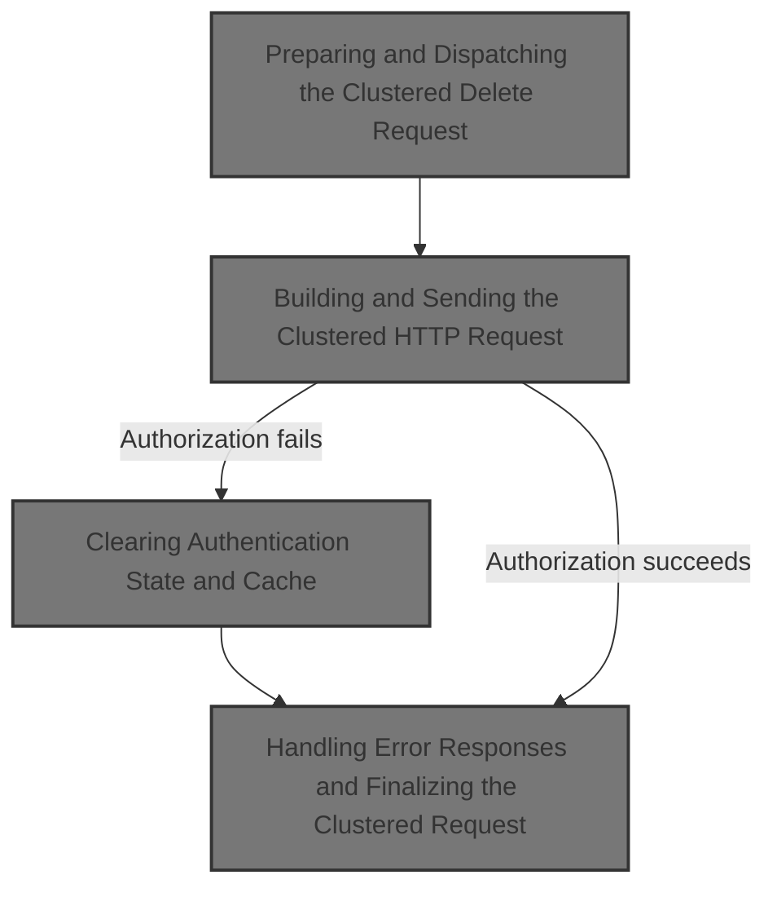

This document describes the flow for removing a resource from a Kubernetes cluster. The process selects the appropriate cluster, sends a removal request, and manages authentication and session state if authorization fails. Input is a removal request and cluster options; output is the result of the operation and any updates to authentication and session data.



# Where is this flow used?

This flow is used multiple times in the codebase as represented in the following diagram:

(Note - these are only some of the entry points of this flow)

```mermaid
graph TD;
      3e0eb8139d9a01980d464d1f7b56282926e9707ec06f0c55bdacf68730d17bc6(frontend/…/resourceMap/GraphView.tsx::GraphViewContent) --> aea418ebf887730e25075a63bfc85385c2d4d2b0ce74593778d152385fca1452(frontend/…/resourceMap/useQueryParamsState.tsx::useQueryParamsState)

3e0eb8139d9a01980d464d1f7b56282926e9707ec06f0c55bdacf68730d17bc6(frontend/…/resourceMap/GraphView.tsx::GraphViewContent) --> 1a700f8dedf0d69d3be141ca7ce44d688aad107a774deb8655e974d7d1d949af(frontend/…/k8s/KubeObject.ts::KubeObject.useList)

3e0eb8139d9a01980d464d1f7b56282926e9707ec06f0c55bdacf68730d17bc6(frontend/…/resourceMap/GraphView.tsx::GraphViewContent) --> 59c1f49aac3d793dbcab833698719c95b6a6e82d69ed2536bccf9dedb573a66b(frontend/…/definitions/sources.tsx::useGetAllSources)

aea418ebf887730e25075a63bfc85385c2d4d2b0ce74593778d152385fca1452(frontend/…/resourceMap/useQueryParamsState.tsx::useQueryParamsState) --> dff2cd7b91bf65d00a972016368d9730cf0690499c44242539a9cf87fdee45f3(frontend/…/k8s/KubeObject.ts::KubeObject.delete)

dff2cd7b91bf65d00a972016368d9730cf0690499c44242539a9cf87fdee45f3(frontend/…/k8s/KubeObject.ts::KubeObject.delete) --> 9fe45744fc67b69e446ff645e0675c7a9dd3c946c1ddea5d2942b6083adc6340(frontend/…/v1/factories.ts::delete)

9fe45744fc67b69e446ff645e0675c7a9dd3c946c1ddea5d2942b6083adc6340(frontend/…/v1/factories.ts::delete) --> 2f1abf35d81c7328e5e93d0461565214761a9c42f095208266139eafe7089aea(frontend/…/v1/clusterRequests.ts::remove):::mainFlowStyle

1a700f8dedf0d69d3be141ca7ce44d688aad107a774deb8655e974d7d1d949af(frontend/…/k8s/KubeObject.ts::KubeObject.useList) --> e5352f2ba81d4af4a93432f58471de6119d866f79097c6f53207912dcddb2c3a(frontend/…/v2/useKubeObjectList.ts::useKubeObjectList)

e5352f2ba81d4af4a93432f58471de6119d866f79097c6f53207912dcddb2c3a(frontend/…/v2/useKubeObjectList.ts::useKubeObjectList) --> 8ccd2eca55c37dd17a0ab2cfbc06dfb1cd6cdbc8b89ec9bd04db2ac1adf8510f(frontend/…/v2/useKubeObjectList.ts::useWatchKubeObjectLists)

8ccd2eca55c37dd17a0ab2cfbc06dfb1cd6cdbc8b89ec9bd04db2ac1adf8510f(frontend/…/v2/useKubeObjectList.ts::useWatchKubeObjectLists) --> cf109d78e65f95385144b9cdb6cd3e977cb79c6edeba8ec199c50368e75422fb(frontend/…/v2/useKubeObjectList.ts::useWatchKubeObjectListsMultiplexed)

8ccd2eca55c37dd17a0ab2cfbc06dfb1cd6cdbc8b89ec9bd04db2ac1adf8510f(frontend/…/v2/useKubeObjectList.ts::useWatchKubeObjectLists) --> 0de4bc56ca5b0998ee387c920c38c716657c470e38e3e9b41913cf975abd4df7(frontend/…/v2/useKubeObjectList.ts::useWatchKubeObjectListsLegacy)

cf109d78e65f95385144b9cdb6cd3e977cb79c6edeba8ec199c50368e75422fb(frontend/…/v2/useKubeObjectList.ts::useWatchKubeObjectListsMultiplexed) --> e2523a66a498cd5d917b26a5f04b90ddc9621dabb3dc656fddb4d735d7981741(frontend/…/v2/webSocket.ts::subscribe)

e2523a66a498cd5d917b26a5f04b90ddc9621dabb3dc656fddb4d735d7981741(frontend/…/v2/webSocket.ts::subscribe) --> 97d73f6151edfbf99a2f1b8c5c177d9d7c7a486b34ef68b91c74988f8e632621(frontend/…/v2/webSocket.ts::unsubscribe)

97d73f6151edfbf99a2f1b8c5c177d9d7c7a486b34ef68b91c74988f8e632621(frontend/…/v2/webSocket.ts::unsubscribe) --> dff2cd7b91bf65d00a972016368d9730cf0690499c44242539a9cf87fdee45f3(frontend/…/k8s/KubeObject.ts::KubeObject.delete)

0de4bc56ca5b0998ee387c920c38c716657c470e38e3e9b41913cf975abd4df7(frontend/…/v2/useKubeObjectList.ts::useWatchKubeObjectListsLegacy) --> 93345869ac2546fba259d16857628002d72ea7fa5064ac15f0b8f4803c9e88e8(frontend/…/v2/webSocket.ts::useWebSockets)

93345869ac2546fba259d16857628002d72ea7fa5064ac15f0b8f4803c9e88e8(frontend/…/v2/webSocket.ts::useWebSockets) --> 79bb169f744eca14545913c67ddbb8cf75bc112d241b0fb9678d800cace3e174(frontend/…/v2/webSocket.ts::openWebSocket)

93345869ac2546fba259d16857628002d72ea7fa5064ac15f0b8f4803c9e88e8(frontend/…/v2/webSocket.ts::useWebSockets) --> a30ad5bc8c09ff10a7aa20ada236bde4f3cc37a106d91ee70a07be9473f1503d(frontend/…/v2/webSocket.ts::connect)

93345869ac2546fba259d16857628002d72ea7fa5064ac15f0b8f4803c9e88e8(frontend/…/v2/webSocket.ts::useWebSockets) --> dff2cd7b91bf65d00a972016368d9730cf0690499c44242539a9cf87fdee45f3(frontend/…/k8s/KubeObject.ts::KubeObject.delete)

79bb169f744eca14545913c67ddbb8cf75bc112d241b0fb9678d800cace3e174(frontend/…/v2/webSocket.ts::openWebSocket) --> 4606a0d7af3bad76efed5ed463c15cc1571ae0a49b2f12a5302fcc14b66c405a(frontend/…/v2/hooks.ts::onMessage)

4606a0d7af3bad76efed5ed463c15cc1571ae0a49b2f12a5302fcc14b66c405a(frontend/…/v2/hooks.ts::onMessage) --> b6745d3bbbc290c3d8d0057162cfeb71e648ec72dccb61e788be4652addc1eed(frontend/…/v2/webSocket.ts::useWebSocket)

b6745d3bbbc290c3d8d0057162cfeb71e648ec72dccb61e788be4652addc1eed(frontend/…/v2/webSocket.ts::useWebSocket) --> e2523a66a498cd5d917b26a5f04b90ddc9621dabb3dc656fddb4d735d7981741(frontend/…/v2/webSocket.ts::subscribe)

b6745d3bbbc290c3d8d0057162cfeb71e648ec72dccb61e788be4652addc1eed(frontend/…/v2/webSocket.ts::useWebSocket) --> 4606a0d7af3bad76efed5ed463c15cc1571ae0a49b2f12a5302fcc14b66c405a(frontend/…/v2/hooks.ts::onMessage)

b6745d3bbbc290c3d8d0057162cfeb71e648ec72dccb61e788be4652addc1eed(frontend/…/v2/webSocket.ts::useWebSocket) --> 4eb905efa54e3e1a12f13ab6ff9779b4ae7a45db42dbd3d8e4df46f0d7e341f6(frontend/…/v2/webSocket.ts::connectWebSocket)

4eb905efa54e3e1a12f13ab6ff9779b4ae7a45db42dbd3d8e4df46f0d7e341f6(frontend/…/v2/webSocket.ts::connectWebSocket) --> e2523a66a498cd5d917b26a5f04b90ddc9621dabb3dc656fddb4d735d7981741(frontend/…/v2/webSocket.ts::subscribe)

a30ad5bc8c09ff10a7aa20ada236bde4f3cc37a106d91ee70a07be9473f1503d(frontend/…/v2/webSocket.ts::connect) --> 79bb169f744eca14545913c67ddbb8cf75bc112d241b0fb9678d800cace3e174(frontend/…/v2/webSocket.ts::openWebSocket)

a30ad5bc8c09ff10a7aa20ada236bde4f3cc37a106d91ee70a07be9473f1503d(frontend/…/v2/webSocket.ts::connect) --> dff2cd7b91bf65d00a972016368d9730cf0690499c44242539a9cf87fdee45f3(frontend/…/k8s/KubeObject.ts::KubeObject.delete)

59c1f49aac3d793dbcab833698719c95b6a6e82d69ed2536bccf9dedb573a66b(frontend/…/definitions/sources.tsx::useGetAllSources) --> 1a700f8dedf0d69d3be141ca7ce44d688aad107a774deb8655e974d7d1d949af(frontend/…/k8s/KubeObject.ts::KubeObject.useList)

3877936ed66287b8b37cfbe1b3357abe8f8e727ae0d0e28b1a1f7f954954568d(frontend/…/project/ProjectList.tsx::ProjectList) --> 685cb6efe89cbdecb96f92f48aed7ecf570b0623d5f4bb907d740929129900d7(frontend/…/project/useProjectResources.ts::useProjectItems)

3877936ed66287b8b37cfbe1b3357abe8f8e727ae0d0e28b1a1f7f954954568d(frontend/…/project/ProjectList.tsx::ProjectList) --> b1988d135c4a044e9af319d1d21e8cf78bbbb4c3d2c126c5f6030cef04508c9c(frontend/…/project/ProjectList.tsx::useProjects)

685cb6efe89cbdecb96f92f48aed7ecf570b0623d5f4bb907d740929129900d7(frontend/…/project/useProjectResources.ts::useProjectItems) --> 1443d34739bdacddccf826688f3618fd80fc1246cf434f58911c38e875bb06fc(frontend/…/utils/useKubeLists.tsx::useKubeLists)

1443d34739bdacddccf826688f3618fd80fc1246cf434f58911c38e875bb06fc(frontend/…/utils/useKubeLists.tsx::useKubeLists) --> 1a700f8dedf0d69d3be141ca7ce44d688aad107a774deb8655e974d7d1d949af(frontend/…/k8s/KubeObject.ts::KubeObject.useList)

b1988d135c4a044e9af319d1d21e8cf78bbbb4c3d2c126c5f6030cef04508c9c(frontend/…/project/ProjectList.tsx::useProjects) --> 1a700f8dedf0d69d3be141ca7ce44d688aad107a774deb8655e974d7d1d949af(frontend/…/k8s/KubeObject.ts::KubeObject.useList)

e3565f27ed50d7a4ca09e8ff5e67d66312ab9df76d0d24c305edec09ea955389(frontend/…/resourceMap/GraphView.tsx::GraphView) --> eb0529837b1caee2ddb903a1495d1f3e276faa63d8e1fb2a10a0450d6f39aa83(frontend/…/definitions/relations.tsx::useGetAllRelations)

e3565f27ed50d7a4ca09e8ff5e67d66312ab9df76d0d24c305edec09ea955389(frontend/…/resourceMap/GraphView.tsx::GraphView) --> 59c1f49aac3d793dbcab833698719c95b6a6e82d69ed2536bccf9dedb573a66b(frontend/…/definitions/sources.tsx::useGetAllSources)

eb0529837b1caee2ddb903a1495d1f3e276faa63d8e1fb2a10a0450d6f39aa83(frontend/…/definitions/relations.tsx::useGetAllRelations) --> a0d2ded8f46a8c82100b965740528d259f7adbe5c514ef9ecc22d96b6c34255a(frontend/…/definitions/relations.tsx::useGetCRToOwnerRelations)

a0d2ded8f46a8c82100b965740528d259f7adbe5c514ef9ecc22d96b6c34255a(frontend/…/definitions/relations.tsx::useGetCRToOwnerRelations) --> 1a700f8dedf0d69d3be141ca7ce44d688aad107a774deb8655e974d7d1d949af(frontend/…/k8s/KubeObject.ts::KubeObject.useList)

3e40fefa1670992d9a95ed99a1f2269c7e2d0f568cc61a9f8e8f6b397670a36c(frontend/…/v1/factories.ts::apiFactoryWithNamespace) --> 204f83a00fb70820fd25a6410ff1299f717260eae3da372ecbbbdc59e775a6b1(frontend/…/v1/factories.ts::simpleApiFactoryWithNamespace)

3e40fefa1670992d9a95ed99a1f2269c7e2d0f568cc61a9f8e8f6b397670a36c(frontend/…/v1/factories.ts::apiFactoryWithNamespace) --> baa2a3fe568435794ce15a7f1d4e6144fd642157b6c778dc554a58c6a2f77e19(frontend/…/v1/factories.ts::multipleApiFactoryWithNamespace)

204f83a00fb70820fd25a6410ff1299f717260eae3da372ecbbbdc59e775a6b1(frontend/…/v1/factories.ts::simpleApiFactoryWithNamespace) --> 2f1abf35d81c7328e5e93d0461565214761a9c42f095208266139eafe7089aea(frontend/…/v1/clusterRequests.ts::remove):::mainFlowStyle

baa2a3fe568435794ce15a7f1d4e6144fd642157b6c778dc554a58c6a2f77e19(frontend/…/v1/factories.ts::multipleApiFactoryWithNamespace) --> 204f83a00fb70820fd25a6410ff1299f717260eae3da372ecbbbdc59e775a6b1(frontend/…/v1/factories.ts::simpleApiFactoryWithNamespace)

d86ed78fbf2e13c724a9eaff4beabfe1d709c6e8ecb12dd16859025fe61c1f08(frontend/…/v1/factories.ts::apiFactory) --> 0a64466108d98c1725bf990ed4361ccdb3545bd3ecabf88410964c3c9c0ea257(frontend/…/v1/factories.ts::singleApiFactory)

d86ed78fbf2e13c724a9eaff4beabfe1d709c6e8ecb12dd16859025fe61c1f08(frontend/…/v1/factories.ts::apiFactory) --> a75e891440e1ed36b6e84857f71c17a3ae6d31870f2a33d9da491b0acef21f67(frontend/…/v1/factories.ts::multipleApiFactory)

0a64466108d98c1725bf990ed4361ccdb3545bd3ecabf88410964c3c9c0ea257(frontend/…/v1/factories.ts::singleApiFactory) --> 2f1abf35d81c7328e5e93d0461565214761a9c42f095208266139eafe7089aea(frontend/…/v1/clusterRequests.ts::remove):::mainFlowStyle

a75e891440e1ed36b6e84857f71c17a3ae6d31870f2a33d9da491b0acef21f67(frontend/…/v1/factories.ts::multipleApiFactory) --> 0a64466108d98c1725bf990ed4361ccdb3545bd3ecabf88410964c3c9c0ea257(frontend/…/v1/factories.ts::singleApiFactory)


classDef mainFlowStyle color:#000000,fill:#7CB9F4
classDef rootsStyle color:#000000,fill:#00FFF4
classDef Style1 color:#000000,fill:#00FFAA
classDef Style2 color:#000000,fill:#FFFF00
classDef Style3 color:#000000,fill:#AA7CB9

%% Swimm:
%% graph TD;
%%       3e0eb8139d9a01980d464d1f7b56282926e9707ec06f0c55bdacf68730d17bc6(<SwmPath>[frontend/…/resourceMap/GraphView.tsx](frontend/src/components/resourceMap/GraphView.tsx)</SwmPath>::GraphViewContent) --> aea418ebf887730e25075a63bfc85385c2d4d2b0ce74593778d152385fca1452(<SwmPath>[frontend/…/resourceMap/useQueryParamsState.tsx](frontend/src/components/resourceMap/useQueryParamsState.tsx)</SwmPath>::useQueryParamsState)
%% 
%% 3e0eb8139d9a01980d464d1f7b56282926e9707ec06f0c55bdacf68730d17bc6(<SwmPath>[frontend/…/resourceMap/GraphView.tsx](frontend/src/components/resourceMap/GraphView.tsx)</SwmPath>::GraphViewContent) --> 1a700f8dedf0d69d3be141ca7ce44d688aad107a774deb8655e974d7d1d949af(<SwmPath>[frontend/…/k8s/KubeObject.ts](frontend/src/lib/k8s/KubeObject.ts)</SwmPath>::KubeObject.useList)
%% 
%% 3e0eb8139d9a01980d464d1f7b56282926e9707ec06f0c55bdacf68730d17bc6(<SwmPath>[frontend/…/resourceMap/GraphView.tsx](frontend/src/components/resourceMap/GraphView.tsx)</SwmPath>::GraphViewContent) --> 59c1f49aac3d793dbcab833698719c95b6a6e82d69ed2536bccf9dedb573a66b(<SwmPath>[frontend/…/definitions/sources.tsx](frontend/src/components/resourceMap/sources/definitions/sources.tsx)</SwmPath>::useGetAllSources)
%% 
%% aea418ebf887730e25075a63bfc85385c2d4d2b0ce74593778d152385fca1452(<SwmPath>[frontend/…/resourceMap/useQueryParamsState.tsx](frontend/src/components/resourceMap/useQueryParamsState.tsx)</SwmPath>::useQueryParamsState) --> dff2cd7b91bf65d00a972016368d9730cf0690499c44242539a9cf87fdee45f3(<SwmPath>[frontend/…/k8s/KubeObject.ts](frontend/src/lib/k8s/KubeObject.ts)</SwmPath>::KubeObject.delete)
%% 
%% dff2cd7b91bf65d00a972016368d9730cf0690499c44242539a9cf87fdee45f3(<SwmPath>[frontend/…/k8s/KubeObject.ts](frontend/src/lib/k8s/KubeObject.ts)</SwmPath>::KubeObject.delete) --> 9fe45744fc67b69e446ff645e0675c7a9dd3c946c1ddea5d2942b6083adc6340(<SwmPath>[frontend/…/v1/factories.ts](frontend/src/lib/k8s/api/v1/factories.ts)</SwmPath>::delete)
%% 
%% 9fe45744fc67b69e446ff645e0675c7a9dd3c946c1ddea5d2942b6083adc6340(<SwmPath>[frontend/…/v1/factories.ts](frontend/src/lib/k8s/api/v1/factories.ts)</SwmPath>::delete) --> 2f1abf35d81c7328e5e93d0461565214761a9c42f095208266139eafe7089aea(<SwmPath>[frontend/…/v1/clusterRequests.ts](frontend/src/lib/k8s/api/v1/clusterRequests.ts)</SwmPath>::remove):::mainFlowStyle
%% 
%% 1a700f8dedf0d69d3be141ca7ce44d688aad107a774deb8655e974d7d1d949af(<SwmPath>[frontend/…/k8s/KubeObject.ts](frontend/src/lib/k8s/KubeObject.ts)</SwmPath>::KubeObject.useList) --> e5352f2ba81d4af4a93432f58471de6119d866f79097c6f53207912dcddb2c3a(<SwmPath>[frontend/…/v2/useKubeObjectList.ts](frontend/src/lib/k8s/api/v2/useKubeObjectList.ts)</SwmPath>::useKubeObjectList)
%% 
%% e5352f2ba81d4af4a93432f58471de6119d866f79097c6f53207912dcddb2c3a(<SwmPath>[frontend/…/v2/useKubeObjectList.ts](frontend/src/lib/k8s/api/v2/useKubeObjectList.ts)</SwmPath>::useKubeObjectList) --> 8ccd2eca55c37dd17a0ab2cfbc06dfb1cd6cdbc8b89ec9bd04db2ac1adf8510f(<SwmPath>[frontend/…/v2/useKubeObjectList.ts](frontend/src/lib/k8s/api/v2/useKubeObjectList.ts)</SwmPath>::useWatchKubeObjectLists)
%% 
%% 8ccd2eca55c37dd17a0ab2cfbc06dfb1cd6cdbc8b89ec9bd04db2ac1adf8510f(<SwmPath>[frontend/…/v2/useKubeObjectList.ts](frontend/src/lib/k8s/api/v2/useKubeObjectList.ts)</SwmPath>::useWatchKubeObjectLists) --> cf109d78e65f95385144b9cdb6cd3e977cb79c6edeba8ec199c50368e75422fb(<SwmPath>[frontend/…/v2/useKubeObjectList.ts](frontend/src/lib/k8s/api/v2/useKubeObjectList.ts)</SwmPath>::useWatchKubeObjectListsMultiplexed)
%% 
%% 8ccd2eca55c37dd17a0ab2cfbc06dfb1cd6cdbc8b89ec9bd04db2ac1adf8510f(<SwmPath>[frontend/…/v2/useKubeObjectList.ts](frontend/src/lib/k8s/api/v2/useKubeObjectList.ts)</SwmPath>::useWatchKubeObjectLists) --> 0de4bc56ca5b0998ee387c920c38c716657c470e38e3e9b41913cf975abd4df7(<SwmPath>[frontend/…/v2/useKubeObjectList.ts](frontend/src/lib/k8s/api/v2/useKubeObjectList.ts)</SwmPath>::useWatchKubeObjectListsLegacy)
%% 
%% cf109d78e65f95385144b9cdb6cd3e977cb79c6edeba8ec199c50368e75422fb(<SwmPath>[frontend/…/v2/useKubeObjectList.ts](frontend/src/lib/k8s/api/v2/useKubeObjectList.ts)</SwmPath>::useWatchKubeObjectListsMultiplexed) --> e2523a66a498cd5d917b26a5f04b90ddc9621dabb3dc656fddb4d735d7981741(<SwmPath>[frontend/…/v2/webSocket.ts](frontend/src/lib/k8s/api/v2/webSocket.ts)</SwmPath>::subscribe)
%% 
%% e2523a66a498cd5d917b26a5f04b90ddc9621dabb3dc656fddb4d735d7981741(<SwmPath>[frontend/…/v2/webSocket.ts](frontend/src/lib/k8s/api/v2/webSocket.ts)</SwmPath>::subscribe) --> 97d73f6151edfbf99a2f1b8c5c177d9d7c7a486b34ef68b91c74988f8e632621(<SwmPath>[frontend/…/v2/webSocket.ts](frontend/src/lib/k8s/api/v2/webSocket.ts)</SwmPath>::unsubscribe)
%% 
%% 97d73f6151edfbf99a2f1b8c5c177d9d7c7a486b34ef68b91c74988f8e632621(<SwmPath>[frontend/…/v2/webSocket.ts](frontend/src/lib/k8s/api/v2/webSocket.ts)</SwmPath>::unsubscribe) --> dff2cd7b91bf65d00a972016368d9730cf0690499c44242539a9cf87fdee45f3(<SwmPath>[frontend/…/k8s/KubeObject.ts](frontend/src/lib/k8s/KubeObject.ts)</SwmPath>::KubeObject.delete)
%% 
%% 0de4bc56ca5b0998ee387c920c38c716657c470e38e3e9b41913cf975abd4df7(<SwmPath>[frontend/…/v2/useKubeObjectList.ts](frontend/src/lib/k8s/api/v2/useKubeObjectList.ts)</SwmPath>::useWatchKubeObjectListsLegacy) --> 93345869ac2546fba259d16857628002d72ea7fa5064ac15f0b8f4803c9e88e8(<SwmPath>[frontend/…/v2/webSocket.ts](frontend/src/lib/k8s/api/v2/webSocket.ts)</SwmPath>::useWebSockets)
%% 
%% 93345869ac2546fba259d16857628002d72ea7fa5064ac15f0b8f4803c9e88e8(<SwmPath>[frontend/…/v2/webSocket.ts](frontend/src/lib/k8s/api/v2/webSocket.ts)</SwmPath>::useWebSockets) --> 79bb169f744eca14545913c67ddbb8cf75bc112d241b0fb9678d800cace3e174(<SwmPath>[frontend/…/v2/webSocket.ts](frontend/src/lib/k8s/api/v2/webSocket.ts)</SwmPath>::openWebSocket)
%% 
%% 93345869ac2546fba259d16857628002d72ea7fa5064ac15f0b8f4803c9e88e8(<SwmPath>[frontend/…/v2/webSocket.ts](frontend/src/lib/k8s/api/v2/webSocket.ts)</SwmPath>::useWebSockets) --> a30ad5bc8c09ff10a7aa20ada236bde4f3cc37a106d91ee70a07be9473f1503d(<SwmPath>[frontend/…/v2/webSocket.ts](frontend/src/lib/k8s/api/v2/webSocket.ts)</SwmPath>::connect)
%% 
%% 93345869ac2546fba259d16857628002d72ea7fa5064ac15f0b8f4803c9e88e8(<SwmPath>[frontend/…/v2/webSocket.ts](frontend/src/lib/k8s/api/v2/webSocket.ts)</SwmPath>::useWebSockets) --> dff2cd7b91bf65d00a972016368d9730cf0690499c44242539a9cf87fdee45f3(<SwmPath>[frontend/…/k8s/KubeObject.ts](frontend/src/lib/k8s/KubeObject.ts)</SwmPath>::KubeObject.delete)
%% 
%% 79bb169f744eca14545913c67ddbb8cf75bc112d241b0fb9678d800cace3e174(<SwmPath>[frontend/…/v2/webSocket.ts](frontend/src/lib/k8s/api/v2/webSocket.ts)</SwmPath>::openWebSocket) --> 4606a0d7af3bad76efed5ed463c15cc1571ae0a49b2f12a5302fcc14b66c405a(<SwmPath>[frontend/…/v2/hooks.ts](frontend/src/lib/k8s/api/v2/hooks.ts)</SwmPath>::onMessage)
%% 
%% 4606a0d7af3bad76efed5ed463c15cc1571ae0a49b2f12a5302fcc14b66c405a(<SwmPath>[frontend/…/v2/hooks.ts](frontend/src/lib/k8s/api/v2/hooks.ts)</SwmPath>::onMessage) --> b6745d3bbbc290c3d8d0057162cfeb71e648ec72dccb61e788be4652addc1eed(<SwmPath>[frontend/…/v2/webSocket.ts](frontend/src/lib/k8s/api/v2/webSocket.ts)</SwmPath>::useWebSocket)
%% 
%% b6745d3bbbc290c3d8d0057162cfeb71e648ec72dccb61e788be4652addc1eed(<SwmPath>[frontend/…/v2/webSocket.ts](frontend/src/lib/k8s/api/v2/webSocket.ts)</SwmPath>::useWebSocket) --> e2523a66a498cd5d917b26a5f04b90ddc9621dabb3dc656fddb4d735d7981741(<SwmPath>[frontend/…/v2/webSocket.ts](frontend/src/lib/k8s/api/v2/webSocket.ts)</SwmPath>::subscribe)
%% 
%% b6745d3bbbc290c3d8d0057162cfeb71e648ec72dccb61e788be4652addc1eed(<SwmPath>[frontend/…/v2/webSocket.ts](frontend/src/lib/k8s/api/v2/webSocket.ts)</SwmPath>::useWebSocket) --> 4606a0d7af3bad76efed5ed463c15cc1571ae0a49b2f12a5302fcc14b66c405a(<SwmPath>[frontend/…/v2/hooks.ts](frontend/src/lib/k8s/api/v2/hooks.ts)</SwmPath>::onMessage)
%% 
%% b6745d3bbbc290c3d8d0057162cfeb71e648ec72dccb61e788be4652addc1eed(<SwmPath>[frontend/…/v2/webSocket.ts](frontend/src/lib/k8s/api/v2/webSocket.ts)</SwmPath>::useWebSocket) --> 4eb905efa54e3e1a12f13ab6ff9779b4ae7a45db42dbd3d8e4df46f0d7e341f6(<SwmPath>[frontend/…/v2/webSocket.ts](frontend/src/lib/k8s/api/v2/webSocket.ts)</SwmPath>::connectWebSocket)
%% 
%% 4eb905efa54e3e1a12f13ab6ff9779b4ae7a45db42dbd3d8e4df46f0d7e341f6(<SwmPath>[frontend/…/v2/webSocket.ts](frontend/src/lib/k8s/api/v2/webSocket.ts)</SwmPath>::connectWebSocket) --> e2523a66a498cd5d917b26a5f04b90ddc9621dabb3dc656fddb4d735d7981741(<SwmPath>[frontend/…/v2/webSocket.ts](frontend/src/lib/k8s/api/v2/webSocket.ts)</SwmPath>::subscribe)
%% 
%% a30ad5bc8c09ff10a7aa20ada236bde4f3cc37a106d91ee70a07be9473f1503d(<SwmPath>[frontend/…/v2/webSocket.ts](frontend/src/lib/k8s/api/v2/webSocket.ts)</SwmPath>::connect) --> 79bb169f744eca14545913c67ddbb8cf75bc112d241b0fb9678d800cace3e174(<SwmPath>[frontend/…/v2/webSocket.ts](frontend/src/lib/k8s/api/v2/webSocket.ts)</SwmPath>::openWebSocket)
%% 
%% a30ad5bc8c09ff10a7aa20ada236bde4f3cc37a106d91ee70a07be9473f1503d(<SwmPath>[frontend/…/v2/webSocket.ts](frontend/src/lib/k8s/api/v2/webSocket.ts)</SwmPath>::connect) --> dff2cd7b91bf65d00a972016368d9730cf0690499c44242539a9cf87fdee45f3(<SwmPath>[frontend/…/k8s/KubeObject.ts](frontend/src/lib/k8s/KubeObject.ts)</SwmPath>::KubeObject.delete)
%% 
%% 59c1f49aac3d793dbcab833698719c95b6a6e82d69ed2536bccf9dedb573a66b(<SwmPath>[frontend/…/definitions/sources.tsx](frontend/src/components/resourceMap/sources/definitions/sources.tsx)</SwmPath>::useGetAllSources) --> 1a700f8dedf0d69d3be141ca7ce44d688aad107a774deb8655e974d7d1d949af(<SwmPath>[frontend/…/k8s/KubeObject.ts](frontend/src/lib/k8s/KubeObject.ts)</SwmPath>::KubeObject.useList)
%% 
%% 3877936ed66287b8b37cfbe1b3357abe8f8e727ae0d0e28b1a1f7f954954568d(<SwmPath>[frontend/…/project/ProjectList.tsx](frontend/src/components/project/ProjectList.tsx)</SwmPath>::ProjectList) --> 685cb6efe89cbdecb96f92f48aed7ecf570b0623d5f4bb907d740929129900d7(<SwmPath>[frontend/…/project/useProjectResources.ts](frontend/src/components/project/useProjectResources.ts)</SwmPath>::useProjectItems)
%% 
%% 3877936ed66287b8b37cfbe1b3357abe8f8e727ae0d0e28b1a1f7f954954568d(<SwmPath>[frontend/…/project/ProjectList.tsx](frontend/src/components/project/ProjectList.tsx)</SwmPath>::ProjectList) --> b1988d135c4a044e9af319d1d21e8cf78bbbb4c3d2c126c5f6030cef04508c9c(<SwmPath>[frontend/…/project/ProjectList.tsx](frontend/src/components/project/ProjectList.tsx)</SwmPath>::useProjects)
%% 
%% 685cb6efe89cbdecb96f92f48aed7ecf570b0623d5f4bb907d740929129900d7(<SwmPath>[frontend/…/project/useProjectResources.ts](frontend/src/components/project/useProjectResources.ts)</SwmPath>::useProjectItems) --> 1443d34739bdacddccf826688f3618fd80fc1246cf434f58911c38e875bb06fc(<SwmPath>[frontend/…/utils/useKubeLists.tsx](frontend/src/components/advancedSearch/utils/useKubeLists.tsx)</SwmPath>::useKubeLists)
%% 
%% 1443d34739bdacddccf826688f3618fd80fc1246cf434f58911c38e875bb06fc(<SwmPath>[frontend/…/utils/useKubeLists.tsx](frontend/src/components/advancedSearch/utils/useKubeLists.tsx)</SwmPath>::useKubeLists) --> 1a700f8dedf0d69d3be141ca7ce44d688aad107a774deb8655e974d7d1d949af(<SwmPath>[frontend/…/k8s/KubeObject.ts](frontend/src/lib/k8s/KubeObject.ts)</SwmPath>::KubeObject.useList)
%% 
%% b1988d135c4a044e9af319d1d21e8cf78bbbb4c3d2c126c5f6030cef04508c9c(<SwmPath>[frontend/…/project/ProjectList.tsx](frontend/src/components/project/ProjectList.tsx)</SwmPath>::useProjects) --> 1a700f8dedf0d69d3be141ca7ce44d688aad107a774deb8655e974d7d1d949af(<SwmPath>[frontend/…/k8s/KubeObject.ts](frontend/src/lib/k8s/KubeObject.ts)</SwmPath>::KubeObject.useList)
%% 
%% e3565f27ed50d7a4ca09e8ff5e67d66312ab9df76d0d24c305edec09ea955389(<SwmPath>[frontend/…/resourceMap/GraphView.tsx](frontend/src/components/resourceMap/GraphView.tsx)</SwmPath>::GraphView) --> eb0529837b1caee2ddb903a1495d1f3e276faa63d8e1fb2a10a0450d6f39aa83(<SwmPath>[frontend/…/definitions/relations.tsx](frontend/src/components/resourceMap/sources/definitions/relations.tsx)</SwmPath>::useGetAllRelations)
%% 
%% e3565f27ed50d7a4ca09e8ff5e67d66312ab9df76d0d24c305edec09ea955389(<SwmPath>[frontend/…/resourceMap/GraphView.tsx](frontend/src/components/resourceMap/GraphView.tsx)</SwmPath>::GraphView) --> 59c1f49aac3d793dbcab833698719c95b6a6e82d69ed2536bccf9dedb573a66b(<SwmPath>[frontend/…/definitions/sources.tsx](frontend/src/components/resourceMap/sources/definitions/sources.tsx)</SwmPath>::useGetAllSources)
%% 
%% eb0529837b1caee2ddb903a1495d1f3e276faa63d8e1fb2a10a0450d6f39aa83(<SwmPath>[frontend/…/definitions/relations.tsx](frontend/src/components/resourceMap/sources/definitions/relations.tsx)</SwmPath>::useGetAllRelations) --> a0d2ded8f46a8c82100b965740528d259f7adbe5c514ef9ecc22d96b6c34255a(<SwmPath>[frontend/…/definitions/relations.tsx](frontend/src/components/resourceMap/sources/definitions/relations.tsx)</SwmPath>::useGetCRToOwnerRelations)
%% 
%% a0d2ded8f46a8c82100b965740528d259f7adbe5c514ef9ecc22d96b6c34255a(<SwmPath>[frontend/…/definitions/relations.tsx](frontend/src/components/resourceMap/sources/definitions/relations.tsx)</SwmPath>::useGetCRToOwnerRelations) --> 1a700f8dedf0d69d3be141ca7ce44d688aad107a774deb8655e974d7d1d949af(<SwmPath>[frontend/…/k8s/KubeObject.ts](frontend/src/lib/k8s/KubeObject.ts)</SwmPath>::KubeObject.useList)
%% 
%% 3e40fefa1670992d9a95ed99a1f2269c7e2d0f568cc61a9f8e8f6b397670a36c(<SwmPath>[frontend/…/v1/factories.ts](frontend/src/lib/k8s/api/v1/factories.ts)</SwmPath>::apiFactoryWithNamespace) --> 204f83a00fb70820fd25a6410ff1299f717260eae3da372ecbbbdc59e775a6b1(<SwmPath>[frontend/…/v1/factories.ts](frontend/src/lib/k8s/api/v1/factories.ts)</SwmPath>::simpleApiFactoryWithNamespace)
%% 
%% 3e40fefa1670992d9a95ed99a1f2269c7e2d0f568cc61a9f8e8f6b397670a36c(<SwmPath>[frontend/…/v1/factories.ts](frontend/src/lib/k8s/api/v1/factories.ts)</SwmPath>::apiFactoryWithNamespace) --> baa2a3fe568435794ce15a7f1d4e6144fd642157b6c778dc554a58c6a2f77e19(<SwmPath>[frontend/…/v1/factories.ts](frontend/src/lib/k8s/api/v1/factories.ts)</SwmPath>::multipleApiFactoryWithNamespace)
%% 
%% 204f83a00fb70820fd25a6410ff1299f717260eae3da372ecbbbdc59e775a6b1(<SwmPath>[frontend/…/v1/factories.ts](frontend/src/lib/k8s/api/v1/factories.ts)</SwmPath>::simpleApiFactoryWithNamespace) --> 2f1abf35d81c7328e5e93d0461565214761a9c42f095208266139eafe7089aea(<SwmPath>[frontend/…/v1/clusterRequests.ts](frontend/src/lib/k8s/api/v1/clusterRequests.ts)</SwmPath>::remove):::mainFlowStyle
%% 
%% baa2a3fe568435794ce15a7f1d4e6144fd642157b6c778dc554a58c6a2f77e19(<SwmPath>[frontend/…/v1/factories.ts](frontend/src/lib/k8s/api/v1/factories.ts)</SwmPath>::multipleApiFactoryWithNamespace) --> 204f83a00fb70820fd25a6410ff1299f717260eae3da372ecbbbdc59e775a6b1(<SwmPath>[frontend/…/v1/factories.ts](frontend/src/lib/k8s/api/v1/factories.ts)</SwmPath>::simpleApiFactoryWithNamespace)
%% 
%% d86ed78fbf2e13c724a9eaff4beabfe1d709c6e8ecb12dd16859025fe61c1f08(<SwmPath>[frontend/…/v1/factories.ts](frontend/src/lib/k8s/api/v1/factories.ts)</SwmPath>::apiFactory) --> 0a64466108d98c1725bf990ed4361ccdb3545bd3ecabf88410964c3c9c0ea257(<SwmPath>[frontend/…/v1/factories.ts](frontend/src/lib/k8s/api/v1/factories.ts)</SwmPath>::singleApiFactory)
%% 
%% d86ed78fbf2e13c724a9eaff4beabfe1d709c6e8ecb12dd16859025fe61c1f08(<SwmPath>[frontend/…/v1/factories.ts](frontend/src/lib/k8s/api/v1/factories.ts)</SwmPath>::apiFactory) --> a75e891440e1ed36b6e84857f71c17a3ae6d31870f2a33d9da491b0acef21f67(<SwmPath>[frontend/…/v1/factories.ts](frontend/src/lib/k8s/api/v1/factories.ts)</SwmPath>::multipleApiFactory)
%% 
%% 0a64466108d98c1725bf990ed4361ccdb3545bd3ecabf88410964c3c9c0ea257(<SwmPath>[frontend/…/v1/factories.ts](frontend/src/lib/k8s/api/v1/factories.ts)</SwmPath>::singleApiFactory) --> 2f1abf35d81c7328e5e93d0461565214761a9c42f095208266139eafe7089aea(<SwmPath>[frontend/…/v1/clusterRequests.ts](frontend/src/lib/k8s/api/v1/clusterRequests.ts)</SwmPath>::remove):::mainFlowStyle
%% 
%% a75e891440e1ed36b6e84857f71c17a3ae6d31870f2a33d9da491b0acef21f67(<SwmPath>[frontend/…/v1/factories.ts](frontend/src/lib/k8s/api/v1/factories.ts)</SwmPath>::multipleApiFactory) --> 0a64466108d98c1725bf990ed4361ccdb3545bd3ecabf88410964c3c9c0ea257(<SwmPath>[frontend/…/v1/factories.ts](frontend/src/lib/k8s/api/v1/factories.ts)</SwmPath>::singleApiFactory)
%% 
%% 
%% classDef mainFlowStyle color:#000000,fill:#7CB9F4
%% classDef rootsStyle color:#000000,fill:#00FFF4
%% classDef Style1 color:#000000,fill:#00FFAA
%% classDef Style2 color:#000000,fill:#FFFF00
%% classDef Style3 color:#000000,fill:#AA7CB9
```

# Preparing and Dispatching the Clustered Delete Request

```mermaid
%%{init: {"flowchart": {"defaultRenderer": "elk"}} }%%
flowchart TD
  node1{"Is a cluster specified in options?"}
  click node1 openCode "frontend/src/lib/k8s/api/v1/clusterRequests.ts:285:286"
  node1 -->|"Yes"| node2["Select specified cluster for removal"]
  click node2 openCode "frontend/src/lib/k8s/api/v1/clusterRequests.ts:286:286"
  node1 -->|"No"| node3{"Is there a current cluster context?"}
  click node3 openCode "frontend/src/lib/k8s/api/v1/clusterRequests.ts:286:286"
  node3 -->|"Yes"| node4["Select current cluster for removal"]
  click node4 openCode "frontend/src/lib/k8s/api/v1/clusterRequests.ts:286:286"
  node3 -->|"No"| node5["Select default cluster for removal"]
  click node5 openCode "frontend/src/lib/k8s/api/v1/clusterRequests.ts:286:286"
  node2 --> node6["Prepare DELETE request with options"]
  click node6 openCode "frontend/src/lib/k8s/api/v1/clusterRequests.ts:287:287"
  node4 --> node6
  node5 --> node6
  node6 --> node7["Send removal request to Kubernetes API"]
  click node7 openCode "frontend/src/lib/k8s/api/v1/clusterRequests.ts:288:288"

classDef HeadingStyle fill:#777777,stroke:#333,stroke-width:2px;

%% Swimm:
%% %%{init: {"flowchart": {"defaultRenderer": "elk"}} }%%
%% flowchart TD
%%   node1{"Is a cluster specified in options?"}
%%   click node1 openCode "<SwmPath>[frontend/…/v1/clusterRequests.ts](frontend/src/lib/k8s/api/v1/clusterRequests.ts)</SwmPath>:285:286"
%%   node1 -->|"Yes"| node2["Select specified cluster for removal"]
%%   click node2 openCode "<SwmPath>[frontend/…/v1/clusterRequests.ts](frontend/src/lib/k8s/api/v1/clusterRequests.ts)</SwmPath>:286:286"
%%   node1 -->|"No"| node3{"Is there a current cluster context?"}
%%   click node3 openCode "<SwmPath>[frontend/…/v1/clusterRequests.ts](frontend/src/lib/k8s/api/v1/clusterRequests.ts)</SwmPath>:286:286"
%%   node3 -->|"Yes"| node4["Select current cluster for removal"]
%%   click node4 openCode "<SwmPath>[frontend/…/v1/clusterRequests.ts](frontend/src/lib/k8s/api/v1/clusterRequests.ts)</SwmPath>:286:286"
%%   node3 -->|"No"| node5["Select default cluster for removal"]
%%   click node5 openCode "<SwmPath>[frontend/…/v1/clusterRequests.ts](frontend/src/lib/k8s/api/v1/clusterRequests.ts)</SwmPath>:286:286"
%%   node2 --> node6["Prepare DELETE request with options"]
%%   click node6 openCode "<SwmPath>[frontend/…/v1/clusterRequests.ts](frontend/src/lib/k8s/api/v1/clusterRequests.ts)</SwmPath>:287:287"
%%   node4 --> node6
%%   node5 --> node6
%%   node6 --> node7["Send removal request to Kubernetes API"]
%%   click node7 openCode "<SwmPath>[frontend/…/v1/clusterRequests.ts](frontend/src/lib/k8s/api/v1/clusterRequests.ts)</SwmPath>:288:288"
%% 
%% classDef HeadingStyle fill:#777777,stroke:#333,stroke-width:2px;
```



<SwmSnippet path="/frontend/src/lib/k8s/api/v1/clusterRequests.ts" line="283">

---

<SwmToken path="frontend/src/lib/k8s/api/v1/clusterRequests.ts" pos="283:4:4" line-data="export function remove(url: string, requestOptions: ClusterRequestParams = {}) {">`remove`</SwmToken> sets up the clustered DELETE request and passes control to <SwmToken path="frontend/src/lib/k8s/api/v1/clusterRequests.ts" pos="288:3:3" line-data="  return clusterRequest(url, opts);">`clusterRequest`</SwmToken> to handle the actual HTTP call.

```typescript
export function remove(url: string, requestOptions: ClusterRequestParams = {}) {
  console.log(url, requestOptions);
  const { cluster: clusterName, ...restOptions } = requestOptions;
  const cluster = clusterName || getCluster() || '';
  const opts = { method: 'DELETE', headers: JSON_HEADERS, cluster, ...restOptions };
  return clusterRequest(url, opts);
}
```

---

</SwmSnippet>

# Building and Sending the Clustered HTTP Request

```mermaid
%%{init: {"flowchart": {"defaultRenderer": "elk"}} }%%
flowchart TD
    node1["Send request to cluster"] --> node2{"Is response OK?"}
    click node1 openCode "frontend/src/lib/k8s/api/v1/clusterRequests.ts:122:190"
    node2 -->|"Yes"| node3["Return response (parsed as JSON if needed)"]
    click node2 openCode "frontend/src/lib/k8s/api/v1/clusterRequests.ts:190:191"
    click node3 openCode "frontend/src/lib/k8s/api/v1/clusterRequests.ts:218:223"
    node2 -->|"No"| node4{"Should logout due to auth error?"}
    click node4 openCode "frontend/src/lib/k8s/api/v1/clusterRequests.ts:192:195"
    node4 -->|"Yes"| node5["Clearing Authentication State and Cache"]
    
    node4 -->|"No"| node3
classDef HeadingStyle fill:#777777,stroke:#333,stroke-width:2px;
click node5 goToHeading "Clearing Authentication State and Cache"
node5:::HeadingStyle

%% Swimm:
%% %%{init: {"flowchart": {"defaultRenderer": "elk"}} }%%
%% flowchart TD
%%     node1["Send request to cluster"] --> node2{"Is response OK?"}
%%     click node1 openCode "<SwmPath>[frontend/…/v1/clusterRequests.ts](frontend/src/lib/k8s/api/v1/clusterRequests.ts)</SwmPath>:122:190"
%%     node2 -->|"Yes"| node3["Return response (parsed as JSON if needed)"]
%%     click node2 openCode "<SwmPath>[frontend/…/v1/clusterRequests.ts](frontend/src/lib/k8s/api/v1/clusterRequests.ts)</SwmPath>:190:191"
%%     click node3 openCode "<SwmPath>[frontend/…/v1/clusterRequests.ts](frontend/src/lib/k8s/api/v1/clusterRequests.ts)</SwmPath>:218:223"
%%     node2 -->|"No"| node4{"Should logout due to auth error?"}
%%     click node4 openCode "<SwmPath>[frontend/…/v1/clusterRequests.ts](frontend/src/lib/k8s/api/v1/clusterRequests.ts)</SwmPath>:192:195"
%%     node4 -->|"Yes"| node5["Clearing Authentication State and Cache"]
%%     
%%     node4 -->|"No"| node3
%% classDef HeadingStyle fill:#777777,stroke:#333,stroke-width:2px;
%% click node5 goToHeading "Clearing Authentication State and Cache"
%% node5:::HeadingStyle
```



<SwmSnippet path="/frontend/src/lib/k8s/api/v1/clusterRequests.ts" line="122">

---

In <SwmToken path="frontend/src/lib/k8s/api/v1/clusterRequests.ts" pos="122:6:6" line-data="export async function clusterRequest(">`clusterRequest`</SwmToken>, we build the request with cluster and user info, handle timeouts, and check for backend signals like <SwmToken path="frontend/src/lib/k8s/api/v1/clusterRequests.ts" pos="185:14:16" line-data="  const headerVal = response.headers.get(&#39;X-Reload&#39;);">`X-Reload`</SwmToken>. If we hit a 401 with Authorization, we call logout to clear the user's session and cached data, prepping for re-authentication.

```typescript
export async function clusterRequest(
  path: string,
  params: ClusterRequestParams = {},
  queryParams?: QueryParameters
): Promise<any> {
  interface RequestHeaders {
    Authorization?: string;
    cluster?: string;
    autoLogoutOnAuthError?: boolean;
    [otherHeader: string]: any;
  }

  const {
    timeout = DEFAULT_TIMEOUT,
    cluster: paramsCluster,
    autoLogoutOnAuthError = true,
    isJSON = true,
    ...otherParams
  } = params;

  const userID = getUserIdFromLocalStorage();
  const opts: { headers: RequestHeaders } = Object.assign({ headers: {} }, otherParams);
  const cluster = paramsCluster || '';

  let fullPath = path;
  if (cluster) {
    const kubeconfig = await findKubeconfigByClusterName(cluster);
    if (kubeconfig !== null) {
      opts.headers['KUBECONFIG'] = kubeconfig;
      opts.headers['X-HEADLAMP-USER-ID'] = userID;
    }

    fullPath = combinePath(`/${CLUSTERS_PREFIX}/${cluster}`, path);
  }

  const controller = new AbortController();
  const id = setTimeout(() => controller.abort(), timeout);

  let url = combinePath(getAppUrl(), fullPath);
  url += asQuery(queryParams);
  const requestData = {
    signal: controller.signal,
    credentials: 'include' as RequestCredentials,
    ...opts,
  };
  if (isBackstage()) {
    requestData.headers = addBackstageAuthHeaders(requestData.headers);
  }
  let response: Response = new Response(undefined, { status: 502, statusText: 'Unreachable' });
  try {
    response = await fetch(url, requestData);
  } catch (err) {
    if (err instanceof Error) {
      if (err.name === 'AbortError') {
        response = new Response(undefined, { status: 408, statusText: 'Request timed-out' });
      }
    }
  } finally {
    clearTimeout(id);
  }

  // The backend signals through this header that it wants a reload.
  // See plugins.go
  const headerVal = response.headers.get('X-Reload');
  if (headerVal && headerVal.indexOf('reload') !== -1) {
    window.location.reload();
  }

  if (!response.ok) {
    const { status, statusText } = response;
    if (autoLogoutOnAuthError && status === 401 && opts.headers.Authorization) {
      console.error('Logging out due to auth error', { status, statusText, path });
      logout(cluster);
    }

```

---

</SwmSnippet>

## Clearing Authentication State and Cache

<SwmSnippet path="/frontend/src/lib/auth.ts" line="131">

---

<SwmToken path="frontend/src/lib/auth.ts" pos="131:6:6" line-data="export async function logout(cluster: string) {">`logout`</SwmToken> sets the cluster token to null and clears cached queries for authentication and cluster user info. This wipes out any session data tied to the cluster, making sure the user is fully logged out.

```typescript
export async function logout(cluster: string) {
  return setToken(cluster, null).then(() => {
    queryClient.removeQueries({ queryKey: ['auth'], exact: false });
    queryClient.removeQueries({ queryKey: ['clusterMe', cluster], exact: true });
  });
}
```

---

</SwmSnippet>

## Updating Token and Managing Cluster Query Cache

```mermaid
%%{init: {"flowchart": {"defaultRenderer": "elk"}} }%%
flowchart TD
  node1["Start: Set or remove authentication token for a cluster"]
  click node1 openCode "frontend/src/lib/auth.ts:108:123"
  node1 --> node2{"Is a custom token setter provided?"}
  click node2 openCode "frontend/src/lib/auth.ts:109:110"
  node2 -->|"Yes"| node3["Use custom method to set/remove token for cluster"]
  click node3 openCode "frontend/src/lib/auth.ts:111:112"
  node2 -->|"No"| node4["Set or remove token using default method"]
  click node4 openCode "frontend/src/lib/auth.ts:114:122"
  node4 --> node5{"Is token present?"}
  click node5 openCode "frontend/src/lib/auth.ts:115:119"
  node5 -->|"Yes (token set)"| node6["Refresh user session data for cluster"]
  click node6 openCode "frontend/src/lib/auth.ts:116:116"
  node5 -->|"No (token removed)"| node7["Remove user session data for cluster"]
  click node7 openCode "frontend/src/lib/auth.ts:118:118"
  node6 --> node8["Token and session state updated"]
  node7 --> node8
  node3 --> node8
  click node8 openCode "frontend/src/lib/auth.ts:121:122"
classDef HeadingStyle fill:#777777,stroke:#333,stroke-width:2px;

%% Swimm:
%% %%{init: {"flowchart": {"defaultRenderer": "elk"}} }%%
%% flowchart TD
%%   node1["Start: Set or remove authentication token for a cluster"]
%%   click node1 openCode "<SwmPath>[frontend/…/lib/auth.ts](frontend/src/lib/auth.ts)</SwmPath>:108:123"
%%   node1 --> node2{"Is a custom token setter provided?"}
%%   click node2 openCode "<SwmPath>[frontend/…/lib/auth.ts](frontend/src/lib/auth.ts)</SwmPath>:109:110"
%%   node2 -->|"Yes"| node3["Use custom method to set/remove token for cluster"]
%%   click node3 openCode "<SwmPath>[frontend/…/lib/auth.ts](frontend/src/lib/auth.ts)</SwmPath>:111:112"
%%   node2 -->|"No"| node4["Set or remove token using default method"]
%%   click node4 openCode "<SwmPath>[frontend/…/lib/auth.ts](frontend/src/lib/auth.ts)</SwmPath>:114:122"
%%   node4 --> node5{"Is token present?"}
%%   click node5 openCode "<SwmPath>[frontend/…/lib/auth.ts](frontend/src/lib/auth.ts)</SwmPath>:115:119"
%%   node5 -->|"Yes (token set)"| node6["Refresh user session data for cluster"]
%%   click node6 openCode "<SwmPath>[frontend/…/lib/auth.ts](frontend/src/lib/auth.ts)</SwmPath>:116:116"
%%   node5 -->|"No (token removed)"| node7["Remove user session data for cluster"]
%%   click node7 openCode "<SwmPath>[frontend/…/lib/auth.ts](frontend/src/lib/auth.ts)</SwmPath>:118:118"
%%   node6 --> node8["Token and session state updated"]
%%   node7 --> node8
%%   node3 --> node8
%%   click node8 openCode "<SwmPath>[frontend/…/lib/auth.ts](frontend/src/lib/auth.ts)</SwmPath>:121:122"
%% classDef HeadingStyle fill:#777777,stroke:#333,stroke-width:2px;
```



<SwmSnippet path="/frontend/src/lib/auth.ts" line="108">

---

<SwmToken path="frontend/src/lib/auth.ts" pos="108:4:4" line-data="export function setToken(cluster: string, token: string | null) {">`setToken`</SwmToken> checks for a custom override to set the token. If none is found, it uses <SwmToken path="frontend/src/lib/auth.ts" pos="114:3:3" line-data="  return setCookieToken(cluster, token).then(result =&gt; {">`setCookieToken`</SwmToken> and then updates or removes cluster-specific queries in the cache based on whether the token is present. This keeps the app state in sync with the token.

```typescript
export function setToken(cluster: string, token: string | null) {
  const setTokenMethodToUse = store.getState().ui.functionsToOverride.setToken;
  if (setTokenMethodToUse) {
    return Promise.resolve(setTokenMethodToUse(cluster, token));
  }

  return setCookieToken(cluster, token).then(result => {
    if (token) {
      queryClient.invalidateQueries({ queryKey: ['clusterMe', cluster], exact: true });
    } else {
      queryClient.removeQueries({ queryKey: ['clusterMe', cluster], exact: true });
    }

    return result;
  });
}
```

---

</SwmSnippet>

## Persisting Token via Backend and Handling Response

<SwmSnippet path="/frontend/src/lib/auth.ts" line="79">

---

<SwmToken path="frontend/src/lib/auth.ts" pos="79:4:4" line-data="async function setCookieToken(cluster: string, token: string | null) {">`setCookieToken`</SwmToken> sends the token to the backend using <SwmToken path="frontend/src/lib/auth.ts" pos="81:9:9" line-data="    const response = await backendFetch(`/clusters/${cluster}/set-token`, {">`backendFetch`</SwmToken>. If the backend doesn't accept it, we throw an error. This step makes sure the token is stored server-side, not just in the frontend.

```typescript
async function setCookieToken(cluster: string, token: string | null) {
  try {
    const response = await backendFetch(`/clusters/${cluster}/set-token`, {
      method: 'POST',
      headers: {
        'Content-Type': 'application/json',
        ...getHeadlampAPIHeaders(),
      },
      body: JSON.stringify({ token }),
    });

    if (!response.ok) {
      throw new Error(`Failed to set cookie token`);
    }
    return true;
  } catch (error) {
    console.error('Error setting cookie token:', error);
    throw error;
  }
}
```

---

</SwmSnippet>

<SwmSnippet path="/frontend/src/lib/k8s/api/v2/fetch.ts" line="38">

---

<SwmToken path="frontend/src/lib/k8s/api/v2/fetch.ts" pos="38:6:6" line-data="export async function backendFetch(url: string | URL, init: RequestInit = {}) {">`backendFetch`</SwmToken> always sends credentials and adds auth headers before making the request. It builds the full backend URL, checks for reload signals, and parses error messages from the response to throw detailed errors if needed.

```typescript
export async function backendFetch(url: string | URL, init: RequestInit = {}) {
  // Always include credentials
  init.credentials = 'include';
  init.headers = addBackstageAuthHeaders(init.headers);
  const response = await fetch(makeUrl([getAppUrl(), url]), init);

  // The backend signals through this header that it wants a reload.
  // See plugins.go
  const headerVal = response.headers.get('X-Reload');
  if (headerVal && headerVal.indexOf('reload') !== -1) {
    window.location.reload();
  }

  if (!response.ok) {
    // Try to parse error message from response
    let maybeErrorMessage: string | undefined;
    try {
      const body = await response.json();
      maybeErrorMessage = typeof body === 'string' ? body : body.message;
    } catch (e) {}

    throw new ApiError(maybeErrorMessage ?? 'Unreachable', { status: response.status });
  }

  return response;
}
```

---

</SwmSnippet>

## Handling Error Responses and Finalizing the Clustered Request

```mermaid
%%{init: {"flowchart": {"defaultRenderer": "elk"}} }%%
flowchart TD
  node0["Process cluster API response"]
  click node0 openCode "frontend/src/lib/k8s/api/v1/clusterRequests.ts:197:223"
  node1{"Is response JSON?"}
  click node1 openCode "frontend/src/lib/k8s/api/v1/clusterRequests.ts:218:222"
  node1 -->|"Yes"| node2["Parse and return JSON data"]
  click node2 openCode "frontend/src/lib/k8s/api/v1/clusterRequests.ts:222:223"
  node1 -->|"No"| node3["Return response as-is"]
  click node3 openCode "frontend/src/lib/k8s/api/v1/clusterRequests.ts:219:220"
  node4["If error: Construct error message from statusText and JSON message, then reject"]
  click node4 openCode "frontend/src/lib/k8s/api/v1/clusterRequests.ts:197:216"
  node0 --> node1
  node0 --> node4
classDef HeadingStyle fill:#777777,stroke:#333,stroke-width:2px;

%% Swimm:
%% %%{init: {"flowchart": {"defaultRenderer": "elk"}} }%%
%% flowchart TD
%%   node0["Process cluster API response"]
%%   click node0 openCode "<SwmPath>[frontend/…/v1/clusterRequests.ts](frontend/src/lib/k8s/api/v1/clusterRequests.ts)</SwmPath>:197:223"
%%   node1{"Is response JSON?"}
%%   click node1 openCode "<SwmPath>[frontend/…/v1/clusterRequests.ts](frontend/src/lib/k8s/api/v1/clusterRequests.ts)</SwmPath>:218:222"
%%   node1 -->|"Yes"| node2["Parse and return JSON data"]
%%   click node2 openCode "<SwmPath>[frontend/…/v1/clusterRequests.ts](frontend/src/lib/k8s/api/v1/clusterRequests.ts)</SwmPath>:222:223"
%%   node1 -->|"No"| node3["Return response as-is"]
%%   click node3 openCode "<SwmPath>[frontend/…/v1/clusterRequests.ts](frontend/src/lib/k8s/api/v1/clusterRequests.ts)</SwmPath>:219:220"
%%   node4["If error: Construct error message from <SwmToken path="frontend/src/lib/k8s/api/v1/clusterRequests.ts" pos="170:25:25" line-data="  let response: Response = new Response(undefined, { status: 502, statusText: &#39;Unreachable&#39; });">`statusText`</SwmToken> and JSON message, then reject"]
%%   click node4 openCode "<SwmPath>[frontend/…/v1/clusterRequests.ts](frontend/src/lib/k8s/api/v1/clusterRequests.ts)</SwmPath>:197:216"
%%   node0 --> node1
%%   node0 --> node4
%% classDef HeadingStyle fill:#777777,stroke:#333,stroke-width:2px;
```



<SwmSnippet path="/frontend/src/lib/k8s/api/v1/clusterRequests.ts" line="197">

---

Back in <SwmToken path="frontend/src/lib/k8s/api/v1/clusterRequests.ts" pos="122:6:6" line-data="export async function clusterRequest(">`clusterRequest`</SwmToken>, after returning from logout, we build an error message from the response (including any JSON error details) and reject the promise. This lets the caller know the request failed and the user session is cleared.

```typescript
    let message = statusText;
    try {
      if (isJSON) {
        const json = await response.json();
        message += ` - ${json.message}`;
      }
    } catch (err) {
      console.error(
        'Unable to parse error json at url:',
        url,
        { err },
        'with request data:',
        requestData
      );
    }

    const error = new Error(message) as ApiError;
    error.status = status;
    return Promise.reject(error);
  }

  if (!isJSON) {
    return Promise.resolve(response);
  }

  return response.json();
}
```

---

</SwmSnippet>

&nbsp;

*This is an auto-generated document by Swimm 🌊 and has not yet been verified by a human*

<SwmMeta version="3.0.0" repo-id="Z2l0aHViJTNBJTNBdHlwZXNjcmlwdC1oZWFkbGFtcCUzQSUzQXJpY2FyZG9sb3Blemc=" repo-name="typescript-headlamp"><sup>Powered by [Swimm](https://app.swimm.io/)</sup></SwmMeta>
