This document describes how the main information section for a resource is rendered. The flow receives resource data, an optional navigation link, and an error state as input, and outputs a rendered section with the resource's header, metadata, extra information, actions, and a context-aware navigation link if applicable.

# Rendering resource info and handling navigation links

```mermaid
%%{init: {"flowchart": {"defaultRenderer": "elk"}} }%%
flowchart TD
  node1["Start: Display main info section"]
  click node1 openCode "frontend/src/components/common/Resource/MainInfoSection/MainInfoSection.tsx:49:61"
  node1 --> node2{"What back link should be shown?"}
  click node2 openCode "frontend/src/components/common/Resource/MainInfoSection/MainInfoSection.tsx:64:76"
  node2 -->|"None"| node3["No back link"]
  node2 -->|"Provided"| node4["Show provided back link"]
  node2 -->|"Resource list"| node5["Show resource list back link"]
  click node3 openCode "frontend/src/components/common/Resource/MainInfoSection/MainInfoSection.tsx:64:67"
  click node4 openCode "frontend/src/components/common/Resource/MainInfoSection/MainInfoSection.tsx:69:71"
  click node5 openCode "frontend/src/components/common/Resource/MainInfoSection/MainInfoSection.tsx:73:75"
  node3 --> node6{"Is resource loaded?"}
  node4 --> node6
  node5 --> node6
  click node6 openCode "frontend/src/components/common/Resource/MainInfoSection/MainInfoSection.tsx:93:106"
  node6 -->|"No"| node7{"Is error present?"}
  node6 -->|"Yes"| node8["Show header (title, actions), metadata, extra info"]
  click node8 openCode "frontend/src/components/common/Resource/MainInfoSection/MainInfoSection.tsx:83:105"
  node7 -->|"Yes"| node9["Show error message"]
  click node9 openCode "frontend/src/components/common/Resource/MainInfoSection/MainInfoSection.tsx:95:97"
  node7 -->|"No"| node10["Show loading indicator"]
  click node10 openCode "frontend/src/components/common/Resource/MainInfoSection/MainInfoSection.tsx:99:100"

classDef HeadingStyle fill:#777777,stroke:#333,stroke-width:2px;

%% Swimm:
%% %%{init: {"flowchart": {"defaultRenderer": "elk"}} }%%
%% flowchart TD
%%   node1["Start: Display main info section"]
%%   click node1 openCode "<SwmPath>[frontend/…/MainInfoSection/MainInfoSection.tsx](frontend/src/components/common/Resource/MainInfoSection/MainInfoSection.tsx)</SwmPath>:49:61"
%%   node1 --> node2{"What back link should be shown?"}
%%   click node2 openCode "<SwmPath>[frontend/…/MainInfoSection/MainInfoSection.tsx](frontend/src/components/common/Resource/MainInfoSection/MainInfoSection.tsx)</SwmPath>:64:76"
%%   node2 -->|"None"| node3["No back link"]
%%   node2 -->|"Provided"| node4["Show provided back link"]
%%   node2 -->|"Resource list"| node5["Show resource list back link"]
%%   click node3 openCode "<SwmPath>[frontend/…/MainInfoSection/MainInfoSection.tsx](frontend/src/components/common/Resource/MainInfoSection/MainInfoSection.tsx)</SwmPath>:64:67"
%%   click node4 openCode "<SwmPath>[frontend/…/MainInfoSection/MainInfoSection.tsx](frontend/src/components/common/Resource/MainInfoSection/MainInfoSection.tsx)</SwmPath>:69:71"
%%   click node5 openCode "<SwmPath>[frontend/…/MainInfoSection/MainInfoSection.tsx](frontend/src/components/common/Resource/MainInfoSection/MainInfoSection.tsx)</SwmPath>:73:75"
%%   node3 --> node6{"Is resource loaded?"}
%%   node4 --> node6
%%   node5 --> node6
%%   click node6 openCode "<SwmPath>[frontend/…/MainInfoSection/MainInfoSection.tsx](frontend/src/components/common/Resource/MainInfoSection/MainInfoSection.tsx)</SwmPath>:93:106"
%%   node6 -->|"No"| node7{"Is error present?"}
%%   node6 -->|"Yes"| node8["Show header (title, actions), metadata, extra info"]
%%   click node8 openCode "<SwmPath>[frontend/…/MainInfoSection/MainInfoSection.tsx](frontend/src/components/common/Resource/MainInfoSection/MainInfoSection.tsx)</SwmPath>:83:105"
%%   node7 -->|"Yes"| node9["Show error message"]
%%   click node9 openCode "<SwmPath>[frontend/…/MainInfoSection/MainInfoSection.tsx](frontend/src/components/common/Resource/MainInfoSection/MainInfoSection.tsx)</SwmPath>:95:97"
%%   node7 -->|"No"| node10["Show loading indicator"]
%%   click node10 openCode "<SwmPath>[frontend/…/MainInfoSection/MainInfoSection.tsx](frontend/src/components/common/Resource/MainInfoSection/MainInfoSection.tsx)</SwmPath>:99:100"
%% 
%% classDef HeadingStyle fill:#777777,stroke:#333,stroke-width:2px;
```



<SwmSnippet path="/frontend/src/components/common/Resource/MainInfoSection/MainInfoSection.tsx" line="49">

---

In <SwmToken path="frontend/src/components/common/Resource/MainInfoSection/MainInfoSection.tsx" pos="49:4:4" line-data="export function MainInfoSection&lt;T extends KubeObject&gt;(props: MainInfoSectionProps&lt;T&gt;) {">`MainInfoSection`</SwmToken>, we set up the props and start figuring out what to show for the resource header and navigation. We need to call <SwmToken path="frontend/src/components/common/Resource/MainInfoSection/MainInfoSection.tsx" pos="74:3:3" line-data="      return createRouteURL(resource.listRoute);">`createRouteURL`</SwmToken> next because if no explicit <SwmToken path="frontend/src/components/common/Resource/MainInfoSection/MainInfoSection.tsx" pos="58:1:1" line-data="    backLink,">`backLink`</SwmToken> is provided, we want to generate a fallback link based on the resource's list route, so users can always get back to the resource list.

```tsx
export function MainInfoSection<T extends KubeObject>(props: MainInfoSectionProps<T>) {
  const {
    resource,
    headerSection,
    title,
    extraInfo = [],
    actions = [],
    headerStyle = 'main',
    noDefaultActions = false,
    backLink,
    error = null,
  } = props;
  const { t } = useTranslation();
  const header = typeof headerSection === 'function' ? headerSection(resource) : headerSection;

  function getBackLink() {
    if (backLink === null) {
      return false;
    }

    if (!!backLink || backLink === '') {
      return backLink;
    }

    if (!!resource) {
      return createRouteURL(resource.listRoute);
    }
  }

```

---

</SwmSnippet>

<SwmSnippet path="/frontend/src/lib/router/createRouteURL.tsx" line="48">

---

<SwmToken path="frontend/src/lib/router/createRouteURL.tsx" pos="48:4:4" line-data="export function createRouteURL(routeName?: string, params: RouteURLProps = {}) {">`createRouteURL`</SwmToken> builds the navigation URL by looking up the route by name or path, handling cluster parameters if needed, and generating the final path. It also has a hack for <SwmToken path="frontend/src/lib/router/createRouteURL.tsx" pos="97:9:9" line-data="  if (routeName === &#39;settingsCluster&#39;) {">`settingsCluster`</SwmToken> and warns if you use a path instead of a name. This makes sure the back link always points to the right place, even if cluster context is needed.

```tsx
export function createRouteURL(routeName?: string, params: RouteURLProps = {}) {
  if (!routeName) return '';

  const store = getStore();
  const storeRoutes = !store ? {} : store.getState().routes.routes;

  // First try to find by name
  const matchingStoredRouteByName =
    storeRoutes &&
    Object.entries(storeRoutes).find(
      ([, route]) => route.name?.toLowerCase() === routeName.toLowerCase()
    )?.[1];

  // Then try to find by path
  const matchingStoredRouteByPath =
    storeRoutes &&
    Object.entries(storeRoutes).find(([key]) => key.toLowerCase() === routeName.toLowerCase())?.[1];

  if (matchingStoredRouteByPath && !matchingStoredRouteByName) {
    console.warn(
      `[Deprecation] Route "${routeName}" was found by path instead of name. ` +
        'Please use route names instead of paths when calling createRouteURL.'
    );
  }

  const route = matchingStoredRouteByName || matchingStoredRouteByPath || getRoute(routeName);

  if (!route) {
    return '';
  }

  let cluster = params.cluster;
  if (!cluster && getRouteUseClusterURL(route)) {
    cluster = getClusterPathParam();
    if (!cluster) {
      return '/';
    }
  }
  const fullParams = {
    selected: undefined,
    ...params,
  };

  // Add cluster to the params if it is not already there
  if (!fullParams.cluster && !!cluster) {
    fullParams.cluster = cluster;
  }

  // @todo: Remove this hack once we support redirection in routes
  if (routeName === 'settingsCluster') {
    return `/settings/cluster?c=${fullParams.cluster}`;
  }

  const url = getRoutePath(route);
  return generatePath(url, fullParams);
}
```

---

</SwmSnippet>

<SwmSnippet path="/frontend/src/components/common/Resource/MainInfoSection/MainInfoSection.tsx" line="78">

---

Back in <SwmToken path="frontend/src/components/common/Resource/MainInfoSection/MainInfoSection.tsx" pos="49:4:4" line-data="export function MainInfoSection&lt;T extends KubeObject&gt;(props: MainInfoSectionProps&lt;T&gt;) {">`MainInfoSection`</SwmToken>, after getting the URL from <SwmToken path="frontend/src/components/common/Resource/MainInfoSection/MainInfoSection.tsx" pos="74:3:3" line-data="      return createRouteURL(resource.listRoute);">`createRouteURL`</SwmToken>, we call <SwmToken path="frontend/src/components/common/Resource/MainInfoSection/MainInfoSection.tsx" pos="91:4:4" line-data="      backLink={getBackLink()}">`getBackLink`</SwmToken> to decide what navigation link (if any) to show in the <SwmToken path="frontend/src/components/common/Resource/MainInfoSection/MainInfoSection.tsx" pos="79:2:2" line-data="    &lt;SectionBox">`SectionBox`</SwmToken> header. This keeps the UI consistent and context-aware for navigation.

```tsx
  return (
    <SectionBox
      aria-busy={resource === null}
      aria-live="polite"
      title={
        <MainInfoHeader
          title={title}
          resource={resource}
          headerStyle={headerStyle}
          noDefaultActions={noDefaultActions}
          actions={actions}
        />
      }
      backLink={getBackLink()}
    >
      {resource === null ? (
        !!error ? (
          <Paper variant="outlined">
            <Empty color="error">{error.toString()}</Empty>
          </Paper>
        ) : (
          <Loader title={t('translation|Loading resource data')} />
        )
      ) : (
        <React.Fragment>
          {header}
          <MetadataDisplay resource={resource} extraRows={extraInfo} />
        </React.Fragment>
      )}
    </SectionBox>
  );
}
```

---

</SwmSnippet>

<SwmSnippet path="/frontend/src/components/common/Resource/MainInfoSection/MainInfoSection.tsx" line="64">

---

<SwmToken path="frontend/src/components/common/Resource/MainInfoSection/MainInfoSection.tsx" pos="64:3:3" line-data="  function getBackLink() {">`getBackLink`</SwmToken> checks if there's an explicit <SwmToken path="frontend/src/components/common/Resource/MainInfoSection/MainInfoSection.tsx" pos="65:4:4" line-data="    if (backLink === null) {">`backLink`</SwmToken>, and if not, falls back to generating a URL from the resource's <SwmToken path="frontend/src/components/common/Resource/MainInfoSection/MainInfoSection.tsx" pos="74:7:7" line-data="      return createRouteURL(resource.listRoute);">`listRoute`</SwmToken>. It uses outer-scope variables and handles edge cases like empty strings, so navigation is flexible and context-aware.

```tsx
  function getBackLink() {
    if (backLink === null) {
      return false;
    }

    if (!!backLink || backLink === '') {
      return backLink;
    }

    if (!!resource) {
      return createRouteURL(resource.listRoute);
    }
  }
```

---

</SwmSnippet>

&nbsp;

*This is an auto-generated document by Swimm 🌊 and has not yet been verified by a human*

<SwmMeta version="3.0.0" repo-id="Z2l0aHViJTNBJTNBdHlwZXNjcmlwdC1oZWFkbGFtcCUzQSUzQXJpY2FyZG9sb3Blemc=" repo-name="typescript-headlamp"><sup>Powered by [Swimm](https://app.swimm.io/)</sup></SwmMeta>
