This document describes the flow for searching resources across multiple clusters and resource types. Users select clusters and resources, enter a search query, and receive a table of matching resources. The system fetches and aggregates resource data, processes the search query, and generates type definitions to enhance the query editor with autocompletion and type checking.

# Resource Search: Fetching, Aggregating, and Typing Cluster Data

```mermaid
%%{init: {"flowchart": {"defaultRenderer": "elk"}} }%%
flowchart TD
  node1["User selects clusters and resources"] --> node2{"Are resources selected?"}
  click node1 openCode "frontend/src/components/advancedSearch/ResourceSearch.tsx:65:304"
  node2 -->|"No"| node3["Show 'No resources selected' message"]
  click node2 openCode "frontend/src/components/advancedSearch/ResourceSearch.tsx:223:227"
  click node3 openCode "frontend/src/components/advancedSearch/ResourceSearch.tsx:223:227"
  node2 -->|"Yes"| node4{"Should hide results table?"}
  click node4 openCode "frontend/src/components/advancedSearch/ResourceSearch.tsx:131:137"
  node4 -->|"Yes"| node5["Show loading indicator or prompt"]
  click node5 openCode "frontend/src/components/advancedSearch/ResourceSearch.tsx:229:230"
  node4 -->|"No"| node6["Show results table"]
  click node6 openCode "frontend/src/components/advancedSearch/ResourceSearch.tsx:269:299"
  node6 --> node7{"Are there too many results?"}
  click node7 openCode "frontend/src/components/advancedSearch/ResourceSearch.tsx:249:261"
  node7 -->|"Yes"| node8["Show warning: Only first N results displayed"]
  click node8 openCode "frontend/src/components/advancedSearch/ResourceSearch.tsx:249:261"
  node7 -->|"No"| node9["Show all results"]
  click node9 openCode "frontend/src/components/advancedSearch/ResourceSearch.tsx:269:299"
  node6 --> node10{"Did any resources fail to load?"}
  click node10 openCode "frontend/src/components/advancedSearch/ResourceSearch.tsx:233:246"
  node10 -->|"Yes"| node11["Show error message for failed resources"]
  click node11 openCode "frontend/src/components/advancedSearch/ResourceSearch.tsx:233:246"
  node10 -->|"No"| node9
classDef HeadingStyle fill:#777777,stroke:#333,stroke-width:2px;

%% Swimm:
%% %%{init: {"flowchart": {"defaultRenderer": "elk"}} }%%
%% flowchart TD
%%   node1["User selects clusters and resources"] --> node2{"Are resources selected?"}
%%   click node1 openCode "<SwmPath>[frontend/…/advancedSearch/ResourceSearch.tsx](frontend/src/components/advancedSearch/ResourceSearch.tsx)</SwmPath>:65:304"
%%   node2 -->|"No"| node3["Show 'No resources selected' message"]
%%   click node2 openCode "<SwmPath>[frontend/…/advancedSearch/ResourceSearch.tsx](frontend/src/components/advancedSearch/ResourceSearch.tsx)</SwmPath>:223:227"
%%   click node3 openCode "<SwmPath>[frontend/…/advancedSearch/ResourceSearch.tsx](frontend/src/components/advancedSearch/ResourceSearch.tsx)</SwmPath>:223:227"
%%   node2 -->|"Yes"| node4{"Should hide results table?"}
%%   click node4 openCode "<SwmPath>[frontend/…/advancedSearch/ResourceSearch.tsx](frontend/src/components/advancedSearch/ResourceSearch.tsx)</SwmPath>:131:137"
%%   node4 -->|"Yes"| node5["Show loading indicator or prompt"]
%%   click node5 openCode "<SwmPath>[frontend/…/advancedSearch/ResourceSearch.tsx](frontend/src/components/advancedSearch/ResourceSearch.tsx)</SwmPath>:229:230"
%%   node4 -->|"No"| node6["Show results table"]
%%   click node6 openCode "<SwmPath>[frontend/…/advancedSearch/ResourceSearch.tsx](frontend/src/components/advancedSearch/ResourceSearch.tsx)</SwmPath>:269:299"
%%   node6 --> node7{"Are there too many results?"}
%%   click node7 openCode "<SwmPath>[frontend/…/advancedSearch/ResourceSearch.tsx](frontend/src/components/advancedSearch/ResourceSearch.tsx)</SwmPath>:249:261"
%%   node7 -->|"Yes"| node8["Show warning: Only first N results displayed"]
%%   click node8 openCode "<SwmPath>[frontend/…/advancedSearch/ResourceSearch.tsx](frontend/src/components/advancedSearch/ResourceSearch.tsx)</SwmPath>:249:261"
%%   node7 -->|"No"| node9["Show all results"]
%%   click node9 openCode "<SwmPath>[frontend/…/advancedSearch/ResourceSearch.tsx](frontend/src/components/advancedSearch/ResourceSearch.tsx)</SwmPath>:269:299"
%%   node6 --> node10{"Did any resources fail to load?"}
%%   click node10 openCode "<SwmPath>[frontend/…/advancedSearch/ResourceSearch.tsx](frontend/src/components/advancedSearch/ResourceSearch.tsx)</SwmPath>:233:246"
%%   node10 -->|"Yes"| node11["Show error message for failed resources"]
%%   click node11 openCode "<SwmPath>[frontend/…/advancedSearch/ResourceSearch.tsx](frontend/src/components/advancedSearch/ResourceSearch.tsx)</SwmPath>:233:246"
%%   node10 -->|"No"| node9
%% classDef HeadingStyle fill:#777777,stroke:#333,stroke-width:<SwmToken path="frontend/src/components/advancedSearch/ResourceSearch.tsx" pos="158:5:5" line-data="          boxShadow: &#39;2px 2px 15px rgba(0,0,0,0.07)&#39;,">`2px`</SwmToken>;
```



<SwmSnippet path="/frontend/src/components/advancedSearch/ResourceSearch.tsx" line="65">

---

In <SwmToken path="frontend/src/components/advancedSearch/ResourceSearch.tsx" pos="65:4:4" line-data="export function ResourceSearch({">`ResourceSearch`</SwmToken>, we kick things off by pulling in the selected resources, clusters, and query state. Right after setting up some UI state, we call <SwmToken path="frontend/src/components/advancedSearch/ResourceSearch.tsx" pos="88:5:5" line-data="  } = useKubeLists(resources, selectedClusters, maxItemsPerResource, refetchIntervalMs);">`useKubeLists`</SwmToken> to fetch and aggregate the actual resource data from all selected clusters and resource types. This is needed because the search and display logic later on depends on having a unified list of items, errors, and loading state, all normalized regardless of the resource kind or cluster. Without this, we wouldn't have anything to search or display.

```tsx
export function ResourceSearch({
  resources,
  selectedClusters,
  rawQuery,
  maxItemsPerResource,
  refetchIntervalMs,
  setRawQuery,
}: {
  resources: ApiResource[];
  selectedClusters: string[];
  rawQuery: string;
  maxItemsPerResource: number;
  refetchIntervalMs: number;
  setRawQuery: (q?: string) => void;
}) {
  const { t } = useTranslation();
  const [isFocused, setIsFocused] = useState(false);
  const theme = useTheme();
  const monaco = useMonaco();
  const {
    items: allItems,
    errors,
    isLoading,
  } = useKubeLists(resources, selectedClusters, maxItemsPerResource, refetchIntervalMs);
```

---

</SwmSnippet>

<SwmSnippet path="/frontend/src/components/advancedSearch/utils/useKubeLists.tsx" line="33">

---

<SwmToken path="frontend/src/components/advancedSearch/utils/useKubeLists.tsx" pos="33:4:4" line-data="export const useKubeLists = (">`useKubeLists`</SwmToken> handles mapping each <SwmToken path="frontend/src/components/advancedSearch/utils/useKubeLists.tsx" pos="34:4:4" line-data="  resources: ApiResource[],">`ApiResource`</SwmToken> to a <SwmToken path="frontend/src/components/advancedSearch/utils/useKubeLists.tsx" pos="46:11:11" line-data="            (ResourceClasses as Record&lt;string, KubeObjectClass&gt;)[it.kind] ??">`KubeObjectClass`</SwmToken>, creating one on the fly if it's not already defined. It then fetches lists for each resource kind and cluster using their respective hooks, and only aggregates items if the count is below the <SwmToken path="frontend/src/components/advancedSearch/utils/useKubeLists.tsx" pos="36:1:1" line-data="  maxItems: number,">`maxItems`</SwmToken> threshold. Errors are collected but 404s are ignored, since those just mean the resource kind doesn't exist in that cluster. The result is a unified set of items, errors, and loading state for the caller.

```tsx
export const useKubeLists = (
  resources: ApiResource[],
  clusters: string[],
  maxItems: number,
  refetchIntervalMs?: number,
  namespaces?: string[]
) => {
  const defaultNamespaces = useNamespaces();
  const classes = useMemo(
    () =>
      resources
        .map(
          it =>
            (ResourceClasses as Record<string, KubeObjectClass>)[it.kind] ??
            class extends KubeObject {
              static kind = it.kind;
              static apiVersion = it.apiVersion;
              static apiName = it.pluralName;
              static isNamespaced = it.isNamespaced;
            }
        )
        .filter(Boolean) as KubeObjectClass[],
    [resources]
  );

  const data = classes.map(it =>
    it.useList({
      clusters,
      refetchInterval: refetchIntervalMs,
      namespace: namespaces ?? defaultNamespaces,
    })
  );

  const [items, setItems] = useState<any[]>([]);
  const isLoading = data.some(it => !it.items && !it.isError);

  useEffect(() => {
    if (isLoading) return;

    const newItems = data.flatMap(it => {
      if (it.items && it.items.length < maxItems) {
        return it.items;
      } else {
        // The amount of items exceeds the limit
        return [];
      }
    });

    setItems(oldItems => (equal(oldItems, newItems) ? oldItems : newItems));
  }, [data, classes, isLoading]);

  const errors = useMemo(() => {
    return data
      .map((it, index) => {
        const resource = resources[index];

        if (it.errors && it.errors.length === 1 && it.errors[0].status === 404) {
          return;
        }

        if (it.errors?.length) {
          return { resource, errors: it.errors };
        }
      })
      .filter(Boolean) as { resource: ApiResource; errors: ApiError[] }[];
  }, [data, resources]);

  return { items, errors, isLoading };
};
```

---

</SwmSnippet>

<SwmSnippet path="/frontend/src/components/advancedSearch/ResourceSearch.tsx" line="89">

---

Back in <SwmToken path="frontend/src/components/advancedSearch/ResourceSearch.tsx" pos="65:4:4" line-data="export function ResourceSearch({">`ResourceSearch`</SwmToken>, after getting the resource items, we use deferred values for the query and results to keep the UI responsive while users type. The search runs asynchronously and can be interrupted if the user changes the query quickly. Next, we call <SwmToken path="frontend/src/components/advancedSearch/ResourceSearch.tsx" pos="118:7:7" line-data="  const fullTypeDefinition = useTypeDefinition(jsonDataItems, 1000);">`useTypeDefinition`</SwmToken> with the resource JSON data to generate <SwmToken path="frontend/src/components/advancedSearch/utils/useTypeDefinition.tsx" pos="21:7:7" line-data=" * Generates a TypeScript type definition based on an array of items.">`TypeScript`</SwmToken> definitions, which are needed to power Monaco's autocompletion and type checking for the query editor.

```tsx
  const jsonDataItems = useMemo(
    () =>
      allItems.map(it => {
        delete it.jsonData.metadata.managedFields;
        return it.jsonData;
      }),
    [allItems]
  );
  const deferredQuery = useDeferredValue(rawQuery);

  const [results, setResults] = useState<{ items: any[]; query: string }>({ items: [], query: '' });

  // Perform search when query changes
  useEffect(() => {
    const interruptRef = { current: false };

    searchWithQuery(allItems, deferredQuery, interruptRef).then(result => {
      if (interruptRef.current === false) {
        setResults({ items: result.results, query: deferredQuery });
      }
    });

    return () => {
      interruptRef.current = true;
    };
  }, [deferredQuery, allItems]);

  const deferredResults = useDeferredValue(results);

  const fullTypeDefinition = useTypeDefinition(jsonDataItems, 1000);

```

---

</SwmSnippet>

<SwmSnippet path="/frontend/src/components/advancedSearch/utils/useTypeDefinition.tsx" line="27">

---

<SwmToken path="frontend/src/components/advancedSearch/utils/useTypeDefinition.tsx" pos="27:4:4" line-data="export const useTypeDefinition = (items: any[], maxKeysPerObject: number) =&gt; {">`useTypeDefinition`</SwmToken> just manages the state and update cycle for the type definition string. It listens for changes in the items or key limit, calls out to <SwmToken path="frontend/src/components/advancedSearch/utils/useTypeDefinition.tsx" pos="31:7:7" line-data="    const typeDef = generateGlobalVarDeclarations(items, maxKeysPerObject);">`generateGlobalVarDeclarations`</SwmToken> to build the type string, and returns it. This keeps the Monaco editor's type info in sync with the current resource data.

```tsx
export const useTypeDefinition = (items: any[], maxKeysPerObject: number) => {
  const [typeDefinition, setTypeDefinition] = useState('');

  useEffect(() => {
    const typeDef = generateGlobalVarDeclarations(items, maxKeysPerObject);
    setTypeDefinition(typeDef);
  }, [items, maxKeysPerObject]);

  return typeDefinition;
};
```

---

</SwmSnippet>

<SwmSnippet path="/frontend/src/components/advancedSearch/ResourceSearch.tsx" line="120">

---

After getting the type definitions from <SwmToken path="frontend/src/components/advancedSearch/ResourceSearch.tsx" pos="118:7:7" line-data="  const fullTypeDefinition = useTypeDefinition(jsonDataItems, 1000);">`useTypeDefinition`</SwmToken>, <SwmToken path="frontend/src/components/advancedSearch/ResourceSearch.tsx" pos="65:4:4" line-data="export function ResourceSearch({">`ResourceSearch`</SwmToken> injects them into Monaco so the editor can provide autocompletion and type checking for the query input. The component also decides whether to show the resource table based on loading state, query presence, and result readiness, so users only see the table when it's actually useful.

```tsx
  useEffect(() => {
    if (monaco) {
      monaco.languages.typescript.javascriptDefaults.setExtraLibs([
        {
          content: fullTypeDefinition,
          filePath: 'globalTypes.d.ts',
        },
      ]);
    }
  }, [fullTypeDefinition, monaco]);

  const shouldHideTable =
    // When items are still loading
    isLoading ||
    // When there's no query
    rawQuery.trim().length === 0 ||
    // Or results are not ready yet
    (deferredResults.items.length === 0 && deferredResults.query !== rawQuery);

  function handleEditorWillMount(monaco: Monaco) {
    monaco.languages.typescript.javascriptDefaults.setCompilerOptions({
      target: monaco.languages.typescript.ScriptTarget.ESNext,
      noLib: false,
      allowNonTsExtensions: true,
      lib: ['esnext'],
    });
  }

  return (
    <>
      <Box
        sx={theme => ({
          display: 'flex',
          alignItems: 'center',
          border: '1px solid',
          borderColor: theme.palette.divider,
          padding: 1,
          borderRadius: '8px',
          boxShadow: '2px 2px 15px rgba(0,0,0,0.07)',
          position: 'relative',
        })}
      >
        <GlobalStyles
          styles={{
            '.monaco-editor, .monaco-editor-background, .monaco-editor .margin': {
              background: 'transparent !important',
              backgroundColor: 'transparent !important',
              outlineColor: 'transparent !important',
            },
          }}
        />
        {!isFocused && rawQuery === '' && (
          <Box
            sx={theme => ({
              position: 'absolute',
              opacity: 0.6,
              left: theme.spacing(3),
            })}
          >
            <Trans>Search resources by query</Trans>
          </Box>
        )}
        <Box sx={{ paddingY: 1, width: '100%' }}>
          <Editor
            options={editorOptions}
            language="javascript"
            beforeMount={handleEditorWillMount}
            value={rawQuery}
            theme={theme.palette.mode === 'dark' ? 'vs-dark' : 'light'}
            wrapperProps={{
              onFocus: () => setIsFocused(true),
              onBlur: () => setIsFocused(false),
            }}
            onChange={value => {
              setRawQuery(value);
            }}
            onMount={editor => {
              editor.onDidContentSizeChange(size => {
                const editorNode = editor.getDomNode();
                if (editorNode) {
                  editorNode.style.height = size.contentHeight + 'px';
                }
              });
            }}
          />
        </Box>
        <Tooltip title={<Trans>Clear</Trans>} sx={{ opacity: rawQuery.length ? 1 : 0 }}>
          <IconButton onClick={() => setRawQuery('')} aria-label={t('Clear')}>
            <Icon icon="mdi:close" />
          </IconButton>
        </Tooltip>
      </Box>
      <Box
        sx={{
          fontSize: '0.85rem',
          opacity: 0.7,
          ml: 1,
          height: '32px',
          display: 'flex',
          gap: 1,
          alignItems: 'center',
        }}
      >
        {resources.length === 0 && (
          <Box sx={{ display: 'flex', alignItems: 'center', gap: 0.5 }}>
            <Icon icon="mdi:warning" />
            <Trans>No resources selected</Trans>
          </Box>
        )}
        {resources.length > 0 && isLoading && <CircularProgress size={18} />}
        {resources.length > 0 && !isLoading && (
          <Box>{t('Loaded {{0}} items', { 0: allItems.length })}</Box>
        )}
        {errors.length > 0 && (
          <Tooltip
            title={
              errors
                .slice(0, 5)
                .map(it => it.resource.kind)
                .join(', ') + (errors.length > 5 ? ', +' + (errors.length - 5) : '')
            }
          >
            <Box sx={{ display: 'flex', alignItems: 'center', gap: 0.5 }}>
              <Icon icon="mdi:warning" /> <Trans>Some resources failed to load</Trans>
            </Box>
          </Tooltip>
        )}
      </Box>

      {deferredResults.items.length > maxResults && (
        <Alert
          severity="warning"
          sx={{
            color: theme.palette.text.primary,
          }}
        >
          {t('Found {{0}} results. Showing first {{1}}', {
            0: deferredResults.items.length,
            1: maxResults,
          })}
        </Alert>
      )}

      <Box
        sx={{
          overflowY: 'auto',
        }}
      >
        {!shouldHideTable && (
          <ResourceTable
            id="headlamp-advanced-search"
            defaultSortingColumn={{ id: 'name', desc: false }}
            columns={[
              'kind',
              {
                id: 'name',
                label: t('translation|Name'),
                gridTemplate: 'auto',
                getValue: item => item.metadata.name,
                render: item =>
                  canRenderDetails(item.kind) ? <Link kubeObject={item} /> : item.metadata.name,
              },
              'namespace',
              {
                label: t('translation|Cluster'),
                getValue: item => item.cluster,
                render: item => <Box sx={{ whiteSpace: 'nowrap' }}>{item.cluster}</Box>,
                gridTemplate: 'min-content',
              },
              'age',
              {
                label: t('translation|Actions'),
                getValue: () => '',
                gridTemplate: 'min-content',
                render: item => <ViewYaml item={item} />,
              },
            ]}
            data={deferredResults.items.slice(0, maxResults) ?? []}
            hideColumns={selectedClusters.length > 1 ? undefined : ['cluster']}
          />
        )}
      </Box>
    </>
  );
}
```

---

</SwmSnippet>

&nbsp;

*This is an auto-generated document by Swimm 🌊 and has not yet been verified by a human*

<SwmMeta version="3.0.0" repo-id="Z2l0aHViJTNBJTNBdHlwZXNjcmlwdC1oZWFkbGFtcCUzQSUzQXJpY2FyZG9sb3Blemc=" repo-name="typescript-headlamp"><sup>Powered by [Swimm](https://app.swimm.io/)</sup></SwmMeta>
