This document describes how users can restart supported Kubernetes resources from the interface. When a resource is restartable and the user has permission, a Restart button is shown. After confirmation, the system triggers the restart using a Kubernetes annotation and provides feedback messages about the result.

# Rendering and preparing the restart action

<SwmSnippet path="/frontend/src/components/common/Resource/RestartButton.tsx" line="48">

---

In <SwmToken path="frontend/src/components/common/Resource/RestartButton.tsx" pos="48:4:4" line-data="export function RestartButton(props: RestartButtonProps) {">`RestartButton`</SwmToken>, we check if the resource is restartable and set up all the props and hooks needed for the restart flow. The restart is triggered by patching the resource with a new '[kubectl.kubernetes.io/restartedAt](http://kubectl.kubernetes.io/restartedAt)' annotation, which is a Kubernetes convention for forcing a pod restart. We need to call KubeObject.patch next because that's the method that actually applies this patch to the resource, kicking off the restart.

```tsx
export function RestartButton(props: RestartButtonProps) {
  const dispatch: AppDispatch = useDispatch();
  const { item, buttonStyle, afterConfirm } = props;

  if (!item || !isRestartableResource(item)) {
    return null;
  }

  const [openDialog, setOpenDialog] = useState(false);
  const location = useLocation();
  const { t } = useTranslation(['translation']);
  const dispatchRestartEvent = useEventCallback(HeadlampEventType.RESTART_RESOURCE);

  async function restartResource() {
    const patchData = {
      spec: {
        template: {
          metadata: {
            annotations: {
              'kubectl.kubernetes.io/restartedAt': new Date().toISOString(),
            },
          },
        },
      },
    };
    return item.patch(patchData);
  }

```

---

</SwmSnippet>

## Applying the patch to the resource

```mermaid
%%{init: {"flowchart": {"defaultRenderer": "elk"}} }%%
flowchart TD
  node1["Receive new data to update Kubernetes object"]
  click node1 openCode "frontend/src/lib/k8s/KubeObject.ts:504:505"
  node1 --> node2{"Is object namespaced?"}
  click node2 openCode "frontend/src/lib/k8s/KubeObject.ts:507:509"
  node2 -->|"Yes"| node3["Add namespace to update request"]
  click node3 openCode "frontend/src/lib/k8s/KubeObject.ts:508:509"
  node2 -->|"No"| node4["Skip namespace"]
  click node4 openCode "frontend/src/lib/k8s/KubeObject.ts:507:509"
  node3 --> node5["Add object name and cluster name"]
  click node5 openCode "frontend/src/lib/k8s/KubeObject.ts:511:512"
  node4 --> node5
  node5 --> node6["Send update request to Kubernetes API"]
  click node6 openCode "frontend/src/lib/k8s/KubeObject.ts:514:515"
  node6 --> node7["Object updated in correct cluster and namespace"]
  click node7 openCode "frontend/src/lib/k8s/KubeObject.ts:514:515"

classDef HeadingStyle fill:#777777,stroke:#333,stroke-width:2px;

%% Swimm:
%% %%{init: {"flowchart": {"defaultRenderer": "elk"}} }%%
%% flowchart TD
%%   node1["Receive new data to update Kubernetes object"]
%%   click node1 openCode "<SwmPath>[frontend/…/k8s/KubeObject.ts](frontend/src/lib/k8s/KubeObject.ts)</SwmPath>:504:505"
%%   node1 --> node2{"Is object namespaced?"}
%%   click node2 openCode "<SwmPath>[frontend/…/k8s/KubeObject.ts](frontend/src/lib/k8s/KubeObject.ts)</SwmPath>:507:509"
%%   node2 -->|"Yes"| node3["Add namespace to update request"]
%%   click node3 openCode "<SwmPath>[frontend/…/k8s/KubeObject.ts](frontend/src/lib/k8s/KubeObject.ts)</SwmPath>:508:509"
%%   node2 -->|"No"| node4["Skip namespace"]
%%   click node4 openCode "<SwmPath>[frontend/…/k8s/KubeObject.ts](frontend/src/lib/k8s/KubeObject.ts)</SwmPath>:507:509"
%%   node3 --> node5["Add object name and cluster name"]
%%   click node5 openCode "<SwmPath>[frontend/…/k8s/KubeObject.ts](frontend/src/lib/k8s/KubeObject.ts)</SwmPath>:511:512"
%%   node4 --> node5
%%   node5 --> node6["Send update request to Kubernetes API"]
%%   click node6 openCode "<SwmPath>[frontend/…/k8s/KubeObject.ts](frontend/src/lib/k8s/KubeObject.ts)</SwmPath>:514:515"
%%   node6 --> node7["Object updated in correct cluster and namespace"]
%%   click node7 openCode "<SwmPath>[frontend/…/k8s/KubeObject.ts](frontend/src/lib/k8s/KubeObject.ts)</SwmPath>:514:515"
%% 
%% classDef HeadingStyle fill:#777777,stroke:#333,stroke-width:2px;
```



<SwmSnippet path="/frontend/src/lib/k8s/KubeObject.ts" line="504">

---

<SwmToken path="frontend/src/lib/k8s/KubeObject.ts" pos="504:1:1" line-data="  patch(body: RecursivePartial&lt;T&gt;) {">`patch`</SwmToken> in <SwmToken path="frontend/src/components/common/Resource/RestartButton.tsx" pos="23:4:4" line-data="import { KubeObject } from &#39;../../../lib/k8s/KubeObject&#39;;">`KubeObject`</SwmToken> builds up the arguments for the API patch call depending on whether the resource is namespaced and then calls the API endpoint's patch method. We need to call <SwmPath>[frontend/…/v1/scaleApi.ts](frontend/src/lib/k8s/api/v1/scaleApi.ts)</SwmPath> next because that's where the actual HTTP patch request logic lives, handling the specifics of the API call.

```typescript
  patch(body: RecursivePartial<T>) {
    const args: any[] = [body];

    if (this.isNamespaced) {
      args.push(this.getNamespace());
    }

    args.push(this.getName());

    // @ts-ignore
    return this._class().apiEndpoint.patch(...args, {}, this._clusterName);
  }
```

---

</SwmSnippet>

<SwmSnippet path="/frontend/src/lib/k8s/api/v1/scaleApi.ts" line="53">

---

<SwmToken path="frontend/src/lib/k8s/api/v1/scaleApi.ts" pos="53:1:1" line-data="    patch: (">`patch`</SwmToken> in <SwmPath>[frontend/…/v1/scaleApi.ts](frontend/src/lib/k8s/api/v1/scaleApi.ts)</SwmPath> figures out which cluster to target using a fallback chain, then builds the patch URL from the resource metadata and calls the lower-level patch function to actually send the request.

```typescript
    patch: (
      body: {
        spec: {
          replicas: number;
        };
      },
      metadata: KubeMetadata,
      clusterName?: string
    ) => {
      const cluster = clusterName || getCluster() || '';
      return patch(url(metadata.namespace!, metadata.name), body, false, { cluster });
    },
```

---

</SwmSnippet>

## Dispatching the restart action and handling feedback

```mermaid
%%{init: {"flowchart": {"defaultRenderer": "elk"}} }%%
flowchart TD
    node1{"Is user authorized to restart resource?"}
    click node1 openCode "frontend/src/components/common/Resource/RestartButton.tsx:93:99"
    node1 -->|"Yes"| node2["Show Restart button"]
    click node2 openCode "frontend/src/components/common/Resource/RestartButton.tsx:100:107"
    node1 -->|"No"| node8["Do not show button"]
    click node8 openCode "frontend/src/components/common/Resource/RestartButton.tsx:93:99"
    node2 --> node3["User clicks Restart"]
    click node3 openCode "frontend/src/components/common/Resource/RestartButton.tsx:103:105"
    node3 --> node4["Show confirmation dialog with itemName"]
    click node4 openCode "frontend/src/components/common/Resource/RestartButton.tsx:108:127"
    node4 --> node5{"Does user confirm restart?"}
    click node5 openCode "frontend/src/components/common/Resource/RestartButton.tsx:114:124"
    node5 -->|"Yes"| node6["Record confirmation and restart resource"]
    click node6 openCode "frontend/src/components/common/Resource/RestartButton.tsx:116:121"
    node6 --> node7["Show feedback messages (success, error, cancelled) with itemName"]
    click node7 openCode "frontend/src/components/common/Resource/RestartButton.tsx:81:84"
    node5 -->|"No"| node9["Close dialog, no action"]
    click node9 openCode "frontend/src/components/common/Resource/RestartButton.tsx:114:115"

classDef HeadingStyle fill:#777777,stroke:#333,stroke-width:2px;

%% Swimm:
%% %%{init: {"flowchart": {"defaultRenderer": "elk"}} }%%
%% flowchart TD
%%     node1{"Is user authorized to restart resource?"}
%%     click node1 openCode "<SwmPath>[frontend/…/Resource/RestartButton.tsx](frontend/src/components/common/Resource/RestartButton.tsx)</SwmPath>:93:99"
%%     node1 -->|"Yes"| node2["Show Restart button"]
%%     click node2 openCode "<SwmPath>[frontend/…/Resource/RestartButton.tsx](frontend/src/components/common/Resource/RestartButton.tsx)</SwmPath>:100:107"
%%     node1 -->|"No"| node8["Do not show button"]
%%     click node8 openCode "<SwmPath>[frontend/…/Resource/RestartButton.tsx](frontend/src/components/common/Resource/RestartButton.tsx)</SwmPath>:93:99"
%%     node2 --> node3["User clicks Restart"]
%%     click node3 openCode "<SwmPath>[frontend/…/Resource/RestartButton.tsx](frontend/src/components/common/Resource/RestartButton.tsx)</SwmPath>:103:105"
%%     node3 --> node4["Show confirmation dialog with <SwmToken path="frontend/src/components/common/Resource/RestartButton.tsx" pos="77:3:3" line-data="    const itemName = item.metadata.name;">`itemName`</SwmToken>"]
%%     click node4 openCode "<SwmPath>[frontend/…/Resource/RestartButton.tsx](frontend/src/components/common/Resource/RestartButton.tsx)</SwmPath>:108:127"
%%     node4 --> node5{"Does user confirm restart?"}
%%     click node5 openCode "<SwmPath>[frontend/…/Resource/RestartButton.tsx](frontend/src/components/common/Resource/RestartButton.tsx)</SwmPath>:114:124"
%%     node5 -->|"Yes"| node6["Record confirmation and restart resource"]
%%     click node6 openCode "<SwmPath>[frontend/…/Resource/RestartButton.tsx](frontend/src/components/common/Resource/RestartButton.tsx)</SwmPath>:116:121"
%%     node6 --> node7["Show feedback messages (success, error, cancelled) with <SwmToken path="frontend/src/components/common/Resource/RestartButton.tsx" pos="77:3:3" line-data="    const itemName = item.metadata.name;">`itemName`</SwmToken>"]
%%     click node7 openCode "<SwmPath>[frontend/…/Resource/RestartButton.tsx](frontend/src/components/common/Resource/RestartButton.tsx)</SwmPath>:81:84"
%%     node5 -->|"No"| node9["Close dialog, no action"]
%%     click node9 openCode "<SwmPath>[frontend/…/Resource/RestartButton.tsx](frontend/src/components/common/Resource/RestartButton.tsx)</SwmPath>:114:115"
%% 
%% classDef HeadingStyle fill:#777777,stroke:#333,stroke-width:2px;
```



<SwmSnippet path="/frontend/src/components/common/Resource/RestartButton.tsx" line="76">

---

Back in <SwmToken path="frontend/src/components/common/Resource/RestartButton.tsx" pos="48:4:4" line-data="export function RestartButton(props: RestartButtonProps) {">`RestartButton`</SwmToken>, after patching the resource, we dispatch a <SwmToken path="frontend/src/components/common/Resource/RestartButton.tsx" pos="80:1:1" line-data="      clusterAction(() =&gt; restartResource(), {">`clusterAction`</SwmToken> to handle the restart operation and show feedback messages to the user. Calling <SwmToken path="frontend/src/components/common/Resource/RestartButton.tsx" pos="80:8:8" line-data="      clusterAction(() =&gt; restartResource(), {">`restartResource`</SwmToken> here actually triggers the patch that restarts the resource.

```tsx
  function handleSave() {
    const itemName = item.metadata.name;

    dispatch(
      clusterAction(() => restartResource(), {
        startMessage: t('Restarting {{ itemName }}…', { itemName }),
        cancelledMessage: t('Cancelled restarting {{ itemName }}.', { itemName }),
        successMessage: t('Restarted {{ itemName }}.', { itemName }),
        errorMessage: t('Failed to restart {{ itemName }}.', { itemName }),
        cancelUrl: location.pathname,
        startUrl: item.getListLink(),
        errorUrl: item.getListLink(),
      })
    );
  }

```

---

</SwmSnippet>

<SwmSnippet path="/frontend/src/components/common/Resource/RestartButton.tsx" line="61">

---

<SwmToken path="frontend/src/components/common/Resource/RestartButton.tsx" pos="61:5:5" line-data="  async function restartResource() {">`restartResource`</SwmToken> builds the patch data with the restart annotation and calls <SwmToken path="frontend/src/components/common/Resource/RestartButton.tsx" pos="73:3:5" line-data="    return item.patch(patchData);">`item.patch`</SwmToken> to apply it. The item object is assumed to be available in the closure, and this is how the restart is triggered for the resource.

```tsx
  async function restartResource() {
    const patchData = {
      spec: {
        template: {
          metadata: {
            annotations: {
              'kubectl.kubernetes.io/restartedAt': new Date().toISOString(),
            },
          },
        },
      },
    };
    return item.patch(patchData);
  }
```

---

</SwmSnippet>

<SwmSnippet path="/frontend/src/components/common/Resource/RestartButton.tsx" line="92">

---

After <SwmToken path="frontend/src/components/common/Resource/RestartButton.tsx" pos="61:5:5" line-data="  async function restartResource() {">`restartResource`</SwmToken> runs, <SwmToken path="frontend/src/components/common/Resource/RestartButton.tsx" pos="48:4:4" line-data="export function RestartButton(props: RestartButtonProps) {">`RestartButton`</SwmToken> shows a confirmation dialog to the user. On confirmation, it dispatches a restart event and calls <SwmToken path="frontend/src/components/common/Resource/RestartButton.tsx" pos="120:1:1" line-data="          handleSave();">`handleSave`</SwmToken> to actually trigger the restart and feedback flow. If there's an <SwmToken path="frontend/src/components/common/Resource/RestartButton.tsx" pos="121:4:4" line-data="          if (afterConfirm) {">`afterConfirm`</SwmToken> callback, that's called too.

```tsx
  return (
    <AuthVisible
      item={item}
      authVerb="update"
      onError={(err: Error) => {
        console.error(`Error while getting authorization for restart button in ${item}:`, err);
      }}
    >
      <ActionButton
        description={t('translation|Restart')}
        buttonStyle={buttonStyle}
        onClick={() => {
          setOpenDialog(true);
        }}
        icon="mdi:restart"
      />
      <ConfirmDialog
        open={openDialog}
        title={t('translation|Restart')}
        description={t('translation|Are you sure you want to restart {{ itemName }}?', {
          itemName: item.metadata.name,
        })}
        handleClose={() => setOpenDialog(false)}
        onConfirm={() => {
          dispatchRestartEvent({
            resource: item,
            status: EventStatus.CONFIRMED,
          });
          handleSave();
          if (afterConfirm) {
            afterConfirm();
          }
        }}
        cancelLabel={t('Cancel')}
        confirmLabel={t('Restart')}
      />
    </AuthVisible>
  );
}
```

---

</SwmSnippet>

<SwmSnippet path="/frontend/src/components/common/Resource/RestartButton.tsx" line="76">

---

<SwmToken path="frontend/src/components/common/Resource/RestartButton.tsx" pos="76:3:3" line-data="  function handleSave() {">`handleSave`</SwmToken> dispatches the restart action and sets up all the feedback messages for the user. It calls <SwmToken path="frontend/src/components/common/Resource/RestartButton.tsx" pos="80:8:8" line-data="      clusterAction(() =&gt; restartResource(), {">`restartResource`</SwmToken> to actually perform the patch that triggers the restart.

```tsx
  function handleSave() {
    const itemName = item.metadata.name;

    dispatch(
      clusterAction(() => restartResource(), {
        startMessage: t('Restarting {{ itemName }}…', { itemName }),
        cancelledMessage: t('Cancelled restarting {{ itemName }}.', { itemName }),
        successMessage: t('Restarted {{ itemName }}.', { itemName }),
        errorMessage: t('Failed to restart {{ itemName }}.', { itemName }),
        cancelUrl: location.pathname,
        startUrl: item.getListLink(),
        errorUrl: item.getListLink(),
      })
    );
  }
```

---

</SwmSnippet>

&nbsp;

*This is an auto-generated document by Swimm 🌊 and has not yet been verified by a human*

<SwmMeta version="3.0.0" repo-id="Z2l0aHViJTNBJTNBdHlwZXNjcmlwdC1oZWFkbGFtcCUzQSUzQXJpY2FyZG9sb3Blemc=" repo-name="typescript-headlamp"><sup>Powered by [Swimm](https://app.swimm.io/)</sup></SwmMeta>
