This document describes how the application retrieves a Kubernetes resource from a cluster, using the provided resource, cluster, and user context. The process prepares the API request, applies cluster-specific logic for authentication, and returns an instance representing the requested resource with data from the cluster.

# Preparing the Kubernetes API request

<SwmSnippet path="/frontend/src/lib/k8s/api/v2/hooks.ts" line="138">

---

<SwmToken path="frontend/src/lib/k8s/api/v2/hooks.ts" pos="138:1:1" line-data="    queryFn: async () =&gt; {">`queryFn`</SwmToken> kicks off the flow by building the API request URL using repository-specific helpers and assumes 'endpoint' and 'namespace' are always defined (which isn't enforced). It then calls <SwmToken path="frontend/src/lib/k8s/api/v2/hooks.ts" pos="143:12:12" line-data="      const obj: KubeObjectInterface = await clusterFetch(url, {">`clusterFetch`</SwmToken> to actually send the request, and wraps the result in a domain-specific class. We need to call <SwmToken path="frontend/src/lib/k8s/api/v2/hooks.ts" pos="143:12:12" line-data="      const obj: KubeObjectInterface = await clusterFetch(url, {">`clusterFetch`</SwmToken> next because that's where the network request logic and cluster-specific handling live.

```typescript
    queryFn: async () => {
      const url = makeUrl(
        [KubeObjectEndpoint.toUrl(endpoint!, namespace), name],
        cleanedUpQueryParams
      );
      const obj: KubeObjectInterface = await clusterFetch(url, {
        cluster,
      }).then(it => it.json());
      return new kubeObjectClass(obj, cluster) as Instance;
    },
```

---

</SwmSnippet>

# Handling cluster-specific request logic

```mermaid
%%{init: {"flowchart": {"defaultRenderer": "elk"}} }%%
flowchart TD
  node1["Prepare request with cluster and user context"]
  click node1 openCode "frontend/src/lib/k8s/api/v2/fetch.ts:75:98"
  node1 --> node2{"Is kubeconfig available for the cluster?"}
  click node2 openCode "frontend/src/lib/k8s/api/v2/fetch.ts:79:84"
  node2 -->|"Yes"| node3["Attach kubeconfig and user ID to request"]
  click node3 openCode "frontend/src/lib/k8s/api/v2/fetch.ts:81:83"
  node2 -->|"No"| node4["Send request to cluster"]
  click node4 openCode "frontend/src/lib/k8s/api/v2/fetch.ts:86:91"
  node3 --> node4
  node4 --> node5["Return cluster response"]
  click node5 openCode "frontend/src/lib/k8s/api/v2/fetch.ts:91:92"

classDef HeadingStyle fill:#777777,stroke:#333,stroke-width:2px;

%% Swimm:
%% %%{init: {"flowchart": {"defaultRenderer": "elk"}} }%%
%% flowchart TD
%%   node1["Prepare request with cluster and user context"]
%%   click node1 openCode "<SwmPath>[frontend/…/v2/fetch.ts](frontend/src/lib/k8s/api/v2/fetch.ts)</SwmPath>:75:98"
%%   node1 --> node2{"Is kubeconfig available for the cluster?"}
%%   click node2 openCode "<SwmPath>[frontend/…/v2/fetch.ts](frontend/src/lib/k8s/api/v2/fetch.ts)</SwmPath>:79:84"
%%   node2 -->|"Yes"| node3["Attach kubeconfig and user ID to request"]
%%   click node3 openCode "<SwmPath>[frontend/…/v2/fetch.ts](frontend/src/lib/k8s/api/v2/fetch.ts)</SwmPath>:81:83"
%%   node2 -->|"No"| node4["Send request to cluster"]
%%   click node4 openCode "<SwmPath>[frontend/…/v2/fetch.ts](frontend/src/lib/k8s/api/v2/fetch.ts)</SwmPath>:86:91"
%%   node3 --> node4
%%   node4 --> node5["Return cluster response"]
%%   click node5 openCode "<SwmPath>[frontend/…/v2/fetch.ts](frontend/src/lib/k8s/api/v2/fetch.ts)</SwmPath>:91:92"
%% 
%% classDef HeadingStyle fill:#777777,stroke:#333,stroke-width:2px;
```



<SwmSnippet path="/frontend/src/lib/k8s/api/v2/fetch.ts" line="75">

---

<SwmToken path="frontend/src/lib/k8s/api/v2/fetch.ts" pos="75:6:6" line-data="export async function clusterFetch(url: string | URL, init: RequestInit &amp; { cluster: string }) {">`clusterFetch`</SwmToken> takes care of adding cluster-specific headers and building the correct URL for the backend. It fetches kubeconfig and user ID, sets them as headers, and then calls <SwmToken path="frontend/src/lib/k8s/api/v2/fetch.ts" pos="89:9:9" line-data="    const response = await backendFetch(makeUrl(urlParts), init);">`backendFetch`</SwmToken> to actually send the request. This step is needed to make sure the backend knows which cluster and user the request is for.

```typescript
export async function clusterFetch(url: string | URL, init: RequestInit & { cluster: string }) {
  init.headers = new Headers(init.headers);

  // Set stateless kubeconfig if exists
  const kubeconfig = await findKubeconfigByClusterName(init.cluster);
  if (kubeconfig !== null) {
    const userID = getUserIdFromLocalStorage();
    init.headers.set('KUBECONFIG', kubeconfig);
    init.headers.set('X-HEADLAMP-USER-ID', userID);
  }

  const urlParts = init.cluster ? ['clusters', init.cluster, url] : [url];

  try {
    const response = await backendFetch(makeUrl(urlParts), init);

    return response;
  } catch (e) {
    if (e instanceof ApiError) {
      e.cluster = init.cluster;
    }
    throw e;
  }
}
```

---

</SwmSnippet>

<SwmSnippet path="/frontend/src/lib/k8s/api/v2/fetch.ts" line="38">

---

<SwmToken path="frontend/src/lib/k8s/api/v2/fetch.ts" pos="38:6:6" line-data="export async function backendFetch(url: string | URL, init: RequestInit = {}) {">`backendFetch`</SwmToken> sends the actual network request, always includes credentials, adds repo-specific auth headers, and builds the full URL using app config. It also listens for a backend signal to reload the page if needed. Error handling is done by parsing the response and throwing a custom error if the request fails.

```typescript
export async function backendFetch(url: string | URL, init: RequestInit = {}) {
  // Always include credentials
  init.credentials = 'include';
  init.headers = addBackstageAuthHeaders(init.headers);
  const response = await fetch(makeUrl([getAppUrl(), url]), init);

  // The backend signals through this header that it wants a reload.
  // See plugins.go
  const headerVal = response.headers.get('X-Reload');
  if (headerVal && headerVal.indexOf('reload') !== -1) {
    window.location.reload();
  }

  if (!response.ok) {
    // Try to parse error message from response
    let maybeErrorMessage: string | undefined;
    try {
      const body = await response.json();
      maybeErrorMessage = typeof body === 'string' ? body : body.message;
    } catch (e) {}

    throw new ApiError(maybeErrorMessage ?? 'Unreachable', { status: response.status });
  }

  return response;
}
```

---

</SwmSnippet>

&nbsp;

*This is an auto-generated document by Swimm 🌊 and has not yet been verified by a human*

<SwmMeta version="3.0.0" repo-id="Z2l0aHViJTNBJTNBdHlwZXNjcmlwdC1oZWFkbGFtcCUzQSUzQXJpY2FyZG9sb3Blemc=" repo-name="typescript-headlamp"><sup>Powered by [Swimm](https://app.swimm.io/)</sup></SwmMeta>
