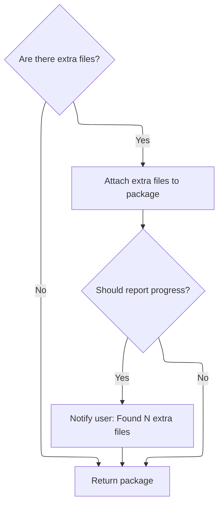

This document describes how plugin metadata is retrieved from <SwmToken path="app/electron/plugin-management.ts" pos="936:25:25" line-data="      throw new Error(&#39;Invalid URL. Please provide a valid URL from ArtifactHub.&#39;);">`ArtifactHub`</SwmToken>, enriched with validated <SwmToken path="app/electron/plugin-management.ts" pos="970:21:23" line-data="          message: `Found ${Object.keys(pkg.extraFiles)!.length} platform-specific extra files`,">`platform-specific`</SwmToken> files, and prepared for further management actions. The flow ensures only trusted files are included and provides progress updates to the user.

# Validating and Transforming the <SwmToken path="app/electron/plugin-management.ts" pos="936:25:25" line-data="      throw new Error(&#39;Invalid URL. Please provide a valid URL from ArtifactHub.&#39;);">`ArtifactHub`</SwmToken> URL

<SwmSnippet path="/app/electron/plugin-management.ts" line="929">

---

In <SwmToken path="app/electron/plugin-management.ts" pos="929:4:4" line-data="async function fetchPluginInfo(">`fetchPluginInfo`</SwmToken>, we start by checking if the input URL matches the expected <SwmToken path="app/electron/plugin-management.ts" pos="936:25:25" line-data="      throw new Error(&#39;Invalid URL. Please provide a valid URL from ArtifactHub.&#39;);">`ArtifactHub`</SwmToken> format. If not, we bail out with an error. Then we swap the prefix to hit the API endpoint instead of the regular web page. This sets us up to fetch the plugin metadata we need. After this, we need to call <SwmPath>[plugins/…/bin/pluginctl.js](plugins/pluginctl/bin/pluginctl.js)</SwmPath> to actually interact with the plugin system, since just fetching metadata isn't enough to manage plugins.

```typescript
async function fetchPluginInfo(
  URL: string,
  progressCallback: null | ProgressCallback,
  signal: AbortSignal | null
): Promise<ArtifactHubHeadlampPkg> {
  try {
    if (!URL.startsWith('https://artifacthub.io/packages/headlamp/')) {
      throw new Error('Invalid URL. Please provide a valid URL from ArtifactHub.');
    }

    const apiURL = URL.replace(
      'https://artifacthub.io/packages/headlamp/',
      'https://artifacthub.io/api/v1/packages/headlamp/'
    );

    if (progressCallback) {
      progressCallback({ type: 'info', message: 'Fetching Plugin Metadata' });
    }
```

---

</SwmSnippet>

<SwmSnippet path="/app/electron/plugin-management.ts" line="947">

---

After returning from <SwmPath>[plugins/…/bin/pluginctl.js](plugins/pluginctl/bin/pluginctl.js)</SwmPath>, we parse the API response and pull out the fields we care about for the plugin. Then we call <SwmToken path="app/electron/plugin-management.ts" pos="963:7:7" line-data="    const extraFiles = getExtraFiles(pkgResponse.data);">`getExtraFiles`</SwmToken> to see if there are any <SwmToken path="app/electron/plugin-management.ts" pos="970:21:23" line-data="          message: `Found ${Object.keys(pkg.extraFiles)!.length} platform-specific extra files`,">`platform-specific`</SwmToken> files we need to deal with. This step is needed because some plugins ship extra files for different platforms, and we want to handle those up front.

```typescript
    const response = await fetch(apiURL, { redirect: 'follow', signal });
    if (!response.ok) {
      throw new Error(`HTTP error! status: ${response.status}`);
    }
    const pkgResponse = await response.json();
    const pkg: ArtifactHubHeadlampPkg = {
      name: pkgResponse.name,
      display_name: pkgResponse.display_name,
      version: pkgResponse.version,
      repository: pkgResponse.repository,
      archiveURL: pkgResponse.data['headlamp/plugin/archive-url'],
      archiveChecksum: pkgResponse.data['headlamp/plugin/archive-checksum'],
      distroCompat: pkgResponse.data['headlamp/plugin/distro-compat'],
      versionCompat: pkgResponse.data['headlamp/plugin/version-compat'],
    };

    const extraFiles = getExtraFiles(pkgResponse.data);

```

---

</SwmSnippet>

## Extracting and Validating Extra Files from Plugin Metadata

```mermaid
%%{init: {"flowchart": {"defaultRenderer": "elk"}} }%%
flowchart TD
  node1["Extract extra files from annotations"]
  click node1 openCode "app/electron/plugin-management.ts:872:878"
  node1 --> node2{"Are extra files defined?"}
  click node2 openCode "app/electron/plugin-management.ts:879:881"
  node2 -->|"No"| node3["Return nothing"]
  click node3 openCode "app/electron/plugin-management.ts:880:881"
  node2 -->|"Yes"| node4["Validate file paths"]
  click node4 openCode "app/electron/plugin-management.ts:886:903"

  subgraph loop1["For each extra file and its outputs"]
    node4 --> node5{"Is file.input/output path safe?"}
    click node5 openCode "app/electron/plugin-management.ts:888:901"
    node5 -->|"No"| node6["Throw error: Invalid file path"]
    click node6 openCode "app/electron/plugin-management.ts:893:901"
    node5 -->|"Yes"| node8["Validate file URLs"]
  end

  subgraph loop2["For each extra file"]
    node8 --> node9{"Is file.url allowed?"}
    click node9 openCode "app/electron/plugin-management.ts:908:916"
    node9 -->|"No"| node10["Throw error: Invalid URL"]
    click node10 openCode "app/electron/plugin-management.ts:915:916"
    node9 -->|"Yes"| node12["Return validated extra files"]
    click node12 openCode "app/electron/plugin-management.ts:917:917"
  end
classDef HeadingStyle fill:#777777,stroke:#333,stroke-width:2px;

%% Swimm:
%% %%{init: {"flowchart": {"defaultRenderer": "elk"}} }%%
%% flowchart TD
%%   node1["Extract extra files from annotations"]
%%   click node1 openCode "<SwmPath>[app/electron/plugin-management.ts](app/electron/plugin-management.ts)</SwmPath>:872:878"
%%   node1 --> node2{"Are extra files defined?"}
%%   click node2 openCode "<SwmPath>[app/electron/plugin-management.ts](app/electron/plugin-management.ts)</SwmPath>:879:881"
%%   node2 -->|"No"| node3["Return nothing"]
%%   click node3 openCode "<SwmPath>[app/electron/plugin-management.ts](app/electron/plugin-management.ts)</SwmPath>:880:881"
%%   node2 -->|"Yes"| node4["Validate file paths"]
%%   click node4 openCode "<SwmPath>[app/electron/plugin-management.ts](app/electron/plugin-management.ts)</SwmPath>:886:903"
%% 
%%   subgraph loop1["For each extra file and its outputs"]
%%     node4 --> node5{"Is file.input/output path safe?"}
%%     click node5 openCode "<SwmPath>[app/electron/plugin-management.ts](app/electron/plugin-management.ts)</SwmPath>:888:901"
%%     node5 -->|"No"| node6["Throw error: Invalid file path"]
%%     click node6 openCode "<SwmPath>[app/electron/plugin-management.ts](app/electron/plugin-management.ts)</SwmPath>:893:901"
%%     node5 -->|"Yes"| node8["Validate file <SwmToken path="app/electron/plugin-management.ts" pos="905:5:5" line-data="  // Validate URLs. Only allow downloads from github.com/kubernetes/minikube for now.">`URLs`</SwmToken>"]
%%   end
%% 
%%   subgraph loop2["For each extra file"]
%%     node8 --> node9{"Is <SwmToken path="app/electron/plugin-management.ts" pos="908:21:23" line-data="    const underTest = process.env.NODE_ENV === &#39;test&#39; &amp;&amp; file.url.includes(&#39;localhost&#39;);">`file.url`</SwmToken> allowed?"}
%%     click node9 openCode "<SwmPath>[app/electron/plugin-management.ts](app/electron/plugin-management.ts)</SwmPath>:908:916"
%%     node9 -->|"No"| node10["Throw error: Invalid URL"]
%%     click node10 openCode "<SwmPath>[app/electron/plugin-management.ts](app/electron/plugin-management.ts)</SwmPath>:915:916"
%%     node9 -->|"Yes"| node12["Return validated extra files"]
%%     click node12 openCode "<SwmPath>[app/electron/plugin-management.ts](app/electron/plugin-management.ts)</SwmPath>:917:917"
%%   end
%% classDef HeadingStyle fill:#777777,stroke:#333,stroke-width:2px;
```



<SwmSnippet path="/app/electron/plugin-management.ts" line="872">

---

In <SwmToken path="app/electron/plugin-management.ts" pos="872:4:4" line-data="export function getExtraFiles(">`getExtraFiles`</SwmToken>, we start by converting the flat annotations object into a nested structure using <SwmToken path="app/electron/plugin-management.ts" pos="875:7:7" line-data="  const converted = convertAnnotations(annotations);">`convertAnnotations`</SwmToken>. This lets us pull out extra files from a predictable location in the object. Without this conversion, we couldn't reliably find or validate the extra files.

```typescript
export function getExtraFiles(
  annotations: Record<string, string>
): ArtifactHubHeadlampPkg['extraFiles'] | undefined {
  const converted = convertAnnotations(annotations);

```

---

</SwmSnippet>

<SwmSnippet path="/app/electron/plugin-management.ts" line="843">

---

ConvertAnnotations takes a flat object with '/'-delimited keys and builds a nested object out of it. This is needed because plugin annotations use '/' to represent hierarchy, and we want to access nested values directly.

```typescript
function convertAnnotations(annotations: Record<string, string>): Record<string, any> {
  const result: Record<string, any> = {};

  for (const key in annotations) {
    const value = annotations[key];
    const parts = key.split('/');
    let current = result;

    for (let i = 0; i < parts.length; i++) {
      const part = parts[i];
      if (i === parts.length - 1) {
        current[part] = value;
      } else {
        if (!current[part]) {
          current[part] = {};
        }
        current = current[part];
      }
    }
  }
```

---

</SwmSnippet>

<SwmSnippet path="/app/electron/plugin-management.ts" line="877">

---

After <SwmToken path="app/electron/plugin-management.ts" pos="843:2:2" line-data="function convertAnnotations(annotations: Record&lt;string, string&gt;): Record&lt;string, any&gt; {">`convertAnnotations`</SwmToken>, <SwmToken path="app/electron/plugin-management.ts" pos="872:4:4" line-data="export function getExtraFiles(">`getExtraFiles`</SwmToken> pulls out the extra files and runs security checks on their paths and <SwmToken path="app/electron/plugin-management.ts" pos="905:5:5" line-data="  // Validate URLs. Only allow downloads from github.com/kubernetes/minikube for now.">`URLs`</SwmToken>. We make sure no file paths start with '..', '/', or '\\' to avoid directory traversal, and only allow downloads from trusted GitHub sources or localhost in test mode. If anything fails validation, we throw an error.

```typescript
  const extraFiles: ArtifactHubHeadlampPkg['extraFiles'] =
    converted?.headlamp?.plugin?.['extra-files'];
  if (!extraFiles) {
    return undefined;
  }

  // Validate the input and output.
  // Check if any of the extra files output.key.output's have anything dangerous.
  // For example '..' in the path and starting with / or \
  for (const file of Object.values(extraFiles)) {
    for (const value of Object.values(file.output)) {
      if (
        value.output.startsWith('..') ||
        value.output.startsWith('/') ||
        value.output.startsWith('\\')
      ) {
        throw new Error(`Invalid extra file output path, ${value.output}`);
      }
      if (
        value.input.startsWith('..') ||
        value.input.startsWith('/') ||
        value.input.startsWith('\\')
      ) {
        throw new Error(`Invalid extra file input path, ${value.input}`);
      }
    }
  }

  // Validate URLs. Only allow downloads from github.com/kubernetes/minikube for now.
  for (const file of Object.values(extraFiles)) {
    // For testing purposes, we allow localhost URLs.
    const underTest = process.env.NODE_ENV === 'test' && file.url.includes('localhost');
    const validURL =
      file.url &&
      (file.url.startsWith('https://github.com/kubernetes/minikube/releases/download/') ||
        file.url.startsWith('https://github.com/crc-org/vfkit/releases/download/'));

    if (!underTest && !validURL) {
      throw new Error(`Invalid URL, ${file.url}`);
    }
  }
```

---

</SwmSnippet>

## Finalizing Plugin Metadata and Reporting Progress



<SwmSnippet path="/app/electron/plugin-management.ts" line="965">

---

After <SwmToken path="app/electron/plugin-management.ts" pos="872:4:4" line-data="export function getExtraFiles(">`getExtraFiles`</SwmToken> returns, <SwmToken path="app/electron/plugin-management.ts" pos="929:4:4" line-data="async function fetchPluginInfo(">`fetchPluginInfo`</SwmToken> attaches any extra files to the package and reports how many were found. This lets the caller know if there are <SwmToken path="app/electron/plugin-management.ts" pos="970:21:23" line-data="          message: `Found ${Object.keys(pkg.extraFiles)!.length} platform-specific extra files`,">`platform-specific`</SwmToken> files to deal with. After this, <SwmPath>[plugins/…/bin/pluginctl.js](plugins/pluginctl/bin/pluginctl.js)</SwmPath> can be called to actually install or manage the plugin using the full metadata.

```typescript
    if (extraFiles) {
      pkg.extraFiles = extraFiles;
      if (progressCallback) {
        progressCallback({
          type: 'info',
          message: `Found ${Object.keys(pkg.extraFiles)!.length} platform-specific extra files`,
        });
      }
    }

    return pkg;
  } catch (e) {
    if (progressCallback) {
      progressCallback({ type: 'error', message: e instanceof Error ? e.message : String(e) });
    }

    throw e;
  }
}
```

---

</SwmSnippet>

&nbsp;

*This is an auto-generated document by Swimm 🌊 and has not yet been verified by a human*

<SwmMeta version="3.0.0" repo-id="Z2l0aHViJTNBJTNBdHlwZXNjcmlwdC1oZWFkbGFtcCUzQSUzQXJpY2FyZG9sb3Blemc=" repo-name="typescript-headlamp"><sup>Powered by [Swimm](https://app.swimm.io/)</sup></SwmMeta>
