This document describes how the application retrieves and processes lists of Kubernetes resources for a selected cluster and namespace, enabling multi-cluster resource management. The flow prepares the request, fetches the resource list, processes each item with cluster and namespace context, and returns the final list for use in the application.

# Starting the List Query

<SwmSnippet path="/frontend/src/lib/k8s/api/v2/useKubeObjectList.ts" line="83">

---

In <SwmToken path="frontend/src/lib/k8s/api/v2/useKubeObjectList.ts" pos="83:1:1" line-data="    queryFn: async () =&gt; {">`queryFn`</SwmToken>, we check for a valid endpoint, then use <SwmToken path="frontend/src/lib/k8s/api/v2/useKubeObjectList.ts" pos="88:15:15" line-data="        const list: KubeList&lt;any&gt; = await clusterFetch(">`clusterFetch`</SwmToken> to pull the list data from the backend, relying on 'endpoint' and 'namespace' being set outside. This is just the setup for processing the list items later.

```typescript
    queryFn: async () => {
      // If no valid endpoint is passed, don't make the request
      if (!endpoint) return;

      try {
        const list: KubeList<any> = await clusterFetch(
          makeUrl([KubeObjectEndpoint.toUrl(endpoint!, namespace)], queryParams),
          {
            cluster,
          }
        ).then(it => it.json());
```

---

</SwmSnippet>

## Fetching with Cluster Context

```mermaid
%%{init: {"flowchart": {"defaultRenderer": "elk"}} }%%
flowchart TD
    node1["Prepare request for target cluster"] --> node2{"Is authentication config (kubeconfig) available for cluster?"}
    click node1 openCode "frontend/src/lib/k8s/api/v2/fetch.ts:75:79"
    node2 -->|"Yes"| node3["Attach kubeconfig and user ID to request"]
    click node2 openCode "frontend/src/lib/k8s/api/v2/fetch.ts:79:84"
    node2 -->|"No"| node4["Send request without extra authentication"]
    click node3 openCode "frontend/src/lib/k8s/api/v2/fetch.ts:81:83"
    click node4 openCode "frontend/src/lib/k8s/api/v2/fetch.ts:86:87"
    node3 --> node5["Send request to backend for cluster"]
    node4 --> node5
    click node5 openCode "frontend/src/lib/k8s/api/v2/fetch.ts:89:91"
    node5 --> node6["Return backend response"]
    click node6 openCode "frontend/src/lib/k8s/api/v2/fetch.ts:91:92"
classDef HeadingStyle fill:#777777,stroke:#333,stroke-width:2px;

%% Swimm:
%% %%{init: {"flowchart": {"defaultRenderer": "elk"}} }%%
%% flowchart TD
%%     node1["Prepare request for target cluster"] --> node2{"Is authentication config (kubeconfig) available for cluster?"}
%%     click node1 openCode "<SwmPath>[frontend/…/v2/fetch.ts](frontend/src/lib/k8s/api/v2/fetch.ts)</SwmPath>:75:79"
%%     node2 -->|"Yes"| node3["Attach kubeconfig and user ID to request"]
%%     click node2 openCode "<SwmPath>[frontend/…/v2/fetch.ts](frontend/src/lib/k8s/api/v2/fetch.ts)</SwmPath>:79:84"
%%     node2 -->|"No"| node4["Send request without extra authentication"]
%%     click node3 openCode "<SwmPath>[frontend/…/v2/fetch.ts](frontend/src/lib/k8s/api/v2/fetch.ts)</SwmPath>:81:83"
%%     click node4 openCode "<SwmPath>[frontend/…/v2/fetch.ts](frontend/src/lib/k8s/api/v2/fetch.ts)</SwmPath>:86:87"
%%     node3 --> node5["Send request to backend for cluster"]
%%     node4 --> node5
%%     click node5 openCode "<SwmPath>[frontend/…/v2/fetch.ts](frontend/src/lib/k8s/api/v2/fetch.ts)</SwmPath>:89:91"
%%     node5 --> node6["Return backend response"]
%%     click node6 openCode "<SwmPath>[frontend/…/v2/fetch.ts](frontend/src/lib/k8s/api/v2/fetch.ts)</SwmPath>:91:92"
%% classDef HeadingStyle fill:#777777,stroke:#333,stroke-width:2px;
```



<SwmSnippet path="/frontend/src/lib/k8s/api/v2/fetch.ts" line="75">

---

<SwmToken path="frontend/src/lib/k8s/api/v2/fetch.ts" pos="75:6:6" line-data="export async function clusterFetch(url: string | URL, init: RequestInit &amp; { cluster: string }) {">`clusterFetch`</SwmToken> handles building the request with cluster-specific headers (kubeconfig and user ID) and rewrites the URL to include the cluster context. It then calls <SwmToken path="frontend/src/lib/k8s/api/v2/fetch.ts" pos="89:9:9" line-data="    const response = await backendFetch(makeUrl(urlParts), init);">`backendFetch`</SwmToken> to actually make the request. If there's an error, it tags it with the cluster name for easier debugging. This step is all about making sure the backend knows which cluster and user the request is for.

```typescript
export async function clusterFetch(url: string | URL, init: RequestInit & { cluster: string }) {
  init.headers = new Headers(init.headers);

  // Set stateless kubeconfig if exists
  const kubeconfig = await findKubeconfigByClusterName(init.cluster);
  if (kubeconfig !== null) {
    const userID = getUserIdFromLocalStorage();
    init.headers.set('KUBECONFIG', kubeconfig);
    init.headers.set('X-HEADLAMP-USER-ID', userID);
  }

  const urlParts = init.cluster ? ['clusters', init.cluster, url] : [url];

  try {
    const response = await backendFetch(makeUrl(urlParts), init);

    return response;
  } catch (e) {
    if (e instanceof ApiError) {
      e.cluster = init.cluster;
    }
    throw e;
  }
}
```

---

</SwmSnippet>

<SwmSnippet path="/frontend/src/lib/k8s/api/v2/fetch.ts" line="38">

---

<SwmToken path="frontend/src/lib/k8s/api/v2/fetch.ts" pos="38:6:6" line-data="export async function backendFetch(url: string | URL, init: RequestInit = {}) {">`backendFetch`</SwmToken> sets up the fetch to always include credentials and adds repo-specific auth headers. It builds the full URL using the app's base URL, then makes the request. If the backend wants the frontend to reload (via <SwmToken path="frontend/src/lib/k8s/api/v2/fetch.ts" pos="46:14:16" line-data="  const headerVal = response.headers.get(&#39;X-Reload&#39;);">`X-Reload`</SwmToken>), it triggers a reload. If the response isn't ok, it tries to extract an error message and throws an <SwmToken path="frontend/src/lib/k8s/api/v2/fetch.ts" pos="59:5:5" line-data="    throw new ApiError(maybeErrorMessage ?? &#39;Unreachable&#39;, { status: response.status });">`ApiError`</SwmToken>.

```typescript
export async function backendFetch(url: string | URL, init: RequestInit = {}) {
  // Always include credentials
  init.credentials = 'include';
  init.headers = addBackstageAuthHeaders(init.headers);
  const response = await fetch(makeUrl([getAppUrl(), url]), init);

  // The backend signals through this header that it wants a reload.
  // See plugins.go
  const headerVal = response.headers.get('X-Reload');
  if (headerVal && headerVal.indexOf('reload') !== -1) {
    window.location.reload();
  }

  if (!response.ok) {
    // Try to parse error message from response
    let maybeErrorMessage: string | undefined;
    try {
      const body = await response.json();
      maybeErrorMessage = typeof body === 'string' ? body : body.message;
    } catch (e) {}

    throw new ApiError(maybeErrorMessage ?? 'Unreachable', { status: response.status });
  }

  return response;
}
```

---

</SwmSnippet>

## Processing and Returning the List

<SwmSnippet path="/frontend/src/lib/k8s/api/v2/useKubeObjectList.ts" line="94">

---

Back in <SwmToken path="frontend/src/lib/k8s/api/v2/useKubeObjectList.ts" pos="83:1:1" line-data="    queryFn: async () =&gt; {">`queryFn`</SwmToken>, after getting the list from <SwmPath>[frontend/…/v2/fetch.ts](frontend/src/lib/k8s/api/v2/fetch.ts)</SwmPath>, we map over the items and wrap each one in a <SwmToken path="frontend/src/lib/k8s/api/v2/useKubeObjectList.ts" pos="95:9:9" line-data="          const itm = new kubeObjectClass({">`kubeObjectClass`</SwmToken> instance, swapping the kind from 'XList' to 'X' and setting the <SwmToken path="frontend/src/lib/k8s/api/v2/useKubeObjectList.ts" pos="98:1:1" line-data="            apiVersion: list.apiVersion,">`apiVersion`</SwmToken>. We also attach the cluster to each object. Finally, we build and return a response object with the processed list, cluster, and namespace. Errors are rethrown with extra context if needed.

```typescript
        list.items = list.items.map(item => {
          const itm = new kubeObjectClass({
            ...item,
            kind: list.kind.replace('List', ''),
            apiVersion: list.apiVersion,
          });
          itm.cluster = cluster;
          return itm;
        });

        const response: ListResponse<K> = {
          list: list as KubeList<K>,
          cluster,
          namespace,
        };

        return response;
      } catch (e) {
        // Rethrow error with cluster and namespace information
        if (e instanceof ApiError) {
          e.cluster = cluster;
          e.namespace = namespace;
        }
        throw e;
      }
    },
```

---

</SwmSnippet>

&nbsp;

*This is an auto-generated document by Swimm 🌊 and has not yet been verified by a human*

<SwmMeta version="3.0.0" repo-id="Z2l0aHViJTNBJTNBdHlwZXNjcmlwdC1oZWFkbGFtcCUzQSUzQXJpY2FyZG9sb3Blemc=" repo-name="typescript-headlamp"><sup>Powered by [Swimm](https://app.swimm.io/)</sup></SwmMeta>
