This document describes how the system retrieves and maintains up-to-date lists of Kubernetes resources across multiple clusters and namespaces. The process aggregates results, provides real-time updates via WebSockets or polling, and returns resource data with error and status information for display in the UI.

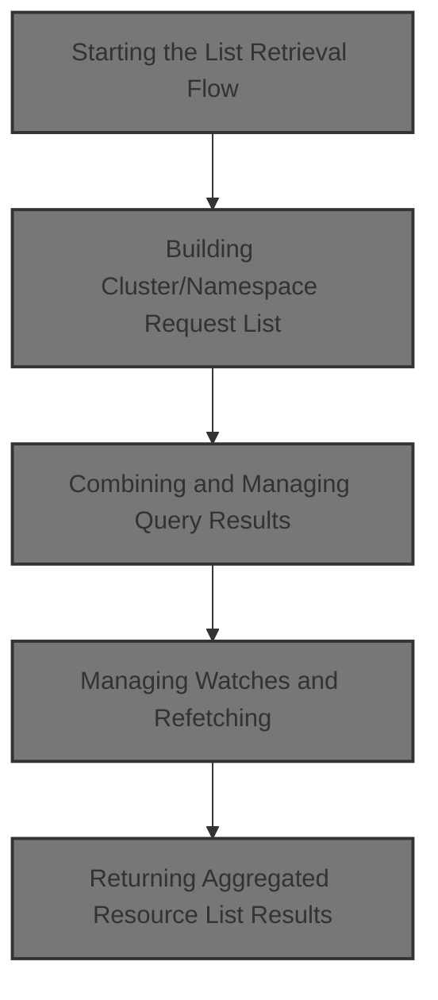

# Starting the List Retrieval Flow

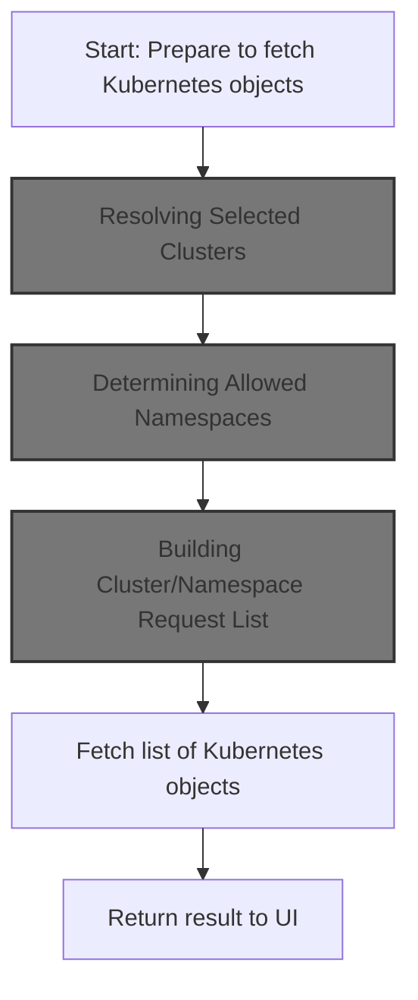

<SwmSnippet path="/frontend/src/lib/k8s/KubeObject.ts" line="330">

---

In <SwmToken path="frontend/src/lib/k8s/KubeObject.ts" pos="330:3:3" line-data="  static useList&lt;K extends KubeObject&gt;(">`useList`</SwmToken>, we kick off the flow by figuring out which clusters to target. If the caller doesn't specify clusters, we grab the user's selected clusters using <SwmToken path="frontend/src/lib/k8s/KubeObject.ts" pos="346:7:7" line-data="    const fallbackClusters = useSelectedClusters();">`useSelectedClusters`</SwmToken>. This sets up the context for all subsequent API requests. We need to call <SwmPath>[frontend/…/k8s/index.ts](frontend/src/lib/k8s/index.ts)</SwmPath> next to actually get those selected clusters.

```typescript
  static useList<K extends KubeObject>(
    this: (new (...args: any) => K) & typeof KubeObject<any>,
    {
      cluster,
      clusters,
      namespace,
      refetchInterval,
      ...queryParams
    }: {
      cluster?: string;
      clusters?: string[];
      namespace?: string | string[];
      /** How often to refetch the list. Won't refetch by default. Disables watching if set. */
      refetchInterval?: number;
    } & QueryParameters = {}
  ) {
    const fallbackClusters = useSelectedClusters();

```

---

</SwmSnippet>

## Resolving Selected Clusters

<SwmSnippet path="/frontend/src/lib/k8s/index.ts" line="164">

---

In <SwmToken path="frontend/src/lib/k8s/index.ts" pos="164:4:4" line-data="export function useSelectedClusters(): string[] {">`useSelectedClusters`</SwmToken>, we look for clusters in both the URL and the React context. This lets us support both direct URL navigation and UI-based selection. We call <SwmToken path="frontend/src/lib/k8s/index.ts" pos="165:7:7" line-data="  const clusterInURL = useCluster();">`useCluster`</SwmToken> first to get any cluster info from the URL, then move on to check the context. This is why we need to call <SwmPath>[frontend/…/k8s/index.ts](frontend/src/lib/k8s/index.ts)</SwmPath> next.

```typescript
export function useSelectedClusters(): string[] {
  const clusterInURL = useCluster();
```

---

</SwmSnippet>

### Extracting Cluster from URL

See <SwmLink doc-title="Tracking and Scoping Cluster Context">[Tracking and Scoping Cluster Context](/.swm/tracking-and-scoping-cluster-context.di2o2poc.sw.md)</SwmLink>

### Finalizing Cluster Selection

<SwmSnippet path="/frontend/src/lib/k8s/index.ts" line="166">

---

After checking the context, if no clusters are found, <SwmToken path="frontend/src/lib/k8s/KubeObject.ts" pos="346:7:7" line-data="    const fallbackClusters = useSelectedClusters();">`useSelectedClusters`</SwmToken> falls back to parsing clusters from the URL using <SwmToken path="frontend/src/lib/k8s/index.ts" pos="170:3:3" line-data="    return getSelectedClusters([], history.location.pathname);">`getSelectedClusters`</SwmToken>.

```typescript
  const history = useHistory();
  const maybeSelectedClusters = useContext(SelectedClustersContext);

  const clusterGroup = React.useMemo(() => {
    return getSelectedClusters([], history.location.pathname);
  }, [clusterInURL]);

  return maybeSelectedClusters && maybeSelectedClusters.length > 0
    ? maybeSelectedClusters
    : clusterGroup;
}
```

---

</SwmSnippet>

<SwmSnippet path="/frontend/src/lib/cluster.ts" line="107">

---

<SwmToken path="frontend/src/lib/cluster.ts" pos="107:4:4" line-data="export function getSelectedClusters(">`getSelectedClusters`</SwmToken> parses the URL path for a cluster parameter, splits it if there are multiple clusters, and returns the list. If nothing is found, it returns a fallback. This is how we support <SwmToken path="frontend/src/lib/k8s/api/v2/webSocket.ts" pos="51:13:15" line-data="   * This is particularly important in multi-cluster environments.">`multi-cluster`</SwmToken> selection via the URL.

```typescript
export function getSelectedClusters(
  returnWhenNoClusters: string[] = [],
  urlPath?: string
): string[] {
  const clusterFromURL = getClusterPathParam(urlPath);
  return clusterFromURL?.split('+') || returnWhenNoClusters;
}
```

---

</SwmSnippet>

## Preparing Cluster and Namespace Requests

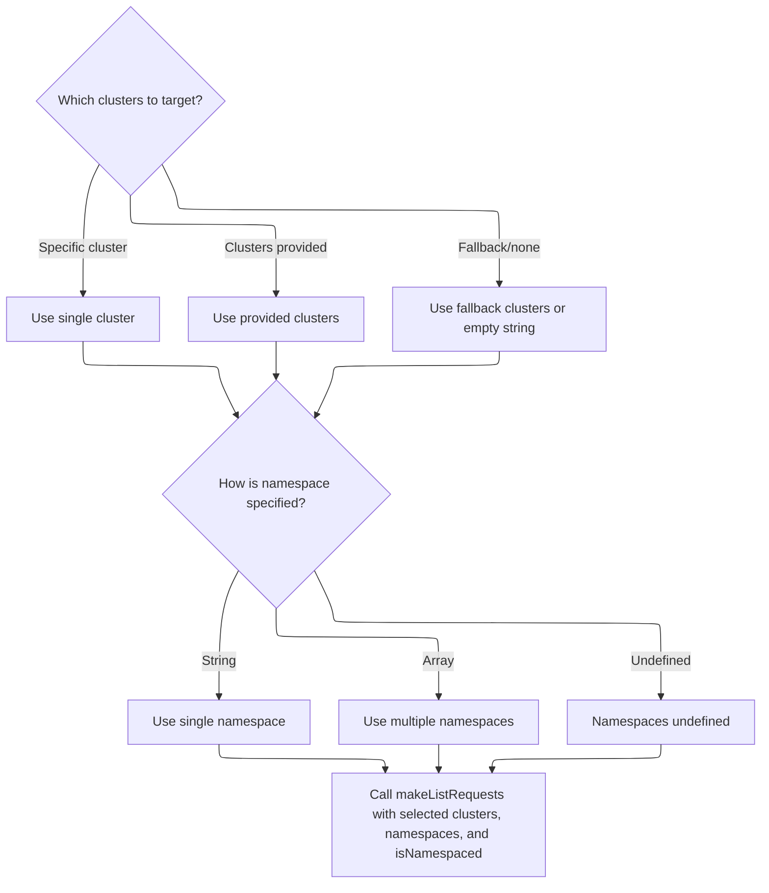

<SwmSnippet path="/frontend/src/lib/k8s/KubeObject.ts" line="348">

---

Back in `KubeObject.useList`, after getting the clusters, we build a list of requests for each cluster and namespace combo using <SwmToken path="frontend/src/lib/k8s/KubeObject.ts" pos="361:3:3" line-data="      return makeListRequests(">`makeListRequests`</SwmToken>. This sets up the actual API calls. We need to call <SwmPath>[frontend/…/v2/useKubeObjectList.ts](frontend/src/lib/k8s/api/v2/useKubeObjectList.ts)</SwmPath> next to handle the API logic for these requests.

```typescript
    // Create requests for each cluster and namespace
    const requests = useMemo(() => {
      const clusterList = cluster
        ? [cluster]
        : clusters || (fallbackClusters.length === 0 ? [''] : fallbackClusters);

      const namespacesFromParams =
        typeof namespace === 'string'
          ? [namespace]
          : Array.isArray(namespace)
          ? namespace
          : undefined;

      return makeListRequests(
        clusterList,
        getAllowedNamespaces,
        this.isNamespaced,
        namespacesFromParams
      );
    }, [cluster, clusters, fallbackClusters, namespace, this.isNamespaced]);

```

---

</SwmSnippet>

## Building Cluster/Namespace Request List

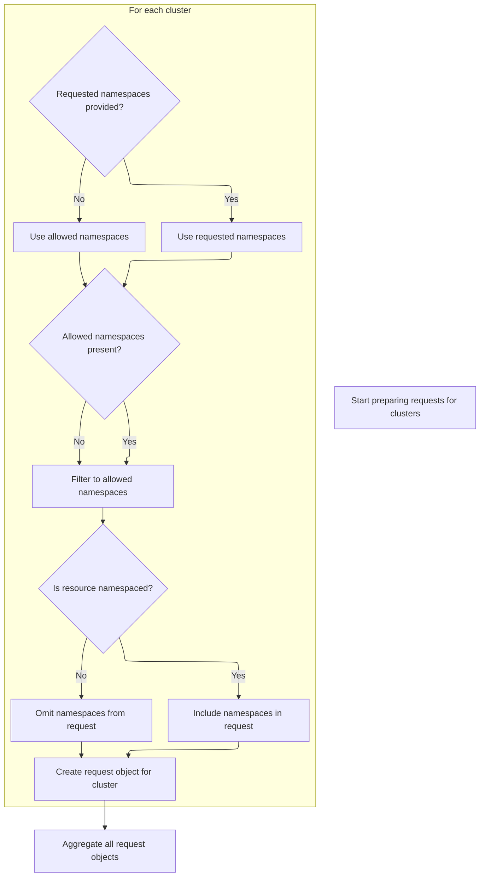

<SwmSnippet path="/frontend/src/lib/k8s/api/v2/useKubeObjectList.ts" line="374">

---

<SwmToken path="frontend/src/lib/k8s/api/v2/useKubeObjectList.ts" pos="374:4:4" line-data="export function makeListRequests(">`makeListRequests`</SwmToken> loops over clusters, gets the allowed namespaces for each, and builds a request for each <SwmPath>[frontend/…/components/namespace/](frontend/src/components/namespace/)</SwmPath> combo. We call <SwmToken path="frontend/src/lib/k8s/api/v2/useKubeObjectList.ts" pos="376:1:1" line-data="  getAllowedNamespaces: (cluster: string | null) =&gt; string[],">`getAllowedNamespaces`</SwmToken> next to figure out which namespaces are actually allowed per cluster.

```typescript
export function makeListRequests(
  clusters: string[],
  getAllowedNamespaces: (cluster: string | null) => string[],
  isResourceNamespaced: boolean,
  requestedNamespaces: string[] = []
): Array<{ cluster: string; namespaces?: string[] }> {
  return clusters.map(cluster => {
    const allowedNamespaces = getAllowedNamespaces(cluster);

    let namespaces = requestedNamespaces.length > 0 ? requestedNamespaces : allowedNamespaces;

    if (allowedNamespaces.length) {
      namespaces = namespaces.filter(ns => allowedNamespaces.includes(ns));
    }

    return { cluster, namespaces: isResourceNamespaced ? namespaces : undefined };
  });
}
```

---

</SwmSnippet>

## Determining Allowed Namespaces

<SwmSnippet path="/frontend/src/lib/k8s/KubeObject.ts" line="37">

---

In <SwmToken path="frontend/src/lib/k8s/KubeObject.ts" pos="37:2:2" line-data="function getAllowedNamespaces(cluster: string | null = getCluster()): string[] {">`getAllowedNamespaces`</SwmToken>, we check if a cluster is provided, defaulting to <SwmToken path="frontend/src/lib/k8s/KubeObject.ts" pos="37:15:17" line-data="function getAllowedNamespaces(cluster: string | null = getCluster()): string[] {">`getCluster()`</SwmToken> if not. If there's no cluster, we bail early. Next, we need to load the cluster settings from <SwmPath>[frontend/…/lib/cluster.ts](frontend/src/lib/cluster.ts)</SwmPath> to get the allowed namespaces.

```typescript
function getAllowedNamespaces(cluster: string | null = getCluster()): string[] {
  if (!cluster) {
    return [];
  }

```

---

</SwmSnippet>

<SwmSnippet path="/frontend/src/lib/k8s/KubeObject.ts" line="42">

---

After loading cluster settings, <SwmToken path="frontend/src/lib/k8s/KubeObject.ts" pos="37:2:2" line-data="function getAllowedNamespaces(cluster: string | null = getCluster()): string[] {">`getAllowedNamespaces`</SwmToken> returns the <SwmToken path="frontend/src/lib/k8s/KubeObject.ts" pos="43:5:5" line-data="  return clusterSettings.allowedNamespaces || [];">`allowedNamespaces`</SwmToken> array or an empty array if it's missing. This controls which namespaces are included in the requests.

```typescript
  const clusterSettings = loadClusterSettings(cluster);
  return clusterSettings.allowedNamespaces || [];
}
```

---

</SwmSnippet>

## Fetching the Resource List

<SwmSnippet path="/frontend/src/lib/k8s/KubeObject.ts" line="369">

---

After building the requests, `KubeObject.useList` calls <SwmToken path="frontend/src/lib/k8s/KubeObject.ts" pos="369:7:7" line-data="    const result = useKubeObjectList&lt;K&gt;({">`useKubeObjectList`</SwmToken> with all the details. This is where the actual data fetching happens, and the result is returned to the caller.

```typescript
    const result = useKubeObjectList<K>({
      queryParams: queryParams,
      kubeObjectClass: this,
      requests,
      refetchInterval,
    });

    return result;
  }
```

---

</SwmSnippet>

# Handling List Fetching and Endpoint Selection

```mermaid
%%{init: {"flowchart": {"defaultRenderer": "elk"}} }%%
flowchart TD
  node1["Receive clusters/namespaces to query"]
  click node1 openCode "frontend/src/lib/k8s/api/v2/useKubeObjectList.ts:399:424"
  node1 --> node2["Selecting the Working API Endpoint"]
  
  node2 --> node3{"Is endpoint available?"}
  click node3 openCode "frontend/src/lib/k8s/api/v2/useKubeObjectList.ts:420:424"
  node3 -->|"Yes"| node4["Combining and Managing Query Results"]
  
  subgraph loop1["For each frontend/…/components/namespace"]
    node4 --> node6["Querying the Kubernetes API for Lists"]
    
  end
  node4 --> node5["Execute queries and combine results"]
  click node5 openCode "frontend/src/lib/k8s/api/v2/useKubeObjectList.ts:458:489"
  node5 --> node7{"Should watch for live updates?"}
  click node7 openCode "frontend/src/lib/k8s/api/v2/useKubeObjectList.ts:491:492"
  node7 -->|"Yes (watch enabled, no refetch interval)"| node8["Watching for Resource List Updates"]
  
  node8 --> node10["Managing WebSocket Connections and Listeners"]
  
  node10 --> node11["Returning Aggregated Resource List Results"]
  node7 -->|"No (refetch interval set or loading)"| node9["Skip watching"]
  node9 --> node11
  node3 -->|"No"| node11
  node11["Returning Aggregated Resource List Results"]
  
classDef HeadingStyle fill:#777777,stroke:#333,stroke-width:2px;
click node2 goToHeading "Selecting the Working API Endpoint"
node2:::HeadingStyle
click node6 goToHeading "Querying the Kubernetes API for Lists"
node6:::HeadingStyle
click node8 goToHeading "Watching for Resource List Updates"
node8:::HeadingStyle
click node10 goToHeading "Managing WebSocket Connections and Listeners"
node10:::HeadingStyle
click node11 goToHeading "Returning Aggregated Resource List Results"
node11:::HeadingStyle
click node4 goToHeading "Combining and Managing Query Results"
node4:::HeadingStyle

%% Swimm:
%% %%{init: {"flowchart": {"defaultRenderer": "elk"}} }%%
%% flowchart TD
%%   node1["Receive clusters/namespaces to query"]
%%   click node1 openCode "<SwmPath>[frontend/…/v2/useKubeObjectList.ts](frontend/src/lib/k8s/api/v2/useKubeObjectList.ts)</SwmPath>:399:424"
%%   node1 --> node2["Selecting the Working API Endpoint"]
%%   
%%   node2 --> node3{"Is endpoint available?"}
%%   click node3 openCode "<SwmPath>[frontend/…/v2/useKubeObjectList.ts](frontend/src/lib/k8s/api/v2/useKubeObjectList.ts)</SwmPath>:420:424"
%%   node3 -->|"Yes"| node4["Combining and Managing Query Results"]
%%   
%%   subgraph loop1["For each <SwmPath>[frontend/…/components/namespace/](frontend/src/components/namespace/)</SwmPath>"]
%%     node4 --> node6["Querying the Kubernetes API for Lists"]
%%     
%%   end
%%   node4 --> node5["Execute queries and combine results"]
%%   click node5 openCode "<SwmPath>[frontend/…/v2/useKubeObjectList.ts](frontend/src/lib/k8s/api/v2/useKubeObjectList.ts)</SwmPath>:458:489"
%%   node5 --> node7{"Should watch for live updates?"}
%%   click node7 openCode "<SwmPath>[frontend/…/v2/useKubeObjectList.ts](frontend/src/lib/k8s/api/v2/useKubeObjectList.ts)</SwmPath>:491:492"
%%   node7 -->|"Yes (watch enabled, no refetch interval)"| node8["Watching for Resource List Updates"]
%%   
%%   node8 --> node10["Managing <SwmToken path="frontend/src/lib/k8s/api/v2/useKubeObjectList.ts" pos="135:11:11" line-data="  /** Query parameters for the WebSocket connection URL */">`WebSocket`</SwmToken> Connections and Listeners"]
%%   
%%   node10 --> node11["Returning Aggregated Resource List Results"]
%%   node7 -->|"No (refetch interval set or loading)"| node9["Skip watching"]
%%   node9 --> node11
%%   node3 -->|"No"| node11
%%   node11["Returning Aggregated Resource List Results"]
%%   
%% classDef HeadingStyle fill:#777777,stroke:#333,stroke-width:2px;
%% click node2 goToHeading "Selecting the Working API Endpoint"
%% node2:::HeadingStyle
%% click node6 goToHeading "Querying the Kubernetes API for Lists"
%% node6:::HeadingStyle
%% click node8 goToHeading "Watching for Resource List Updates"
%% node8:::HeadingStyle
%% click node10 goToHeading "Managing <SwmToken path="frontend/src/lib/k8s/api/v2/useKubeObjectList.ts" pos="135:11:11" line-data="  /** Query parameters for the WebSocket connection URL */">`WebSocket`</SwmToken> Connections and Listeners"
%% node10:::HeadingStyle
%% click node11 goToHeading "Returning Aggregated Resource List Results"
%% node11:::HeadingStyle
%% click node4 goToHeading "Combining and Managing Query Results"
%% node4:::HeadingStyle
```

<SwmSnippet path="/frontend/src/lib/k8s/api/v2/useKubeObjectList.ts" line="399">

---

In <SwmToken path="frontend/src/lib/k8s/api/v2/useKubeObjectList.ts" pos="399:4:4" line-data="export function useKubeObjectList&lt;K extends KubeObject&gt;({">`useKubeObjectList`</SwmToken>, we figure out the right API endpoint to use for the first cluster and namespace. We call <SwmToken path="frontend/src/lib/k8s/api/v2/useKubeObjectList.ts" pos="420:17:17" line-data="  const { endpoint, error: endpointError } = useEndpoints(">`useEndpoints`</SwmToken> next to resolve which endpoint to hit for the resource.

```typescript
export function useKubeObjectList<K extends KubeObject>({
  requests,
  kubeObjectClass,
  queryParams,
  watch = true,
  refetchInterval,
}: {
  requests: Array<{ cluster: string; namespaces?: string[] }>;
  /** Class to instantiate the object with */
  kubeObjectClass: (new (...args: any) => K) & typeof KubeObject<any>;
  queryParams?: QueryParameters;
  /** Watch for updates @default true */
  watch?: boolean;
  /** How often to refetch the list. Won't refetch by default. Disables watching if set. */
  refetchInterval?: number;
}): [Array<K> | null, ApiError | null] &
  QueryListResponse<Array<ListResponse<K> | undefined | null>, K, ApiError> {
  const maybeNamespace = requests.find(it => it.namespaces)?.namespaces?.[0];

  // Get working endpoint from the first cluster
  // Now if clusters have different apiVersions for the same resource for example, this will not work
  const { endpoint, error: endpointError } = useEndpoints(
    kubeObjectClass.apiEndpoint.apiInfo,
    requests[0]?.cluster,
    maybeNamespace
  );

```

---

</SwmSnippet>

## Selecting the Working API Endpoint

<SwmSnippet path="/frontend/src/lib/k8s/api/v2/hooks.ts" line="215">

---

<SwmToken path="frontend/src/lib/k8s/api/v2/hooks.ts" pos="215:4:4" line-data="export const useEndpoints = (">`useEndpoints`</SwmToken> decides if it needs to fetch the working endpoint (if there's more than one) or just use the only one available. If fetching, it calls <SwmToken path="frontend/src/lib/k8s/api/v2/hooks.ts" pos="223:9:9" line-data="    queryFn: () =&gt; getWorkingEndpoint(endpoints, cluster!, namespace),">`getWorkingEndpoint`</SwmToken> to figure out which endpoint is actually usable for the <SwmPath>[frontend/…/components/namespace/](frontend/src/components/namespace/)</SwmPath>.

```typescript
export const useEndpoints = (
  endpoints: KubeObjectEndpoint[],
  cluster: string,
  namespace?: string
) => {
  const { data: endpoint, error } = useQuery<KubeObjectEndpoint, ApiError>({
    enabled: endpoints.length > 1,
    queryKey: ['endpoints', endpoints],
    queryFn: () => getWorkingEndpoint(endpoints, cluster!, namespace),
  });
  if (endpoints.length === 1) return { endpoint: endpoints[0], error: null };

  return { endpoint, error };
};
```

---

</SwmSnippet>

## Probing Endpoints for Availability

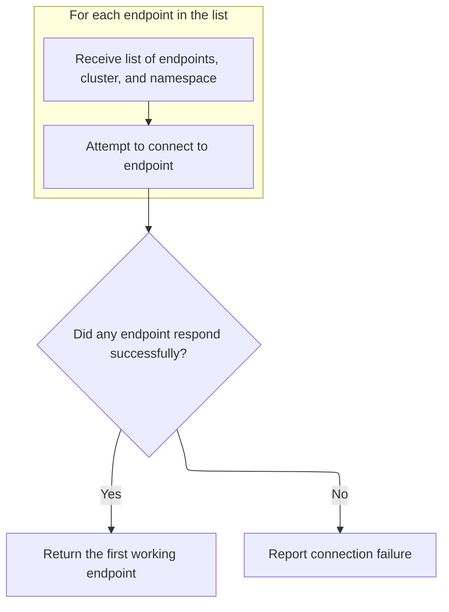

<SwmSnippet path="/frontend/src/lib/k8s/api/v2/hooks.ts" line="193">

---

In <SwmToken path="frontend/src/lib/k8s/api/v2/hooks.ts" pos="193:2:2" line-data="const getWorkingEndpoint = async (">`getWorkingEndpoint`</SwmToken>, we fire off requests to all possible endpoints in parallel using <SwmToken path="frontend/src/lib/k8s/api/v2/hooks.ts" pos="199:3:3" line-data="    return clusterFetch(KubeObjectEndpoint.toUrl(endpoint, namespace), {">`clusterFetch`</SwmToken>. If cluster isn't provided, we fall back to <SwmToken path="frontend/src/lib/k8s/api/v2/hooks.ts" pos="201:8:8" line-data="      cluster: cluster ?? getCluster() ?? &#39;&#39;,">`getCluster`</SwmToken>. We need to call <SwmPath>[frontend/…/lib/cluster.ts](frontend/src/lib/cluster.ts)</SwmPath> next to resolve the cluster if it's missing.

```typescript
const getWorkingEndpoint = async (
  endpoints: KubeObjectEndpoint[],
  cluster: string,
  namespace?: string
) => {
  const promises = endpoints.map(endpoint => {
    return clusterFetch(KubeObjectEndpoint.toUrl(endpoint, namespace), {
      method: 'GET',
      cluster: cluster ?? getCluster() ?? '',
```

---

</SwmSnippet>

<SwmSnippet path="/frontend/src/lib/k8s/api/v2/hooks.ts" line="198">

---

After resolving the cluster, <SwmToken path="frontend/src/lib/k8s/api/v2/hooks.ts" pos="193:2:2" line-data="const getWorkingEndpoint = async (">`getWorkingEndpoint`</SwmToken> uses <SwmToken path="frontend/src/lib/k8s/api/v2/hooks.ts" pos="204:3:5" line-data="  return Promise.any(promises).catch((aggregateError: AggregateError) =&gt; {">`Promise.any`</SwmToken> to return the first endpoint that responds. If all fail, it throws the first error. Each probe uses <SwmToken path="frontend/src/lib/k8s/api/v2/hooks.ts" pos="199:3:3" line-data="    return clusterFetch(KubeObjectEndpoint.toUrl(endpoint, namespace), {">`clusterFetch`</SwmToken>, so we need to call <SwmPath>[frontend/…/v2/fetch.ts](frontend/src/lib/k8s/api/v2/fetch.ts)</SwmPath> next to actually make the HTTP requests.

```typescript
  const promises = endpoints.map(endpoint => {
    return clusterFetch(KubeObjectEndpoint.toUrl(endpoint, namespace), {
      method: 'GET',
      cluster: cluster ?? getCluster() ?? '',
    }).then(() => endpoint);
  });
  return Promise.any(promises).catch((aggregateError: AggregateError) => {
    // when no endpoint is available, throw an error
    throw aggregateError.errors[0];
  });
};
```

---

</SwmSnippet>

## Making Cluster-Scoped API Requests

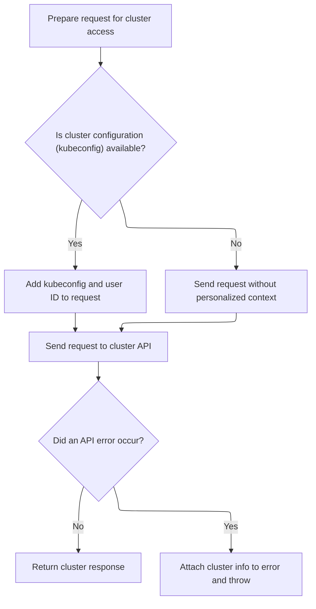

<SwmSnippet path="/frontend/src/lib/k8s/api/v2/fetch.ts" line="75">

---

In <SwmToken path="frontend/src/lib/k8s/api/v2/fetch.ts" pos="75:6:6" line-data="export async function clusterFetch(url: string | URL, init: RequestInit &amp; { cluster: string }) {">`clusterFetch`</SwmToken>, we prep the request headers and try to fetch a kubeconfig for the cluster. If we find one, we add it and the user ID to the headers. That's why we call <SwmToken path="frontend/src/lib/k8s/api/v2/fetch.ts" pos="79:9:9" line-data="  const kubeconfig = await findKubeconfigByClusterName(init.cluster);">`findKubeconfigByClusterName`</SwmToken> next.

```typescript
export async function clusterFetch(url: string | URL, init: RequestInit & { cluster: string }) {
  init.headers = new Headers(init.headers);

  // Set stateless kubeconfig if exists
  const kubeconfig = await findKubeconfigByClusterName(init.cluster);
```

---

</SwmSnippet>

<SwmSnippet path="/frontend/src/lib/k8s/api/v2/fetch.ts" line="80">

---

After getting the kubeconfig, <SwmToken path="frontend/src/lib/k8s/api/v2/useKubeObjectList.ts" pos="88:15:15" line-data="        const list: KubeList&lt;any&gt; = await clusterFetch(">`clusterFetch`</SwmToken> grabs the user ID from local storage (or generates one if missing) and sets both headers. This is why we call <SwmToken path="frontend/src/lib/k8s/api/v2/fetch.ts" pos="81:7:7" line-data="    const userID = getUserIdFromLocalStorage();">`getUserIdFromLocalStorage`</SwmToken> next.

```typescript
  if (kubeconfig !== null) {
    const userID = getUserIdFromLocalStorage();
    init.headers.set('KUBECONFIG', kubeconfig);
    init.headers.set('X-HEADLAMP-USER-ID', userID);
  }

```

---

</SwmSnippet>

<SwmSnippet path="/frontend/src/stateless/getUserIdFromLocalStorage.ts" line="28">

---

<SwmToken path="frontend/src/stateless/getUserIdFromLocalStorage.ts" pos="28:4:4" line-data="export function getUserIdFromLocalStorage(): string {">`getUserIdFromLocalStorage`</SwmToken> checks for a user ID in local storage, and if it's missing, generates a new secure token and stores it. This guarantees we always have a user ID for requests.

```typescript
export function getUserIdFromLocalStorage(): string {
  let headlampUserId = localStorage.getItem('headlamp-userId');

  if (!headlampUserId) {
    headlampUserId = generateSecureToken();

    if (headlampUserId) {
      localStorage.setItem('headlamp-userId', headlampUserId);
    }
  }

  return headlampUserId!;
}
```

---

</SwmSnippet>

<SwmSnippet path="/frontend/src/lib/k8s/api/v2/fetch.ts" line="86">

---

After setting headers, <SwmToken path="frontend/src/lib/k8s/api/v2/useKubeObjectList.ts" pos="88:15:15" line-data="        const list: KubeList&lt;any&gt; = await clusterFetch(">`clusterFetch`</SwmToken> builds the URL differently if a cluster is present, then calls <SwmToken path="frontend/src/lib/k8s/api/v2/fetch.ts" pos="89:9:9" line-data="    const response = await backendFetch(makeUrl(urlParts), init);">`backendFetch`</SwmToken>. If there's an <SwmToken path="frontend/src/lib/k8s/api/v2/fetch.ts" pos="93:8:8" line-data="    if (e instanceof ApiError) {">`ApiError`</SwmToken>, it tags it with the cluster name for better error tracking.

```typescript
  const urlParts = init.cluster ? ['clusters', init.cluster, url] : [url];

  try {
    const response = await backendFetch(makeUrl(urlParts), init);

    return response;
  } catch (e) {
    if (e instanceof ApiError) {
      e.cluster = init.cluster;
    }
    throw e;
  }
}
```

---

</SwmSnippet>

## Combining and Managing Query Results

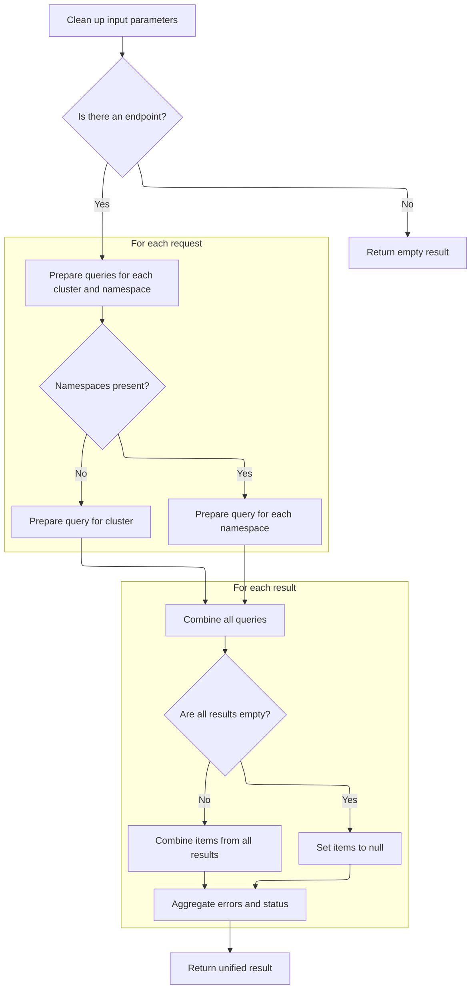

<SwmSnippet path="/frontend/src/lib/k8s/api/v2/useKubeObjectList.ts" line="426">

---

After resolving endpoints, <SwmToken path="frontend/src/lib/k8s/KubeObject.ts" pos="369:7:7" line-data="    const result = useKubeObjectList&lt;K&gt;({">`useKubeObjectList`</SwmToken> builds queries for each <SwmPath>[frontend/…/components/namespace/](frontend/src/components/namespace/)</SwmPath>, cleans up query params, and combines all the results into a single object. This lets us handle partial failures and aggregate data for the UI.

```typescript
  const cleanedUpQueryParams = Object.fromEntries(
    Object.entries(queryParams ?? {}).filter(([, value]) => value !== undefined && value !== '')
  );

  const queries = useMemo(
    () =>
      endpoint
        ? requests.flatMap(({ cluster, namespaces }) =>
            namespaces && namespaces.length > 0
              ? namespaces.map(namespace =>
                  kubeObjectListQuery<K>(
                    kubeObjectClass,
                    endpoint,
                    namespace,
                    cluster,
                    cleanedUpQueryParams,
                    refetchInterval
                  )
                )
              : kubeObjectListQuery<K>(
                  kubeObjectClass,
                  endpoint,
                  undefined,
                  cluster,
                  cleanedUpQueryParams,
                  refetchInterval
                )
          )
        : [],
    [requests, kubeObjectClass, endpoint, cleanedUpQueryParams]
  );

  const query = useQueries({
    queries,
    combine(results) {
      return {
        data: results.map(result => result.data),
        clusterResults: results.reduce((acc, result) => {
          if (result.data && result.data.cluster) {
            acc[result.data.cluster] = {
              data: result.data,
              error: result.error,
              errors: result.error ? [result.error] : null,
              isError: result.isError,
              isFetching: result.isFetching,
              isLoading: result.isLoading,
              isSuccess: result.isSuccess,
              items: result?.data?.list?.items ?? null,
              status: result.status,
            };
          }
          return acc;
        }, {} as Record<string, QueryListResponse<any, K, ApiError>>),
        items: results.every(result => result.data === null)
          ? null
          : results.flatMap(result => result?.data?.list?.items ?? []),
        errors: results.map(result => result.error).filter(Boolean),
        isError: results.some(result => result.isError),
        isLoading: results.some(result => result.isLoading),
        isFetching: results.some(result => result.isFetching),
        isSuccess: results.every(result => result.isSuccess),
      };
    },
  });

```

---

</SwmSnippet>

## Querying the Kubernetes API for Lists

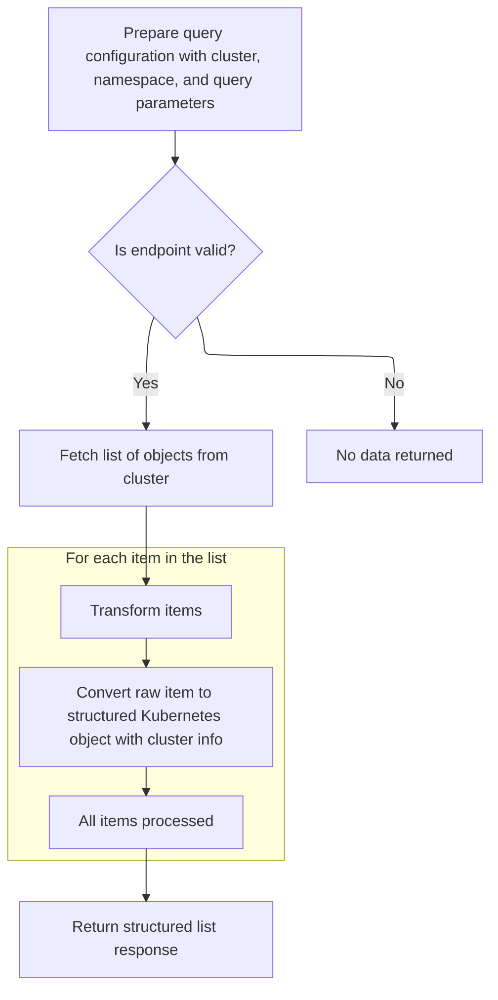

<SwmSnippet path="/frontend/src/lib/k8s/api/v2/useKubeObjectList.ts" line="63">

---

<SwmToken path="frontend/src/lib/k8s/api/v2/useKubeObjectList.ts" pos="63:4:4" line-data="export function kubeObjectListQuery&lt;K extends KubeObject&gt;(">`kubeObjectListQuery`</SwmToken> builds a unique query key and uses clusterFetch/makeUrl to request the list from the API.

```typescript
export function kubeObjectListQuery<K extends KubeObject>(
  kubeObjectClass: KubeObjectClass,
  endpoint: KubeObjectEndpoint,
  namespace: string | undefined,
  cluster: string,
  queryParams: QueryParameters,
  refetchInterval?: number
): QueryObserverOptions<ListResponse<K> | undefined | null, ApiError> {
  return {
    placeholderData: null,
    refetchInterval,
    queryKey: [
      'kubeObject',
      'list',
      kubeObjectClass.apiVersion,
      kubeObjectClass.apiName,
      cluster,
      namespace ?? '',
      queryParams,
    ],
    queryFn: async () => {
      // If no valid endpoint is passed, don't make the request
      if (!endpoint) return;

      try {
        const list: KubeList<any> = await clusterFetch(
          makeUrl([KubeObjectEndpoint.toUrl(endpoint!, namespace)], queryParams),
          {
            cluster,
          }
        ).then(it => it.json());
```

---

</SwmSnippet>

<SwmSnippet path="/frontend/src/lib/k8s/api/v2/useKubeObjectList.ts" line="94">

---

After fetching the list from the API, <SwmToken path="frontend/src/lib/k8s/api/v2/useKubeObjectList.ts" pos="63:4:4" line-data="export function kubeObjectListQuery&lt;K extends KubeObject&gt;(">`kubeObjectListQuery`</SwmToken> strips 'List' from the kind, instantiates each item as the correct class, and attaches the cluster. This makes sure downstream code gets properly-typed objects.

```typescript
        list.items = list.items.map(item => {
          const itm = new kubeObjectClass({
            ...item,
            kind: list.kind.replace('List', ''),
            apiVersion: list.apiVersion,
          });
          itm.cluster = cluster;
          return itm;
        });

        const response: ListResponse<K> = {
          list: list as KubeList<K>,
          cluster,
          namespace,
        };

        return response;
      } catch (e) {
        // Rethrow error with cluster and namespace information
        if (e instanceof ApiError) {
          e.cluster = cluster;
          e.namespace = namespace;
        }
        throw e;
      }
    },
  };
}
```

---

</SwmSnippet>

## Managing Watches and Refetching

```mermaid
%%{init: {"flowchart": {"defaultRenderer": "elk"}} }%%
flowchart TD
  node1{"Should we watch lists now? (watch is true, no refetch interval, not loading)"}
  click node1 openCode "frontend/src/lib/k8s/api/v2/useKubeObjectList.ts:491:492"
  node1 -->|"Yes"| node2{"Are there new lists to watch? (listsNotYetWatched.length > 0)"}
  node1 -->|"No"| node7["Start/stop watching lists"]
  click node7 openCode "frontend/src/lib/k8s/api/v2/useKubeObjectList.ts:529:534"
  node2 -->|"Yes"| node3["Add new lists to watch"]
  click node3 openCode "frontend/src/lib/k8s/api/v2/useKubeObjectList.ts:513:514"
  node2 -->|"No"| node4{"Are there lists to stop watching? (listsToStopWatching.length > 0)"}
  click node4 openCode "frontend/src/lib/k8s/api/v2/useKubeObjectList.ts:525:526"
  node3 --> node4
  node4 -->|"Yes"| node5["Remove lists no longer relevant"]
  click node5 openCode "frontend/src/lib/k8s/api/v2/useKubeObjectList.ts:526:527"
  node4 -->|"No"| node7
  node5 --> node7

  subgraph loop1["For each available list"]
    node2
  end
  subgraph loop2["For each watched list"]
    node4
  end

classDef HeadingStyle fill:#777777,stroke:#333,stroke-width:2px;

%% Swimm:
%% %%{init: {"flowchart": {"defaultRenderer": "elk"}} }%%
%% flowchart TD
%%   node1{"Should we watch lists now? (watch is true, no refetch interval, not loading)"}
%%   click node1 openCode "<SwmPath>[frontend/…/v2/useKubeObjectList.ts](frontend/src/lib/k8s/api/v2/useKubeObjectList.ts)</SwmPath>:491:492"
%%   node1 -->|"Yes"| node2{"Are there new lists to watch? (<SwmToken path="frontend/src/lib/k8s/api/v2/useKubeObjectList.ts" pos="512:4:6" line-data="  if (listsNotYetWatched.length &gt; 0) {">`listsNotYetWatched.length`</SwmToken> > 0)"}
%%   node1 -->|"No"| node7["Start/stop watching lists"]
%%   click node7 openCode "<SwmPath>[frontend/…/v2/useKubeObjectList.ts](frontend/src/lib/k8s/api/v2/useKubeObjectList.ts)</SwmPath>:529:534"
%%   node2 -->|"Yes"| node3["Add new lists to watch"]
%%   click node3 openCode "<SwmPath>[frontend/…/v2/useKubeObjectList.ts](frontend/src/lib/k8s/api/v2/useKubeObjectList.ts)</SwmPath>:513:514"
%%   node2 -->|"No"| node4{"Are there lists to stop watching? (<SwmToken path="frontend/src/lib/k8s/api/v2/useKubeObjectList.ts" pos="525:4:6" line-data="  if (listsToStopWatching.length &gt; 0) {">`listsToStopWatching.length`</SwmToken> > 0)"}
%%   click node4 openCode "<SwmPath>[frontend/…/v2/useKubeObjectList.ts](frontend/src/lib/k8s/api/v2/useKubeObjectList.ts)</SwmPath>:525:526"
%%   node3 --> node4
%%   node4 -->|"Yes"| node5["Remove lists no longer relevant"]
%%   click node5 openCode "<SwmPath>[frontend/…/v2/useKubeObjectList.ts](frontend/src/lib/k8s/api/v2/useKubeObjectList.ts)</SwmPath>:526:527"
%%   node4 -->|"No"| node7
%%   node5 --> node7
%% 
%%   subgraph loop1["For each available list"]
%%     node2
%%   end
%%   subgraph loop2["For each watched list"]
%%     node4
%%   end
%% 
%% classDef HeadingStyle fill:#777777,stroke:#333,stroke-width:2px;
```

<SwmSnippet path="/frontend/src/lib/k8s/api/v2/useKubeObjectList.ts" line="491">

---

After building the queries, <SwmToken path="frontend/src/lib/k8s/KubeObject.ts" pos="369:7:7" line-data="    const result = useKubeObjectList&lt;K&gt;({">`useKubeObjectList`</SwmToken> manages which lists to watch for updates, adding or removing them as needed. It decides between watching (websockets) and polling (<SwmToken path="frontend/src/lib/k8s/api/v2/useKubeObjectList.ts" pos="491:12:12" line-data="  const shouldWatch = watch &amp;&amp; !refetchInterval &amp;&amp; !query.isLoading;">`refetchInterval`</SwmToken>) so only one is active. Then it calls <SwmToken path="frontend/src/lib/k8s/api/v2/useKubeObjectList.ts" pos="529:1:1" line-data="  useWatchKubeObjectLists({">`useWatchKubeObjectLists`</SwmToken> to handle the actual watching.

```typescript
  const shouldWatch = watch && !refetchInterval && !query.isLoading;

  const [listsToWatch, setListsToWatch] = useState<
    { cluster: string; namespace?: string; resourceVersion: string }[]
  >([]);

  const listsNotYetWatched = query.data
    .filter(Boolean)
    .filter(
      data =>
        listsToWatch.find(
          // resourceVersion is intentionally omitted to avoid recreating WS connection when list is updated
          watching => watching.cluster === data?.cluster && watching.namespace === data.namespace
        ) === undefined
    )
    .map(data => ({
      cluster: data!.cluster,
      namespace: data!.namespace,
      resourceVersion: data!.list.metadata.resourceVersion,
    }));

  if (listsNotYetWatched.length > 0) {
    setListsToWatch([...listsToWatch, ...listsNotYetWatched]);
  }

  const listsToStopWatching = listsToWatch.filter(
    watching =>
      requests.find(request =>
        watching.cluster === request?.cluster && request.namespaces && watching.namespace
          ? request.namespaces?.includes(watching.namespace)
          : true
      ) === undefined
  );

  if (listsToStopWatching.length > 0) {
    setListsToWatch(listsToWatch.filter(it => !listsToStopWatching.includes(it)));
  }

  useWatchKubeObjectLists({
    lists: shouldWatch ? listsToWatch : [],
    endpoint,
    kubeObjectClass,
    queryParams: cleanedUpQueryParams,
  });

```

---

</SwmSnippet>

## Watching for Resource List Updates

<SwmSnippet path="/frontend/src/lib/k8s/api/v2/useKubeObjectList.ts" line="127">

---

<SwmToken path="frontend/src/lib/k8s/api/v2/useKubeObjectList.ts" pos="127:4:4" line-data="export function useWatchKubeObjectLists&lt;K extends KubeObject&gt;({">`useWatchKubeObjectLists`</SwmToken> picks between multiplexed and fallback watching based on a feature flag.

```typescript
export function useWatchKubeObjectLists<K extends KubeObject>({
  kubeObjectClass,
  endpoint,
  lists,
  queryParams,
}: {
  /** KubeObject class of the watched resource list */
  kubeObjectClass: (new (...args: any) => K) & typeof KubeObject<any>;
  /** Query parameters for the WebSocket connection URL */
  queryParams?: QueryParameters;
  /** Kube resource API endpoint information */
  endpoint?: KubeObjectEndpoint | null;
  /** Which clusters and namespaces to watch */
  lists: Array<{ cluster: string; namespace?: string; resourceVersion: string }>;
}) {
  if (getWebsocketMultiplexerEnabled()) {
    return useWatchKubeObjectListsMultiplexed({
      kubeObjectClass,
      endpoint,
      lists,
      queryParams,
    });
  } else {
```

---

</SwmSnippet>

### Multiplexed Websocket Resource Watching

See <SwmLink doc-title="Live Monitoring and Plugin Update Flow">[Live Monitoring and Plugin Update Flow](/.swm/live-monitoring-and-plugin-update-flow.51u9oj66.sw.md)</SwmLink>

### Fallback Resource List Watching

<SwmSnippet path="/frontend/src/lib/k8s/api/v2/useKubeObjectList.ts" line="150">

---

After multiplexed watching fails or isn't enabled, <SwmToken path="frontend/src/lib/k8s/KubeObject.ts" pos="369:7:7" line-data="    const result = useKubeObjectList&lt;K&gt;({">`useKubeObjectList`</SwmToken> switches to legacy mode and sets up separate watchers for each resource list.

```typescript
    return useWatchKubeObjectListsLegacy({
      kubeObjectClass,
      endpoint,
      lists,
      queryParams,
    });
  }
}
```

---

</SwmSnippet>

## Setting Up Legacy Resource List Watchers

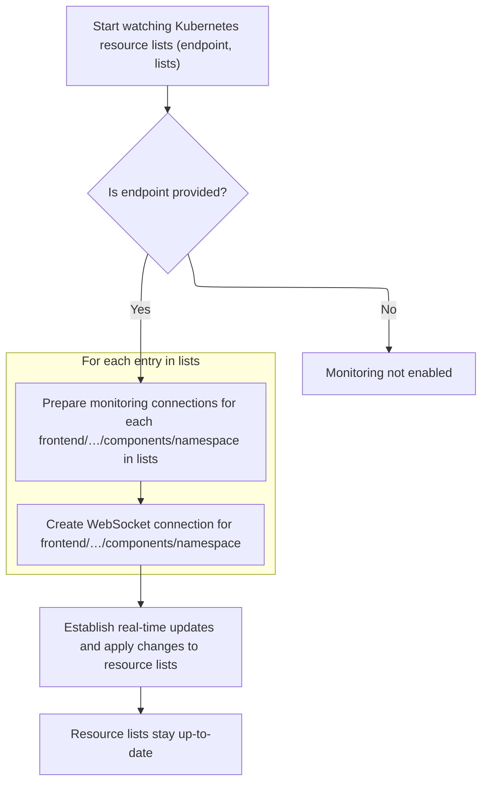

<SwmSnippet path="/frontend/src/lib/k8s/api/v2/useKubeObjectList.ts" line="303">

---

In <SwmToken path="frontend/src/lib/k8s/api/v2/useKubeObjectList.ts" pos="303:2:2" line-data="function useWatchKubeObjectListsLegacy&lt;K extends KubeObject&gt;({">`useWatchKubeObjectListsLegacy`</SwmToken>, we build a list of <SwmToken path="frontend/src/lib/k8s/api/v2/useKubeObjectList.ts" pos="311:11:11" line-data="  /** Query parameters for the WebSocket connection URL */">`WebSocket`</SwmToken> connections for each cluster/namespace/resourceVersion combo. Each connection gets its own URL and <SwmToken path="frontend/src/lib/k8s/api/v2/useKubeObjectList.ts" pos="333:1:1" line-data="        onMessage(update: KubeListUpdateEvent&lt;K&gt;) {">`onMessage`</SwmToken> handler to update the query cache when events come in. We need to call <SwmToken path="frontend/src/lib/k8s/api/v2/useKubeObjectList.ts" pos="357:1:1" line-data="  useWebSockets&lt;KubeListUpdateEvent&lt;K&gt;&gt;({">`useWebSockets`</SwmToken> next to actually open these connections and start listening.

```typescript
function useWatchKubeObjectListsLegacy<K extends KubeObject>({
  kubeObjectClass,
  endpoint,
  lists,
  queryParams,
}: {
  /** KubeObject class of the watched resource list */
  kubeObjectClass: (new (...args: any) => K) & typeof KubeObject<any>;
  /** Query parameters for the WebSocket connection URL */
  queryParams?: QueryParameters;
  /** Kube resource API endpoint information */
  endpoint?: KubeObjectEndpoint | null;
  /** Which clusters and namespaces to watch */
  lists: Array<{ cluster: string; namespace?: string; resourceVersion: string }>;
}) {
  const client = useQueryClient();

  const connections = useMemo(() => {
    if (!endpoint) return [];

    return lists.map(({ cluster, namespace, resourceVersion }) => {
      const url = makeUrl([KubeObjectEndpoint.toUrl(endpoint!, namespace)], {
        ...queryParams,
        watch: 1,
        resourceVersion,
      });

      return {
        cluster,
        url,
        onMessage(update: KubeListUpdateEvent<K>) {
          const key = kubeObjectListQuery<K>(
            kubeObjectClass,
            endpoint,
            namespace,
            cluster,
            queryParams ?? {}
          ).queryKey;
```

---

</SwmSnippet>

<SwmSnippet path="/frontend/src/lib/k8s/api/v2/useKubeObjectList.ts" line="341">

---

Here, after setting up the watcher connections, we define how each incoming <SwmToken path="frontend/src/lib/k8s/api/v2/useKubeObjectList.ts" pos="135:11:11" line-data="  /** Query parameters for the WebSocket connection URL */">`WebSocket`</SwmToken> message updates the cached resource list. The handler merges updates into the cache using <SwmToken path="frontend/src/lib/k8s/api/v2/useKubeObjectList.ts" pos="344:7:9" line-data="            const newList = KubeList.applyUpdate(">`KubeList.applyUpdate`</SwmToken>. We need to call <SwmToken path="frontend/src/lib/k8s/api/v2/useKubeObjectList.ts" pos="357:1:1" line-data="  useWebSockets&lt;KubeListUpdateEvent&lt;K&gt;&gt;({">`useWebSockets`</SwmToken> next to actually open the sockets and start receiving these updates.

```typescript
          client.setQueryData(key, (oldResponse: ListResponse<any> | undefined | null) => {
            if (!oldResponse) return oldResponse;

            const newList = KubeList.applyUpdate(
              oldResponse.list,
              update,
              kubeObjectClass,
              cluster
            );
            return { ...oldResponse, list: newList };
          });
        },
      };
    });
  }, [lists, kubeObjectClass, endpoint]);

  useWebSockets<KubeListUpdateEvent<K>>({
    enabled: !!endpoint,
    connections,
  });
}
```

---

</SwmSnippet>

## Managing <SwmToken path="frontend/src/lib/k8s/api/v2/useKubeObjectList.ts" pos="135:11:11" line-data="  /** Query parameters for the WebSocket connection URL */">`WebSocket`</SwmToken> Connections and Listeners

```mermaid
%%{init: {"flowchart": {"defaultRenderer": "elk"}} }%%
flowchart TD
    node1{"Are WebSocket connections enabled?"}
    click node1 openCode "frontend/src/lib/k8s/api/v2/webSocket.ts:585:586"
    node1 -->|"Yes"| node2["For each endpoint, manage connection"]
    node1 -->|"No"| node6["No WebSocket connections"]
    click node6 openCode "frontend/src/lib/k8s/api/v2/webSocket.ts:586:586"
    
    subgraph loop1["For each endpoint in connections"]
      node2 --> node3{"Is connection already open or pending?"}
      click node3 openCode "frontend/src/lib/k8s/api/v2/webSocket.ts:594:599"
      node3 -->|"No"| node4["Opening WebSocket Connections with Custom Protocols"]
      
      node3 -->|"Yes"| node5["Processing Incoming Resource Updates"]
      
      node4 --> node5["Processing Incoming Resource Updates"]
      node5 --> node6{"Are there any listeners left?"}
      click node6 openCode "frontend/src/lib/k8s/api/v2/webSocket.ts:628:638"
    end

classDef HeadingStyle fill:#777777,stroke:#333,stroke-width:2px;
click node4 goToHeading "Opening WebSocket Connections with Custom Protocols"
node4:::HeadingStyle
click node5 goToHeading "Processing Incoming Resource Updates"
node5:::HeadingStyle

%% Swimm:
%% %%{init: {"flowchart": {"defaultRenderer": "elk"}} }%%
%% flowchart TD
%%     node1{"Are <SwmToken path="frontend/src/lib/k8s/api/v2/useKubeObjectList.ts" pos="135:11:11" line-data="  /** Query parameters for the WebSocket connection URL */">`WebSocket`</SwmToken> connections enabled?"}
%%     click node1 openCode "<SwmPath>[frontend/…/v2/webSocket.ts](frontend/src/lib/k8s/api/v2/webSocket.ts)</SwmPath>:585:586"
%%     node1 -->|"Yes"| node2["For each endpoint, manage connection"]
%%     node1 -->|"No"| node6["No <SwmToken path="frontend/src/lib/k8s/api/v2/useKubeObjectList.ts" pos="135:11:11" line-data="  /** Query parameters for the WebSocket connection URL */">`WebSocket`</SwmToken> connections"]
%%     click node6 openCode "<SwmPath>[frontend/…/v2/webSocket.ts](frontend/src/lib/k8s/api/v2/webSocket.ts)</SwmPath>:586:586"
%%     
%%     subgraph loop1["For each endpoint in connections"]
%%       node2 --> node3{"Is connection already open or pending?"}
%%       click node3 openCode "<SwmPath>[frontend/…/v2/webSocket.ts](frontend/src/lib/k8s/api/v2/webSocket.ts)</SwmPath>:594:599"
%%       node3 -->|"No"| node4["Opening <SwmToken path="frontend/src/lib/k8s/api/v2/useKubeObjectList.ts" pos="135:11:11" line-data="  /** Query parameters for the WebSocket connection URL */">`WebSocket`</SwmToken> Connections with Custom Protocols"]
%%       
%%       node3 -->|"Yes"| node5["Processing Incoming Resource Updates"]
%%       
%%       node4 --> node5["Processing Incoming Resource Updates"]
%%       node5 --> node6{"Are there any listeners left?"}
%%       click node6 openCode "<SwmPath>[frontend/…/v2/webSocket.ts](frontend/src/lib/k8s/api/v2/webSocket.ts)</SwmPath>:628:638"
%%     end
%% 
%% classDef HeadingStyle fill:#777777,stroke:#333,stroke-width:2px;
%% click node4 goToHeading "Opening <SwmToken path="frontend/src/lib/k8s/api/v2/useKubeObjectList.ts" pos="135:11:11" line-data="  /** Query parameters for the WebSocket connection URL */">`WebSocket`</SwmToken> Connections with Custom Protocols"
%% node4:::HeadingStyle
%% click node5 goToHeading "Processing Incoming Resource Updates"
%% node5:::HeadingStyle
```

<SwmSnippet path="/frontend/src/lib/k8s/api/v2/webSocket.ts" line="566">

---

UseWebSockets tracks sockets and listeners globally, sharing connections and cleaning up when no listeners remain. Next up is <SwmToken path="frontend/src/lib/k8s/api/v2/webSocket.ts" pos="602:1:1" line-data="        openWebSocket(url, { protocols, type, cluster, onMessage })">`openWebSocket`</SwmToken> to actually open the sockets.

```typescript
export function useWebSockets<T>({
  connections,
  enabled = true,
  protocols,
  type = 'json',
}: {
  enabled?: boolean;
  /** Make sure that connections value is stable between renders */
  connections: Array<WebSocketConnectionRequest<T>>;
  /**
   * Any additional protocols to include in WebSocket connection
   * make sure that the value is stable between renders
   */
  protocols?: string | string[];
  /**
   * Type of websocket data
   */
  type?: 'json' | 'binary';
}) {
  useEffect(() => {
    if (!enabled) return;

    let isCurrent = true;

    /** Open a connection to websocket */
    function connect({ cluster, url, onMessage }: WebSocketConnectionRequest<T>) {
      const connectionKey = cluster + url;

      if (!sockets.has(connectionKey)) {
        // Add new listener for this URL
        listeners.set(connectionKey, [...(listeners.get(connectionKey) ?? []), onMessage]);

        // Mark socket as pending, so we don't open more than one
        sockets.set(connectionKey, 'pending');

        let ws: WebSocket | undefined;
        openWebSocket(url, { protocols, type, cluster, onMessage })
          .then(socket => {
```

---

</SwmSnippet>

### Opening <SwmToken path="frontend/src/lib/k8s/api/v2/useKubeObjectList.ts" pos="135:11:11" line-data="  /** Query parameters for the WebSocket connection URL */">`WebSocket`</SwmToken> Connections with Custom Protocols

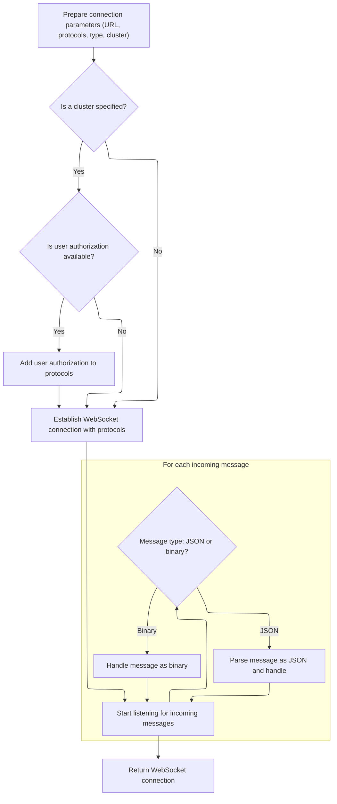

<SwmSnippet path="/frontend/src/lib/k8s/api/v2/webSocket.ts" line="503">

---

In <SwmToken path="frontend/src/lib/k8s/api/v2/webSocket.ts" pos="503:6:6" line-data="export async function openWebSocket&lt;T&gt;(">`openWebSocket`</SwmToken>, we prep the URL and protocols for the <SwmToken path="frontend/src/lib/k8s/api/v2/useKubeObjectList.ts" pos="135:11:11" line-data="  /** Query parameters for the WebSocket connection URL */">`WebSocket`</SwmToken> connection. We always include a binary protocol, and if a cluster is specified, we add an authorization protocol using the user ID. We need to call <SwmToken path="frontend/src/lib/k8s/api/v2/fetch.ts" pos="79:9:9" line-data="  const kubeconfig = await findKubeconfigByClusterName(init.cluster);">`findKubeconfigByClusterName`</SwmToken> next to check if the cluster has a kubeconfig and get the user ID for the protocol.

```typescript
export async function openWebSocket<T>(
  url: string,
  {
    protocols: moreProtocols = [],
    type = 'binary',
    cluster = getCluster() ?? '',
    onMessage,
  }: {
```

---

</SwmSnippet>

<SwmSnippet path="/frontend/src/lib/k8s/api/v2/webSocket.ts" line="511">

---

After resolving the cluster, <SwmToken path="frontend/src/lib/k8s/api/v2/webSocket.ts" pos="503:6:6" line-data="export async function openWebSocket&lt;T&gt;(">`openWebSocket`</SwmToken> tries to find a kubeconfig for it. If found, it grabs the user ID and adds an authorization protocol. If not, it logs the error and continues. Next up is actually opening the <SwmToken path="frontend/src/lib/k8s/api/v2/webSocket.ts" pos="512:15:15" line-data="     * Any additional protocols to include in WebSocket connection">`WebSocket`</SwmToken> with these settings.

```typescript
    /**
     * Any additional protocols to include in WebSocket connection
     */
    protocols?: string | string[];
    /**
     *
     */
    type: 'json' | 'binary';
    /**
     * Cluster name
     */
    cluster?: string;
    /**
     * Message callback
     */
    onMessage: (data: T) => void;
  }
) {
  const path = [url];
  const protocols = ['base64.binary.k8s.io', ...(moreProtocols ?? [])];

  if (cluster) {
    path.unshift('clusters', cluster);

    try {
      const kubeconfig = await findKubeconfigByClusterName(cluster);

      if (kubeconfig !== null) {
        const userID = getUserIdFromLocalStorage();
        protocols.push(`base64url.headlamp.authorization.k8s.io.${userID}`);
      }
    } catch (error) {
      console.error('Error while finding kubeconfig:', error);
    }
  }

```

---

</SwmSnippet>

<SwmSnippet path="/frontend/src/lib/k8s/api/v2/webSocket.ts" line="547">

---

After prepping the path and protocols, <SwmToken path="frontend/src/lib/k8s/api/v2/webSocket.ts" pos="503:6:6" line-data="export async function openWebSocket&lt;T&gt;(">`openWebSocket`</SwmToken> creates the actual <SwmToken path="frontend/src/lib/k8s/api/v2/webSocket.ts" pos="547:9:9" line-data="  const socket = new WebSocket(makeUrl([getBaseWsUrl(), ...path], {}), protocols);">`WebSocket`</SwmToken> instance using the full URL and protocol list. This is where the connection to the cluster happens.

```typescript
  const socket = new WebSocket(makeUrl([getBaseWsUrl(), ...path], {}), protocols);
```

---

</SwmSnippet>

<SwmSnippet path="/frontend/src/lib/k8s/api/v2/webSocket.ts" line="548">

---

After opening the socket, <SwmToken path="frontend/src/lib/k8s/api/v2/webSocket.ts" pos="503:6:6" line-data="export async function openWebSocket&lt;T&gt;(">`openWebSocket`</SwmToken> sets up the message and error handlers. Incoming messages are parsed as JSON or passed as binary, depending on the type. We need to call the next handler (usually in <SwmPath>[frontend/…/v2/hooks.ts](frontend/src/lib/k8s/api/v2/hooks.ts)</SwmPath>) to process these updates.

```typescript
  socket.binaryType = 'arraybuffer';
  socket.addEventListener('message', (body: MessageEvent) => {
    const data = type === 'json' ? JSON.parse(body.data) : body.data;
    onMessage(data);
  });
  socket.addEventListener('error', error => {
    console.error('WebSocket error:', error);
  });

  return socket;
}
```

---

</SwmSnippet>

### Processing Incoming Resource Updates

<SwmSnippet path="/frontend/src/lib/k8s/api/v2/hooks.ts" line="152">

---

OnMessage in <SwmPath>[frontend/…/v2/hooks.ts](frontend/src/lib/k8s/api/v2/hooks.ts)</SwmPath> processes incoming resource events from the <SwmToken path="frontend/src/lib/k8s/api/v2/useKubeObjectList.ts" pos="135:11:11" line-data="  /** Query parameters for the WebSocket connection URL */">`WebSocket`</SwmToken>. For MODIFIED or DELETED events, it updates the query cache with the new object. Next, the flow goes back to <SwmPath>[frontend/…/v2/webSocket.ts](frontend/src/lib/k8s/api/v2/webSocket.ts)</SwmPath> to keep the connection alive and handle more updates.

```typescript
    onMessage(update: KubeListUpdateEvent<K>) {
      if (update.type !== 'ADDED' && update.object) {
        client.setQueryData(queryKey, new kubeObjectClass(update.object));
      }
    },
```

---

</SwmSnippet>

### Subscribing to Resource Updates via <SwmToken path="frontend/src/lib/k8s/api/v2/useKubeObjectList.ts" pos="135:11:11" line-data="  /** Query parameters for the WebSocket connection URL */">`WebSocket`</SwmToken>

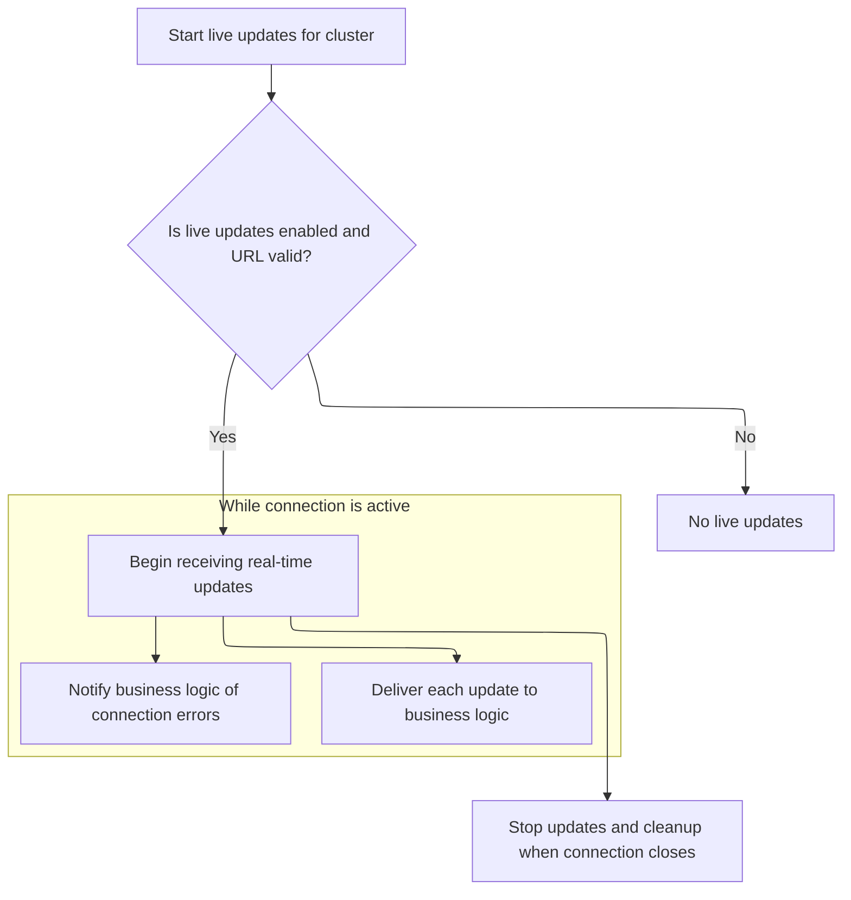

<SwmSnippet path="/frontend/src/lib/k8s/api/v2/webSocket.ts" line="416">

---

In <SwmToken path="frontend/src/lib/k8s/api/v2/webSocket.ts" pos="416:4:4" line-data="export function useWebSocket&lt;T&gt;({">`useWebSocket`</SwmToken>, we set up the connection lifecycle using React hooks. The URL and message handler are memoized, and the effect hook opens the connection when enabled. We need to call <SwmPath>[frontend/…/v2/hooks.ts](frontend/src/lib/k8s/api/v2/hooks.ts)</SwmPath> next to process incoming messages and handle updates.

```typescript
export function useWebSocket<T>({
  url: createUrl,
  enabled = true,
  cluster = '',
  onMessage,
  onError,
}: {
  /** Function that returns the WebSocket URL to connect to */
  url: () => string;
  /** Whether the WebSocket connection should be active */
  enabled?: boolean;
  /** The Kubernetes cluster ID to watch */
  cluster?: string;
  /** Callback function to handle incoming messages */
  onMessage: (data: T) => void;
  /** Callback function to handle connection errors */
  onError?: (error: Error) => void;
}) {
  const url = useMemo(() => (enabled ? createUrl() : ''), [enabled, createUrl]);

  const stableOnMessage = useCallback(
    (rawData: any) => {
      try {
        let parsedData: T;
        try {
          parsedData = typeof rawData === 'string' ? JSON.parse(rawData) : rawData;
        } catch (parseError) {
          console.error('Failed to parse WebSocket message:', parseError);
          onError?.(parseError as Error);
          return;
        }

        onMessage(parsedData);
      } catch (err) {
        console.error('Failed to process WebSocket message:', err);
        onError?.(err as Error);
      }
    },
    [onMessage, onError]
  );

```

---

</SwmSnippet>

<SwmSnippet path="/frontend/src/lib/k8s/api/v2/webSocket.ts" line="457">

---

UseWebSocket resolves the base URL for the socket, then moves on to subscribing for updates.

```typescript
  useEffect(() => {
    if (!enabled || !url) {
      return;
    }

    let cleanup: (() => void) | undefined;

    const connectWebSocket = async () => {
      try {
        const parsedUrl = new URL(url, getBaseWsUrl());
```

---

</SwmSnippet>

<SwmSnippet path="/frontend/src/lib/k8s/api/v2/webSocket.ts" line="467">

---

After resolving the full URL, <SwmToken path="frontend/src/lib/k8s/api/v2/hooks.ts" pos="152:1:1" line-data="  useWebSocket&lt;KubeListUpdateEvent&lt;K&gt;&gt;({">`useWebSocket`</SwmToken> subscribes to resource updates using <SwmToken path="frontend/src/lib/k8s/api/v2/webSocket.ts" pos="467:7:7" line-data="        cleanup = await WebSocketManager.subscribe(">`WebSocketManager`</SwmToken>. We split the URL into cluster, pathname, and search params so the manager can handle <SwmToken path="frontend/src/lib/k8s/api/v2/webSocket.ts" pos="51:13:15" line-data="   * This is particularly important in multi-cluster environments.">`multi-cluster`</SwmToken> connections cleanly.

```typescript
        cleanup = await WebSocketManager.subscribe(
          cluster,
          parsedUrl.pathname,
          parsedUrl.search.slice(1),
          stableOnMessage
        );
      } catch (err) {
        console.error('WebSocket connection failed:', err);
        onError?.(err as Error);
      }
    };

```

---

</SwmSnippet>

<SwmSnippet path="/frontend/src/lib/k8s/api/v2/webSocket.ts" line="479">

---

After subscribing, <SwmToken path="frontend/src/lib/k8s/api/v2/hooks.ts" pos="152:1:1" line-data="  useWebSocket&lt;KubeListUpdateEvent&lt;K&gt;&gt;({">`useWebSocket`</SwmToken> calls the cleanup function on unmount or dependency change. This closes the connection and removes listeners so we don't leak sockets.

```typescript
    connectWebSocket();

    return () => {
      if (cleanup) {
        cleanup();
      }
    };
  }, [url, enabled, cluster, stableOnMessage, onError]);
}
```

---

</SwmSnippet>

### Connecting and Handling <SwmToken path="frontend/src/lib/k8s/api/v2/useKubeObjectList.ts" pos="135:11:11" line-data="  /** Query parameters for the WebSocket connection URL */">`WebSocket`</SwmToken> Errors

<SwmSnippet path="/frontend/src/lib/k8s/api/v2/webSocket.ts" line="464">

---

In <SwmToken path="frontend/src/lib/k8s/api/v2/webSocket.ts" pos="464:3:3" line-data="    const connectWebSocket = async () =&gt; {">`connectWebSocket`</SwmToken>, we parse the URL and try to subscribe to updates. If anything goes wrong, we log the error and call the <SwmToken path="frontend/src/lib/k8s/api/v2/webSocket.ts" pos="421:1:1" line-data="  onError,">`onError`</SwmToken> handler. Next, we move on to actually subscribing with <SwmToken path="frontend/src/lib/k8s/api/v2/webSocket.ts" pos="467:7:7" line-data="        cleanup = await WebSocketManager.subscribe(">`WebSocketManager`</SwmToken>.

```typescript
    const connectWebSocket = async () => {
      try {
        const parsedUrl = new URL(url, getBaseWsUrl());
```

---

</SwmSnippet>

<SwmSnippet path="/frontend/src/lib/k8s/api/v2/webSocket.ts" line="467">

---

After subscribing with <SwmToken path="frontend/src/lib/k8s/api/v2/webSocket.ts" pos="467:7:7" line-data="        cleanup = await WebSocketManager.subscribe(">`WebSocketManager`</SwmToken>, we store the cleanup function so we can disconnect later. This keeps the connection lifecycle tight and avoids leaks.

```typescript
        cleanup = await WebSocketManager.subscribe(
          cluster,
          parsedUrl.pathname,
          parsedUrl.search.slice(1),
          stableOnMessage
        );
```

---

</SwmSnippet>

<SwmSnippet path="/frontend/src/lib/k8s/api/v2/webSocket.ts" line="473">

---

If subscribing fails, we log the error and call the <SwmToken path="frontend/src/lib/k8s/api/v2/webSocket.ts" pos="475:1:1" line-data="        onError?.(err as Error);">`onError`</SwmToken> callback. Next, we move to <SwmPath>[frontend/…/v1/streamingApi.ts](frontend/src/lib/k8s/api/v1/streamingApi.ts)</SwmPath> for more error handling and logging.

```typescript
      } catch (err) {
        console.error('WebSocket connection failed:', err);
        onError?.(err as Error);
      }
    };
```

---

</SwmSnippet>

<SwmSnippet path="/frontend/src/lib/k8s/api/v1/streamingApi.ts" line="495">

---

OnError in <SwmPath>[frontend/…/v1/streamingApi.ts](frontend/src/lib/k8s/api/v1/streamingApi.ts)</SwmPath> logs errors with a 'path' variable that's not passed in or declared locally. This relies on closure or outer scope, which is a repo-specific quirk you should watch out for.

```typescript
  function onError(err: any) {
    console.error('Error in api stream', { err, path });
  }
```

---

</SwmSnippet>

### Cleaning Up <SwmToken path="frontend/src/lib/k8s/api/v2/useKubeObjectList.ts" pos="135:11:11" line-data="  /** Query parameters for the WebSocket connection URL */">`WebSocket`</SwmToken> Connections and Listeners

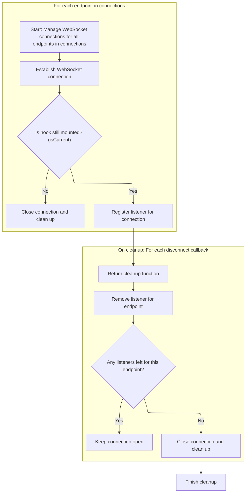

<SwmSnippet path="/frontend/src/lib/k8s/api/v2/webSocket.ts" line="604">

---

After opening the socket, <SwmToken path="frontend/src/lib/k8s/api/v2/useKubeObjectList.ts" pos="357:1:1" line-data="  useWebSockets&lt;KubeListUpdateEvent&lt;K&gt;&gt;({">`useWebSockets`</SwmToken> sets up cleanup logic to remove listeners and close sockets when no one is listening. This keeps resource usage tight and avoids leaks. Next, we call KubeObject.delete for further cleanup if needed.

```typescript
            ws = socket;

            // Hook was unmounted while it was connecting to WebSocket
            // so we close the socket and clean up
            if (!isCurrent) {
              ws.close();
              sockets.delete(connectionKey);
              return;
            }

            sockets.set(connectionKey, ws);
          })
          .catch(err => {
            console.error(err);
          });
      }

      return () => {
        const connectionKey = cluster + url;

        // Clean up the listener
        const newListeners = listeners.get(connectionKey)?.filter(it => it !== onMessage) ?? [];
        listeners.set(connectionKey, newListeners);

        // No one is listening to the connection
        // so we can close it
        if (newListeners.length === 0) {
          const maybeExisting = sockets.get(connectionKey);
          if (maybeExisting) {
            if (maybeExisting !== 'pending') {
              maybeExisting.close();
            }
            sockets.delete(connectionKey);
          }
        }
      };
    }

```

---

</SwmSnippet>

<SwmSnippet path="/frontend/src/lib/k8s/api/v2/webSocket.ts" line="642">

---

After all connections are set up, <SwmToken path="frontend/src/lib/k8s/api/v2/useKubeObjectList.ts" pos="357:1:1" line-data="  useWebSockets&lt;KubeListUpdateEvent&lt;K&gt;&gt;({">`useWebSockets`</SwmToken> tracks disconnect callbacks for each one. On cleanup, it marks <SwmToken path="frontend/src/lib/k8s/api/v2/webSocket.ts" pos="645:1:1" line-data="      isCurrent = false;">`isCurrent`</SwmToken> as false and calls all disconnects to close sockets and remove listeners.

```typescript
    const disconnectCallbacks = connections.map(endpoint => connect(endpoint));

    return () => {
      isCurrent = false;
      disconnectCallbacks.forEach(fn => fn());
    };
  }, [enabled, type, connections, protocols]);
}
```

---

</SwmSnippet>

## Opening and Sharing <SwmToken path="frontend/src/lib/k8s/api/v2/useKubeObjectList.ts" pos="135:11:11" line-data="  /** Query parameters for the WebSocket connection URL */">`WebSocket`</SwmToken> Connections

```mermaid
%%{init: {"flowchart": {"defaultRenderer": "elk"}} }%%
flowchart TD
  node1["Request to connect to WebSocket"] --> node2{"Is there already a connection for this cluster and URL?"}
  click node1 openCode "frontend/src/lib/k8s/api/v2/webSocket.ts:591:594"
  node2 -->|"No"| node3["Add listener and mark connection as pending"]
  click node2 openCode "frontend/src/lib/k8s/api/v2/webSocket.ts:594:599"
  node3 --> node4["Open WebSocket connection"]
  click node3 openCode "frontend/src/lib/k8s/api/v2/webSocket.ts:601:602"
  node4 --> node5{"Is connection still relevant when opened?"}
  click node4 openCode "frontend/src/lib/k8s/api/v2/webSocket.ts:603:608"
  node5 -->|"No"| node6["Close WebSocket and clean up"]
  click node5 openCode "frontend/src/lib/k8s/api/v2/webSocket.ts:608:611"
  node5 -->|"Yes"| node7["Store active WebSocket"]
  click node7 openCode "frontend/src/lib/k8s/api/v2/webSocket.ts:614:615"
  node2 -->|"Yes"| node8["Listener already exists or connection pending"]
  click node8 openCode "frontend/src/lib/k8s/api/v2/webSocket.ts:594:619"
  node3 --> node9["Return cleanup function"]
  node7 --> node9
  node6 --> node9
  node8 --> node9
  node9["Cleanup: Remove listener"]
  click node9 openCode "frontend/src/lib/k8s/api/v2/webSocket.ts:621:625"
  node9 --> node10{"Are there any listeners left?"}
  click node10 openCode "frontend/src/lib/k8s/api/v2/webSocket.ts:628:630"
  node10 -->|"No"| node11{"Is socket pending or established?"}
  click node11 openCode "frontend/src/lib/k8s/api/v2/webSocket.ts:631:633"
  node11 -->|"Established"| node12["Close WebSocket"]
  click node12 openCode "frontend/src/lib/k8s/api/v2/webSocket.ts:634:635"
  node11 -->|"Pending"| node13["Skip closing"]
  click node13 openCode "frontend/src/lib/k8s/api/v2/webSocket.ts:633:636"
  node12 --> node14["Remove socket from registry"]
  click node14 openCode "frontend/src/lib/k8s/api/v2/webSocket.ts:636:637"
  node13 --> node14
  node10 -->|"Yes"| node15["Keep connection open"]
  click node15 openCode "frontend/src/lib/k8s/api/v2/webSocket.ts:627:628"
classDef HeadingStyle fill:#777777,stroke:#333,stroke-width:2px;

%% Swimm:
%% %%{init: {"flowchart": {"defaultRenderer": "elk"}} }%%
%% flowchart TD
%%   node1["Request to connect to <SwmToken path="frontend/src/lib/k8s/api/v2/useKubeObjectList.ts" pos="135:11:11" line-data="  /** Query parameters for the WebSocket connection URL */">`WebSocket`</SwmToken>"] --> node2{"Is there already a connection for this cluster and URL?"}
%%   click node1 openCode "<SwmPath>[frontend/…/v2/webSocket.ts](frontend/src/lib/k8s/api/v2/webSocket.ts)</SwmPath>:591:594"
%%   node2 -->|"No"| node3["Add listener and mark connection as pending"]
%%   click node2 openCode "<SwmPath>[frontend/…/v2/webSocket.ts](frontend/src/lib/k8s/api/v2/webSocket.ts)</SwmPath>:594:599"
%%   node3 --> node4["Open <SwmToken path="frontend/src/lib/k8s/api/v2/useKubeObjectList.ts" pos="135:11:11" line-data="  /** Query parameters for the WebSocket connection URL */">`WebSocket`</SwmToken> connection"]
%%   click node3 openCode "<SwmPath>[frontend/…/v2/webSocket.ts](frontend/src/lib/k8s/api/v2/webSocket.ts)</SwmPath>:601:602"
%%   node4 --> node5{"Is connection still relevant when opened?"}
%%   click node4 openCode "<SwmPath>[frontend/…/v2/webSocket.ts](frontend/src/lib/k8s/api/v2/webSocket.ts)</SwmPath>:603:608"
%%   node5 -->|"No"| node6["Close <SwmToken path="frontend/src/lib/k8s/api/v2/useKubeObjectList.ts" pos="135:11:11" line-data="  /** Query parameters for the WebSocket connection URL */">`WebSocket`</SwmToken> and clean up"]
%%   click node5 openCode "<SwmPath>[frontend/…/v2/webSocket.ts](frontend/src/lib/k8s/api/v2/webSocket.ts)</SwmPath>:608:611"
%%   node5 -->|"Yes"| node7["Store active <SwmToken path="frontend/src/lib/k8s/api/v2/useKubeObjectList.ts" pos="135:11:11" line-data="  /** Query parameters for the WebSocket connection URL */">`WebSocket`</SwmToken>"]
%%   click node7 openCode "<SwmPath>[frontend/…/v2/webSocket.ts](frontend/src/lib/k8s/api/v2/webSocket.ts)</SwmPath>:614:615"
%%   node2 -->|"Yes"| node8["Listener already exists or connection pending"]
%%   click node8 openCode "<SwmPath>[frontend/…/v2/webSocket.ts](frontend/src/lib/k8s/api/v2/webSocket.ts)</SwmPath>:594:619"
%%   node3 --> node9["Return cleanup function"]
%%   node7 --> node9
%%   node6 --> node9
%%   node8 --> node9
%%   node9["Cleanup: Remove listener"]
%%   click node9 openCode "<SwmPath>[frontend/…/v2/webSocket.ts](frontend/src/lib/k8s/api/v2/webSocket.ts)</SwmPath>:621:625"
%%   node9 --> node10{"Are there any listeners left?"}
%%   click node10 openCode "<SwmPath>[frontend/…/v2/webSocket.ts](frontend/src/lib/k8s/api/v2/webSocket.ts)</SwmPath>:628:630"
%%   node10 -->|"No"| node11{"Is socket pending or established?"}
%%   click node11 openCode "<SwmPath>[frontend/…/v2/webSocket.ts](frontend/src/lib/k8s/api/v2/webSocket.ts)</SwmPath>:631:633"
%%   node11 -->|"Established"| node12["Close <SwmToken path="frontend/src/lib/k8s/api/v2/useKubeObjectList.ts" pos="135:11:11" line-data="  /** Query parameters for the WebSocket connection URL */">`WebSocket`</SwmToken>"]
%%   click node12 openCode "<SwmPath>[frontend/…/v2/webSocket.ts](frontend/src/lib/k8s/api/v2/webSocket.ts)</SwmPath>:634:635"
%%   node11 -->|"Pending"| node13["Skip closing"]
%%   click node13 openCode "<SwmPath>[frontend/…/v2/webSocket.ts](frontend/src/lib/k8s/api/v2/webSocket.ts)</SwmPath>:633:636"
%%   node12 --> node14["Remove socket from registry"]
%%   click node14 openCode "<SwmPath>[frontend/…/v2/webSocket.ts](frontend/src/lib/k8s/api/v2/webSocket.ts)</SwmPath>:636:637"
%%   node13 --> node14
%%   node10 -->|"Yes"| node15["Keep connection open"]
%%   click node15 openCode "<SwmPath>[frontend/…/v2/webSocket.ts](frontend/src/lib/k8s/api/v2/webSocket.ts)</SwmPath>:627:628"
%% classDef HeadingStyle fill:#777777,stroke:#333,stroke-width:2px;
```

<SwmSnippet path="/frontend/src/lib/k8s/api/v2/webSocket.ts" line="591">

---

In connect, we use cluster+url as a unique key to manage sockets and listeners. If no socket exists, we add the listener, mark the socket as pending, and open it. Cleanup removes listeners and closes sockets when needed. Next, we move on to the rest of <SwmToken path="frontend/src/lib/k8s/api/v2/useKubeObjectList.ts" pos="357:1:1" line-data="  useWebSockets&lt;KubeListUpdateEvent&lt;K&gt;&gt;({">`useWebSockets`</SwmToken> for full lifecycle management.

```typescript
    function connect({ cluster, url, onMessage }: WebSocketConnectionRequest<T>) {
      const connectionKey = cluster + url;

      if (!sockets.has(connectionKey)) {
        // Add new listener for this URL
        listeners.set(connectionKey, [...(listeners.get(connectionKey) ?? []), onMessage]);

        // Mark socket as pending, so we don't open more than one
        sockets.set(connectionKey, 'pending');

        let ws: WebSocket | undefined;
        openWebSocket(url, { protocols, type, cluster, onMessage })
          .then(socket => {
```

---

</SwmSnippet>

<SwmSnippet path="/frontend/src/lib/k8s/api/v2/webSocket.ts" line="604">

---

After opening and sharing sockets, connect returns a cleanup function that removes listeners and closes sockets when no one is listening. This keeps resource usage tight and avoids leaks. Next, we call KubeObject.delete for further cleanup if needed.

```typescript
            ws = socket;

            // Hook was unmounted while it was connecting to WebSocket
            // so we close the socket and clean up
            if (!isCurrent) {
              ws.close();
              sockets.delete(connectionKey);
              return;
            }

            sockets.set(connectionKey, ws);
          })
          .catch(err => {
            console.error(err);
          });
      }

      return () => {
        const connectionKey = cluster + url;

        // Clean up the listener
        const newListeners = listeners.get(connectionKey)?.filter(it => it !== onMessage) ?? [];
        listeners.set(connectionKey, newListeners);

        // No one is listening to the connection
        // so we can close it
        if (newListeners.length === 0) {
          const maybeExisting = sockets.get(connectionKey);
          if (maybeExisting) {
            if (maybeExisting !== 'pending') {
              maybeExisting.close();
            }
            sockets.delete(connectionKey);
          }
        }
      };
    }
```

---

</SwmSnippet>

## Returning Aggregated Resource List Results

```mermaid
%%{init: {"flowchart": {"defaultRenderer": "elk"}} }%%
flowchart TD
    subgraph loop1["For each error in query.errors"]
      node1["Filter out null errors"]
      click node1 openCode "frontend/src/lib/k8s/api/v2/useKubeObjectList.ts:536:536"
    end
    loop1 --> node2{"Is there an endpoint error?"}
    click node2 openCode "frontend/src/lib/k8s/api/v2/useKubeObjectList.ts:540:541"
    node2 -->|"Yes"| node3[Return summary: items=[], errors=[endpointError], error=endpointError, status & cluster info, iterator]
    click node3 openCode "frontend/src/lib/k8s/api/v2/useKubeObjectList.ts:539:552"
    node2 -->|"No"| node4{"Are there any errors?"}
    click node4 openCode "frontend/src/lib/k8s/api/v2/useKubeObjectList.ts:541:542"
    node4 -->|"Yes"| node5["Return summary: items=query.items, errors=filtered errors, error=first error, status & cluster info, iterator"]
    click node5 openCode "frontend/src/lib/k8s/api/v2/useKubeObjectList.ts:539:552"
    node4 -->|"No"| node6["Return summary: items=query.items, errors=null, error=null, status & cluster info, iterator"]
    click node6 openCode "frontend/src/lib/k8s/api/v2/useKubeObjectList.ts:539:552"

classDef HeadingStyle fill:#777777,stroke:#333,stroke-width:2px;

%% Swimm:
%% %%{init: {"flowchart": {"defaultRenderer": "elk"}} }%%
%% flowchart TD
%%     subgraph loop1["For each error in <SwmToken path="frontend/src/lib/k8s/api/v2/useKubeObjectList.ts" pos="536:7:9" line-data="  const errors = query.errors.filter(it =&gt; it !== null);">`query.errors`</SwmToken>"]
%%       node1["Filter out null errors"]
%%       click node1 openCode "<SwmPath>[frontend/…/v2/useKubeObjectList.ts](frontend/src/lib/k8s/api/v2/useKubeObjectList.ts)</SwmPath>:536:536"
%%     end
%%     loop1 --> node2{"Is there an endpoint error?"}
%%     click node2 openCode "<SwmPath>[frontend/…/v2/useKubeObjectList.ts](frontend/src/lib/k8s/api/v2/useKubeObjectList.ts)</SwmPath>:540:541"
%%     node2 -->|"Yes"| node3[Return summary: items=[], errors=[<SwmToken path="frontend/src/lib/k8s/api/v2/useKubeObjectList.ts" pos="420:11:11" line-data="  const { endpoint, error: endpointError } = useEndpoints(">`endpointError`</SwmToken>], error=<SwmToken path="frontend/src/lib/k8s/api/v2/useKubeObjectList.ts" pos="420:11:11" line-data="  const { endpoint, error: endpointError } = useEndpoints(">`endpointError`</SwmToken>, status & cluster info, iterator]
%%     click node3 openCode "<SwmPath>[frontend/…/v2/useKubeObjectList.ts](frontend/src/lib/k8s/api/v2/useKubeObjectList.ts)</SwmPath>:539:552"
%%     node2 -->|"No"| node4{"Are there any errors?"}
%%     click node4 openCode "<SwmPath>[frontend/…/v2/useKubeObjectList.ts](frontend/src/lib/k8s/api/v2/useKubeObjectList.ts)</SwmPath>:541:542"
%%     node4 -->|"Yes"| node5["Return summary: items=<SwmToken path="frontend/src/lib/k8s/api/v2/useKubeObjectList.ts" pos="540:13:15" line-data="    items: endpointError ? [] : query.items,">`query.items`</SwmToken>, errors=filtered errors, error=first error, status & cluster info, iterator"]
%%     click node5 openCode "<SwmPath>[frontend/…/v2/useKubeObjectList.ts](frontend/src/lib/k8s/api/v2/useKubeObjectList.ts)</SwmPath>:539:552"
%%     node4 -->|"No"| node6["Return summary: items=<SwmToken path="frontend/src/lib/k8s/api/v2/useKubeObjectList.ts" pos="540:13:15" line-data="    items: endpointError ? [] : query.items,">`query.items`</SwmToken>, errors=null, error=null, status & cluster info, iterator"]
%%     click node6 openCode "<SwmPath>[frontend/…/v2/useKubeObjectList.ts](frontend/src/lib/k8s/api/v2/useKubeObjectList.ts)</SwmPath>:539:552"
%% 
%% classDef HeadingStyle fill:#777777,stroke:#333,stroke-width:2px;
```

<SwmSnippet path="/frontend/src/lib/k8s/api/v2/useKubeObjectList.ts" line="536">

---

After all watchers and queries are set up, <SwmToken path="frontend/src/lib/k8s/KubeObject.ts" pos="369:7:7" line-data="    const result = useKubeObjectList&lt;K&gt;({">`useKubeObjectList`</SwmToken> returns the final aggregated result. This includes items, errors, cluster-specific results, and loading states, so the caller gets a full picture of the resource list status.

```typescript
  const errors = query.errors.filter(it => it !== null);

  // @ts-ignore - TS compiler gets confused with iterators
  return {
    items: endpointError ? [] : query.items,
    errors: endpointError ? [endpointError] : errors.length > 0 ? errors : null,
    error: endpointError ?? query.errors.find(it => it !== null) ?? null,
    clusterResults: query.clusterResults,
    isError: query.isError,
    isLoading: query.isLoading,
    isFetching: query.isFetching,
    isSuccess: query.isSuccess,
    *[Symbol.iterator](): ArrayIterator<ApiError | K[] | null> {
      yield query.items;
      yield endpointError ?? query.errors.find(it => it !== null) ?? null;
    },
  };
}
```

---

</SwmSnippet>

&nbsp;

*This is an auto-generated document by Swimm 🌊 and has not yet been verified by a human*

<SwmMeta version="3.0.0" repo-id="Z2l0aHViJTNBJTNBdHlwZXNjcmlwdC1oZWFkbGFtcCUzQSUzQXJpY2FyZG9sb3Blemc=" repo-name="typescript-headlamp"><sup>Powered by [Swimm](https://app.swimm.io/)</sup></SwmMeta>
