This document describes how the application retrieves version information for a cluster. The process determines the appropriate cluster, requests version details, and manages authentication and session state to ensure accurate and secure information.

# Where is this flow used?

This flow is used multiple times in the codebase as represented in the following diagram:

```mermaid
graph TD;
      348360a97cd4f3990bff9ad58310dfb0e9cdf3f75edbf084ea02cbd1eb319fc2(frontend/…/Sidebar/VersionButton.tsx::VersionButton) --> 87d87fa85c4bb8de0282fd06a10745c0b4807ae6216279437f45580a9b512252(frontend/…/k8s/index.ts::getVersion):::mainFlowStyle

16ba081e5100ab83482fdbfa45ea6b188829746dff65724d7562a5667b8dc37a(frontend/…/Sidebar/VersionButton.tsx::queryFn) --> 87d87fa85c4bb8de0282fd06a10745c0b4807ae6216279437f45580a9b512252(frontend/…/k8s/index.ts::getVersion):::mainFlowStyle

dee1b27a66474774cd2249500433270a6dabcb9d9c56075424fe719e35e27e14(frontend/…/k8s/index.ts::useClustersVersion) --> 87d87fa85c4bb8de0282fd06a10745c0b4807ae6216279437f45580a9b512252(frontend/…/k8s/index.ts::getVersion):::mainFlowStyle

e632ac44f146477e89169e3d6190cf013adc9f0ae967eb58c42fe4ec48e3aa87(frontend/…/404/index.tsx::HomeComponent) --> dee1b27a66474774cd2249500433270a6dabcb9d9c56075424fe719e35e27e14(frontend/…/k8s/index.ts::useClustersVersion)


classDef mainFlowStyle color:#000000,fill:#7CB9F4
classDef rootsStyle color:#000000,fill:#00FFF4
classDef Style1 color:#000000,fill:#00FFAA
classDef Style2 color:#000000,fill:#FFFF00
classDef Style3 color:#000000,fill:#AA7CB9

%% Swimm:
%% graph TD;
%%       348360a97cd4f3990bff9ad58310dfb0e9cdf3f75edbf084ea02cbd1eb319fc2(<SwmPath>[frontend/…/Sidebar/VersionButton.tsx](frontend/src/components/Sidebar/VersionButton.tsx)</SwmPath>::VersionButton) --> 87d87fa85c4bb8de0282fd06a10745c0b4807ae6216279437f45580a9b512252(<SwmPath>[frontend/…/k8s/index.ts](frontend/src/lib/k8s/index.ts)</SwmPath>::<SwmToken path="frontend/src/lib/k8s/index.ts" pos="184:4:4" line-data="export function getVersion(clusterName: string = &#39;&#39;): Promise&lt;StringDict&gt; {">`getVersion`</SwmToken>):::mainFlowStyle
%% 
%% 16ba081e5100ab83482fdbfa45ea6b188829746dff65724d7562a5667b8dc37a(<SwmPath>[frontend/…/Sidebar/VersionButton.tsx](frontend/src/components/Sidebar/VersionButton.tsx)</SwmPath>::queryFn) --> 87d87fa85c4bb8de0282fd06a10745c0b4807ae6216279437f45580a9b512252(<SwmPath>[frontend/…/k8s/index.ts](frontend/src/lib/k8s/index.ts)</SwmPath>::<SwmToken path="frontend/src/lib/k8s/index.ts" pos="184:4:4" line-data="export function getVersion(clusterName: string = &#39;&#39;): Promise&lt;StringDict&gt; {">`getVersion`</SwmToken>):::mainFlowStyle
%% 
%% dee1b27a66474774cd2249500433270a6dabcb9d9c56075424fe719e35e27e14(<SwmPath>[frontend/…/k8s/index.ts](frontend/src/lib/k8s/index.ts)</SwmPath>::<SwmToken path="frontend/src/lib/k8s/index.ts" pos="348:4:4" line-data="export function useClustersVersion(clusters: Cluster[]) {">`useClustersVersion`</SwmToken>) --> 87d87fa85c4bb8de0282fd06a10745c0b4807ae6216279437f45580a9b512252(<SwmPath>[frontend/…/k8s/index.ts](frontend/src/lib/k8s/index.ts)</SwmPath>::<SwmToken path="frontend/src/lib/k8s/index.ts" pos="184:4:4" line-data="export function getVersion(clusterName: string = &#39;&#39;): Promise&lt;StringDict&gt; {">`getVersion`</SwmToken>):::mainFlowStyle
%% 
%% e632ac44f146477e89169e3d6190cf013adc9f0ae967eb58c42fe4ec48e3aa87(<SwmPath>[frontend/…/404/index.tsx](frontend/src/components/404/index.tsx)</SwmPath>::HomeComponent) --> dee1b27a66474774cd2249500433270a6dabcb9d9c56075424fe719e35e27e14(<SwmPath>[frontend/…/k8s/index.ts](frontend/src/lib/k8s/index.ts)</SwmPath>::<SwmToken path="frontend/src/lib/k8s/index.ts" pos="348:4:4" line-data="export function useClustersVersion(clusters: Cluster[]) {">`useClustersVersion`</SwmToken>)
%% 
%% 
%% classDef mainFlowStyle color:#000000,fill:#7CB9F4
%% classDef rootsStyle color:#000000,fill:#00FFF4
%% classDef Style1 color:#000000,fill:#00FFAA
%% classDef Style2 color:#000000,fill:#FFFF00
%% classDef Style3 color:#000000,fill:#AA7CB9
```



# Starting the Version Fetch


<SwmSnippet path="/frontend/src/lib/k8s/index.ts" line="184">

---

<SwmToken path="frontend/src/lib/k8s/index.ts" pos="184:4:4" line-data="export function getVersion(clusterName: string = &#39;&#39;): Promise&lt;StringDict&gt; {">`getVersion`</SwmToken> kicks off the flow by calling <SwmToken path="frontend/src/lib/k8s/index.ts" pos="185:3:3" line-data="  return clusterRequest(&#39;/version&#39;, { cluster: clusterName || getCluster() });">`clusterRequest`</SwmToken> with the '/version' endpoint and the relevant cluster name. This delegates the actual HTTP request logic to <SwmToken path="frontend/src/lib/k8s/index.ts" pos="185:3:3" line-data="  return clusterRequest(&#39;/version&#39;, { cluster: clusterName || getCluster() });">`clusterRequest`</SwmToken>, which handles cluster-specific headers and authentication. We need to call <SwmToken path="frontend/src/lib/k8s/index.ts" pos="185:3:3" line-data="  return clusterRequest(&#39;/version&#39;, { cluster: clusterName || getCluster() });">`clusterRequest`</SwmToken> next because that's where the logic for forming and sending the request, as well as handling cluster context, actually lives.

```typescript
export function getVersion(clusterName: string = ''): Promise<StringDict> {
  return clusterRequest('/version', { cluster: clusterName || getCluster() });
}
```

---

</SwmSnippet>

# Building and Sending the Cluster Request


<SwmSnippet path="/frontend/src/lib/k8s/api/v1/clusterRequests.ts" line="122">

---

In <SwmToken path="frontend/src/lib/k8s/api/v1/clusterRequests.ts" pos="122:6:6" line-data="export async function clusterRequest(">`clusterRequest`</SwmToken>, we prep the request by adding cluster-specific kubeconfig and user ID headers if a cluster is specified, set up a timeout using <SwmToken path="frontend/src/lib/k8s/api/v1/clusterRequests.ts" pos="157:9:9" line-data="  const controller = new AbortController();">`AbortController`</SwmToken>, and handle special backend signals like <SwmToken path="frontend/src/lib/k8s/api/v1/clusterRequests.ts" pos="185:14:16" line-data="  const headerVal = response.headers.get(&#39;X-Reload&#39;);">`X-Reload`</SwmToken> for page reloads. If we get a 401 with an Authorization header, we call <SwmToken path="frontend/src/lib/k8s/api/v1/clusterRequests.ts" pos="194:1:1" line-data="      logout(cluster);">`logout`</SwmToken> from the auth module to clear the user's session. We need to call into auth next to handle this forced logout cleanly.

```typescript
export async function clusterRequest(
  path: string,
  params: ClusterRequestParams = {},
  queryParams?: QueryParameters
): Promise<any> {
  interface RequestHeaders {
    Authorization?: string;
    cluster?: string;
    autoLogoutOnAuthError?: boolean;
    [otherHeader: string]: any;
  }

  const {
    timeout = DEFAULT_TIMEOUT,
    cluster: paramsCluster,
    autoLogoutOnAuthError = true,
    isJSON = true,
    ...otherParams
  } = params;

  const userID = getUserIdFromLocalStorage();
  const opts: { headers: RequestHeaders } = Object.assign({ headers: {} }, otherParams);
  const cluster = paramsCluster || '';

  let fullPath = path;
  if (cluster) {
    const kubeconfig = await findKubeconfigByClusterName(cluster);
    if (kubeconfig !== null) {
      opts.headers['KUBECONFIG'] = kubeconfig;
      opts.headers['X-HEADLAMP-USER-ID'] = userID;
    }

    fullPath = combinePath(`/${CLUSTERS_PREFIX}/${cluster}`, path);
  }

  const controller = new AbortController();
  const id = setTimeout(() => controller.abort(), timeout);

  let url = combinePath(getAppUrl(), fullPath);
  url += asQuery(queryParams);
  const requestData = {
    signal: controller.signal,
    credentials: 'include' as RequestCredentials,
    ...opts,
  };
  if (isBackstage()) {
    requestData.headers = addBackstageAuthHeaders(requestData.headers);
  }
  let response: Response = new Response(undefined, { status: 502, statusText: 'Unreachable' });
  try {
    response = await fetch(url, requestData);
  } catch (err) {
    if (err instanceof Error) {
      if (err.name === 'AbortError') {
        response = new Response(undefined, { status: 408, statusText: 'Request timed-out' });
      }
    }
  } finally {
    clearTimeout(id);
  }

  // The backend signals through this header that it wants a reload.
  // See plugins.go
  const headerVal = response.headers.get('X-Reload');
  if (headerVal && headerVal.indexOf('reload') !== -1) {
    window.location.reload();
  }

  if (!response.ok) {
    const { status, statusText } = response;
    if (autoLogoutOnAuthError && status === 401 && opts.headers.Authorization) {
      console.error('Logging out due to auth error', { status, statusText, path });
      logout(cluster);
    }

```

---

</SwmSnippet>

## Clearing User Session and Cache

<SwmSnippet path="/frontend/src/lib/auth.ts" line="131">

---

<SwmToken path="frontend/src/lib/auth.ts" pos="131:6:6" line-data="export async function logout(cluster: string) {">`logout`</SwmToken> calls <SwmToken path="frontend/src/lib/auth.ts" pos="132:3:3" line-data="  return setToken(cluster, null).then(() =&gt; {">`setToken`</SwmToken> with null to clear the token for the cluster, then removes cached queries for 'auth' and <SwmToken path="frontend/src/lib/auth.ts" pos="134:12:12" line-data="    queryClient.removeQueries({ queryKey: [&#39;clusterMe&#39;, cluster], exact: true });">`clusterMe`</SwmToken> to make sure no stale user data sticks around. We call <SwmToken path="frontend/src/lib/auth.ts" pos="132:3:3" line-data="  return setToken(cluster, null).then(() =&gt; {">`setToken`</SwmToken> next to actually clear the token in storage and trigger any related side effects.

```typescript
export async function logout(cluster: string) {
  return setToken(cluster, null).then(() => {
    queryClient.removeQueries({ queryKey: ['auth'], exact: false });
    queryClient.removeQueries({ queryKey: ['clusterMe', cluster], exact: true });
  });
}
```

---

</SwmSnippet>

## Updating Token and Invalidating Queries


<SwmSnippet path="/frontend/src/lib/auth.ts" line="108">

---

<SwmToken path="frontend/src/lib/auth.ts" pos="108:4:4" line-data="export function setToken(cluster: string, token: string | null) {">`setToken`</SwmToken> checks if there's a custom override for setting the token; if so, it uses that, otherwise it calls <SwmToken path="frontend/src/lib/auth.ts" pos="114:3:3" line-data="  return setCookieToken(cluster, token).then(result =&gt; {">`setCookieToken`</SwmToken>. After updating the token, it either invalidates or removes cluster-specific queries to keep the client state in sync. We call <SwmToken path="frontend/src/lib/auth.ts" pos="114:3:3" line-data="  return setCookieToken(cluster, token).then(result =&gt; {">`setCookieToken`</SwmToken> next to actually update the token in the backend or browser.

```typescript
export function setToken(cluster: string, token: string | null) {
  const setTokenMethodToUse = store.getState().ui.functionsToOverride.setToken;
  if (setTokenMethodToUse) {
    return Promise.resolve(setTokenMethodToUse(cluster, token));
  }

  return setCookieToken(cluster, token).then(result => {
    if (token) {
      queryClient.invalidateQueries({ queryKey: ['clusterMe', cluster], exact: true });
    } else {
      queryClient.removeQueries({ queryKey: ['clusterMe', cluster], exact: true });
    }

    return result;
  });
}
```

---

</SwmSnippet>

## Persisting Token to Backend

<SwmSnippet path="/frontend/src/lib/auth.ts" line="79">

---

<SwmToken path="frontend/src/lib/auth.ts" pos="79:4:4" line-data="async function setCookieToken(cluster: string, token: string | null) {">`setCookieToken`</SwmToken> sends the token to the backend using a POST request, including the right headers. If the backend responds with an error, it throws. We call <SwmToken path="frontend/src/lib/auth.ts" pos="81:9:9" line-data="    const response = await backendFetch(`/clusters/${cluster}/set-token`, {">`backendFetch`</SwmToken> next to actually perform the HTTP request and handle any backend-specific response logic.

```typescript
async function setCookieToken(cluster: string, token: string | null) {
  try {
    const response = await backendFetch(`/clusters/${cluster}/set-token`, {
      method: 'POST',
      headers: {
        'Content-Type': 'application/json',
        ...getHeadlampAPIHeaders(),
      },
      body: JSON.stringify({ token }),
    });

    if (!response.ok) {
      throw new Error(`Failed to set cookie token`);
    }
    return true;
  } catch (error) {
    console.error('Error setting cookie token:', error);
    throw error;
  }
}
```

---

</SwmSnippet>

<SwmSnippet path="/frontend/src/lib/k8s/api/v2/fetch.ts" line="38">

---

<SwmToken path="frontend/src/lib/k8s/api/v2/fetch.ts" pos="38:6:6" line-data="export async function backendFetch(url: string | URL, init: RequestInit = {}) {">`backendFetch`</SwmToken> builds the request with repo-specific auth headers and URL logic, sends it, and checks for the <SwmToken path="frontend/src/lib/k8s/api/v2/fetch.ts" pos="46:14:16" line-data="  const headerVal = response.headers.get(&#39;X-Reload&#39;);">`X-Reload`</SwmToken> header to possibly reload the page. If the response isn't ok, it tries to parse an error message and throws. This keeps the frontend in sync with backend state changes.

```typescript
export async function backendFetch(url: string | URL, init: RequestInit = {}) {
  // Always include credentials
  init.credentials = 'include';
  init.headers = addBackstageAuthHeaders(init.headers);
  const response = await fetch(makeUrl([getAppUrl(), url]), init);

  // The backend signals through this header that it wants a reload.
  // See plugins.go
  const headerVal = response.headers.get('X-Reload');
  if (headerVal && headerVal.indexOf('reload') !== -1) {
    window.location.reload();
  }

  if (!response.ok) {
    // Try to parse error message from response
    let maybeErrorMessage: string | undefined;
    try {
      const body = await response.json();
      maybeErrorMessage = typeof body === 'string' ? body : body.message;
    } catch (e) {}

    throw new ApiError(maybeErrorMessage ?? 'Unreachable', { status: response.status });
  }

  return response;
}
```

---

</SwmSnippet>

## Handling Errors After Logout


<SwmSnippet path="/frontend/src/lib/k8s/api/v1/clusterRequests.ts" line="197">

---

After coming back from <SwmToken path="frontend/src/lib/k8s/api/v1/clusterRequests.ts" pos="194:1:1" line-data="      logout(cluster);">`logout`</SwmToken> in the auth module, <SwmToken path="frontend/src/lib/k8s/index.ts" pos="185:3:3" line-data="  return clusterRequest(&#39;/version&#39;, { cluster: clusterName || getCluster() });">`clusterRequest`</SwmToken> tries to parse the error response and builds an error message. It rejects with an error containing the status and message, so the UI can show the user what went wrong and prompt for re-authentication if needed.

```typescript
    let message = statusText;
    try {
      if (isJSON) {
        const json = await response.json();
        message += ` - ${json.message}`;
      }
    } catch (err) {
      console.error(
        'Unable to parse error json at url:',
        url,
        { err },
        'with request data:',
        requestData
      );
    }

    const error = new Error(message) as ApiError;
    error.status = status;
    return Promise.reject(error);
  }

  if (!isJSON) {
    return Promise.resolve(response);
  }

  return response.json();
}
```

---

</SwmSnippet>

&nbsp;

*This is an auto-generated document by Swimm 🌊 and has not yet been verified by a human*

<SwmMeta version="3.0.0" repo-id="Z2l0aHViJTNBJTNBdHlwZXNjcmlwdC1oZWFkbGFtcCUzQSUzQXJpY2FyZG9sb3Blemc=" repo-name="typescript-headlamp"><sup>Powered by [Swimm](https://app.swimm.io/)</sup></SwmMeta>
