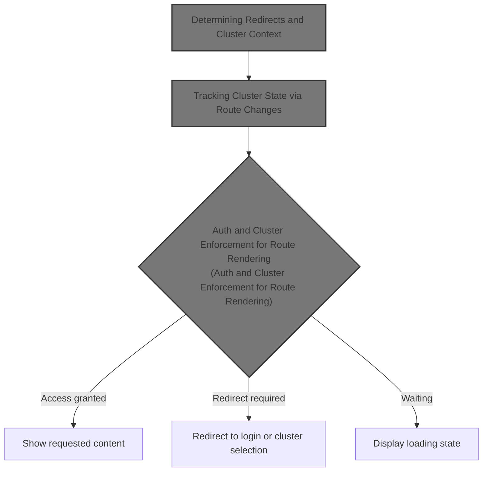

This document describes how access to application routes is managed based on authentication and cluster selection. When a user requests a route, the system checks authentication and cluster requirements, tracks the current cluster context, and decides whether to show the requested content, redirect the user, or display a loading state.



# Determining Redirects and Cluster Context

<SwmSnippet path="/frontend/src/components/App/RouteSwitcher.tsx" line="149">

---

In <SwmToken path="frontend/src/components/App/RouteSwitcher.tsx" pos="149:2:2" line-data="function AuthRoute(props: AuthRouteProps) {">`AuthRoute`</SwmToken>, we decide the redirect route based on cluster presence and set up sidebar context. We then call <SwmToken path="frontend/src/components/App/RouteSwitcher.tsx" pos="160:7:7" line-data="  const cluster = useCluster();">`useCluster`</SwmToken> to get the current cluster info, which drives the next steps in routing and auth.

```tsx
function AuthRoute(props: AuthRouteProps) {
  const {
    children,
    sidebar,
    requiresAuth = true,
    requiresCluster = true,
    computedMatch = {},
    ...other
  } = props;
  const redirectRoute = getCluster() ? 'login' : 'chooser';
  useSidebarItem(sidebar, computedMatch);
  const cluster = useCluster();
```

---

</SwmSnippet>

## Tracking Cluster State via Route Changes

```mermaid
%%{init: {"flowchart": {"defaultRenderer": "elk"}} }%%
flowchart TD
  node1["Determine initial cluster from current route"]
  click node1 openCode "frontend/src/lib/k8s/index.ts:145:146"
  node1 --> node2["Listen for route changes"]
  click node2 openCode "frontend/src/lib/k8s/index.ts:147:154"
  node2 --> node3{"Is new cluster different from current?"}
  click node3 openCode "frontend/src/lib/k8s/index.ts:150:152"
  node3 -->|"Yes"| node4["Update cluster context"]
  click node4 openCode "frontend/src/lib/k8s/index.ts:152:152"
  node3 -->|"No"| node5["Return current cluster"]
  node4 --> node5
  click node5 openCode "frontend/src/lib/k8s/index.ts:156:157"
classDef HeadingStyle fill:#777777,stroke:#333,stroke-width:2px;

%% Swimm:
%% %%{init: {"flowchart": {"defaultRenderer": "elk"}} }%%
%% flowchart TD
%%   node1["Determine initial cluster from current route"]
%%   click node1 openCode "<SwmPath>[frontend/…/k8s/index.ts](frontend/src/lib/k8s/index.ts)</SwmPath>:145:146"
%%   node1 --> node2["Listen for route changes"]
%%   click node2 openCode "<SwmPath>[frontend/…/k8s/index.ts](frontend/src/lib/k8s/index.ts)</SwmPath>:147:154"
%%   node2 --> node3{"Is new cluster different from current?"}
%%   click node3 openCode "<SwmPath>[frontend/…/k8s/index.ts](frontend/src/lib/k8s/index.ts)</SwmPath>:150:152"
%%   node3 -->|"Yes"| node4["Update cluster context"]
%%   click node4 openCode "<SwmPath>[frontend/…/k8s/index.ts](frontend/src/lib/k8s/index.ts)</SwmPath>:152:152"
%%   node3 -->|"No"| node5["Return current cluster"]
%%   node4 --> node5
%%   click node5 openCode "<SwmPath>[frontend/…/k8s/index.ts](frontend/src/lib/k8s/index.ts)</SwmPath>:156:157"
%% classDef HeadingStyle fill:#777777,stroke:#333,stroke-width:2px;
```



<SwmSnippet path="/frontend/src/lib/k8s/index.ts" line="142">

---

<SwmToken path="frontend/src/lib/k8s/index.ts" pos="142:4:4" line-data="export function useCluster() {">`useCluster`</SwmToken> syncs the cluster state with the route, updating only when the cluster changes. After this, we need to interact with the cluster API to handle cluster setup or switching.

```typescript
export function useCluster() {
  const history = useHistory();

  const [cluster, setCluster] = React.useState(getCluster());

  React.useEffect(() => {
    // Listen to route changes
    return history.listen(() => {
      const newCluster = getCluster(history.location.pathname);
      // Update the state only when the cluster changes
      setCluster(currentCluster => (newCluster !== currentCluster ? newCluster : currentCluster));
    });
  }, [history]);

  return cluster;
}
```

---

</SwmSnippet>

<SwmSnippet path="/frontend/src/lib/k8s/api/v1/clusterApi.ts" line="60">

---

<SwmToken path="frontend/src/lib/k8s/api/v1/clusterApi.ts" pos="60:6:6" line-data="export async function setCluster(clusterReq: ClusterRequest) {">`setCluster`</SwmToken> checks if kubeconfig is present in the request. If it is, it stores the kubeconfig and posts to <SwmToken path="frontend/src/lib/k8s/api/v1/clusterApi.ts" pos="68:2:3" line-data="      &#39;/parseKubeConfig&#39;,">`/parseKubeConfig`</SwmToken>. If not, it posts to <SwmPath>[frontend/…/components/cluster/](frontend/src/components/cluster/)</SwmPath> with extra headers. This conditional logic lets us handle both stateless kubeconfig clusters and regular clusters, using repo-specific endpoints and helpers.

```typescript
export async function setCluster(clusterReq: ClusterRequest) {
  const kubeconfig = clusterReq.kubeconfig;
  const headers = addBackstageAuthHeaders(JSON_HEADERS);

  if (kubeconfig) {
    await storeStatelessClusterKubeconfig(kubeconfig);
    // We just send parsed kubeconfig from the backend to the frontend.
    return request(
      '/parseKubeConfig',
      {
        method: 'POST',
        body: JSON.stringify(clusterReq),
        headers: {
          ...headers,
        },
      },
      false,
      false
    );
  }

  return request(
    '/cluster',
    {
      method: 'POST',
      body: JSON.stringify(clusterReq),
      headers: {
        ...headers,
        ...getHeadlampAPIHeaders(),
      },
    },
    false,
    false
  );
}
```

---

</SwmSnippet>

## Auth and Cluster Enforcement for Route Rendering

```mermaid
%%{init: {"flowchart": {"defaultRenderer": "elk"}} }%%
flowchart TD
  node1["User requests route"] --> node2{"Does this route require authentication?"}
  click node1 openCode "frontend/src/components/App/RouteSwitcher.tsx:161:201"
  node2 -->|"No"| node3["Render assigned component"]
  click node2 openCode "frontend/src/components/App/RouteSwitcher.tsx:169:171"
  node2 -->|"Yes"| node4{"Does this route require a cluster?"}
  click node3 openCode "frontend/src/components/App/RouteSwitcher.tsx:170:171"
  node4 -->|"No"| node5{"Is user authenticated?"}
  click node4 openCode "frontend/src/components/App/RouteSwitcher.tsx:173:178"
  node4 -->|"Yes"| node6{"Are multiple clusters selected?"}
  node6 -->|"Yes"| node3
  node6 -->|"No"| node5
  node5 -->|"Yes"| node3
  node5 -->|"No"| node7{"Did authentication fail?"}
  node7 -->|"Yes"| node8["Redirect to login page"]
  node7 -->|"No"| node9["No content shown (loading)"]
  click node4 openCode "frontend/src/components/App/RouteSwitcher.tsx:173:178"
  click node5 openCode "frontend/src/components/App/RouteSwitcher.tsx:180:182"
  click node6 openCode "frontend/src/components/App/RouteSwitcher.tsx:174:177"
  click node7 openCode "frontend/src/components/App/RouteSwitcher.tsx:184:193"
  click node8 openCode "frontend/src/components/App/RouteSwitcher.tsx:185:192"
  click node9 openCode "frontend/src/components/App/RouteSwitcher.tsx:195:196"
classDef HeadingStyle fill:#777777,stroke:#333,stroke-width:2px;

%% Swimm:
%% %%{init: {"flowchart": {"defaultRenderer": "elk"}} }%%
%% flowchart TD
%%   node1["User requests route"] --> node2{"Does this route require authentication?"}
%%   click node1 openCode "<SwmPath>[frontend/…/App/RouteSwitcher.tsx](frontend/src/components/App/RouteSwitcher.tsx)</SwmPath>:161:201"
%%   node2 -->|"No"| node3["Render assigned component"]
%%   click node2 openCode "<SwmPath>[frontend/…/App/RouteSwitcher.tsx](frontend/src/components/App/RouteSwitcher.tsx)</SwmPath>:169:171"
%%   node2 -->|"Yes"| node4{"Does this route require a cluster?"}
%%   click node3 openCode "<SwmPath>[frontend/…/App/RouteSwitcher.tsx](frontend/src/components/App/RouteSwitcher.tsx)</SwmPath>:170:171"
%%   node4 -->|"No"| node5{"Is user authenticated?"}
%%   click node4 openCode "<SwmPath>[frontend/…/App/RouteSwitcher.tsx](frontend/src/components/App/RouteSwitcher.tsx)</SwmPath>:173:178"
%%   node4 -->|"Yes"| node6{"Are multiple clusters selected?"}
%%   node6 -->|"Yes"| node3
%%   node6 -->|"No"| node5
%%   node5 -->|"Yes"| node3
%%   node5 -->|"No"| node7{"Did authentication fail?"}
%%   node7 -->|"Yes"| node8["Redirect to login page"]
%%   node7 -->|"No"| node9["No content shown (loading)"]
%%   click node4 openCode "<SwmPath>[frontend/…/App/RouteSwitcher.tsx](frontend/src/components/App/RouteSwitcher.tsx)</SwmPath>:173:178"
%%   click node5 openCode "<SwmPath>[frontend/…/App/RouteSwitcher.tsx](frontend/src/components/App/RouteSwitcher.tsx)</SwmPath>:180:182"
%%   click node6 openCode "<SwmPath>[frontend/…/App/RouteSwitcher.tsx](frontend/src/components/App/RouteSwitcher.tsx)</SwmPath>:174:177"
%%   click node7 openCode "<SwmPath>[frontend/…/App/RouteSwitcher.tsx](frontend/src/components/App/RouteSwitcher.tsx)</SwmPath>:184:193"
%%   click node8 openCode "<SwmPath>[frontend/…/App/RouteSwitcher.tsx](frontend/src/components/App/RouteSwitcher.tsx)</SwmPath>:185:192"
%%   click node9 openCode "<SwmPath>[frontend/…/App/RouteSwitcher.tsx](frontend/src/components/App/RouteSwitcher.tsx)</SwmPath>:195:196"
%% classDef HeadingStyle fill:#777777,stroke:#333,stroke-width:2px;
```



<SwmSnippet path="/frontend/src/components/App/RouteSwitcher.tsx" line="161">

---

After getting the cluster, <SwmToken path="frontend/src/components/App/RouteSwitcher.tsx" pos="149:2:2" line-data="function AuthRoute(props: AuthRouteProps) {">`AuthRoute`</SwmToken> checks auth for single clusters, skips it for <SwmToken path="frontend/src/components/App/RouteSwitcher.tsx" pos="175:5:7" line-data="        // In multi-cluster mode, we do not know if one of them requires a token.">`multi-cluster`</SwmToken>, and decides to render or redirect based on the result.

```tsx
  const query = useQuery({
    queryKey: ['auth', cluster],
    queryFn: () => testAuth(cluster!),
    enabled: !!cluster && requiresAuth,
    retry: 0,
  });

  function getRenderer({ location }: RouteProps) {
    if (!requiresAuth) {
      return children;
    }

    if (requiresCluster) {
      if (getSelectedClusters().length > 1) {
        // In multi-cluster mode, we do not know if one of them requires a token.
        return children;
      }
    }

    if (query.isSuccess) {
      return children;
    }

    if (query.isError) {
      return (
        <Redirect
          to={{
            pathname: createRouteURL(redirectRoute),
            state: { from: location },
          }}
        />
      );
    }

    return null;
  }

  // If no auth is required for the view, or the token is set up, then
  // render the assigned component. Otherwise redirect to the login route.
  return <Route {...other} render={getRenderer} />;
}
```

---

</SwmSnippet>

&nbsp;

*This is an auto-generated document by Swimm 🌊 and has not yet been verified by a human*

<SwmMeta version="3.0.0" repo-id="Z2l0aHViJTNBJTNBdHlwZXNjcmlwdC1oZWFkbGFtcCUzQSUzQXJpY2FyZG9sb3Blemc=" repo-name="typescript-headlamp"><sup>Powered by [Swimm](https://app.swimm.io/)</sup></SwmMeta>
