This document describes how users are routed to the appropriate authentication method when accessing clusters. When a user tries to access a cluster, the system checks the cluster's configuration and authentication type, then determines whether to show an authentication error, present a login or token choice, or redirect the user to the requested page.

# Handling cluster authentication and routing

```mermaid
%%{init: {"flowchart": {"defaultRenderer": "elk"}} }%%
flowchart TD
  node1["User attempts to access cluster"] --> node2{"Is cluster configured?"}
  click node1 openCode "frontend/src/components/authchooser/index.tsx:57:237"
  click node2 openCode "frontend/src/components/authchooser/index.tsx:72:74"
  node2 -->|"No"| node3["Show authentication error"]
  click node3 openCode "frontend/src/components/authchooser/index.tsx:95:97"
  node2 -->|"Yes"| node4{"Authentication type for cluster"}
  click node4 openCode "frontend/src/components/authchooser/index.tsx:108:109"
  node4 -->|"OIDC"| node5["Show login or token choice"]
  click node5 openCode "frontend/src/components/authchooser/index.tsx:193:235"
  node4 -->|"Not OIDC"| node6{"Is token requirement known?"}
  click node6 openCode "frontend/src/components/authchooser/index.tsx:108:172"
  node6 -->|"No"| node7{"Test authentication"}
  click node7 openCode "frontend/src/components/authchooser/index.tsx:117:121"
  node7 -->|"Success"| node8["Redirect to requested page"]
  click node8 openCode "frontend/src/components/authchooser/index.tsx:154:155"
  node7 -->|"Fail"| node9["Require token, show token entry"]
  click node9 openCode "frontend/src/components/authchooser/index.tsx:164:168"
  node6 -->|"Yes"| node10{"Is token required?"}
  click node10 openCode "frontend/src/components/authchooser/index.tsx:159:169"
  node10 -->|"Yes"| node9
  node10 -->|"No"| node8

classDef HeadingStyle fill:#777777,stroke:#333,stroke-width:2px;

%% Swimm:
%% %%{init: {"flowchart": {"defaultRenderer": "elk"}} }%%
%% flowchart TD
%%   node1["User attempts to access cluster"] --> node2{"Is cluster configured?"}
%%   click node1 openCode "<SwmPath>[frontend/…/authchooser/index.tsx](frontend/src/components/authchooser/index.tsx)</SwmPath>:57:237"
%%   click node2 openCode "<SwmPath>[frontend/…/authchooser/index.tsx](frontend/src/components/authchooser/index.tsx)</SwmPath>:72:74"
%%   node2 -->|"No"| node3["Show authentication error"]
%%   click node3 openCode "<SwmPath>[frontend/…/authchooser/index.tsx](frontend/src/components/authchooser/index.tsx)</SwmPath>:95:97"
%%   node2 -->|"Yes"| node4{"Authentication type for cluster"}
%%   click node4 openCode "<SwmPath>[frontend/…/authchooser/index.tsx](frontend/src/components/authchooser/index.tsx)</SwmPath>:108:109"
%%   node4 -->|"OIDC"| node5["Show login or token choice"]
%%   click node5 openCode "<SwmPath>[frontend/…/authchooser/index.tsx](frontend/src/components/authchooser/index.tsx)</SwmPath>:193:235"
%%   node4 -->|"Not OIDC"| node6{"Is token requirement known?"}
%%   click node6 openCode "<SwmPath>[frontend/…/authchooser/index.tsx](frontend/src/components/authchooser/index.tsx)</SwmPath>:108:172"
%%   node6 -->|"No"| node7{"Test authentication"}
%%   click node7 openCode "<SwmPath>[frontend/…/authchooser/index.tsx](frontend/src/components/authchooser/index.tsx)</SwmPath>:117:121"
%%   node7 -->|"Success"| node8["Redirect to requested page"]
%%   click node8 openCode "<SwmPath>[frontend/…/authchooser/index.tsx](frontend/src/components/authchooser/index.tsx)</SwmPath>:154:155"
%%   node7 -->|"Fail"| node9["Require token, show token entry"]
%%   click node9 openCode "<SwmPath>[frontend/…/authchooser/index.tsx](frontend/src/components/authchooser/index.tsx)</SwmPath>:164:168"
%%   node6 -->|"Yes"| node10{"Is token required?"}
%%   click node10 openCode "<SwmPath>[frontend/…/authchooser/index.tsx](frontend/src/components/authchooser/index.tsx)</SwmPath>:159:169"
%%   node10 -->|"Yes"| node9
%%   node10 -->|"No"| node8
%% 
%% classDef HeadingStyle fill:#777777,stroke:#333,stroke-width:2px;
```



<SwmSnippet path="/frontend/src/components/authchooser/index.tsx" line="57">

---

<SwmToken path="frontend/src/components/authchooser/index.tsx" pos="57:2:2" line-data="function AuthChooser({ children }: AuthChooserProps) {">`AuthChooser`</SwmToken> kicks off the authentication flow by checking the current cluster's config and auth type. It uses hooks to track auth testing and errors, and decides where to send the user: straight into the cluster if auth passes, to a token entry page if a token is needed, or to OIDC login if that's configured. It updates cluster config and routes based on the test result, and handles cleanup to avoid state updates after unmount.

```tsx
function AuthChooser({ children }: AuthChooserProps) {
  const history = useHistory();
  const location = useLocation();
  const clusters = useClustersConf();
  const dispatch = useDispatch();
  const [testingAuth, setTestingAuth] = React.useState(true);
  const [error, setError] = React.useState<Error | null>(null);
  const { from = { pathname: createRouteURL('cluster') } } = (location.state ||
    {}) as ReactRouterLocationStateIface;
  const clusterName = getCluster() as string;
  const { t } = useTranslation();
  const clustersRef = React.useRef<typeof clusters>(null);
  const cancelledRef = React.useRef(false);

  let clusterAuthType = '';
  if (clusters && clusters[clusterName]) {
    clusterAuthType = clusters[clusterName].auth_type;
  }

  const numClusters = Object.keys(clusters || {}).length;

  function runTestAuthAgain() {
    setError(null);
    clustersRef.current = null;
  }

  React.useEffect(
    () => {
      const sameClusters = _.isEqual(clustersRef.current, clusters);
      if (!sameClusters) {
        clustersRef.current = clusters;
      }
      const clusterName = getCluster();

      // Reset the testing auth state just to prevent the early return from this function
      // without actually testing auth, which would cause the auth chooser to never show up.
      setTestingAuth(false);

      if (!clusterName || !clusters || sameClusters || error || numClusters === 0) {
        return;
      }

      const cluster = clusters[clusterName];
      if (!cluster) {
        return;
      }

      // If we haven't yet figured whether we need to use a token for the current
      //   cluster, then we check here.
      // With clusterAuthType == oidc,
      //   they are presented with a choice of login or enter token.
      if (clusterAuthType !== 'oidc' && cluster.useToken === undefined) {
        let useToken = true;

        setTestingAuth(true);

        let errorObj: Error | null = null;

        console.debug('Testing auth at authchooser');

        testAuth(clusterName)
          .then(() => {
            console.debug('Not requiring token as testing auth succeeded');
            useToken = false;
          })
          .catch(err => {
            if (!cancelledRef.current) {
              console.debug(`Requiring token for ${clusterName} as testing auth failed:`, err);

              // Ideally we'd only not assign the error if it was 401 or 403 (so we let the logic
              // proceed to request a token), but let's first check whether this is all we get
              // from clusters that require a token.
              if ([408, 504, 502].includes(err.status)) {
                errorObj = err;
              }

              setTestingAuth(false);
            }
          })
          .finally(() => {
            if (!cancelledRef.current) {
              setTestingAuth(false);

              if (!!errorObj) {
                if (!_.isEqual(errorObj, error)) {
                  setError(errorObj);
                }

                return;
              } else {
                setError(null);
              }

              cluster.useToken = useToken;
              dispatch(setConfig({ clusters: { ...clusters } }));
              // If we don't require a token, then we just move to the attempted URL or root.
              if (!useToken) {
                history.replace(from);
              }

              // If we reach this point, then we know whether or not we need a token. If we don't,
              // just redirect.
              if (cluster.useToken === false) {
                history.replace(from);
              } else if (!clusterAuthType) {
                // we know that it requires token and also doesn't have oidc configured
                // so let's redirect to token page
                history.replace({
                  pathname: generatePath(getClusterPrefixedPath('token'), {
                    cluster: clusterName as string,
                  }),
                });
              }
            }
          });
      } else if (cluster.useToken) {
        history.replace({
          pathname: generatePath(getClusterPrefixedPath('token'), {
            cluster: clusterName as string,
          }),
        });
      }
    },
    // eslint-disable-next-line
    [clusters, error]
  );

  // Ensure we have a way to know in the testAuth result whether this component is no longer
  // mounted.
  React.useEffect(() => {
    return function cleanup() {
      cancelledRef.current = true;
    };
  }, []);

  return (
    <PureAuthChooser
      clusterName={clusterName}
      testingTitle={
        numClusters > 1
          ? t('Getting auth info: {{ clusterName }}', { clusterName })
          : t('Getting auth info')
      }
      testingAuth={testingAuth}
      title={
        numClusters > 1
          ? t('Authentication: {{ clusterName }}', { clusterName })
          : t('Authentication')
      }
      error={error}
      oauthUrl={`${getAppUrl()}oidc?dt=${Date()}&cluster=${getCluster()}`}
      clusterAuthType={clusterAuthType}
      handleTryAgain={runTestAuthAgain}
      handleOidcAuth={() => {
        queryClient.invalidateQueries({ queryKey: ['clusterMe', clusterName], exact: true });
        history.replace({
          pathname: generatePath(getClusterPrefixedPath(), {
            cluster: clusterName as string,
          }),
        });
      }}
      handleBackButtonPress={() => {
        numClusters > 1 ? history.goBack() : history.push('/');
      }}
      handleTokenAuth={() => {
        const tokenRoute = getRoute('token');
        if (!tokenRoute) {
          console.error("Can't find 'token' route");
          return;
        }
        history.push({
          pathname: generatePath(getRoutePath(tokenRoute), {
            cluster: clusterName as string,
          }),
        });
      }}
    >
      {children}
    </PureAuthChooser>
  );
}
```

---

</SwmSnippet>

&nbsp;

*This is an auto-generated document by Swimm 🌊 and has not yet been verified by a human*

<SwmMeta version="3.0.0" repo-id="Z2l0aHViJTNBJTNBdHlwZXNjcmlwdC1oZWFkbGFtcCUzQSUzQXJpY2FyZG9sb3Blemc=" repo-name="typescript-headlamp"><sup>Powered by [Swimm](https://app.swimm.io/)</sup></SwmMeta>
