This document describes how users can adjust the number of running instances for a Kubernetes resource. The flow receives the desired replica count as input and updates the resource in the cluster.

# Where is this flow used?

This flow is used multiple times in the codebase as represented in the following diagram:

```mermaid
graph TD;
      ee25e3e93b79ff733b8ffa17dde68e7180c63465f220ac9f1169192b49fc8216(frontend/…/Resource/ScaleButton.tsx::ScaleButton) --> cf79caab6476f833ce56025e3f9bee8b1b99da57653c649e62d2cb2dbcd4882a(frontend/…/k8s/KubeObject.ts::KubeObject.scale)

64d5aac1b53fb40f2eca54af80306ca9e13f9e79e7fec36e7d5d5fd7e5c02839(frontend/…/Resource/ScaleButton.tsx::updateFunc) --> cf79caab6476f833ce56025e3f9bee8b1b99da57653c649e62d2cb2dbcd4882a(frontend/…/k8s/KubeObject.ts::KubeObject.scale)


classDef mainFlowStyle color:#000000,fill:#7CB9F4
classDef rootsStyle color:#000000,fill:#00FFF4
classDef Style1 color:#000000,fill:#00FFAA
classDef Style2 color:#000000,fill:#FFFF00
classDef Style3 color:#000000,fill:#AA7CB9

%% Swimm:
%% graph TD;
%%       ee25e3e93b79ff733b8ffa17dde68e7180c63465f220ac9f1169192b49fc8216(<SwmPath>[frontend/…/Resource/ScaleButton.tsx](frontend/src/components/common/Resource/ScaleButton.tsx)</SwmPath>::<SwmToken path="frontend/src/lib/k8s/KubeObject.ts" pos="64:22:22" line-data="  /** Whether the object is scalable, and should have a ScaleButton */">`ScaleButton`</SwmToken>) --> cf79caab6476f833ce56025e3f9bee8b1b99da57653c649e62d2cb2dbcd4882a(<SwmPath>[frontend/…/k8s/KubeObject.ts](frontend/src/lib/k8s/KubeObject.ts)</SwmPath>::KubeObject.scale)
%% 
%% 64d5aac1b53fb40f2eca54af80306ca9e13f9e79e7fec36e7d5d5fd7e5c02839(<SwmPath>[frontend/…/Resource/ScaleButton.tsx](frontend/src/components/common/Resource/ScaleButton.tsx)</SwmPath>::updateFunc) --> cf79caab6476f833ce56025e3f9bee8b1b99da57653c649e62d2cb2dbcd4882a(<SwmPath>[frontend/…/k8s/KubeObject.ts](frontend/src/lib/k8s/KubeObject.ts)</SwmPath>::KubeObject.scale)
%% 
%% 
%% classDef mainFlowStyle color:#000000,fill:#7CB9F4
%% classDef rootsStyle color:#000000,fill:#00FFF4
%% classDef Style1 color:#000000,fill:#00FFAA
%% classDef Style2 color:#000000,fill:#FFFF00
%% classDef Style3 color:#000000,fill:#AA7CB9
```



# Scaling a Kubernetes Resource

<SwmSnippet path="/frontend/src/lib/k8s/KubeObject.ts" line="475">

---

<SwmToken path="frontend/src/lib/k8s/KubeObject.ts" pos="475:1:1" line-data="  scale(numReplicas: number) {">`scale`</SwmToken> kicks off the scaling flow by verifying the resource supports scaling, then builds the spec with the desired replica count. It hands off to the patch method, which actually applies the change to the backend. We need to call patch because that's what sends the update to the cluster.

```typescript
  scale(numReplicas: number) {
    const hasScaleApi = Object.keys(this._class().apiEndpoint).includes('scale');
    if (!hasScaleApi) {
      throw new Error(`This class has no scale API: ${this._class().className}`);
    }

    const spec = {
      replicas: numReplicas,
    };

    type ApiEndpointWithScale = {
      scale: {
        patch: (
          body: { spec: { replicas: number } },
          metadata: KubeMetadata,
          clusterName?: string
        ) => Promise<any>;
      };
    };

    return (this._class().apiEndpoint as ApiEndpointWithScale).scale.patch(
      {
        spec,
      },
      this.metadata,
      this._clusterName
    );
  }
```

---

</SwmSnippet>

# Preparing and Dispatching the Patch Request

<SwmSnippet path="/frontend/src/lib/k8s/KubeObject.ts" line="504">

---

<SwmToken path="frontend/src/lib/k8s/KubeObject.ts" pos="504:1:1" line-data="  patch(body: RecursivePartial&lt;T&gt;) {">`patch`</SwmToken> assembles the arguments needed for the patch request, including the body, namespace, and name, then calls the <SwmToken path="frontend/src/lib/k8s/KubeObject.ts" pos="514:9:11" line-data="    return this._class().apiEndpoint.patch(...args, {}, this._clusterName);">`apiEndpoint.patch`</SwmToken> method. This hands off the actual update logic to the next layer, which is implemented in <SwmPath>[frontend/…/v1/scaleApi.ts](frontend/src/lib/k8s/api/v1/scaleApi.ts)</SwmPath>.

```typescript
  patch(body: RecursivePartial<T>) {
    const args: any[] = [body];

    if (this.isNamespaced) {
      args.push(this.getNamespace());
    }

    args.push(this.getName());

    // @ts-ignore
    return this._class().apiEndpoint.patch(...args, {}, this._clusterName);
  }
```

---

</SwmSnippet>

<SwmSnippet path="/frontend/src/lib/k8s/api/v1/scaleApi.ts" line="53">

---

<SwmToken path="frontend/src/lib/k8s/api/v1/scaleApi.ts" pos="53:1:1" line-data="    patch: (">`patch`</SwmToken> in <SwmPath>[frontend/…/v1/scaleApi.ts](frontend/src/lib/k8s/api/v1/scaleApi.ts)</SwmPath> builds the patch URL using <SwmToken path="frontend/src/lib/k8s/api/v1/scaleApi.ts" pos="63:7:9" line-data="      return patch(url(metadata.namespace!, metadata.name), body, false, { cluster });">`metadata.namespace`</SwmToken> and [metadata.name](http://metadata.name) (assumes they're always set), figures out the cluster name (with a fallback), and delegates the actual patching to a lower-level function. This keeps the logic reusable and consistent across the repo.

```typescript
    patch: (
      body: {
        spec: {
          replicas: number;
        };
      },
      metadata: KubeMetadata,
      clusterName?: string
    ) => {
      const cluster = clusterName || getCluster() || '';
      return patch(url(metadata.namespace!, metadata.name), body, false, { cluster });
    },
```

---

</SwmSnippet>

&nbsp;

*This is an auto-generated document by Swimm 🌊 and has not yet been verified by a human*

<SwmMeta version="3.0.0" repo-id="Z2l0aHViJTNBJTNBdHlwZXNjcmlwdC1oZWFkbGFtcCUzQSUzQXJpY2FyZG9sb3Blemc=" repo-name="typescript-headlamp"><sup>Powered by [Swimm](https://app.swimm.io/)</sup></SwmMeta>
