This document describes how the application determines which clusters are currently selected by the user, supporting both single and multi-cluster selection. The flow keeps cluster selection in sync with user navigation and choices, ensuring that both the UI and backend requests reflect the correct cluster context.

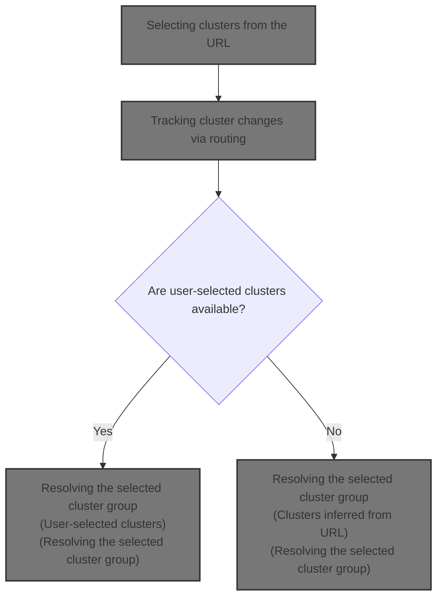

# Selecting clusters from the URL

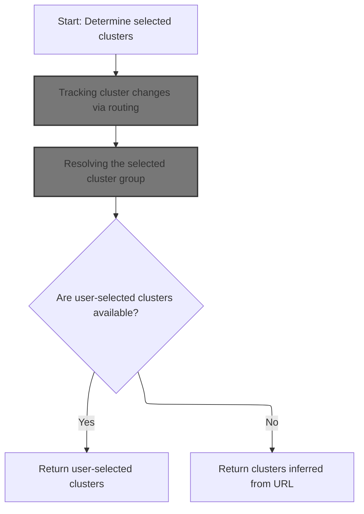

<SwmSnippet path="/frontend/src/lib/k8s/index.ts" line="164">

---

In <SwmToken path="frontend/src/lib/k8s/index.ts" pos="164:4:4" line-data="export function useSelectedClusters(): string[] {">`useSelectedClusters`</SwmToken>, we kick off the flow by grabbing the cluster identifier from the URL using <SwmToken path="frontend/src/lib/k8s/index.ts" pos="165:7:7" line-data="  const clusterInURL = useCluster();">`useCluster`</SwmToken>. This is necessary because all subsequent logic depends on knowing which cluster is currently selected by the user.

```typescript
export function useSelectedClusters(): string[] {
  const clusterInURL = useCluster();
```

---

</SwmSnippet>

## Tracking cluster changes via routing

<SwmSnippet path="/frontend/src/lib/k8s/index.ts" line="142">

---

In <SwmToken path="frontend/src/lib/k8s/index.ts" pos="142:4:4" line-data="export function useCluster() {">`useCluster`</SwmToken>, we set up a listener for route changes so we can update the cluster state whenever the URL changes. We call <SwmToken path="frontend/src/lib/k8s/index.ts" pos="145:16:16" line-data="  const [cluster, setCluster] = React.useState(getCluster());">`getCluster`</SwmToken> next to parse the cluster identifier from the new route.

```typescript
export function useCluster() {
  const history = useHistory();

  const [cluster, setCluster] = React.useState(getCluster());

  React.useEffect(() => {
    // Listen to route changes
    return history.listen(() => {
      const newCluster = getCluster(history.location.pathname);
```

---

</SwmSnippet>

### Parsing cluster identifier from the URL

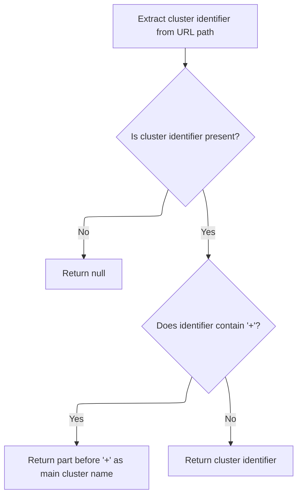

<SwmSnippet path="/frontend/src/lib/cluster.ts" line="46">

---

<SwmToken path="frontend/src/lib/cluster.ts" pos="46:4:4" line-data="export function getCluster(urlPath?: string): string | null {">`getCluster`</SwmToken> parses the cluster identifier from the URL path, handling cases where multiple clusters are encoded by splitting on '+'. It relies on <SwmToken path="frontend/src/lib/cluster.ts" pos="47:7:7" line-data="  const clusterString = getClusterPathParam(urlPath);">`getClusterPathParam`</SwmToken> to extract the relevant part from the URL.

```typescript
export function getCluster(urlPath?: string): string | null {
  const clusterString = getClusterPathParam(urlPath);
  if (!clusterString) return null;

  if (clusterString.includes('+')) {
    return clusterString.split('+')[0];
  }
  return clusterString;
}
```

---

</SwmSnippet>

### Extracting cluster path from the URL base

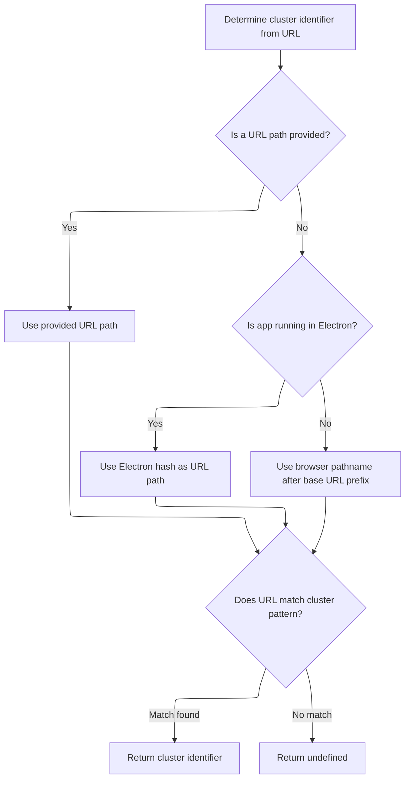

<SwmSnippet path="/frontend/src/lib/cluster.ts" line="57">

---

We get the base URL so we can strip it off and isolate the cluster part of the route.

```typescript
export function getClusterPathParam(maybeUrlPath?: string): string | undefined {
  const prefix = getBaseUrl();
```

---

</SwmSnippet>

<SwmSnippet path="/frontend/src/helpers/getBaseUrl.ts" line="38">

---

<SwmToken path="frontend/src/helpers/getBaseUrl.ts" pos="38:4:4" line-data="export function getBaseUrl(): string {">`getBaseUrl`</SwmToken> figures out the base path for the app, checking for a global override and normalizing certain values to an empty string. This keeps routing consistent regardless of environment or deployment quirks.

```typescript
export function getBaseUrl(): string {
  let baseUrl = '';
  if (isElectron()) {
    return '';
  }
  if (window?.headlampBaseUrl !== undefined) {
    baseUrl = window.headlampBaseUrl;
  } else {
    baseUrl = import.meta.env.PUBLIC_URL ? import.meta.env.PUBLIC_URL : '';
  }

  if (baseUrl === './' || baseUrl === '.' || baseUrl === '/') {
    baseUrl = '';
  }
  return baseUrl;
}
```

---

</SwmSnippet>

<SwmSnippet path="/frontend/src/lib/cluster.ts" line="59">

---

Back in <SwmToken path="frontend/src/lib/cluster.ts" pos="47:7:7" line-data="  const clusterString = getClusterPathParam(urlPath);">`getClusterPathParam`</SwmToken>, now that we've got the normalized base URL, we slice it off the pathname and use <SwmToken path="frontend/src/lib/cluster.ts" pos="65:7:7" line-data="  const clusterURLMatch = matchPath&lt;{ cluster?: string }&gt;(urlPath, {">`matchPath`</SwmToken> to extract the cluster parameter. This makes sure cluster detection works no matter where the app is hosted.

```typescript
  const urlPath =
    maybeUrlPath ??
    (isElectron()
      ? window.location.hash.substring(1)
      : window.location.pathname.slice(prefix.length));

  const clusterURLMatch = matchPath<{ cluster?: string }>(urlPath, {
    path: getClusterPrefixedPath(),
  });

  return clusterURLMatch?.params?.cluster;
}
```

---

</SwmSnippet>

### Updating cluster state on navigation

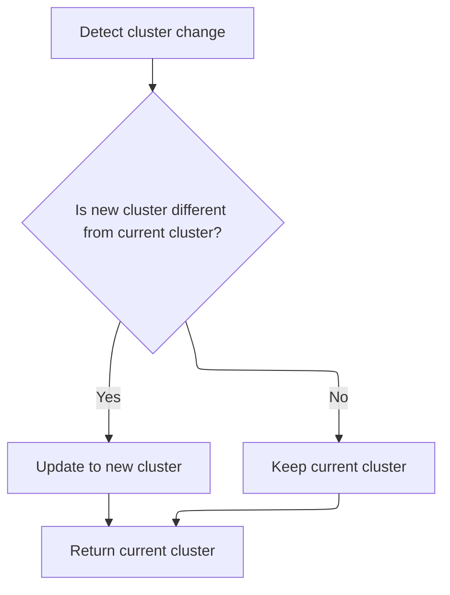

<SwmSnippet path="/frontend/src/lib/k8s/index.ts" line="151">

---

Back in <SwmToken path="frontend/src/lib/k8s/index.ts" pos="142:4:4" line-data="export function useCluster() {">`useCluster`</SwmToken>, we update the state only if the cluster actually changed. This keeps the UI in sync and avoids redundant updates. Next, we call <SwmToken path="frontend/src/lib/k8s/index.ts" pos="152:1:1" line-data="      setCluster(currentCluster =&gt; (newCluster !== currentCluster ? newCluster : currentCluster));">`setCluster`</SwmToken> to handle cluster-specific setup.

```typescript
      // Update the state only when the cluster changes
      setCluster(currentCluster => (newCluster !== currentCluster ? newCluster : currentCluster));
    });
  }, [history]);

  return cluster;
}
```

---

</SwmSnippet>

## Configuring cluster connection

<SwmSnippet path="/frontend/src/lib/k8s/api/v1/clusterApi.ts" line="60">

---

<SwmToken path="frontend/src/lib/k8s/api/v1/clusterApi.ts" pos="60:6:6" line-data="export async function setCluster(clusterReq: ClusterRequest) {">`setCluster`</SwmToken> handles cluster setup by either storing the kubeconfig and posting it for parsing, or just posting the cluster info to a different endpoint. Next, we call request to actually send the data to the backend.

```typescript
export async function setCluster(clusterReq: ClusterRequest) {
  const kubeconfig = clusterReq.kubeconfig;
  const headers = addBackstageAuthHeaders(JSON_HEADERS);

  if (kubeconfig) {
    await storeStatelessClusterKubeconfig(kubeconfig);
    // We just send parsed kubeconfig from the backend to the frontend.
    return request(
      '/parseKubeConfig',
      {
        method: 'POST',
        body: JSON.stringify(clusterReq),
        headers: {
          ...headers,
        },
      },
      false,
      false
    );
  }

  return request(
    '/cluster',
    {
      method: 'POST',
      body: JSON.stringify(clusterReq),
      headers: {
        ...headers,
        ...getHeadlampAPIHeaders(),
      },
    },
    false,
    false
  );
}
```

---

</SwmSnippet>

## Sending cluster requests with debug logging

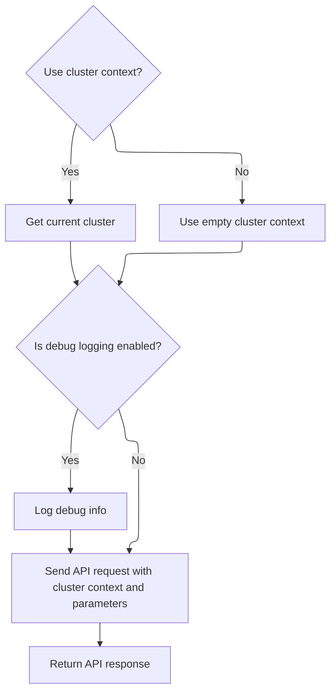

<SwmSnippet path="/frontend/src/lib/k8s/api/v1/clusterRequests.ts" line="94">

---

In <SwmToken path="frontend/src/lib/k8s/api/v1/clusterRequests.ts" pos="94:6:6" line-data="export async function request(">`request`</SwmToken>, we fetch the current cluster so every API call is scoped correctly. Next, we call <SwmToken path="frontend/src/lib/k8s/api/v1/clusterRequests.ts" pos="102:12:12" line-data="  const cluster = (useCluster &amp;&amp; getCluster()) || &#39;&#39;;">`getCluster`</SwmToken> to get the actual cluster name.

```typescript
export async function request(
  path: string,
  params: RequestParams = {},
  autoLogoutOnAuthError: boolean = true,
  useCluster: boolean = true,
  queryParams?: QueryParameters
): Promise<any> {
  // @todo: This is a temporary way of getting the current cluster. We should improve it later.
  const cluster = (useCluster && getCluster()) || '';

```

---

</SwmSnippet>

<SwmSnippet path="/frontend/src/lib/k8s/api/v1/clusterRequests.ts" line="104">

---

Back in <SwmToken path="frontend/src/lib/k8s/api/v1/clusterRequests.ts" pos="104:11:11" line-data="  if (isDebugVerbose(&#39;k8s/apiProxy@request&#39;)) {">`request`</SwmToken>, we check if debug logging is enabled for this module and log request details if so. Next, we call <SwmToken path="frontend/src/lib/k8s/api/v1/clusterRequests.ts" pos="104:4:4" line-data="  if (isDebugVerbose(&#39;k8s/apiProxy@request&#39;)) {">`isDebugVerbose`</SwmToken> to see if we should log.

```typescript
  if (isDebugVerbose('k8s/apiProxy@request')) {
    console.debug('k8s/apiProxy@request', { path, params, useCluster, queryParams });
  }

```

---

</SwmSnippet>

<SwmSnippet path="/frontend/src/helpers/debugVerbose.ts" line="76">

---

<SwmToken path="frontend/src/helpers/debugVerbose.ts" pos="76:4:4" line-data="export function isDebugVerbose(modName: string): boolean {">`isDebugVerbose`</SwmToken> checks if debug logging should be enabled for a module, using some substring matching and environment variables. This lets us control logging granularity for different parts of the app.

```typescript
export function isDebugVerbose(modName: string): boolean {
  if (verboseModDebug.filter(mod => modName.indexOf(mod) > 0).length > 0) {
    return true;
  }

  return (
    import.meta.env.REACT_APP_DEBUG_VERBOSE === 'all' ||
    !!(
      import.meta.env.REACT_APP_DEBUG_VERBOSE &&
      import.meta.env.REACT_APP_DEBUG_VERBOSE?.indexOf(modName) !== -1
    )
  );
}
```

---

</SwmSnippet>

<SwmSnippet path="/frontend/src/lib/k8s/api/v1/clusterRequests.ts" line="108">

---

Back in <SwmToken path="frontend/src/lib/k8s/api/v1/clusterApi.ts" pos="67:3:3" line-data="    return request(">`request`</SwmToken>, after optional debug logging, we delegate to <SwmToken path="frontend/src/lib/k8s/api/v1/clusterRequests.ts" pos="108:3:3" line-data="  return clusterRequest(path, { cluster, autoLogoutOnAuthError, ...params }, queryParams);">`clusterRequest`</SwmToken> to handle the actual network call with cluster context.

```typescript
  return clusterRequest(path, { cluster, autoLogoutOnAuthError, ...params }, queryParams);
}
```

---

</SwmSnippet>

## Building and sending cluster-aware requests

```mermaid
%%{init: {"flowchart": {"defaultRenderer": "elk"}} }%%
flowchart TD
  node1["User initiates cluster request"] --> node2{"Is cluster specified?"}
  click node1 openCode "frontend/src/lib/k8s/api/v1/clusterRequests.ts:122:134"
  node2 -->|"Yes"| node3["Locating kubeconfig for a cluster"]
  click node2 openCode "frontend/src/lib/k8s/api/v1/clusterRequests.ts:134:147"
  node2 -->|"No"| node4["Proceed without cluster config"]
  
  node3 --> node5{"Is configuration found?"}
  click node5 openCode "frontend/src/lib/k8s/api/v1/clusterRequests.ts:148:150"
  node5 -->|"Yes"| node6["Add authentication info"]
  click node6 openCode "frontend/src/lib/k8s/api/v1/clusterRequests.ts:151:152"
  node5 -->|"No config found"| node4
  node4 --> node7["Send request to cluster"]
  click node4 openCode "frontend/src/lib/k8s/api/v1/clusterRequests.ts:154:160"
  node6 --> node7
  node7 --> node8{"Did request time out?"}
  click node7 openCode "frontend/src/lib/k8s/api/v1/clusterRequests.ts:157:158"
  node8 -->|"Yes"| node9["Return timeout error"]
  click node8 openCode "frontend/src/lib/k8s/api/v1/clusterRequests.ts:176:177"
  node8 -->|"No"| node10{"Did backend signal reload?"}
  click node10 openCode "frontend/src/lib/k8s/api/v1/clusterRequests.ts:185:188"
  node10 -->|"Yes"| node11["Reload application"]
  click node11 openCode "frontend/src/lib/k8s/api/v1/clusterRequests.ts:187:188"
  node10 -->|"No reload signal"| node12{"Was request successful?"}
  click node12 openCode "frontend/src/lib/k8s/api/v1/clusterRequests.ts:190:216"
  node12 -->|"Yes"| node13["Return response to user"]
  click node13 openCode "frontend/src/lib/k8s/api/v1/clusterRequests.ts:218:222"
  node12 -->|"No"| node14{"autoLogoutOnAuthError is true and status is 401?"}
  click node14 openCode "frontend/src/lib/k8s/api/v1/clusterRequests.ts:192:195"
  node14 -->|"Yes"| node15["Clearing authentication and cluster queries"]
  
  node14 -->|"No"| node16["Return error to user"]
  click node16 openCode "frontend/src/lib/k8s/api/v1/clusterRequests.ts:197:216"

classDef HeadingStyle fill:#777777,stroke:#333,stroke-width:2px;
click node3 goToHeading "Locating kubeconfig for a cluster"
node3:::HeadingStyle
click node15 goToHeading "Clearing authentication and cluster queries"
node15:::HeadingStyle

%% Swimm:
%% %%{init: {"flowchart": {"defaultRenderer": "elk"}} }%%
%% flowchart TD
%%   node1["User initiates cluster request"] --> node2{"Is cluster specified?"}
%%   click node1 openCode "<SwmPath>[frontend/…/v1/clusterRequests.ts](frontend/src/lib/k8s/api/v1/clusterRequests.ts)</SwmPath>:122:134"
%%   node2 -->|"Yes"| node3["Locating kubeconfig for a cluster"]
%%   click node2 openCode "<SwmPath>[frontend/…/v1/clusterRequests.ts](frontend/src/lib/k8s/api/v1/clusterRequests.ts)</SwmPath>:134:147"
%%   node2 -->|"No"| node4["Proceed without cluster config"]
%%   
%%   node3 --> node5{"Is configuration found?"}
%%   click node5 openCode "<SwmPath>[frontend/…/v1/clusterRequests.ts](frontend/src/lib/k8s/api/v1/clusterRequests.ts)</SwmPath>:148:150"
%%   node5 -->|"Yes"| node6["Add authentication info"]
%%   click node6 openCode "<SwmPath>[frontend/…/v1/clusterRequests.ts](frontend/src/lib/k8s/api/v1/clusterRequests.ts)</SwmPath>:151:152"
%%   node5 -->|"No config found"| node4
%%   node4 --> node7["Send request to cluster"]
%%   click node4 openCode "<SwmPath>[frontend/…/v1/clusterRequests.ts](frontend/src/lib/k8s/api/v1/clusterRequests.ts)</SwmPath>:154:160"
%%   node6 --> node7
%%   node7 --> node8{"Did request time out?"}
%%   click node7 openCode "<SwmPath>[frontend/…/v1/clusterRequests.ts](frontend/src/lib/k8s/api/v1/clusterRequests.ts)</SwmPath>:157:158"
%%   node8 -->|"Yes"| node9["Return timeout error"]
%%   click node8 openCode "<SwmPath>[frontend/…/v1/clusterRequests.ts](frontend/src/lib/k8s/api/v1/clusterRequests.ts)</SwmPath>:176:177"
%%   node8 -->|"No"| node10{"Did backend signal reload?"}
%%   click node10 openCode "<SwmPath>[frontend/…/v1/clusterRequests.ts](frontend/src/lib/k8s/api/v1/clusterRequests.ts)</SwmPath>:185:188"
%%   node10 -->|"Yes"| node11["Reload application"]
%%   click node11 openCode "<SwmPath>[frontend/…/v1/clusterRequests.ts](frontend/src/lib/k8s/api/v1/clusterRequests.ts)</SwmPath>:187:188"
%%   node10 -->|"No reload signal"| node12{"Was request successful?"}
%%   click node12 openCode "<SwmPath>[frontend/…/v1/clusterRequests.ts](frontend/src/lib/k8s/api/v1/clusterRequests.ts)</SwmPath>:190:216"
%%   node12 -->|"Yes"| node13["Return response to user"]
%%   click node13 openCode "<SwmPath>[frontend/…/v1/clusterRequests.ts](frontend/src/lib/k8s/api/v1/clusterRequests.ts)</SwmPath>:218:222"
%%   node12 -->|"No"| node14{"<SwmToken path="frontend/src/lib/k8s/api/v1/clusterRequests.ts" pos="97:1:1" line-data="  autoLogoutOnAuthError: boolean = true,">`autoLogoutOnAuthError`</SwmToken> is true and status is 401?"}
%%   click node14 openCode "<SwmPath>[frontend/…/v1/clusterRequests.ts](frontend/src/lib/k8s/api/v1/clusterRequests.ts)</SwmPath>:192:195"
%%   node14 -->|"Yes"| node15["Clearing authentication and cluster queries"]
%%   
%%   node14 -->|"No"| node16["Return error to user"]
%%   click node16 openCode "<SwmPath>[frontend/…/v1/clusterRequests.ts](frontend/src/lib/k8s/api/v1/clusterRequests.ts)</SwmPath>:197:216"
%% 
%% classDef HeadingStyle fill:#777777,stroke:#333,stroke-width:2px;
%% click node3 goToHeading "Locating kubeconfig for a cluster"
%% node3:::HeadingStyle
%% click node15 goToHeading "Clearing authentication and cluster queries"
%% node15:::HeadingStyle
```

<SwmSnippet path="/frontend/src/lib/k8s/api/v1/clusterRequests.ts" line="122">

---

In <SwmToken path="frontend/src/lib/k8s/api/v1/clusterRequests.ts" pos="122:6:6" line-data="export async function clusterRequest(">`clusterRequest`</SwmToken>, we build the request with cluster-specific headers and prefix the path if a cluster is set. We call <SwmToken path="frontend/src/lib/k8s/api/v1/clusterRequests.ts" pos="148:9:9" line-data="    const kubeconfig = await findKubeconfigByClusterName(cluster);">`findKubeconfigByClusterName`</SwmToken> to get the right kubeconfig for the headers.

```typescript
export async function clusterRequest(
  path: string,
  params: ClusterRequestParams = {},
  queryParams?: QueryParameters
): Promise<any> {
  interface RequestHeaders {
    Authorization?: string;
    cluster?: string;
    autoLogoutOnAuthError?: boolean;
    [otherHeader: string]: any;
  }

  const {
    timeout = DEFAULT_TIMEOUT,
    cluster: paramsCluster,
    autoLogoutOnAuthError = true,
    isJSON = true,
    ...otherParams
  } = params;

  const userID = getUserIdFromLocalStorage();
  const opts: { headers: RequestHeaders } = Object.assign({ headers: {} }, otherParams);
  const cluster = paramsCluster || '';

  let fullPath = path;
  if (cluster) {
    const kubeconfig = await findKubeconfigByClusterName(cluster);
    if (kubeconfig !== null) {
      opts.headers['KUBECONFIG'] = kubeconfig;
      opts.headers['X-HEADLAMP-USER-ID'] = userID;
    }

    fullPath = combinePath(`/${CLUSTERS_PREFIX}/${cluster}`, path);
  }

```

---

</SwmSnippet>

### Locating kubeconfig for a cluster

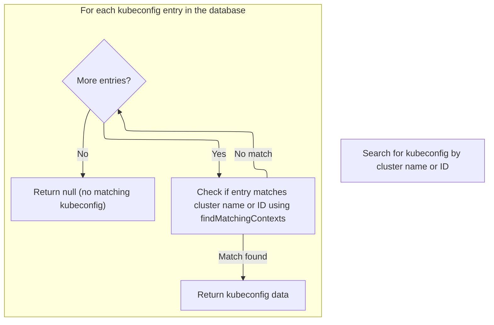

<SwmSnippet path="/frontend/src/stateless/findKubeconfigByClusterName.ts" line="36">

---

In <SwmToken path="frontend/src/stateless/findKubeconfigByClusterName.ts" pos="36:4:4" line-data="export function findKubeconfigByClusterName(">`findKubeconfigByClusterName`</SwmToken>, we search <SwmToken path="frontend/src/stateless/findKubeconfigByClusterName.ts" pos="32:10:10" line-data=" * @throws Error if IndexedDB is not supported.">`IndexedDB`</SwmToken> for a kubeconfig matching the cluster name. We use <SwmToken path="frontend/src/stateless/findKubeconfigByClusterName.ts" pos="70:14:14" line-data="            const { matchingKubeconfig, matchingContext } = findMatchingContexts(">`findMatchingContexts`</SwmToken> to check each entry for a match.

```typescript
export function findKubeconfigByClusterName(
  /** The name of the cluster to find */
  clusterName: string,
  /** The ID for a cluster, composed of the kubeconfig path and cluster name */
  clusterID?: string
): Promise<string | null> {
  return new Promise<string | null>(async (resolve, reject) => {
    try {
      const request = indexedDB.open('kubeconfigs', 1) as any;

      // The onupgradeneeded event is fired when the database is created for the first time.
      request.onupgradeneeded = handleDatabaseUpgrade;

      // The onsuccess event is fired when the database is opened.
      // This event is where you specify the actions to take when the database is opened.
      request.onsuccess = function handleDatabaseSuccess(event: DatabaseEvent) {
        const db = event.target.result;
        const transaction = db.transaction(['kubeconfigStore'], 'readonly');
        const store = transaction.objectStore('kubeconfigStore');

        // The onsuccess event is fired when the request has succeeded.
        // This is where you handle the results of the request.
        // The result is the cursor. It is used to iterate through the object store.
        // The cursor is null when there are no more objects to iterate through.
        // The cursor is used to find the kubeconfig by cluster name.
        store.openCursor().onsuccess = function storeSuccess(event: Event) {
          const successEvent = event as CursorSuccessEvent;
          const cursor = successEvent.target.result;
          if (cursor) {
            const kubeconfigObject = cursor.value;
            const kubeconfig = kubeconfigObject.kubeconfig;

            const parsedKubeconfig = jsyaml.load(atob(kubeconfig)) as KubeconfigObject;
            // Check for "headlamp_info" in extensions
            const { matchingKubeconfig, matchingContext } = findMatchingContexts(
              clusterName,
              parsedKubeconfig,
              clusterID
            );

```

---

</SwmSnippet>

<SwmSnippet path="/frontend/src/stateless/index.ts" line="236">

---

<SwmToken path="frontend/src/stateless/index.ts" pos="236:4:4" line-data="export function findMatchingContexts(">`findMatchingContexts`</SwmToken> digs into the kubeconfig structure, looking for contexts with either a matching name or a custom name in the <SwmToken path="frontend/src/stateless/index.ts" pos="258:27:27" line-data="    // Find the context with the matching cluster name or custom name in headlamp_info">`headlamp_info`</SwmToken> extension. This lets us support custom cluster naming and dynamic context matching.

```typescript
export function findMatchingContexts(
  clusterName: string,
  parsedKubeconfig: KubeconfigObject,
  clusterID?: string
) {
  let matchingContext;
  let matchingKubeconfig;

  // Note: currently clusterID is being used for non dynamic clusters only
  if (clusterID) {
    // Find source for the kubeconfig
    const source = parsedKubeconfig.contexts.find(
      context => context.context.clusterID === clusterID
    )?.context.source;

    // Find the context with the matching clusterID
    if (source === 'kubeconfig') {
      matchingKubeconfig = parsedKubeconfig.contexts.find(
        context => context.context.clusterID === clusterID
      );
    }
  } else {
    // Find the context with the matching cluster name or custom name in headlamp_info
    matchingContext = parsedKubeconfig.contexts.find(
      context =>
        context.name === clusterName ||
        context.context.extensions?.find(extension => extension.name === 'headlamp_info')?.extension
          .customName === clusterName
    );

    matchingKubeconfig = parsedKubeconfig.contexts.find(context => context.name === clusterName);
  }

  return { matchingKubeconfig, matchingContext };
}
```

---

</SwmSnippet>

<SwmSnippet path="/frontend/src/stateless/findKubeconfigByClusterName.ts" line="76">

---

Back in <SwmToken path="frontend/src/lib/k8s/api/v1/clusterRequests.ts" pos="148:9:9" line-data="    const kubeconfig = await findKubeconfigByClusterName(cluster);">`findKubeconfigByClusterName`</SwmToken>, after checking contexts, we resolve with the kubeconfig if a match is found, or null if not. This controls whether cluster-specific headers get set downstream.

```typescript
            if (matchingKubeconfig || matchingContext) {
              resolve(kubeconfig);
            } else {
              cursor.continue();
            }
          } else {
            resolve(null); // No matching kubeconfig found
          }
        };
      };

      // The onerror event is fired when the database is opened.
      // This is where you handle errors.
      request.onerror = handleDataBaseError;
    } catch (error) {
      reject(error);
    }
  });
}
```

---

</SwmSnippet>

### Handling timeouts and building request URL

<SwmSnippet path="/frontend/src/lib/k8s/api/v1/clusterRequests.ts" line="157">

---

Back in <SwmToken path="frontend/src/lib/k8s/api/v1/clusterRequests.ts" pos="108:3:3" line-data="  return clusterRequest(path, { cluster, autoLogoutOnAuthError, ...params }, queryParams);">`clusterRequest`</SwmToken>, we set up a timeout using <SwmToken path="frontend/src/lib/k8s/api/v1/clusterRequests.ts" pos="157:9:9" line-data="  const controller = new AbortController();">`AbortController`</SwmToken> and start building the full request URL by combining the app URL with the cluster-prefixed path.

```typescript
  const controller = new AbortController();
  const id = setTimeout(() => controller.abort(), timeout);

  let url = combinePath(getAppUrl(), fullPath);
```

---

</SwmSnippet>

### Determining the backend URL for requests

```mermaid
%%{init: {"flowchart": {"defaultRenderer": "elk"}} }%%
flowchart TD
  node1["Start: Determine environment"] --> node2{"Is Electron?"}
  click node1 openCode "frontend/src/helpers/getAppUrl.ts:43:48"
  click node2 openCode "frontend/src/helpers/getAppUrl.ts:48:53"
  node2 -->|"Yes"| node3["Use localhost, set backendPort from Electron"]
  click node3 openCode "frontend/src/helpers/getAppUrl.ts:49:53"
  node2 -->|"No"| node4{"Is Dev Mode?"}
  click node4 openCode "frontend/src/helpers/getAppUrl.ts:55:57"
  node4 -->|"Yes"| node5["Use localhost, backendPort 4466"]
  click node5 openCode "frontend/src/helpers/getAppUrl.ts:56:57"
  node4 -->|"No"| node6{"Is Docker Desktop?"}
  click node6 openCode "frontend/src/helpers/getAppUrl.ts:59:62"
  node6 -->|"Yes"| node7["Use localhost, backendPort 64446"]
  click node7 openCode "frontend/src/helpers/getAppUrl.ts:60:62"
  node6 -->|"No"| node8["Use browser origin"]
  click node8 openCode "frontend/src/helpers/getAppUrl.ts:67:68"
  node3 --> node9["Append baseUrl and return final URL"]
  click node9 openCode "frontend/src/helpers/getAppUrl.ts:70:74"
  node5 --> node9
  node7 --> node9
  node8 --> node9

classDef HeadingStyle fill:#777777,stroke:#333,stroke-width:2px;

%% Swimm:
%% %%{init: {"flowchart": {"defaultRenderer": "elk"}} }%%
%% flowchart TD
%%   node1["Start: Determine environment"] --> node2{"Is Electron?"}
%%   click node1 openCode "<SwmPath>[frontend/…/helpers/getAppUrl.ts](frontend/src/helpers/getAppUrl.ts)</SwmPath>:43:48"
%%   click node2 openCode "<SwmPath>[frontend/…/helpers/getAppUrl.ts](frontend/src/helpers/getAppUrl.ts)</SwmPath>:48:53"
%%   node2 -->|"Yes"| node3["Use localhost, set <SwmToken path="frontend/src/helpers/getAppUrl.ts" pos="45:3:3" line-data="  let backendPort = 4466;">`backendPort`</SwmToken> from Electron"]
%%   click node3 openCode "<SwmPath>[frontend/…/helpers/getAppUrl.ts](frontend/src/helpers/getAppUrl.ts)</SwmPath>:49:53"
%%   node2 -->|"No"| node4{"Is Dev Mode?"}
%%   click node4 openCode "<SwmPath>[frontend/…/helpers/getAppUrl.ts](frontend/src/helpers/getAppUrl.ts)</SwmPath>:55:57"
%%   node4 -->|"Yes"| node5["Use localhost, <SwmToken path="frontend/src/helpers/getAppUrl.ts" pos="45:3:3" line-data="  let backendPort = 4466;">`backendPort`</SwmToken> 4466"]
%%   click node5 openCode "<SwmPath>[frontend/…/helpers/getAppUrl.ts](frontend/src/helpers/getAppUrl.ts)</SwmPath>:56:57"
%%   node4 -->|"No"| node6{"Is Docker Desktop?"}
%%   click node6 openCode "<SwmPath>[frontend/…/helpers/getAppUrl.ts](frontend/src/helpers/getAppUrl.ts)</SwmPath>:59:62"
%%   node6 -->|"Yes"| node7["Use localhost, <SwmToken path="frontend/src/helpers/getAppUrl.ts" pos="45:3:3" line-data="  let backendPort = 4466;">`backendPort`</SwmToken> 64446"]
%%   click node7 openCode "<SwmPath>[frontend/…/helpers/getAppUrl.ts](frontend/src/helpers/getAppUrl.ts)</SwmPath>:60:62"
%%   node6 -->|"No"| node8["Use browser origin"]
%%   click node8 openCode "<SwmPath>[frontend/…/helpers/getAppUrl.ts](frontend/src/helpers/getAppUrl.ts)</SwmPath>:67:68"
%%   node3 --> node9["Append <SwmToken path="frontend/src/helpers/getBaseUrl.ts" pos="39:3:3" line-data="  let baseUrl = &#39;&#39;;">`baseUrl`</SwmToken> and return final URL"]
%%   click node9 openCode "<SwmPath>[frontend/…/helpers/getAppUrl.ts](frontend/src/helpers/getAppUrl.ts)</SwmPath>:70:74"
%%   node5 --> node9
%%   node7 --> node9
%%   node8 --> node9
%% 
%% classDef HeadingStyle fill:#777777,stroke:#333,stroke-width:2px;
```

<SwmSnippet path="/frontend/src/helpers/getAppUrl.ts" line="43">

---

In <SwmToken path="frontend/src/helpers/getAppUrl.ts" pos="43:4:4" line-data="export function getAppUrl(): string {">`getAppUrl`</SwmToken>, we figure out the backend URL based on the environment, switching ports and hostnames as needed. We call <SwmToken path="frontend/src/helpers/getAppUrl.ts" pos="70:7:7" line-data="  const baseUrl = getBaseUrl();">`getBaseUrl`</SwmToken> next to append any base path.

```typescript
export function getAppUrl(): string {
  let url = '';
  let backendPort = 4466;
  let useLocalhost = false;

  if (isElectron()) {
    if (window?.headlampBackendPort) {
      backendPort = window.headlampBackendPort;
    }
    useLocalhost = true;
  }

  if (isDevMode()) {
    useLocalhost = true;
  }

  if (isDockerDesktop()) {
    backendPort = 64446;
    useLocalhost = true;
  }

  if (useLocalhost) {
    url = `http://localhost:${backendPort}`;
  } else {
    url = window.location.origin;
  }

  const baseUrl = getBaseUrl();
```

---

</SwmSnippet>

<SwmSnippet path="/frontend/src/helpers/getAppUrl.ts" line="71">

---

Back in <SwmToken path="frontend/src/lib/k8s/api/v1/clusterRequests.ts" pos="160:9:9" line-data="  let url = combinePath(getAppUrl(), fullPath);">`getAppUrl`</SwmToken>, after getting the base URL, we append it to the backend URL and add a trailing slash if needed. This finalizes the URL for requests.

```typescript
  url += baseUrl ? baseUrl + '/' : '/';

  return url;
}
```

---

</SwmSnippet>

### Sending the request and handling backend responses

```mermaid
%%{init: {"flowchart": {"defaultRenderer": "elk"}} }%%
flowchart TD
  node1["Start: Prepare request for cluster API"]
  click node1 openCode "frontend/src/lib/k8s/api/v1/clusterRequests.ts:161:166"
  node1 --> node2{"Is Backstage environment?"}
  click node2 openCode "frontend/src/lib/k8s/api/v1/clusterRequests.ts:167:169"
  node2 -->|"Yes"| node3["Add Backstage authentication"]
  click node3 openCode "frontend/src/lib/k8s/api/v1/clusterRequests.ts:167:169"
  node2 -->|"No"| node4["Send request to cluster API"]
  node3 --> node4
  click node4 openCode "frontend/src/lib/k8s/api/v1/clusterRequests.ts:170:181"
  node4 --> node5["Clear request timeout"]
  click node5 openCode "frontend/src/lib/k8s/api/v1/clusterRequests.ts:180:181"
  node5 --> node6{"Did backend request reload?"}
  click node6 openCode "frontend/src/lib/k8s/api/v1/clusterRequests.ts:185:188"
  node6 -->|"Yes"| node7["Reload the page"]
  click node7 openCode "frontend/src/lib/k8s/api/v1/clusterRequests.ts:187:188"
  node6 -->|"No"| node8{"Was response successful?"}
  click node8 openCode "frontend/src/lib/k8s/api/v1/clusterRequests.ts:190:192"
  node8 -->|"No"| node9{"Is status 401 and autoLogoutOnAuthError is true and Authorization header is present?"}
  click node9 openCode "frontend/src/lib/k8s/api/v1/clusterRequests.ts:192:195"
  node9 -->|"Yes"| node10["Log out user"]
  click node10 openCode "frontend/src/lib/k8s/api/v1/clusterRequests.ts:194:195"
  node9 -->|"No"| node11["End"]
  node8 -->|"Yes"| node11["End"]
classDef HeadingStyle fill:#777777,stroke:#333,stroke-width:2px;

%% Swimm:
%% %%{init: {"flowchart": {"defaultRenderer": "elk"}} }%%
%% flowchart TD
%%   node1["Start: Prepare request for cluster API"]
%%   click node1 openCode "<SwmPath>[frontend/…/v1/clusterRequests.ts](frontend/src/lib/k8s/api/v1/clusterRequests.ts)</SwmPath>:161:166"
%%   node1 --> node2{"Is Backstage environment?"}
%%   click node2 openCode "<SwmPath>[frontend/…/v1/clusterRequests.ts](frontend/src/lib/k8s/api/v1/clusterRequests.ts)</SwmPath>:167:169"
%%   node2 -->|"Yes"| node3["Add Backstage authentication"]
%%   click node3 openCode "<SwmPath>[frontend/…/v1/clusterRequests.ts](frontend/src/lib/k8s/api/v1/clusterRequests.ts)</SwmPath>:167:169"
%%   node2 -->|"No"| node4["Send request to cluster API"]
%%   node3 --> node4
%%   click node4 openCode "<SwmPath>[frontend/…/v1/clusterRequests.ts](frontend/src/lib/k8s/api/v1/clusterRequests.ts)</SwmPath>:170:181"
%%   node4 --> node5["Clear request timeout"]
%%   click node5 openCode "<SwmPath>[frontend/…/v1/clusterRequests.ts](frontend/src/lib/k8s/api/v1/clusterRequests.ts)</SwmPath>:180:181"
%%   node5 --> node6{"Did backend request reload?"}
%%   click node6 openCode "<SwmPath>[frontend/…/v1/clusterRequests.ts](frontend/src/lib/k8s/api/v1/clusterRequests.ts)</SwmPath>:185:188"
%%   node6 -->|"Yes"| node7["Reload the page"]
%%   click node7 openCode "<SwmPath>[frontend/…/v1/clusterRequests.ts](frontend/src/lib/k8s/api/v1/clusterRequests.ts)</SwmPath>:187:188"
%%   node6 -->|"No"| node8{"Was response successful?"}
%%   click node8 openCode "<SwmPath>[frontend/…/v1/clusterRequests.ts](frontend/src/lib/k8s/api/v1/clusterRequests.ts)</SwmPath>:190:192"
%%   node8 -->|"No"| node9{"Is status 401 and <SwmToken path="frontend/src/lib/k8s/api/v1/clusterRequests.ts" pos="97:1:1" line-data="  autoLogoutOnAuthError: boolean = true,">`autoLogoutOnAuthError`</SwmToken> is true and Authorization header is present?"}
%%   click node9 openCode "<SwmPath>[frontend/…/v1/clusterRequests.ts](frontend/src/lib/k8s/api/v1/clusterRequests.ts)</SwmPath>:192:195"
%%   node9 -->|"Yes"| node10["Log out user"]
%%   click node10 openCode "<SwmPath>[frontend/…/v1/clusterRequests.ts](frontend/src/lib/k8s/api/v1/clusterRequests.ts)</SwmPath>:194:195"
%%   node9 -->|"No"| node11["End"]
%%   node8 -->|"Yes"| node11["End"]
%% classDef HeadingStyle fill:#777777,stroke:#333,stroke-width:2px;
```

<SwmSnippet path="/frontend/src/lib/k8s/api/v1/clusterRequests.ts" line="161">

---

Back in <SwmToken path="frontend/src/lib/k8s/api/v1/clusterRequests.ts" pos="108:3:3" line-data="  return clusterRequest(path, { cluster, autoLogoutOnAuthError, ...params }, queryParams);">`clusterRequest`</SwmToken>, after sending the request, we check for a reload signal from the backend and trigger a page reload if needed. If we get a 401 and have an auth header, we call logout to clear the user's session.

```typescript
  url += asQuery(queryParams);
  const requestData = {
    signal: controller.signal,
    credentials: 'include' as RequestCredentials,
    ...opts,
  };
  if (isBackstage()) {
    requestData.headers = addBackstageAuthHeaders(requestData.headers);
  }
  let response: Response = new Response(undefined, { status: 502, statusText: 'Unreachable' });
  try {
    response = await fetch(url, requestData);
  } catch (err) {
    if (err instanceof Error) {
      if (err.name === 'AbortError') {
        response = new Response(undefined, { status: 408, statusText: 'Request timed-out' });
      }
    }
  } finally {
    clearTimeout(id);
  }

  // The backend signals through this header that it wants a reload.
  // See plugins.go
  const headerVal = response.headers.get('X-Reload');
  if (headerVal && headerVal.indexOf('reload') !== -1) {
    window.location.reload();
  }

  if (!response.ok) {
    const { status, statusText } = response;
    if (autoLogoutOnAuthError && status === 401 && opts.headers.Authorization) {
      console.error('Logging out due to auth error', { status, statusText, path });
      logout(cluster);
    }

```

---

</SwmSnippet>

### Clearing authentication and cluster queries

<SwmSnippet path="/frontend/src/lib/auth.ts" line="131">

---

<SwmToken path="frontend/src/lib/auth.ts" pos="131:6:6" line-data="export async function logout(cluster: string) {">`logout`</SwmToken> clears the user's token and removes any cached queries related to authentication and cluster info. Next, we call <SwmToken path="frontend/src/lib/auth.ts" pos="132:3:3" line-data="  return setToken(cluster, null).then(() =&gt; {">`setToken`</SwmToken> to actually clear the token.

```typescript
export async function logout(cluster: string) {
  return setToken(cluster, null).then(() => {
    queryClient.removeQueries({ queryKey: ['auth'], exact: false });
    queryClient.removeQueries({ queryKey: ['clusterMe', cluster], exact: true });
  });
}
```

---

</SwmSnippet>

### Setting or clearing the cluster token

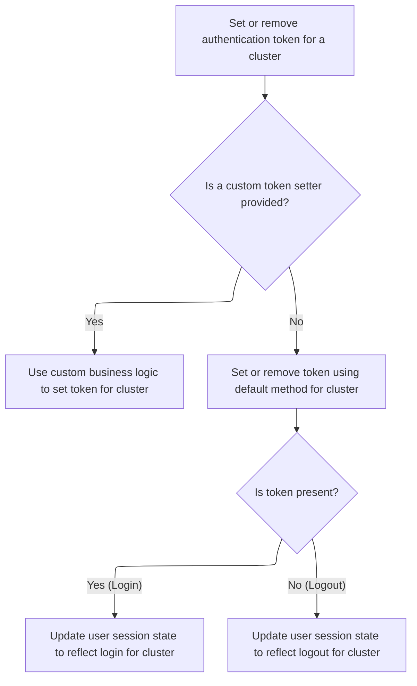

<SwmSnippet path="/frontend/src/lib/auth.ts" line="108">

---

<SwmToken path="frontend/src/lib/auth.ts" pos="108:4:4" line-data="export function setToken(cluster: string, token: string | null) {">`setToken`</SwmToken> either uses a custom override or defaults to setting the token via <SwmToken path="frontend/src/lib/auth.ts" pos="114:3:3" line-data="  return setCookieToken(cluster, token).then(result =&gt; {">`setCookieToken`</SwmToken>. It also manages query cache to keep cluster auth state in sync.

```typescript
export function setToken(cluster: string, token: string | null) {
  const setTokenMethodToUse = store.getState().ui.functionsToOverride.setToken;
  if (setTokenMethodToUse) {
    return Promise.resolve(setTokenMethodToUse(cluster, token));
  }

  return setCookieToken(cluster, token).then(result => {
    if (token) {
      queryClient.invalidateQueries({ queryKey: ['clusterMe', cluster], exact: true });
    } else {
      queryClient.removeQueries({ queryKey: ['clusterMe', cluster], exact: true });
    }

    return result;
  });
}
```

---

</SwmSnippet>

### Persisting the token in the backend

<SwmSnippet path="/frontend/src/lib/auth.ts" line="79">

---

<SwmToken path="frontend/src/lib/auth.ts" pos="79:4:4" line-data="async function setCookieToken(cluster: string, token: string | null) {">`setCookieToken`</SwmToken> sends the token to the backend for storage, using a cluster-specific endpoint and custom headers. Next, we call <SwmToken path="frontend/src/lib/auth.ts" pos="81:9:9" line-data="    const response = await backendFetch(`/clusters/${cluster}/set-token`, {">`backendFetch`</SwmToken> to actually make the network request.

```typescript
async function setCookieToken(cluster: string, token: string | null) {
  try {
    const response = await backendFetch(`/clusters/${cluster}/set-token`, {
      method: 'POST',
      headers: {
        'Content-Type': 'application/json',
        ...getHeadlampAPIHeaders(),
      },
      body: JSON.stringify({ token }),
    });

    if (!response.ok) {
      throw new Error(`Failed to set cookie token`);
    }
    return true;
  } catch (error) {
    console.error('Error setting cookie token:', error);
    throw error;
  }
}
```

---

</SwmSnippet>

### Making authenticated backend requests

```mermaid
%%{init: {"flowchart": {"defaultRenderer": "elk"}} }%%
flowchart TD
  node1["Send backend request (with authentication and credentials)"] --> node2{"Does backend request page reload? (X-Reload header contains 'reload')"}
  click node1 openCode "frontend/src/lib/k8s/api/v2/fetch.ts:38:42"
  node2 -->|"Yes"| node3["Reload the page"]
  click node2 openCode "frontend/src/lib/k8s/api/v2/fetch.ts:46:49"
  click node3 openCode "frontend/src/lib/k8s/api/v2/fetch.ts:48:48"
  node2 -->|"No"| node4{"Is backend response successful?"}
  node3 --> node4
  node4 -->|"Yes"| node5["Return backend response"]
  click node4 openCode "frontend/src/lib/k8s/api/v2/fetch.ts:51:60"
  click node5 openCode "frontend/src/lib/k8s/api/v2/fetch.ts:62:62"
  node4 -->|"No"| node6["Throw error (use backend message if available, otherwise default)"]
  click node6 openCode "frontend/src/lib/k8s/api/v2/fetch.ts:51:60"
classDef HeadingStyle fill:#777777,stroke:#333,stroke-width:2px;

%% Swimm:
%% %%{init: {"flowchart": {"defaultRenderer": "elk"}} }%%
%% flowchart TD
%%   node1["Send backend request (with authentication and credentials)"] --> node2{"Does backend request page reload? (<SwmToken path="frontend/src/lib/k8s/api/v1/clusterRequests.ts" pos="185:14:16" line-data="  const headerVal = response.headers.get(&#39;X-Reload&#39;);">`X-Reload`</SwmToken> header contains 'reload')"}
%%   click node1 openCode "<SwmPath>[frontend/…/v2/fetch.ts](frontend/src/lib/k8s/api/v2/fetch.ts)</SwmPath>:38:42"
%%   node2 -->|"Yes"| node3["Reload the page"]
%%   click node2 openCode "<SwmPath>[frontend/…/v2/fetch.ts](frontend/src/lib/k8s/api/v2/fetch.ts)</SwmPath>:46:49"
%%   click node3 openCode "<SwmPath>[frontend/…/v2/fetch.ts](frontend/src/lib/k8s/api/v2/fetch.ts)</SwmPath>:48:48"
%%   node2 -->|"No"| node4{"Is backend response successful?"}
%%   node3 --> node4
%%   node4 -->|"Yes"| node5["Return backend response"]
%%   click node4 openCode "<SwmPath>[frontend/…/v2/fetch.ts](frontend/src/lib/k8s/api/v2/fetch.ts)</SwmPath>:51:60"
%%   click node5 openCode "<SwmPath>[frontend/…/v2/fetch.ts](frontend/src/lib/k8s/api/v2/fetch.ts)</SwmPath>:62:62"
%%   node4 -->|"No"| node6["Throw error (use backend message if available, otherwise default)"]
%%   click node6 openCode "<SwmPath>[frontend/…/v2/fetch.ts](frontend/src/lib/k8s/api/v2/fetch.ts)</SwmPath>:51:60"
%% classDef HeadingStyle fill:#777777,stroke:#333,stroke-width:2px;
```

<SwmSnippet path="/frontend/src/lib/k8s/api/v2/fetch.ts" line="38">

---

In <SwmToken path="frontend/src/lib/k8s/api/v2/fetch.ts" pos="38:6:6" line-data="export async function backendFetch(url: string | URL, init: RequestInit = {}) {">`backendFetch`</SwmToken>, we build the full backend URL using <SwmToken path="frontend/src/lib/k8s/api/v2/fetch.ts" pos="42:14:14" line-data="  const response = await fetch(makeUrl([getAppUrl(), url]), init);">`getAppUrl`</SwmToken> and <SwmToken path="frontend/src/lib/k8s/api/v2/fetch.ts" pos="42:11:11" line-data="  const response = await fetch(makeUrl([getAppUrl(), url]), init);">`makeUrl`</SwmToken>, and add authentication headers before sending the request.

```typescript
export async function backendFetch(url: string | URL, init: RequestInit = {}) {
  // Always include credentials
  init.credentials = 'include';
  init.headers = addBackstageAuthHeaders(init.headers);
  const response = await fetch(makeUrl([getAppUrl(), url]), init);

```

---

</SwmSnippet>

<SwmSnippet path="/frontend/src/lib/k8s/api/v2/fetch.ts" line="44">

---

Here, after building the backend URL with <SwmToken path="frontend/src/lib/k8s/api/v1/clusterRequests.ts" pos="160:9:9" line-data="  let url = combinePath(getAppUrl(), fullPath);">`getAppUrl`</SwmToken>, the function checks for an <SwmToken path="frontend/src/lib/k8s/api/v2/fetch.ts" pos="46:14:16" line-data="  const headerVal = response.headers.get(&#39;X-Reload&#39;);">`X-Reload`</SwmToken> header in the response. If it's present and contains 'reload', it triggers a full page reload. This is a repo-specific hook for backend-driven reloads, not something you'd expect from a normal fetch. If the response isn't ok, it tries to parse an error message and throws an <SwmToken path="frontend/src/lib/k8s/api/v2/fetch.ts" pos="59:5:5" line-data="    throw new ApiError(maybeErrorMessage ?? &#39;Unreachable&#39;, { status: response.status });">`ApiError`</SwmToken>. Otherwise, it just returns the response.

```typescript
  // The backend signals through this header that it wants a reload.
  // See plugins.go
  const headerVal = response.headers.get('X-Reload');
  if (headerVal && headerVal.indexOf('reload') !== -1) {
    window.location.reload();
  }

  if (!response.ok) {
    // Try to parse error message from response
    let maybeErrorMessage: string | undefined;
    try {
      const body = await response.json();
      maybeErrorMessage = typeof body === 'string' ? body : body.message;
    } catch (e) {}

    throw new ApiError(maybeErrorMessage ?? 'Unreachable', { status: response.status });
  }

  return response;
}
```

---

</SwmSnippet>

### Parsing and surfacing backend errors

```mermaid
%%{init: {"flowchart": {"defaultRenderer": "elk"}} }%%
flowchart TD
    node1{"Is response JSON?"}
    click node1 openCode "frontend/src/lib/k8s/api/v1/clusterRequests.ts:218:222"
    node1 -->|"No"| node2["Return successful response"]
    click node2 openCode "frontend/src/lib/k8s/api/v1/clusterRequests.ts:219:220"
    node1 -->|"Yes"| node3["Parse response as JSON"]
    click node3 openCode "frontend/src/lib/k8s/api/v1/clusterRequests.ts:200:202"
    node3 --> node4["Return parsed data"]
    click node4 openCode "frontend/src/lib/k8s/api/v1/clusterRequests.ts:222:223"
    node3 -.-> node5["If error: Construct error message with statusText and json.message, reject"]
    click node5 openCode "frontend/src/lib/k8s/api/v1/clusterRequests.ts:197:215"

classDef HeadingStyle fill:#777777,stroke:#333,stroke-width:2px;

%% Swimm:
%% %%{init: {"flowchart": {"defaultRenderer": "elk"}} }%%
%% flowchart TD
%%     node1{"Is response JSON?"}
%%     click node1 openCode "<SwmPath>[frontend/…/v1/clusterRequests.ts](frontend/src/lib/k8s/api/v1/clusterRequests.ts)</SwmPath>:218:222"
%%     node1 -->|"No"| node2["Return successful response"]
%%     click node2 openCode "<SwmPath>[frontend/…/v1/clusterRequests.ts](frontend/src/lib/k8s/api/v1/clusterRequests.ts)</SwmPath>:219:220"
%%     node1 -->|"Yes"| node3["Parse response as JSON"]
%%     click node3 openCode "<SwmPath>[frontend/…/v1/clusterRequests.ts](frontend/src/lib/k8s/api/v1/clusterRequests.ts)</SwmPath>:200:202"
%%     node3 --> node4["Return parsed data"]
%%     click node4 openCode "<SwmPath>[frontend/…/v1/clusterRequests.ts](frontend/src/lib/k8s/api/v1/clusterRequests.ts)</SwmPath>:222:223"
%%     node3 -.-> node5["If error: Construct error message with <SwmToken path="frontend/src/lib/k8s/api/v1/clusterRequests.ts" pos="170:25:25" line-data="  let response: Response = new Response(undefined, { status: 502, statusText: &#39;Unreachable&#39; });">`statusText`</SwmToken> and <SwmToken path="frontend/src/lib/k8s/api/v1/clusterRequests.ts" pos="201:11:13" line-data="        message += ` - ${json.message}`;">`json.message`</SwmToken>, reject"]
%%     click node5 openCode "<SwmPath>[frontend/…/v1/clusterRequests.ts](frontend/src/lib/k8s/api/v1/clusterRequests.ts)</SwmPath>:197:215"
%% 
%% classDef HeadingStyle fill:#777777,stroke:#333,stroke-width:2px;
```

<SwmSnippet path="/frontend/src/lib/k8s/api/v1/clusterRequests.ts" line="197">

---

Back in <SwmToken path="frontend/src/lib/k8s/api/v1/clusterRequests.ts" pos="108:3:3" line-data="  return clusterRequest(path, { cluster, autoLogoutOnAuthError, ...params }, queryParams);">`clusterRequest`</SwmToken>, after returning from logout, we try to parse a JSON error message from the backend response. If parsing fails, we log the error and just use the status text. The function then rejects with an <SwmToken path="frontend/src/lib/k8s/api/v1/clusterRequests.ts" pos="213:16:16" line-data="    const error = new Error(message) as ApiError;">`ApiError`</SwmToken> containing the message and status. If the response isn't JSON, we just resolve with the raw response; otherwise, we return the parsed JSON.

```typescript
    let message = statusText;
    try {
      if (isJSON) {
        const json = await response.json();
        message += ` - ${json.message}`;
      }
    } catch (err) {
      console.error(
        'Unable to parse error json at url:',
        url,
        { err },
        'with request data:',
        requestData
      );
    }

    const error = new Error(message) as ApiError;
    error.status = status;
    return Promise.reject(error);
  }

  if (!isJSON) {
    return Promise.resolve(response);
  }

  return response.json();
}
```

---

</SwmSnippet>

## Resolving the selected cluster group

<SwmSnippet path="/frontend/src/lib/k8s/index.ts" line="166">

---

Back in <SwmToken path="frontend/src/lib/k8s/index.ts" pos="164:4:4" line-data="export function useSelectedClusters(): string[] {">`useSelectedClusters`</SwmToken>, after returning from <SwmToken path="frontend/src/lib/k8s/index.ts" pos="142:4:4" line-data="export function useCluster() {">`useCluster`</SwmToken>, we check if there are clusters in context. If not, we call <SwmToken path="frontend/src/lib/k8s/index.ts" pos="170:3:3" line-data="    return getSelectedClusters([], history.location.pathname);">`getSelectedClusters`</SwmToken> from <SwmPath>[frontend/…/lib/cluster.ts](frontend/src/lib/cluster.ts)</SwmPath> to parse them from the URL. This lets us handle both explicit and implicit cluster selection, so the UI always matches the user's current state.

```typescript
  const history = useHistory();
  const maybeSelectedClusters = useContext(SelectedClustersContext);

  const clusterGroup = React.useMemo(() => {
    return getSelectedClusters([], history.location.pathname);
  }, [clusterInURL]);

  return maybeSelectedClusters && maybeSelectedClusters.length > 0
    ? maybeSelectedClusters
    : clusterGroup;
}
```

---

</SwmSnippet>

<SwmSnippet path="/frontend/src/lib/cluster.ts" line="107">

---

GetSelectedClusters grabs the cluster string from the URL using <SwmToken path="frontend/src/lib/cluster.ts" pos="111:7:7" line-data="  const clusterFromURL = getClusterPathParam(urlPath);">`getClusterPathParam`</SwmToken>, then splits it on '+'. This lets us support multi-cluster selection straight from the URL, or fall back to a default if nothing is found.

```typescript
export function getSelectedClusters(
  returnWhenNoClusters: string[] = [],
  urlPath?: string
): string[] {
  const clusterFromURL = getClusterPathParam(urlPath);
  return clusterFromURL?.split('+') || returnWhenNoClusters;
}
```

---

</SwmSnippet>

&nbsp;

*This is an auto-generated document by Swimm 🌊 and has not yet been verified by a human*

<SwmMeta version="3.0.0" repo-id="Z2l0aHViJTNBJTNBdHlwZXNjcmlwdC1oZWFkbGFtcCUzQSUzQXJpY2FyZG9sb3Blemc=" repo-name="typescript-headlamp"><sup>Powered by [Swimm](https://app.swimm.io/)</sup></SwmMeta>
