This document describes how the application sends data to a cluster API endpoint, managing cluster selection and authentication. The flow prepares and dispatches the request, then handles the response, including backend signals and authentication status. Input is the data and cluster information; output is the cluster API response or an error.


# Where is this flow used?

This flow is used multiple times in the codebase as represented in the following diagram:

(Note - these are only some of the entry points of this flow)

```mermaid
graph TD;
      3e40fefa1670992d9a95ed99a1f2269c7e2d0f568cc61a9f8e8f6b397670a36c(frontend/…/v1/factories.ts::apiFactoryWithNamespace) --> 204f83a00fb70820fd25a6410ff1299f717260eae3da372ecbbbdc59e775a6b1(frontend/…/v1/factories.ts::simpleApiFactoryWithNamespace)

3e40fefa1670992d9a95ed99a1f2269c7e2d0f568cc61a9f8e8f6b397670a36c(frontend/…/v1/factories.ts::apiFactoryWithNamespace) --> baa2a3fe568435794ce15a7f1d4e6144fd642157b6c778dc554a58c6a2f77e19(frontend/…/v1/factories.ts::multipleApiFactoryWithNamespace)

204f83a00fb70820fd25a6410ff1299f717260eae3da372ecbbbdc59e775a6b1(frontend/…/v1/factories.ts::simpleApiFactoryWithNamespace) --> 994f61399fc8ccc50e6041535f47b6635097a9e6879fb4a18a734fa9e0777d71(frontend/…/v1/clusterRequests.ts::post):::mainFlowStyle

baa2a3fe568435794ce15a7f1d4e6144fd642157b6c778dc554a58c6a2f77e19(frontend/…/v1/factories.ts::multipleApiFactoryWithNamespace) --> 204f83a00fb70820fd25a6410ff1299f717260eae3da372ecbbbdc59e775a6b1(frontend/…/v1/factories.ts::simpleApiFactoryWithNamespace)

d86ed78fbf2e13c724a9eaff4beabfe1d709c6e8ecb12dd16859025fe61c1f08(frontend/…/v1/factories.ts::apiFactory) --> 0a64466108d98c1725bf990ed4361ccdb3545bd3ecabf88410964c3c9c0ea257(frontend/…/v1/factories.ts::singleApiFactory)

d86ed78fbf2e13c724a9eaff4beabfe1d709c6e8ecb12dd16859025fe61c1f08(frontend/…/v1/factories.ts::apiFactory) --> a75e891440e1ed36b6e84857f71c17a3ae6d31870f2a33d9da491b0acef21f67(frontend/…/v1/factories.ts::multipleApiFactory)

0a64466108d98c1725bf990ed4361ccdb3545bd3ecabf88410964c3c9c0ea257(frontend/…/v1/factories.ts::singleApiFactory) --> 994f61399fc8ccc50e6041535f47b6635097a9e6879fb4a18a734fa9e0777d71(frontend/…/v1/clusterRequests.ts::post):::mainFlowStyle

a75e891440e1ed36b6e84857f71c17a3ae6d31870f2a33d9da491b0acef21f67(frontend/…/v1/factories.ts::multipleApiFactory) --> 0a64466108d98c1725bf990ed4361ccdb3545bd3ecabf88410964c3c9c0ea257(frontend/…/v1/factories.ts::singleApiFactory)

01df9f62512a60b417a00ed1f898cbcc7a0796e12a1ad4c08626da47a516838e(frontend/…/namespace/CreateNamespaceButton.tsx::CreateNamespaceButton) --> fb73970b759fe1668f6f6b6d4a4d07ee3840821d71e3bc8c20b74d86cff726db(frontend/…/v1/factories.ts::post)

01df9f62512a60b417a00ed1f898cbcc7a0796e12a1ad4c08626da47a516838e(frontend/…/namespace/CreateNamespaceButton.tsx::CreateNamespaceButton) --> a40fd0a00cc2852adbc94730633e2de0015d17cdbcbceafbf1ea37c267139ac2(frontend/…/namespace/CreateNamespaceButton.tsx::createNewNamespace)

01df9f62512a60b417a00ed1f898cbcc7a0796e12a1ad4c08626da47a516838e(frontend/…/namespace/CreateNamespaceButton.tsx::CreateNamespaceButton) --> afb6b7ae98ee0054365107e6156857f8e8072bf8dc8192020d2beb21891f4fd2(frontend/…/namespace/CreateNamespaceButton.tsx::namespaceRequest)

fb73970b759fe1668f6f6b6d4a4d07ee3840821d71e3bc8c20b74d86cff726db(frontend/…/v1/factories.ts::post) --> 994f61399fc8ccc50e6041535f47b6635097a9e6879fb4a18a734fa9e0777d71(frontend/…/v1/clusterRequests.ts::post):::mainFlowStyle

a40fd0a00cc2852adbc94730633e2de0015d17cdbcbceafbf1ea37c267139ac2(frontend/…/namespace/CreateNamespaceButton.tsx::createNewNamespace) --> fb73970b759fe1668f6f6b6d4a4d07ee3840821d71e3bc8c20b74d86cff726db(frontend/…/v1/factories.ts::post)

a40fd0a00cc2852adbc94730633e2de0015d17cdbcbceafbf1ea37c267139ac2(frontend/…/namespace/CreateNamespaceButton.tsx::createNewNamespace) --> afb6b7ae98ee0054365107e6156857f8e8072bf8dc8192020d2beb21891f4fd2(frontend/…/namespace/CreateNamespaceButton.tsx::namespaceRequest)

afb6b7ae98ee0054365107e6156857f8e8072bf8dc8192020d2beb21891f4fd2(frontend/…/namespace/CreateNamespaceButton.tsx::namespaceRequest) --> fb73970b759fe1668f6f6b6d4a4d07ee3840821d71e3bc8c20b74d86cff726db(frontend/…/v1/factories.ts::post)

6671515875964cb7b4c9a3c82c50c9ac5ad30f7f81f6404cdf3ff490ddfec5bc(frontend/…/v1/apply.ts::apply) --> fb73970b759fe1668f6f6b6d4a4d07ee3840821d71e3bc8c20b74d86cff726db(frontend/…/v1/factories.ts::post)

7e0b3a923b0e14db4542b86b993e779d28f36d582c613eb16baf0557fd73a497(frontend/…/App/RouteSwitcher.tsx::AuthRoute) --> 82dc9fe251f3f6786cdd4381a03f47074db8491844164f3e8ec819c5eee42d67(frontend/…/v1/clusterApi.ts::testAuth)

82dc9fe251f3f6786cdd4381a03f47074db8491844164f3e8ec819c5eee42d67(frontend/…/v1/clusterApi.ts::testAuth) --> 994f61399fc8ccc50e6041535f47b6635097a9e6879fb4a18a734fa9e0777d71(frontend/…/v1/clusterRequests.ts::post):::mainFlowStyle


classDef mainFlowStyle color:#000000,fill:#7CB9F4
classDef rootsStyle color:#000000,fill:#00FFF4
classDef Style1 color:#000000,fill:#00FFAA
classDef Style2 color:#000000,fill:#FFFF00
classDef Style3 color:#000000,fill:#AA7CB9

%% Swimm:
%% graph TD;
%%       3e40fefa1670992d9a95ed99a1f2269c7e2d0f568cc61a9f8e8f6b397670a36c(<SwmPath>[frontend/…/v1/factories.ts](frontend/src/lib/k8s/api/v1/factories.ts)</SwmPath>::apiFactoryWithNamespace) --> 204f83a00fb70820fd25a6410ff1299f717260eae3da372ecbbbdc59e775a6b1(<SwmPath>[frontend/…/v1/factories.ts](frontend/src/lib/k8s/api/v1/factories.ts)</SwmPath>::simpleApiFactoryWithNamespace)
%% 
%% 3e40fefa1670992d9a95ed99a1f2269c7e2d0f568cc61a9f8e8f6b397670a36c(<SwmPath>[frontend/…/v1/factories.ts](frontend/src/lib/k8s/api/v1/factories.ts)</SwmPath>::apiFactoryWithNamespace) --> baa2a3fe568435794ce15a7f1d4e6144fd642157b6c778dc554a58c6a2f77e19(<SwmPath>[frontend/…/v1/factories.ts](frontend/src/lib/k8s/api/v1/factories.ts)</SwmPath>::multipleApiFactoryWithNamespace)
%% 
%% 204f83a00fb70820fd25a6410ff1299f717260eae3da372ecbbbdc59e775a6b1(<SwmPath>[frontend/…/v1/factories.ts](frontend/src/lib/k8s/api/v1/factories.ts)</SwmPath>::simpleApiFactoryWithNamespace) --> 994f61399fc8ccc50e6041535f47b6635097a9e6879fb4a18a734fa9e0777d71(<SwmPath>[frontend/…/v1/clusterRequests.ts](frontend/src/lib/k8s/api/v1/clusterRequests.ts)</SwmPath>::post):::mainFlowStyle
%% 
%% baa2a3fe568435794ce15a7f1d4e6144fd642157b6c778dc554a58c6a2f77e19(<SwmPath>[frontend/…/v1/factories.ts](frontend/src/lib/k8s/api/v1/factories.ts)</SwmPath>::multipleApiFactoryWithNamespace) --> 204f83a00fb70820fd25a6410ff1299f717260eae3da372ecbbbdc59e775a6b1(<SwmPath>[frontend/…/v1/factories.ts](frontend/src/lib/k8s/api/v1/factories.ts)</SwmPath>::simpleApiFactoryWithNamespace)
%% 
%% d86ed78fbf2e13c724a9eaff4beabfe1d709c6e8ecb12dd16859025fe61c1f08(<SwmPath>[frontend/…/v1/factories.ts](frontend/src/lib/k8s/api/v1/factories.ts)</SwmPath>::apiFactory) --> 0a64466108d98c1725bf990ed4361ccdb3545bd3ecabf88410964c3c9c0ea257(<SwmPath>[frontend/…/v1/factories.ts](frontend/src/lib/k8s/api/v1/factories.ts)</SwmPath>::singleApiFactory)
%% 
%% d86ed78fbf2e13c724a9eaff4beabfe1d709c6e8ecb12dd16859025fe61c1f08(<SwmPath>[frontend/…/v1/factories.ts](frontend/src/lib/k8s/api/v1/factories.ts)</SwmPath>::apiFactory) --> a75e891440e1ed36b6e84857f71c17a3ae6d31870f2a33d9da491b0acef21f67(<SwmPath>[frontend/…/v1/factories.ts](frontend/src/lib/k8s/api/v1/factories.ts)</SwmPath>::multipleApiFactory)
%% 
%% 0a64466108d98c1725bf990ed4361ccdb3545bd3ecabf88410964c3c9c0ea257(<SwmPath>[frontend/…/v1/factories.ts](frontend/src/lib/k8s/api/v1/factories.ts)</SwmPath>::singleApiFactory) --> 994f61399fc8ccc50e6041535f47b6635097a9e6879fb4a18a734fa9e0777d71(<SwmPath>[frontend/…/v1/clusterRequests.ts](frontend/src/lib/k8s/api/v1/clusterRequests.ts)</SwmPath>::post):::mainFlowStyle
%% 
%% a75e891440e1ed36b6e84857f71c17a3ae6d31870f2a33d9da491b0acef21f67(<SwmPath>[frontend/…/v1/factories.ts](frontend/src/lib/k8s/api/v1/factories.ts)</SwmPath>::multipleApiFactory) --> 0a64466108d98c1725bf990ed4361ccdb3545bd3ecabf88410964c3c9c0ea257(<SwmPath>[frontend/…/v1/factories.ts](frontend/src/lib/k8s/api/v1/factories.ts)</SwmPath>::singleApiFactory)
%% 
%% 01df9f62512a60b417a00ed1f898cbcc7a0796e12a1ad4c08626da47a516838e(<SwmPath>[frontend/…/namespace/CreateNamespaceButton.tsx](frontend/src/components/namespace/CreateNamespaceButton.tsx)</SwmPath>::CreateNamespaceButton) --> fb73970b759fe1668f6f6b6d4a4d07ee3840821d71e3bc8c20b74d86cff726db(<SwmPath>[frontend/…/v1/factories.ts](frontend/src/lib/k8s/api/v1/factories.ts)</SwmPath>::post)
%% 
%% 01df9f62512a60b417a00ed1f898cbcc7a0796e12a1ad4c08626da47a516838e(<SwmPath>[frontend/…/namespace/CreateNamespaceButton.tsx](frontend/src/components/namespace/CreateNamespaceButton.tsx)</SwmPath>::CreateNamespaceButton) --> a40fd0a00cc2852adbc94730633e2de0015d17cdbcbceafbf1ea37c267139ac2(<SwmPath>[frontend/…/namespace/CreateNamespaceButton.tsx](frontend/src/components/namespace/CreateNamespaceButton.tsx)</SwmPath>::createNewNamespace)
%% 
%% 01df9f62512a60b417a00ed1f898cbcc7a0796e12a1ad4c08626da47a516838e(<SwmPath>[frontend/…/namespace/CreateNamespaceButton.tsx](frontend/src/components/namespace/CreateNamespaceButton.tsx)</SwmPath>::CreateNamespaceButton) --> afb6b7ae98ee0054365107e6156857f8e8072bf8dc8192020d2beb21891f4fd2(<SwmPath>[frontend/…/namespace/CreateNamespaceButton.tsx](frontend/src/components/namespace/CreateNamespaceButton.tsx)</SwmPath>::namespaceRequest)
%% 
%% fb73970b759fe1668f6f6b6d4a4d07ee3840821d71e3bc8c20b74d86cff726db(<SwmPath>[frontend/…/v1/factories.ts](frontend/src/lib/k8s/api/v1/factories.ts)</SwmPath>::post) --> 994f61399fc8ccc50e6041535f47b6635097a9e6879fb4a18a734fa9e0777d71(<SwmPath>[frontend/…/v1/clusterRequests.ts](frontend/src/lib/k8s/api/v1/clusterRequests.ts)</SwmPath>::post):::mainFlowStyle
%% 
%% a40fd0a00cc2852adbc94730633e2de0015d17cdbcbceafbf1ea37c267139ac2(<SwmPath>[frontend/…/namespace/CreateNamespaceButton.tsx](frontend/src/components/namespace/CreateNamespaceButton.tsx)</SwmPath>::createNewNamespace) --> fb73970b759fe1668f6f6b6d4a4d07ee3840821d71e3bc8c20b74d86cff726db(<SwmPath>[frontend/…/v1/factories.ts](frontend/src/lib/k8s/api/v1/factories.ts)</SwmPath>::post)
%% 
%% a40fd0a00cc2852adbc94730633e2de0015d17cdbcbceafbf1ea37c267139ac2(<SwmPath>[frontend/…/namespace/CreateNamespaceButton.tsx](frontend/src/components/namespace/CreateNamespaceButton.tsx)</SwmPath>::createNewNamespace) --> afb6b7ae98ee0054365107e6156857f8e8072bf8dc8192020d2beb21891f4fd2(<SwmPath>[frontend/…/namespace/CreateNamespaceButton.tsx](frontend/src/components/namespace/CreateNamespaceButton.tsx)</SwmPath>::namespaceRequest)
%% 
%% afb6b7ae98ee0054365107e6156857f8e8072bf8dc8192020d2beb21891f4fd2(<SwmPath>[frontend/…/namespace/CreateNamespaceButton.tsx](frontend/src/components/namespace/CreateNamespaceButton.tsx)</SwmPath>::namespaceRequest) --> fb73970b759fe1668f6f6b6d4a4d07ee3840821d71e3bc8c20b74d86cff726db(<SwmPath>[frontend/…/v1/factories.ts](frontend/src/lib/k8s/api/v1/factories.ts)</SwmPath>::post)
%% 
%% 6671515875964cb7b4c9a3c82c50c9ac5ad30f7f81f6404cdf3ff490ddfec5bc(<SwmPath>[frontend/…/v1/apply.ts](frontend/src/lib/k8s/api/v1/apply.ts)</SwmPath>::apply) --> fb73970b759fe1668f6f6b6d4a4d07ee3840821d71e3bc8c20b74d86cff726db(<SwmPath>[frontend/…/v1/factories.ts](frontend/src/lib/k8s/api/v1/factories.ts)</SwmPath>::post)
%% 
%% 7e0b3a923b0e14db4542b86b993e779d28f36d582c613eb16baf0557fd73a497(<SwmPath>[frontend/…/App/RouteSwitcher.tsx](frontend/src/components/App/RouteSwitcher.tsx)</SwmPath>::AuthRoute) --> 82dc9fe251f3f6786cdd4381a03f47074db8491844164f3e8ec819c5eee42d67(<SwmPath>[frontend/…/v1/clusterApi.ts](frontend/src/lib/k8s/api/v1/clusterApi.ts)</SwmPath>::testAuth)
%% 
%% 82dc9fe251f3f6786cdd4381a03f47074db8491844164f3e8ec819c5eee42d67(<SwmPath>[frontend/…/v1/clusterApi.ts](frontend/src/lib/k8s/api/v1/clusterApi.ts)</SwmPath>::testAuth) --> 994f61399fc8ccc50e6041535f47b6635097a9e6879fb4a18a734fa9e0777d71(<SwmPath>[frontend/…/v1/clusterRequests.ts](frontend/src/lib/k8s/api/v1/clusterRequests.ts)</SwmPath>::post):::mainFlowStyle
%% 
%% 
%% classDef mainFlowStyle color:#000000,fill:#7CB9F4
%% classDef rootsStyle color:#000000,fill:#00FFF4
%% classDef Style1 color:#000000,fill:#00FFAA
%% classDef Style2 color:#000000,fill:#FFFF00
%% classDef Style3 color:#000000,fill:#AA7CB9
```



# Preparing and Dispatching the API Request


<SwmSnippet path="/frontend/src/lib/k8s/api/v1/clusterRequests.ts" line="225">

---

<SwmToken path="frontend/src/lib/k8s/api/v1/clusterRequests.ts" pos="225:4:4" line-data="export function post(">`post`</SwmToken> sets up the request and hands it off to <SwmToken path="frontend/src/lib/k8s/api/v1/clusterRequests.ts" pos="234:3:3" line-data="  return clusterRequest(url, {">`clusterRequest`</SwmToken>, which handles the actual network logic and cluster-specific details.

```typescript
export function post(
  url: string,
  json: JSON | object | KubeObjectInterface,
  autoLogoutOnAuthError: boolean = true,
  options: ClusterRequestParams = {}
) {
  const { cluster: clusterName, ...requestOptions } = options;
  const body = JSON.stringify(json);
  const cluster = clusterName || getCluster() || '';
  return clusterRequest(url, {
    method: 'POST',
    body,
    headers: JSON_HEADERS,
    cluster,
    autoLogoutOnAuthError,
    ...requestOptions,
  });
}
```

---

</SwmSnippet>

# Handling Cluster-Specific Request Logic


<SwmSnippet path="/frontend/src/lib/k8s/api/v1/clusterRequests.ts" line="122">

---

In <SwmToken path="frontend/src/lib/k8s/api/v1/clusterRequests.ts" pos="122:6:6" line-data="export async function clusterRequest(">`clusterRequest`</SwmToken>, we set up headers and paths based on cluster info, add kubeconfig and user ID if needed, and handle timeouts. After the fetch, we check for a reload signal from the backend and trigger a window reload if required. If we get a 401 and used an Authorization header, we call logout to clear the user's session and cached queries, which is why we need to call <SwmPath>[frontend/…/lib/auth.ts](frontend/src/lib/auth.ts)</SwmPath> next.

```typescript
export async function clusterRequest(
  path: string,
  params: ClusterRequestParams = {},
  queryParams?: QueryParameters
): Promise<any> {
  interface RequestHeaders {
    Authorization?: string;
    cluster?: string;
    autoLogoutOnAuthError?: boolean;
    [otherHeader: string]: any;
  }

  const {
    timeout = DEFAULT_TIMEOUT,
    cluster: paramsCluster,
    autoLogoutOnAuthError = true,
    isJSON = true,
    ...otherParams
  } = params;

  const userID = getUserIdFromLocalStorage();
  const opts: { headers: RequestHeaders } = Object.assign({ headers: {} }, otherParams);
  const cluster = paramsCluster || '';

  let fullPath = path;
  if (cluster) {
    const kubeconfig = await findKubeconfigByClusterName(cluster);
    if (kubeconfig !== null) {
      opts.headers['KUBECONFIG'] = kubeconfig;
      opts.headers['X-HEADLAMP-USER-ID'] = userID;
    }

    fullPath = combinePath(`/${CLUSTERS_PREFIX}/${cluster}`, path);
  }

  const controller = new AbortController();
  const id = setTimeout(() => controller.abort(), timeout);

  let url = combinePath(getAppUrl(), fullPath);
  url += asQuery(queryParams);
  const requestData = {
    signal: controller.signal,
    credentials: 'include' as RequestCredentials,
    ...opts,
  };
  if (isBackstage()) {
    requestData.headers = addBackstageAuthHeaders(requestData.headers);
  }
  let response: Response = new Response(undefined, { status: 502, statusText: 'Unreachable' });
  try {
    response = await fetch(url, requestData);
  } catch (err) {
    if (err instanceof Error) {
      if (err.name === 'AbortError') {
        response = new Response(undefined, { status: 408, statusText: 'Request timed-out' });
      }
    }
  } finally {
    clearTimeout(id);
  }

  // The backend signals through this header that it wants a reload.
  // See plugins.go
  const headerVal = response.headers.get('X-Reload');
  if (headerVal && headerVal.indexOf('reload') !== -1) {
    window.location.reload();
  }

  if (!response.ok) {
    const { status, statusText } = response;
    if (autoLogoutOnAuthError && status === 401 && opts.headers.Authorization) {
      console.error('Logging out due to auth error', { status, statusText, path });
      logout(cluster);
    }

```

---

</SwmSnippet>

## Clearing Authentication State and Cache

<SwmSnippet path="/frontend/src/lib/auth.ts" line="131">

---

<SwmToken path="frontend/src/lib/auth.ts" pos="131:6:6" line-data="export async function logout(cluster: string) {">`logout`</SwmToken> clears the token and wipes cached auth and cluster data.

```typescript
export async function logout(cluster: string) {
  return setToken(cluster, null).then(() => {
    queryClient.removeQueries({ queryKey: ['auth'], exact: false });
    queryClient.removeQueries({ queryKey: ['clusterMe', cluster], exact: true });
  });
}
```

---

</SwmSnippet>

## Setting or Clearing the Cluster Token


<SwmSnippet path="/frontend/src/lib/auth.ts" line="108">

---

<SwmToken path="frontend/src/lib/auth.ts" pos="108:4:4" line-data="export function setToken(cluster: string, token: string | null) {">`setToken`</SwmToken> checks for a custom override for token setting. If none is present, it sets the token via <SwmToken path="frontend/src/lib/auth.ts" pos="114:3:3" line-data="  return setCookieToken(cluster, token).then(result =&gt; {">`setCookieToken`</SwmToken> and updates the query cache to match the new auth state. This keeps the client-side cache in sync with the token.

```typescript
export function setToken(cluster: string, token: string | null) {
  const setTokenMethodToUse = store.getState().ui.functionsToOverride.setToken;
  if (setTokenMethodToUse) {
    return Promise.resolve(setTokenMethodToUse(cluster, token));
  }

  return setCookieToken(cluster, token).then(result => {
    if (token) {
      queryClient.invalidateQueries({ queryKey: ['clusterMe', cluster], exact: true });
    } else {
      queryClient.removeQueries({ queryKey: ['clusterMe', cluster], exact: true });
    }

    return result;
  });
}
```

---

</SwmSnippet>

## Persisting the Token via Backend API

<SwmSnippet path="/frontend/src/lib/auth.ts" line="79">

---

<SwmToken path="frontend/src/lib/auth.ts" pos="79:4:4" line-data="async function setCookieToken(cluster: string, token: string | null) {">`setCookieToken`</SwmToken> sends the token to the backend using <SwmToken path="frontend/src/lib/auth.ts" pos="81:9:9" line-data="    const response = await backendFetch(`/clusters/${cluster}/set-token`, {">`backendFetch`</SwmToken>, targeting the cluster's <SwmToken path="frontend/src/lib/auth.ts" pos="81:18:20" line-data="    const response = await backendFetch(`/clusters/${cluster}/set-token`, {">`set-token`</SwmToken> endpoint. We call <SwmToken path="frontend/src/lib/auth.ts" pos="81:9:9" line-data="    const response = await backendFetch(`/clusters/${cluster}/set-token`, {">`backendFetch`</SwmToken> next because it handles authentication headers and special reload logic for backend-driven state changes.

```typescript
async function setCookieToken(cluster: string, token: string | null) {
  try {
    const response = await backendFetch(`/clusters/${cluster}/set-token`, {
      method: 'POST',
      headers: {
        'Content-Type': 'application/json',
        ...getHeadlampAPIHeaders(),
      },
      body: JSON.stringify({ token }),
    });

    if (!response.ok) {
      throw new Error(`Failed to set cookie token`);
    }
    return true;
  } catch (error) {
    console.error('Error setting cookie token:', error);
    throw error;
  }
}
```

---

</SwmSnippet>

<SwmSnippet path="/frontend/src/lib/k8s/api/v2/fetch.ts" line="38">

---

<SwmToken path="frontend/src/lib/k8s/api/v2/fetch.ts" pos="38:6:6" line-data="export async function backendFetch(url: string | URL, init: RequestInit = {}) {">`backendFetch`</SwmToken> builds the full backend URL, adds authentication headers, and always includes credentials. After the request, it checks for a reload signal from the backend and throws an error if the response isn't OK.

```typescript
export async function backendFetch(url: string | URL, init: RequestInit = {}) {
  // Always include credentials
  init.credentials = 'include';
  init.headers = addBackstageAuthHeaders(init.headers);
  const response = await fetch(makeUrl([getAppUrl(), url]), init);

  // The backend signals through this header that it wants a reload.
  // See plugins.go
  const headerVal = response.headers.get('X-Reload');
  if (headerVal && headerVal.indexOf('reload') !== -1) {
    window.location.reload();
  }

  if (!response.ok) {
    // Try to parse error message from response
    let maybeErrorMessage: string | undefined;
    try {
      const body = await response.json();
      maybeErrorMessage = typeof body === 'string' ? body : body.message;
    } catch (e) {}

    throw new ApiError(maybeErrorMessage ?? 'Unreachable', { status: response.status });
  }

  return response;
}
```

---

</SwmSnippet>

## Handling Response and Error Propagation


<SwmSnippet path="/frontend/src/lib/k8s/api/v1/clusterRequests.ts" line="197">

---

After logout, <SwmToken path="frontend/src/lib/k8s/api/v1/clusterRequests.ts" pos="122:6:6" line-data="export async function clusterRequest(">`clusterRequest`</SwmToken> rejects with a detailed error so the client knows what happened and the user is logged out.

```typescript
    let message = statusText;
    try {
      if (isJSON) {
        const json = await response.json();
        message += ` - ${json.message}`;
      }
    } catch (err) {
      console.error(
        'Unable to parse error json at url:',
        url,
        { err },
        'with request data:',
        requestData
      );
    }

    const error = new Error(message) as ApiError;
    error.status = status;
    return Promise.reject(error);
  }

  if (!isJSON) {
    return Promise.resolve(response);
  }

  return response.json();
}
```

---

</SwmSnippet>

&nbsp;

*This is an auto-generated document by Swimm 🌊 and has not yet been verified by a human*

<SwmMeta version="3.0.0" repo-id="Z2l0aHViJTNBJTNBdHlwZXNjcmlwdC1oZWFkbGFtcCUzQSUzQXJpY2FyZG9sb3Blemc=" repo-name="typescript-headlamp"><sup>Powered by [Swimm](https://app.swimm.io/)</sup></SwmMeta>
