This document describes how the sidebar menu is constructed as the main navigation element, adapting to the user's cluster context, available resources, and customizations. The flow gathers cluster and resource data, merges static and custom items, applies filters and sorting, and returns a tailored sidebar menu.

```mermaid
flowchart TD
  node1["Preparing sidebar state and cluster data"]:::HeadingStyle
  click node1 goToHeading "Preparing sidebar state and cluster data"
  node1 --> node2{"Is sidebar in cluster context?"}
  node2 -->|"No"| node3["Constructing and merging sidebar items"]:::HeadingStyle
  click node3 goToHeading "Constructing and merging sidebar items"
  node2 -->|"Yes"| node4["Building frontend/…/components/namespace requests for resource lists"]:::HeadingStyle
  click node4 goToHeading "Building frontend/…/components/namespace requests for resource lists"
  node4 --> node5["Querying and watching resource lists across clusters"]:::HeadingStyle
  click node5 goToHeading "Querying and watching resource lists across clusters"
  node5 --> node6{"Are custom resources available?"}
  node6 -->|"No"| node3
  node6 -->|"Yes"| node3
classDef HeadingStyle fill:#777777,stroke:#333,stroke-width:2px;

%% Swimm:
%% flowchart TD
%%   node1["Preparing sidebar state and cluster data"]:::HeadingStyle
%%   click node1 goToHeading "Preparing sidebar state and cluster data"
%%   node1 --> node2{"Is sidebar in cluster context?"}
%%   node2 -->|"No"| node3["Constructing and merging sidebar items"]:::HeadingStyle
%%   click node3 goToHeading "Constructing and merging sidebar items"
%%   node2 -->|"Yes"| node4["Building <SwmPath>[frontend/…/components/namespace/](frontend/src/components/namespace/)</SwmPath> requests for resource lists"]:::HeadingStyle
%%   click node4 goToHeading "Building <SwmPath>[frontend/…/components/namespace/](frontend/src/components/namespace/)</SwmPath> requests for resource lists"
%%   node4 --> node5["Querying and watching resource lists across clusters"]:::HeadingStyle
%%   click node5 goToHeading "Querying and watching resource lists across clusters"
%%   node5 --> node6{"Are custom resources available?"}
%%   node6 -->|"No"| node3
%%   node6 -->|"Yes"| node3
%% classDef HeadingStyle fill:#777777,stroke:#333,stroke-width:2px;
```



# Where is this flow used?

This flow is used multiple times in the codebase as represented in the following diagram:

```mermaid
graph TD;
      b98beffd864d83596cc402dfaeea05746caaf47f6525a5d5043d05f8f8fd5f63(frontend/…/Sidebar/NavigationTabs.tsx::NavigationTabs) --> 2302d73e1717394d69c9e9d240109aece52ec4400383f12d3eb14f1de7c97efe(frontend/…/Sidebar/useSidebarItems.ts::useSidebarItems):::mainFlowStyle

5c8e90c4a355aad5588fd30b49998541144f475de17dad11a2800a6ebbba806a(frontend/…/Sidebar/Sidebar.tsx::Sidebar) --> 2302d73e1717394d69c9e9d240109aece52ec4400383f12d3eb14f1de7c97efe(frontend/…/Sidebar/useSidebarItems.ts::useSidebarItems):::mainFlowStyle


classDef mainFlowStyle color:#000000,fill:#7CB9F4
classDef rootsStyle color:#000000,fill:#00FFF4
classDef Style1 color:#000000,fill:#00FFAA
classDef Style2 color:#000000,fill:#FFFF00
classDef Style3 color:#000000,fill:#AA7CB9

%% Swimm:
%% graph TD;
%%       b98beffd864d83596cc402dfaeea05746caaf47f6525a5d5043d05f8f8fd5f63(<SwmPath>[frontend/…/Sidebar/NavigationTabs.tsx](frontend/src/components/Sidebar/NavigationTabs.tsx)</SwmPath>::NavigationTabs) --> 2302d73e1717394d69c9e9d240109aece52ec4400383f12d3eb14f1de7c97efe(<SwmPath>[frontend/…/Sidebar/useSidebarItems.ts](frontend/src/components/Sidebar/useSidebarItems.ts)</SwmPath>::<SwmToken path="frontend/src/components/Sidebar/useSidebarItems.ts" pos="52:4:4" line-data="export const useSidebarItems = (sidebarName: string = DefaultSidebars.IN_CLUSTER) =&gt; {">`useSidebarItems`</SwmToken>):::mainFlowStyle
%% 
%% 5c8e90c4a355aad5588fd30b49998541144f475de17dad11a2800a6ebbba806a(<SwmPath>[frontend/…/Sidebar/Sidebar.tsx](frontend/src/components/Sidebar/Sidebar.tsx)</SwmPath>::Sidebar) --> 2302d73e1717394d69c9e9d240109aece52ec4400383f12d3eb14f1de7c97efe(<SwmPath>[frontend/…/Sidebar/useSidebarItems.ts](frontend/src/components/Sidebar/useSidebarItems.ts)</SwmPath>::<SwmToken path="frontend/src/components/Sidebar/useSidebarItems.ts" pos="52:4:4" line-data="export const useSidebarItems = (sidebarName: string = DefaultSidebars.IN_CLUSTER) =&gt; {">`useSidebarItems`</SwmToken>):::mainFlowStyle
%% 
%% 
%% classDef mainFlowStyle color:#000000,fill:#7CB9F4
%% classDef rootsStyle color:#000000,fill:#00FFF4
%% classDef Style1 color:#000000,fill:#00FFAA
%% classDef Style2 color:#000000,fill:#FFFF00
%% classDef Style3 color:#000000,fill:#AA7CB9
```



# Preparing sidebar state and cluster data

<SwmSnippet path="/frontend/src/components/Sidebar/useSidebarItems.ts" line="52">

---

In <SwmToken path="frontend/src/components/Sidebar/useSidebarItems.ts" pos="52:4:4" line-data="export const useSidebarItems = (sidebarName: string = DefaultSidebars.IN_CLUSTER) =&gt; {">`useSidebarItems`</SwmToken>, we start by grabbing cluster info, settings, custom sidebar entries, and filters from Redux, plus translation and cluster selection hooks. We also kick off a CRD list fetch to get custom resource definitions. This sets up all the data sources we need for sidebar construction. Next, we call into <SwmPath>[frontend/…/k8s/KubeObject.ts](frontend/src/lib/k8s/KubeObject.ts)</SwmPath> to fetch CRDs, since the sidebar needs to reflect available custom resources.

```typescript
export const useSidebarItems = (sidebarName: string = DefaultSidebars.IN_CLUSTER) => {
  const clusters = useTypedSelector(state => state.config.clusters) ?? {};
  const settings = useTypedSelector(state => state.config.settings);
  const customSidebarEntries = useTypedSelector(state => state.sidebar.entries);
  const customSidebarFilters = useTypedSelector(state => state.sidebar.filters);
  const shouldShowHomeItem = isElectron() || Object.keys(clusters).length !== 1;
  const selectedClusters = useSelectedClusters();
  const { t } = useTranslation();

  const [crds, error] = CRD.useList();
  if (error !== null) {
    console.log(error);
  }

```

---

</SwmSnippet>

## Building <SwmPath>[frontend/…/components/namespace/](frontend/src/components/namespace/)</SwmPath> requests for resource lists


<SwmSnippet path="/frontend/src/lib/k8s/KubeObject.ts" line="330">

---

`KubeObject.useList` figures out which clusters and namespaces to query for resources, builds the request list, and then hands off to <SwmToken path="frontend/src/lib/k8s/KubeObject.ts" pos="369:7:7" line-data="    const result = useKubeObjectList&lt;K&gt;({">`useKubeObjectList`</SwmToken> to actually run those queries and combine the results.

```typescript
  static useList<K extends KubeObject>(
    this: (new (...args: any) => K) & typeof KubeObject<any>,
    {
      cluster,
      clusters,
      namespace,
      refetchInterval,
      ...queryParams
    }: {
      cluster?: string;
      clusters?: string[];
      namespace?: string | string[];
      /** How often to refetch the list. Won't refetch by default. Disables watching if set. */
      refetchInterval?: number;
    } & QueryParameters = {}
  ) {
    const fallbackClusters = useSelectedClusters();

    // Create requests for each cluster and namespace
    const requests = useMemo(() => {
      const clusterList = cluster
        ? [cluster]
        : clusters || (fallbackClusters.length === 0 ? [''] : fallbackClusters);

      const namespacesFromParams =
        typeof namespace === 'string'
          ? [namespace]
          : Array.isArray(namespace)
          ? namespace
          : undefined;

      return makeListRequests(
        clusterList,
        getAllowedNamespaces,
        this.isNamespaced,
        namespacesFromParams
      );
    }, [cluster, clusters, fallbackClusters, namespace, this.isNamespaced]);

    const result = useKubeObjectList<K>({
      queryParams: queryParams,
      kubeObjectClass: this,
      requests,
      refetchInterval,
    });

    return result;
  }
```

---

</SwmSnippet>

## Querying and watching resource lists across clusters

<SwmSnippet path="/frontend/src/lib/k8s/api/v2/useKubeObjectList.ts" line="399">

---

In <SwmToken path="frontend/src/lib/k8s/api/v2/useKubeObjectList.ts" pos="399:4:4" line-data="export function useKubeObjectList&lt;K extends KubeObject&gt;({">`useKubeObjectList`</SwmToken>, we figure out the API endpoint using the first <SwmPath>[frontend/…/components/namespace/](frontend/src/components/namespace/)</SwmPath>, clean up query params, and build queries for each <SwmPath>[frontend/…/components/namespace/](frontend/src/components/namespace/)</SwmPath> combo. We aggregate results, manage which lists to watch for updates, and kick off live watching if enabled. This all sets up a unified resource list across clusters.

```typescript
export function useKubeObjectList<K extends KubeObject>({
  requests,
  kubeObjectClass,
  queryParams,
  watch = true,
  refetchInterval,
}: {
  requests: Array<{ cluster: string; namespaces?: string[] }>;
  /** Class to instantiate the object with */
  kubeObjectClass: (new (...args: any) => K) & typeof KubeObject<any>;
  queryParams?: QueryParameters;
  /** Watch for updates @default true */
  watch?: boolean;
  /** How often to refetch the list. Won't refetch by default. Disables watching if set. */
  refetchInterval?: number;
}): [Array<K> | null, ApiError | null] &
  QueryListResponse<Array<ListResponse<K> | undefined | null>, K, ApiError> {
  const maybeNamespace = requests.find(it => it.namespaces)?.namespaces?.[0];

  // Get working endpoint from the first cluster
  // Now if clusters have different apiVersions for the same resource for example, this will not work
  const { endpoint, error: endpointError } = useEndpoints(
    kubeObjectClass.apiEndpoint.apiInfo,
    requests[0]?.cluster,
    maybeNamespace
  );

  const cleanedUpQueryParams = Object.fromEntries(
    Object.entries(queryParams ?? {}).filter(([, value]) => value !== undefined && value !== '')
  );

  const queries = useMemo(
    () =>
      endpoint
        ? requests.flatMap(({ cluster, namespaces }) =>
            namespaces && namespaces.length > 0
              ? namespaces.map(namespace =>
                  kubeObjectListQuery<K>(
                    kubeObjectClass,
                    endpoint,
                    namespace,
                    cluster,
                    cleanedUpQueryParams,
                    refetchInterval
                  )
                )
              : kubeObjectListQuery<K>(
                  kubeObjectClass,
                  endpoint,
                  undefined,
                  cluster,
                  cleanedUpQueryParams,
                  refetchInterval
                )
          )
        : [],
    [requests, kubeObjectClass, endpoint, cleanedUpQueryParams]
  );

  const query = useQueries({
    queries,
    combine(results) {
      return {
        data: results.map(result => result.data),
        clusterResults: results.reduce((acc, result) => {
          if (result.data && result.data.cluster) {
            acc[result.data.cluster] = {
              data: result.data,
              error: result.error,
              errors: result.error ? [result.error] : null,
              isError: result.isError,
              isFetching: result.isFetching,
              isLoading: result.isLoading,
              isSuccess: result.isSuccess,
              items: result?.data?.list?.items ?? null,
              status: result.status,
            };
          }
          return acc;
        }, {} as Record<string, QueryListResponse<any, K, ApiError>>),
        items: results.every(result => result.data === null)
          ? null
          : results.flatMap(result => result?.data?.list?.items ?? []),
        errors: results.map(result => result.error).filter(Boolean),
        isError: results.some(result => result.isError),
        isLoading: results.some(result => result.isLoading),
        isFetching: results.some(result => result.isFetching),
        isSuccess: results.every(result => result.isSuccess),
      };
    },
  });

  const shouldWatch = watch && !refetchInterval && !query.isLoading;

  const [listsToWatch, setListsToWatch] = useState<
    { cluster: string; namespace?: string; resourceVersion: string }[]
  >([]);

  const listsNotYetWatched = query.data
    .filter(Boolean)
    .filter(
      data =>
        listsToWatch.find(
          // resourceVersion is intentionally omitted to avoid recreating WS connection when list is updated
          watching => watching.cluster === data?.cluster && watching.namespace === data.namespace
        ) === undefined
    )
    .map(data => ({
      cluster: data!.cluster,
      namespace: data!.namespace,
      resourceVersion: data!.list.metadata.resourceVersion,
    }));

  if (listsNotYetWatched.length > 0) {
    setListsToWatch([...listsToWatch, ...listsNotYetWatched]);
  }

  const listsToStopWatching = listsToWatch.filter(
    watching =>
      requests.find(request =>
        watching.cluster === request?.cluster && request.namespaces && watching.namespace
          ? request.namespaces?.includes(watching.namespace)
          : true
      ) === undefined
  );

  if (listsToStopWatching.length > 0) {
    setListsToWatch(listsToWatch.filter(it => !listsToStopWatching.includes(it)));
  }

  useWatchKubeObjectLists({
    lists: shouldWatch ? listsToWatch : [],
    endpoint,
    kubeObjectClass,
    queryParams: cleanedUpQueryParams,
  });

```

---

</SwmSnippet>

### Live updates for resource lists

See <SwmLink doc-title="Real-time monitoring of Kubernetes resource lists">[Real-time monitoring of Kubernetes resource lists](/.swm/real-time-monitoring-of-kubernetes-resource-lists.j87qjv94.sw.md)</SwmLink>

### Returning aggregated resource list and status

```mermaid
%%{init: {"flowchart": {"defaultRenderer": "elk"}} }%%
flowchart TD
    node1{"Is there an endpoint error?"}
    click node1 openCode "frontend/src/lib/k8s/api/v2/useKubeObjectList.ts:540:541"
    node1 -->|"Yes"| node2[Return: items=[], errors=[endpointError], error=endpointError, status fields (isError, isLoading, isFetching, isSuccess, clusterResults)]
    click node2 openCode "frontend/src/lib/k8s/api/v2/useKubeObjectList.ts:540:546"
    node1 -->|"No"| node3{"Are there any non-null errors?"}
    click node3 openCode "frontend/src/lib/k8s/api/v2/useKubeObjectList.ts:536:541"
    node3 -->|"Yes"| node4["Return: items=query.items, errors=errors, error=first error, status fields"]
    click node4 openCode "frontend/src/lib/k8s/api/v2/useKubeObjectList.ts:540:546"
    node3 -->|"No"| node5["Return: items=query.items, errors=null, error=null, status fields"]
    click node5 openCode "frontend/src/lib/k8s/api/v2/useKubeObjectList.ts:540:546"
    subgraph loop1["When iterating over result"]
        node2 --> node6["Yield items, then error"]
        node4 --> node6
        node5 --> node6
        click node6 openCode "frontend/src/lib/k8s/api/v2/useKubeObjectList.ts:548:551"
    end
classDef HeadingStyle fill:#777777,stroke:#333,stroke-width:2px;

%% Swimm:
%% %%{init: {"flowchart": {"defaultRenderer": "elk"}} }%%
%% flowchart TD
%%     node1{"Is there an endpoint error?"}
%%     click node1 openCode "<SwmPath>[frontend/…/v2/useKubeObjectList.ts](frontend/src/lib/k8s/api/v2/useKubeObjectList.ts)</SwmPath>:540:541"
%%     node1 -->|"Yes"| node2[Return: items=[], errors=[<SwmToken path="frontend/src/lib/k8s/api/v2/useKubeObjectList.ts" pos="420:11:11" line-data="  const { endpoint, error: endpointError } = useEndpoints(">`endpointError`</SwmToken>], error=<SwmToken path="frontend/src/lib/k8s/api/v2/useKubeObjectList.ts" pos="420:11:11" line-data="  const { endpoint, error: endpointError } = useEndpoints(">`endpointError`</SwmToken>, status fields (<SwmToken path="frontend/src/lib/k8s/api/v2/useKubeObjectList.ts" pos="469:1:1" line-data="              isError: result.isError,">`isError`</SwmToken>, <SwmToken path="frontend/src/lib/k8s/api/v2/useKubeObjectList.ts" pos="471:1:1" line-data="              isLoading: result.isLoading,">`isLoading`</SwmToken>, <SwmToken path="frontend/src/lib/k8s/api/v2/useKubeObjectList.ts" pos="470:1:1" line-data="              isFetching: result.isFetching,">`isFetching`</SwmToken>, <SwmToken path="frontend/src/lib/k8s/api/v2/useKubeObjectList.ts" pos="472:1:1" line-data="              isSuccess: result.isSuccess,">`isSuccess`</SwmToken>, <SwmToken path="frontend/src/lib/k8s/api/v2/useKubeObjectList.ts" pos="463:1:1" line-data="        clusterResults: results.reduce((acc, result) =&gt; {">`clusterResults`</SwmToken>)]
%%     click node2 openCode "<SwmPath>[frontend/…/v2/useKubeObjectList.ts](frontend/src/lib/k8s/api/v2/useKubeObjectList.ts)</SwmPath>:540:546"
%%     node1 -->|"No"| node3{"Are there any non-null errors?"}
%%     click node3 openCode "<SwmPath>[frontend/…/v2/useKubeObjectList.ts](frontend/src/lib/k8s/api/v2/useKubeObjectList.ts)</SwmPath>:536:541"
%%     node3 -->|"Yes"| node4["Return: items=<SwmToken path="frontend/src/lib/k8s/api/v2/useKubeObjectList.ts" pos="540:13:15" line-data="    items: endpointError ? [] : query.items,">`query.items`</SwmToken>, errors=errors, error=first error, status fields"]
%%     click node4 openCode "<SwmPath>[frontend/…/v2/useKubeObjectList.ts](frontend/src/lib/k8s/api/v2/useKubeObjectList.ts)</SwmPath>:540:546"
%%     node3 -->|"No"| node5["Return: items=<SwmToken path="frontend/src/lib/k8s/api/v2/useKubeObjectList.ts" pos="540:13:15" line-data="    items: endpointError ? [] : query.items,">`query.items`</SwmToken>, errors=null, error=null, status fields"]
%%     click node5 openCode "<SwmPath>[frontend/…/v2/useKubeObjectList.ts](frontend/src/lib/k8s/api/v2/useKubeObjectList.ts)</SwmPath>:540:546"
%%     subgraph loop1["When iterating over result"]
%%         node2 --> node6["Yield items, then error"]
%%         node4 --> node6
%%         node5 --> node6
%%         click node6 openCode "<SwmPath>[frontend/…/v2/useKubeObjectList.ts](frontend/src/lib/k8s/api/v2/useKubeObjectList.ts)</SwmPath>:548:551"
%%     end
%% classDef HeadingStyle fill:#777777,stroke:#333,stroke-width:2px;
```

<SwmSnippet path="/frontend/src/lib/k8s/api/v2/useKubeObjectList.ts" line="536">

---

Back in <SwmToken path="frontend/src/lib/k8s/KubeObject.ts" pos="369:7:7" line-data="    const result = useKubeObjectList&lt;K&gt;({">`useKubeObjectList`</SwmToken>, we return an object with items, errors, <SwmToken path="frontend/src/lib/k8s/api/v2/useKubeObjectList.ts" pos="543:1:1" line-data="    clusterResults: query.clusterResults,">`clusterResults`</SwmToken>, and status flags, plus an iterator for easy access to items and the first error. This structure makes it straightforward for consumers to handle both data and error states.

```typescript
  const errors = query.errors.filter(it => it !== null);

  // @ts-ignore - TS compiler gets confused with iterators
  return {
    items: endpointError ? [] : query.items,
    errors: endpointError ? [endpointError] : errors.length > 0 ? errors : null,
    error: endpointError ?? query.errors.find(it => it !== null) ?? null,
    clusterResults: query.clusterResults,
    isError: query.isError,
    isLoading: query.isLoading,
    isFetching: query.isFetching,
    isSuccess: query.isSuccess,
    *[Symbol.iterator](): ArrayIterator<ApiError | K[] | null> {
      yield query.items;
      yield endpointError ?? query.errors.find(it => it !== null) ?? null;
    },
  };
}
```

---

</SwmSnippet>

## Constructing and merging sidebar items


<SwmSnippet path="/frontend/src/components/Sidebar/useSidebarItems.ts" line="66">

---

After returning from `KubeObject.useList`, <SwmToken path="frontend/src/components/Sidebar/useSidebarItems.ts" pos="52:4:4" line-data="export const useSidebarItems = (sidebarName: string = DefaultSidebars.IN_CLUSTER) =&gt; {">`useSidebarItems`</SwmToken> builds the sidebar tree by merging static items, grouped CRDs, and custom entries. It uses a lookup map for parent/child relationships, applies custom filters, and sorts items if needed. The sidebar reflects all these sources dynamically.

```typescript
  const crdsSidebarEntries = useMemo(() => {
    const crdsSidebarEntries: SidebarItemProps[] = [];
    if (sidebarName !== DefaultSidebars.IN_CLUSTER) {
      return crdsSidebarEntries;
    }

    if (crds === null) {
      return crdsSidebarEntries;
    }

    const entriesGroup = new Map<string, SidebarItemProps>();
    crds.forEach(item => {
      const group = item.jsonData.spec.group;
      if (!entriesGroup.has(group)) {
        entriesGroup.set(group, {
          name: `group-${group}`,
          label: group,
          isCR: true,
          subList: [
            {
              name: item.jsonData.metadata.name,
              label: item.jsonData.spec.names.kind,
              isCR: true,
            },
          ],
        });
      } else {
        const entryGroup = entriesGroup.get(group)!;
        entryGroup.subList?.push({
          name: item.jsonData.metadata.name,
          label: item.jsonData.spec.names.kind,
          isCR: true,
        });
        //entryGroup.subList =
      }
    });
    entriesGroup.forEach(item => {
      crdsSidebarEntries.push(item);
    });
    return sortSidebarItems(crdsSidebarEntries);
  }, [sidebarName, crds]);

  const sidebars = useMemo(() => {
    const homeItems: SidebarItemProps[] = [
      {
        name: 'home',
        icon: shouldShowHomeItem ? 'mdi:home' : 'mdi:hexagon-multiple-outline',
        label: shouldShowHomeItem ? t('translation|Home') : t('glossary|Cluster'),
        url: shouldShowHomeItem
          ? '/'
          : createRouteURL('cluster', { cluster: Object.keys(clusters)[0] }),
        divider: !shouldShowHomeItem,
      },
      {
        name: 'notifications',
        icon: 'mdi:bell',
        label: t('translation|Notifications'),
        url: '/notifications',
      },
      {
        name: 'settings',
        icon: 'mdi:cog',
        label: t('translation|Settings'),
        url: '/settings/general',
        subList: [
          {
            name: 'settingsGeneral',
            label: t('translation|General'),
            url: '/settings/general',
          },
          {
            name: 'plugins',
            label: t('translation|Plugins'),
            url: '/settings/plugins',
          },
          {
            name: 'settingsCluster',
            label: t('glossary|Cluster'),
            url: '/settings/cluster',
          },
        ],
      },
    ];
    const inClusterItems: SidebarItemProps[] = [
      {
        name: 'home',
        icon: 'mdi:home',
        label: t('translation|Home'),
        url: '/',
        hide: !shouldShowHomeItem,
      },

      {
        name: 'cluster',
        label: selectedClusters.length ? t('Clusters') : t('glossary|Cluster'),
        subtitle: selectedClusters.join('\n') || undefined,
        icon: 'mdi:hexagon-multiple-outline',
        subList: [
          {
            name: 'namespaces',
            label: t('glossary|Namespaces'),
          },
          {
            name: 'nodes',
            label: t('glossary|Nodes'),
          },
          {
            name: 'advancedSearch',
            label: t('Advanced Search (Beta)'),
          },
        ],
      },
      {
        name: 'map',
        icon: 'mdi:map',
        label: t('glossary|Map'),
      },
      {
        name: 'workloads',
        label: t('glossary|Workloads'),
        icon: 'mdi:circle-slice-2',
        subList: [
          {
            name: 'Pods',
            label: t('glossary|Pods'),
          },
          {
            name: 'Deployments',
            label: t('glossary|Deployments'),
          },
          {
            name: 'StatefulSets',
            label: t('glossary|Stateful Sets'),
          },
          {
            name: 'DaemonSets',
            label: t('glossary|Daemon Sets'),
          },
          {
            name: 'ReplicaSets',
            label: t('glossary|Replica Sets'),
          },
          {
            name: 'Jobs',
            label: t('glossary|Jobs'),
          },
          {
            name: 'CronJobs',
            label: t('glossary|CronJobs'),
          },
        ],
      },
      {
        name: 'storage',
        label: t('glossary|Storage'),
        icon: 'mdi:database',
        subList: [
          {
            name: 'persistentVolumeClaims',
            label: t('glossary|Persistent Volume Claims'),
          },
          {
            name: 'persistentVolumes',
            label: t('glossary|Persistent Volumes'),
          },
          {
            name: 'storageClasses',
            label: t('glossary|Storage Classes'),
          },
        ],
      },
      {
        name: 'network',
        label: t('glossary|Network'),
        icon: 'mdi:folder-network-outline',
        subList: [
          {
            name: 'services',
            label: t('glossary|Services'),
          },
          {
            name: 'endpoints',
            label: t('glossary|Endpoints'),
          },
          {
            name: 'endpointslices',
            label: t('glossary|Endpoint Slices'),
          },
          {
            name: 'ingresses',
            label: t('glossary|Ingresses'),
          },
          {
            name: 'ingressclasses',
            label: t('glossary|Ingress Classes'),
          },
          {
            name: 'portforwards',
            label: t('glossary|Port Forwarding'),
            hide: !isElectron(),
          },
          {
            name: 'NetworkPolicies',
            label: t('glossary|Network Policies'),
          },
        ],
      },
      {
        name: 'gatewayapi',
        label: t('glossary|Gateway (beta)'),
        icon: 'mdi:lan-connect',
        subList: [
          {
            name: 'gateways',
            label: t('glossary|Gateways'),
          },
          {
            name: 'gatewayclasses',
            label: t('glossary|Gateway Classes'),
          },
          {
            name: 'httproutes',
            label: t('glossary|HTTP Routes'),
          },
          {
            name: 'grpcroutes',
            label: t('glossary|GRPC Routes'),
          },
          {
            name: 'referencegrants',
            label: t('glossary|Reference Grants'),
          },
          {
            name: 'backendtlspolicies',
            label: t('glossary|BackendTLSPolicies'),
          },
          {
            name: 'backendtrafficpolicies',
            label: t('glossary|BackendTrafficPolicies'),
          },
        ],
      },
      {
        name: 'security',
        label: t('glossary|Security'),
        icon: 'mdi:lock',
        subList: [
          {
            name: 'serviceAccounts',
            label: t('glossary|Service Accounts'),
          },
          {
            name: 'roles',
            label: t('glossary|Roles'),
          },
          {
            name: 'roleBindings',
            label: t('glossary|Role Bindings'),
          },
        ],
      },
      {
        name: 'config',
        label: t('glossary|Configuration'),
        icon: 'mdi:format-list-checks',
        subList: [
          {
            name: 'configMaps',
            label: t('glossary|Config Maps'),
          },
          {
            name: 'secrets',
            label: t('glossary|Secrets'),
          },
          {
            name: 'horizontalPodAutoscalers',
            label: t('glossary|HPAs'),
          },
          {
            name: 'verticalPodAutoscalers',
            label: t('glossary|VPAs'),
          },
          {
            name: 'podDisruptionBudgets',
            label: t('glossary|Pod Disruption Budgets'),
          },
          {
            name: 'resourceQuotas',
            label: t('glossary|Resource Quotas'),
          },
          {
            name: 'limitRanges',
            label: t('glossary|Limit Ranges'),
          },
          {
            name: 'priorityClasses',
            label: t('glossary|Priority Classes'),
          },
          {
            name: 'runtimeClasses',
            label: t('glossary|Runtime Classes'),
          },
          {
            name: 'leases',
            label: t('glossary|Leases'),
          },
          {
            name: 'mutatingWebhookConfigurations',
            label: t('glossary|Mutating Webhook Configurations'),
          },
          {
            name: 'validatingWebhookConfigurations',
            label: t('glossary|Validating Webhook Configurations'),
          },
        ],
      },
    ];

    if (crdsSidebarEntries.length !== 0) {
      const sublist: SidebarItemProps[] = [
        {
          name: 'crs',
          label: t('translation|Instances'),
          divider: true,
        },
      ];

      crdsSidebarEntries.forEach(item => {
        sublist.push(item);
      });
      inClusterItems.push({
        name: 'crds',
        label: t('glossary|Custom Resources'),
        icon: 'mdi:puzzle',
        subList: sublist,
      });
    } else {
      inClusterItems.push({
        name: 'crds',
        label: t('glossary|Custom Resources'),
        icon: 'mdi:puzzle',
        subList: [
          {
            name: 'crs',
            label: t('translation|Instances'),
          },
        ],
      });
    }

    // List of sidebars, they act as roots for the sidebar tree
    const sidebarsList: SidebarItemProps[] = [
      { name: DefaultSidebars.HOME, subList: homeItems, label: '' },
      { name: DefaultSidebars.IN_CLUSTER, subList: inClusterItems, label: '' },
    ];

    // Create a copy of all the custom entries so we don't accidentaly mutate them
    const customEntries = _.cloneDeep(Object.values(customSidebarEntries));

    // Lookup map of every sidebar entry
    const entryLookup = new Map<string, SidebarItemProps>();

    // Put all the entries in the map
    forEachEntry(sidebarsList, item => entryLookup.set(item.name, item));
    forEachEntry(customEntries, item => entryLookup.set(item.name, item));

    // Place all custom entries in the tree
    customEntries.forEach(item => {
      if (item.parent) {
        const parentEntry = entryLookup.get(item.parent);
        if (!parentEntry) {
          return;
        }
        parentEntry.subList ??= [];
        parentEntry?.subList?.push(item);
      } else {
        const sidebar = item.sidebar ?? DefaultSidebars.IN_CLUSTER;
        let sidebarEntry = entryLookup.get(sidebar);

        // Create the sidebar entry if it doesn't exist
        if (!sidebarEntry) {
          sidebarEntry = { name: sidebar, subList: [], label: '' };
          sidebarsList.push(sidebarEntry);
          entryLookup.set(sidebar, sidebarEntry);
        }

        sidebarEntry.subList?.push(item);
      }
    });

    const sidebars = Object.fromEntries(sidebarsList.map(item => [item.name, item.subList]));

    // Filter in-cluster sidebar
    if (customSidebarFilters.length > 0) {
      const filterSublist = (item: SidebarItemProps, filter: any) => {
        if (item.subList) {
          item.subList = item.subList.filter(it => filter(it));
          item.subList = item.subList.map(it => filterSublist(it, filter));
        }

        return item;
      };

      customSidebarFilters.forEach(customFilter => {
        sidebars[DefaultSidebars.IN_CLUSTER] = sidebars[DefaultSidebars.IN_CLUSTER]!.filter(it =>
          customFilter(it)
        ).map(it => filterSublist(it, customFilter));
      });
    }

    return sidebars;
  }, [
    customSidebarEntries,
    shouldShowHomeItem,
    Object.keys(clusters).join(','),
    selectedClusters.join(','),
    crdsSidebarEntries,
    t,
  ]);

  const unsortedItems =
    sidebars[sidebarName === '' ? DefaultSidebars.IN_CLUSTER : sidebarName] ?? [];

  const sortedItems = useMemo(() => {
    // Make a deep copy so that we always start from the original (unsorted) order.
    const itemsCopy = _.cloneDeep(unsortedItems);
    return settings?.sidebarSortAlphabetically ? sortSidebarItems(itemsCopy) : itemsCopy;
  }, [unsortedItems, settings.sidebarSortAlphabetically]);

  return sortedItems;
};
```

---

</SwmSnippet>

&nbsp;

*This is an auto-generated document by Swimm 🌊 and has not yet been verified by a human*

<SwmMeta version="3.0.0" repo-id="Z2l0aHViJTNBJTNBdHlwZXNjcmlwdC1oZWFkbGFtcCUzQSUzQXJpY2FyZG9sb3Blemc=" repo-name="typescript-headlamp"><sup>Powered by [Swimm](https://app.swimm.io/)</sup></SwmMeta>
