This document describes how users can stop or delete a port forwarding session by specifying the cluster and port forward ID. The system prepares the request with authentication, routes it to the appropriate Kubernetes cluster, and returns a confirmation or error message based on the backend's response.

# Where is this flow used?

This flow is used multiple times in the codebase as represented in the following diagram:

```mermaid
graph TD;
      d2401080027a8df9db5d9af3a7a22fe2e07eb6ea5391a9c5f9b21781e6c71742(frontend/…/Resource/PortForward.tsx::PortForwardContent) --> 4a006cd430b64cdc91d6ebf64ff0db424308a652bef5427379b4f24537bf8630(frontend/…/v1/portForward.ts::stopOrDeletePortForward):::mainFlowStyle

27b3d1f1b3f59508473d0f39724f869e47e6e49af62696eb22cc1c3ad6694248(frontend/…/Resource/PortForward.tsx::portForwardStopHandler) --> 4a006cd430b64cdc91d6ebf64ff0db424308a652bef5427379b4f24537bf8630(frontend/…/v1/portForward.ts::stopOrDeletePortForward):::mainFlowStyle

a8a16be79b92bcd30e21cd4a432203a4ffb548517d5358ad70a5e6291e306538(frontend/…/Resource/PortForward.tsx::deletePortForwardHandler) --> 4a006cd430b64cdc91d6ebf64ff0db424308a652bef5427379b4f24537bf8630(frontend/…/v1/portForward.ts::stopOrDeletePortForward):::mainFlowStyle

e2f8aae1213210b2be5c2ba54d95edd209004d85814f1487a6b58b2a37375ec1(frontend/…/404/index.tsx::handleAction) --> 4a006cd430b64cdc91d6ebf64ff0db424308a652bef5427379b4f24537bf8630(frontend/…/v1/portForward.ts::stopOrDeletePortForward):::mainFlowStyle

e14c25aebd7f290e896bc9310a73d2523213cf0b7b384545c570b832bf8ed132(frontend/…/404/index.tsx::PortForwardContextMenu) --> e2f8aae1213210b2be5c2ba54d95edd209004d85814f1487a6b58b2a37375ec1(frontend/…/404/index.tsx::handleAction)

421fec0cd727bf2b617b2ac89e8ca15ea547ad1ffbfa1c7371bb6b64cce497bf(frontend/…/404/index.tsx::PortForwardingList) --> e2f8aae1213210b2be5c2ba54d95edd209004d85814f1487a6b58b2a37375ec1(frontend/…/404/index.tsx::handleAction)

421fec0cd727bf2b617b2ac89e8ca15ea547ad1ffbfa1c7371bb6b64cce497bf(frontend/…/404/index.tsx::PortForwardingList) --> 4a006cd430b64cdc91d6ebf64ff0db424308a652bef5427379b4f24537bf8630(frontend/…/v1/portForward.ts::stopOrDeletePortForward):::mainFlowStyle


classDef mainFlowStyle color:#000000,fill:#7CB9F4
classDef rootsStyle color:#000000,fill:#00FFF4
classDef Style1 color:#000000,fill:#00FFAA
classDef Style2 color:#000000,fill:#FFFF00
classDef Style3 color:#000000,fill:#AA7CB9

%% Swimm:
%% graph TD;
%%       d2401080027a8df9db5d9af3a7a22fe2e07eb6ea5391a9c5f9b21781e6c71742(<SwmPath>[frontend/…/Resource/PortForward.tsx](frontend/src/components/common/Resource/PortForward.tsx)</SwmPath>::PortForwardContent) --> 4a006cd430b64cdc91d6ebf64ff0db424308a652bef5427379b4f24537bf8630(<SwmPath>[frontend/…/v1/portForward.ts](frontend/src/lib/k8s/api/v1/portForward.ts)</SwmPath>::<SwmToken path="frontend/src/lib/k8s/api/v1/portForward.ts" pos="136:6:6" line-data="export async function stopOrDeletePortForward(">`stopOrDeletePortForward`</SwmToken>):::mainFlowStyle
%% 
%% 27b3d1f1b3f59508473d0f39724f869e47e6e49af62696eb22cc1c3ad6694248(<SwmPath>[frontend/…/Resource/PortForward.tsx](frontend/src/components/common/Resource/PortForward.tsx)</SwmPath>::portForwardStopHandler) --> 4a006cd430b64cdc91d6ebf64ff0db424308a652bef5427379b4f24537bf8630(<SwmPath>[frontend/…/v1/portForward.ts](frontend/src/lib/k8s/api/v1/portForward.ts)</SwmPath>::<SwmToken path="frontend/src/lib/k8s/api/v1/portForward.ts" pos="136:6:6" line-data="export async function stopOrDeletePortForward(">`stopOrDeletePortForward`</SwmToken>):::mainFlowStyle
%% 
%% a8a16be79b92bcd30e21cd4a432203a4ffb548517d5358ad70a5e6291e306538(<SwmPath>[frontend/…/Resource/PortForward.tsx](frontend/src/components/common/Resource/PortForward.tsx)</SwmPath>::deletePortForwardHandler) --> 4a006cd430b64cdc91d6ebf64ff0db424308a652bef5427379b4f24537bf8630(<SwmPath>[frontend/…/v1/portForward.ts](frontend/src/lib/k8s/api/v1/portForward.ts)</SwmPath>::<SwmToken path="frontend/src/lib/k8s/api/v1/portForward.ts" pos="136:6:6" line-data="export async function stopOrDeletePortForward(">`stopOrDeletePortForward`</SwmToken>):::mainFlowStyle
%% 
%% e2f8aae1213210b2be5c2ba54d95edd209004d85814f1487a6b58b2a37375ec1(<SwmPath>[frontend/…/404/index.tsx](frontend/src/components/404/index.tsx)</SwmPath>::handleAction) --> 4a006cd430b64cdc91d6ebf64ff0db424308a652bef5427379b4f24537bf8630(<SwmPath>[frontend/…/v1/portForward.ts](frontend/src/lib/k8s/api/v1/portForward.ts)</SwmPath>::<SwmToken path="frontend/src/lib/k8s/api/v1/portForward.ts" pos="136:6:6" line-data="export async function stopOrDeletePortForward(">`stopOrDeletePortForward`</SwmToken>):::mainFlowStyle
%% 
%% e14c25aebd7f290e896bc9310a73d2523213cf0b7b384545c570b832bf8ed132(<SwmPath>[frontend/…/404/index.tsx](frontend/src/components/404/index.tsx)</SwmPath>::PortForwardContextMenu) --> e2f8aae1213210b2be5c2ba54d95edd209004d85814f1487a6b58b2a37375ec1(<SwmPath>[frontend/…/404/index.tsx](frontend/src/components/404/index.tsx)</SwmPath>::handleAction)
%% 
%% 421fec0cd727bf2b617b2ac89e8ca15ea547ad1ffbfa1c7371bb6b64cce497bf(<SwmPath>[frontend/…/404/index.tsx](frontend/src/components/404/index.tsx)</SwmPath>::PortForwardingList) --> e2f8aae1213210b2be5c2ba54d95edd209004d85814f1487a6b58b2a37375ec1(<SwmPath>[frontend/…/404/index.tsx](frontend/src/components/404/index.tsx)</SwmPath>::handleAction)
%% 
%% 421fec0cd727bf2b617b2ac89e8ca15ea547ad1ffbfa1c7371bb6b64cce497bf(<SwmPath>[frontend/…/404/index.tsx](frontend/src/components/404/index.tsx)</SwmPath>::PortForwardingList) --> 4a006cd430b64cdc91d6ebf64ff0db424308a652bef5427379b4f24537bf8630(<SwmPath>[frontend/…/v1/portForward.ts](frontend/src/lib/k8s/api/v1/portForward.ts)</SwmPath>::<SwmToken path="frontend/src/lib/k8s/api/v1/portForward.ts" pos="136:6:6" line-data="export async function stopOrDeletePortForward(">`stopOrDeletePortForward`</SwmToken>):::mainFlowStyle
%% 
%% 
%% classDef mainFlowStyle color:#000000,fill:#7CB9F4
%% classDef rootsStyle color:#000000,fill:#00FFF4
%% classDef Style1 color:#000000,fill:#00FFAA
%% classDef Style2 color:#000000,fill:#FFFF00
%% classDef Style3 color:#000000,fill:#AA7CB9
```



# Triggering Port Forward Stop/Delete

<SwmSnippet path="/frontend/src/lib/k8s/api/v1/portForward.ts" line="136">

---

In <SwmToken path="frontend/src/lib/k8s/api/v1/portForward.ts" pos="136:6:6" line-data="export async function stopOrDeletePortForward(">`stopOrDeletePortForward`</SwmToken>, we prep the headers (including kubeconfig and user ID if the cluster is dynamic) and then call <SwmToken path="frontend/src/lib/k8s/api/v1/portForward.ts" pos="149:3:3" line-data="  return clusterFetch(`/portforward`, {">`clusterFetch`</SwmToken> to actually send the stop/delete request to the backend. We need to call into <SwmToken path="frontend/src/lib/k8s/api/v1/portForward.ts" pos="149:3:3" line-data="  return clusterFetch(`/portforward`, {">`clusterFetch`</SwmToken> next because that's where the request is routed to the right cluster and the backend, with all the necessary headers and payload.

```typescript
export async function stopOrDeletePortForward(
  cluster: string,
  id: string,
  stopOrDelete: boolean = true
): Promise<string> {
  const kubeconfig = await findKubeconfigByClusterName(cluster);
  const headers = new Headers(addBackstageAuthHeaders(JSON_HEADERS));

  // This means cluster is dynamically configured.
  if (kubeconfig !== null) {
    headers.set('X-HEADLAMP-USER-ID', getUserIdFromLocalStorage());
  }

  return clusterFetch(`/portforward`, {
    method: 'DELETE',
    headers: headers,
    body: JSON.stringify({
      id,
      stopOrDelete,
    }),
    cluster,
  }).then(async response => {
```

---

</SwmSnippet>

## Preparing and Routing the Cluster Request


<SwmSnippet path="/frontend/src/lib/k8s/api/v2/fetch.ts" line="75">

---

<SwmToken path="frontend/src/lib/k8s/api/v2/fetch.ts" pos="75:6:6" line-data="export async function clusterFetch(url: string | URL, init: RequestInit &amp; { cluster: string }) {">`clusterFetch`</SwmToken> takes the request, adds kubeconfig and user ID headers if available, and builds the URL so the backend knows which cluster to target. It then calls <SwmToken path="frontend/src/lib/k8s/api/v2/fetch.ts" pos="89:9:9" line-data="    const response = await backendFetch(makeUrl(urlParts), init);">`backendFetch`</SwmToken> to actually send the request. If there's an error, it tags it with the cluster name for better error handling upstream.

```typescript
export async function clusterFetch(url: string | URL, init: RequestInit & { cluster: string }) {
  init.headers = new Headers(init.headers);

  // Set stateless kubeconfig if exists
  const kubeconfig = await findKubeconfigByClusterName(init.cluster);
  if (kubeconfig !== null) {
    const userID = getUserIdFromLocalStorage();
    init.headers.set('KUBECONFIG', kubeconfig);
    init.headers.set('X-HEADLAMP-USER-ID', userID);
  }

  const urlParts = init.cluster ? ['clusters', init.cluster, url] : [url];

  try {
    const response = await backendFetch(makeUrl(urlParts), init);

    return response;
  } catch (e) {
    if (e instanceof ApiError) {
      e.cluster = init.cluster;
    }
    throw e;
  }
}
```

---

</SwmSnippet>

<SwmSnippet path="/frontend/src/lib/k8s/api/v2/fetch.ts" line="38">

---

<SwmToken path="frontend/src/lib/k8s/api/v2/fetch.ts" pos="38:6:6" line-data="export async function backendFetch(url: string | URL, init: RequestInit = {}) {">`backendFetch`</SwmToken> sends the request with credentials and custom auth headers, builds the full URL, and handles backend responses. If the backend wants the frontend to reload (via <SwmToken path="frontend/src/lib/k8s/api/v2/fetch.ts" pos="46:14:16" line-data="  const headerVal = response.headers.get(&#39;X-Reload&#39;);">`X-Reload`</SwmToken>), it does so. If there's an error, it tries to extract a meaningful message from the response body before throwing.

```typescript
export async function backendFetch(url: string | URL, init: RequestInit = {}) {
  // Always include credentials
  init.credentials = 'include';
  init.headers = addBackstageAuthHeaders(init.headers);
  const response = await fetch(makeUrl([getAppUrl(), url]), init);

  // The backend signals through this header that it wants a reload.
  // See plugins.go
  const headerVal = response.headers.get('X-Reload');
  if (headerVal && headerVal.indexOf('reload') !== -1) {
    window.location.reload();
  }

  if (!response.ok) {
    // Try to parse error message from response
    let maybeErrorMessage: string | undefined;
    try {
      const body = await response.json();
      maybeErrorMessage = typeof body === 'string' ? body : body.message;
    } catch (e) {}

    throw new ApiError(maybeErrorMessage ?? 'Unreachable', { status: response.status });
  }

  return response;
}
```

---

</SwmSnippet>

## Handling the Backend Response

<SwmSnippet path="/frontend/src/lib/k8s/api/v1/portForward.ts" line="158">

---

Back in <SwmToken path="frontend/src/lib/k8s/api/v1/portForward.ts" pos="136:6:6" line-data="export async function stopOrDeletePortForward(">`stopOrDeletePortForward`</SwmToken>, after getting the response from <SwmToken path="frontend/src/lib/k8s/api/v1/portForward.ts" pos="149:3:3" line-data="  return clusterFetch(`/portforward`, {">`clusterFetch`</SwmToken>, we check if the backend call succeeded. If not, we throw an error with the backend's message. Otherwise, we return the response text to the caller.

```typescript
    const text = await response.text();
    if (!response.ok) {
      throw new Error(text || 'Error deleting port forward');
    }
    return text;
  });
}
```

---

</SwmSnippet>

&nbsp;

*This is an auto-generated document by Swimm 🌊 and has not yet been verified by a human*

<SwmMeta version="3.0.0" repo-id="Z2l0aHViJTNBJTNBdHlwZXNjcmlwdC1oZWFkbGFtcCUzQSUzQXJpY2FyZG9sb3Blemc=" repo-name="typescript-headlamp"><sup>Powered by [Swimm](https://app.swimm.io/)</sup></SwmMeta>
