This document describes how the system keeps the client view of cluster resources up to date in real time. The flow receives cluster resource query parameters and a callback for updates, fetches the initial state, and streams live updates to the client. The client receives an updated list of resources, supporting live monitoring and management, with limits to ensure relevance.

# Where is this flow used?

This flow is used multiple times in the codebase as represented in the following diagram:

```mermaid
graph TD;
      0a64466108d98c1725bf990ed4361ccdb3545bd3ecabf88410964c3c9c0ea257(frontend/…/v1/factories.ts::singleApiFactory) --> db9b4ef048485a7cfe8f64ad92dc895df5082b562bfeebdc5a396dd1c4b228ac(frontend/…/v1/streamingApi.ts::streamResultsForCluster):::mainFlowStyle

d86ed78fbf2e13c724a9eaff4beabfe1d709c6e8ecb12dd16859025fe61c1f08(frontend/…/v1/factories.ts::apiFactory) --> 0a64466108d98c1725bf990ed4361ccdb3545bd3ecabf88410964c3c9c0ea257(frontend/…/v1/factories.ts::singleApiFactory)

d86ed78fbf2e13c724a9eaff4beabfe1d709c6e8ecb12dd16859025fe61c1f08(frontend/…/v1/factories.ts::apiFactory) --> a75e891440e1ed36b6e84857f71c17a3ae6d31870f2a33d9da491b0acef21f67(frontend/…/v1/factories.ts::multipleApiFactory)

a75e891440e1ed36b6e84857f71c17a3ae6d31870f2a33d9da491b0acef21f67(frontend/…/v1/factories.ts::multipleApiFactory) --> 0a64466108d98c1725bf990ed4361ccdb3545bd3ecabf88410964c3c9c0ea257(frontend/…/v1/factories.ts::singleApiFactory)

6f3773613a37b8b7bf3a511accf24ef35cfd6ba8f330b63050c0a6c656698c45(frontend/…/v1/factories.ts::list) --> db9b4ef048485a7cfe8f64ad92dc895df5082b562bfeebdc5a396dd1c4b228ac(frontend/…/v1/streamingApi.ts::streamResultsForCluster):::mainFlowStyle

204f83a00fb70820fd25a6410ff1299f717260eae3da372ecbbbdc59e775a6b1(frontend/…/v1/factories.ts::simpleApiFactoryWithNamespace) --> db9b4ef048485a7cfe8f64ad92dc895df5082b562bfeebdc5a396dd1c4b228ac(frontend/…/v1/streamingApi.ts::streamResultsForCluster):::mainFlowStyle

3e40fefa1670992d9a95ed99a1f2269c7e2d0f568cc61a9f8e8f6b397670a36c(frontend/…/v1/factories.ts::apiFactoryWithNamespace) --> 204f83a00fb70820fd25a6410ff1299f717260eae3da372ecbbbdc59e775a6b1(frontend/…/v1/factories.ts::simpleApiFactoryWithNamespace)

3e40fefa1670992d9a95ed99a1f2269c7e2d0f568cc61a9f8e8f6b397670a36c(frontend/…/v1/factories.ts::apiFactoryWithNamespace) --> baa2a3fe568435794ce15a7f1d4e6144fd642157b6c778dc554a58c6a2f77e19(frontend/…/v1/factories.ts::multipleApiFactoryWithNamespace)

baa2a3fe568435794ce15a7f1d4e6144fd642157b6c778dc554a58c6a2f77e19(frontend/…/v1/factories.ts::multipleApiFactoryWithNamespace) --> 204f83a00fb70820fd25a6410ff1299f717260eae3da372ecbbbdc59e775a6b1(frontend/…/v1/factories.ts::simpleApiFactoryWithNamespace)

6f3773613a37b8b7bf3a511accf24ef35cfd6ba8f330b63050c0a6c656698c45(frontend/…/v1/factories.ts::list) --> db9b4ef048485a7cfe8f64ad92dc895df5082b562bfeebdc5a396dd1c4b228ac(frontend/…/v1/streamingApi.ts::streamResultsForCluster):::mainFlowStyle

cfab9937c7edffdf2da0705a09dac793ba2e13cc2b3d0372b936378e5b5fee4a(frontend/…/v1/streamingApi.ts::streamResults) --> db9b4ef048485a7cfe8f64ad92dc895df5082b562bfeebdc5a396dd1c4b228ac(frontend/…/v1/streamingApi.ts::streamResultsForCluster):::mainFlowStyle


classDef mainFlowStyle color:#000000,fill:#7CB9F4
classDef rootsStyle color:#000000,fill:#00FFF4
classDef Style1 color:#000000,fill:#00FFAA
classDef Style2 color:#000000,fill:#FFFF00
classDef Style3 color:#000000,fill:#AA7CB9

%% Swimm:
%% graph TD;
%%       0a64466108d98c1725bf990ed4361ccdb3545bd3ecabf88410964c3c9c0ea257(<SwmPath>[frontend/…/v1/factories.ts](frontend/src/lib/k8s/api/v1/factories.ts)</SwmPath>::singleApiFactory) --> db9b4ef048485a7cfe8f64ad92dc895df5082b562bfeebdc5a396dd1c4b228ac(<SwmPath>[frontend/…/v1/streamingApi.ts](frontend/src/lib/k8s/api/v1/streamingApi.ts)</SwmPath>::<SwmToken path="frontend/src/lib/k8s/api/v1/streamingApi.ts" pos="141:4:4" line-data="export function streamResultsForCluster(">`streamResultsForCluster`</SwmToken>):::mainFlowStyle
%% 
%% d86ed78fbf2e13c724a9eaff4beabfe1d709c6e8ecb12dd16859025fe61c1f08(<SwmPath>[frontend/…/v1/factories.ts](frontend/src/lib/k8s/api/v1/factories.ts)</SwmPath>::apiFactory) --> 0a64466108d98c1725bf990ed4361ccdb3545bd3ecabf88410964c3c9c0ea257(<SwmPath>[frontend/…/v1/factories.ts](frontend/src/lib/k8s/api/v1/factories.ts)</SwmPath>::singleApiFactory)
%% 
%% d86ed78fbf2e13c724a9eaff4beabfe1d709c6e8ecb12dd16859025fe61c1f08(<SwmPath>[frontend/…/v1/factories.ts](frontend/src/lib/k8s/api/v1/factories.ts)</SwmPath>::apiFactory) --> a75e891440e1ed36b6e84857f71c17a3ae6d31870f2a33d9da491b0acef21f67(<SwmPath>[frontend/…/v1/factories.ts](frontend/src/lib/k8s/api/v1/factories.ts)</SwmPath>::multipleApiFactory)
%% 
%% a75e891440e1ed36b6e84857f71c17a3ae6d31870f2a33d9da491b0acef21f67(<SwmPath>[frontend/…/v1/factories.ts](frontend/src/lib/k8s/api/v1/factories.ts)</SwmPath>::multipleApiFactory) --> 0a64466108d98c1725bf990ed4361ccdb3545bd3ecabf88410964c3c9c0ea257(<SwmPath>[frontend/…/v1/factories.ts](frontend/src/lib/k8s/api/v1/factories.ts)</SwmPath>::singleApiFactory)
%% 
%% 6f3773613a37b8b7bf3a511accf24ef35cfd6ba8f330b63050c0a6c656698c45(<SwmPath>[frontend/…/v1/factories.ts](frontend/src/lib/k8s/api/v1/factories.ts)</SwmPath>::list) --> db9b4ef048485a7cfe8f64ad92dc895df5082b562bfeebdc5a396dd1c4b228ac(<SwmPath>[frontend/…/v1/streamingApi.ts](frontend/src/lib/k8s/api/v1/streamingApi.ts)</SwmPath>::<SwmToken path="frontend/src/lib/k8s/api/v1/streamingApi.ts" pos="141:4:4" line-data="export function streamResultsForCluster(">`streamResultsForCluster`</SwmToken>):::mainFlowStyle
%% 
%% 204f83a00fb70820fd25a6410ff1299f717260eae3da372ecbbbdc59e775a6b1(<SwmPath>[frontend/…/v1/factories.ts](frontend/src/lib/k8s/api/v1/factories.ts)</SwmPath>::simpleApiFactoryWithNamespace) --> db9b4ef048485a7cfe8f64ad92dc895df5082b562bfeebdc5a396dd1c4b228ac(<SwmPath>[frontend/…/v1/streamingApi.ts](frontend/src/lib/k8s/api/v1/streamingApi.ts)</SwmPath>::<SwmToken path="frontend/src/lib/k8s/api/v1/streamingApi.ts" pos="141:4:4" line-data="export function streamResultsForCluster(">`streamResultsForCluster`</SwmToken>):::mainFlowStyle
%% 
%% 3e40fefa1670992d9a95ed99a1f2269c7e2d0f568cc61a9f8e8f6b397670a36c(<SwmPath>[frontend/…/v1/factories.ts](frontend/src/lib/k8s/api/v1/factories.ts)</SwmPath>::apiFactoryWithNamespace) --> 204f83a00fb70820fd25a6410ff1299f717260eae3da372ecbbbdc59e775a6b1(<SwmPath>[frontend/…/v1/factories.ts](frontend/src/lib/k8s/api/v1/factories.ts)</SwmPath>::simpleApiFactoryWithNamespace)
%% 
%% 3e40fefa1670992d9a95ed99a1f2269c7e2d0f568cc61a9f8e8f6b397670a36c(<SwmPath>[frontend/…/v1/factories.ts](frontend/src/lib/k8s/api/v1/factories.ts)</SwmPath>::apiFactoryWithNamespace) --> baa2a3fe568435794ce15a7f1d4e6144fd642157b6c778dc554a58c6a2f77e19(<SwmPath>[frontend/…/v1/factories.ts](frontend/src/lib/k8s/api/v1/factories.ts)</SwmPath>::multipleApiFactoryWithNamespace)
%% 
%% baa2a3fe568435794ce15a7f1d4e6144fd642157b6c778dc554a58c6a2f77e19(<SwmPath>[frontend/…/v1/factories.ts](frontend/src/lib/k8s/api/v1/factories.ts)</SwmPath>::multipleApiFactoryWithNamespace) --> 204f83a00fb70820fd25a6410ff1299f717260eae3da372ecbbbdc59e775a6b1(<SwmPath>[frontend/…/v1/factories.ts](frontend/src/lib/k8s/api/v1/factories.ts)</SwmPath>::simpleApiFactoryWithNamespace)
%% 
%% 6f3773613a37b8b7bf3a511accf24ef35cfd6ba8f330b63050c0a6c656698c45(<SwmPath>[frontend/…/v1/factories.ts](frontend/src/lib/k8s/api/v1/factories.ts)</SwmPath>::list) --> db9b4ef048485a7cfe8f64ad92dc895df5082b562bfeebdc5a396dd1c4b228ac(<SwmPath>[frontend/…/v1/streamingApi.ts](frontend/src/lib/k8s/api/v1/streamingApi.ts)</SwmPath>::<SwmToken path="frontend/src/lib/k8s/api/v1/streamingApi.ts" pos="141:4:4" line-data="export function streamResultsForCluster(">`streamResultsForCluster`</SwmToken>):::mainFlowStyle
%% 
%% cfab9937c7edffdf2da0705a09dac793ba2e13cc2b3d0372b936378e5b5fee4a(<SwmPath>[frontend/…/v1/streamingApi.ts](frontend/src/lib/k8s/api/v1/streamingApi.ts)</SwmPath>::<SwmToken path="frontend/src/lib/k8s/api/v1/streamingApi.ts" pos="153:11:11" line-data="  if (isDebugVerbose(&#39;k8s/apiProxy@streamResults&#39;)) {">`streamResults`</SwmToken>) --> db9b4ef048485a7cfe8f64ad92dc895df5082b562bfeebdc5a396dd1c4b228ac(<SwmPath>[frontend/…/v1/streamingApi.ts](frontend/src/lib/k8s/api/v1/streamingApi.ts)</SwmPath>::<SwmToken path="frontend/src/lib/k8s/api/v1/streamingApi.ts" pos="141:4:4" line-data="export function streamResultsForCluster(">`streamResultsForCluster`</SwmToken>):::mainFlowStyle
%% 
%% 
%% classDef mainFlowStyle color:#000000,fill:#7CB9F4
%% classDef rootsStyle color:#000000,fill:#00FFF4
%% classDef Style1 color:#000000,fill:#00FFAA
%% classDef Style2 color:#000000,fill:#FFFF00
%% classDef Style3 color:#000000,fill:#AA7CB9
```



# Fetching and Streaming Cluster Resources

<SwmSnippet path="/frontend/src/lib/k8s/api/v1/streamingApi.ts" line="141">

---

In <SwmToken path="frontend/src/lib/k8s/api/v1/streamingApi.ts" pos="141:4:4" line-data="export function streamResultsForCluster(">`streamResultsForCluster`</SwmToken>, we prep the cache and parameters, then call run to fetch initial data and start streaming updates. This sets up everything needed for real-time resource tracking.

```typescript
export function streamResultsForCluster(
  url: string,
  params: StreamResultsParams,
  queryParams?: QueryParameters
): Promise<() => void> {
  const { cb, errCb, cluster = '' } = params;
  const clusterName = cluster || getCluster() || '';

  const results: Record<string, any> = {};
  let isCancelled = false;
  let socket: ReturnType<typeof stream>;

  if (isDebugVerbose('k8s/apiProxy@streamResults')) {
    console.debug('k8s/apiProxy@streamResults', { url, queryParams });
  }

  // -1 means unlimited.
  const maxResources =
    typeof queryParams?.limit === 'number'
      ? queryParams.limit
      : parseInt(queryParams?.limit ?? '-1');

  run();

  return Promise.resolve(cancel);

```

---

</SwmSnippet>

<SwmSnippet path="/frontend/src/lib/k8s/api/v1/streamingApi.ts" line="167">

---

<SwmToken path="frontend/src/lib/k8s/api/v1/streamingApi.ts" pos="167:5:5" line-data="  async function run() {">`run`</SwmToken> fetches the current resource state from the cluster, checks for cancellation, adds the items to our cache, then builds a watch URL using the <SwmToken path="frontend/src/lib/k8s/api/v1/streamingApi.ts" pos="179:20:20" line-data="        asQuery({ ...queryParams, ...{ watch: &#39;1&#39;, resourceVersion: metadata.resourceVersion } });">`resourceVersion`</SwmToken> to start streaming updates. This way, we get the latest state and only stream changes from that point.

```typescript
  async function run() {
    try {
      const { kind, items, metadata } = await clusterRequest(url + asQuery(queryParams), {
        cluster: clusterName,
      });

      if (isCancelled) return;

      add(items, kind);

      const watchUrl =
        url +
        asQuery({ ...queryParams, ...{ watch: '1', resourceVersion: metadata.resourceVersion } });
      socket = stream(watchUrl, update, { isJson: true, cluster: clusterName });
    } catch (err) {
      console.error('Error in api request', { err, url });
      if (errCb && typeof errCb === 'function') {
        errCb(err as ApiError, cancel);
      }
    }
  }
```

---

</SwmSnippet>

<SwmSnippet path="/frontend/src/lib/k8s/api/v1/streamingApi.ts" line="167">

---

After returning from <SwmToken path="frontend/src/lib/k8s/api/v1/streamingApi.ts" pos="167:5:5" line-data="  async function run() {">`run`</SwmToken> in <SwmToken path="frontend/src/lib/k8s/api/v1/streamingApi.ts" pos="141:4:4" line-data="export function streamResultsForCluster(">`streamResultsForCluster`</SwmToken>, we rely on <SwmToken path="frontend/src/lib/k8s/api/v1/streamingApi.ts" pos="169:19:19" line-data="      const { kind, items, metadata } = await clusterRequest(url + asQuery(queryParams), {">`clusterRequest`</SwmToken> to get the current state and <SwmToken path="frontend/src/lib/k8s/api/v1/streamingApi.ts" pos="179:20:20" line-data="        asQuery({ ...queryParams, ...{ watch: &#39;1&#39;, resourceVersion: metadata.resourceVersion } });">`resourceVersion`</SwmToken>. This sets us up to open a streaming connection for live updates, so the client stays in sync with the cluster.

```typescript
  async function run() {
    try {
      const { kind, items, metadata } = await clusterRequest(url + asQuery(queryParams), {
        cluster: clusterName,
      });

      if (isCancelled) return;

```

---

</SwmSnippet>

<SwmSnippet path="/frontend/src/lib/k8s/api/v1/clusterRequests.ts" line="122">

---

<SwmToken path="frontend/src/lib/k8s/api/v1/clusterRequests.ts" pos="122:6:6" line-data="export async function clusterRequest(">`clusterRequest`</SwmToken> builds the request for a specific cluster by adding kubeconfig and user ID headers, modifies the path to include the cluster prefix, sets up a timeout with <SwmToken path="frontend/src/lib/k8s/api/v1/clusterRequests.ts" pos="157:9:9" line-data="  const controller = new AbortController();">`AbortController`</SwmToken>, and handles special cases like <SwmToken path="frontend/src/lib/k8s/api/v1/clusterRequests.ts" pos="185:14:16" line-data="  const headerVal = response.headers.get(&#39;X-Reload&#39;);">`X-Reload`</SwmToken> for forced reloads and auto-logout on auth errors. It returns either parsed JSON or the raw response depending on the <SwmToken path="frontend/src/lib/k8s/api/v1/clusterRequests.ts" pos="138:1:1" line-data="    isJSON = true,">`isJSON`</SwmToken> flag.

```typescript
export async function clusterRequest(
  path: string,
  params: ClusterRequestParams = {},
  queryParams?: QueryParameters
): Promise<any> {
  interface RequestHeaders {
    Authorization?: string;
    cluster?: string;
    autoLogoutOnAuthError?: boolean;
    [otherHeader: string]: any;
  }

  const {
    timeout = DEFAULT_TIMEOUT,
    cluster: paramsCluster,
    autoLogoutOnAuthError = true,
    isJSON = true,
    ...otherParams
  } = params;

  const userID = getUserIdFromLocalStorage();
  const opts: { headers: RequestHeaders } = Object.assign({ headers: {} }, otherParams);
  const cluster = paramsCluster || '';

  let fullPath = path;
  if (cluster) {
    const kubeconfig = await findKubeconfigByClusterName(cluster);
    if (kubeconfig !== null) {
      opts.headers['KUBECONFIG'] = kubeconfig;
      opts.headers['X-HEADLAMP-USER-ID'] = userID;
    }

    fullPath = combinePath(`/${CLUSTERS_PREFIX}/${cluster}`, path);
  }

  const controller = new AbortController();
  const id = setTimeout(() => controller.abort(), timeout);

  let url = combinePath(getAppUrl(), fullPath);
  url += asQuery(queryParams);
  const requestData = {
    signal: controller.signal,
    credentials: 'include' as RequestCredentials,
    ...opts,
  };
  if (isBackstage()) {
    requestData.headers = addBackstageAuthHeaders(requestData.headers);
  }
  let response: Response = new Response(undefined, { status: 502, statusText: 'Unreachable' });
  try {
    response = await fetch(url, requestData);
  } catch (err) {
    if (err instanceof Error) {
      if (err.name === 'AbortError') {
        response = new Response(undefined, { status: 408, statusText: 'Request timed-out' });
      }
    }
  } finally {
    clearTimeout(id);
  }

  // The backend signals through this header that it wants a reload.
  // See plugins.go
  const headerVal = response.headers.get('X-Reload');
  if (headerVal && headerVal.indexOf('reload') !== -1) {
    window.location.reload();
  }

  if (!response.ok) {
    const { status, statusText } = response;
    if (autoLogoutOnAuthError && status === 401 && opts.headers.Authorization) {
      console.error('Logging out due to auth error', { status, statusText, path });
      logout(cluster);
    }

    let message = statusText;
    try {
      if (isJSON) {
        const json = await response.json();
        message += ` - ${json.message}`;
      }
    } catch (err) {
      console.error(
        'Unable to parse error json at url:',
        url,
        { err },
        'with request data:',
        requestData
      );
    }

    const error = new Error(message) as ApiError;
    error.status = status;
    return Promise.reject(error);
  }

  if (!isJSON) {
    return Promise.resolve(response);
  }

  return response.json();
}
```

---

</SwmSnippet>

<SwmSnippet path="/frontend/src/lib/k8s/api/v1/streamingApi.ts" line="175">

---

After getting the initial data from <SwmToken path="frontend/src/lib/k8s/api/v1/streamingApi.ts" pos="169:19:19" line-data="      const { kind, items, metadata } = await clusterRequest(url + asQuery(queryParams), {">`clusterRequest`</SwmToken> in <SwmToken path="frontend/src/lib/k8s/api/v1/streamingApi.ts" pos="141:4:4" line-data="export function streamResultsForCluster(">`streamResultsForCluster`</SwmToken>, we build a watch URL with <SwmToken path="frontend/src/lib/k8s/api/v1/streamingApi.ts" pos="179:20:20" line-data="        asQuery({ ...queryParams, ...{ watch: &#39;1&#39;, resourceVersion: metadata.resourceVersion } });">`resourceVersion`</SwmToken> and call stream to start listening for live updates. This keeps the cache and client view in sync as changes happen.

```typescript
      add(items, kind);

      const watchUrl =
        url +
        asQuery({ ...queryParams, ...{ watch: '1', resourceVersion: metadata.resourceVersion } });
      socket = stream(watchUrl, update, { isJson: true, cluster: clusterName });
    } catch (err) {
      console.error('Error in api request', { err, url });
      if (errCb && typeof errCb === 'function') {
        errCb(err as ApiError, cancel);
      }
    }
  }

```

---

</SwmSnippet>

## Opening and Managing the Streaming Connection


<SwmSnippet path="/frontend/src/lib/k8s/api/v1/streamingApi.ts" line="299">

---

In <SwmToken path="frontend/src/lib/k8s/api/v1/streamingApi.ts" pos="299:4:4" line-data="export function stream&lt;T&gt;(url: string, cb: StreamResultsCb&lt;T&gt;, args: StreamArgs) {">`stream`</SwmToken>, we set up the connection state and immediately call connect to start the <SwmToken path="frontend/src/lib/k8s/api/v1/streamingApi.ts" pos="300:22:22" line-data="  let connection: { close: () =&gt; void; socket: WebSocket | null } | null = null;">`WebSocket`</SwmToken> stream for resource updates. This gets the live data flowing without delay.

```typescript
export function stream<T>(url: string, cb: StreamResultsCb<T>, args: StreamArgs) {
  let connection: { close: () => void; socket: WebSocket | null } | null = null;
  let isCancelled = false;
  const { failCb, cluster = '' } = args;
  // We only set reconnectOnFailure as true by default if the failCb has not been provided.
  const { isJson = false, additionalProtocols, connectCb, reconnectOnFailure = !failCb } = args;

  if (isDebugVerbose('k8s/apiProxy@stream')) {
    console.debug('k8s/apiProxy@stream', { url, args });
  }

  connect();

  return { cancel, getSocket };

```

---

</SwmSnippet>

<SwmSnippet path="/frontend/src/lib/k8s/api/v1/streamingApi.ts" line="323">

---

<SwmToken path="frontend/src/lib/k8s/api/v1/streamingApi.ts" pos="323:5:5" line-data="  async function connect() {">`connect`</SwmToken> uses settings and callbacks from the parent scope to open the <SwmToken path="frontend/src/lib/k8s/api/v1/streamingApi.ts" pos="300:22:22" line-data="  let connection: { close: () =&gt; void; socket: WebSocket | null } | null = null;">`WebSocket`</SwmToken> stream with <SwmToken path="frontend/src/lib/k8s/api/v1/streamingApi.ts" pos="326:7:7" line-data="      connection = await connectStream(url, cb, onFail, isJson, additionalProtocols, cluster);">`connectStream`</SwmToken>. If it fails, it runs <SwmToken path="frontend/src/lib/k8s/api/v1/streamingApi.ts" pos="326:15:15" line-data="      connection = await connectStream(url, cb, onFail, isJson, additionalProtocols, cluster);">`onFail`</SwmToken> to handle errors and possibly trigger a reconnect.

```typescript
  async function connect() {
    if (connectCb) connectCb();
    try {
      connection = await connectStream(url, cb, onFail, isJson, additionalProtocols, cluster);
    } catch (error) {
      console.error('Error connecting stream:', error);
      onFail();
    }
  }
```

---

</SwmSnippet>

<SwmSnippet path="/frontend/src/lib/k8s/api/v1/streamingApi.ts" line="314">

---

After connect returns in stream, we expose cancel to close the connection and stop updates, and <SwmToken path="frontend/src/lib/k8s/api/v1/streamingApi.ts" pos="314:3:3" line-data="  function getSocket() {">`getSocket`</SwmToken> to access the underlying <SwmToken path="frontend/src/lib/k8s/api/v1/streamingApi.ts" pos="300:22:22" line-data="  let connection: { close: () =&gt; void; socket: WebSocket | null } | null = null;">`WebSocket`</SwmToken>. The <SwmToken path="frontend/src/lib/k8s/api/v1/streamingApi.ts" pos="333:3:3" line-data="  function retryOnFail() {">`retryOnFail`</SwmToken> logic handles reconnects if needed.

```typescript
  function getSocket() {
    return connection ? connection.socket : null;
  }

  function cancel() {
    if (connection) connection.close();
    isCancelled = true;
  }

  async function connect() {
    if (connectCb) connectCb();
    try {
      connection = await connectStream(url, cb, onFail, isJson, additionalProtocols, cluster);
    } catch (error) {
      console.error('Error connecting stream:', error);
      onFail();
    }
  }

  function retryOnFail() {
    if (isCancelled) return;

    if (reconnectOnFailure) {
      if (isDebugVerbose('k8s/apiProxy@stream retryOnFail')) {
        console.debug('k8s/apiProxy@stream retryOnFail', 'Reconnecting in 3 seconds', { url });
      }

      setTimeout(connect, 3000);
    }
  }

  function onFail() {
    if (!!failCb) {
      failCb();
    }

    if (reconnectOnFailure) {
      retryOnFail();
    }
  }
}
```

---

</SwmSnippet>

## Updating Cache and Handling Streaming Events


<SwmSnippet path="/frontend/src/lib/k8s/api/v1/streamingApi.ts" line="189">

---

After returning from stream in <SwmToken path="frontend/src/lib/k8s/api/v1/streamingApi.ts" pos="141:4:4" line-data="export function streamResultsForCluster(">`streamResultsForCluster`</SwmToken>, we provide a cancel function to stop the stream and clean up. When adding items, we trim 'List' from the kind to get the resource name, which is needed for Kubernetes resource handling.

```typescript
  function cancel() {
    if (isCancelled) return;
    isCancelled = true;

    if (socket) socket.cancel();
  }

  function add(items: any[], kind: string) {
    const fixedKind = kind.slice(0, -4); // Trim off the word "List" from the end of the string
    for (const item of items) {
      item.kind = fixedKind;
      results[item.metadata.uid] = item;
    }
```

---

</SwmSnippet>

<SwmSnippet path="/frontend/src/lib/k8s/api/v1/streamingApi.ts" line="203">

---

StreamResultsForCluster returns a cancel function and manages a cache keyed by resource uid. It updates the cache on ADDED, MODIFIED, DELETED, and ERROR events, trims 'List' from kinds, and limits the callback array to <SwmToken path="frontend/src/lib/k8s/api/v1/streamingApi.ts" pos="247:15:15" line-data="    // Limit the number of resources to maxResources. We do this because when we&#39;re streaming, the">`maxResources`</SwmToken> sorted by timestamp. This keeps the client view current and avoids duplicates.

```typescript
    push();
  }

  function update({ type, object }: StreamUpdate) {
    (object as KubeObjectInterface).actionType = type; // eslint-disable-line no-param-reassign

    switch (type) {
      case 'ADDED':
        results[object.metadata.uid] = object;
        break;
      case 'MODIFIED': {
        const existing = results[object.metadata.uid];

        if (existing) {
          if (!existing.metadata.resourceVersion || !object.metadata.resourceVersion) {
            console.error('Missing resourceVersion in object', object);
            break;
          }
          const currentVersion = parseInt(existing.metadata.resourceVersion, 10);
          const newVersion = parseInt(object.metadata.resourceVersion, 10);
          if (currentVersion < newVersion) {
            Object.assign(existing, object);
          }
        } else {
          results[object.metadata.uid] = object;
        }

        break;
      }
      case 'DELETED':
        delete results[object.metadata.uid];
        break;
      case 'ERROR':
        console.error('Error in update', { type, object });
        break;
      default:
        console.error('Unknown update type', type);
    }

    push();
  }

  function push() {
    const values = Object.values(results);
    // Limit the number of resources to maxResources. We do this because when we're streaming, the
    // API server will send us all the resources that match the query, without limitting, even if the
    // API params wanted to limit it. So we do the limitting here.
    if (maxResources > 0 && values.length > maxResources) {
      values.sort((a, b) => {
        const aTime = new Date(a.lastTimestamp || a.metadata.creationTimestamp!).getTime();
        const bTime = new Date(b.lastTimestamp || b.metadata.creationTimestamp!).getTime();
        // Reverse sort, so we have the most recent resources at the beginning of the array.
        return 0 - (aTime - bTime);
      });
      values.splice(0, values.length - maxResources);
    }

    if (isDebugVerbose('k8s/apiProxy@push cb(values)')) {
      console.debug('k8s/apiProxy@push cb(values)', { values });
    }
    cb(values);
  }
}
```

---

</SwmSnippet>

&nbsp;

*This is an auto-generated document by Swimm 🌊 and has not yet been verified by a human*

<SwmMeta version="3.0.0" repo-id="Z2l0aHViJTNBJTNBdHlwZXNjcmlwdC1oZWFkbGFtcCUzQSUzQXJpY2FyZG9sb3Blemc=" repo-name="typescript-headlamp"><sup>Powered by [Swimm](https://app.swimm.io/)</sup></SwmMeta>
