This document describes the flow for establishing and managing a live streaming connection. Configuration options are used to set up the session and initiate a connection for real-time data transfer. The flow prepares connection parameters and provides control mechanisms for cancellation and retries, enabling features such as live terminal sessions and continuous updates.


# Where is this flow used?

This flow is used multiple times in the codebase as represented in the following diagram:

(Note - these are only some of the entry points of this flow)

```mermaid
graph TD;
      3e40fefa1670992d9a95ed99a1f2269c7e2d0f568cc61a9f8e8f6b397670a36c(frontend/…/v1/factories.ts::apiFactoryWithNamespace) --> 204f83a00fb70820fd25a6410ff1299f717260eae3da372ecbbbdc59e775a6b1(frontend/…/v1/factories.ts::simpleApiFactoryWithNamespace)

3e40fefa1670992d9a95ed99a1f2269c7e2d0f568cc61a9f8e8f6b397670a36c(frontend/…/v1/factories.ts::apiFactoryWithNamespace) --> baa2a3fe568435794ce15a7f1d4e6144fd642157b6c778dc554a58c6a2f77e19(frontend/…/v1/factories.ts::multipleApiFactoryWithNamespace)

204f83a00fb70820fd25a6410ff1299f717260eae3da372ecbbbdc59e775a6b1(frontend/…/v1/factories.ts::simpleApiFactoryWithNamespace) --> db9b4ef048485a7cfe8f64ad92dc895df5082b562bfeebdc5a396dd1c4b228ac(frontend/…/v1/streamingApi.ts::streamResultsForCluster)

204f83a00fb70820fd25a6410ff1299f717260eae3da372ecbbbdc59e775a6b1(frontend/…/v1/factories.ts::simpleApiFactoryWithNamespace) --> 26492af48604a4237093afba93e92efaa7bbf6154d79dba9eb148d545e7e1df6(frontend/…/v1/streamingApi.ts::streamResult)

db9b4ef048485a7cfe8f64ad92dc895df5082b562bfeebdc5a396dd1c4b228ac(frontend/…/v1/streamingApi.ts::streamResultsForCluster) --> 6aff36c16d0adb08e9454f8408e400067a9a25f5617db12b81674d2604fe655a(frontend/…/v1/streamingApi.ts::stream):::mainFlowStyle

db9b4ef048485a7cfe8f64ad92dc895df5082b562bfeebdc5a396dd1c4b228ac(frontend/…/v1/streamingApi.ts::streamResultsForCluster) --> a0f74fdf360f7c6673499dcc4add35d396fda7ae5ce63a9872fe26925554bea5(frontend/…/v1/streamingApi.ts::run)

a0f74fdf360f7c6673499dcc4add35d396fda7ae5ce63a9872fe26925554bea5(frontend/…/v1/streamingApi.ts::run) --> 6aff36c16d0adb08e9454f8408e400067a9a25f5617db12b81674d2604fe655a(frontend/…/v1/streamingApi.ts::stream):::mainFlowStyle

26492af48604a4237093afba93e92efaa7bbf6154d79dba9eb148d545e7e1df6(frontend/…/v1/streamingApi.ts::streamResult) --> 6aff36c16d0adb08e9454f8408e400067a9a25f5617db12b81674d2604fe655a(frontend/…/v1/streamingApi.ts::stream):::mainFlowStyle

26492af48604a4237093afba93e92efaa7bbf6154d79dba9eb148d545e7e1df6(frontend/…/v1/streamingApi.ts::streamResult) --> a0f74fdf360f7c6673499dcc4add35d396fda7ae5ce63a9872fe26925554bea5(frontend/…/v1/streamingApi.ts::run)

a0f74fdf360f7c6673499dcc4add35d396fda7ae5ce63a9872fe26925554bea5(frontend/…/v1/streamingApi.ts::run) --> 6aff36c16d0adb08e9454f8408e400067a9a25f5617db12b81674d2604fe655a(frontend/…/v1/streamingApi.ts::stream):::mainFlowStyle

baa2a3fe568435794ce15a7f1d4e6144fd642157b6c778dc554a58c6a2f77e19(frontend/…/v1/factories.ts::multipleApiFactoryWithNamespace) --> 204f83a00fb70820fd25a6410ff1299f717260eae3da372ecbbbdc59e775a6b1(frontend/…/v1/factories.ts::simpleApiFactoryWithNamespace)

d86ed78fbf2e13c724a9eaff4beabfe1d709c6e8ecb12dd16859025fe61c1f08(frontend/…/v1/factories.ts::apiFactory) --> 0a64466108d98c1725bf990ed4361ccdb3545bd3ecabf88410964c3c9c0ea257(frontend/…/v1/factories.ts::singleApiFactory)

d86ed78fbf2e13c724a9eaff4beabfe1d709c6e8ecb12dd16859025fe61c1f08(frontend/…/v1/factories.ts::apiFactory) --> a75e891440e1ed36b6e84857f71c17a3ae6d31870f2a33d9da491b0acef21f67(frontend/…/v1/factories.ts::multipleApiFactory)

0a64466108d98c1725bf990ed4361ccdb3545bd3ecabf88410964c3c9c0ea257(frontend/…/v1/factories.ts::singleApiFactory) --> db9b4ef048485a7cfe8f64ad92dc895df5082b562bfeebdc5a396dd1c4b228ac(frontend/…/v1/streamingApi.ts::streamResultsForCluster)

0a64466108d98c1725bf990ed4361ccdb3545bd3ecabf88410964c3c9c0ea257(frontend/…/v1/factories.ts::singleApiFactory) --> 26492af48604a4237093afba93e92efaa7bbf6154d79dba9eb148d545e7e1df6(frontend/…/v1/streamingApi.ts::streamResult)

a75e891440e1ed36b6e84857f71c17a3ae6d31870f2a33d9da491b0acef21f67(frontend/…/v1/factories.ts::multipleApiFactory) --> 0a64466108d98c1725bf990ed4361ccdb3545bd3ecabf88410964c3c9c0ea257(frontend/…/v1/factories.ts::singleApiFactory)

f8c343de79c694207f19a2ea69a5cb3e34f31a2b522822e7eba9909f2da03d48(frontend/…/node/NodeShellTerminal.tsx::NodeShellTerminal) --> f95d1f7067cb5309065cfc1a1299026c2ef1da7d99ded0fc50a00f145f3d6ed7(frontend/…/node/NodeShellTerminal.tsx::shell)

f95d1f7067cb5309065cfc1a1299026c2ef1da7d99ded0fc50a00f145f3d6ed7(frontend/…/node/NodeShellTerminal.tsx::shell) --> 6aff36c16d0adb08e9454f8408e400067a9a25f5617db12b81674d2604fe655a(frontend/…/v1/streamingApi.ts::stream):::mainFlowStyle

b9870332d3ff701997b72ee7a7fac8fa54c0d6d83c6a07c1d0f9f6bb0b39a119(plugins/…/bin/headlamp-plugin.js::start) --> 74fb853862635348f6fa87182074645589765e7db02982def705b715ee072b9b(frontend/…/k8s/pod.ts::Pod.exec)

b9870332d3ff701997b72ee7a7fac8fa54c0d6d83c6a07c1d0f9f6bb0b39a119(plugins/…/bin/headlamp-plugin.js::start) --> 87e0c42430f88a06b81d73bddb9c970889b76cb9d5f96f307c9d5c2df5b22f37(plugins/…/bin/headlamp-plugin.js::informIfOutdated)

74fb853862635348f6fa87182074645589765e7db02982def705b715ee072b9b(frontend/…/k8s/pod.ts::Pod.exec) --> 6aff36c16d0adb08e9454f8408e400067a9a25f5617db12b81674d2604fe655a(frontend/…/v1/streamingApi.ts::stream):::mainFlowStyle

87e0c42430f88a06b81d73bddb9c970889b76cb9d5f96f307c9d5c2df5b22f37(plugins/…/bin/headlamp-plugin.js::informIfOutdated) --> 74fb853862635348f6fa87182074645589765e7db02982def705b715ee072b9b(frontend/…/k8s/pod.ts::Pod.exec)

cfab9937c7edffdf2da0705a09dac793ba2e13cc2b3d0372b936378e5b5fee4a(frontend/…/v1/streamingApi.ts::streamResults) --> db9b4ef048485a7cfe8f64ad92dc895df5082b562bfeebdc5a396dd1c4b228ac(frontend/…/v1/streamingApi.ts::streamResultsForCluster)


classDef mainFlowStyle color:#000000,fill:#7CB9F4
classDef rootsStyle color:#000000,fill:#00FFF4
classDef Style1 color:#000000,fill:#00FFAA
classDef Style2 color:#000000,fill:#FFFF00
classDef Style3 color:#000000,fill:#AA7CB9

%% Swimm:
%% graph TD;
%%       3e40fefa1670992d9a95ed99a1f2269c7e2d0f568cc61a9f8e8f6b397670a36c(<SwmPath>[frontend/…/v1/factories.ts](frontend/src/lib/k8s/api/v1/factories.ts)</SwmPath>::apiFactoryWithNamespace) --> 204f83a00fb70820fd25a6410ff1299f717260eae3da372ecbbbdc59e775a6b1(<SwmPath>[frontend/…/v1/factories.ts](frontend/src/lib/k8s/api/v1/factories.ts)</SwmPath>::simpleApiFactoryWithNamespace)
%% 
%% 3e40fefa1670992d9a95ed99a1f2269c7e2d0f568cc61a9f8e8f6b397670a36c(<SwmPath>[frontend/…/v1/factories.ts](frontend/src/lib/k8s/api/v1/factories.ts)</SwmPath>::apiFactoryWithNamespace) --> baa2a3fe568435794ce15a7f1d4e6144fd642157b6c778dc554a58c6a2f77e19(<SwmPath>[frontend/…/v1/factories.ts](frontend/src/lib/k8s/api/v1/factories.ts)</SwmPath>::multipleApiFactoryWithNamespace)
%% 
%% 204f83a00fb70820fd25a6410ff1299f717260eae3da372ecbbbdc59e775a6b1(<SwmPath>[frontend/…/v1/factories.ts](frontend/src/lib/k8s/api/v1/factories.ts)</SwmPath>::simpleApiFactoryWithNamespace) --> db9b4ef048485a7cfe8f64ad92dc895df5082b562bfeebdc5a396dd1c4b228ac(<SwmPath>[frontend/…/v1/streamingApi.ts](frontend/src/lib/k8s/api/v1/streamingApi.ts)</SwmPath>::<SwmToken path="frontend/src/lib/k8s/api/v1/streamingApi.ts" pos="128:3:3" line-data="  return streamResultsForCluster(url, { cb, errCb, cluster }, queryParams);">`streamResultsForCluster`</SwmToken>)
%% 
%% 204f83a00fb70820fd25a6410ff1299f717260eae3da372ecbbbdc59e775a6b1(<SwmPath>[frontend/…/v1/factories.ts](frontend/src/lib/k8s/api/v1/factories.ts)</SwmPath>::simpleApiFactoryWithNamespace) --> 26492af48604a4237093afba93e92efaa7bbf6154d79dba9eb148d545e7e1df6(<SwmPath>[frontend/…/v1/streamingApi.ts](frontend/src/lib/k8s/api/v1/streamingApi.ts)</SwmPath>::<SwmToken path="frontend/src/lib/k8s/api/v1/streamingApi.ts" pos="56:4:4" line-data="export function streamResult&lt;T extends KubeObjectInterface&gt;(">`streamResult`</SwmToken>)
%% 
%% db9b4ef048485a7cfe8f64ad92dc895df5082b562bfeebdc5a396dd1c4b228ac(<SwmPath>[frontend/…/v1/streamingApi.ts](frontend/src/lib/k8s/api/v1/streamingApi.ts)</SwmPath>::<SwmToken path="frontend/src/lib/k8s/api/v1/streamingApi.ts" pos="128:3:3" line-data="  return streamResultsForCluster(url, { cb, errCb, cluster }, queryParams);">`streamResultsForCluster`</SwmToken>) --> 6aff36c16d0adb08e9454f8408e400067a9a25f5617db12b81674d2604fe655a(<SwmPath>[frontend/…/v1/streamingApi.ts](frontend/src/lib/k8s/api/v1/streamingApi.ts)</SwmPath>::stream):::mainFlowStyle
%% 
%% db9b4ef048485a7cfe8f64ad92dc895df5082b562bfeebdc5a396dd1c4b228ac(<SwmPath>[frontend/…/v1/streamingApi.ts](frontend/src/lib/k8s/api/v1/streamingApi.ts)</SwmPath>::<SwmToken path="frontend/src/lib/k8s/api/v1/streamingApi.ts" pos="128:3:3" line-data="  return streamResultsForCluster(url, { cb, errCb, cluster }, queryParams);">`streamResultsForCluster`</SwmToken>) --> a0f74fdf360f7c6673499dcc4add35d396fda7ae5ce63a9872fe26925554bea5(<SwmPath>[frontend/…/v1/streamingApi.ts](frontend/src/lib/k8s/api/v1/streamingApi.ts)</SwmPath>::run)
%% 
%% a0f74fdf360f7c6673499dcc4add35d396fda7ae5ce63a9872fe26925554bea5(<SwmPath>[frontend/…/v1/streamingApi.ts](frontend/src/lib/k8s/api/v1/streamingApi.ts)</SwmPath>::run) --> 6aff36c16d0adb08e9454f8408e400067a9a25f5617db12b81674d2604fe655a(<SwmPath>[frontend/…/v1/streamingApi.ts](frontend/src/lib/k8s/api/v1/streamingApi.ts)</SwmPath>::stream):::mainFlowStyle
%% 
%% 26492af48604a4237093afba93e92efaa7bbf6154d79dba9eb148d545e7e1df6(<SwmPath>[frontend/…/v1/streamingApi.ts](frontend/src/lib/k8s/api/v1/streamingApi.ts)</SwmPath>::<SwmToken path="frontend/src/lib/k8s/api/v1/streamingApi.ts" pos="56:4:4" line-data="export function streamResult&lt;T extends KubeObjectInterface&gt;(">`streamResult`</SwmToken>) --> 6aff36c16d0adb08e9454f8408e400067a9a25f5617db12b81674d2604fe655a(<SwmPath>[frontend/…/v1/streamingApi.ts](frontend/src/lib/k8s/api/v1/streamingApi.ts)</SwmPath>::stream):::mainFlowStyle
%% 
%% 26492af48604a4237093afba93e92efaa7bbf6154d79dba9eb148d545e7e1df6(<SwmPath>[frontend/…/v1/streamingApi.ts](frontend/src/lib/k8s/api/v1/streamingApi.ts)</SwmPath>::<SwmToken path="frontend/src/lib/k8s/api/v1/streamingApi.ts" pos="56:4:4" line-data="export function streamResult&lt;T extends KubeObjectInterface&gt;(">`streamResult`</SwmToken>) --> a0f74fdf360f7c6673499dcc4add35d396fda7ae5ce63a9872fe26925554bea5(<SwmPath>[frontend/…/v1/streamingApi.ts](frontend/src/lib/k8s/api/v1/streamingApi.ts)</SwmPath>::run)
%% 
%% a0f74fdf360f7c6673499dcc4add35d396fda7ae5ce63a9872fe26925554bea5(<SwmPath>[frontend/…/v1/streamingApi.ts](frontend/src/lib/k8s/api/v1/streamingApi.ts)</SwmPath>::run) --> 6aff36c16d0adb08e9454f8408e400067a9a25f5617db12b81674d2604fe655a(<SwmPath>[frontend/…/v1/streamingApi.ts](frontend/src/lib/k8s/api/v1/streamingApi.ts)</SwmPath>::stream):::mainFlowStyle
%% 
%% baa2a3fe568435794ce15a7f1d4e6144fd642157b6c778dc554a58c6a2f77e19(<SwmPath>[frontend/…/v1/factories.ts](frontend/src/lib/k8s/api/v1/factories.ts)</SwmPath>::multipleApiFactoryWithNamespace) --> 204f83a00fb70820fd25a6410ff1299f717260eae3da372ecbbbdc59e775a6b1(<SwmPath>[frontend/…/v1/factories.ts](frontend/src/lib/k8s/api/v1/factories.ts)</SwmPath>::simpleApiFactoryWithNamespace)
%% 
%% d86ed78fbf2e13c724a9eaff4beabfe1d709c6e8ecb12dd16859025fe61c1f08(<SwmPath>[frontend/…/v1/factories.ts](frontend/src/lib/k8s/api/v1/factories.ts)</SwmPath>::apiFactory) --> 0a64466108d98c1725bf990ed4361ccdb3545bd3ecabf88410964c3c9c0ea257(<SwmPath>[frontend/…/v1/factories.ts](frontend/src/lib/k8s/api/v1/factories.ts)</SwmPath>::singleApiFactory)
%% 
%% d86ed78fbf2e13c724a9eaff4beabfe1d709c6e8ecb12dd16859025fe61c1f08(<SwmPath>[frontend/…/v1/factories.ts](frontend/src/lib/k8s/api/v1/factories.ts)</SwmPath>::apiFactory) --> a75e891440e1ed36b6e84857f71c17a3ae6d31870f2a33d9da491b0acef21f67(<SwmPath>[frontend/…/v1/factories.ts](frontend/src/lib/k8s/api/v1/factories.ts)</SwmPath>::multipleApiFactory)
%% 
%% 0a64466108d98c1725bf990ed4361ccdb3545bd3ecabf88410964c3c9c0ea257(<SwmPath>[frontend/…/v1/factories.ts](frontend/src/lib/k8s/api/v1/factories.ts)</SwmPath>::singleApiFactory) --> db9b4ef048485a7cfe8f64ad92dc895df5082b562bfeebdc5a396dd1c4b228ac(<SwmPath>[frontend/…/v1/streamingApi.ts](frontend/src/lib/k8s/api/v1/streamingApi.ts)</SwmPath>::<SwmToken path="frontend/src/lib/k8s/api/v1/streamingApi.ts" pos="128:3:3" line-data="  return streamResultsForCluster(url, { cb, errCb, cluster }, queryParams);">`streamResultsForCluster`</SwmToken>)
%% 
%% 0a64466108d98c1725bf990ed4361ccdb3545bd3ecabf88410964c3c9c0ea257(<SwmPath>[frontend/…/v1/factories.ts](frontend/src/lib/k8s/api/v1/factories.ts)</SwmPath>::singleApiFactory) --> 26492af48604a4237093afba93e92efaa7bbf6154d79dba9eb148d545e7e1df6(<SwmPath>[frontend/…/v1/streamingApi.ts](frontend/src/lib/k8s/api/v1/streamingApi.ts)</SwmPath>::<SwmToken path="frontend/src/lib/k8s/api/v1/streamingApi.ts" pos="56:4:4" line-data="export function streamResult&lt;T extends KubeObjectInterface&gt;(">`streamResult`</SwmToken>)
%% 
%% a75e891440e1ed36b6e84857f71c17a3ae6d31870f2a33d9da491b0acef21f67(<SwmPath>[frontend/…/v1/factories.ts](frontend/src/lib/k8s/api/v1/factories.ts)</SwmPath>::multipleApiFactory) --> 0a64466108d98c1725bf990ed4361ccdb3545bd3ecabf88410964c3c9c0ea257(<SwmPath>[frontend/…/v1/factories.ts](frontend/src/lib/k8s/api/v1/factories.ts)</SwmPath>::singleApiFactory)
%% 
%% f8c343de79c694207f19a2ea69a5cb3e34f31a2b522822e7eba9909f2da03d48(<SwmPath>[frontend/…/node/NodeShellTerminal.tsx](frontend/src/components/node/NodeShellTerminal.tsx)</SwmPath>::NodeShellTerminal) --> f95d1f7067cb5309065cfc1a1299026c2ef1da7d99ded0fc50a00f145f3d6ed7(<SwmPath>[frontend/…/node/NodeShellTerminal.tsx](frontend/src/components/node/NodeShellTerminal.tsx)</SwmPath>::shell)
%% 
%% f95d1f7067cb5309065cfc1a1299026c2ef1da7d99ded0fc50a00f145f3d6ed7(<SwmPath>[frontend/…/node/NodeShellTerminal.tsx](frontend/src/components/node/NodeShellTerminal.tsx)</SwmPath>::shell) --> 6aff36c16d0adb08e9454f8408e400067a9a25f5617db12b81674d2604fe655a(<SwmPath>[frontend/…/v1/streamingApi.ts](frontend/src/lib/k8s/api/v1/streamingApi.ts)</SwmPath>::stream):::mainFlowStyle
%% 
%% b9870332d3ff701997b72ee7a7fac8fa54c0d6d83c6a07c1d0f9f6bb0b39a119(<SwmPath>[plugins/…/bin/headlamp-plugin.js](plugins/headlamp-plugin/bin/headlamp-plugin.js)</SwmPath>::start) --> 74fb853862635348f6fa87182074645589765e7db02982def705b715ee072b9b(<SwmPath>[frontend/…/k8s/pod.ts](frontend/src/lib/k8s/pod.ts)</SwmPath>::Pod.exec)
%% 
%% b9870332d3ff701997b72ee7a7fac8fa54c0d6d83c6a07c1d0f9f6bb0b39a119(<SwmPath>[plugins/…/bin/headlamp-plugin.js](plugins/headlamp-plugin/bin/headlamp-plugin.js)</SwmPath>::start) --> 87e0c42430f88a06b81d73bddb9c970889b76cb9d5f96f307c9d5c2df5b22f37(<SwmPath>[plugins/…/bin/headlamp-plugin.js](plugins/headlamp-plugin/bin/headlamp-plugin.js)</SwmPath>::informIfOutdated)
%% 
%% 74fb853862635348f6fa87182074645589765e7db02982def705b715ee072b9b(<SwmPath>[frontend/…/k8s/pod.ts](frontend/src/lib/k8s/pod.ts)</SwmPath>::Pod.exec) --> 6aff36c16d0adb08e9454f8408e400067a9a25f5617db12b81674d2604fe655a(<SwmPath>[frontend/…/v1/streamingApi.ts](frontend/src/lib/k8s/api/v1/streamingApi.ts)</SwmPath>::stream):::mainFlowStyle
%% 
%% 87e0c42430f88a06b81d73bddb9c970889b76cb9d5f96f307c9d5c2df5b22f37(<SwmPath>[plugins/…/bin/headlamp-plugin.js](plugins/headlamp-plugin/bin/headlamp-plugin.js)</SwmPath>::informIfOutdated) --> 74fb853862635348f6fa87182074645589765e7db02982def705b715ee072b9b(<SwmPath>[frontend/…/k8s/pod.ts](frontend/src/lib/k8s/pod.ts)</SwmPath>::Pod.exec)
%% 
%% cfab9937c7edffdf2da0705a09dac793ba2e13cc2b3d0372b936378e5b5fee4a(<SwmPath>[frontend/…/v1/streamingApi.ts](frontend/src/lib/k8s/api/v1/streamingApi.ts)</SwmPath>::<SwmToken path="frontend/src/lib/k8s/api/v1/streamingApi.ts" pos="121:4:4" line-data="export function streamResults&lt;T extends KubeObjectInterface&gt;(">`streamResults`</SwmToken>) --> db9b4ef048485a7cfe8f64ad92dc895df5082b562bfeebdc5a396dd1c4b228ac(<SwmPath>[frontend/…/v1/streamingApi.ts](frontend/src/lib/k8s/api/v1/streamingApi.ts)</SwmPath>::<SwmToken path="frontend/src/lib/k8s/api/v1/streamingApi.ts" pos="128:3:3" line-data="  return streamResultsForCluster(url, { cb, errCb, cluster }, queryParams);">`streamResultsForCluster`</SwmToken>)
%% 
%% 
%% classDef mainFlowStyle color:#000000,fill:#7CB9F4
%% classDef rootsStyle color:#000000,fill:#00FFF4
%% classDef Style1 color:#000000,fill:#00FFAA
%% classDef Style2 color:#000000,fill:#FFFF00
%% classDef Style3 color:#000000,fill:#AA7CB9
```



# Setting Up the Streaming Session

<SwmSnippet path="/frontend/src/lib/k8s/api/v1/streamingApi.ts" line="299">

---

In <SwmToken path="frontend/src/lib/k8s/api/v1/streamingApi.ts" pos="299:4:4" line-data="export function stream&lt;T&gt;(url: string, cb: StreamResultsCb&lt;T&gt;, args: StreamArgs) {">`stream`</SwmToken>, we're kicking off the streaming logic. We grab config options from args (like callbacks, cluster, protocols, etc.), and set up helpers for connection management and retries. We immediately call connect() to start the <SwmToken path="frontend/src/lib/k8s/api/v1/streamingApi.ts" pos="300:22:22" line-data="  let connection: { close: () =&gt; void; socket: WebSocket | null } | null = null;">`WebSocket`</SwmToken> connection. Returning cancel and <SwmToken path="frontend/src/lib/k8s/api/v1/streamingApi.ts" pos="312:8:8" line-data="  return { cancel, getSocket };">`getSocket`</SwmToken> lets the caller control or inspect the connection. connect() is called here to actually initiate the connection process, since all the setup is done and we want to start streaming right away.

```typescript
export function stream<T>(url: string, cb: StreamResultsCb<T>, args: StreamArgs) {
  let connection: { close: () => void; socket: WebSocket | null } | null = null;
  let isCancelled = false;
  const { failCb, cluster = '' } = args;
  // We only set reconnectOnFailure as true by default if the failCb has not been provided.
  const { isJson = false, additionalProtocols, connectCb, reconnectOnFailure = !failCb } = args;

  if (isDebugVerbose('k8s/apiProxy@stream')) {
    console.debug('k8s/apiProxy@stream', { url, args });
  }

  connect();

  return { cancel, getSocket };

```

---

</SwmSnippet>

## Initiating the <SwmToken path="frontend/src/lib/k8s/api/v1/streamingApi.ts" pos="300:22:22" line-data="  let connection: { close: () =&gt; void; socket: WebSocket | null } | null = null;">`WebSocket`</SwmToken> Connection


<SwmSnippet path="/frontend/src/lib/k8s/api/v1/streamingApi.ts" line="323">

---

<SwmToken path="frontend/src/lib/k8s/api/v1/streamingApi.ts" pos="323:5:5" line-data="  async function connect() {">`connect`</SwmToken> is the wrapper that actually tries to open the <SwmToken path="frontend/src/lib/k8s/api/v1/streamingApi.ts" pos="300:22:22" line-data="  let connection: { close: () =&gt; void; socket: WebSocket | null } | null = null;">`WebSocket`</SwmToken>. It calls <SwmToken path="frontend/src/lib/k8s/api/v1/streamingApi.ts" pos="324:4:4" line-data="    if (connectCb) connectCb();">`connectCb`</SwmToken> if provided (so the caller can react before connecting), then delegates the connection logic to <SwmToken path="frontend/src/lib/k8s/api/v1/streamingApi.ts" pos="326:7:7" line-data="      connection = await connectStream(url, cb, onFail, isJson, additionalProtocols, cluster);">`connectStream`</SwmToken>, passing all the needed context from the outer scope. If <SwmToken path="frontend/src/lib/k8s/api/v1/streamingApi.ts" pos="326:7:7" line-data="      connection = await connectStream(url, cb, onFail, isJson, additionalProtocols, cluster);">`connectStream`</SwmToken> fails, it logs the error and triggers <SwmToken path="frontend/src/lib/k8s/api/v1/streamingApi.ts" pos="326:15:15" line-data="      connection = await connectStream(url, cb, onFail, isJson, additionalProtocols, cluster);">`onFail`</SwmToken> to handle retries or failure callbacks. <SwmToken path="frontend/src/lib/k8s/api/v1/streamingApi.ts" pos="326:7:7" line-data="      connection = await connectStream(url, cb, onFail, isJson, additionalProtocols, cluster);">`connectStream`</SwmToken> is called here because that's where the actual <SwmToken path="frontend/src/lib/k8s/api/v1/streamingApi.ts" pos="300:22:22" line-data="  let connection: { close: () =&gt; void; socket: WebSocket | null } | null = null;">`WebSocket`</SwmToken> connection is made.

```typescript
  async function connect() {
    if (connectCb) connectCb();
    try {
      connection = await connectStream(url, cb, onFail, isJson, additionalProtocols, cluster);
    } catch (error) {
      console.error('Error connecting stream:', error);
      onFail();
    }
  }
```

---

</SwmSnippet>

## Preparing the <SwmToken path="frontend/src/lib/k8s/api/v1/streamingApi.ts" pos="300:22:22" line-data="  let connection: { close: () =&gt; void; socket: WebSocket | null } | null = null;">`WebSocket`</SwmToken> Parameters


<SwmSnippet path="/frontend/src/lib/k8s/api/v1/streamingApi.ts" line="370">

---

<SwmToken path="frontend/src/lib/k8s/api/v1/streamingApi.ts" pos="370:6:6" line-data="export async function connectStream&lt;T&gt;(">`connectStream`</SwmToken> is just a wrapper. It takes the arguments, builds a params object, and calls <SwmToken path="frontend/src/lib/k8s/api/v1/streamingApi.ts" pos="378:3:3" line-data="  return connectStreamWithParams(path, cb, onFail, {">`connectStreamWithParams`</SwmToken> to do the real work. This keeps the connection logic centralized and lets us adapt the interface as needed.

```typescript
export async function connectStream<T>(
  path: string,
  cb: StreamResultsCb<T>,
  onFail: () => void,
  isJson: boolean,
  additionalProtocols: string[] = [],
  cluster = ''
) {
  return connectStreamWithParams(path, cb, onFail, {
    isJson,
    cluster: cluster || getCluster() || '',
    additionalProtocols,
  });
}
```

---

</SwmSnippet>

<SwmSnippet path="/frontend/src/lib/k8s/api/v1/streamingApi.ts" line="410">

---

<SwmToken path="frontend/src/lib/k8s/api/v1/streamingApi.ts" pos="410:6:6" line-data="export async function connectStreamWithParams&lt;T&gt;(">`connectStreamWithParams`</SwmToken> builds the <SwmToken path="frontend/src/lib/k8s/api/v1/streamingApi.ts" pos="417:4:4" line-data="  socket: WebSocket | null;">`WebSocket`</SwmToken> URL and protocols array, handling cluster-specific logic and adding repo-specific protocol strings for data format and auth. It sets up the <SwmToken path="frontend/src/lib/k8s/api/v1/streamingApi.ts" pos="417:4:4" line-data="  socket: WebSocket | null;">`WebSocket`</SwmToken>, attaches message/close/error handlers, and manages JSON parsing if needed. The close function and event listeners handle cleanup and error cases, triggering <SwmToken path="frontend/src/lib/k8s/api/v1/streamingApi.ts" pos="413:1:1" line-data="  onFail: () =&gt; void,">`onFail`</SwmToken> if the connection drops unexpectedly.

```typescript
export async function connectStreamWithParams<T>(
  path: string,
  cb: StreamResultsCb<T>,
  onFail: () => void,
  params?: StreamParams
): Promise<{
  close: () => void;
  socket: WebSocket | null;
}> {
  const { isJson = false, additionalProtocols = [], cluster = '' } = params || {};
  let isClosing = false;

  const userID = getUserIdFromLocalStorage();

  const protocols = ['base64.binary.k8s.io', ...additionalProtocols];

  let fullPath = path;
  let url = '';
  if (cluster) {
    fullPath = combinePath(`/${CLUSTERS_PREFIX}/${cluster}`, path);
    try {
      const kubeconfig = await findKubeconfigByClusterName(cluster);

      if (kubeconfig !== null) {
        protocols.push(`base64url.headlamp.authorization.k8s.io.${userID}`);
      }

      url = combinePath(getBaseWsUrl(), fullPath);
    } catch (error) {
      console.error('Error while finding kubeconfig:', error);
      // If we can't find the kubeconfig, we'll just use the base URL.
      url = combinePath(getBaseWsUrl(), fullPath);
    }
  }

  let socket: WebSocket | null = null;
  try {
    socket = new WebSocket(url, protocols);
    socket.binaryType = 'arraybuffer';
    socket.addEventListener('message', onMessage);
    socket.addEventListener('close', onClose);
    socket.addEventListener('error', onError);
  } catch (error) {
    console.error(error);
  }

  return { close, socket };

  function close() {
    isClosing = true;
    if (!socket) {
      return;
    }

    socket.close();
  }

  function onMessage(body: MessageEvent) {
    if (isClosing) return;

    const item = isJson ? JSON.parse(body.data) : body.data;
    if (isDebugVerbose('k8s/apiProxy@connectStream onMessage cb(item)')) {
      console.debug('k8s/apiProxy@connectStream onMessage cb(item)', { item });
    }

    cb(item);
  }

  function onClose(...args: any[]) {
    if (isClosing) return;
    isClosing = true;
    if (!socket) {
      return;
    }

    if (socket) {
      socket.removeEventListener('message', onMessage);
      socket.removeEventListener('close', onClose);
      socket.removeEventListener('error', onError);
    }

    console.warn('Socket closed unexpectedly', { path, args });
    onFail();
  }

  function onError(err: any) {
    console.error('Error in api stream', { err, path });
  }
}
```

---

</SwmSnippet>

## Connection Control and Cleanup


<SwmSnippet path="/frontend/src/lib/k8s/api/v1/streamingApi.ts" line="314">

---

Back in <SwmToken path="frontend/src/lib/k8s/api/v1/streamingApi.ts" pos="328:10:10" line-data="      console.error(&#39;Error connecting stream:&#39;, error);">`stream`</SwmToken>, after connect returns, we expose <SwmToken path="frontend/src/lib/k8s/api/v1/streamingApi.ts" pos="314:3:3" line-data="  function getSocket() {">`getSocket`</SwmToken> and cancel so the caller can inspect or terminate the connection. cancel stops retries and closes the socket if it's open. This gives the caller direct control over the connection lifecycle.

```typescript
  function getSocket() {
    return connection ? connection.socket : null;
  }

  function cancel() {
    if (connection) connection.close();
    isCancelled = true;
  }

  async function connect() {
    if (connectCb) connectCb();
    try {
      connection = await connectStream(url, cb, onFail, isJson, additionalProtocols, cluster);
    } catch (error) {
      console.error('Error connecting stream:', error);
      onFail();
    }
  }

```

---

</SwmSnippet>

<SwmSnippet path="/frontend/src/lib/k8s/api/v1/streamingApi.ts" line="333">

---

After <SwmToken path="frontend/src/lib/k8s/api/v1/streamingApi.ts" pos="326:7:7" line-data="      connection = await connectStream(url, cb, onFail, isJson, additionalProtocols, cluster);">`connectStream`</SwmToken> returns, <SwmToken path="frontend/src/lib/k8s/api/v1/streamingApi.ts" pos="337:11:11" line-data="      if (isDebugVerbose(&#39;k8s/apiProxy@stream retryOnFail&#39;)) {">`stream`</SwmToken> handles failures by calling <SwmToken path="frontend/src/lib/k8s/api/v1/streamingApi.ts" pos="345:3:3" line-data="  function onFail() {">`onFail`</SwmToken>, which triggers <SwmToken path="frontend/src/lib/k8s/api/v1/streamingApi.ts" pos="346:5:5" line-data="    if (!!failCb) {">`failCb`</SwmToken> if set and then retries the connection after 3 seconds if <SwmToken path="frontend/src/lib/k8s/api/v1/streamingApi.ts" pos="336:4:4" line-data="    if (reconnectOnFailure) {">`reconnectOnFailure`</SwmToken> is true. The retry logic is gated by <SwmToken path="frontend/src/lib/k8s/api/v1/streamingApi.ts" pos="334:4:4" line-data="    if (isCancelled) return;">`isCancelled`</SwmToken> to avoid unwanted reconnects. This keeps the connection resilient but avoids spamming retries if the user cancels.

```typescript
  function retryOnFail() {
    if (isCancelled) return;

    if (reconnectOnFailure) {
      if (isDebugVerbose('k8s/apiProxy@stream retryOnFail')) {
        console.debug('k8s/apiProxy@stream retryOnFail', 'Reconnecting in 3 seconds', { url });
      }

      setTimeout(connect, 3000);
    }
  }

  function onFail() {
    if (!!failCb) {
      failCb();
    }

    if (reconnectOnFailure) {
      retryOnFail();
    }
  }
}
```

---

</SwmSnippet>

&nbsp;

*This is an auto-generated document by Swimm 🌊 and has not yet been verified by a human*

<SwmMeta version="3.0.0" repo-id="Z2l0aHViJTNBJTNBdHlwZXNjcmlwdC1oZWFkbGFtcCUzQSUzQXJpY2FyZG9sb3Blemc=" repo-name="typescript-headlamp"><sup>Powered by [Swimm](https://app.swimm.io/)</sup></SwmMeta>
