This document describes how the system keeps resource data up-to-date by fetching the current state and streaming live updates for a specific resource. The process is cluster-aware and supports cancellation to stop updates when needed.

# Where is this flow used?

This flow is used multiple times in the codebase as represented in the following diagram:

```mermaid
graph TD;
      0a64466108d98c1725bf990ed4361ccdb3545bd3ecabf88410964c3c9c0ea257(frontend/…/v1/factories.ts::singleApiFactory) --> 26492af48604a4237093afba93e92efaa7bbf6154d79dba9eb148d545e7e1df6(frontend/…/v1/streamingApi.ts::streamResult):::mainFlowStyle

d86ed78fbf2e13c724a9eaff4beabfe1d709c6e8ecb12dd16859025fe61c1f08(frontend/…/v1/factories.ts::apiFactory) --> 0a64466108d98c1725bf990ed4361ccdb3545bd3ecabf88410964c3c9c0ea257(frontend/…/v1/factories.ts::singleApiFactory)

d86ed78fbf2e13c724a9eaff4beabfe1d709c6e8ecb12dd16859025fe61c1f08(frontend/…/v1/factories.ts::apiFactory) --> a75e891440e1ed36b6e84857f71c17a3ae6d31870f2a33d9da491b0acef21f67(frontend/…/v1/factories.ts::multipleApiFactory)

a75e891440e1ed36b6e84857f71c17a3ae6d31870f2a33d9da491b0acef21f67(frontend/…/v1/factories.ts::multipleApiFactory) --> 0a64466108d98c1725bf990ed4361ccdb3545bd3ecabf88410964c3c9c0ea257(frontend/…/v1/factories.ts::singleApiFactory)

3ca1e534792d7522dbf3bd716b09e28fad3eb06fc742365fa8c315ab8fc8ec53(frontend/…/v1/factories.ts::get) --> 26492af48604a4237093afba93e92efaa7bbf6154d79dba9eb148d545e7e1df6(frontend/…/v1/streamingApi.ts::streamResult):::mainFlowStyle

204f83a00fb70820fd25a6410ff1299f717260eae3da372ecbbbdc59e775a6b1(frontend/…/v1/factories.ts::simpleApiFactoryWithNamespace) --> 26492af48604a4237093afba93e92efaa7bbf6154d79dba9eb148d545e7e1df6(frontend/…/v1/streamingApi.ts::streamResult):::mainFlowStyle

3e40fefa1670992d9a95ed99a1f2269c7e2d0f568cc61a9f8e8f6b397670a36c(frontend/…/v1/factories.ts::apiFactoryWithNamespace) --> 204f83a00fb70820fd25a6410ff1299f717260eae3da372ecbbbdc59e775a6b1(frontend/…/v1/factories.ts::simpleApiFactoryWithNamespace)

3e40fefa1670992d9a95ed99a1f2269c7e2d0f568cc61a9f8e8f6b397670a36c(frontend/…/v1/factories.ts::apiFactoryWithNamespace) --> baa2a3fe568435794ce15a7f1d4e6144fd642157b6c778dc554a58c6a2f77e19(frontend/…/v1/factories.ts::multipleApiFactoryWithNamespace)

baa2a3fe568435794ce15a7f1d4e6144fd642157b6c778dc554a58c6a2f77e19(frontend/…/v1/factories.ts::multipleApiFactoryWithNamespace) --> 204f83a00fb70820fd25a6410ff1299f717260eae3da372ecbbbdc59e775a6b1(frontend/…/v1/factories.ts::simpleApiFactoryWithNamespace)

3ca1e534792d7522dbf3bd716b09e28fad3eb06fc742365fa8c315ab8fc8ec53(frontend/…/v1/factories.ts::get) --> 26492af48604a4237093afba93e92efaa7bbf6154d79dba9eb148d545e7e1df6(frontend/…/v1/streamingApi.ts::streamResult):::mainFlowStyle


classDef mainFlowStyle color:#000000,fill:#7CB9F4
classDef rootsStyle color:#000000,fill:#00FFF4
classDef Style1 color:#000000,fill:#00FFAA
classDef Style2 color:#000000,fill:#FFFF00
classDef Style3 color:#000000,fill:#AA7CB9

%% Swimm:
%% graph TD;
%%       0a64466108d98c1725bf990ed4361ccdb3545bd3ecabf88410964c3c9c0ea257(<SwmPath>[frontend/…/v1/factories.ts](frontend/src/lib/k8s/api/v1/factories.ts)</SwmPath>::singleApiFactory) --> 26492af48604a4237093afba93e92efaa7bbf6154d79dba9eb148d545e7e1df6(<SwmPath>[frontend/…/v1/streamingApi.ts](frontend/src/lib/k8s/api/v1/streamingApi.ts)</SwmPath>::<SwmToken path="frontend/src/lib/k8s/api/v1/streamingApi.ts" pos="56:4:4" line-data="export function streamResult&lt;T extends KubeObjectInterface&gt;(">`streamResult`</SwmToken>):::mainFlowStyle
%% 
%% d86ed78fbf2e13c724a9eaff4beabfe1d709c6e8ecb12dd16859025fe61c1f08(<SwmPath>[frontend/…/v1/factories.ts](frontend/src/lib/k8s/api/v1/factories.ts)</SwmPath>::apiFactory) --> 0a64466108d98c1725bf990ed4361ccdb3545bd3ecabf88410964c3c9c0ea257(<SwmPath>[frontend/…/v1/factories.ts](frontend/src/lib/k8s/api/v1/factories.ts)</SwmPath>::singleApiFactory)
%% 
%% d86ed78fbf2e13c724a9eaff4beabfe1d709c6e8ecb12dd16859025fe61c1f08(<SwmPath>[frontend/…/v1/factories.ts](frontend/src/lib/k8s/api/v1/factories.ts)</SwmPath>::apiFactory) --> a75e891440e1ed36b6e84857f71c17a3ae6d31870f2a33d9da491b0acef21f67(<SwmPath>[frontend/…/v1/factories.ts](frontend/src/lib/k8s/api/v1/factories.ts)</SwmPath>::multipleApiFactory)
%% 
%% a75e891440e1ed36b6e84857f71c17a3ae6d31870f2a33d9da491b0acef21f67(<SwmPath>[frontend/…/v1/factories.ts](frontend/src/lib/k8s/api/v1/factories.ts)</SwmPath>::multipleApiFactory) --> 0a64466108d98c1725bf990ed4361ccdb3545bd3ecabf88410964c3c9c0ea257(<SwmPath>[frontend/…/v1/factories.ts](frontend/src/lib/k8s/api/v1/factories.ts)</SwmPath>::singleApiFactory)
%% 
%% 3ca1e534792d7522dbf3bd716b09e28fad3eb06fc742365fa8c315ab8fc8ec53(<SwmPath>[frontend/…/v1/factories.ts](frontend/src/lib/k8s/api/v1/factories.ts)</SwmPath>::get) --> 26492af48604a4237093afba93e92efaa7bbf6154d79dba9eb148d545e7e1df6(<SwmPath>[frontend/…/v1/streamingApi.ts](frontend/src/lib/k8s/api/v1/streamingApi.ts)</SwmPath>::<SwmToken path="frontend/src/lib/k8s/api/v1/streamingApi.ts" pos="56:4:4" line-data="export function streamResult&lt;T extends KubeObjectInterface&gt;(">`streamResult`</SwmToken>):::mainFlowStyle
%% 
%% 204f83a00fb70820fd25a6410ff1299f717260eae3da372ecbbbdc59e775a6b1(<SwmPath>[frontend/…/v1/factories.ts](frontend/src/lib/k8s/api/v1/factories.ts)</SwmPath>::simpleApiFactoryWithNamespace) --> 26492af48604a4237093afba93e92efaa7bbf6154d79dba9eb148d545e7e1df6(<SwmPath>[frontend/…/v1/streamingApi.ts](frontend/src/lib/k8s/api/v1/streamingApi.ts)</SwmPath>::<SwmToken path="frontend/src/lib/k8s/api/v1/streamingApi.ts" pos="56:4:4" line-data="export function streamResult&lt;T extends KubeObjectInterface&gt;(">`streamResult`</SwmToken>):::mainFlowStyle
%% 
%% 3e40fefa1670992d9a95ed99a1f2269c7e2d0f568cc61a9f8e8f6b397670a36c(<SwmPath>[frontend/…/v1/factories.ts](frontend/src/lib/k8s/api/v1/factories.ts)</SwmPath>::apiFactoryWithNamespace) --> 204f83a00fb70820fd25a6410ff1299f717260eae3da372ecbbbdc59e775a6b1(<SwmPath>[frontend/…/v1/factories.ts](frontend/src/lib/k8s/api/v1/factories.ts)</SwmPath>::simpleApiFactoryWithNamespace)
%% 
%% 3e40fefa1670992d9a95ed99a1f2269c7e2d0f568cc61a9f8e8f6b397670a36c(<SwmPath>[frontend/…/v1/factories.ts](frontend/src/lib/k8s/api/v1/factories.ts)</SwmPath>::apiFactoryWithNamespace) --> baa2a3fe568435794ce15a7f1d4e6144fd642157b6c778dc554a58c6a2f77e19(<SwmPath>[frontend/…/v1/factories.ts](frontend/src/lib/k8s/api/v1/factories.ts)</SwmPath>::multipleApiFactoryWithNamespace)
%% 
%% baa2a3fe568435794ce15a7f1d4e6144fd642157b6c778dc554a58c6a2f77e19(<SwmPath>[frontend/…/v1/factories.ts](frontend/src/lib/k8s/api/v1/factories.ts)</SwmPath>::multipleApiFactoryWithNamespace) --> 204f83a00fb70820fd25a6410ff1299f717260eae3da372ecbbbdc59e775a6b1(<SwmPath>[frontend/…/v1/factories.ts](frontend/src/lib/k8s/api/v1/factories.ts)</SwmPath>::simpleApiFactoryWithNamespace)
%% 
%% 3ca1e534792d7522dbf3bd716b09e28fad3eb06fc742365fa8c315ab8fc8ec53(<SwmPath>[frontend/…/v1/factories.ts](frontend/src/lib/k8s/api/v1/factories.ts)</SwmPath>::get) --> 26492af48604a4237093afba93e92efaa7bbf6154d79dba9eb148d545e7e1df6(<SwmPath>[frontend/…/v1/streamingApi.ts](frontend/src/lib/k8s/api/v1/streamingApi.ts)</SwmPath>::<SwmToken path="frontend/src/lib/k8s/api/v1/streamingApi.ts" pos="56:4:4" line-data="export function streamResult&lt;T extends KubeObjectInterface&gt;(">`streamResult`</SwmToken>):::mainFlowStyle
%% 
%% 
%% classDef mainFlowStyle color:#000000,fill:#7CB9F4
%% classDef rootsStyle color:#000000,fill:#00FFF4
%% classDef Style1 color:#000000,fill:#00FFAA
%% classDef Style2 color:#000000,fill:#FFFF00
%% classDef Style3 color:#000000,fill:#AA7CB9
```



# Streaming and Initial Fetch Logic

<SwmSnippet path="/frontend/src/lib/k8s/api/v1/streamingApi.ts" line="56">

---

In <SwmToken path="frontend/src/lib/k8s/api/v1/streamingApi.ts" pos="56:4:4" line-data="export function streamResult&lt;T extends KubeObjectInterface&gt;(">`streamResult`</SwmToken>, we set up context and immediately call <SwmToken path="frontend/src/lib/k8s/api/v1/streamingApi.ts" pos="72:1:1" line-data="  run();">`run`</SwmToken> to fetch the current item and start streaming updates.

```typescript
export function streamResult<T extends KubeObjectInterface>(
  url: string,
  name: string,
  cb: StreamResultsCb<T>,
  errCb: StreamErrCb,
  queryParams?: QueryParameters,
  cluster?: string
) {
  let isCancelled = false;
  let socket: ReturnType<typeof stream>;
  const clusterName = cluster || getCluster() || '';

  if (isDebugVerbose('k8s/apiProxy@streamResult')) {
    console.debug('k8s/apiProxy@streamResult', { url, name, queryParams });
  }

  run();

  return Promise.resolve(cancel);

```

---

</SwmSnippet>

<SwmSnippet path="/frontend/src/lib/k8s/api/v1/streamingApi.ts" line="76">

---

<SwmToken path="frontend/src/lib/k8s/api/v1/streamingApi.ts" pos="76:5:5" line-data="  async function run() {">`run`</SwmToken> fetches the current resource using <SwmToken path="frontend/src/lib/k8s/api/v1/streamingApi.ts" pos="78:9:9" line-data="      const item = await clusterRequest(`${url}/${name}` + asQuery(queryParams), {">`clusterRequest`</SwmToken>, checks for cancellation, then calls the callback with the item. After that, it builds a watch URL and starts a stream for live updates, passing each update to the callback. This ties together the initial fetch and the streaming updates so the consumer always has the latest data.

```typescript
  async function run() {
    try {
      const item = await clusterRequest(`${url}/${name}` + asQuery(queryParams), {
        cluster: clusterName,
      });

      if (isCancelled) return;

      if (isDebugVerbose('k8s/apiProxy@streamResult run cb(item)')) {
        console.debug('k8s/apiProxy@streamResult run cb(item)', { item });
      }

      cb(item);

      const watchUrl =
        url +
        asQuery({ ...queryParams, ...{ watch: '1', fieldSelector: `metadata.name=${name}` } });

      socket = stream(watchUrl, (x: any) => cb(x.object), { isJson: true, cluster: clusterName });
    } catch (err) {
      console.error('Error in api request', { err, url });
      // @todo: sometimes errCb is {}, the typing for apiProxy needs improving.
      //        See https://github.com/kinvolk/headlamp/pull/833
      if (errCb && typeof errCb === 'function') errCb(err as ApiError, cancel);
    }
  }
```

---

</SwmSnippet>

<SwmSnippet path="/frontend/src/lib/k8s/api/v1/streamingApi.ts" line="76">

---

Back in <SwmToken path="frontend/src/lib/k8s/api/v1/streamingApi.ts" pos="56:4:4" line-data="export function streamResult&lt;T extends KubeObjectInterface&gt;(">`streamResult`</SwmToken>, we use <SwmToken path="frontend/src/lib/k8s/api/v1/streamingApi.ts" pos="78:9:9" line-data="      const item = await clusterRequest(`${url}/${name}` + asQuery(queryParams), {">`clusterRequest`</SwmToken> to fetch the resource with cluster-aware logic before streaming updates.

```typescript
  async function run() {
    try {
      const item = await clusterRequest(`${url}/${name}` + asQuery(queryParams), {
        cluster: clusterName,
      });

      if (isCancelled) return;

```

---

</SwmSnippet>

<SwmSnippet path="/frontend/src/lib/k8s/api/v1/clusterRequests.ts" line="122">

---

<SwmToken path="frontend/src/lib/k8s/api/v1/clusterRequests.ts" pos="122:6:6" line-data="export async function clusterRequest(">`clusterRequest`</SwmToken> builds the request with cluster-specific headers and user ID if a cluster is set, handles timeouts, and checks for special backend signals like reload or auth errors. It also parses errors and triggers logout if needed. This makes sure requests are routed and authorized correctly for each cluster.

```typescript
export async function clusterRequest(
  path: string,
  params: ClusterRequestParams = {},
  queryParams?: QueryParameters
): Promise<any> {
  interface RequestHeaders {
    Authorization?: string;
    cluster?: string;
    autoLogoutOnAuthError?: boolean;
    [otherHeader: string]: any;
  }

  const {
    timeout = DEFAULT_TIMEOUT,
    cluster: paramsCluster,
    autoLogoutOnAuthError = true,
    isJSON = true,
    ...otherParams
  } = params;

  const userID = getUserIdFromLocalStorage();
  const opts: { headers: RequestHeaders } = Object.assign({ headers: {} }, otherParams);
  const cluster = paramsCluster || '';

  let fullPath = path;
  if (cluster) {
    const kubeconfig = await findKubeconfigByClusterName(cluster);
    if (kubeconfig !== null) {
      opts.headers['KUBECONFIG'] = kubeconfig;
      opts.headers['X-HEADLAMP-USER-ID'] = userID;
    }

    fullPath = combinePath(`/${CLUSTERS_PREFIX}/${cluster}`, path);
  }

  const controller = new AbortController();
  const id = setTimeout(() => controller.abort(), timeout);

  let url = combinePath(getAppUrl(), fullPath);
  url += asQuery(queryParams);
  const requestData = {
    signal: controller.signal,
    credentials: 'include' as RequestCredentials,
    ...opts,
  };
  if (isBackstage()) {
    requestData.headers = addBackstageAuthHeaders(requestData.headers);
  }
  let response: Response = new Response(undefined, { status: 502, statusText: 'Unreachable' });
  try {
    response = await fetch(url, requestData);
  } catch (err) {
    if (err instanceof Error) {
      if (err.name === 'AbortError') {
        response = new Response(undefined, { status: 408, statusText: 'Request timed-out' });
      }
    }
  } finally {
    clearTimeout(id);
  }

  // The backend signals through this header that it wants a reload.
  // See plugins.go
  const headerVal = response.headers.get('X-Reload');
  if (headerVal && headerVal.indexOf('reload') !== -1) {
    window.location.reload();
  }

  if (!response.ok) {
    const { status, statusText } = response;
    if (autoLogoutOnAuthError && status === 401 && opts.headers.Authorization) {
      console.error('Logging out due to auth error', { status, statusText, path });
      logout(cluster);
    }

    let message = statusText;
    try {
      if (isJSON) {
        const json = await response.json();
        message += ` - ${json.message}`;
      }
    } catch (err) {
      console.error(
        'Unable to parse error json at url:',
        url,
        { err },
        'with request data:',
        requestData
      );
    }

    const error = new Error(message) as ApiError;
    error.status = status;
    return Promise.reject(error);
  }

  if (!isJSON) {
    return Promise.resolve(response);
  }

  return response.json();
}
```

---

</SwmSnippet>

<SwmSnippet path="/frontend/src/lib/k8s/api/v1/streamingApi.ts" line="84">

---

After getting the initial item from <SwmToken path="frontend/src/lib/k8s/api/v1/streamingApi.ts" pos="78:9:9" line-data="      const item = await clusterRequest(`${url}/${name}` + asQuery(queryParams), {">`clusterRequest`</SwmToken>, we set up a watch URL and start the stream to get real-time updates. This keeps the UI or logic in sync with resource changes.

```typescript
      if (isDebugVerbose('k8s/apiProxy@streamResult run cb(item)')) {
        console.debug('k8s/apiProxy@streamResult run cb(item)', { item });
      }

      cb(item);

      const watchUrl =
        url +
        asQuery({ ...queryParams, ...{ watch: '1', fieldSelector: `metadata.name=${name}` } });

      socket = stream(watchUrl, (x: any) => cb(x.object), { isJson: true, cluster: clusterName });
    } catch (err) {
      console.error('Error in api request', { err, url });
      // @todo: sometimes errCb is {}, the typing for apiProxy needs improving.
      //        See https://github.com/kinvolk/headlamp/pull/833
      if (errCb && typeof errCb === 'function') errCb(err as ApiError, cancel);
    }
  }

```

---

</SwmSnippet>

## Streaming Connection Setup


<SwmSnippet path="/frontend/src/lib/k8s/api/v1/streamingApi.ts" line="299">

---

In <SwmToken path="frontend/src/lib/k8s/api/v1/streamingApi.ts" pos="299:4:4" line-data="export function stream&lt;T&gt;(url: string, cb: StreamResultsCb&lt;T&gt;, args: StreamArgs) {">`stream`</SwmToken>, we prep connection state and immediately call <SwmToken path="frontend/src/lib/k8s/api/v1/streamingApi.ts" pos="310:1:1" line-data="  connect();">`connect`</SwmToken> to establish the <SwmToken path="frontend/src/lib/k8s/api/v1/streamingApi.ts" pos="300:22:22" line-data="  let connection: { close: () =&gt; void; socket: WebSocket | null } | null = null;">`WebSocket`</SwmToken>. This separation lets us handle retries and callbacks cleanly.

```typescript
export function stream<T>(url: string, cb: StreamResultsCb<T>, args: StreamArgs) {
  let connection: { close: () => void; socket: WebSocket | null } | null = null;
  let isCancelled = false;
  const { failCb, cluster = '' } = args;
  // We only set reconnectOnFailure as true by default if the failCb has not been provided.
  const { isJson = false, additionalProtocols, connectCb, reconnectOnFailure = !failCb } = args;

  if (isDebugVerbose('k8s/apiProxy@stream')) {
    console.debug('k8s/apiProxy@stream', { url, args });
  }

  connect();

  return { cancel, getSocket };

```

---

</SwmSnippet>

### <SwmToken path="frontend/src/lib/k8s/api/v1/streamingApi.ts" pos="300:22:22" line-data="  let connection: { close: () =&gt; void; socket: WebSocket | null } | null = null;">`WebSocket`</SwmToken> Connection Attempt


<SwmSnippet path="/frontend/src/lib/k8s/api/v1/streamingApi.ts" line="323">

---

<SwmToken path="frontend/src/lib/k8s/api/v1/streamingApi.ts" pos="323:5:5" line-data="  async function connect() {">`connect`</SwmToken> optionally calls a connect callback, then tries to set up the <SwmToken path="frontend/src/lib/k8s/api/v1/streamingApi.ts" pos="300:22:22" line-data="  let connection: { close: () =&gt; void; socket: WebSocket | null } | null = null;">`WebSocket`</SwmToken> connection using <SwmToken path="frontend/src/lib/k8s/api/v1/streamingApi.ts" pos="326:7:7" line-data="      connection = await connectStream(url, cb, onFail, isJson, additionalProtocols, cluster);">`connectStream`</SwmToken> with all the needed parameters from the outer scope. If it fails, it logs the error and triggers the failure callback. This keeps connection setup and error handling separate from the main logic.

```typescript
  async function connect() {
    if (connectCb) connectCb();
    try {
      connection = await connectStream(url, cb, onFail, isJson, additionalProtocols, cluster);
    } catch (error) {
      console.error('Error connecting stream:', error);
      onFail();
    }
  }
```

---

</SwmSnippet>

### <SwmToken path="frontend/src/lib/k8s/api/v1/streamingApi.ts" pos="300:22:22" line-data="  let connection: { close: () =&gt; void; socket: WebSocket | null } | null = null;">`WebSocket`</SwmToken> Parameter Handling and Delegation


<SwmSnippet path="/frontend/src/lib/k8s/api/v1/streamingApi.ts" line="370">

---

<SwmToken path="frontend/src/lib/k8s/api/v1/streamingApi.ts" pos="370:6:6" line-data="export async function connectStream&lt;T&gt;(">`connectStream`</SwmToken> just wraps up the parameters and hands off to <SwmToken path="frontend/src/lib/k8s/api/v1/streamingApi.ts" pos="378:3:3" line-data="  return connectStreamWithParams(path, cb, onFail, {">`connectStreamWithParams`</SwmToken> for the actual <SwmToken path="frontend/src/lib/k8s/api/v1/streamingApi.ts" pos="300:22:22" line-data="  let connection: { close: () =&gt; void; socket: WebSocket | null } | null = null;">`WebSocket`</SwmToken> setup. This keeps the connection logic clean and reusable.

```typescript
export async function connectStream<T>(
  path: string,
  cb: StreamResultsCb<T>,
  onFail: () => void,
  isJson: boolean,
  additionalProtocols: string[] = [],
  cluster = ''
) {
  return connectStreamWithParams(path, cb, onFail, {
    isJson,
    cluster: cluster || getCluster() || '',
    additionalProtocols,
  });
}
```

---

</SwmSnippet>

<SwmSnippet path="/frontend/src/lib/k8s/api/v1/streamingApi.ts" line="410">

---

<SwmToken path="frontend/src/lib/k8s/api/v1/streamingApi.ts" pos="410:6:6" line-data="export async function connectStreamWithParams&lt;T&gt;(">`connectStreamWithParams`</SwmToken> builds the <SwmToken path="frontend/src/lib/k8s/api/v1/streamingApi.ts" pos="417:4:4" line-data="  socket: WebSocket | null;">`WebSocket`</SwmToken> URL and protocols, adding cluster and user authorization if needed. It sets up the socket, attaches event listeners for messages, close, and errors, and returns an object for closing the connection. Message events are parsed and sent to the callback, and unexpected closes trigger the failure handler. This handles all the cluster-specific and protocol details for the <SwmToken path="frontend/src/lib/k8s/api/v1/streamingApi.ts" pos="417:4:4" line-data="  socket: WebSocket | null;">`WebSocket`</SwmToken> stream.

```typescript
export async function connectStreamWithParams<T>(
  path: string,
  cb: StreamResultsCb<T>,
  onFail: () => void,
  params?: StreamParams
): Promise<{
  close: () => void;
  socket: WebSocket | null;
}> {
  const { isJson = false, additionalProtocols = [], cluster = '' } = params || {};
  let isClosing = false;

  const userID = getUserIdFromLocalStorage();

  const protocols = ['base64.binary.k8s.io', ...additionalProtocols];

  let fullPath = path;
  let url = '';
  if (cluster) {
    fullPath = combinePath(`/${CLUSTERS_PREFIX}/${cluster}`, path);
    try {
      const kubeconfig = await findKubeconfigByClusterName(cluster);

      if (kubeconfig !== null) {
        protocols.push(`base64url.headlamp.authorization.k8s.io.${userID}`);
      }

      url = combinePath(getBaseWsUrl(), fullPath);
    } catch (error) {
      console.error('Error while finding kubeconfig:', error);
      // If we can't find the kubeconfig, we'll just use the base URL.
      url = combinePath(getBaseWsUrl(), fullPath);
    }
  }

  let socket: WebSocket | null = null;
  try {
    socket = new WebSocket(url, protocols);
    socket.binaryType = 'arraybuffer';
    socket.addEventListener('message', onMessage);
    socket.addEventListener('close', onClose);
    socket.addEventListener('error', onError);
  } catch (error) {
    console.error(error);
  }

  return { close, socket };

  function close() {
    isClosing = true;
    if (!socket) {
      return;
    }

    socket.close();
  }

  function onMessage(body: MessageEvent) {
    if (isClosing) return;

    const item = isJson ? JSON.parse(body.data) : body.data;
    if (isDebugVerbose('k8s/apiProxy@connectStream onMessage cb(item)')) {
      console.debug('k8s/apiProxy@connectStream onMessage cb(item)', { item });
    }

    cb(item);
  }

  function onClose(...args: any[]) {
    if (isClosing) return;
    isClosing = true;
    if (!socket) {
      return;
    }

    if (socket) {
      socket.removeEventListener('message', onMessage);
      socket.removeEventListener('close', onClose);
      socket.removeEventListener('error', onError);
    }

    console.warn('Socket closed unexpectedly', { path, args });
    onFail();
  }

  function onError(err: any) {
    console.error('Error in api stream', { err, path });
  }
}
```

---

</SwmSnippet>

### Connection Retry and Failure Handling


<SwmSnippet path="/frontend/src/lib/k8s/api/v1/streamingApi.ts" line="314">

---

After returning from <SwmToken path="frontend/src/lib/k8s/api/v1/streamingApi.ts" pos="323:5:5" line-data="  async function connect() {">`connect`</SwmToken> in <SwmToken path="frontend/src/lib/k8s/api/v1/streamingApi.ts" pos="328:10:10" line-data="      console.error(&#39;Error connecting stream:&#39;, error);">`stream`</SwmToken>, we expose cancel and <SwmToken path="frontend/src/lib/k8s/api/v1/streamingApi.ts" pos="314:3:3" line-data="  function getSocket() {">`getSocket`</SwmToken>, and set up retry logic for failures. This keeps the connection alive and lets callers manage the socket.

```typescript
  function getSocket() {
    return connection ? connection.socket : null;
  }

  function cancel() {
    if (connection) connection.close();
    isCancelled = true;
  }

  async function connect() {
    if (connectCb) connectCb();
    try {
      connection = await connectStream(url, cb, onFail, isJson, additionalProtocols, cluster);
    } catch (error) {
      console.error('Error connecting stream:', error);
      onFail();
    }
  }

```

---

</SwmSnippet>

<SwmSnippet path="/frontend/src/lib/k8s/api/v1/streamingApi.ts" line="333">

---

After returning from <SwmToken path="frontend/src/lib/k8s/api/v1/streamingApi.ts" pos="326:7:7" line-data="      connection = await connectStream(url, cb, onFail, isJson, additionalProtocols, cluster);">`connectStream`</SwmToken>, the cancel function in <SwmToken path="frontend/src/lib/k8s/api/v1/streamingApi.ts" pos="337:11:11" line-data="      if (isDebugVerbose(&#39;k8s/apiProxy@stream retryOnFail&#39;)) {">`stream`</SwmToken> closes the connection and sets <SwmToken path="frontend/src/lib/k8s/api/v1/streamingApi.ts" pos="334:4:4" line-data="    if (isCancelled) return;">`isCancelled`</SwmToken>, making sure no more updates or retries happen.

```typescript
  function retryOnFail() {
    if (isCancelled) return;

    if (reconnectOnFailure) {
      if (isDebugVerbose('k8s/apiProxy@stream retryOnFail')) {
        console.debug('k8s/apiProxy@stream retryOnFail', 'Reconnecting in 3 seconds', { url });
      }

      setTimeout(connect, 3000);
    }
  }

  function onFail() {
    if (!!failCb) {
      failCb();
    }

    if (reconnectOnFailure) {
      retryOnFail();
    }
  }
}
```

---

</SwmSnippet>

## Stream Cancellation and Cleanup


<SwmSnippet path="/frontend/src/lib/k8s/api/v1/streamingApi.ts" line="103">

---

After returning from <SwmToken path="frontend/src/lib/k8s/api/v1/streamingApi.ts" pos="65:10:10" line-data="  let socket: ReturnType&lt;typeof stream&gt;;">`stream`</SwmToken>, the cancel function in <SwmToken path="frontend/src/lib/k8s/api/v1/streamingApi.ts" pos="56:4:4" line-data="export function streamResult&lt;T extends KubeObjectInterface&gt;(">`streamResult`</SwmToken> sets <SwmToken path="frontend/src/lib/k8s/api/v1/streamingApi.ts" pos="104:4:4" line-data="    if (isCancelled) return;">`isCancelled`</SwmToken> and calls <SwmToken path="frontend/src/lib/k8s/api/v1/streamingApi.ts" pos="107:7:9" line-data="    if (socket) socket.cancel();">`socket.cancel`</SwmToken>, making sure updates stop and resources are freed.

```typescript
  function cancel() {
    if (isCancelled) return;
    isCancelled = true;

    if (socket) socket.cancel();
  }
}
```

---

</SwmSnippet>

&nbsp;

*This is an auto-generated document by Swimm 🌊 and has not yet been verified by a human*

<SwmMeta version="3.0.0" repo-id="Z2l0aHViJTNBJTNBdHlwZXNjcmlwdC1oZWFkbGFtcCUzQSUzQXJpY2FyZG9sb3Blemc=" repo-name="typescript-headlamp"><sup>Powered by [Swimm](https://app.swimm.io/)</sup></SwmMeta>
