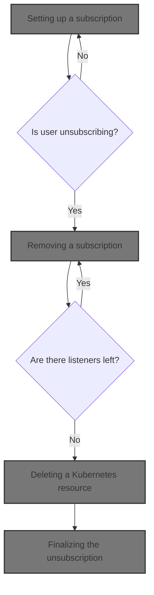

```mermaid
%%{init: {"flowchart": {"defaultRenderer": "elk"}} }%%
flowchart TD
  node1["Start connection process"]
  click node1 openCode "frontend/src/lib/k8s/api/v2/webSocket.ts:138:139"
  node1 --> node2{"Is there an open WebSocket connection?"}
  click node2 openCode "frontend/src/lib/k8s/api/v2/webSocket.ts:140:142"
  node2 -->|"Yes"| node3["Return existing connection"]
  click node3 openCode "frontend/src/lib/k8s/api/v2/webSocket.ts:141:142"
  node2 -->|"No"| node4{"Is a connection attempt in progress?"}
  click node4 openCode "frontend/src/lib/k8s/api/v2/webSocket.ts:145:154"
  node4 -->|"Yes"| node5["Wait for connection to open"]
  click node5 openCode "frontend/src/lib/k8s/api/v2/webSocket.ts:146:153"
  node4 -->|"No"| node6["Establish new WebSocket connection"]
  click node6 openCode "frontend/src/lib/k8s/api/v2/webSocket.ts:156:172"
  node6 --> node7{"Is this a reconnection?"}
  click node7 openCode "frontend/src/lib/k8s/api/v2/webSocket.ts:167:170"
  node7 -->|"Yes"| node8["Resubscribe to all activeSubscriptions"]
  click node8 openCode "frontend/src/lib/k8s/api/v2/webSocket.ts:193:205"
  node7 -->|"No"| node9["Connection established"]
  click node9 openCode "frontend/src/lib/k8s/api/v2/webSocket.ts:172:173"
  node8 --> node9
  node9 --> node10["Return new connection"]
  click node10 openCode "frontend/src/lib/k8s/api/v2/webSocket.ts:172:173"

  subgraph loop1["For each active subscription in activeSubscriptions"]
    node8 --> node11["Send subscription request"]
    click node11 openCode "frontend/src/lib/k8s/api/v2/webSocket.ts:194:204"
    node11 --> node8
  end
classDef HeadingStyle fill:#777777,stroke:#333,stroke-width:2px;

%% Swimm:
%% %%{init: {"flowchart": {"defaultRenderer": "elk"}} }%%
%% flowchart TD
%%   node1["Start connection process"]
%%   click node1 openCode "<SwmPath>[frontend/…/v2/webSocket.ts](frontend/src/lib/k8s/api/v2/webSocket.ts)</SwmPath>:138:139"
%%   node1 --> node2{"Is there an open <SwmToken path="frontend/src/lib/k8s/api/v2/webSocket.ts" pos="138:10:10" line-data="  async connect(): Promise&lt;WebSocket&gt; {">`WebSocket`</SwmToken> connection?"}
%%   click node2 openCode "<SwmPath>[frontend/…/v2/webSocket.ts](frontend/src/lib/k8s/api/v2/webSocket.ts)</SwmPath>:140:142"
%%   node2 -->|"Yes"| node3["Return existing connection"]
%%   click node3 openCode "<SwmPath>[frontend/…/v2/webSocket.ts](frontend/src/lib/k8s/api/v2/webSocket.ts)</SwmPath>:141:142"
%%   node2 -->|"No"| node4{"Is a connection attempt in progress?"}
%%   click node4 openCode "<SwmPath>[frontend/…/v2/webSocket.ts](frontend/src/lib/k8s/api/v2/webSocket.ts)</SwmPath>:145:154"
%%   node4 -->|"Yes"| node5["Wait for connection to open"]
%%   click node5 openCode "<SwmPath>[frontend/…/v2/webSocket.ts](frontend/src/lib/k8s/api/v2/webSocket.ts)</SwmPath>:146:153"
%%   node4 -->|"No"| node6["Establish new <SwmToken path="frontend/src/lib/k8s/api/v2/webSocket.ts" pos="138:10:10" line-data="  async connect(): Promise&lt;WebSocket&gt; {">`WebSocket`</SwmToken> connection"]
%%   click node6 openCode "<SwmPath>[frontend/…/v2/webSocket.ts](frontend/src/lib/k8s/api/v2/webSocket.ts)</SwmPath>:156:172"
%%   node6 --> node7{"Is this a reconnection?"}
%%   click node7 openCode "<SwmPath>[frontend/…/v2/webSocket.ts](frontend/src/lib/k8s/api/v2/webSocket.ts)</SwmPath>:167:170"
%%   node7 -->|"Yes"| node8["Resubscribe to all <SwmToken path="frontend/src/lib/k8s/api/v2/webSocket.ts" pos="194:3:3" line-data="    this.activeSubscriptions.forEach(({ clusterId, path, query }) =&gt; {">`activeSubscriptions`</SwmToken>"]
%%   click node8 openCode "<SwmPath>[frontend/…/v2/webSocket.ts](frontend/src/lib/k8s/api/v2/webSocket.ts)</SwmPath>:193:205"
%%   node7 -->|"No"| node9["Connection established"]
%%   click node9 openCode "<SwmPath>[frontend/…/v2/webSocket.ts](frontend/src/lib/k8s/api/v2/webSocket.ts)</SwmPath>:172:173"
%%   node8 --> node9
%%   node9 --> node10["Return new connection"]
%%   click node10 openCode "<SwmPath>[frontend/…/v2/webSocket.ts](frontend/src/lib/k8s/api/v2/webSocket.ts)</SwmPath>:172:173"
%% 
%%   subgraph loop1["For each active subscription in <SwmToken path="frontend/src/lib/k8s/api/v2/webSocket.ts" pos="194:3:3" line-data="    this.activeSubscriptions.forEach(({ clusterId, path, query }) =&gt; {">`activeSubscriptions`</SwmToken>"]
%%     node8 --> node11["Send subscription request"]
%%     click node11 openCode "<SwmPath>[frontend/…/v2/webSocket.ts](frontend/src/lib/k8s/api/v2/webSocket.ts)</SwmPath>:194:204"
%%     node11 --> node8
%%   end
%% classDef HeadingStyle fill:#777777,stroke:#333,stroke-width:2px;
```

This document describes how users can receive live updates for Kubernetes resources by subscribing to changes. The system establishes a <SwmToken path="frontend/src/lib/k8s/api/v2/webSocket.ts" pos="138:10:10" line-data="  async connect(): Promise&lt;WebSocket&gt; {">`WebSocket`</SwmToken> connection, delivers updates in real time, and provides a way to unsubscribe and clean up resources.



# Setting up a subscription

<SwmSnippet path="/frontend/src/lib/k8s/api/v2/webSocket.ts" line="215">

---

In <SwmToken path="frontend/src/lib/k8s/api/v2/webSocket.ts" pos="215:3:3" line-data="  async subscribe(">`subscribe`</SwmToken>, we register the subscription and listener, then call connect to open the <SwmToken path="frontend/src/lib/k8s/api/v2/webSocket.ts" pos="138:10:10" line-data="  async connect(): Promise&lt;WebSocket&gt; {">`WebSocket`</SwmToken> and start handling messages.

```typescript
  async subscribe(
    clusterId: string,
    path: string,
    query: string,
    onMessage: (data: any) => void
  ): Promise<() => void> {
    const key = this.createKey(clusterId, path, query);

    // Add to active subscriptions
    this.activeSubscriptions.set(key, { clusterId, path, query });

    // Add message listener
    const listeners = this.listeners.get(key) || new Set();
    listeners.add(onMessage);
    this.listeners.set(key, listeners);

    // Establish connection and send REQUEST
    const socket = await this.connect();
```

---

</SwmSnippet>

## Opening and managing the <SwmToken path="frontend/src/lib/k8s/api/v2/webSocket.ts" pos="138:10:10" line-data="  async connect(): Promise&lt;WebSocket&gt; {">`WebSocket`</SwmToken> connection



<SwmSnippet path="/frontend/src/lib/k8s/api/v2/webSocket.ts" line="138">

---

In <SwmToken path="frontend/src/lib/k8s/api/v2/webSocket.ts" pos="138:3:3" line-data="  async connect(): Promise&lt;WebSocket&gt; {">`connect`</SwmToken>, we check for an existing open socket or ongoing connection attempt before creating a new one. We then build the <SwmToken path="frontend/src/lib/k8s/api/v2/webSocket.ts" pos="138:10:10" line-data="  async connect(): Promise&lt;WebSocket&gt; {">`WebSocket`</SwmToken> URL using <SwmToken path="frontend/src/lib/k8s/api/v2/webSocket.ts" pos="157:9:9" line-data="    const wsUrl = `${getBaseWsUrl()}${MULTIPLEXER_ENDPOINT}`;">`getBaseWsUrl`</SwmToken> to make sure we're connecting to the right backend endpoint.

```typescript
  async connect(): Promise<WebSocket> {
    // Return existing connection if available
    if (this.socketMultiplexer?.readyState === WebSocket.OPEN) {
      return this.socketMultiplexer;
    }

    // Wait for existing connection attempt if in progress
    if (this.connecting) {
      return new Promise(resolve => {
        const checkConnection = setInterval(() => {
          if (this.socketMultiplexer?.readyState === WebSocket.OPEN) {
            clearInterval(checkConnection);
            resolve(this.socketMultiplexer);
          }
        }, 100);
      });
    }

    this.connecting = true;
    const wsUrl = `${getBaseWsUrl()}${MULTIPLEXER_ENDPOINT}`;

```

---

</SwmSnippet>

<SwmSnippet path="/frontend/src/lib/k8s/api/v2/webSocket.ts" line="27">

---

<SwmToken path="frontend/src/lib/k8s/api/v2/webSocket.ts" pos="27:4:4" line-data="export function getBaseWsUrl(): string {">`getBaseWsUrl`</SwmToken> converts the app's base URL from HTTP to WS so we can use it for <SwmToken path="frontend/src/lib/k8s/api/v2/webSocket.ts" pos="138:10:10" line-data="  async connect(): Promise&lt;WebSocket&gt; {">`WebSocket`</SwmToken> connections. It calls <SwmToken path="frontend/src/lib/k8s/api/v2/webSocket.ts" pos="28:3:3" line-data="  return getAppUrl().replace(&#39;http&#39;, &#39;ws&#39;);">`getAppUrl`</SwmToken> to get the current environment's URL.

```typescript
export function getBaseWsUrl(): string {
  return getAppUrl().replace('http', 'ws');
}
```

---

</SwmSnippet>

<SwmSnippet path="/frontend/src/lib/k8s/api/v2/webSocket.ts" line="159">

---

Back in <SwmToken path="frontend/src/lib/k8s/api/v2/webSocket.ts" pos="138:3:3" line-data="  async connect(): Promise&lt;WebSocket&gt; {">`connect`</SwmToken>, after opening the socket, we check if we're reconnecting. If so, we call <SwmToken path="frontend/src/lib/k8s/api/v2/webSocket.ts" pos="168:3:3" line-data="          this.resubscribeAll(socket);">`resubscribeAll`</SwmToken> to restore all previous subscriptions so the server knows what data to send.

```typescript
    return new Promise((resolve, reject) => {
      const socket = new WebSocket(wsUrl);

      socket.onopen = () => {
        this.socketMultiplexer = socket;
        this.connecting = false;

        // Only resubscribe if we're reconnecting after a disconnect
        if (this.isReconnecting) {
          this.resubscribeAll(socket);
        }
        this.isReconnecting = false;

        resolve(socket);
      };

```

---

</SwmSnippet>

<SwmSnippet path="/frontend/src/lib/k8s/api/v2/webSocket.ts" line="193">

---

<SwmToken path="frontend/src/lib/k8s/api/v2/webSocket.ts" pos="193:1:1" line-data="  resubscribeAll(socket: WebSocket): void {">`resubscribeAll`</SwmToken> loops through all active subscriptions and sends a subscription request for each, grabbing the <SwmToken path="frontend/src/lib/k8s/api/v2/webSocket.ts" pos="195:3:3" line-data="      const userId = getUserIdFromLocalStorage();">`userId`</SwmToken> from local storage every time. This makes sure the backend knows which user is requesting each subscription.

```typescript
  resubscribeAll(socket: WebSocket): void {
    this.activeSubscriptions.forEach(({ clusterId, path, query }) => {
      const userId = getUserIdFromLocalStorage();
      const requestMsg: WebSocketMessage = {
        clusterId,
        path,
        query,
        userId: userId || '',
        type: 'REQUEST',
      };
      socket.send(JSON.stringify(requestMsg));
    });
  },
```

---

</SwmSnippet>

<SwmSnippet path="/frontend/src/lib/k8s/api/v2/webSocket.ts" line="175">

---

Back in <SwmToken path="frontend/src/lib/k8s/api/v2/webSocket.ts" pos="138:3:3" line-data="  async connect(): Promise&lt;WebSocket&gt; {">`connect`</SwmToken>, after resubscribing, we set up handlers for incoming messages, errors, and socket closure. This keeps the connection state and message routing in sync.

```typescript
      socket.onmessage = this.handleWebSocketMessage.bind(this);

      socket.onerror = event => {
        this.connecting = false;
        console.error('WebSocket error:', event);
        reject(new Error('WebSocket connection failed'));
      };

      socket.onclose = () => {
        this.handleWebSocketClose();
      };
    });
  },
```

---

</SwmSnippet>

## Sending the subscription request

```mermaid
%%{init: {"flowchart": {"defaultRenderer": "elk"}} }%%
flowchart TD
    node1["Identify user for subscription"]
    click node1 openCode "frontend/src/lib/k8s/api/v2/webSocket.ts:233:233"
    node1 --> node2{"Is user ID available?"}
    click node2 openCode "frontend/src/lib/k8s/api/v2/webSocket.ts:233:238"
    node2 -->|"Yes"| node3["Prepare subscription request with user ID, cluster, path, query"]
    click node3 openCode "frontend/src/lib/k8s/api/v2/webSocket.ts:234:240"
    node2 -->|"No"| node4["Prepare subscription request with empty user ID, cluster, path, query"]
    click node4 openCode "frontend/src/lib/k8s/api/v2/webSocket.ts:234:240"
    node3 --> node5["Send subscription request"]
    click node5 openCode "frontend/src/lib/k8s/api/v2/webSocket.ts:241:241"
    node4 --> node5
    node5 --> node6["Return function to unsubscribe when done"]
    click node6 openCode "frontend/src/lib/k8s/api/v2/webSocket.ts:244:244"

classDef HeadingStyle fill:#777777,stroke:#333,stroke-width:2px;

%% Swimm:
%% %%{init: {"flowchart": {"defaultRenderer": "elk"}} }%%
%% flowchart TD
%%     node1["Identify user for subscription"]
%%     click node1 openCode "<SwmPath>[frontend/…/v2/webSocket.ts](frontend/src/lib/k8s/api/v2/webSocket.ts)</SwmPath>:233:233"
%%     node1 --> node2{"Is user ID available?"}
%%     click node2 openCode "<SwmPath>[frontend/…/v2/webSocket.ts](frontend/src/lib/k8s/api/v2/webSocket.ts)</SwmPath>:233:238"
%%     node2 -->|"Yes"| node3["Prepare subscription request with user ID, cluster, path, query"]
%%     click node3 openCode "<SwmPath>[frontend/…/v2/webSocket.ts](frontend/src/lib/k8s/api/v2/webSocket.ts)</SwmPath>:234:240"
%%     node2 -->|"No"| node4["Prepare subscription request with empty user ID, cluster, path, query"]
%%     click node4 openCode "<SwmPath>[frontend/…/v2/webSocket.ts](frontend/src/lib/k8s/api/v2/webSocket.ts)</SwmPath>:234:240"
%%     node3 --> node5["Send subscription request"]
%%     click node5 openCode "<SwmPath>[frontend/…/v2/webSocket.ts](frontend/src/lib/k8s/api/v2/webSocket.ts)</SwmPath>:241:241"
%%     node4 --> node5
%%     node5 --> node6["Return function to unsubscribe when done"]
%%     click node6 openCode "<SwmPath>[frontend/…/v2/webSocket.ts](frontend/src/lib/k8s/api/v2/webSocket.ts)</SwmPath>:244:244"
%% 
%% classDef HeadingStyle fill:#777777,stroke:#333,stroke-width:2px;
```



<SwmSnippet path="/frontend/src/lib/k8s/api/v2/webSocket.ts" line="233">

---

Back in <SwmToken path="frontend/src/lib/k8s/api/v2/webSocket.ts" pos="215:3:3" line-data="  async subscribe(">`subscribe`</SwmToken>, we fetch <SwmToken path="frontend/src/lib/k8s/api/v2/webSocket.ts" pos="233:3:3" line-data="    const userId = getUserIdFromLocalStorage();">`userId`</SwmToken> from local storage before sending the subscription request.

```typescript
    const userId = getUserIdFromLocalStorage();
```

---

</SwmSnippet>

<SwmSnippet path="/frontend/src/lib/k8s/api/v2/webSocket.ts" line="234">

---

Back in <SwmToken path="frontend/src/lib/k8s/api/v2/webSocket.ts" pos="215:3:3" line-data="  async subscribe(">`subscribe`</SwmToken>, after sending the subscription request, we return a cleanup function that calls unsubscribe. This lets the caller clean up the subscription when it's no longer needed.

```typescript
    const requestMsg: WebSocketMessage = {
      clusterId,
      path,
      query,
      userId: userId || '',
      type: 'REQUEST',
    };
    socket.send(JSON.stringify(requestMsg));

    // Return cleanup function
    return () => this.unsubscribe(key, clusterId, path, query, onMessage);
  },
```

---

</SwmSnippet>

# Removing a subscription

```mermaid
%%{init: {"flowchart": {"defaultRenderer": "elk"}} }%%
flowchart TD
  node1["User requests to unsubscribe from updates"]
  click node1 openCode "frontend/src/lib/k8s/api/v2/webSocket.ts:268:274"
  node1 --> node2{"Are there any listeners left after removal?"}
  click node2 openCode "frontend/src/lib/k8s/api/v2/webSocket.ts:284:286"
  node2 -->|"No"| node3["Wait 100ms to confirm no resubscription"]
  click node3 openCode "frontend/src/lib/k8s/api/v2/webSocket.ts:292:311"
  node3 --> node4{"Still no listeners after 100ms?"}
  click node4 openCode "frontend/src/lib/k8s/api/v2/webSocket.ts:294:308"
  node4 -->|"Yes"| node5["Send WebSocket CLOSE message to server"]
  click node5 openCode "frontend/src/lib/k8s/api/v2/webSocket.ts:298:308"
  node4 -->|"No"| node1
classDef HeadingStyle fill:#777777,stroke:#333,stroke-width:2px;

%% Swimm:
%% %%{init: {"flowchart": {"defaultRenderer": "elk"}} }%%
%% flowchart TD
%%   node1["User requests to unsubscribe from updates"]
%%   click node1 openCode "<SwmPath>[frontend/…/v2/webSocket.ts](frontend/src/lib/k8s/api/v2/webSocket.ts)</SwmPath>:268:274"
%%   node1 --> node2{"Are there any listeners left after removal?"}
%%   click node2 openCode "<SwmPath>[frontend/…/v2/webSocket.ts](frontend/src/lib/k8s/api/v2/webSocket.ts)</SwmPath>:284:286"
%%   node2 -->|"No"| node3["Wait <SwmToken path="frontend/src/lib/k8s/api/v2/webSocket.ts" pos="311:10:10" line-data="        }, 100); // 100ms debounce">`100ms`</SwmToken> to confirm no resubscription"]
%%   click node3 openCode "<SwmPath>[frontend/…/v2/webSocket.ts](frontend/src/lib/k8s/api/v2/webSocket.ts)</SwmPath>:292:311"
%%   node3 --> node4{"Still no listeners after <SwmToken path="frontend/src/lib/k8s/api/v2/webSocket.ts" pos="311:10:10" line-data="        }, 100); // 100ms debounce">`100ms`</SwmToken>?"}
%%   click node4 openCode "<SwmPath>[frontend/…/v2/webSocket.ts](frontend/src/lib/k8s/api/v2/webSocket.ts)</SwmPath>:294:308"
%%   node4 -->|"Yes"| node5["Send <SwmToken path="frontend/src/lib/k8s/api/v2/webSocket.ts" pos="138:10:10" line-data="  async connect(): Promise&lt;WebSocket&gt; {">`WebSocket`</SwmToken> CLOSE message to server"]
%%   click node5 openCode "<SwmPath>[frontend/…/v2/webSocket.ts](frontend/src/lib/k8s/api/v2/webSocket.ts)</SwmPath>:298:308"
%%   node4 -->|"No"| node1
%% classDef HeadingStyle fill:#777777,stroke:#333,stroke-width:2px;
```



<SwmSnippet path="/frontend/src/lib/k8s/api/v2/webSocket.ts" line="268">

---

In <SwmToken path="frontend/src/lib/k8s/api/v2/webSocket.ts" pos="268:1:1" line-data="  unsubscribe(">`unsubscribe`</SwmToken>, we clear any pending unsubscribe timeout, remove the listener, and if no listeners remain, set a debounce to send the CLOSE message after <SwmToken path="frontend/src/lib/k8s/api/v2/webSocket.ts" pos="311:10:10" line-data="        }, 100); // 100ms debounce">`100ms`</SwmToken>. This avoids unnecessary socket churn. Next, we call KubeObject.delete to handle resource cleanup if needed.

```typescript
  unsubscribe(
    key: string,
    clusterId: string,
    path: string,
    query: string,
    onMessage: (data: any) => void
  ): void {
    // Clear any pending unsubscribe for this key
    const pendingTimeout = this.pendingUnsubscribes.get(key);
    if (pendingTimeout) {
      clearTimeout(pendingTimeout);
      this.pendingUnsubscribes.delete(key);
    }

    // Remove the listener
    const listeners = this.listeners.get(key);
    if (listeners) {
      listeners.delete(onMessage);
      if (listeners.size === 0) {
        this.listeners.delete(key);

        // Delay unsubscription to handle rapid re-subscriptions
        // This prevents unnecessary WebSocket churn when a component quickly unmounts and remounts
        // For example: during route changes or component updates in React's strict mode
        const timeout = setTimeout(() => {
          // Only unsubscribe if there are still no listeners
          if (!this.listeners.has(key)) {
            this.activeSubscriptions.delete(key);
            this.completedPaths.delete(key);

```

---

</SwmSnippet>

## Deleting a Kubernetes resource

```mermaid
%%{init: {"flowchart": {"defaultRenderer": "elk"}} }%%
flowchart TD
  node1["Start deletion process"]
  click node1 openCode "frontend/src/lib/k8s/KubeObject.ts:450:465"
  node1 --> node2{"Is object namespaced?"}
  click node2 openCode "frontend/src/lib/k8s/KubeObject.ts:452:454"
  node2 -->|"Yes"| node3["Add namespace to deletion arguments"]
  click node3 openCode "frontend/src/lib/k8s/KubeObject.ts:453:453"
  node2 -->|"No"| node4["Proceed without namespace"]
  click node4 openCode "frontend/src/lib/k8s/KubeObject.ts:451:451"
  node3 --> node5{"Is force deletion requested?"}
  node4 --> node5
  click node5 openCode "frontend/src/lib/k8s/KubeObject.ts:458:461"
  node5 -->|"Yes"| node6["Set immediate deletion (gracePeriodSeconds = 0)"]
  click node6 openCode "frontend/src/lib/k8s/KubeObject.ts:459:459"
  node5 -->|"No"| node7["Proceed with standard deletion"]
  click node7 openCode "frontend/src/lib/k8s/KubeObject.ts:455:455"
  node6 --> node8["Delete Kubernetes object"]
  node7 --> node8
  click node8 openCode "frontend/src/lib/k8s/KubeObject.ts:464:464"

classDef HeadingStyle fill:#777777,stroke:#333,stroke-width:2px;

%% Swimm:
%% %%{init: {"flowchart": {"defaultRenderer": "elk"}} }%%
%% flowchart TD
%%   node1["Start deletion process"]
%%   click node1 openCode "<SwmPath>[frontend/…/k8s/KubeObject.ts](frontend/src/lib/k8s/KubeObject.ts)</SwmPath>:450:465"
%%   node1 --> node2{"Is object namespaced?"}
%%   click node2 openCode "<SwmPath>[frontend/…/k8s/KubeObject.ts](frontend/src/lib/k8s/KubeObject.ts)</SwmPath>:452:454"
%%   node2 -->|"Yes"| node3["Add namespace to deletion arguments"]
%%   click node3 openCode "<SwmPath>[frontend/…/k8s/KubeObject.ts](frontend/src/lib/k8s/KubeObject.ts)</SwmPath>:453:453"
%%   node2 -->|"No"| node4["Proceed without namespace"]
%%   click node4 openCode "<SwmPath>[frontend/…/k8s/KubeObject.ts](frontend/src/lib/k8s/KubeObject.ts)</SwmPath>:451:451"
%%   node3 --> node5{"Is force deletion requested?"}
%%   node4 --> node5
%%   click node5 openCode "<SwmPath>[frontend/…/k8s/KubeObject.ts](frontend/src/lib/k8s/KubeObject.ts)</SwmPath>:458:461"
%%   node5 -->|"Yes"| node6["Set immediate deletion (<SwmToken path="frontend/src/lib/k8s/KubeObject.ts" pos="459:3:3" line-data="      params.gracePeriodSeconds = 0;">`gracePeriodSeconds`</SwmToken> = 0)"]
%%   click node6 openCode "<SwmPath>[frontend/…/k8s/KubeObject.ts](frontend/src/lib/k8s/KubeObject.ts)</SwmPath>:459:459"
%%   node5 -->|"No"| node7["Proceed with standard deletion"]
%%   click node7 openCode "<SwmPath>[frontend/…/k8s/KubeObject.ts](frontend/src/lib/k8s/KubeObject.ts)</SwmPath>:455:455"
%%   node6 --> node8["Delete Kubernetes object"]
%%   node7 --> node8
%%   click node8 openCode "<SwmPath>[frontend/…/k8s/KubeObject.ts](frontend/src/lib/k8s/KubeObject.ts)</SwmPath>:464:464"
%% 
%% classDef HeadingStyle fill:#777777,stroke:#333,stroke-width:2px;
```



<SwmSnippet path="/frontend/src/lib/k8s/KubeObject.ts" line="450">

---

<SwmToken path="frontend/src/lib/k8s/KubeObject.ts" pos="450:1:1" line-data="  delete(force?: boolean) {">`delete`</SwmToken> builds the argument list for the API call, sets force deletion if requested, and calls the endpoint's delete method. Next, it delegates to the <SwmPath>[frontend/…/v1/factories.ts](frontend/src/lib/k8s/api/v1/factories.ts)</SwmPath> delete implementation.

```typescript
  delete(force?: boolean) {
    const args: string[] = [this.getName()];
    if (this.isNamespaced) {
      args.unshift(this.getNamespace()!);
    }
    const params: DeleteParameters = {};

    console.log(force);
    if (force) {
      params.gracePeriodSeconds = 0;
      console.log(params);
    }

    // @ts-ignore
    return this._class().apiEndpoint.delete(...args, params, this._clusterName);
  }
```

---

</SwmSnippet>

## Building the delete request

```mermaid
%%{init: {"flowchart": {"defaultRenderer": "elk"}} }%%
flowchart TD
    node1["Request to delete resource (name) from cluster"] --> node2{"Are delete parameters provided?"}
    click node1 openCode "frontend/src/lib/k8s/api/v1/factories.ts:379:380"
    node2 -->|"Yes"| node3["Delete resource from cluster with parameters"]
    click node2 openCode "frontend/src/lib/k8s/api/v1/formatUrl.ts:51:70"
    click node3 openCode "frontend/src/lib/k8s/api/v1/factories.ts:380:380"
    node2 -->|"No"| node4["Delete resource from cluster without parameters"]
    click node4 openCode "frontend/src/lib/k8s/api/v1/factories.ts:380:380"
    node3 --> node5["Resource deleted"]
    node4 --> node5["Resource deleted"]
    click node5 openCode "frontend/src/lib/k8s/api/v1/factories.ts:380:380"

classDef HeadingStyle fill:#777777,stroke:#333,stroke-width:2px;

%% Swimm:
%% %%{init: {"flowchart": {"defaultRenderer": "elk"}} }%%
%% flowchart TD
%%     node1["Request to delete resource (name) from cluster"] --> node2{"Are delete parameters provided?"}
%%     click node1 openCode "<SwmPath>[frontend/…/v1/factories.ts](frontend/src/lib/k8s/api/v1/factories.ts)</SwmPath>:379:380"
%%     node2 -->|"Yes"| node3["Delete resource from cluster with parameters"]
%%     click node2 openCode "<SwmPath>[frontend/…/v1/formatUrl.ts](frontend/src/lib/k8s/api/v1/formatUrl.ts)</SwmPath>:51:70"
%%     click node3 openCode "<SwmPath>[frontend/…/v1/factories.ts](frontend/src/lib/k8s/api/v1/factories.ts)</SwmPath>:380:380"
%%     node2 -->|"No"| node4["Delete resource from cluster without parameters"]
%%     click node4 openCode "<SwmPath>[frontend/…/v1/factories.ts](frontend/src/lib/k8s/api/v1/factories.ts)</SwmPath>:380:380"
%%     node3 --> node5["Resource deleted"]
%%     node4 --> node5["Resource deleted"]
%%     click node5 openCode "<SwmPath>[frontend/…/v1/factories.ts](frontend/src/lib/k8s/api/v1/factories.ts)</SwmPath>:380:380"
%% 
%% classDef HeadingStyle fill:#777777,stroke:#333,stroke-width:2px;
```



<SwmSnippet path="/frontend/src/lib/k8s/api/v1/factories.ts" line="379">

---

In <SwmPath>[frontend/…/v1/factories.ts](frontend/src/lib/k8s/api/v1/factories.ts)</SwmPath>, the delete function builds the URL for the delete request, appending query parameters using <SwmToken path="frontend/src/lib/k8s/api/v1/factories.ts" pos="380:15:15" line-data="      remove(`${url}/${name}` + asQuery(deleteParams), { cluster }),">`asQuery`</SwmToken>. Next, it calls <SwmPath>[frontend/…/v1/formatUrl.ts](frontend/src/lib/k8s/api/v1/formatUrl.ts)</SwmPath> to serialize those parameters.

```typescript
    delete: (name, deleteParams, cluster) =>
      remove(`${url}/${name}` + asQuery(deleteParams), { cluster }),
```

---

</SwmSnippet>

<SwmSnippet path="/frontend/src/lib/k8s/api/v1/formatUrl.ts" line="51">

---

<SwmToken path="frontend/src/lib/k8s/api/v1/formatUrl.ts" pos="51:4:4" line-data="export function asQuery(queryParams?: QueryParameters): string {">`asQuery`</SwmToken> builds the query string, making sure 'limit' is a string or left out if it's not valid.

```typescript
export function asQuery(queryParams?: QueryParameters): string {
  if (queryParams === undefined) {
    return '';
  }

  let newQueryParams;
  if (typeof queryParams.limit === 'number' || typeof queryParams.limit === 'string') {
    newQueryParams = {
      ...queryParams,
      limit:
        typeof queryParams.limit === 'number' ? queryParams.limit.toString() : queryParams.limit,
    };
  } else {
    newQueryParams = { ...omit(queryParams, 'limit') };
  }

  return !!newQueryParams && !!Object.keys(newQueryParams).length
    ? '?' + new URLSearchParams(newQueryParams).toString()
    : '';
}
```

---

</SwmSnippet>

<SwmSnippet path="/frontend/src/lib/k8s/api/v1/factories.ts" line="380">

---

Back in <SwmPath>[frontend/…/v1/factories.ts](frontend/src/lib/k8s/api/v1/factories.ts)</SwmPath>, after building the delete URL and query string, we call remove to send the actual DELETE request to the backend.

```typescript
      remove(`${url}/${name}` + asQuery(deleteParams), { cluster }),
```

---

</SwmSnippet>

## Sending the delete request

```mermaid
%%{init: {"flowchart": {"defaultRenderer": "elk"}} }%%
flowchart TD
  node1{"Is a cluster specified in request options?"}
  click node1 openCode "frontend/src/lib/k8s/api/v1/clusterRequests.ts:285:286"
  node1 -->|"Yes"| node2["Use specified cluster"]
  click node2 openCode "frontend/src/lib/k8s/api/v1/clusterRequests.ts:285:286"
  node1 -->|"No"| node3{"Is a default cluster available?"}
  click node3 openCode "frontend/src/lib/k8s/api/v1/clusterRequests.ts:286:286"
  node3 -->|"Yes"| node4["Use default cluster"]
  click node4 openCode "frontend/src/lib/k8s/api/v1/clusterRequests.ts:286:286"
  node3 -->|"No"| node5["Use empty cluster value"]
  click node5 openCode "frontend/src/lib/k8s/api/v1/clusterRequests.ts:286:286"
  node2 --> node6["Send DELETE request to resource URL"]
  node4 --> node6
  node5 --> node6
  click node6 openCode "frontend/src/lib/k8s/api/v1/clusterRequests.ts:287:288"

classDef HeadingStyle fill:#777777,stroke:#333,stroke-width:2px;

%% Swimm:
%% %%{init: {"flowchart": {"defaultRenderer": "elk"}} }%%
%% flowchart TD
%%   node1{"Is a cluster specified in request options?"}
%%   click node1 openCode "<SwmPath>[frontend/…/v1/clusterRequests.ts](frontend/src/lib/k8s/api/v1/clusterRequests.ts)</SwmPath>:285:286"
%%   node1 -->|"Yes"| node2["Use specified cluster"]
%%   click node2 openCode "<SwmPath>[frontend/…/v1/clusterRequests.ts](frontend/src/lib/k8s/api/v1/clusterRequests.ts)</SwmPath>:285:286"
%%   node1 -->|"No"| node3{"Is a default cluster available?"}
%%   click node3 openCode "<SwmPath>[frontend/…/v1/clusterRequests.ts](frontend/src/lib/k8s/api/v1/clusterRequests.ts)</SwmPath>:286:286"
%%   node3 -->|"Yes"| node4["Use default cluster"]
%%   click node4 openCode "<SwmPath>[frontend/…/v1/clusterRequests.ts](frontend/src/lib/k8s/api/v1/clusterRequests.ts)</SwmPath>:286:286"
%%   node3 -->|"No"| node5["Use empty cluster value"]
%%   click node5 openCode "<SwmPath>[frontend/…/v1/clusterRequests.ts](frontend/src/lib/k8s/api/v1/clusterRequests.ts)</SwmPath>:286:286"
%%   node2 --> node6["Send DELETE request to resource URL"]
%%   node4 --> node6
%%   node5 --> node6
%%   click node6 openCode "<SwmPath>[frontend/…/v1/clusterRequests.ts](frontend/src/lib/k8s/api/v1/clusterRequests.ts)</SwmPath>:287:288"
%% 
%% classDef HeadingStyle fill:#777777,stroke:#333,stroke-width:2px;
```



<SwmSnippet path="/frontend/src/lib/k8s/api/v1/clusterRequests.ts" line="283">

---

In remove, we extract the cluster name from the request options or get it from the current context. This makes sure the delete request goes to the right cluster.

```typescript
export function remove(url: string, requestOptions: ClusterRequestParams = {}) {
  console.log(url, requestOptions);
  const { cluster: clusterName, ...restOptions } = requestOptions;
  const cluster = clusterName || getCluster() || '';
```

---

</SwmSnippet>

<SwmSnippet path="/frontend/src/lib/k8s/api/v1/clusterRequests.ts" line="287">

---

Back in <SwmPath>[frontend/…/v1/clusterRequests.ts](frontend/src/lib/k8s/api/v1/clusterRequests.ts)</SwmPath>, we build the DELETE request options and call <SwmToken path="frontend/src/lib/k8s/api/v1/clusterRequests.ts" pos="288:3:3" line-data="  return clusterRequest(url, opts);">`clusterRequest`</SwmToken> to send it, making sure all cluster-specific headers are included.

```typescript
  const opts = { method: 'DELETE', headers: JSON_HEADERS, cluster, ...restOptions };
  return clusterRequest(url, opts);
}
```

---

</SwmSnippet>

## Finalizing the unsubscription

<SwmSnippet path="/frontend/src/lib/k8s/api/v2/webSocket.ts" line="298">

---

Back in <SwmToken path="frontend/src/lib/k8s/api/v2/webSocket.ts" pos="244:10:10" line-data="    return () =&gt; this.unsubscribe(key, clusterId, path, query, onMessage);">`unsubscribe`</SwmToken>, after resource cleanup, we check if the socket is open and send a CLOSE message with the current <SwmToken path="frontend/src/lib/k8s/api/v2/webSocket.ts" pos="299:3:3" line-data="              const userId = getUserIdFromLocalStorage();">`userId`</SwmToken>. This tells the backend to stop sending updates for this subscription.

```typescript
            if (this.socketMultiplexer?.readyState === WebSocket.OPEN) {
              const userId = getUserIdFromLocalStorage();
              const closeMsg: WebSocketMessage = {
                clusterId,
                path,
                query,
                userId: userId || '',
                type: 'CLOSE',
              };
              this.socketMultiplexer.send(JSON.stringify(closeMsg));
            }
          }
```

---

</SwmSnippet>

<SwmSnippet path="/frontend/src/lib/k8s/api/v2/webSocket.ts" line="310">

---

Back in <SwmToken path="frontend/src/lib/k8s/api/v2/webSocket.ts" pos="244:10:10" line-data="    return () =&gt; this.unsubscribe(key, clusterId, path, query, onMessage);">`unsubscribe`</SwmToken>, after sending the CLOSE message, we clean up the pending unsubscribe entry to keep the internal state consistent.

```typescript
          this.pendingUnsubscribes.delete(key);
```

---

</SwmSnippet>

<SwmSnippet path="/frontend/src/lib/k8s/api/v2/webSocket.ts" line="311">

---

Back in <SwmToken path="frontend/src/lib/k8s/api/v2/webSocket.ts" pos="244:10:10" line-data="    return () =&gt; this.unsubscribe(key, clusterId, path, query, onMessage);">`unsubscribe`</SwmToken>, the debounce timer is set for <SwmToken path="frontend/src/lib/k8s/api/v2/webSocket.ts" pos="311:10:10" line-data="        }, 100); // 100ms debounce">`100ms`</SwmToken> to delay the actual unsubscription, giving time for any new listeners to be added and avoiding unnecessary socket operations.

```typescript
        }, 100); // 100ms debounce

        this.pendingUnsubscribes.set(key, timeout);
      }
    }
  },
```

---

</SwmSnippet>

&nbsp;

*This is an auto-generated document by Swimm 🌊 and has not yet been verified by a human*

<SwmMeta version="3.0.0" repo-id="Z2l0aHViJTNBJTNBdHlwZXNjcmlwdC1oZWFkbGFtcCUzQSUzQXJpY2FyZG9sb3Blemc=" repo-name="typescript-headlamp"><sup>Powered by [Swimm](https://app.swimm.io/)</sup></SwmMeta>
