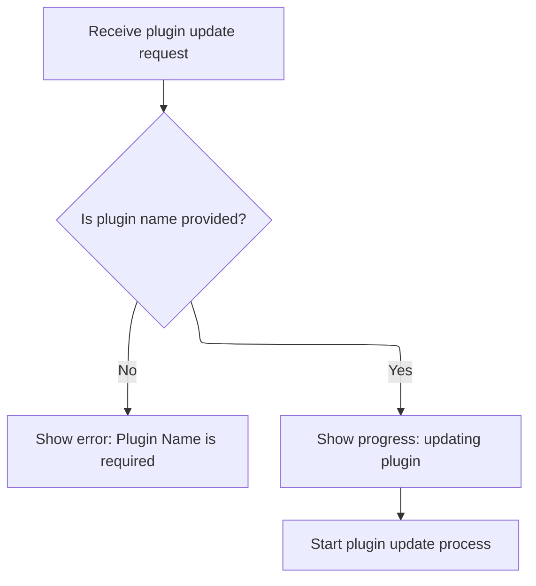
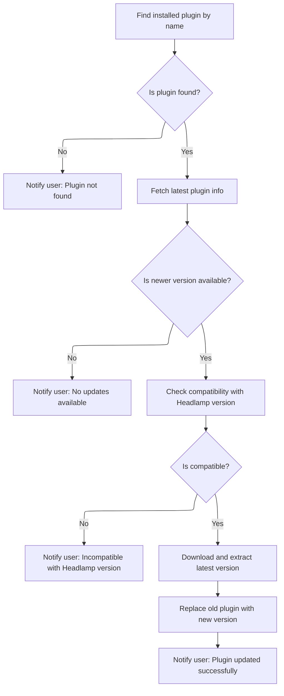

```mermaid
%%{init: {"flowchart": {"defaultRenderer": "elk"}} }%%
flowchart TD
    node1["WebSocket subscription fails"] --> node2{"Is retry count < 3?"}
    click node1 openCode "frontend/src/lib/k8s/api/v2/useKubeObjectList.ts:278:279"
    node2 -->|"Yes"| node3["Log error and increment retry count"]
    click node2 openCode "frontend/src/lib/k8s/api/v2/useKubeObjectList.ts:279:283"
    node2 -->|"No"| node4["Do not retry"]
    click node3 openCode "frontend/src/lib/k8s/api/v2/useKubeObjectList.ts:281:283"
    click node4 openCode "frontend/src/lib/k8s/api/v2/useKubeObjectList.ts:284:285"
    subgraph loop1["For each active subscription when effect re-runs or unmounts"]
      node5["Cleanup subscription"]
      click node5 openCode "frontend/src/lib/k8s/api/v2/useKubeObjectList.ts:290:291"
    end
classDef HeadingStyle fill:#777777,stroke:#333,stroke-width:2px;

%% Swimm:
%% %%{init: {"flowchart": {"defaultRenderer": "elk"}} }%%
%% flowchart TD
%%     node1["<SwmToken path="frontend/src/lib/k8s/api/v2/useKubeObjectList.ts" pos="203:5:5" line-data="      // Construct WebSocket URL with current parameters">`WebSocket`</SwmToken> subscription fails"] --> node2{"Is retry count < 3?"}
%%     click node1 openCode "<SwmPath>[frontend/…/v2/useKubeObjectList.ts](frontend/src/lib/k8s/api/v2/useKubeObjectList.ts)</SwmPath>:278:279"
%%     node2 -->|"Yes"| node3["Log error and increment retry count"]
%%     click node2 openCode "<SwmPath>[frontend/…/v2/useKubeObjectList.ts](frontend/src/lib/k8s/api/v2/useKubeObjectList.ts)</SwmPath>:279:283"
%%     node2 -->|"No"| node4["Do not retry"]
%%     click node3 openCode "<SwmPath>[frontend/…/v2/useKubeObjectList.ts](frontend/src/lib/k8s/api/v2/useKubeObjectList.ts)</SwmPath>:281:283"
%%     click node4 openCode "<SwmPath>[frontend/…/v2/useKubeObjectList.ts](frontend/src/lib/k8s/api/v2/useKubeObjectList.ts)</SwmPath>:284:285"
%%     subgraph loop1["For each active subscription when effect <SwmToken path="frontend/src/lib/k8s/api/v2/useKubeObjectList.ts" pos="288:11:13" line-data="    // Cleanup subscriptions when effect re-runs or unmounts">`re-runs`</SwmToken> or unmounts"]
%%       node5["Cleanup subscription"]
%%       click node5 openCode "<SwmPath>[frontend/…/v2/useKubeObjectList.ts](frontend/src/lib/k8s/api/v2/useKubeObjectList.ts)</SwmPath>:290:291"
%%     end
%% classDef HeadingStyle fill:#777777,stroke:#333,stroke-width:2px;
```

This document describes how the system keeps multiple Kubernetes resource lists up-to-date and synchronized. The flow ensures that resource lists reflect the latest changes from both the Kubernetes clusters and any plugin updates, providing live, current data to the user.

# Multiplexing and Tracking <SwmToken path="frontend/src/lib/k8s/api/v2/useKubeObjectList.ts" pos="170:8:8" line-data="function useWatchKubeObjectListsMultiplexed&lt;K extends KubeObject&gt;({">`KubeObject`</SwmToken> List Updates

<SwmSnippet path="/frontend/src/lib/k8s/api/v2/useKubeObjectList.ts" line="170">

---

In <SwmToken path="frontend/src/lib/k8s/api/v2/useKubeObjectList.ts" pos="170:2:2" line-data="function useWatchKubeObjectListsMultiplexed&lt;K extends KubeObject&gt;({">`useWatchKubeObjectListsMultiplexed`</SwmToken>, we prep everything needed to watch multiple <SwmToken path="frontend/src/lib/k8s/api/v2/useKubeObjectList.ts" pos="170:8:8" line-data="function useWatchKubeObjectListsMultiplexed&lt;K extends KubeObject&gt;({">`KubeObject`</SwmToken> lists, track resource versions, and update the cache only when the data actually changes. We need to call <SwmPath>[app/electron/main.ts](app/electron/main.ts)</SwmPath> next because plugin updates can trigger changes that affect these lists.

```typescript
function useWatchKubeObjectListsMultiplexed<K extends KubeObject>({
  kubeObjectClass,
  endpoint,
  lists,
  queryParams,
}: {
  kubeObjectClass: (new (...args: any) => K) & typeof KubeObject<any>;
  endpoint?: KubeObjectEndpoint | null;
  lists: Array<{ cluster: string; namespace?: string; resourceVersion: string }>;
  queryParams?: QueryParameters;
}): void {
  const client = useQueryClient();

  // Track the latest resource versions to prevent duplicate updates
  const latestResourceVersions = useRef<Record<string, string>>({});

  // Stabilize queryParams to prevent unnecessary effect triggers
  // Only update when the stringified params change
  const stableQueryParams = useMemo(() => queryParams, [JSON.stringify(queryParams)]);

  // Create stable connection URLs for each list
  // Updates only when endpoint, lists, or stableQueryParams change
  const connections = useMemo(() => {
    if (!endpoint) {
      return [];
    }

    return lists.map(list => {
      const key = `${list.cluster}:${list.namespace || ''}`;

      // Always use the latest resource version from the server
      latestResourceVersions.current[key] = list.resourceVersion;

      // Construct WebSocket URL with current parameters
      return {
        url: makeUrl([KubeObjectEndpoint.toUrl(endpoint, list.namespace)], {
          ...stableQueryParams,
          watch: 1,
          resourceVersion: latestResourceVersions.current[key],
        }),
        cluster: list.cluster,
        namespace: list.namespace,
      };
    });
  }, [endpoint, lists, stableQueryParams]);

  // Create stable update handler to process WebSocket messages
  // Re-create only when dependencies change
  const handleUpdate = useCallback(
    (update: any, cluster: string, namespace: string | undefined) => {
      if (!update || typeof update !== 'object' || !endpoint) {
        return;
      }

      const key = `${cluster}:${namespace || ''}`;

      // Update resource version from incoming message
      if (update.object?.metadata?.resourceVersion) {
        latestResourceVersions.current[key] = update.object.metadata.resourceVersion;
      }

      // Create query key for React Query cache
      const queryKey = kubeObjectListQuery<K>(
        kubeObjectClass,
        endpoint,
        namespace,
        cluster,
        stableQueryParams ?? {}
      ).queryKey;

      // Update React Query cache with new data
      client.setQueryData(queryKey, (oldResponse: ListResponse<any> | undefined | null) => {
        if (!oldResponse) {
          return oldResponse;
        }

        const newList = KubeList.applyUpdate(oldResponse.list, update, kubeObjectClass, cluster);

        // Only update if the list actually changed
        if (newList === oldResponse.list) {
          return oldResponse;
        }

        return { ...oldResponse, list: newList };
      });
    },
    [client, kubeObjectClass, endpoint, stableQueryParams]
  );

  // Set up WebSocket subscriptions
  useEffect(() => {
    if (!endpoint || connections.length === 0) {
      return;
    }

    const cleanups: (() => void)[] = [];

    // Create subscriptions for each connection
    connections.forEach(({ url, cluster, namespace }) => {
      const parsedUrl = new URL(url, BASE_WS_URL);

      // Subscribe to WebSocket updates
      WebSocketManager.subscribe(cluster, parsedUrl.pathname, parsedUrl.search.slice(1), update =>
        handleUpdate(update, cluster, namespace)
      ).then(
        cleanup => cleanups.push(cleanup),
        error => {
```

---

</SwmSnippet>

## Handling Plugin Update Events



<SwmSnippet path="/app/electron/main.ts" line="365">

---

<SwmToken path="app/electron/main.ts" pos="365:3:3" line-data="  private handleUpdate(eventData: Action, updateCache: (progress: ProgressResp) =&gt; void) {">`handleUpdate`</SwmToken> in <SwmPath>[app/electron/main.ts](app/electron/main.ts)</SwmPath> listens for plugin update events, validates the input, sets up progress tracking, and then hands off the actual update work to <SwmToken path="app/electron/main.ts" pos="383:1:3" line-data="    PluginManager.update(">`PluginManager.update`</SwmToken>. We need to call into <SwmPath>[app/electron/plugin-management.ts](app/electron/plugin-management.ts)</SwmPath> next because that's where the real update logic lives—downloading, extracting, and moving plugin files.

```typescript
  private handleUpdate(eventData: Action, updateCache: (progress: ProgressResp) => void) {
    const { identifier, pluginName, destinationFolder, headlampVersion } = eventData;
    if (!pluginName) {
      this.cache[identifier] = {
        action: 'UPDATE',
        progress: { type: 'error', message: 'Plugin Name is required' },
      };
      return;
    }

    const controller = new AbortController();
    this.cache[identifier] = {
      action: 'UPDATE',
      percentage: 10,
      progress: { type: 'info', message: 'updating plugin' },
      controller,
    };

    PluginManager.update(
      pluginName,
      destinationFolder,
      headlampVersion,
      progress => {
        updateCache(progress);
      },
      controller.signal
    );
  }
```

---

</SwmSnippet>

## Validating and Downloading Plugin Updates



<SwmSnippet path="/app/electron/plugin-management.ts" line="239">

---

In <SwmToken path="app/electron/main.ts" pos="383:1:3" line-data="    PluginManager.update(">`PluginManager.update`</SwmToken>, we check if the plugin exists and if an update is needed by comparing versions. We fetch metadata from <SwmToken path="app/electron/plugin-management.ts" pos="936:25:25" line-data="      throw new Error(&#39;Invalid URL. Please provide a valid URL from ArtifactHub.&#39;);">`ArtifactHub`</SwmToken>, check compatibility, and then call <SwmToken path="app/electron/plugin-management.ts" pos="272:14:14" line-data="      const [_, tempFolder] = await downloadExtractArchive(">`downloadExtractArchive`</SwmToken> to handle the actual download and extraction. We stay in <SwmPath>[app/electron/plugin-management.ts](app/electron/plugin-management.ts)</SwmPath> because the next steps—moving files and updating metadata—are handled here too.

```typescript
  static async update(
    pluginName: string,
    destinationFolder: string = defaultUserPluginsDir(),
    headlampVersion: string = '',
    progressCallback: null | ProgressCallback = null,
    signal: AbortSignal | null = null
  ): Promise<void> {
    try {
      // @todo: should list call take progressCallback?
      const installedPlugins = PluginManager.list(destinationFolder);
      if (!installedPlugins) {
        throw new Error('InstalledPlugins not found');
      }
      const plugin = installedPlugins.find(p => p.pluginName === pluginName);
      if (!plugin) {
        throw new Error('Plugin not found');
      }

      const pluginDir = path.join(destinationFolder, plugin.folderName);
      // read the package.json of the plugin
      const packageJsonPath = path.join(pluginDir, 'package.json');
      const packageJson = JSON.parse(fs.readFileSync(packageJsonPath, 'utf8'));

      const pluginData = await fetchPluginInfo(plugin.artifacthubURL, progressCallback, signal);

      const latestVersion = pluginData.version;
      const currentVersion = packageJson.artifacthub.version;

      if (semver.lte(latestVersion, currentVersion)) {
        throw new Error('No updates available');
      }

      // eslint-disable-next-line no-unused-vars
      const [_, tempFolder] = await downloadExtractArchive(
        pluginData,
        headlampVersion,
        progressCallback,
        signal
      );

```

---

</SwmSnippet>

<SwmSnippet path="/app/electron/plugin-management.ts" line="469">

---

<SwmToken path="app/electron/plugin-management.ts" pos="469:4:4" line-data="async function downloadExtractArchive(">`downloadExtractArchive`</SwmToken> does the heavy lifting: it checks plugin compatibility, creates a temp folder, downloads and extracts the main archive, pulls in any extra files, and then updates <SwmPath>[package.json](package.json)</SwmPath> with <SwmToken path="app/electron/plugin-management.ts" pos="936:25:25" line-data="      throw new Error(&#39;Invalid URL. Please provide a valid URL from ArtifactHub.&#39;);">`ArtifactHub`</SwmToken> and Headlamp-specific metadata. This metadata is what lets Headlamp manage plugins reliably.

```typescript
async function downloadExtractArchive(
  pluginInfo: ArtifactHubHeadlampPkg,
  headlampVersion: string,
  progressCallback: ProgressCallback | null,
  signal: AbortSignal | null
): Promise<[string, string]> {
  // fetch plugin metadata
  if (signal && signal.aborted) {
    throw new Error('Download cancelled');
  }

  const pluginName = pluginInfo.name;
  if (!validatePluginName(pluginName)) {
    throw new Error('Invalid plugin name');
  }

  // Check if the plugin is compatible with the current Headlamp version
  if (headlampVersion) {
    if (progressCallback) {
      progressCallback({ type: 'info', message: 'Checking compatibility with Headlamp version' });
    }
    if (semver.satisfies(headlampVersion, pluginInfo.versionCompat)) {
      if (progressCallback) {
        progressCallback({ type: 'info', message: 'Headlamp version is compatible' });
      }
    } else {
      throw new Error('Headlamp version is not compatible with the plugin');
    }
  }

  if (signal && signal.aborted) {
    throw new Error('Download cancelled');
  }

  // Create temporary folder for extraction
  const tempDir = await fs.mkdtempSync(path.join(os.tmpdir(), 'headlamp-plugin-temp-'));
  // Defaulting to '' should never happen if recursive is true. So this is for the type
  // checker only.
  const tempFolder = fs.mkdirSync(path.join(tempDir, pluginName), { recursive: true }) ?? '';

  // First, download and extract the main archive
  if (progressCallback) {
    progressCallback({ type: 'info', message: 'Downloading main plugin archive' });
  }

  await downloadAndExtractSingleArchive(
    pluginInfo.archiveURL,
    pluginInfo.archiveChecksum,
    tempFolder,
    progressCallback,
    signal
  );

  await downloadExtraFiles(pluginInfo.extraFiles, tempFolder, progressCallback, signal);

  // Add artifacthub metadata to the plugin
  const packageJSON = JSON.parse(fs.readFileSync(`${tempFolder}/package.json`, 'utf8'));
  packageJSON.artifacthub = {
    name: pluginName,
    title: pluginInfo.display_name,
    url: `https://artifacthub.io/packages/headlamp/${pluginInfo.repository.name}/${pluginName}`,
    version: pluginInfo.version,
    repoName: pluginInfo.repository.name,
    author: pluginInfo.repository.user_alias,
  };
  packageJSON.isManagedByHeadlampPlugin = true;
  fs.writeFileSync(`${tempFolder}/package.json`, JSON.stringify(packageJSON, null, 2));

  return [pluginName, tempFolder];
}
```

---

</SwmSnippet>

<SwmSnippet path="/app/electron/plugin-management.ts" line="279">

---

After returning from <SwmToken path="app/electron/plugin-management.ts" pos="272:14:14" line-data="      const [_, tempFolder] = await downloadExtractArchive(">`downloadExtractArchive`</SwmToken>, we remove the old plugin, move the new one in, and report the result.

```typescript
      // sleep(2000);  // comment out for testing

      // create the destination folder if it doesn't exist
      if (!fs.existsSync(destinationFolder)) {
        fs.mkdirSync(destinationFolder, { recursive: true });
      }

      // remove the existing plugin folder
      fs.rmdirSync(pluginDir, { recursive: true });

      // create the plugin folder
      fs.mkdirSync(pluginDir, { recursive: true });

      // move the plugin to the destination folder
      moveDirs(tempFolder, pluginDir);
      if (progressCallback) {
        progressCallback({ type: 'success', message: 'Plugin Updated' });
      }
    } catch (e) {
      if (progressCallback) {
        progressCallback({ type: 'error', message: e instanceof Error ? e.message : String(e) });
      } else {
        throw e;
      }
    }
  }
```

---

</SwmSnippet>

## Managing <SwmToken path="frontend/src/lib/k8s/api/v2/useKubeObjectList.ts" pos="203:5:5" line-data="      // Construct WebSocket URL with current parameters">`WebSocket`</SwmToken> Subscriptions and Retry Logic



<SwmSnippet path="/frontend/src/lib/k8s/api/v2/useKubeObjectList.ts" line="277">

---

We just came back from handling plugin updates in <SwmPath>[app/electron/main.ts](app/electron/main.ts)</SwmPath>. At the end of <SwmToken path="frontend/src/lib/k8s/api/v2/useKubeObjectList.ts" pos="170:2:2" line-data="function useWatchKubeObjectListsMultiplexed&lt;K extends KubeObject&gt;({">`useWatchKubeObjectListsMultiplexed`</SwmToken>, we set up <SwmToken path="frontend/src/lib/k8s/api/v2/useKubeObjectList.ts" pos="281:6:6" line-data="            console.error(&#39;WebSocket subscription failed:&#39;, error);">`WebSocket`</SwmToken> subscriptions for each connection, retry failed ones up to 3 times, and clean up all subscriptions when the effect <SwmToken path="frontend/src/lib/k8s/api/v2/useKubeObjectList.ts" pos="288:11:13" line-data="    // Cleanup subscriptions when effect re-runs or unmounts">`re-runs`</SwmToken> or the component unmounts. This keeps the data streams alive and responsive to plugin changes.

```typescript
          // Track retry count in the URL's searchParams
          const retryCount = parseInt(parsedUrl.searchParams.get('retryCount') || '0');
          if (retryCount < 3) {
            // Only log and allow retry if under threshold
            console.error('WebSocket subscription failed:', error);
            parsedUrl.searchParams.set('retryCount', (retryCount + 1).toString());
          }
        }
      );
    });

    // Cleanup subscriptions when effect re-runs or unmounts
    return () => {
      cleanups.forEach(cleanup => cleanup());
    };
  }, [connections, endpoint, handleUpdate]);
}
```

---

</SwmSnippet>

&nbsp;

*This is an auto-generated document by Swimm 🌊 and has not yet been verified by a human*

<SwmMeta version="3.0.0" repo-id="Z2l0aHViJTNBJTNBdHlwZXNjcmlwdC1oZWFkbGFtcCUzQSUzQXJpY2FyZG9sb3Blemc=" repo-name="typescript-headlamp"><sup>Powered by [Swimm](https://app.swimm.io/)</sup></SwmMeta>
