This document describes the process of ensuring that a project's namespace is correctly labeled and present across all selected clusters. As part of the project creation and management experience, when a user creates or updates a project, the system checks for existing namespaces in each cluster, updates their labels if necessary, and creates the namespace in clusters where it is missing. The user is then navigated to the project details page to review the results.

# Filtering and Updating Existing Namespaces

<SwmSnippet path="/frontend/src/components/project/NewProjectPopup.tsx" line="128">

---

In <SwmToken path="frontend/src/components/project/NewProjectPopup.tsx" pos="128:3:3" line-data="  const handleCreate = async () =&gt; {">`handleCreate`</SwmToken>, we filter existing namespaces by name and update their labels for the project. This sets up the state so we can patch them using KubeObject.patch next.

```tsx
  const handleCreate = async () => {
    if (!isReadyToCreate || isCreating) return;

    setIsCreating(true);
    try {
      const existingNamespaces = namespaces?.filter(it => it.metadata.name === selectedNamespace);
      const clustersWithExistingNamespace = existingNamespaces?.map(it => it.cluster) ?? [];
      if (existingNamespaces && existingNamespaces.length > 0) {
        // Update all existing namespaces with the same name across selected clusters
        await Promise.all(
          existingNamespaces.map(namespace =>
            namespace.patch({
              metadata: {
                labels: {
                  [PROJECT_ID_LABEL]: projectName,
                },
              },
            })
          )
        );
      }

```

---

</SwmSnippet>

## Dispatching Namespace Updates to the API

```mermaid
%%{init: {"flowchart": {"defaultRenderer": "elk"}} }%%
flowchart TD
    node1["Receive new data to update Kubernetes object"]
    click node1 openCode "frontend/src/lib/k8s/KubeObject.ts:504:515"
    node1 --> node2{"Is object namespaced?"}
    click node2 openCode "frontend/src/lib/k8s/KubeObject.ts:507:509"
    node2 -->|"Yes"| node3["Add namespace to update request"]
    click node3 openCode "frontend/src/lib/k8s/KubeObject.ts:508:509"
    node2 -->|"No"| node4["Proceed without namespace"]
    click node4 openCode "frontend/src/lib/k8s/KubeObject.ts:510:511"
    node3 --> node5["Include new data, object name, cluster context, and namespace"]
    click node5 openCode "frontend/src/lib/k8s/KubeObject.ts:511:512"
    node4 --> node6["Include new data, object name, cluster context"]
    click node6 openCode "frontend/src/lib/k8s/KubeObject.ts:511:512"
    node5 --> node7["Send update request to Kubernetes"]
    click node7 openCode "frontend/src/lib/k8s/KubeObject.ts:514:515"
    node6 --> node7
classDef HeadingStyle fill:#777777,stroke:#333,stroke-width:2px;

%% Swimm:
%% %%{init: {"flowchart": {"defaultRenderer": "elk"}} }%%
%% flowchart TD
%%     node1["Receive new data to update Kubernetes object"]
%%     click node1 openCode "<SwmPath>[frontend/…/k8s/KubeObject.ts](frontend/src/lib/k8s/KubeObject.ts)</SwmPath>:504:515"
%%     node1 --> node2{"Is object namespaced?"}
%%     click node2 openCode "<SwmPath>[frontend/…/k8s/KubeObject.ts](frontend/src/lib/k8s/KubeObject.ts)</SwmPath>:507:509"
%%     node2 -->|"Yes"| node3["Add namespace to update request"]
%%     click node3 openCode "<SwmPath>[frontend/…/k8s/KubeObject.ts](frontend/src/lib/k8s/KubeObject.ts)</SwmPath>:508:509"
%%     node2 -->|"No"| node4["Proceed without namespace"]
%%     click node4 openCode "<SwmPath>[frontend/…/k8s/KubeObject.ts](frontend/src/lib/k8s/KubeObject.ts)</SwmPath>:510:511"
%%     node3 --> node5["Include new data, object name, cluster context, and namespace"]
%%     click node5 openCode "<SwmPath>[frontend/…/k8s/KubeObject.ts](frontend/src/lib/k8s/KubeObject.ts)</SwmPath>:511:512"
%%     node4 --> node6["Include new data, object name, cluster context"]
%%     click node6 openCode "<SwmPath>[frontend/…/k8s/KubeObject.ts](frontend/src/lib/k8s/KubeObject.ts)</SwmPath>:511:512"
%%     node5 --> node7["Send update request to Kubernetes"]
%%     click node7 openCode "<SwmPath>[frontend/…/k8s/KubeObject.ts](frontend/src/lib/k8s/KubeObject.ts)</SwmPath>:514:515"
%%     node6 --> node7
%% classDef HeadingStyle fill:#777777,stroke:#333,stroke-width:2px;
```



<SwmSnippet path="/frontend/src/lib/k8s/KubeObject.ts" line="504">

---

<SwmToken path="frontend/src/lib/k8s/KubeObject.ts" pos="504:1:1" line-data="  patch(body: RecursivePartial&lt;T&gt;) {">`patch`</SwmToken> in <SwmPath>[frontend/…/k8s/KubeObject.ts](frontend/src/lib/k8s/KubeObject.ts)</SwmPath> builds the arguments for the API call, making sure to include the namespace and name if needed, and then calls the API endpoint's patch method. Next, we need to hit <SwmPath>[frontend/…/v1/scaleApi.ts](frontend/src/lib/k8s/api/v1/scaleApi.ts)</SwmPath> to actually send the patch request to the Kubernetes API for the right cluster and resource.

```typescript
  patch(body: RecursivePartial<T>) {
    const args: any[] = [body];

    if (this.isNamespaced) {
      args.push(this.getNamespace());
    }

    args.push(this.getName());

    // @ts-ignore
    return this._class().apiEndpoint.patch(...args, {}, this._clusterName);
  }
```

---

</SwmSnippet>

<SwmSnippet path="/frontend/src/lib/k8s/api/v1/scaleApi.ts" line="53">

---

<SwmToken path="frontend/src/lib/k8s/api/v1/scaleApi.ts" pos="53:1:1" line-data="    patch: (">`patch`</SwmToken> in <SwmPath>[frontend/…/v1/scaleApi.ts](frontend/src/lib/k8s/api/v1/scaleApi.ts)</SwmPath> takes the patch body and metadata, builds the URL using namespace and name (assuming they're always defined), figures out the cluster context, and sends the patch request to the Kubernetes API. This step actually updates the resource in the cluster.

```typescript
    patch: (
      body: {
        spec: {
          replicas: number;
        };
      },
      metadata: KubeMetadata,
      clusterName?: string
    ) => {
      const cluster = clusterName || getCluster() || '';
      return patch(url(metadata.namespace!, metadata.name), body, false, { cluster });
    },
```

---

</SwmSnippet>

## Creating Namespaces in Missing Clusters

<SwmSnippet path="/frontend/src/components/project/NewProjectPopup.tsx" line="150">

---

Back in <SwmToken path="frontend/src/components/project/NewProjectPopup.tsx" pos="128:3:3" line-data="  const handleCreate = async () =&gt; {">`handleCreate`</SwmToken>, after updating existing namespaces, we figure out which clusters are missing the namespace. For each of those, we build a new namespace object with the right name and labels, then use apply to create it in the cluster. This keeps all clusters in sync after the patch step.

```tsx
      // Create new namespace in all selected clusters that don't already have it
      const clustersWithoutNamespace = selectedClusters.filter(
        it => !clustersWithExistingNamespace.includes(it)
      );
      for (const cluster of clustersWithoutNamespace) {
        const namespace = {
          kind: 'Namespace',
          apiVersion: 'v1',
          metadata: {
            name: toKubernetesName(typedNamespace),
            labels: {
              [PROJECT_ID_LABEL]: projectName,
            },
          } as any,
        } as KubeObjectInterface;
        await apply(namespace, cluster);
      }
```

---

</SwmSnippet>

<SwmSnippet path="/frontend/src/components/project/NewProjectPopup.tsx" line="168">

---

Finally, <SwmToken path="frontend/src/components/project/NewProjectPopup.tsx" pos="128:3:3" line-data="  const handleCreate = async () =&gt; {">`handleCreate`</SwmToken> wraps up by navigating to the project details page so the user can see the results. If there's an error, it sets the error state, and it always resets the <SwmToken path="frontend/src/components/project/NewProjectPopup.tsx" pos="129:9:9" line-data="    if (!isReadyToCreate || isCreating) return;">`isCreating`</SwmToken> flag at the end.

```tsx
      history.push(createRouteURL('projectDetails', { name: projectName }));
    } catch (e: any) {
      setError(e);
    } finally {
      setIsCreating(false);
    }
  };
```

---

</SwmSnippet>

&nbsp;

*This is an auto-generated document by Swimm 🌊 and has not yet been verified by a human*

<SwmMeta version="3.0.0" repo-id="Z2l0aHViJTNBJTNBdHlwZXNjcmlwdC1oZWFkbGFtcCUzQSUzQXJpY2FyZG9sb3Blemc=" repo-name="typescript-headlamp"><sup>Powered by [Swimm](https://app.swimm.io/)</sup></SwmMeta>
