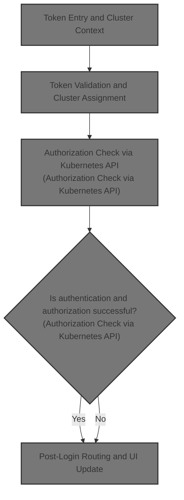
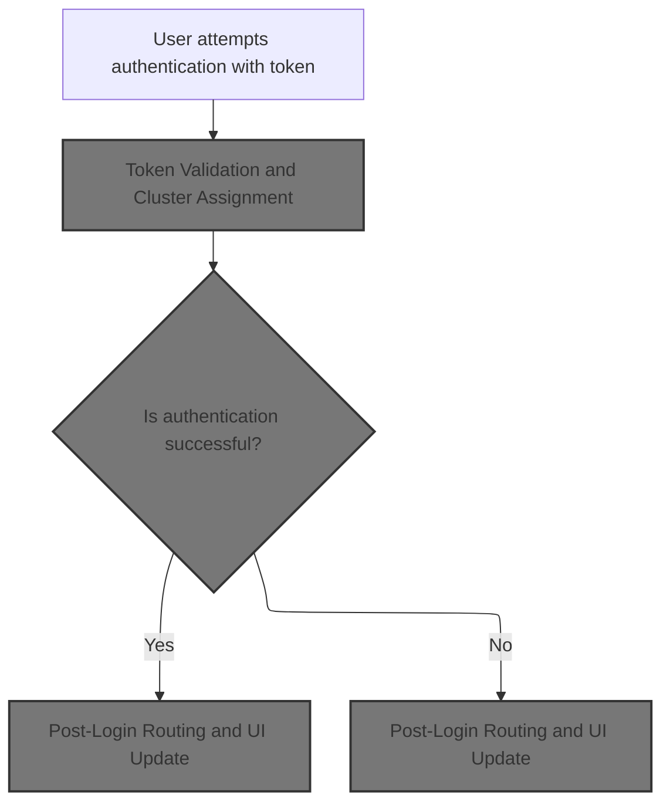

This document describes the flow for authenticating a user with a token and establishing their access to a cluster. When a user enters a token, the system validates it, determines the relevant cluster context, and checks authorization using the Kubernetes API. The interface updates to reflect the authenticated cluster, and the user is redirected if authentication succeeds; otherwise, an error is shown.



# Token Entry and Cluster Context



<SwmSnippet path="/frontend/src/components/account/Auth.tsx" line="38">

---

In <SwmToken path="frontend/src/components/account/Auth.tsx" pos="38:6:6" line-data="export default function AuthToken() {">`AuthToken`</SwmToken>, we kick off the flow by grabbing cluster configuration and cluster info using hooks. This sets up the UI to show the right title and actions depending on how many clusters are configured. The login attempt is triggered by <SwmToken path="frontend/src/components/account/Auth.tsx" pos="46:3:3" line-data="  function onAuthClicked() {">`onAuthClicked`</SwmToken>, which calls <SwmToken path="frontend/src/components/account/Auth.tsx" pos="47:1:1" line-data="    loginWithToken(token).then(code =&gt; {">`loginWithToken`</SwmToken> using the entered token. This is needed to actually try authenticating the user, and what happens next depends on the result of that call.

```tsx
export default function AuthToken() {
  const history = useHistory();
  const clusterConf = useClustersConf();
  const [token, setToken] = React.useState('');
  const [showError, setShowError] = React.useState(false);
  const clusters = useClustersConf();
  const { t } = useTranslation();

  function onAuthClicked() {
    loginWithToken(token).then(code => {
```

---

</SwmSnippet>

## Token Validation and Cluster Assignment

```mermaid
%%{init: {"flowchart": {"defaultRenderer": "elk"}} }%%
flowchart TD
  node1["User attempts login with token"] --> node2{"Is system (cluster) available?"}
  click node1 openCode "frontend/src/components/account/Auth.tsx:201:202"
  click node2 openCode "frontend/src/components/account/Auth.tsx:203:204"
  node2 -->|"No"| node3["Return: System not ready"]
  click node3 openCode "frontend/src/components/account/Auth.tsx:205:207"
  node2 -->|"Yes"| node4["Register token for authentication"]
  click node4 openCode "frontend/src/components/account/Auth.tsx:209:209"
  node4 --> node5["Test authentication"]
  click node5 openCode "frontend/src/components/account/Auth.tsx:210:210"
  node5 --> node6{"Is authentication successful?"}
  click node6 openCode "frontend/src/components/account/Auth.tsx:211:215"
  node6 -->|"Yes"| node7["Return: Login successful"]
  click node7 openCode "frontend/src/components/account/Auth.tsx:212:213"
  node6 -->|"No"| node8["Return: Login failed"]
  click node8 openCode "frontend/src/components/account/Auth.tsx:214:215"

classDef HeadingStyle fill:#777777,stroke:#333,stroke-width:2px;

%% Swimm:
%% %%{init: {"flowchart": {"defaultRenderer": "elk"}} }%%
%% flowchart TD
%%   node1["User attempts login with token"] --> node2{"Is system (cluster) available?"}
%%   click node1 openCode "<SwmPath>[frontend/…/account/Auth.tsx](frontend/src/components/account/Auth.tsx)</SwmPath>:201:202"
%%   click node2 openCode "<SwmPath>[frontend/…/account/Auth.tsx](frontend/src/components/account/Auth.tsx)</SwmPath>:203:204"
%%   node2 -->|"No"| node3["Return: System not ready"]
%%   click node3 openCode "<SwmPath>[frontend/…/account/Auth.tsx](frontend/src/components/account/Auth.tsx)</SwmPath>:205:207"
%%   node2 -->|"Yes"| node4["Register token for authentication"]
%%   click node4 openCode "<SwmPath>[frontend/…/account/Auth.tsx](frontend/src/components/account/Auth.tsx)</SwmPath>:209:209"
%%   node4 --> node5["Test authentication"]
%%   click node5 openCode "<SwmPath>[frontend/…/account/Auth.tsx](frontend/src/components/account/Auth.tsx)</SwmPath>:210:210"
%%   node5 --> node6{"Is authentication successful?"}
%%   click node6 openCode "<SwmPath>[frontend/…/account/Auth.tsx](frontend/src/components/account/Auth.tsx)</SwmPath>:211:215"
%%   node6 -->|"Yes"| node7["Return: Login successful"]
%%   click node7 openCode "<SwmPath>[frontend/…/account/Auth.tsx](frontend/src/components/account/Auth.tsx)</SwmPath>:212:213"
%%   node6 -->|"No"| node8["Return: Login failed"]
%%   click node8 openCode "<SwmPath>[frontend/…/account/Auth.tsx](frontend/src/components/account/Auth.tsx)</SwmPath>:214:215"
%% 
%% classDef HeadingStyle fill:#777777,stroke:#333,stroke-width:2px;
```



<SwmSnippet path="/frontend/src/components/account/Auth.tsx" line="201">

---

<SwmToken path="frontend/src/components/account/Auth.tsx" pos="201:4:4" line-data="async function loginWithToken(token: string) {">`loginWithToken`</SwmToken> grabs the current cluster, sets the token for it, and then calls <SwmToken path="frontend/src/components/account/Auth.tsx" pos="210:3:3" line-data="    await testAuth();">`testAuth`</SwmToken> to check if the token is valid. The function returns different HTTP status codes based on what happens: 417 if no cluster, 200 if successful, or the error code if something fails. <SwmToken path="frontend/src/components/account/Auth.tsx" pos="210:3:3" line-data="    await testAuth();">`testAuth`</SwmToken> is next because we need to verify the token actually works before proceeding.

```tsx
async function loginWithToken(token: string) {
  try {
    const cluster = getCluster();
    if (!cluster) {
      // Expectation failed.
      return 417;
    }

    await setToken(cluster, token);
    await testAuth();

    return 200;
  } catch (err) {
    console.error(err);
    return (err as ApiError).status;
  }
}
```

---

</SwmSnippet>

## Authorization Check via Kubernetes API

```mermaid
%%{init: {"flowchart": {"defaultRenderer": "elk"}} }%%
flowchart TD
    node1{"Is a cluster specified?"}
    click node1 openCode "frontend/src/lib/k8s/api/v1/clusterApi.ts:34:36"
    node1 -->|"Yes"| node2["Use specified cluster"]
    click node2 openCode "frontend/src/lib/k8s/api/v1/clusterApi.ts:36:36"
    node1 -->|"No"| node3["Use default cluster"]
    click node3 openCode "frontend/src/lib/k8s/api/v1/clusterApi.ts:36:36"
    node2 --> node4["Prepare authorization review for namespace"]
    click node4 openCode "frontend/src/lib/k8s/api/v1/clusterApi.ts:35:35"
    node3 --> node4
    node4 --> node5["Submit authorization review request to Kubernetes"]
    click node5 openCode "frontend/src/lib/k8s/api/v1/clusterApi.ts:38:41"
    node5 --> node6["Receive authorization result"]
    click node6 openCode "frontend/src/lib/k8s/api/v1/clusterApi.ts:38:42"

classDef HeadingStyle fill:#777777,stroke:#333,stroke-width:2px;

%% Swimm:
%% %%{init: {"flowchart": {"defaultRenderer": "elk"}} }%%
%% flowchart TD
%%     node1{"Is a cluster specified?"}
%%     click node1 openCode "<SwmPath>[frontend/…/v1/clusterApi.ts](frontend/src/lib/k8s/api/v1/clusterApi.ts)</SwmPath>:34:36"
%%     node1 -->|"Yes"| node2["Use specified cluster"]
%%     click node2 openCode "<SwmPath>[frontend/…/v1/clusterApi.ts](frontend/src/lib/k8s/api/v1/clusterApi.ts)</SwmPath>:36:36"
%%     node1 -->|"No"| node3["Use default cluster"]
%%     click node3 openCode "<SwmPath>[frontend/…/v1/clusterApi.ts](frontend/src/lib/k8s/api/v1/clusterApi.ts)</SwmPath>:36:36"
%%     node2 --> node4["Prepare authorization review for namespace"]
%%     click node4 openCode "<SwmPath>[frontend/…/v1/clusterApi.ts](frontend/src/lib/k8s/api/v1/clusterApi.ts)</SwmPath>:35:35"
%%     node3 --> node4
%%     node4 --> node5["Submit authorization review request to Kubernetes"]
%%     click node5 openCode "<SwmPath>[frontend/…/v1/clusterApi.ts](frontend/src/lib/k8s/api/v1/clusterApi.ts)</SwmPath>:38:41"
%%     node5 --> node6["Receive authorization result"]
%%     click node6 openCode "<SwmPath>[frontend/…/v1/clusterApi.ts](frontend/src/lib/k8s/api/v1/clusterApi.ts)</SwmPath>:38:42"
%% 
%% classDef HeadingStyle fill:#777777,stroke:#333,stroke-width:2px;
```



<SwmSnippet path="/frontend/src/lib/k8s/api/v1/clusterApi.ts" line="34">

---

<SwmToken path="frontend/src/lib/k8s/api/v1/clusterApi.ts" pos="34:6:6" line-data="export async function testAuth(cluster = &#39;&#39;, namespace = &#39;default&#39;) {">`testAuth`</SwmToken> builds a spec with the namespace, figures out which cluster to use, and sends a post request to the Kubernetes selfsubjectrulesreviews endpoint. This checks if the token is authorized for the cluster and namespace. The post function is called next to actually send the request to the API.

```typescript
export async function testAuth(cluster = '', namespace = 'default') {
  const spec = { namespace };
  const clusterName = cluster || getCluster();

  return post('/apis/authorization.k8s.io/v1/selfsubjectrulesreviews', { spec }, false, {
    timeout: 5 * 1000,
    cluster: clusterName,
  });
}
```

---

</SwmSnippet>

<SwmSnippet path="/frontend/src/lib/k8s/api/v1/clusterRequests.ts" line="225">

---

<SwmToken path="frontend/src/lib/k8s/api/v1/clusterRequests.ts" pos="225:4:4" line-data="export function post(">`post`</SwmToken> figures out which cluster to target from the options or defaults, stringifies the payload, and merges all relevant options before sending the request with <SwmToken path="frontend/src/lib/k8s/api/v1/clusterRequests.ts" pos="234:3:3" line-data="  return clusterRequest(url, {">`clusterRequest`</SwmToken>. This lets us send POST requests to the right cluster and handle auth errors if needed.

```typescript
export function post(
  url: string,
  json: JSON | object | KubeObjectInterface,
  autoLogoutOnAuthError: boolean = true,
  options: ClusterRequestParams = {}
) {
  const { cluster: clusterName, ...requestOptions } = options;
  const body = JSON.stringify(json);
  const cluster = clusterName || getCluster() || '';
  return clusterRequest(url, {
    method: 'POST',
    body,
    headers: JSON_HEADERS,
    cluster,
    autoLogoutOnAuthError,
    ...requestOptions,
  });
}
```

---

</SwmSnippet>

## Post-Login Routing and UI Update

<SwmSnippet path="/frontend/src/components/account/Auth.tsx" line="48">

---

Back in <SwmToken path="frontend/src/components/account/Auth.tsx" pos="38:6:6" line-data="export default function AuthToken() {">`AuthToken`</SwmToken>, after <SwmToken path="frontend/src/components/account/Auth.tsx" pos="47:1:1" line-data="    loginWithToken(token).then(code =&gt; {">`loginWithToken`</SwmToken> returns, we check the status code. If it's 200, we redirect the user to the cluster-specific route. If not, we clear the token and show an error. The UI also updates the title and actions depending on how many clusters are configured, so users see the right context.

```tsx
      // If successful, redirect.
      if (code === 200) {
        history.replace(
          generatePath(getClusterPrefixedPath(), {
            cluster: getCluster() as string,
          })
        );
      } else {
        setToken('');
        setShowError(true);
      }
    });
  }

  return (
    <PureAuthToken
      onCancel={() => history.replace('/')}
      title={
        Object.keys(clusterConf || {}).length > 1
          ? t('Authentication: {{ clusterName }}', { clusterName: getCluster() })
          : t('Authentication')
      }
      token={token}
      showError={showError}
      showActions={Object.keys(clusters || {}).length > 1}
      onChangeToken={(event: React.ChangeEvent<HTMLInputElement>) => setToken(event.target.value)}
      onAuthClicked={onAuthClicked}
      onCloseError={() => {
        setShowError(false);
      }}
    />
  );
}
```

---

</SwmSnippet>

&nbsp;

*This is an auto-generated document by Swimm 🌊 and has not yet been verified by a human*

<SwmMeta version="3.0.0" repo-id="Z2l0aHViJTNBJTNBdHlwZXNjcmlwdC1oZWFkbGFtcCUzQSUzQXJpY2FyZG9sb3Blemc=" repo-name="typescript-headlamp"><sup>Powered by [Swimm](https://app.swimm.io/)</sup></SwmMeta>
