This document describes the flow for logging in with a token. Token-based login allows users to authenticate and gain access to cluster resources by providing a token. The system checks for an available cluster and verifies the user's permissions using the provided token.


# Where is this flow used?

This flow is used multiple times in the codebase as represented in the following diagram:

```mermaid
graph TD;
      7071df105802ada928e6f2dc24a0786c5eb20f9ea01b03eec196281089daa938(frontend/…/account/Auth.tsx::AuthToken) --> 7c233e049e1faaf21b52f91b1abc7ea25a4700a287ada68bc537787f3d4d7bff(frontend/…/account/Auth.tsx::loginWithToken):::mainFlowStyle

2ed809f7c2bc7c95aea13195a74a179ce3364cdb9d3761f99faabd4d8b99ee92(frontend/…/account/Auth.tsx::onAuthClicked) --> 7c233e049e1faaf21b52f91b1abc7ea25a4700a287ada68bc537787f3d4d7bff(frontend/…/account/Auth.tsx::loginWithToken):::mainFlowStyle


classDef mainFlowStyle color:#000000,fill:#7CB9F4
classDef rootsStyle color:#000000,fill:#00FFF4
classDef Style1 color:#000000,fill:#00FFAA
classDef Style2 color:#000000,fill:#FFFF00
classDef Style3 color:#000000,fill:#AA7CB9

%% Swimm:
%% graph TD;
%%       7071df105802ada928e6f2dc24a0786c5eb20f9ea01b03eec196281089daa938(<SwmPath>[frontend/…/account/Auth.tsx](frontend/src/components/account/Auth.tsx)</SwmPath>::<SwmToken path="frontend/src/components/account/Auth.tsx" pos="38:6:6" line-data="export default function AuthToken() {">`AuthToken`</SwmToken>) --> 7c233e049e1faaf21b52f91b1abc7ea25a4700a287ada68bc537787f3d4d7bff(<SwmPath>[frontend/…/account/Auth.tsx](frontend/src/components/account/Auth.tsx)</SwmPath>::<SwmToken path="frontend/src/components/account/Auth.tsx" pos="201:4:4" line-data="async function loginWithToken(token: string) {">`loginWithToken`</SwmToken>):::mainFlowStyle
%% 
%% 2ed809f7c2bc7c95aea13195a74a179ce3364cdb9d3761f99faabd4d8b99ee92(<SwmPath>[frontend/…/account/Auth.tsx](frontend/src/components/account/Auth.tsx)</SwmPath>::<SwmToken path="frontend/src/components/account/Auth.tsx" pos="46:3:3" line-data="  function onAuthClicked() {">`onAuthClicked`</SwmToken>) --> 7c233e049e1faaf21b52f91b1abc7ea25a4700a287ada68bc537787f3d4d7bff(<SwmPath>[frontend/…/account/Auth.tsx](frontend/src/components/account/Auth.tsx)</SwmPath>::<SwmToken path="frontend/src/components/account/Auth.tsx" pos="201:4:4" line-data="async function loginWithToken(token: string) {">`loginWithToken`</SwmToken>):::mainFlowStyle
%% 
%% 
%% classDef mainFlowStyle color:#000000,fill:#7CB9F4
%% classDef rootsStyle color:#000000,fill:#00FFF4
%% classDef Style1 color:#000000,fill:#00FFAA
%% classDef Style2 color:#000000,fill:#FFFF00
%% classDef Style3 color:#000000,fill:#AA7CB9
```



# Token-Based Login Entry Point


<SwmSnippet path="/frontend/src/components/account/Auth.tsx" line="201">

---

LoginWithToken kicks off the login flow by checking for a cluster, setting the token for that cluster, and then immediately verifying the token's validity with <SwmToken path="frontend/src/components/account/Auth.tsx" pos="210:3:3" line-data="    await testAuth();">`testAuth`</SwmToken>. Returning 200 or 417 is just standard HTTP signaling for success or missing cluster. We call <SwmToken path="frontend/src/components/account/Auth.tsx" pos="210:3:3" line-data="    await testAuth();">`testAuth`</SwmToken> next to confirm the token works for the cluster context, not just that it was set.

```tsx
async function loginWithToken(token: string) {
  try {
    const cluster = getCluster();
    if (!cluster) {
      // Expectation failed.
      return 417;
    }

    await setToken(cluster, token);
    await testAuth();

    return 200;
  } catch (err) {
    console.error(err);
    return (err as ApiError).status;
  }
}
```

---

</SwmSnippet>

# Token Verification via Cluster API


<SwmSnippet path="/frontend/src/lib/k8s/api/v1/clusterApi.ts" line="34">

---

TestAuth sends a POST to the Kubernetes selfsubjectrulesreviews endpoint to check what the token can actually do in the cluster. It uses <SwmToken path="frontend/src/lib/k8s/api/v1/clusterApi.ts" pos="36:11:11" line-data="  const clusterName = cluster || getCluster();">`getCluster`</SwmToken> to figure out which cluster to target if none is specified, and sets a 5 second timeout to avoid hanging. The next step is calling post in <SwmToken path="frontend/src/lib/k8s/api/v1/clusterApi.ts" pos="26:14:14" line-data="import type { ClusterRequest } from &#39;./clusterRequests&#39;;">`clusterRequests`</SwmToken> to actually send the request.

```typescript
export async function testAuth(cluster = '', namespace = 'default') {
  const spec = { namespace };
  const clusterName = cluster || getCluster();

  return post('/apis/authorization.k8s.io/v1/selfsubjectrulesreviews', { spec }, false, {
    timeout: 5 * 1000,
    cluster: clusterName,
  });
}
```

---

</SwmSnippet>

<SwmSnippet path="/frontend/src/lib/k8s/api/v1/clusterRequests.ts" line="225">

---

Post wraps up the request logic by merging defaults and custom options, stringifying the payload, and picking the cluster context. It then hands everything off to <SwmToken path="frontend/src/lib/k8s/api/v1/clusterRequests.ts" pos="234:3:3" line-data="  return clusterRequest(url, {">`clusterRequest`</SwmToken>, which actually sends the HTTP POST. <SwmToken path="frontend/src/lib/k8s/api/v1/clusterRequests.ts" pos="228:1:1" line-data="  autoLogoutOnAuthError: boolean = true,">`autoLogoutOnAuthError`</SwmToken> is set to true by default, so failed auth will log the user out automatically.

```typescript
export function post(
  url: string,
  json: JSON | object | KubeObjectInterface,
  autoLogoutOnAuthError: boolean = true,
  options: ClusterRequestParams = {}
) {
  const { cluster: clusterName, ...requestOptions } = options;
  const body = JSON.stringify(json);
  const cluster = clusterName || getCluster() || '';
  return clusterRequest(url, {
    method: 'POST',
    body,
    headers: JSON_HEADERS,
    cluster,
    autoLogoutOnAuthError,
    ...requestOptions,
  });
}
```

---

</SwmSnippet>

&nbsp;

*This is an auto-generated document by Swimm 🌊 and has not yet been verified by a human*

<SwmMeta version="3.0.0" repo-id="Z2l0aHViJTNBJTNBdHlwZXNjcmlwdC1oZWFkbGFtcCUzQSUzQXJpY2FyZG9sb3Blemc=" repo-name="typescript-headlamp"><sup>Powered by [Swimm](https://app.swimm.io/)</sup></SwmMeta>
