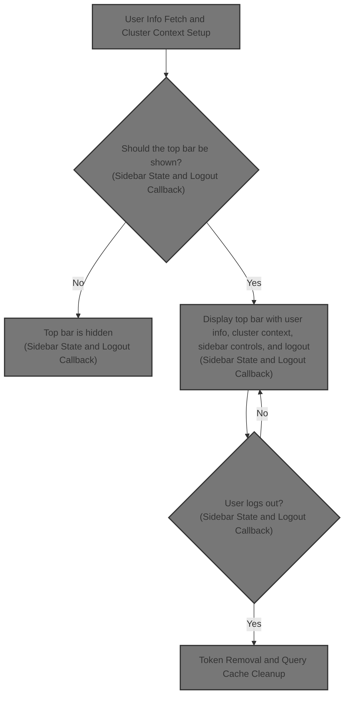

This document describes how the top navigation bar is displayed, giving users access to their account information, current cluster, sidebar controls, and logout. The flow gathers cluster and user info, adapts sidebar state for different screen sizes, and clears the session on logout.



# User Info Fetch and Cluster Context Setup

<SwmSnippet path="/frontend/src/components/App/TopBar.tsx" line="77">

---

In <SwmToken path="frontend/src/components/App/TopBar.tsx" pos="77:6:6" line-data="export default function TopBar({}: TopBarProps) {">`TopBar`</SwmToken>, we kick off the flow by grabbing cluster config, cluster name, sidebar/UI state, and then use a custom <SwmToken path="frontend/src/components/App/TopBar.tsx" pos="93:14:14" line-data="  const { data: me } = useQuery&lt;{ username?: string; email?: string } | null&gt;({">`useQuery`</SwmToken> to fetch user info. The query first calls <SwmToken path="frontend/src/components/App/TopBar.tsx" pos="101:9:9" line-data="        const res = await clusterRequest(&#39;/me&#39;, {">`clusterRequest`</SwmToken> to '/me' for basic info, but if the response has a <SwmToken path="frontend/src/components/App/TopBar.tsx" pos="110:10:10" line-data="        if (!(typeof res.userInfoURL === &#39;string&#39; &amp;&amp; res.userInfoURL.length &gt; 0)) {">`userInfoURL`</SwmToken>, we fetch that for more details. This fallback logic covers clusters that return user info in different formats. We need to call <SwmToken path="frontend/src/components/App/TopBar.tsx" pos="101:9:9" line-data="        const res = await clusterRequest(&#39;/me&#39;, {">`clusterRequest`</SwmToken> next because it's the entry point for cluster-aware API requests, handling cluster-specific headers and authentication.

```tsx
export default function TopBar({}: TopBarProps) {
  const dispatch = useDispatch();
  const isMedium = useMediaQuery('(max-width:960px)');

  const isSidebarOpen = useTypedSelector(state => state.sidebar.isSidebarOpen);
  const isSidebarOpenUserSelected = useTypedSelector(
    state => state.sidebar.isSidebarOpenUserSelected
  );
  const hideAppBar = useTypedSelector(state => state.ui.hideAppBar);

  const clustersConfig = useClustersConf();
  const cluster = useCluster();
  const history = useHistory();
  const { appBarActions, appBarActionsProcessors } = useAppBarActionsProcessed();
  const queryClient = useQueryClient();
  const clusterName = cluster ?? undefined;
  const { data: me } = useQuery<{ username?: string; email?: string } | null>({
    queryKey: ['clusterMe', clusterName],
    queryFn: async () => {
      if (!clusterName) {
        return null;
      }

      try {
        const res = await clusterRequest('/me', {
          cluster: clusterName,
          autoLogoutOnAuthError: false,
        });

        if (!res) {
          return null;
        }

        if (!(typeof res.userInfoURL === 'string' && res.userInfoURL.length > 0)) {
          return { username: res.username, email: res.email };
        }

        const ui: {
          preferredUsername?: string;
          email?: string;
        } = await fetch(res.userInfoURL, {
          credentials: 'include',
          headers: {
            'Content-Type': 'application/json',
          },
        }).then(r => {
          if (!r.ok) {
            throw new Error(`Could not fetch user info from ${res.userInfoURL}`);
          }
          return r.json();
        });

        if (!ui || (!ui.preferredUsername && !ui.email)) {
          return null;
        }

        return {
          username: ui.preferredUsername,
          email: ui.email,
        };
      } catch {
        return null;
      }
    },
    enabled: Boolean(clusterName),
    staleTime: 0,
    refetchOnMount: 'always',
  });

```

---

</SwmSnippet>

## Cluster-Aware API Request and Auth Handling

```mermaid
%%{init: {"flowchart": {"defaultRenderer": "elk"}} }%%
flowchart TD
    node1["Send request to cluster"] --> node2{"Backend requests reload?"}
    click node1 openCode "frontend/src/lib/k8s/api/v1/clusterRequests.ts:122:170"
    node2 -->|"Yes"| node3["Token Removal and Query Cache Cleanup"]
    click node2 openCode "frontend/src/lib/k8s/api/v1/clusterRequests.ts:185:188"
    node2 -->|"No"| node4{"Request successful?"}
    click node4 openCode "frontend/src/lib/k8s/api/v1/clusterRequests.ts:190:216"
    node4 -->|"Yes"| node5{"Return JSON or raw response?"}
    
    node5 -->|"JSON"| node6["Return parsed JSON data"]
    click node6 openCode "frontend/src/lib/k8s/api/v1/clusterRequests.ts:222:223"
    node5 -->|"Not JSON"| node7["Return raw response"]
    click node7 openCode "frontend/src/lib/k8s/api/v1/clusterRequests.ts:219:220"
    node4 -->|"No"| node8{"Auth error and auto-logout?"}
    click node8 openCode "frontend/src/lib/k8s/api/v1/clusterRequests.ts:192:195"
    node8 -->|"Yes"| node9["Log out user"]
    click node9 openCode "frontend/src/lib/auth.ts:131:132"
    node8 -->|"No"| node10["Return error to user"]
    click node10 openCode "frontend/src/lib/k8s/api/v1/clusterRequests.ts:197:216"

classDef HeadingStyle fill:#777777,stroke:#333,stroke-width:2px;
click node5 goToHeading "Error Message Construction and Response Parsing"
node5:::HeadingStyle
click node3 goToHeading "Token Removal and Query Cache Cleanup"
node3:::HeadingStyle

%% Swimm:
%% %%{init: {"flowchart": {"defaultRenderer": "elk"}} }%%
%% flowchart TD
%%     node1["Send request to cluster"] --> node2{"Backend requests reload?"}
%%     click node1 openCode "<SwmPath>[frontend/…/v1/clusterRequests.ts](frontend/src/lib/k8s/api/v1/clusterRequests.ts)</SwmPath>:122:170"
%%     node2 -->|"Yes"| node3["Token Removal and Query Cache Cleanup"]
%%     click node2 openCode "<SwmPath>[frontend/…/v1/clusterRequests.ts](frontend/src/lib/k8s/api/v1/clusterRequests.ts)</SwmPath>:185:188"
%%     node2 -->|"No"| node4{"Request successful?"}
%%     click node4 openCode "<SwmPath>[frontend/…/v1/clusterRequests.ts](frontend/src/lib/k8s/api/v1/clusterRequests.ts)</SwmPath>:190:216"
%%     node4 -->|"Yes"| node5{"Return JSON or raw response?"}
%%     
%%     node5 -->|"JSON"| node6["Return parsed JSON data"]
%%     click node6 openCode "<SwmPath>[frontend/…/v1/clusterRequests.ts](frontend/src/lib/k8s/api/v1/clusterRequests.ts)</SwmPath>:222:223"
%%     node5 -->|"Not JSON"| node7["Return raw response"]
%%     click node7 openCode "<SwmPath>[frontend/…/v1/clusterRequests.ts](frontend/src/lib/k8s/api/v1/clusterRequests.ts)</SwmPath>:219:220"
%%     node4 -->|"No"| node8{"Auth error and auto-logout?"}
%%     click node8 openCode "<SwmPath>[frontend/…/v1/clusterRequests.ts](frontend/src/lib/k8s/api/v1/clusterRequests.ts)</SwmPath>:192:195"
%%     node8 -->|"Yes"| node9["Log out user"]
%%     click node9 openCode "<SwmPath>[frontend/…/lib/auth.ts](frontend/src/lib/auth.ts)</SwmPath>:131:132"
%%     node8 -->|"No"| node10["Return error to user"]
%%     click node10 openCode "<SwmPath>[frontend/…/v1/clusterRequests.ts](frontend/src/lib/k8s/api/v1/clusterRequests.ts)</SwmPath>:197:216"
%% 
%% classDef HeadingStyle fill:#777777,stroke:#333,stroke-width:2px;
%% click node5 goToHeading "Error Message Construction and Response Parsing"
%% node5:::HeadingStyle
%% click node3 goToHeading "Token Removal and Query Cache Cleanup"
%% node3:::HeadingStyle
```



<SwmSnippet path="/frontend/src/lib/k8s/api/v1/clusterRequests.ts" line="122">

---

In <SwmToken path="frontend/src/lib/k8s/api/v1/clusterRequests.ts" pos="122:6:6" line-data="export async function clusterRequest(">`clusterRequest`</SwmToken>, we build a cluster-aware API request, adding kubeconfig and user ID headers if a cluster is specified. We use <SwmToken path="frontend/src/lib/k8s/api/v1/clusterRequests.ts" pos="157:9:9" line-data="  const controller = new AbortController();">`AbortController`</SwmToken> to enforce a timeout, and after the fetch, check for the <SwmToken path="frontend/src/lib/k8s/api/v1/clusterRequests.ts" pos="185:14:16" line-data="  const headerVal = response.headers.get(&#39;X-Reload&#39;);">`X-Reload`</SwmToken> header to possibly reload the page. If we get a 401 and used Authorization, we call logout to clear the user's session. Next, we need to call <SwmPath>[frontend/…/lib/auth.ts](frontend/src/lib/auth.ts)</SwmPath> to actually perform the logout and clean up tokens and cached queries.

```typescript
export async function clusterRequest(
  path: string,
  params: ClusterRequestParams = {},
  queryParams?: QueryParameters
): Promise<any> {
  interface RequestHeaders {
    Authorization?: string;
    cluster?: string;
    autoLogoutOnAuthError?: boolean;
    [otherHeader: string]: any;
  }

  const {
    timeout = DEFAULT_TIMEOUT,
    cluster: paramsCluster,
    autoLogoutOnAuthError = true,
    isJSON = true,
    ...otherParams
  } = params;

  const userID = getUserIdFromLocalStorage();
  const opts: { headers: RequestHeaders } = Object.assign({ headers: {} }, otherParams);
  const cluster = paramsCluster || '';

  let fullPath = path;
  if (cluster) {
    const kubeconfig = await findKubeconfigByClusterName(cluster);
    if (kubeconfig !== null) {
      opts.headers['KUBECONFIG'] = kubeconfig;
      opts.headers['X-HEADLAMP-USER-ID'] = userID;
    }

    fullPath = combinePath(`/${CLUSTERS_PREFIX}/${cluster}`, path);
  }

  const controller = new AbortController();
  const id = setTimeout(() => controller.abort(), timeout);

  let url = combinePath(getAppUrl(), fullPath);
  url += asQuery(queryParams);
  const requestData = {
    signal: controller.signal,
    credentials: 'include' as RequestCredentials,
    ...opts,
  };
  if (isBackstage()) {
    requestData.headers = addBackstageAuthHeaders(requestData.headers);
  }
  let response: Response = new Response(undefined, { status: 502, statusText: 'Unreachable' });
  try {
    response = await fetch(url, requestData);
  } catch (err) {
    if (err instanceof Error) {
      if (err.name === 'AbortError') {
        response = new Response(undefined, { status: 408, statusText: 'Request timed-out' });
      }
    }
  } finally {
    clearTimeout(id);
  }

  // The backend signals through this header that it wants a reload.
  // See plugins.go
  const headerVal = response.headers.get('X-Reload');
  if (headerVal && headerVal.indexOf('reload') !== -1) {
    window.location.reload();
  }

  if (!response.ok) {
    const { status, statusText } = response;
    if (autoLogoutOnAuthError && status === 401 && opts.headers.Authorization) {
      console.error('Logging out due to auth error', { status, statusText, path });
      logout(cluster);
    }

```

---

</SwmSnippet>

### Token Removal and Query Cache Cleanup

<SwmSnippet path="/frontend/src/lib/auth.ts" line="131">

---

<SwmToken path="frontend/src/lib/auth.ts" pos="131:6:6" line-data="export async function logout(cluster: string) {">`logout`</SwmToken> calls <SwmToken path="frontend/src/lib/auth.ts" pos="132:3:3" line-data="  return setToken(cluster, null).then(() =&gt; {">`setToken`</SwmToken> with null to clear the token for the cluster, then removes cached queries for 'auth' and <SwmToken path="frontend/src/lib/auth.ts" pos="134:12:12" line-data="    queryClient.removeQueries({ queryKey: [&#39;clusterMe&#39;, cluster], exact: true });">`clusterMe`</SwmToken> to make sure no stale user info is shown. We need to call <SwmToken path="frontend/src/lib/auth.ts" pos="132:3:3" line-data="  return setToken(cluster, null).then(() =&gt; {">`setToken`</SwmToken> next to actually clear the token and handle cache updates.

```typescript
export async function logout(cluster: string) {
  return setToken(cluster, null).then(() => {
    queryClient.removeQueries({ queryKey: ['auth'], exact: false });
    queryClient.removeQueries({ queryKey: ['clusterMe', cluster], exact: true });
  });
}
```

---

</SwmSnippet>

### Token Store Update and Cache Invalidation

```mermaid
%%{init: {"flowchart": {"defaultRenderer": "elk"}} }%%
flowchart TD
    node1["Update authentication token for a cluster"] --> node2{"Is a custom token setter provided?"}
    click node1 openCode "frontend/src/lib/auth.ts:108:123"
    node2 -->|"Yes"| node3["Use custom token setter for cluster and token"]
    click node2 openCode "frontend/src/lib/auth.ts:110:112"
    node2 -->|"No"| node4["Set token using default method for cluster"]
    click node3 openCode "frontend/src/lib/auth.ts:111:111"
    click node4 openCode "frontend/src/lib/auth.ts:114:122"
    node4 --> node5{"Is token present (set)?"}
    click node5 openCode "frontend/src/lib/auth.ts:115:119"
    node5 -->|"Yes"| node6["Refresh user session cache for cluster"]
    click node6 openCode "frontend/src/lib/auth.ts:116:116"
    node5 -->|"No"| node7["Remove user session cache for cluster"]
    click node7 openCode "frontend/src/lib/auth.ts:118:118"
    node6 --> node8["Return result"]
    node7 --> node8
    node3 --> node8["Return result"]
    click node8 openCode "frontend/src/lib/auth.ts:121:122"
classDef HeadingStyle fill:#777777,stroke:#333,stroke-width:2px;

%% Swimm:
%% %%{init: {"flowchart": {"defaultRenderer": "elk"}} }%%
%% flowchart TD
%%     node1["Update authentication token for a cluster"] --> node2{"Is a custom token setter provided?"}
%%     click node1 openCode "<SwmPath>[frontend/…/lib/auth.ts](frontend/src/lib/auth.ts)</SwmPath>:108:123"
%%     node2 -->|"Yes"| node3["Use custom token setter for cluster and token"]
%%     click node2 openCode "<SwmPath>[frontend/…/lib/auth.ts](frontend/src/lib/auth.ts)</SwmPath>:110:112"
%%     node2 -->|"No"| node4["Set token using default method for cluster"]
%%     click node3 openCode "<SwmPath>[frontend/…/lib/auth.ts](frontend/src/lib/auth.ts)</SwmPath>:111:111"
%%     click node4 openCode "<SwmPath>[frontend/…/lib/auth.ts](frontend/src/lib/auth.ts)</SwmPath>:114:122"
%%     node4 --> node5{"Is token present (set)?"}
%%     click node5 openCode "<SwmPath>[frontend/…/lib/auth.ts](frontend/src/lib/auth.ts)</SwmPath>:115:119"
%%     node5 -->|"Yes"| node6["Refresh user session cache for cluster"]
%%     click node6 openCode "<SwmPath>[frontend/…/lib/auth.ts](frontend/src/lib/auth.ts)</SwmPath>:116:116"
%%     node5 -->|"No"| node7["Remove user session cache for cluster"]
%%     click node7 openCode "<SwmPath>[frontend/…/lib/auth.ts](frontend/src/lib/auth.ts)</SwmPath>:118:118"
%%     node6 --> node8["Return result"]
%%     node7 --> node8
%%     node3 --> node8["Return result"]
%%     click node8 openCode "<SwmPath>[frontend/…/lib/auth.ts](frontend/src/lib/auth.ts)</SwmPath>:121:122"
%% classDef HeadingStyle fill:#777777,stroke:#333,stroke-width:2px;
```



<SwmSnippet path="/frontend/src/lib/auth.ts" line="108">

---

<SwmToken path="frontend/src/lib/auth.ts" pos="108:4:4" line-data="export function setToken(cluster: string, token: string | null) {">`setToken`</SwmToken> first checks for a custom override for token storage. If none is set, it calls <SwmToken path="frontend/src/lib/auth.ts" pos="114:3:3" line-data="  return setCookieToken(cluster, token).then(result =&gt; {">`setCookieToken`</SwmToken> to update the token in cookies. After that, it either invalidates or removes cached queries for the cluster depending on whether the token is set or cleared. Next, <SwmToken path="frontend/src/lib/auth.ts" pos="114:3:3" line-data="  return setCookieToken(cluster, token).then(result =&gt; {">`setCookieToken`</SwmToken> is called to handle the actual cookie update and backend sync.

```typescript
export function setToken(cluster: string, token: string | null) {
  const setTokenMethodToUse = store.getState().ui.functionsToOverride.setToken;
  if (setTokenMethodToUse) {
    return Promise.resolve(setTokenMethodToUse(cluster, token));
  }

  return setCookieToken(cluster, token).then(result => {
    if (token) {
      queryClient.invalidateQueries({ queryKey: ['clusterMe', cluster], exact: true });
    } else {
      queryClient.removeQueries({ queryKey: ['clusterMe', cluster], exact: true });
    }

    return result;
  });
}
```

---

</SwmSnippet>

### Backend Token Sync and Error Handling

<SwmSnippet path="/frontend/src/lib/auth.ts" line="79">

---

<SwmToken path="frontend/src/lib/auth.ts" pos="79:4:4" line-data="async function setCookieToken(cluster: string, token: string | null) {">`setCookieToken`</SwmToken> sends the token to the backend using <SwmToken path="frontend/src/lib/auth.ts" pos="81:9:9" line-data="    const response = await backendFetch(`/clusters/${cluster}/set-token`, {">`backendFetch`</SwmToken>, which POSTs to the cluster's <SwmToken path="frontend/src/lib/auth.ts" pos="81:18:20" line-data="    const response = await backendFetch(`/clusters/${cluster}/set-token`, {">`set-token`</SwmToken> endpoint with the token in the body and custom headers. If the backend rejects the request, we throw an error. Next, <SwmToken path="frontend/src/lib/auth.ts" pos="81:9:9" line-data="    const response = await backendFetch(`/clusters/${cluster}/set-token`, {">`backendFetch`</SwmToken> is called to handle the actual network request and response parsing.

```typescript
async function setCookieToken(cluster: string, token: string | null) {
  try {
    const response = await backendFetch(`/clusters/${cluster}/set-token`, {
      method: 'POST',
      headers: {
        'Content-Type': 'application/json',
        ...getHeadlampAPIHeaders(),
      },
      body: JSON.stringify({ token }),
    });

    if (!response.ok) {
      throw new Error(`Failed to set cookie token`);
    }
    return true;
  } catch (error) {
    console.error('Error setting cookie token:', error);
    throw error;
  }
}
```

---

</SwmSnippet>

<SwmSnippet path="/frontend/src/lib/k8s/api/v2/fetch.ts" line="38">

---

<SwmToken path="frontend/src/lib/k8s/api/v2/fetch.ts" pos="38:6:6" line-data="export async function backendFetch(url: string | URL, init: RequestInit = {}) {">`backendFetch`</SwmToken> builds the full backend URL, adds credentials and custom auth headers, and sends the request. After the response, it checks for <SwmToken path="frontend/src/lib/k8s/api/v2/fetch.ts" pos="46:14:16" line-data="  const headerVal = response.headers.get(&#39;X-Reload&#39;);">`X-Reload`</SwmToken> to possibly reload the page. If the response isn't OK, it tries to parse the error message from JSON and throws an <SwmToken path="frontend/src/lib/k8s/api/v2/fetch.ts" pos="59:5:5" line-data="    throw new ApiError(maybeErrorMessage ?? &#39;Unreachable&#39;, { status: response.status });">`ApiError`</SwmToken>. This function is called by <SwmToken path="frontend/src/lib/auth.ts" pos="79:4:4" line-data="async function setCookieToken(cluster: string, token: string | null) {">`setCookieToken`</SwmToken> to handle backend communication and error handling.

```typescript
export async function backendFetch(url: string | URL, init: RequestInit = {}) {
  // Always include credentials
  init.credentials = 'include';
  init.headers = addBackstageAuthHeaders(init.headers);
  const response = await fetch(makeUrl([getAppUrl(), url]), init);

  // The backend signals through this header that it wants a reload.
  // See plugins.go
  const headerVal = response.headers.get('X-Reload');
  if (headerVal && headerVal.indexOf('reload') !== -1) {
    window.location.reload();
  }

  if (!response.ok) {
    // Try to parse error message from response
    let maybeErrorMessage: string | undefined;
    try {
      const body = await response.json();
      maybeErrorMessage = typeof body === 'string' ? body : body.message;
    } catch (e) {}

    throw new ApiError(maybeErrorMessage ?? 'Unreachable', { status: response.status });
  }

  return response;
}
```

---

</SwmSnippet>

### Error Message Construction and Response Parsing

```mermaid
%%{init: {"flowchart": {"defaultRenderer": "elk"}} }%%
flowchart TD
    node1["Process response status message"] --> node2{"Is response JSON?"}
    click node1 openCode "frontend/src/lib/k8s/api/v1/clusterRequests.ts:197:198"
    node2 -->|"Yes"| node3["Append error message from JSON"]
    click node2 openCode "frontend/src/lib/k8s/api/v1/clusterRequests.ts:199:201"
    node3 --> node4["Return parsed error"]
    click node4 openCode "frontend/src/lib/k8s/api/v1/clusterRequests.ts:213:215"
    node2 -->|"No"| node5["Return response as-is"]
    click node5 openCode "frontend/src/lib/k8s/api/v1/clusterRequests.ts:218:220"
    node2 -->|"Yes"| node6["Return parsed JSON"]
    click node6 openCode "frontend/src/lib/k8s/api/v1/clusterRequests.ts:222:223"

classDef HeadingStyle fill:#777777,stroke:#333,stroke-width:2px;

%% Swimm:
%% %%{init: {"flowchart": {"defaultRenderer": "elk"}} }%%
%% flowchart TD
%%     node1["Process response status message"] --> node2{"Is response JSON?"}
%%     click node1 openCode "<SwmPath>[frontend/…/v1/clusterRequests.ts](frontend/src/lib/k8s/api/v1/clusterRequests.ts)</SwmPath>:197:198"
%%     node2 -->|"Yes"| node3["Append error message from JSON"]
%%     click node2 openCode "<SwmPath>[frontend/…/v1/clusterRequests.ts](frontend/src/lib/k8s/api/v1/clusterRequests.ts)</SwmPath>:199:201"
%%     node3 --> node4["Return parsed error"]
%%     click node4 openCode "<SwmPath>[frontend/…/v1/clusterRequests.ts](frontend/src/lib/k8s/api/v1/clusterRequests.ts)</SwmPath>:213:215"
%%     node2 -->|"No"| node5["Return response as-is"]
%%     click node5 openCode "<SwmPath>[frontend/…/v1/clusterRequests.ts](frontend/src/lib/k8s/api/v1/clusterRequests.ts)</SwmPath>:218:220"
%%     node2 -->|"Yes"| node6["Return parsed JSON"]
%%     click node6 openCode "<SwmPath>[frontend/…/v1/clusterRequests.ts](frontend/src/lib/k8s/api/v1/clusterRequests.ts)</SwmPath>:222:223"
%% 
%% classDef HeadingStyle fill:#777777,stroke:#333,stroke-width:2px;
```



<SwmSnippet path="/frontend/src/lib/k8s/api/v1/clusterRequests.ts" line="197">

---

After logout in <SwmToken path="frontend/src/components/App/TopBar.tsx" pos="101:9:9" line-data="        const res = await clusterRequest(&#39;/me&#39;, {">`clusterRequest`</SwmToken>, we parse error details and reject with an <SwmToken path="frontend/src/lib/k8s/api/v1/clusterRequests.ts" pos="213:16:16" line-data="    const error = new Error(message) as ApiError;">`ApiError`</SwmToken> so the caller can handle the failure.

```typescript
    let message = statusText;
    try {
      if (isJSON) {
        const json = await response.json();
        message += ` - ${json.message}`;
      }
    } catch (err) {
      console.error(
        'Unable to parse error json at url:',
        url,
        { err },
        'with request data:',
        requestData
      );
    }

    const error = new Error(message) as ApiError;
    error.status = status;
    return Promise.reject(error);
  }

  if (!isJSON) {
    return Promise.resolve(response);
  }

  return response.json();
}
```

---

</SwmSnippet>

## Sidebar State and Logout Callback

```mermaid
%%{init: {"flowchart": {"defaultRenderer": "elk"}} }%%
flowchart TD
    node1{"Should the top bar be hidden?"}
    click node1 openCode "frontend/src/components/App/TopBar.tsx:165:167"
    node1 -->|"Yes"| node2["Do not show top bar"]
    click node2 openCode "frontend/src/components/App/TopBar.tsx:166:167"
    node1 -->|"No"| node3["Display top bar"]
    click node3 openCode "frontend/src/components/App/TopBar.tsx:168:180"
    node3 --> node4["Allow user to logout (returns to home)"]
    click node4 openCode "frontend/src/components/App/TopBar.tsx:146:152"
    node3 --> node5["Allow user to toggle sidebar open/close"]
    click node5 openCode "frontend/src/components/App/TopBar.tsx:154:163"
    node3 --> node6["Show user info and cluster context"]
    click node6 openCode "frontend/src/components/App/TopBar.tsx:176:179"
classDef HeadingStyle fill:#777777,stroke:#333,stroke-width:2px;

%% Swimm:
%% %%{init: {"flowchart": {"defaultRenderer": "elk"}} }%%
%% flowchart TD
%%     node1{"Should the top bar be hidden?"}
%%     click node1 openCode "<SwmPath>[frontend/…/App/TopBar.tsx](frontend/src/components/App/TopBar.tsx)</SwmPath>:165:167"
%%     node1 -->|"Yes"| node2["Do not show top bar"]
%%     click node2 openCode "<SwmPath>[frontend/…/App/TopBar.tsx](frontend/src/components/App/TopBar.tsx)</SwmPath>:166:167"
%%     node1 -->|"No"| node3["Display top bar"]
%%     click node3 openCode "<SwmPath>[frontend/…/App/TopBar.tsx](frontend/src/components/App/TopBar.tsx)</SwmPath>:168:180"
%%     node3 --> node4["Allow user to logout (returns to home)"]
%%     click node4 openCode "<SwmPath>[frontend/…/App/TopBar.tsx](frontend/src/components/App/TopBar.tsx)</SwmPath>:146:152"
%%     node3 --> node5["Allow user to toggle sidebar open/close"]
%%     click node5 openCode "<SwmPath>[frontend/…/App/TopBar.tsx](frontend/src/components/App/TopBar.tsx)</SwmPath>:154:163"
%%     node3 --> node6["Show user info and cluster context"]
%%     click node6 openCode "<SwmPath>[frontend/…/App/TopBar.tsx](frontend/src/components/App/TopBar.tsx)</SwmPath>:176:179"
%% classDef HeadingStyle fill:#777777,stroke:#333,stroke-width:2px;
```



<SwmSnippet path="/frontend/src/components/App/TopBar.tsx" line="146">

---

After <SwmToken path="frontend/src/components/App/TopBar.tsx" pos="101:9:9" line-data="        const res = await clusterRequest(&#39;/me&#39;, {">`clusterRequest`</SwmToken> in <SwmToken path="frontend/src/components/App/TopBar.tsx" pos="77:6:6" line-data="export default function TopBar({}: TopBarProps) {">`TopBar`</SwmToken>, we wire up logout, handle sidebar state for different screen sizes, and pass everything to <SwmToken path="frontend/src/components/App/TopBar.tsx" pos="169:2:2" line-data="    &lt;PureTopBar">`PureTopBar`</SwmToken> for rendering.

```tsx
  const logoutCallback = useCallback(async () => {
    if (!!cluster) {
      await logout(cluster);
      queryClient.removeQueries({ queryKey: ['clusterMe', cluster], exact: true });
    }
    history.push('/');
  }, [cluster, history, queryClient]);

  const handletoggleOpen = useCallback(() => {
    // For medium view we default to closed if they have not made a selection.
    // This handles the case when the user resizes the window from large to small.
    // If they have not made a selection then the window size stays the default for
    //   the size.

    const openSideBar = isMedium && isSidebarOpenUserSelected === undefined ? false : isSidebarOpen;

    dispatch(setWhetherSidebarOpen(!openSideBar));
  }, [isMedium, isSidebarOpenUserSelected, isSidebarOpen]);

  if (hideAppBar) {
    return null;
  }
  return (
    <PureTopBar
      appBarActions={appBarActions}
      appBarActionsProcessors={appBarActionsProcessors}
      logout={logoutCallback}
      isSidebarOpen={isSidebarOpen}
      isSidebarOpenUserSelected={isSidebarOpenUserSelected}
      onToggleOpen={handletoggleOpen}
      cluster={cluster || undefined}
      clusters={clustersConfig || undefined}
      userInfo={me || undefined}
    />
  );
}
```

---

</SwmSnippet>

&nbsp;

*This is an auto-generated document by Swimm 🌊 and has not yet been verified by a human*

<SwmMeta version="3.0.0" repo-id="Z2l0aHViJTNBJTNBdHlwZXNjcmlwdC1oZWFkbGFtcCUzQSUzQXJpY2FyZG9sb3Blemc=" repo-name="typescript-headlamp"><sup>Powered by [Swimm](https://app.swimm.io/)</sup></SwmMeta>
