This document explains how the application tracks the current Kubernetes cluster as users navigate. The system extracts cluster information from the URL, updates its state, and ensures all API requests and authentication are scoped to the selected cluster across different environments.

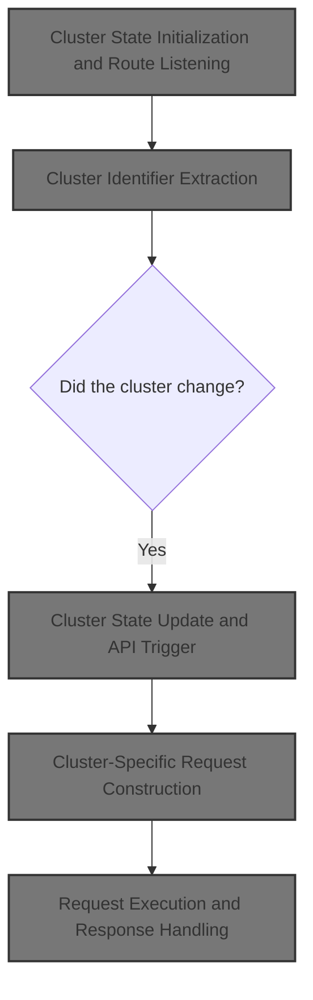

# Cluster State Initialization and Route Listening

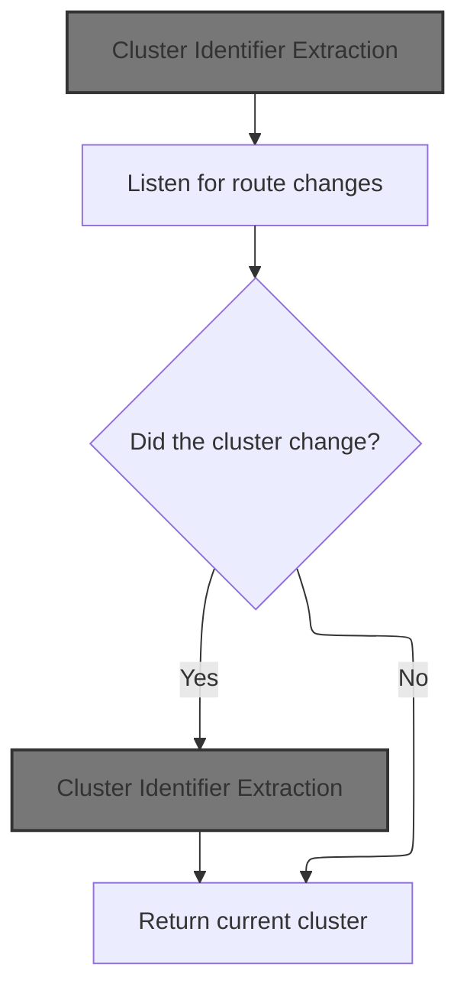

<SwmSnippet path="/frontend/src/lib/k8s/index.ts" line="142">

---

In <SwmToken path="frontend/src/lib/k8s/index.ts" pos="142:4:4" line-data="export function useCluster() {">`useCluster`</SwmToken>, we kick off by setting up a state for the current cluster and a listener for route changes. Every time the route changes, we call <SwmToken path="frontend/src/lib/k8s/index.ts" pos="145:16:16" line-data="  const [cluster, setCluster] = React.useState(getCluster());">`getCluster`</SwmToken> to extract the cluster identifier from the new URL. This keeps the cluster state up-to-date with navigation, so we need to call <SwmPath>[frontend/…/lib/cluster.ts](frontend/src/lib/cluster.ts)</SwmPath> next to actually parse the cluster info from the URL.

```typescript
export function useCluster() {
  const history = useHistory();

  const [cluster, setCluster] = React.useState(getCluster());

  React.useEffect(() => {
    // Listen to route changes
    return history.listen(() => {
      const newCluster = getCluster(history.location.pathname);
```

---

</SwmSnippet>

## Cluster Identifier Extraction

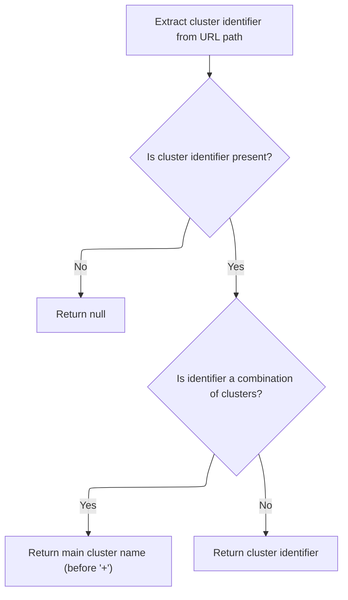

<SwmSnippet path="/frontend/src/lib/cluster.ts" line="46">

---

<SwmToken path="frontend/src/lib/cluster.ts" pos="46:4:4" line-data="export function getCluster(urlPath?: string): string | null {">`getCluster`</SwmToken> grabs the cluster string from the URL, checks for a '+' delimiter, and if present, strips off everything after it. This means only the main cluster identifier is used, ignoring any extra info. We need to call <SwmToken path="frontend/src/lib/cluster.ts" pos="47:7:7" line-data="  const clusterString = getClusterPathParam(urlPath);">`getClusterPathParam`</SwmToken> next to extract the raw cluster string from the URL.

```typescript
export function getCluster(urlPath?: string): string | null {
  const clusterString = getClusterPathParam(urlPath);
  if (!clusterString) return null;

  if (clusterString.includes('+')) {
    return clusterString.split('+')[0];
  }
  return clusterString;
}
```

---

</SwmSnippet>

## URL Path Parsing and Base URL Handling

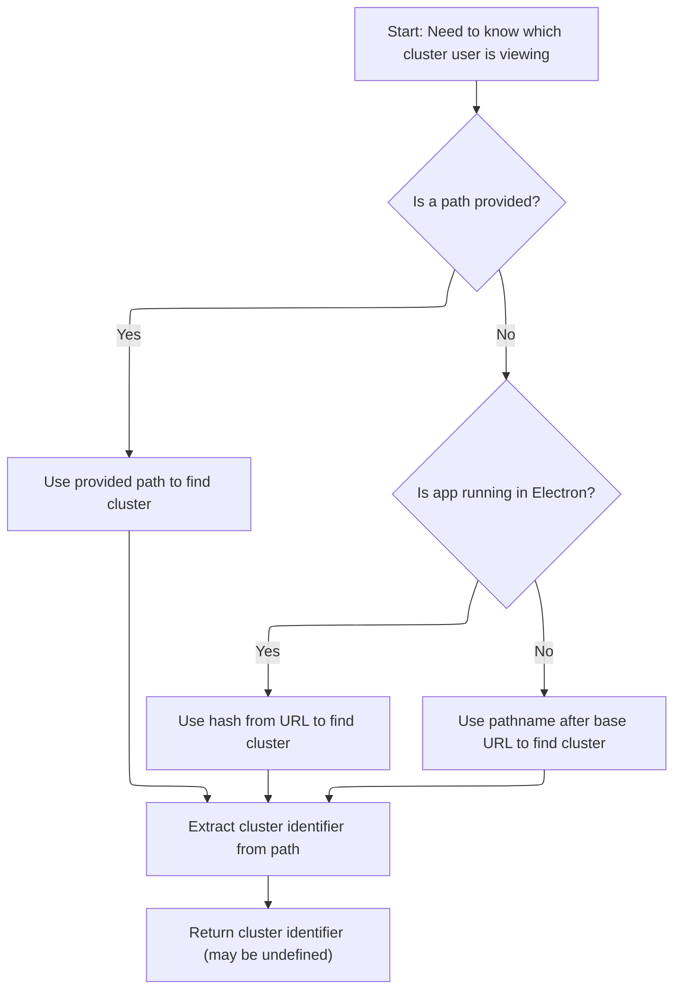

<SwmSnippet path="/frontend/src/lib/cluster.ts" line="57">

---

In <SwmToken path="frontend/src/lib/cluster.ts" pos="57:4:4" line-data="export function getClusterPathParam(maybeUrlPath?: string): string | undefined {">`getClusterPathParam`</SwmToken>, we grab the base URL so we can correctly slice the pathname and extract the cluster part. The base URL can change depending on the environment, so we call <SwmToken path="frontend/src/lib/cluster.ts" pos="58:7:7" line-data="  const prefix = getBaseUrl();">`getBaseUrl`</SwmToken> next to figure out what to strip from the path.

```typescript
export function getClusterPathParam(maybeUrlPath?: string): string | undefined {
  const prefix = getBaseUrl();
```

---

</SwmSnippet>

<SwmSnippet path="/frontend/src/helpers/getBaseUrl.ts" line="38">

---

<SwmToken path="frontend/src/helpers/getBaseUrl.ts" pos="38:4:4" line-data="export function getBaseUrl(): string {">`getBaseUrl`</SwmToken> checks if we're in Electron and returns an empty string if so. Otherwise, it looks for a global <SwmToken path="frontend/src/helpers/getBaseUrl.ts" pos="44:5:7" line-data="    baseUrl = window.headlampBaseUrl;">`window.headlampBaseUrl`</SwmToken>, falls back to <SwmToken path="frontend/src/helpers/getBaseUrl.ts" pos="46:11:11" line-data="    baseUrl = import.meta.env.PUBLIC_URL ? import.meta.env.PUBLIC_URL : &#39;&#39;;">`PUBLIC_URL`</SwmToken>, and normalizes './', '.', and '/' to empty string. This makes sure routing works the same way across environments.

```typescript
export function getBaseUrl(): string {
  let baseUrl = '';
  if (isElectron()) {
    return '';
  }
  if (window?.headlampBaseUrl !== undefined) {
    baseUrl = window.headlampBaseUrl;
  } else {
    baseUrl = import.meta.env.PUBLIC_URL ? import.meta.env.PUBLIC_URL : '';
  }

  if (baseUrl === './' || baseUrl === '.' || baseUrl === '/') {
    baseUrl = '';
  }
  return baseUrl;
}
```

---

</SwmSnippet>

<SwmSnippet path="/frontend/src/lib/cluster.ts" line="59">

---

Now that we've got the base URL from <SwmToken path="frontend/src/lib/cluster.ts" pos="58:7:7" line-data="  const prefix = getBaseUrl();">`getBaseUrl`</SwmToken>, <SwmToken path="frontend/src/lib/cluster.ts" pos="47:7:7" line-data="  const clusterString = getClusterPathParam(urlPath);">`getClusterPathParam`</SwmToken> slices the pathname accordingly (handling Electron vs browser), then uses <SwmToken path="frontend/src/lib/cluster.ts" pos="65:7:7" line-data="  const clusterURLMatch = matchPath&lt;{ cluster?: string }&gt;(urlPath, {">`matchPath`</SwmToken> to extract the cluster identifier from the URL. This makes sure cluster extraction works no matter where the app runs.

```typescript
  const urlPath =
    maybeUrlPath ??
    (isElectron()
      ? window.location.hash.substring(1)
      : window.location.pathname.slice(prefix.length));

  const clusterURLMatch = matchPath<{ cluster?: string }>(urlPath, {
    path: getClusterPrefixedPath(),
  });

  return clusterURLMatch?.params?.cluster;
}
```

---

</SwmSnippet>

## Cluster State Update and API Trigger

<SwmSnippet path="/frontend/src/lib/k8s/index.ts" line="151">

---

After getting the cluster, <SwmToken path="frontend/src/lib/k8s/index.ts" pos="142:4:4" line-data="export function useCluster() {">`useCluster`</SwmToken> updates state only if needed, then triggers clusterApi for further cluster-specific actions.

```typescript
      // Update the state only when the cluster changes
      setCluster(currentCluster => (newCluster !== currentCluster ? newCluster : currentCluster));
    });
  }, [history]);

  return cluster;
}
```

---

</SwmSnippet>

# Cluster API Request Preparation

<SwmSnippet path="/frontend/src/lib/k8s/api/v1/clusterApi.ts" line="60">

---

In <SwmToken path="frontend/src/lib/k8s/api/v1/clusterApi.ts" pos="60:6:6" line-data="export async function setCluster(clusterReq: ClusterRequest) {">`setCluster`</SwmToken>, if there's a kubeconfig, we store it and then send a request to <SwmToken path="frontend/src/lib/k8s/api/v1/clusterApi.ts" pos="68:2:3" line-data="      &#39;/parseKubeConfig&#39;,">`/parseKubeConfig`</SwmToken> with the cluster data. We call <SwmToken path="frontend/src/lib/k8s/index.ts" pos="23:16:16" line-data="import { clusterRequest } from &#39;./api/v1/clusterRequests&#39;;">`clusterRequests`</SwmToken> next to actually send the request and handle cluster-specific logic.

```typescript
export async function setCluster(clusterReq: ClusterRequest) {
  const kubeconfig = clusterReq.kubeconfig;
  const headers = addBackstageAuthHeaders(JSON_HEADERS);

  if (kubeconfig) {
    await storeStatelessClusterKubeconfig(kubeconfig);
    // We just send parsed kubeconfig from the backend to the frontend.
    return request(
      '/parseKubeConfig',
      {
        method: 'POST',
        body: JSON.stringify(clusterReq),
        headers: {
          ...headers,
        },
      },
      false,
      false
    );
  }

```

---

</SwmSnippet>

## Cluster Request Dispatch and Debug Logging

<SwmSnippet path="/frontend/src/lib/k8s/api/v1/clusterRequests.ts" line="94">

---

In <SwmToken path="frontend/src/lib/k8s/api/v1/clusterRequests.ts" pos="94:6:6" line-data="export async function request(">`request`</SwmToken>, we grab the current cluster (again) if <SwmToken path="frontend/src/lib/k8s/api/v1/clusterRequests.ts" pos="98:1:1" line-data="  useCluster: boolean = true,">`useCluster`</SwmToken> is true, so the request is scoped to the right cluster. We call <SwmToken path="frontend/src/lib/k8s/api/v1/clusterRequests.ts" pos="102:12:12" line-data="  const cluster = (useCluster &amp;&amp; getCluster()) || &#39;&#39;;">`getCluster`</SwmToken> to fetch the identifier for the request.

```typescript
export async function request(
  path: string,
  params: RequestParams = {},
  autoLogoutOnAuthError: boolean = true,
  useCluster: boolean = true,
  queryParams?: QueryParameters
): Promise<any> {
  // @todo: This is a temporary way of getting the current cluster. We should improve it later.
  const cluster = (useCluster && getCluster()) || '';

```

---

</SwmSnippet>

<SwmSnippet path="/frontend/src/lib/k8s/api/v1/clusterRequests.ts" line="104">

---

After getting the cluster, <SwmToken path="frontend/src/lib/k8s/api/v1/clusterRequests.ts" pos="104:11:11" line-data="  if (isDebugVerbose(&#39;k8s/apiProxy@request&#39;)) {">`request`</SwmToken> checks if debug logging is enabled for this module using <SwmToken path="frontend/src/lib/k8s/api/v1/clusterRequests.ts" pos="104:4:4" line-data="  if (isDebugVerbose(&#39;k8s/apiProxy@request&#39;)) {">`isDebugVerbose`</SwmToken>. If so, it logs the request details for easier troubleshooting. We call <SwmToken path="frontend/src/lib/k8s/api/v1/clusterRequests.ts" pos="20:14:14" line-data="import { isDebugVerbose } from &#39;../../../../helpers/debugVerbose&#39;;">`debugVerbose`</SwmToken> next to see if verbose logging is needed.

```typescript
  if (isDebugVerbose('k8s/apiProxy@request')) {
    console.debug('k8s/apiProxy@request', { path, params, useCluster, queryParams });
  }

```

---

</SwmSnippet>

<SwmSnippet path="/frontend/src/helpers/debugVerbose.ts" line="76">

---

<SwmToken path="frontend/src/helpers/debugVerbose.ts" pos="76:4:4" line-data="export function isDebugVerbose(modName: string): boolean {">`isDebugVerbose`</SwmToken> checks if the module name matches any substring in <SwmToken path="frontend/src/helpers/debugVerbose.ts" pos="77:4:4" line-data="  if (verboseModDebug.filter(mod =&gt; modName.indexOf(mod) &gt; 0).length &gt; 0) {">`verboseModDebug`</SwmToken> (but only if not at the start), or if the global debug env is set to 'all' or includes the module name. This controls which modules get verbose logging.

```typescript
export function isDebugVerbose(modName: string): boolean {
  if (verboseModDebug.filter(mod => modName.indexOf(mod) > 0).length > 0) {
    return true;
  }

  return (
    import.meta.env.REACT_APP_DEBUG_VERBOSE === 'all' ||
    !!(
      import.meta.env.REACT_APP_DEBUG_VERBOSE &&
      import.meta.env.REACT_APP_DEBUG_VERBOSE?.indexOf(modName) !== -1
    )
  );
}
```

---

</SwmSnippet>

<SwmSnippet path="/frontend/src/lib/k8s/api/v1/clusterRequests.ts" line="108">

---

After logging debug info, <SwmToken path="frontend/src/lib/k8s/api/v1/clusterApi.ts" pos="67:3:3" line-data="    return request(">`request`</SwmToken> hands off to <SwmToken path="frontend/src/lib/k8s/api/v1/clusterRequests.ts" pos="108:3:3" line-data="  return clusterRequest(path, { cluster, autoLogoutOnAuthError, ...params }, queryParams);">`clusterRequest`</SwmToken>, which builds and sends the actual network request using the cluster and params.

```typescript
  return clusterRequest(path, { cluster, autoLogoutOnAuthError, ...params }, queryParams);
}
```

---

</SwmSnippet>

## Cluster-Specific Request Construction

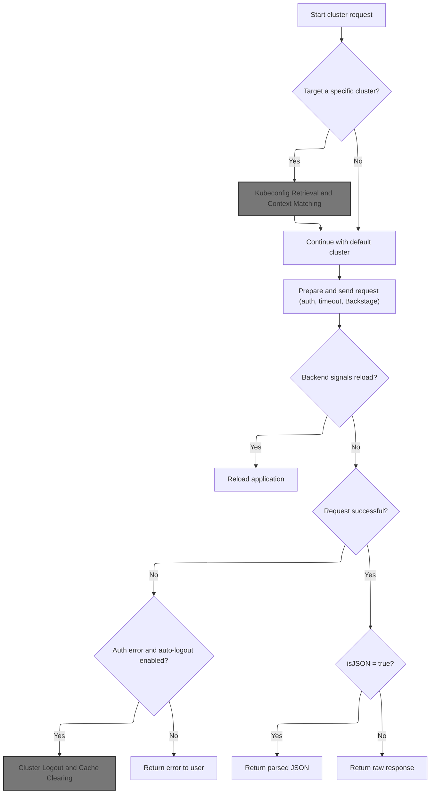

<SwmSnippet path="/frontend/src/lib/k8s/api/v1/clusterRequests.ts" line="122">

---

In <SwmToken path="frontend/src/lib/k8s/api/v1/clusterRequests.ts" pos="122:6:6" line-data="export async function clusterRequest(">`clusterRequest`</SwmToken>, we prep the request by fetching the kubeconfig for the cluster (if specified), set it and the user ID in headers, and build the cluster-specific URL. We call <SwmToken path="frontend/src/lib/k8s/api/v1/clusterRequests.ts" pos="148:9:9" line-data="    const kubeconfig = await findKubeconfigByClusterName(cluster);">`findKubeconfigByClusterName`</SwmToken> next to get the kubeconfig for the cluster.

```typescript
export async function clusterRequest(
  path: string,
  params: ClusterRequestParams = {},
  queryParams?: QueryParameters
): Promise<any> {
  interface RequestHeaders {
    Authorization?: string;
    cluster?: string;
    autoLogoutOnAuthError?: boolean;
    [otherHeader: string]: any;
  }

  const {
    timeout = DEFAULT_TIMEOUT,
    cluster: paramsCluster,
    autoLogoutOnAuthError = true,
    isJSON = true,
    ...otherParams
  } = params;

  const userID = getUserIdFromLocalStorage();
  const opts: { headers: RequestHeaders } = Object.assign({ headers: {} }, otherParams);
  const cluster = paramsCluster || '';

  let fullPath = path;
  if (cluster) {
    const kubeconfig = await findKubeconfigByClusterName(cluster);
    if (kubeconfig !== null) {
      opts.headers['KUBECONFIG'] = kubeconfig;
      opts.headers['X-HEADLAMP-USER-ID'] = userID;
    }

    fullPath = combinePath(`/${CLUSTERS_PREFIX}/${cluster}`, path);
  }

```

---

</SwmSnippet>

### Kubeconfig Retrieval and Context Matching

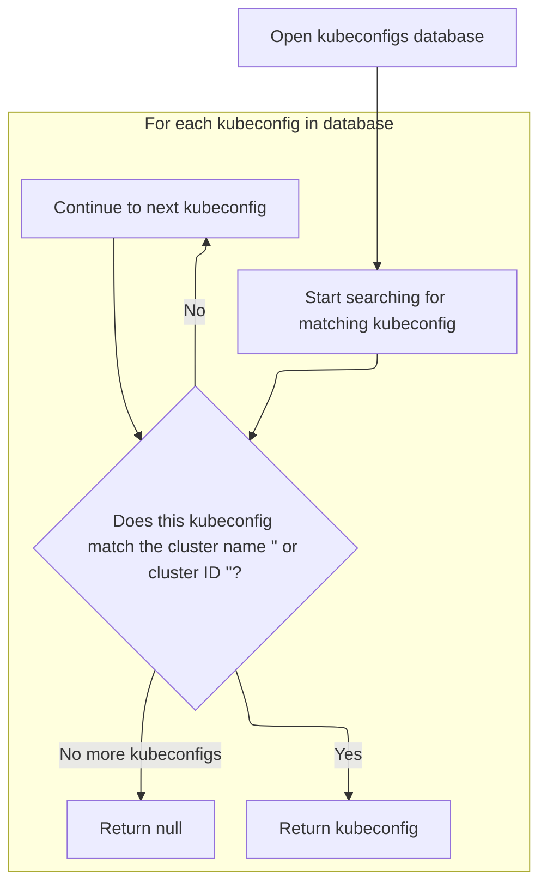

<SwmSnippet path="/frontend/src/stateless/findKubeconfigByClusterName.ts" line="36">

---

In <SwmToken path="frontend/src/stateless/findKubeconfigByClusterName.ts" pos="36:4:4" line-data="export function findKubeconfigByClusterName(">`findKubeconfigByClusterName`</SwmToken>, we open <SwmToken path="frontend/src/stateless/findKubeconfigByClusterName.ts" pos="32:10:10" line-data=" * @throws Error if IndexedDB is not supported.">`IndexedDB`</SwmToken>, iterate through all stored kubeconfigs, decode and parse each one, and call <SwmToken path="frontend/src/stateless/findKubeconfigByClusterName.ts" pos="70:14:14" line-data="            const { matchingKubeconfig, matchingContext } = findMatchingContexts(">`findMatchingContexts`</SwmToken> to see if it matches the cluster. We call <SwmToken path="frontend/src/stateless/findKubeconfigByClusterName.ts" pos="70:14:14" line-data="            const { matchingKubeconfig, matchingContext } = findMatchingContexts(">`findMatchingContexts`</SwmToken> next to check for a match.

```typescript
export function findKubeconfigByClusterName(
  /** The name of the cluster to find */
  clusterName: string,
  /** The ID for a cluster, composed of the kubeconfig path and cluster name */
  clusterID?: string
): Promise<string | null> {
  return new Promise<string | null>(async (resolve, reject) => {
    try {
      const request = indexedDB.open('kubeconfigs', 1) as any;

      // The onupgradeneeded event is fired when the database is created for the first time.
      request.onupgradeneeded = handleDatabaseUpgrade;

      // The onsuccess event is fired when the database is opened.
      // This event is where you specify the actions to take when the database is opened.
      request.onsuccess = function handleDatabaseSuccess(event: DatabaseEvent) {
        const db = event.target.result;
        const transaction = db.transaction(['kubeconfigStore'], 'readonly');
        const store = transaction.objectStore('kubeconfigStore');

        // The onsuccess event is fired when the request has succeeded.
        // This is where you handle the results of the request.
        // The result is the cursor. It is used to iterate through the object store.
        // The cursor is null when there are no more objects to iterate through.
        // The cursor is used to find the kubeconfig by cluster name.
        store.openCursor().onsuccess = function storeSuccess(event: Event) {
          const successEvent = event as CursorSuccessEvent;
          const cursor = successEvent.target.result;
          if (cursor) {
            const kubeconfigObject = cursor.value;
            const kubeconfig = kubeconfigObject.kubeconfig;

            const parsedKubeconfig = jsyaml.load(atob(kubeconfig)) as KubeconfigObject;
            // Check for "headlamp_info" in extensions
            const { matchingKubeconfig, matchingContext } = findMatchingContexts(
              clusterName,
              parsedKubeconfig,
              clusterID
            );

```

---

</SwmSnippet>

<SwmSnippet path="/frontend/src/stateless/index.ts" line="236">

---

<SwmToken path="frontend/src/stateless/index.ts" pos="236:4:4" line-data="export function findMatchingContexts(">`findMatchingContexts`</SwmToken> looks for a matching context in the kubeconfig by <SwmToken path="frontend/src/stateless/index.ts" pos="239:1:1" line-data="  clusterID?: string">`clusterID`</SwmToken> (if provided) or by <SwmToken path="frontend/src/stateless/index.ts" pos="237:1:1" line-data="  clusterName: string,">`clusterName`</SwmToken> or <SwmToken path="frontend/src/stateless/index.ts" pos="263:2:2" line-data="          .customName === clusterName">`customName`</SwmToken> in the <SwmToken path="frontend/src/stateless/index.ts" pos="258:27:27" line-data="    // Find the context with the matching cluster name or custom name in headlamp_info">`headlamp_info`</SwmToken> extension. This lets us support both standard and custom-named clusters.

```typescript
export function findMatchingContexts(
  clusterName: string,
  parsedKubeconfig: KubeconfigObject,
  clusterID?: string
) {
  let matchingContext;
  let matchingKubeconfig;

  // Note: currently clusterID is being used for non dynamic clusters only
  if (clusterID) {
    // Find source for the kubeconfig
    const source = parsedKubeconfig.contexts.find(
      context => context.context.clusterID === clusterID
    )?.context.source;

    // Find the context with the matching clusterID
    if (source === 'kubeconfig') {
      matchingKubeconfig = parsedKubeconfig.contexts.find(
        context => context.context.clusterID === clusterID
      );
    }
  } else {
    // Find the context with the matching cluster name or custom name in headlamp_info
    matchingContext = parsedKubeconfig.contexts.find(
      context =>
        context.name === clusterName ||
        context.context.extensions?.find(extension => extension.name === 'headlamp_info')?.extension
          .customName === clusterName
    );

    matchingKubeconfig = parsedKubeconfig.contexts.find(context => context.name === clusterName);
  }

  return { matchingKubeconfig, matchingContext };
}
```

---

</SwmSnippet>

<SwmSnippet path="/frontend/src/stateless/findKubeconfigByClusterName.ts" line="76">

---

After matching contexts with <SwmToken path="frontend/src/stateless/findKubeconfigByClusterName.ts" pos="70:14:14" line-data="            const { matchingKubeconfig, matchingContext } = findMatchingContexts(">`findMatchingContexts`</SwmToken>, <SwmToken path="frontend/src/lib/k8s/api/v1/clusterRequests.ts" pos="148:9:9" line-data="    const kubeconfig = await findKubeconfigByClusterName(cluster);">`findKubeconfigByClusterName`</SwmToken> resolves with the kubeconfig if a match is found, otherwise continues iterating. If no match is found after all entries, it resolves with null.

```typescript
            if (matchingKubeconfig || matchingContext) {
              resolve(kubeconfig);
            } else {
              cursor.continue();
            }
          } else {
            resolve(null); // No matching kubeconfig found
          }
        };
      };

      // The onerror event is fired when the database is opened.
      // This is where you handle errors.
      request.onerror = handleDataBaseError;
    } catch (error) {
      reject(error);
    }
  });
}
```

---

</SwmSnippet>

### Request Timeout and URL Assembly

<SwmSnippet path="/frontend/src/lib/k8s/api/v1/clusterRequests.ts" line="157">

---

After getting the kubeconfig, <SwmToken path="frontend/src/lib/k8s/api/v1/clusterRequests.ts" pos="108:3:3" line-data="  return clusterRequest(path, { cluster, autoLogoutOnAuthError, ...params }, queryParams);">`clusterRequest`</SwmToken> sets up an <SwmToken path="frontend/src/lib/k8s/api/v1/clusterRequests.ts" pos="157:9:9" line-data="  const controller = new AbortController();">`AbortController`</SwmToken> for timeout handling and builds the full request URL using <SwmToken path="frontend/src/lib/k8s/api/v1/clusterRequests.ts" pos="160:9:9" line-data="  let url = combinePath(getAppUrl(), fullPath);">`getAppUrl`</SwmToken>. We call <SwmToken path="frontend/src/lib/k8s/api/v1/clusterRequests.ts" pos="160:9:9" line-data="  let url = combinePath(getAppUrl(), fullPath);">`getAppUrl`</SwmToken> next to get the base URL for the request.

```typescript
  const controller = new AbortController();
  const id = setTimeout(() => controller.abort(), timeout);

  let url = combinePath(getAppUrl(), fullPath);
```

---

</SwmSnippet>

### Environment-Aware App URL Construction

```mermaid
%%{init: {"flowchart": {"defaultRenderer": "elk"}} }%%
flowchart TD
    node1["Start: Determine environment"] --> node2{"Which environment?"}
    click node1 openCode "frontend/src/helpers/getAppUrl.ts:43:48"
    node2 -->|"Electron"| node3["Use localhost, backendPort from window or 4466"]
    click node2 openCode "frontend/src/helpers/getAppUrl.ts:48:53"
    node2 -->|"Dev Mode"| node4["Use localhost, backendPort 4466"]
    click node4 openCode "frontend/src/helpers/getAppUrl.ts:55:57"
    node2 -->|"Docker Desktop"| node5["Use localhost, backendPort 64446"]
    click node5 openCode "frontend/src/helpers/getAppUrl.ts:59:62"
    node2 -->|"Other"| node6["Use browser origin"]
    click node6 openCode "frontend/src/helpers/getAppUrl.ts:67:68"
    node3 --> node7["Append baseUrl (or '/')"]
    click node3 openCode "frontend/src/helpers/getAppUrl.ts:70:71"
    node4 --> node7
    node5 --> node7
    node6 --> node7
    node7 --> node8["Return final app URL"]
    click node7 openCode "frontend/src/helpers/getAppUrl.ts:71:73"
    click node8 openCode "frontend/src/helpers/getAppUrl.ts:73:74"

classDef HeadingStyle fill:#777777,stroke:#333,stroke-width:2px;

%% Swimm:
%% %%{init: {"flowchart": {"defaultRenderer": "elk"}} }%%
%% flowchart TD
%%     node1["Start: Determine environment"] --> node2{"Which environment?"}
%%     click node1 openCode "<SwmPath>[frontend/…/helpers/getAppUrl.ts](frontend/src/helpers/getAppUrl.ts)</SwmPath>:43:48"
%%     node2 -->|"Electron"| node3["Use localhost, <SwmToken path="frontend/src/helpers/getAppUrl.ts" pos="45:3:3" line-data="  let backendPort = 4466;">`backendPort`</SwmToken> from window or 4466"]
%%     click node2 openCode "<SwmPath>[frontend/…/helpers/getAppUrl.ts](frontend/src/helpers/getAppUrl.ts)</SwmPath>:48:53"
%%     node2 -->|"Dev Mode"| node4["Use localhost, <SwmToken path="frontend/src/helpers/getAppUrl.ts" pos="45:3:3" line-data="  let backendPort = 4466;">`backendPort`</SwmToken> 4466"]
%%     click node4 openCode "<SwmPath>[frontend/…/helpers/getAppUrl.ts](frontend/src/helpers/getAppUrl.ts)</SwmPath>:55:57"
%%     node2 -->|"Docker Desktop"| node5["Use localhost, <SwmToken path="frontend/src/helpers/getAppUrl.ts" pos="45:3:3" line-data="  let backendPort = 4466;">`backendPort`</SwmToken> 64446"]
%%     click node5 openCode "<SwmPath>[frontend/…/helpers/getAppUrl.ts](frontend/src/helpers/getAppUrl.ts)</SwmPath>:59:62"
%%     node2 -->|"Other"| node6["Use browser origin"]
%%     click node6 openCode "<SwmPath>[frontend/…/helpers/getAppUrl.ts](frontend/src/helpers/getAppUrl.ts)</SwmPath>:67:68"
%%     node3 --> node7["Append <SwmToken path="frontend/src/helpers/getBaseUrl.ts" pos="39:3:3" line-data="  let baseUrl = &#39;&#39;;">`baseUrl`</SwmToken> (or '/')"]
%%     click node3 openCode "<SwmPath>[frontend/…/helpers/getAppUrl.ts](frontend/src/helpers/getAppUrl.ts)</SwmPath>:70:71"
%%     node4 --> node7
%%     node5 --> node7
%%     node6 --> node7
%%     node7 --> node8["Return final app URL"]
%%     click node7 openCode "<SwmPath>[frontend/…/helpers/getAppUrl.ts](frontend/src/helpers/getAppUrl.ts)</SwmPath>:71:73"
%%     click node8 openCode "<SwmPath>[frontend/…/helpers/getAppUrl.ts](frontend/src/helpers/getAppUrl.ts)</SwmPath>:73:74"
%% 
%% classDef HeadingStyle fill:#777777,stroke:#333,stroke-width:2px;
```

<SwmSnippet path="/frontend/src/helpers/getAppUrl.ts" line="43">

---

<SwmToken path="frontend/src/helpers/getAppUrl.ts" pos="43:4:4" line-data="export function getAppUrl(): string {">`getAppUrl`</SwmToken> builds the app's base URL based on the environment (Electron, DevMode, DockerDesktop), sets the right backend port, and decides whether to use localhost. We call <SwmToken path="frontend/src/helpers/getAppUrl.ts" pos="70:7:7" line-data="  const baseUrl = getBaseUrl();">`getBaseUrl`</SwmToken> next to append the correct base path.

```typescript
export function getAppUrl(): string {
  let url = '';
  let backendPort = 4466;
  let useLocalhost = false;

  if (isElectron()) {
    if (window?.headlampBackendPort) {
      backendPort = window.headlampBackendPort;
    }
    useLocalhost = true;
  }

  if (isDevMode()) {
    useLocalhost = true;
  }

  if (isDockerDesktop()) {
    backendPort = 64446;
    useLocalhost = true;
  }

  if (useLocalhost) {
    url = `http://localhost:${backendPort}`;
  } else {
    url = window.location.origin;
  }

  const baseUrl = getBaseUrl();
```

---

</SwmSnippet>

<SwmSnippet path="/frontend/src/helpers/getAppUrl.ts" line="71">

---

After getting the base URL, <SwmToken path="frontend/src/lib/k8s/api/v1/clusterRequests.ts" pos="160:9:9" line-data="  let url = combinePath(getAppUrl(), fullPath);">`getAppUrl`</SwmToken> appends it (or just a slash if empty) to the environment-specific URL, making sure the final URL is correct for requests.

```typescript
  url += baseUrl ? baseUrl + '/' : '/';

  return url;
}
```

---

</SwmSnippet>

### Request Execution and Response Handling

```mermaid
%%{init: {"flowchart": {"defaultRenderer": "elk"}} }%%
flowchart TD
  node1["Prepare request and check if Backstage"] --> node2{"Is Backstage environment?"}
  click node1 openCode "frontend/src/lib/k8s/api/v1/clusterRequests.ts:161:167"
  node2 -->|"Yes"| node3["Add Backstage authentication headers"]
  click node2 openCode "frontend/src/lib/k8s/api/v1/clusterRequests.ts:167:169"
  node2 -->|"No"| node4["Send request to cluster API"]
  node3 --> node4
  click node3 openCode "frontend/src/lib/k8s/api/v1/clusterRequests.ts:168:169"
  node4 --> node5{"Did backend signal reload?"}
  click node4 openCode "frontend/src/lib/k8s/api/v1/clusterRequests.ts:170:185"
  node5 -->|"Yes"| node6["Reload page"]
  click node5 openCode "frontend/src/lib/k8s/api/v1/clusterRequests.ts:186:188"
  node5 -->|"No"| node7{"Was response successful?"}
  click node7 openCode "frontend/src/lib/k8s/api/v1/clusterRequests.ts:190:192"
  node7 -->|"Yes"| node8["Return response"]
  click node8 openCode "frontend/src/lib/k8s/api/v1/clusterRequests.ts:195:195"
  node7 -->|"No"| node9{"Is authentication error and auto-logout enabled?"}
  click node9 openCode "frontend/src/lib/k8s/api/v1/clusterRequests.ts:192:195"
  node9 -->|"Yes"| node10["Log out user"]
  click node10 openCode "frontend/src/lib/k8s/api/v1/clusterRequests.ts:194:195"
  node9 -->|"No"| node8
classDef HeadingStyle fill:#777777,stroke:#333,stroke-width:2px;

%% Swimm:
%% %%{init: {"flowchart": {"defaultRenderer": "elk"}} }%%
%% flowchart TD
%%   node1["Prepare request and check if Backstage"] --> node2{"Is Backstage environment?"}
%%   click node1 openCode "<SwmPath>[frontend/…/v1/clusterRequests.ts](frontend/src/lib/k8s/api/v1/clusterRequests.ts)</SwmPath>:161:167"
%%   node2 -->|"Yes"| node3["Add Backstage authentication headers"]
%%   click node2 openCode "<SwmPath>[frontend/…/v1/clusterRequests.ts](frontend/src/lib/k8s/api/v1/clusterRequests.ts)</SwmPath>:167:169"
%%   node2 -->|"No"| node4["Send request to cluster API"]
%%   node3 --> node4
%%   click node3 openCode "<SwmPath>[frontend/…/v1/clusterRequests.ts](frontend/src/lib/k8s/api/v1/clusterRequests.ts)</SwmPath>:168:169"
%%   node4 --> node5{"Did backend signal reload?"}
%%   click node4 openCode "<SwmPath>[frontend/…/v1/clusterRequests.ts](frontend/src/lib/k8s/api/v1/clusterRequests.ts)</SwmPath>:170:185"
%%   node5 -->|"Yes"| node6["Reload page"]
%%   click node5 openCode "<SwmPath>[frontend/…/v1/clusterRequests.ts](frontend/src/lib/k8s/api/v1/clusterRequests.ts)</SwmPath>:186:188"
%%   node5 -->|"No"| node7{"Was response successful?"}
%%   click node7 openCode "<SwmPath>[frontend/…/v1/clusterRequests.ts](frontend/src/lib/k8s/api/v1/clusterRequests.ts)</SwmPath>:190:192"
%%   node7 -->|"Yes"| node8["Return response"]
%%   click node8 openCode "<SwmPath>[frontend/…/v1/clusterRequests.ts](frontend/src/lib/k8s/api/v1/clusterRequests.ts)</SwmPath>:195:195"
%%   node7 -->|"No"| node9{"Is authentication error and auto-logout enabled?"}
%%   click node9 openCode "<SwmPath>[frontend/…/v1/clusterRequests.ts](frontend/src/lib/k8s/api/v1/clusterRequests.ts)</SwmPath>:192:195"
%%   node9 -->|"Yes"| node10["Log out user"]
%%   click node10 openCode "<SwmPath>[frontend/…/v1/clusterRequests.ts](frontend/src/lib/k8s/api/v1/clusterRequests.ts)</SwmPath>:194:195"
%%   node9 -->|"No"| node8
%% classDef HeadingStyle fill:#777777,stroke:#333,stroke-width:2px;
```

<SwmSnippet path="/frontend/src/lib/k8s/api/v1/clusterRequests.ts" line="161">

---

After sending the request in <SwmToken path="frontend/src/lib/k8s/api/v1/clusterRequests.ts" pos="108:3:3" line-data="  return clusterRequest(path, { cluster, autoLogoutOnAuthError, ...params }, queryParams);">`clusterRequest`</SwmToken>, we check for the <SwmToken path="frontend/src/lib/k8s/api/v1/clusterRequests.ts" pos="185:14:16" line-data="  const headerVal = response.headers.get(&#39;X-Reload&#39;);">`X-Reload`</SwmToken> header to trigger a page reload if needed, and handle 401 errors by calling logout for the cluster. We call logout next to clear tokens and cached data.

```typescript
  url += asQuery(queryParams);
  const requestData = {
    signal: controller.signal,
    credentials: 'include' as RequestCredentials,
    ...opts,
  };
  if (isBackstage()) {
    requestData.headers = addBackstageAuthHeaders(requestData.headers);
  }
  let response: Response = new Response(undefined, { status: 502, statusText: 'Unreachable' });
  try {
    response = await fetch(url, requestData);
  } catch (err) {
    if (err instanceof Error) {
      if (err.name === 'AbortError') {
        response = new Response(undefined, { status: 408, statusText: 'Request timed-out' });
      }
    }
  } finally {
    clearTimeout(id);
  }

  // The backend signals through this header that it wants a reload.
  // See plugins.go
  const headerVal = response.headers.get('X-Reload');
  if (headerVal && headerVal.indexOf('reload') !== -1) {
    window.location.reload();
  }

  if (!response.ok) {
    const { status, statusText } = response;
    if (autoLogoutOnAuthError && status === 401 && opts.headers.Authorization) {
      console.error('Logging out due to auth error', { status, statusText, path });
      logout(cluster);
    }

```

---

</SwmSnippet>

### Cluster Logout and Cache Clearing

<SwmSnippet path="/frontend/src/lib/auth.ts" line="131">

---

<SwmToken path="frontend/src/lib/auth.ts" pos="131:6:6" line-data="export async function logout(cluster: string) {">`logout`</SwmToken> clears the token for the cluster and removes all cached queries for auth and <SwmToken path="frontend/src/lib/auth.ts" pos="134:12:12" line-data="    queryClient.removeQueries({ queryKey: [&#39;clusterMe&#39;, cluster], exact: true });">`clusterMe`</SwmToken>. We call <SwmToken path="frontend/src/lib/auth.ts" pos="132:3:3" line-data="  return setToken(cluster, null).then(() =&gt; {">`setToken`</SwmToken> next to actually clear the token.

```typescript
export async function logout(cluster: string) {
  return setToken(cluster, null).then(() => {
    queryClient.removeQueries({ queryKey: ['auth'], exact: false });
    queryClient.removeQueries({ queryKey: ['clusterMe', cluster], exact: true });
  });
}
```

---

</SwmSnippet>

### Token Clearing and Query Invalidation

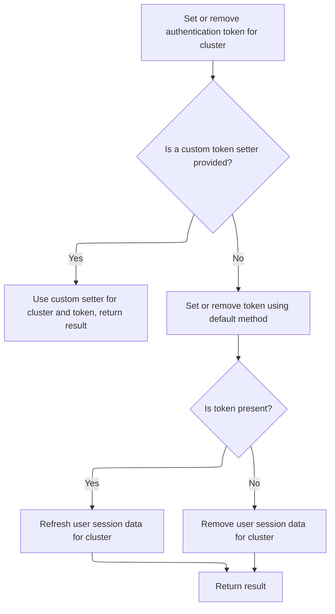

<SwmSnippet path="/frontend/src/lib/auth.ts" line="108">

---

<SwmToken path="frontend/src/lib/auth.ts" pos="108:4:4" line-data="export function setToken(cluster: string, token: string | null) {">`setToken`</SwmToken> either uses an override or calls <SwmToken path="frontend/src/lib/auth.ts" pos="114:3:3" line-data="  return setCookieToken(cluster, token).then(result =&gt; {">`setCookieToken`</SwmToken> to clear or set the token, then invalidates or removes <SwmToken path="frontend/src/lib/auth.ts" pos="116:12:12" line-data="      queryClient.invalidateQueries({ queryKey: [&#39;clusterMe&#39;, cluster], exact: true });">`clusterMe`</SwmToken> queries as needed. We call <SwmToken path="frontend/src/lib/auth.ts" pos="114:3:3" line-data="  return setCookieToken(cluster, token).then(result =&gt; {">`setCookieToken`</SwmToken> next to handle the actual token storage.

```typescript
export function setToken(cluster: string, token: string | null) {
  const setTokenMethodToUse = store.getState().ui.functionsToOverride.setToken;
  if (setTokenMethodToUse) {
    return Promise.resolve(setTokenMethodToUse(cluster, token));
  }

  return setCookieToken(cluster, token).then(result => {
    if (token) {
      queryClient.invalidateQueries({ queryKey: ['clusterMe', cluster], exact: true });
    } else {
      queryClient.removeQueries({ queryKey: ['clusterMe', cluster], exact: true });
    }

    return result;
  });
}
```

---

</SwmSnippet>

### Token Storage and API Header Preparation

<SwmSnippet path="/frontend/src/lib/auth.ts" line="79">

---

In <SwmToken path="frontend/src/lib/auth.ts" pos="79:4:4" line-data="async function setCookieToken(cluster: string, token: string | null) {">`setCookieToken`</SwmToken>, we POST the token to the backend for the cluster, adding headers from <SwmToken path="frontend/src/lib/auth.ts" pos="85:2:2" line-data="        ...getHeadlampAPIHeaders(),">`getHeadlampAPIHeaders`</SwmToken>. We call <SwmToken path="frontend/src/lib/auth.ts" pos="85:2:2" line-data="        ...getHeadlampAPIHeaders(),">`getHeadlampAPIHeaders`</SwmToken> next to include the backend token if set.

```typescript
async function setCookieToken(cluster: string, token: string | null) {
  try {
    const response = await backendFetch(`/clusters/${cluster}/set-token`, {
      method: 'POST',
      headers: {
        'Content-Type': 'application/json',
        ...getHeadlampAPIHeaders(),
```

---

</SwmSnippet>

<SwmSnippet path="/frontend/src/helpers/getHeadlampAPIHeaders.ts" line="39">

---

<SwmToken path="frontend/src/helpers/getHeadlampAPIHeaders.ts" pos="39:4:4" line-data="export function getHeadlampAPIHeaders(): { [key: string]: string } {">`getHeadlampAPIHeaders`</SwmToken> checks if <SwmToken path="frontend/src/helpers/getHeadlampAPIHeaders.ts" pos="40:4:4" line-data="  if (backendToken === null) {">`backendToken`</SwmToken> is set and returns the header if so, otherwise returns an empty object. This lets us add the backend token to requests automatically.

```typescript
export function getHeadlampAPIHeaders(): { [key: string]: string } {
  if (backendToken === null) {
    return {};
  }

  return {
    'X-HEADLAMP_BACKEND-TOKEN': backendToken,
  };
}
```

---

</SwmSnippet>

<SwmSnippet path="/frontend/src/lib/auth.ts" line="81">

---

After adding the headers, <SwmToken path="frontend/src/lib/auth.ts" pos="79:4:4" line-data="async function setCookieToken(cluster: string, token: string | null) {">`setCookieToken`</SwmToken> sends the request using <SwmToken path="frontend/src/lib/auth.ts" pos="81:9:9" line-data="    const response = await backendFetch(`/clusters/${cluster}/set-token`, {">`backendFetch`</SwmToken>. If the response isn't ok, it throws an error. We call <SwmToken path="frontend/src/lib/auth.ts" pos="81:9:9" line-data="    const response = await backendFetch(`/clusters/${cluster}/set-token`, {">`backendFetch`</SwmToken> next to actually send the request.

```typescript
    const response = await backendFetch(`/clusters/${cluster}/set-token`, {
      method: 'POST',
      headers: {
        'Content-Type': 'application/json',
        ...getHeadlampAPIHeaders(),
      },
      body: JSON.stringify({ token }),
    });

    if (!response.ok) {
      throw new Error(`Failed to set cookie token`);
    }
    return true;
  } catch (error) {
    console.error('Error setting cookie token:', error);
    throw error;
  }
}
```

---

</SwmSnippet>

### Backend Request Dispatch and Header Injection

```mermaid
%%{init: {"flowchart": {"defaultRenderer": "elk"}} }%%
flowchart TD
  node1["Prepare and send backend request with authentication"] --> node2{"Does X-Reload header contain 'reload'?"}
  click node1 openCode "frontend/src/lib/k8s/api/v2/fetch.ts:38:42"
  node2 -->|"Yes"| node3["Reload the page"]
  click node2 openCode "frontend/src/lib/k8s/api/v2/fetch.ts:46:47"
  node2 -->|"No"| node4{"Is backend response successful?"}
  node3 --> node4
  node4 -->|"No"| node5["Throw business error with backend message"]
  click node3 openCode "frontend/src/lib/k8s/api/v2/fetch.ts:48:48"
  click node4 openCode "frontend/src/lib/k8s/api/v2/fetch.ts:51:59"
  node4 -->|"Yes"| node6["Return backend response"]
  click node5 openCode "frontend/src/lib/k8s/api/v2/fetch.ts:59:59"
  click node6 openCode "frontend/src/lib/k8s/api/v2/fetch.ts:62:62"
classDef HeadingStyle fill:#777777,stroke:#333,stroke-width:2px;

%% Swimm:
%% %%{init: {"flowchart": {"defaultRenderer": "elk"}} }%%
%% flowchart TD
%%   node1["Prepare and send backend request with authentication"] --> node2{"Does <SwmToken path="frontend/src/lib/k8s/api/v1/clusterRequests.ts" pos="185:14:16" line-data="  const headerVal = response.headers.get(&#39;X-Reload&#39;);">`X-Reload`</SwmToken> header contain 'reload'?"}
%%   click node1 openCode "<SwmPath>[frontend/…/v2/fetch.ts](frontend/src/lib/k8s/api/v2/fetch.ts)</SwmPath>:38:42"
%%   node2 -->|"Yes"| node3["Reload the page"]
%%   click node2 openCode "<SwmPath>[frontend/…/v2/fetch.ts](frontend/src/lib/k8s/api/v2/fetch.ts)</SwmPath>:46:47"
%%   node2 -->|"No"| node4{"Is backend response successful?"}
%%   node3 --> node4
%%   node4 -->|"No"| node5["Throw business error with backend message"]
%%   click node3 openCode "<SwmPath>[frontend/…/v2/fetch.ts](frontend/src/lib/k8s/api/v2/fetch.ts)</SwmPath>:48:48"
%%   click node4 openCode "<SwmPath>[frontend/…/v2/fetch.ts](frontend/src/lib/k8s/api/v2/fetch.ts)</SwmPath>:51:59"
%%   node4 -->|"Yes"| node6["Return backend response"]
%%   click node5 openCode "<SwmPath>[frontend/…/v2/fetch.ts](frontend/src/lib/k8s/api/v2/fetch.ts)</SwmPath>:59:59"
%%   click node6 openCode "<SwmPath>[frontend/…/v2/fetch.ts](frontend/src/lib/k8s/api/v2/fetch.ts)</SwmPath>:62:62"
%% classDef HeadingStyle fill:#777777,stroke:#333,stroke-width:2px;
```

<SwmSnippet path="/frontend/src/lib/k8s/api/v2/fetch.ts" line="38">

---

<SwmToken path="frontend/src/lib/k8s/api/v2/fetch.ts" pos="38:6:6" line-data="export async function backendFetch(url: string | URL, init: RequestInit = {}) {">`backendFetch`</SwmToken> sets up the request to always include credentials and adds auth headers, then builds the full URL using <SwmToken path="frontend/src/lib/k8s/api/v2/fetch.ts" pos="42:14:14" line-data="  const response = await fetch(makeUrl([getAppUrl(), url]), init);">`getAppUrl`</SwmToken>. We call <SwmToken path="frontend/src/lib/k8s/api/v2/fetch.ts" pos="42:14:14" line-data="  const response = await fetch(makeUrl([getAppUrl(), url]), init);">`getAppUrl`</SwmToken> next to get the right base URL for the request.

```typescript
export async function backendFetch(url: string | URL, init: RequestInit = {}) {
  // Always include credentials
  init.credentials = 'include';
  init.headers = addBackstageAuthHeaders(init.headers);
  const response = await fetch(makeUrl([getAppUrl(), url]), init);

```

---

</SwmSnippet>

<SwmSnippet path="/frontend/src/lib/k8s/api/v2/fetch.ts" line="44">

---

After getting the base URL from <SwmToken path="frontend/src/lib/k8s/api/v1/clusterRequests.ts" pos="160:9:9" line-data="  let url = combinePath(getAppUrl(), fullPath);">`getAppUrl`</SwmToken>, the fetch function in <SwmPath>[frontend/…/v2/fetch.ts](frontend/src/lib/k8s/api/v2/fetch.ts)</SwmPath> checks the response for an <SwmToken path="frontend/src/lib/k8s/api/v2/fetch.ts" pos="46:14:16" line-data="  const headerVal = response.headers.get(&#39;X-Reload&#39;);">`X-Reload`</SwmToken> header. If present and it contains 'reload', it reloads the page. Then, if the response isn't ok, it tries to parse an error message from the response body and throws an <SwmToken path="frontend/src/lib/k8s/api/v2/fetch.ts" pos="59:5:5" line-data="    throw new ApiError(maybeErrorMessage ?? &#39;Unreachable&#39;, { status: response.status });">`ApiError`</SwmToken> with the message and status. This makes sure the frontend reacts to backend signals and gives meaningful errors.

```typescript
  // The backend signals through this header that it wants a reload.
  // See plugins.go
  const headerVal = response.headers.get('X-Reload');
  if (headerVal && headerVal.indexOf('reload') !== -1) {
    window.location.reload();
  }

  if (!response.ok) {
    // Try to parse error message from response
    let maybeErrorMessage: string | undefined;
    try {
      const body = await response.json();
      maybeErrorMessage = typeof body === 'string' ? body : body.message;
    } catch (e) {}

    throw new ApiError(maybeErrorMessage ?? 'Unreachable', { status: response.status });
  }

  return response;
}
```

---

</SwmSnippet>

### Error Handling and Response Parsing

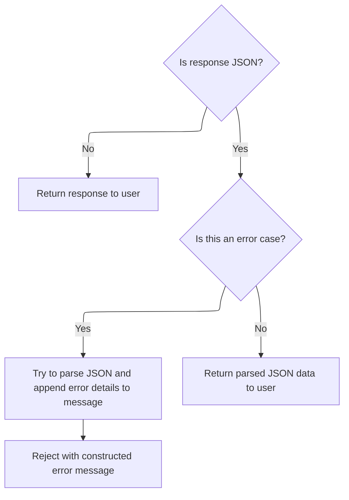

<SwmSnippet path="/frontend/src/lib/k8s/api/v1/clusterRequests.ts" line="197">

---

After returning from logout in <SwmPath>[frontend/…/lib/auth.ts](frontend/src/lib/auth.ts)</SwmPath>, <SwmToken path="frontend/src/lib/k8s/api/v1/clusterRequests.ts" pos="108:3:3" line-data="  return clusterRequest(path, { cluster, autoLogoutOnAuthError, ...params }, queryParams);">`clusterRequest`</SwmToken> in <SwmPath>[frontend/…/v1/clusterRequests.ts](frontend/src/lib/k8s/api/v1/clusterRequests.ts)</SwmPath> tries to parse the error message from the response if it's JSON, appends it to the status text, and rejects with an <SwmToken path="frontend/src/lib/k8s/api/v1/clusterRequests.ts" pos="213:16:16" line-data="    const error = new Error(message) as ApiError;">`ApiError`</SwmToken>. If parsing fails, it logs the error and falls back to the status text. This keeps error reporting consistent and informative.

```typescript
    let message = statusText;
    try {
      if (isJSON) {
        const json = await response.json();
        message += ` - ${json.message}`;
      }
    } catch (err) {
      console.error(
        'Unable to parse error json at url:',
        url,
        { err },
        'with request data:',
        requestData
      );
    }

    const error = new Error(message) as ApiError;
    error.status = status;
    return Promise.reject(error);
  }

  if (!isJSON) {
    return Promise.resolve(response);
  }

  return response.json();
}
```

---

</SwmSnippet>

## Preparing Cluster API Request Headers

<SwmSnippet path="/frontend/src/lib/k8s/api/v1/clusterApi.ts" line="81">

---

After building the request, <SwmToken path="frontend/src/lib/k8s/index.ts" pos="145:7:7" line-data="  const [cluster, setCluster] = React.useState(getCluster());">`setCluster`</SwmToken> adds backend token headers from <SwmToken path="frontend/src/lib/k8s/api/v1/clusterApi.ts" pos="88:2:2" line-data="        ...getHeadlampAPIHeaders(),">`getHeadlampAPIHeaders`</SwmToken> to make sure the cluster API call is authenticated.

```typescript
  return request(
    '/cluster',
    {
      method: 'POST',
      body: JSON.stringify(clusterReq),
      headers: {
        ...headers,
        ...getHeadlampAPIHeaders(),
```

---

</SwmSnippet>

<SwmSnippet path="/frontend/src/lib/k8s/api/v1/clusterApi.ts" line="81">

---

After getting the backend token headers from <SwmToken path="frontend/src/lib/k8s/api/v1/clusterApi.ts" pos="88:2:2" line-data="        ...getHeadlampAPIHeaders(),">`getHeadlampAPIHeaders`</SwmToken>, <SwmToken path="frontend/src/lib/k8s/index.ts" pos="145:7:7" line-data="  const [cluster, setCluster] = React.useState(getCluster());">`setCluster`</SwmToken> in <SwmPath>[frontend/…/v1/clusterApi.ts](frontend/src/lib/k8s/api/v1/clusterApi.ts)</SwmPath> calls request to send the POST to <SwmPath>[frontend/…/components/cluster/](frontend/src/components/cluster/)</SwmPath> with all the merged headers and body. This is where the actual cluster API request happens.

```typescript
  return request(
    '/cluster',
    {
      method: 'POST',
      body: JSON.stringify(clusterReq),
      headers: {
        ...headers,
        ...getHeadlampAPIHeaders(),
      },
    },
    false,
    false
  );
}
```

---

</SwmSnippet>

&nbsp;

*This is an auto-generated document by Swimm 🌊 and has not yet been verified by a human*

<SwmMeta version="3.0.0" repo-id="Z2l0aHViJTNBJTNBdHlwZXNjcmlwdC1oZWFkbGFtcCUzQSUzQXJpY2FyZG9sb3Blemc=" repo-name="typescript-headlamp"><sup>Powered by [Swimm](https://app.swimm.io/)</sup></SwmMeta>
