This document describes the process of updating an installed plugin to its latest version. When a user requests a plugin update, the system validates the request, checks for updates using <SwmToken path="app/electron/plugin-management.ts" pos="936:25:25" line-data="      throw new Error(&#39;Invalid URL. Please provide a valid URL from ArtifactHub.&#39;);">`ArtifactHub`</SwmToken>, and ensures compatibility with the current Headlamp version. If an update is available, the new plugin files and any <SwmToken path="app/electron/plugin-management.ts" pos="607:7:9" line-data="        message: `Downloading platform-specific file for ${file.arch}: ${path.basename(file.url)}`,">`platform-specific`</SwmToken> extras are downloaded and installed, replacing the old version. Progress is tracked and reported throughout, keeping users informed.

```mermaid
flowchart TD
  node1["Managing the plugin update lifecycle"]:::HeadingStyle
  click node1 goToHeading "Managing the plugin update lifecycle"
  node1 --> node2{"Is plugin installed?"}
  node2 -->|"Yes"| node3["Checking plugin version and fetching update info"]:::HeadingStyle
  click node3 goToHeading "Checking plugin version and fetching update info"
  node2 -->|"No"| node7["No update performed"]
  node3 --> node4{"Is newer version available?"}
  node4 -->|"Yes"| node5["Retrieving plugin metadata from ArtifactHub"]:::HeadingStyle
  click node5 goToHeading "Retrieving plugin metadata from ArtifactHub"
  node4 -->|"No"| node7
  node5 --> node6{"Is plugin compatible with Headlamp version?"}
  node6 -->|"Yes"| node8["Downloading and extracting the plugin archive"]:::HeadingStyle
  click node8 goToHeading "Downloading and extracting the plugin archive"
  node6 -->|"No"| node7
  node8 --> node9["Replacing the old plugin with the new version"]:::HeadingStyle
  click node9 goToHeading "Replacing the old plugin with the new version"

classDef HeadingStyle fill:#777777,stroke:#333,stroke-width:2px;

%% Swimm:
%% flowchart TD
%%   node1["Managing the plugin update lifecycle"]:::HeadingStyle
%%   click node1 goToHeading "Managing the plugin update lifecycle"
%%   node1 --> node2{"Is plugin installed?"}
%%   node2 -->|"Yes"| node3["Checking plugin version and fetching update info"]:::HeadingStyle
%%   click node3 goToHeading "Checking plugin version and fetching update info"
%%   node2 -->|"No"| node7["No update performed"]
%%   node3 --> node4{"Is newer version available?"}
%%   node4 -->|"Yes"| node5["Retrieving plugin metadata from <SwmToken path="app/electron/plugin-management.ts" pos="936:25:25" line-data="      throw new Error(&#39;Invalid URL. Please provide a valid URL from ArtifactHub.&#39;);">`ArtifactHub`</SwmToken>"]:::HeadingStyle
%%   click node5 goToHeading "Retrieving plugin metadata from <SwmToken path="app/electron/plugin-management.ts" pos="936:25:25" line-data="      throw new Error(&#39;Invalid URL. Please provide a valid URL from ArtifactHub.&#39;);">`ArtifactHub`</SwmToken>"
%%   node4 -->|"No"| node7
%%   node5 --> node6{"Is plugin compatible with Headlamp version?"}
%%   node6 -->|"Yes"| node8["Downloading and extracting the plugin archive"]:::HeadingStyle
%%   click node8 goToHeading "Downloading and extracting the plugin archive"
%%   node6 -->|"No"| node7
%%   node8 --> node9["Replacing the old plugin with the new version"]:::HeadingStyle
%%   click node9 goToHeading "Replacing the old plugin with the new version"
%% 
%% classDef HeadingStyle fill:#777777,stroke:#333,stroke-width:2px;
```

# Triggering the plugin update process

<SwmSnippet path="/app/electron/main.ts" line="365">

---

In <SwmToken path="app/electron/main.ts" pos="365:3:3" line-data="  private handleUpdate(eventData: Action, updateCache: (progress: ProgressResp) =&gt; void) {">`handleUpdate`</SwmToken>, we validate input, prep the cache, and start the update. We use <SwmToken path="app/electron/main.ts" pos="365:11:11" line-data="  private handleUpdate(eventData: Action, updateCache: (progress: ProgressResp) =&gt; void) {">`updateCache`</SwmToken> in the progress callback so each update step is reflected in our cache for real-time feedback.

```typescript
  private handleUpdate(eventData: Action, updateCache: (progress: ProgressResp) => void) {
    const { identifier, pluginName, destinationFolder, headlampVersion } = eventData;
    if (!pluginName) {
      this.cache[identifier] = {
        action: 'UPDATE',
        progress: { type: 'error', message: 'Plugin Name is required' },
      };
      return;
    }

    const controller = new AbortController();
    this.cache[identifier] = {
      action: 'UPDATE',
      percentage: 10,
      progress: { type: 'info', message: 'updating plugin' },
      controller,
    };

    PluginManager.update(
      pluginName,
      destinationFolder,
      headlampVersion,
      progress => {
        updateCache(progress);
```

---

</SwmSnippet>

## Updating progress and percentage in cache

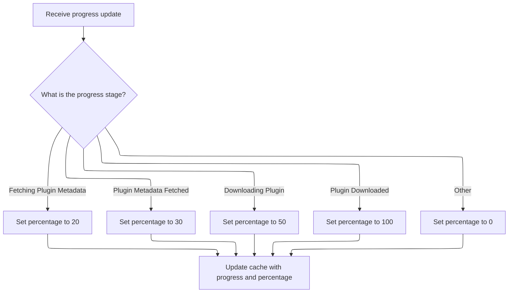

<SwmSnippet path="/app/electron/main.ts" line="228">

---

In <SwmToken path="app/electron/main.ts" pos="228:3:3" line-data="      const updateCache = (progress: ProgressResp) =&gt; {">`updateCache`</SwmToken>, we take the incoming progress event and convert it to a percentage using <SwmToken path="app/electron/main.ts" pos="229:9:9" line-data="        const percentage = this.convertProgressToPercentage(progress);">`convertProgressToPercentage`</SwmToken>. This lets us update both the progress message and a numeric percentage in the cache, which is assumed to be structured for this purpose. The conversion step is needed so we can show a progress bar or similar UI element.

```typescript
      const updateCache = (progress: ProgressResp) => {
        const percentage = this.convertProgressToPercentage(progress);
```

---

</SwmSnippet>

<SwmSnippet path="/app/electron/main.ts" line="203">

---

<SwmToken path="app/electron/main.ts" pos="203:3:3" line-data="  private convertProgressToPercentage(progress: ProgressResp): number {">`convertProgressToPercentage`</SwmToken> maps specific progress messages to fixed percentage values using a switch-case. Only known messages get a percentage; anything else defaults to 0. This makes progress tracking predictable but ignores unknown states.

```typescript
  private convertProgressToPercentage(progress: ProgressResp): number {
    switch (progress.message) {
      case 'Fetching Plugin Metadata':
        return 20;
      case 'Plugin Metadata Fetched':
        return 30;
      case 'Downloading Plugin':
        return 50;
      case 'Plugin Downloaded':
        return 100;
      default:
        return 0;
    }
  }
```

---

</SwmSnippet>

<SwmSnippet path="/app/electron/main.ts" line="230">

---

Back in <SwmToken path="app/electron/main.ts" pos="228:3:3" line-data="      const updateCache = (progress: ProgressResp) =&gt; {">`updateCache`</SwmToken>, after getting the percentage from <SwmToken path="app/electron/main.ts" pos="203:3:3" line-data="  private convertProgressToPercentage(progress: ProgressResp): number {">`convertProgressToPercentage`</SwmToken>, we update the cache entry for this identifier with the new progress and percentage. This assumes the cache entry is already set up, which isn't enforced by the function itself.

```typescript
        this.cache[identifier].progress = progress;
        this.cache[identifier].percentage = percentage;
      };
```

---

</SwmSnippet>

## Executing the plugin update operation

<SwmSnippet path="/app/electron/main.ts" line="383">

---

After returning from <SwmToken path="app/electron/main.ts" pos="388:1:1" line-data="        updateCache(progress);">`updateCache`</SwmToken>, <SwmToken path="app/electron/main.ts" pos="365:3:3" line-data="  private handleUpdate(eventData: Action, updateCache: (progress: ProgressResp) =&gt; void) {">`handleUpdate`</SwmToken> hands off to <SwmToken path="app/electron/main.ts" pos="383:1:3" line-data="    PluginManager.update(">`PluginManager.update`</SwmToken> to perform the actual update. The progress callback keeps the cache updated, and <SwmToken path="app/electron/main.ts" pos="390:1:3" line-data="      controller.signal">`controller.signal`</SwmToken> allows for cancellation if needed. Next, the flow moves into the <SwmToken path="app/electron/main.ts" pos="52:6:8" line-data="} from &#39;./plugin-management&#39;;">`plugin-management`</SwmToken> logic to handle the update steps.

```typescript
    PluginManager.update(
      pluginName,
      destinationFolder,
      headlampVersion,
      progress => {
        updateCache(progress);
      },
      controller.signal
    );
  }
```

---

</SwmSnippet>

# Managing the plugin update lifecycle

```mermaid
%%{init: {"flowchart": {"defaultRenderer": "elk"}} }%%
flowchart TD
  node1["Start plugin update process"] --> node2["Listing and validating installed plugins"]
  click node1 openCode "app/electron/plugin-management.ts:239:246"
  
  node2 --> node3{"Is plugin installed?"}
  click node3 openCode "app/electron/plugin-management.ts:252:255"
  node3 -->|"Yes"| node4["Retrieving plugin metadata from ArtifactHub"]
  
  node3 -->|"No"| node7["Abort update: Plugin not found or no updates"]
  click node7 openCode "app/electron/plugin-management.ts:254:254"
  node4 --> node5{"Is newer version available?"}
  click node5 openCode "app/electron/plugin-management.ts:267:269"
  node5 -->|"Yes"| node6["Downloading and extracting the plugin archive"]
  
  node5 -->|"No"| node7
classDef HeadingStyle fill:#777777,stroke:#333,stroke-width:2px;
click node2 goToHeading "Listing and validating installed plugins"
node2:::HeadingStyle
click node4 goToHeading "Retrieving plugin metadata from ArtifactHub"
node4:::HeadingStyle
click node6 goToHeading "Downloading and extracting the plugin archive"
node6:::HeadingStyle

%% Swimm:
%% %%{init: {"flowchart": {"defaultRenderer": "elk"}} }%%
%% flowchart TD
%%   node1["Start plugin update process"] --> node2["Listing and validating installed plugins"]
%%   click node1 openCode "<SwmPath>[app/electron/plugin-management.ts](app/electron/plugin-management.ts)</SwmPath>:239:246"
%%   
%%   node2 --> node3{"Is plugin installed?"}
%%   click node3 openCode "<SwmPath>[app/electron/plugin-management.ts](app/electron/plugin-management.ts)</SwmPath>:252:255"
%%   node3 -->|"Yes"| node4["Retrieving plugin metadata from <SwmToken path="app/electron/plugin-management.ts" pos="936:25:25" line-data="      throw new Error(&#39;Invalid URL. Please provide a valid URL from ArtifactHub.&#39;);">`ArtifactHub`</SwmToken>"]
%%   
%%   node3 -->|"No"| node7["Abort update: Plugin not found or no updates"]
%%   click node7 openCode "<SwmPath>[app/electron/plugin-management.ts](app/electron/plugin-management.ts)</SwmPath>:254:254"
%%   node4 --> node5{"Is newer version available?"}
%%   click node5 openCode "<SwmPath>[app/electron/plugin-management.ts](app/electron/plugin-management.ts)</SwmPath>:267:269"
%%   node5 -->|"Yes"| node6["Downloading and extracting the plugin archive"]
%%   
%%   node5 -->|"No"| node7
%% classDef HeadingStyle fill:#777777,stroke:#333,stroke-width:2px;
%% click node2 goToHeading "Listing and validating installed plugins"
%% node2:::HeadingStyle
%% click node4 goToHeading "Retrieving plugin metadata from <SwmToken path="app/electron/plugin-management.ts" pos="936:25:25" line-data="      throw new Error(&#39;Invalid URL. Please provide a valid URL from ArtifactHub.&#39;);">`ArtifactHub`</SwmToken>"
%% node4:::HeadingStyle
%% click node6 goToHeading "Downloading and extracting the plugin archive"
%% node6:::HeadingStyle
```

<SwmSnippet path="/app/electron/plugin-management.ts" line="239">

---

In <SwmToken path="app/electron/plugin-management.ts" pos="239:5:5" line-data="  static async update(">`update`</SwmToken>, we start by listing installed plugins, finding the target, and reading its version. We then fetch the latest plugin info, compare versions, and if an update is needed, download and extract the new files before replacing the old ones. Progress is reported throughout for feedback.

```typescript
  static async update(
    pluginName: string,
    destinationFolder: string = defaultUserPluginsDir(),
    headlampVersion: string = '',
    progressCallback: null | ProgressCallback = null,
    signal: AbortSignal | null = null
  ): Promise<void> {
    try {
      // @todo: should list call take progressCallback?
      const installedPlugins = PluginManager.list(destinationFolder);
      if (!installedPlugins) {
        throw new Error('InstalledPlugins not found');
      }
```

---

</SwmSnippet>

## Listing and validating installed plugins

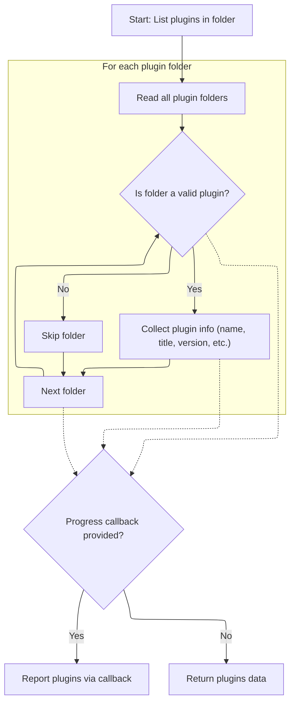

<SwmSnippet path="/app/electron/plugin-management.ts" line="357">

---

In `list`, we scan the plugin directory, filter for folders, and validate each with <SwmToken path="app/electron/plugin-management.ts" pos="371:4:4" line-data="        if (checkValidPluginFolder(pluginDir)) {">`checkValidPluginFolder`</SwmToken>. Only folders with <SwmPath>[plugins/…/.storybook/main.js](plugins/headlamp-plugin/config/.storybook/main.js)</SwmPath>, <SwmPath>[package.json](package.json)</SwmPath>, and the right flag are processed. Metadata is extracted from <SwmPath>[package.json](package.json)</SwmPath> and collected for reporting or return.

```typescript
  static list(folder = defaultPluginsDir(), progressCallback: null | ProgressCallback = null) {
    try {
      const pluginsData: PluginData[] = [];

      // Read all entries in the specified folder
      const entries = fs.readdirSync(folder, { withFileTypes: true });

      // Filter out directories (plugins)
      const pluginFolders = entries.filter(entry => entry.isDirectory());

      // Iterate through each plugin folder
      for (const pluginFolder of pluginFolders) {
        const pluginDir = path.join(folder, pluginFolder.name);

        if (checkValidPluginFolder(pluginDir)) {
```

---

</SwmSnippet>

<SwmSnippet path="/app/electron/plugin-management.ts" line="993">

---

<SwmToken path="app/electron/plugin-management.ts" pos="993:2:2" line-data="function checkValidPluginFolder(folder: string): boolean {">`checkValidPluginFolder`</SwmToken> checks for <SwmPath>[plugins/…/.storybook/main.js](plugins/headlamp-plugin/config/.storybook/main.js)</SwmPath> and <SwmPath>[package.json](package.json)</SwmPath>, then looks for <SwmToken path="app/electron/plugin-management.ts" pos="1003:6:6" line-data="  if (packageJSON.isManagedByHeadlampPlugin) {">`isManagedByHeadlampPlugin`</SwmToken> in <SwmPath>[package.json](package.json)</SwmPath>. Only folders with this flag set to true are considered valid Headlamp plugins.

```typescript
function checkValidPluginFolder(folder: string): boolean {
  if (!fs.existsSync(folder)) {
    return false;
  }
  const mainJsPath = path.join(folder, 'main.js');
  const packageJsonPath = path.join(folder, 'package.json');
  if (!fs.existsSync(mainJsPath) || !fs.existsSync(packageJsonPath)) {
    return false;
  }
  const packageJSON = JSON.parse(fs.readFileSync(packageJsonPath, 'utf8'));
  if (packageJSON.isManagedByHeadlampPlugin) {
    return true;
  }
  return false;
}
```

---

</SwmSnippet>

<SwmSnippet path="/app/electron/plugin-management.ts" line="372">

---

After validating plugin folders, the function reads <SwmPath>[package.json](package.json)</SwmPath> and pulls out metadata from the artifacthub field. This structure is required for plugins to be recognized and listed. Next, the flow moves to <SwmPath>[plugins/…/bin/pluginctl.js](plugins/pluginctl/bin/pluginctl.js)</SwmPath> to display or process this data.

```typescript
          // Read package.json to get the plugin name and version
          const packageJsonPath = path.join(pluginDir, 'package.json');
          const packageJson = JSON.parse(fs.readFileSync(packageJsonPath, 'utf8'));
          const pluginName = packageJson.name || pluginFolder.name;
          const pluginTitle = packageJson.artifacthub.title;
          const pluginVersion = packageJson.version || null;
          const artifacthubURL = packageJson.artifacthub ? packageJson.artifacthub.url : null;
          const repoName = packageJson.artifacthub ? packageJson.artifacthub.repoName : null;
          const author = packageJson.artifacthub ? packageJson.artifacthub.author : null;
          const artifacthubVersion = packageJson.artifacthub
            ? packageJson.artifacthub.version
            : null;
          // Store plugin data (folder name and plugin name)
          pluginsData.push({
            pluginName,
            pluginTitle,
            pluginVersion,
            folderName: pluginFolder.name,
            artifacthubURL: artifacthubURL,
            repoName: repoName,
            author: author,
            artifacthubVersion: artifacthubVersion,
          });
        }
      }

      if (progressCallback) {
        progressCallback({ type: 'success', message: 'Plugins Listed', data: pluginsData });
      } else {
        return pluginsData;
      }
    } catch (e) {
      if (progressCallback) {
        progressCallback({ type: 'error', message: e instanceof Error ? e.message : String(e) });
      } else {
        throw e;
      }
    }
  }
```

---

</SwmSnippet>

<SwmSnippet path="/plugins/pluginctl/bin/pluginctl.js" line="606">

---

<SwmToken path="plugins/pluginctl/bin/pluginctl.js" pos="606:3:3" line-data="      const progressCallback = (data) =&gt; {">`progressCallback`</SwmToken> in <SwmPath>[plugins/…/bin/pluginctl.js](plugins/pluginctl/bin/pluginctl.js)</SwmPath> formats plugin metadata for output. If JSON is requested, it dumps the data as a string. Otherwise, it builds a table with key fields for display. This dual format supports both scripting and manual inspection.

```javascript
      const progressCallback = (data) => {
        if (json) {
          console.log(JSON.stringify(data.data));
        } else {
          // display table
          const rows = [["Name", "Version", "Folder Name", "Repo", "Author"]];
          data.data.forEach((plugin) => {
            rows.push([
              plugin.pluginName,
              plugin.pluginVersion,
              plugin.folderName,
              plugin.repoName,
              plugin.author,
            ]);
          });
          console.log(table(rows));
        }
      };
```

---

</SwmSnippet>

## Checking plugin version and fetching update info

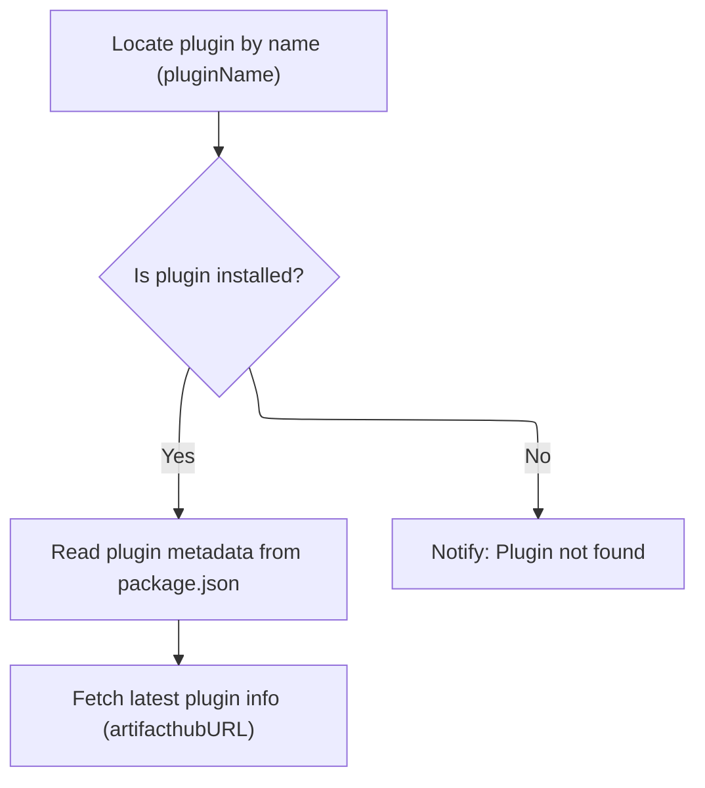

<SwmSnippet path="/app/electron/plugin-management.ts" line="252">

---

After listing plugins, we find the target and read its <SwmPath>[package.json](package.json)</SwmPath>, specifically the <SwmToken path="app/electron/plugin-management.ts" pos="265:9:11" line-data="      const currentVersion = packageJson.artifacthub.version;">`artifacthub.version`</SwmToken> field. We then fetch the latest plugin info from <SwmToken path="app/electron/plugin-management.ts" pos="936:25:25" line-data="      throw new Error(&#39;Invalid URL. Please provide a valid URL from ArtifactHub.&#39;);">`ArtifactHub`</SwmToken> for comparison. This step is required to decide if an update is needed.

```typescript
      const plugin = installedPlugins.find(p => p.pluginName === pluginName);
      if (!plugin) {
        throw new Error('Plugin not found');
      }

      const pluginDir = path.join(destinationFolder, plugin.folderName);
      // read the package.json of the plugin
      const packageJsonPath = path.join(pluginDir, 'package.json');
      const packageJson = JSON.parse(fs.readFileSync(packageJsonPath, 'utf8'));

      const pluginData = await fetchPluginInfo(plugin.artifacthubURL, progressCallback, signal);

```

---

</SwmSnippet>

## Retrieving plugin metadata from <SwmToken path="app/electron/plugin-management.ts" pos="936:25:25" line-data="      throw new Error(&#39;Invalid URL. Please provide a valid URL from ArtifactHub.&#39;);">`ArtifactHub`</SwmToken>

<SwmSnippet path="/app/electron/plugin-management.ts" line="929">

---

We validate and transform the URL to hit the <SwmToken path="app/electron/plugin-management.ts" pos="936:25:25" line-data="      throw new Error(&#39;Invalid URL. Please provide a valid URL from ArtifactHub.&#39;);">`ArtifactHub`</SwmToken> API for plugin metadata.

```typescript
async function fetchPluginInfo(
  URL: string,
  progressCallback: null | ProgressCallback,
  signal: AbortSignal | null
): Promise<ArtifactHubHeadlampPkg> {
  try {
    if (!URL.startsWith('https://artifacthub.io/packages/headlamp/')) {
      throw new Error('Invalid URL. Please provide a valid URL from ArtifactHub.');
    }

    const apiURL = URL.replace(
      'https://artifacthub.io/packages/headlamp/',
      'https://artifacthub.io/api/v1/packages/headlamp/'
    );

    if (progressCallback) {
      progressCallback({ type: 'info', message: 'Fetching Plugin Metadata' });
    }
```

---

</SwmSnippet>

<SwmSnippet path="/app/electron/plugin-management.ts" line="947">

---

After fetching the API response, we extract key fields for plugin metadata and check for extra files using <SwmToken path="app/electron/plugin-management.ts" pos="963:7:7" line-data="    const extraFiles = getExtraFiles(pkgResponse.data);">`getExtraFiles`</SwmToken>. This builds a structured object for downstream use.

```typescript
    const response = await fetch(apiURL, { redirect: 'follow', signal });
    if (!response.ok) {
      throw new Error(`HTTP error! status: ${response.status}`);
    }
    const pkgResponse = await response.json();
    const pkg: ArtifactHubHeadlampPkg = {
      name: pkgResponse.name,
      display_name: pkgResponse.display_name,
      version: pkgResponse.version,
      repository: pkgResponse.repository,
      archiveURL: pkgResponse.data['headlamp/plugin/archive-url'],
      archiveChecksum: pkgResponse.data['headlamp/plugin/archive-checksum'],
      distroCompat: pkgResponse.data['headlamp/plugin/distro-compat'],
      versionCompat: pkgResponse.data['headlamp/plugin/version-compat'],
    };

    const extraFiles = getExtraFiles(pkgResponse.data);

```

---

</SwmSnippet>

### Extracting and validating extra plugin files

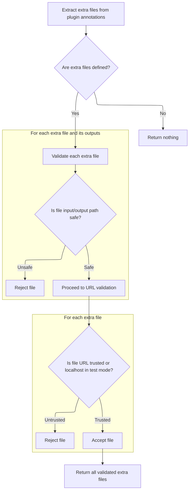

<SwmSnippet path="/app/electron/plugin-management.ts" line="872">

---

In <SwmToken path="app/electron/plugin-management.ts" pos="872:4:4" line-data="export function getExtraFiles(">`getExtraFiles`</SwmToken>, we convert flat annotations to a nested object, then pull out extra files from a specific path. This assumes the structure is always present and correct.

```typescript
export function getExtraFiles(
  annotations: Record<string, string>
): ArtifactHubHeadlampPkg['extraFiles'] | undefined {
  const converted = convertAnnotations(annotations);

```

---

</SwmSnippet>

<SwmSnippet path="/app/electron/plugin-management.ts" line="843">

---

<SwmToken path="app/electron/plugin-management.ts" pos="843:2:2" line-data="function convertAnnotations(annotations: Record&lt;string, string&gt;): Record&lt;string, any&gt; {">`convertAnnotations`</SwmToken> takes flat key/value pairs with '/'-separated keys and builds nested objects. This lets us reconstruct complex data structures from simple annotation formats.

```typescript
function convertAnnotations(annotations: Record<string, string>): Record<string, any> {
  const result: Record<string, any> = {};

  for (const key in annotations) {
    const value = annotations[key];
    const parts = key.split('/');
    let current = result;

    for (let i = 0; i < parts.length; i++) {
      const part = parts[i];
      if (i === parts.length - 1) {
        current[part] = value;
      } else {
        if (!current[part]) {
          current[part] = {};
        }
        current = current[part];
      }
    }
  }
```

---

</SwmSnippet>

<SwmSnippet path="/app/electron/plugin-management.ts" line="877">

---

After extracting extra files, the function validates all paths and <SwmToken path="app/electron/plugin-management.ts" pos="905:5:5" line-data="  // Validate URLs. Only allow downloads from github.com/kubernetes/minikube for now.">`URLs`</SwmToken> to block dangerous values and restrict downloads to trusted sources. This is a security step before using any extra files.

```typescript
  const extraFiles: ArtifactHubHeadlampPkg['extraFiles'] =
    converted?.headlamp?.plugin?.['extra-files'];
  if (!extraFiles) {
    return undefined;
  }

  // Validate the input and output.
  // Check if any of the extra files output.key.output's have anything dangerous.
  // For example '..' in the path and starting with / or \
  for (const file of Object.values(extraFiles)) {
    for (const value of Object.values(file.output)) {
      if (
        value.output.startsWith('..') ||
        value.output.startsWith('/') ||
        value.output.startsWith('\\')
      ) {
        throw new Error(`Invalid extra file output path, ${value.output}`);
      }
      if (
        value.input.startsWith('..') ||
        value.input.startsWith('/') ||
        value.input.startsWith('\\')
      ) {
        throw new Error(`Invalid extra file input path, ${value.input}`);
      }
    }
  }

  // Validate URLs. Only allow downloads from github.com/kubernetes/minikube for now.
  for (const file of Object.values(extraFiles)) {
    // For testing purposes, we allow localhost URLs.
    const underTest = process.env.NODE_ENV === 'test' && file.url.includes('localhost');
    const validURL =
      file.url &&
      (file.url.startsWith('https://github.com/kubernetes/minikube/releases/download/') ||
        file.url.startsWith('https://github.com/crc-org/vfkit/releases/download/'));

    if (!underTest && !validURL) {
      throw new Error(`Invalid URL, ${file.url}`);
    }
  }
```

---

</SwmSnippet>

### Finalizing plugin metadata with extra files

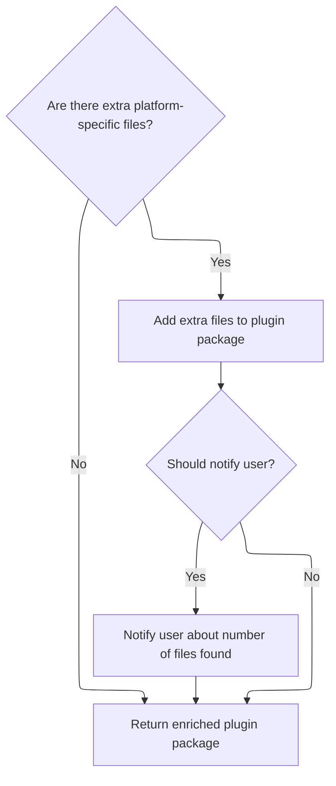

<SwmSnippet path="/app/electron/plugin-management.ts" line="965">

---

After validating extra files, we attach them to the pkg object and report their count via <SwmToken path="app/electron/plugin-management.ts" pos="967:4:4" line-data="      if (progressCallback) {">`progressCallback`</SwmToken>. This extends plugin metadata for installation steps that need <SwmToken path="app/electron/plugin-management.ts" pos="970:21:23" line-data="          message: `Found ${Object.keys(pkg.extraFiles)!.length} platform-specific extra files`,">`platform-specific`</SwmToken> files.

```typescript
    if (extraFiles) {
      pkg.extraFiles = extraFiles;
      if (progressCallback) {
        progressCallback({
          type: 'info',
          message: `Found ${Object.keys(pkg.extraFiles)!.length} platform-specific extra files`,
        });
      }
    }

    return pkg;
  } catch (e) {
    if (progressCallback) {
      progressCallback({ type: 'error', message: e instanceof Error ? e.message : String(e) });
    }

    throw e;
  }
}
```

---

</SwmSnippet>

## Comparing versions and preparing for plugin update

<SwmSnippet path="/app/electron/plugin-management.ts" line="264">

---

After fetching plugin info, we compare the latest version to the local one using semver. If an update is needed, we move on to download and extract the new plugin archive for installation.

```typescript
      const latestVersion = pluginData.version;
      const currentVersion = packageJson.artifacthub.version;

      if (semver.lte(latestVersion, currentVersion)) {
        throw new Error('No updates available');
      }

      // eslint-disable-next-line no-unused-vars
      const [_, tempFolder] = await downloadExtractArchive(
        pluginData,
        headlampVersion,
        progressCallback,
        signal
      );

```

---

</SwmSnippet>

## Downloading and extracting the plugin archive

```mermaid
%%{init: {"flowchart": {"defaultRenderer": "elk"}} }%%
flowchart TD
    node1["Start plugin installation for selected plugin"] --> node2{"Is download cancelled?"}
    click node1 openCode "app/electron/plugin-management.ts:469:474"
    click node2 openCode "app/electron/plugin-management.ts:476:478"
    node2 -->|"No"| node3{"Is plugin name valid?"}
    node2 -->|"Yes"| node8["Abort: Download cancelled"]
    click node8 openCode "app/electron/plugin-management.ts:477:478"
    node3 -->|"Yes"| node4{"Is Headlamp version compatible?"}
    
    node3 -->|"No"| node9["Abort: Invalid plugin name"]
    click node9 openCode "app/electron/plugin-management.ts:482:483"
    node4 -->|"Yes"| node5["Downloading and extracting plugin archives safely"]
    
    node4 -->|"No"| node10["Preparing extraction and starting main archive download"]
    
    node5 --> node6{"Is download cancelled?"}
    
    
    node6 -->|"No"| node7["Filtering and downloading platform-specific files"]
    node6 -->|"Yes"| node8
    
    node7 --> node11["Finalizing plugin metadata after extraction"]
    
    node11 --> node12["Finalizing plugin metadata after extraction"]
    

classDef HeadingStyle fill:#777777,stroke:#333,stroke-width:2px;
click node3 goToHeading "Validating plugin name for safety"
node3:::HeadingStyle
click node4 goToHeading "Preparing extraction and starting main archive download"
node4:::HeadingStyle
click node5 goToHeading "Downloading and extracting plugin archives safely"
node5:::HeadingStyle
click node6 goToHeading "Preparing extraction and starting main archive download"
node6:::HeadingStyle
click node7 goToHeading "Filtering and downloading platform-specific files"
node7:::HeadingStyle
click node10 goToHeading "Preparing extraction and starting main archive download"
node10:::HeadingStyle
click node11 goToHeading "Finalizing plugin metadata after extraction"
node11:::HeadingStyle
click node12 goToHeading "Finalizing plugin metadata after extraction"
node12:::HeadingStyle

%% Swimm:
%% %%{init: {"flowchart": {"defaultRenderer": "elk"}} }%%
%% flowchart TD
%%     node1["Start plugin installation for selected plugin"] --> node2{"Is download cancelled?"}
%%     click node1 openCode "<SwmPath>[app/electron/plugin-management.ts](app/electron/plugin-management.ts)</SwmPath>:469:474"
%%     click node2 openCode "<SwmPath>[app/electron/plugin-management.ts](app/electron/plugin-management.ts)</SwmPath>:476:478"
%%     node2 -->|"No"| node3{"Is plugin name valid?"}
%%     node2 -->|"Yes"| node8["Abort: Download cancelled"]
%%     click node8 openCode "<SwmPath>[app/electron/plugin-management.ts](app/electron/plugin-management.ts)</SwmPath>:477:478"
%%     node3 -->|"Yes"| node4{"Is Headlamp version compatible?"}
%%     
%%     node3 -->|"No"| node9["Abort: Invalid plugin name"]
%%     click node9 openCode "<SwmPath>[app/electron/plugin-management.ts](app/electron/plugin-management.ts)</SwmPath>:482:483"
%%     node4 -->|"Yes"| node5["Downloading and extracting plugin archives safely"]
%%     
%%     node4 -->|"No"| node10["Preparing extraction and starting main archive download"]
%%     
%%     node5 --> node6{"Is download cancelled?"}
%%     
%%     
%%     node6 -->|"No"| node7["Filtering and downloading <SwmToken path="app/electron/plugin-management.ts" pos="607:7:9" line-data="        message: `Downloading platform-specific file for ${file.arch}: ${path.basename(file.url)}`,">`platform-specific`</SwmToken> files"]
%%     node6 -->|"Yes"| node8
%%     
%%     node7 --> node11["Finalizing plugin metadata after extraction"]
%%     
%%     node11 --> node12["Finalizing plugin metadata after extraction"]
%%     
%% 
%% classDef HeadingStyle fill:#777777,stroke:#333,stroke-width:2px;
%% click node3 goToHeading "Validating plugin name for safety"
%% node3:::HeadingStyle
%% click node4 goToHeading "Preparing extraction and starting main archive download"
%% node4:::HeadingStyle
%% click node5 goToHeading "Downloading and extracting plugin archives safely"
%% node5:::HeadingStyle
%% click node6 goToHeading "Preparing extraction and starting main archive download"
%% node6:::HeadingStyle
%% click node7 goToHeading "Filtering and downloading <SwmToken path="app/electron/plugin-management.ts" pos="607:7:9" line-data="        message: `Downloading platform-specific file for ${file.arch}: ${path.basename(file.url)}`,">`platform-specific`</SwmToken> files"
%% node7:::HeadingStyle
%% click node10 goToHeading "Preparing extraction and starting main archive download"
%% node10:::HeadingStyle
%% click node11 goToHeading "Finalizing plugin metadata after extraction"
%% node11:::HeadingStyle
%% click node12 goToHeading "Finalizing plugin metadata after extraction"
%% node12:::HeadingStyle
```

<SwmSnippet path="/app/electron/plugin-management.ts" line="469">

---

In <SwmToken path="app/electron/plugin-management.ts" pos="469:4:4" line-data="async function downloadExtractArchive(">`downloadExtractArchive`</SwmToken>, we validate the plugin name and check version compatibility before downloading. If everything checks out, we fetch and extract the plugin archive for installation.

```typescript
async function downloadExtractArchive(
  pluginInfo: ArtifactHubHeadlampPkg,
  headlampVersion: string,
  progressCallback: ProgressCallback | null,
  signal: AbortSignal | null
): Promise<[string, string]> {
  // fetch plugin metadata
  if (signal && signal.aborted) {
    throw new Error('Download cancelled');
  }

  const pluginName = pluginInfo.name;
  if (!validatePluginName(pluginName)) {
    throw new Error('Invalid plugin name');
  }

```

---

</SwmSnippet>

### Validating plugin name for safety

<SwmSnippet path="/app/electron/plugin-management.ts" line="430">

---

<SwmToken path="app/electron/plugin-management.ts" pos="430:2:2" line-data="function validatePluginName(pluginName: string): boolean {">`validatePluginName`</SwmToken> rejects plugin names with '/', '\\', or '..' to block unsafe or malicious names before proceeding with installation.

```typescript
function validatePluginName(pluginName: string): boolean {
  const invalidPattern = /[\/\\]|(\.\.)/;
  return !invalidPattern.test(pluginName);
}
```

---

</SwmSnippet>

### Running plugin tests with vitest

<SwmSnippet path="/plugins/headlamp-plugin/bin/headlamp-plugin.js" line="1351">

---

<SwmToken path="plugins/headlamp-plugin/bin/headlamp-plugin.js" pos="1351:2:2" line-data="function test(packageFolder) {">`test`</SwmToken> runs vitest with a fixed config path using <SwmToken path="plugins/headlamp-plugin/bin/headlamp-plugin.js" pos="1353:3:3" line-data="  return runScriptOnPackages(packageFolder, &#39;test&#39;, script, { UNDER_TEST: &#39;true&#39; });">`runScriptOnPackages`</SwmToken>, and sets <SwmToken path="plugins/headlamp-plugin/bin/headlamp-plugin.js" pos="1353:18:18" line-data="  return runScriptOnPackages(packageFolder, &#39;test&#39;, script, { UNDER_TEST: &#39;true&#39; });">`UNDER_TEST`</SwmToken> to true for test-specific behavior. This standardizes how plugin tests are executed.

```javascript
function test(packageFolder) {
  const script = `vitest -c node_modules/@kinvolk/headlamp-plugin/config/vite.config.mjs`;
  return runScriptOnPackages(packageFolder, 'test', script, { UNDER_TEST: 'true' });
}
```

---

</SwmSnippet>

### Executing scripts across plugin packages

```mermaid
%%{init: {"flowchart": {"defaultRenderer": "elk"}} }%%
flowchart TD
  node1["Check if package folder exists"]
  click node1 openCode "plugins/headlamp-plugin/bin/headlamp-plugin.js:634:637"
  node1 --> node2{"Is folder a valid package (contains package.json)?"}
  click node2 openCode "plugins/headlamp-plugin/bin/headlamp-plugin.js:648:650"
  node2 -->|"Yes"| node3{"Are dependencies installed (node_modules)?"}
  click node3 openCode "plugins/headlamp-plugin/bin/headlamp-plugin.js:654:668"
  node3 -->|"No"| node4["Install dependencies"]
  click node4 openCode "plugins/headlamp-plugin/bin/headlamp-plugin.js:655:668"
  node4 --> node5["Find script location and run <scriptName>"]
  click node5 openCode "plugins/headlamp-plugin/bin/headlamp-plugin.js:693:725"
  node3 -->|"Yes"| node5
  node5 --> node6{"Did script succeed?"}
  click node6 openCode "plugins/headlamp-plugin/bin/headlamp-plugin.js:711:725"
  node6 -->|"Yes"| node7["Return success"]
  click node7 openCode "plugins/headlamp-plugin/bin/headlamp-plugin.js:785:786"
  node6 -->|"No"| node8["Return failure"]
  click node8 openCode "plugins/headlamp-plugin/bin/headlamp-plugin.js:785:786"
  node2 -->|"No"| node9{"Are there valid package subfolders?"}
  click node9 openCode "plugins/headlamp-plugin/bin/headlamp-plugin.js:736:741"
  node9 -->|"No"| node10["Return failure"]
  click node10 openCode "plugins/headlamp-plugin/bin/headlamp-plugin.js:774:775"
  node9 -->|"Yes"| node11["Run <scriptName> on each valid package subfolder"]
  click node11 openCode "plugins/headlamp-plugin/bin/headlamp-plugin.js:743:749"
  subgraph loop1["For each valid package subfolder"]
    node11 --> node12["Run script and collect result"]
    click node12 openCode "plugins/headlamp-plugin/bin/headlamp-plugin.js:746:748"
  end
  node12 --> node13{"Did all subfolder scripts succeed?"}
  click node13 openCode "plugins/headlamp-plugin/bin/headlamp-plugin.js:754:759"
  node13 -->|"Yes"| node14["Return success"]
  click node14 openCode "plugins/headlamp-plugin/bin/headlamp-plugin.js:755:758"
  node13 -->|"No"| node15["Report failed folders and return failure"]
  click node15 openCode "plugins/headlamp-plugin/bin/headlamp-plugin.js:776:781"

classDef HeadingStyle fill:#777777,stroke:#333,stroke-width:2px;

%% Swimm:
%% %%{init: {"flowchart": {"defaultRenderer": "elk"}} }%%
%% flowchart TD
%%   node1["Check if package folder exists"]
%%   click node1 openCode "<SwmPath>[plugins/…/bin/headlamp-plugin.js](plugins/headlamp-plugin/bin/headlamp-plugin.js)</SwmPath>:634:637"
%%   node1 --> node2{"Is folder a valid package (contains <SwmPath>[package.json](package.json)</SwmPath>)?"}
%%   click node2 openCode "<SwmPath>[plugins/…/bin/headlamp-plugin.js](plugins/headlamp-plugin/bin/headlamp-plugin.js)</SwmPath>:648:650"
%%   node2 -->|"Yes"| node3{"Are dependencies installed (<SwmToken path="plugins/headlamp-plugin/bin/headlamp-plugin.js" pos="654:10:10" line-data="    if (!fs.existsSync(&#39;node_modules&#39;)) {">`node_modules`</SwmToken>)?"}
%%   click node3 openCode "<SwmPath>[plugins/…/bin/headlamp-plugin.js](plugins/headlamp-plugin/bin/headlamp-plugin.js)</SwmPath>:654:668"
%%   node3 -->|"No"| node4["Install dependencies"]
%%   click node4 openCode "<SwmPath>[plugins/…/bin/headlamp-plugin.js](plugins/headlamp-plugin/bin/headlamp-plugin.js)</SwmPath>:655:668"
%%   node4 --> node5["Find script location and run <<SwmToken path="plugins/headlamp-plugin/bin/headlamp-plugin.js" pos="633:7:7" line-data="function runScriptOnPackages(packageFolder, scriptName, cmdLine, env) {">`scriptName`</SwmToken>>"]
%%   click node5 openCode "<SwmPath>[plugins/…/bin/headlamp-plugin.js](plugins/headlamp-plugin/bin/headlamp-plugin.js)</SwmPath>:693:725"
%%   node3 -->|"Yes"| node5
%%   node5 --> node6{"Did script succeed?"}
%%   click node6 openCode "<SwmPath>[plugins/…/bin/headlamp-plugin.js](plugins/headlamp-plugin/bin/headlamp-plugin.js)</SwmPath>:711:725"
%%   node6 -->|"Yes"| node7["Return success"]
%%   click node7 openCode "<SwmPath>[plugins/…/bin/headlamp-plugin.js](plugins/headlamp-plugin/bin/headlamp-plugin.js)</SwmPath>:785:786"
%%   node6 -->|"No"| node8["Return failure"]
%%   click node8 openCode "<SwmPath>[plugins/…/bin/headlamp-plugin.js](plugins/headlamp-plugin/bin/headlamp-plugin.js)</SwmPath>:785:786"
%%   node2 -->|"No"| node9{"Are there valid package subfolders?"}
%%   click node9 openCode "<SwmPath>[plugins/…/bin/headlamp-plugin.js](plugins/headlamp-plugin/bin/headlamp-plugin.js)</SwmPath>:736:741"
%%   node9 -->|"No"| node10["Return failure"]
%%   click node10 openCode "<SwmPath>[plugins/…/bin/headlamp-plugin.js](plugins/headlamp-plugin/bin/headlamp-plugin.js)</SwmPath>:774:775"
%%   node9 -->|"Yes"| node11["Run <<SwmToken path="plugins/headlamp-plugin/bin/headlamp-plugin.js" pos="633:7:7" line-data="function runScriptOnPackages(packageFolder, scriptName, cmdLine, env) {">`scriptName`</SwmToken>> on each valid package subfolder"]
%%   click node11 openCode "<SwmPath>[plugins/…/bin/headlamp-plugin.js](plugins/headlamp-plugin/bin/headlamp-plugin.js)</SwmPath>:743:749"
%%   subgraph loop1["For each valid package subfolder"]
%%     node11 --> node12["Run script and collect result"]
%%     click node12 openCode "<SwmPath>[plugins/…/bin/headlamp-plugin.js](plugins/headlamp-plugin/bin/headlamp-plugin.js)</SwmPath>:746:748"
%%   end
%%   node12 --> node13{"Did all subfolder scripts succeed?"}
%%   click node13 openCode "<SwmPath>[plugins/…/bin/headlamp-plugin.js](plugins/headlamp-plugin/bin/headlamp-plugin.js)</SwmPath>:754:759"
%%   node13 -->|"Yes"| node14["Return success"]
%%   click node14 openCode "<SwmPath>[plugins/…/bin/headlamp-plugin.js](plugins/headlamp-plugin/bin/headlamp-plugin.js)</SwmPath>:755:758"
%%   node13 -->|"No"| node15["Report failed folders and return failure"]
%%   click node15 openCode "<SwmPath>[plugins/…/bin/headlamp-plugin.js](plugins/headlamp-plugin/bin/headlamp-plugin.js)</SwmPath>:776:781"
%% 
%% classDef HeadingStyle fill:#777777,stroke:#333,stroke-width:2px;
```

<SwmSnippet path="/plugins/headlamp-plugin/bin/headlamp-plugin.js" line="633">

---

<SwmToken path="plugins/headlamp-plugin/bin/headlamp-plugin.js" pos="647:3:3" line-data="  function runOnPackage(folder) {">`runOnPackage`</SwmToken> checks for <SwmToken path="plugins/headlamp-plugin/bin/headlamp-plugin.js" pos="654:10:10" line-data="    if (!fs.existsSync(&#39;node_modules&#39;)) {">`node_modules`</SwmToken> and runs npm install if needed, then resolves the command from several locations. It uses external variables for config and restores the working directory after execution.

```javascript
function runScriptOnPackages(packageFolder, scriptName, cmdLine, env) {
  if (!fs.existsSync(packageFolder)) {
    console.error(`"${packageFolder}" does not exist. Not ${scriptName}-ing.`);
    return 1;
  }

  const oldCwd = process.cwd();

  const runOnPackageReturn = {
    success: 0,
    notThere: 1,
    issue: 2,
  };

  function runOnPackage(folder) {
    if (!fs.existsSync(path.join(folder, 'package.json'))) {
      return runOnPackageReturn.notThere;
    }

    process.chdir(folder);

    if (!fs.existsSync('node_modules')) {
      console.log(`No node_modules in "${folder}" found. Running npm install...`);

      try {
        child_process.execSync('npm install', {
          stdio: 'inherit',
          encoding: 'utf8',
        });
      } catch (e) {
        console.error(`Problem running 'npm install' inside of "${folder}"\r\n`);
        process.chdir(oldCwd);
        return runOnPackageReturn.issue;
      }
      console.log(`Finished npm install.`);
    }

    // See if the cmd is in the:
    // - package/node_modules/.bin
    // - package/../node_modules/.bin
    // - the npx node_modules/.bin
    // If not, just use the original cmdLine and hope for the best :)
    let cmdLineToUse = cmdLine;
    const scriptCmd = cmdLine.split(' ')[0];
    const scriptCmdRest = cmdLine.split(' ').slice(1).join(' ');

    const nodeModulesBinCmd = path.join('node_modules', '.bin', scriptCmd);
    const upNodeModulesBinCmd = path.join('../', nodeModulesBinCmd);

    // When run as npx, find it in the node_modules npx uses
    const headlampPluginBin = fs.realpathSync(process.argv[1]);
    const npxBinCmd = path.join(
      path.dirname(headlampPluginBin),
      '..',
      '..',
      '..',
      '..',
      nodeModulesBinCmd
    );

    if (fs.existsSync(nodeModulesBinCmd)) {
      cmdLineToUse = nodeModulesBinCmd + ' ' + scriptCmdRest;
    } else if (fs.existsSync(upNodeModulesBinCmd)) {
      cmdLineToUse = upNodeModulesBinCmd + ' ' + scriptCmdRest;
    } else if (fs.existsSync(npxBinCmd)) {
      cmdLineToUse = npxBinCmd + ' ' + scriptCmdRest;
    } else {
      console.warn(
        `"${scriptCmd}" not found in "${resolve(nodeModulesBinCmd)}" or "${resolve(
          upNodeModulesBinCmd
        )}" or "${resolve(npxBinCmd)}".`
      );
    }

    console.log(`"${folder}": ${scriptName}-ing, :${cmdLineToUse}:...`);

    const [cmd, ...args] = cmdLineToUse.split(' ');

    try {
      child_process.execFileSync(cmd, args, {
        stdio: 'inherit',
        encoding: 'utf8',
        env: { ...process.env, ...(env || {}) },
      });
    } catch (e) {
      console.error(`Problem running ${scriptName} inside of "${folder}"\r\n`);
      process.chdir(oldCwd);
      return runOnPackageReturn.issue;
    }

    console.log(`Done ${scriptName}-ing: "${folder}".\r\n`);
    process.chdir(oldCwd);
    return runOnPackageReturn.success;
  }

  function runOnFolderOfPackages(packageFolder) {
    const folders = fs.readdirSync(packageFolder, { withFileTypes: true }).filter(fileName => {
      return (
        fileName.isDirectory() &&
        fs.existsSync(path.join(packageFolder, fileName.name, 'package.json'))
      );
    });

    if (folders.length === 0) {
      return {
        error: runOnPackageReturn.notThere,
        failedFolders: [],
      };
    }

    const errorFolders = folders.map(folder => {
      const folderToProcess = path.join(packageFolder, folder.name);
      return {
        error: runOnPackage(folderToProcess),
        folder: folderToProcess,
      };
    });
    const failedErrorFolders = errorFolders.filter(
      errFolder => errFolder.error !== runOnPackageReturn.success
    );

    if (failedErrorFolders.length === 0) {
      return {
        error: runOnPackageReturn.success,
        failedFolders: [],
      };
    }
    return {
      error: runOnPackageReturn.issue,
      failedFolders: failedErrorFolders.map(errFolder => path.basename(errFolder.folder)),
    };
  }

  const exitCode = runOnPackage(packageFolder);

```

---

</SwmSnippet>

<SwmSnippet path="/plugins/headlamp-plugin/bin/headlamp-plugin.js" line="647">

---

After running the script in the main folder, if no <SwmPath>[package.json](package.json)</SwmPath> is found, we scan subfolders and run the script in each package. This supports monorepos and bulk operations.

```javascript
  function runOnPackage(folder) {
    if (!fs.existsSync(path.join(folder, 'package.json'))) {
      return runOnPackageReturn.notThere;
    }

    process.chdir(folder);

    if (!fs.existsSync('node_modules')) {
      console.log(`No node_modules in "${folder}" found. Running npm install...`);

      try {
        child_process.execSync('npm install', {
          stdio: 'inherit',
          encoding: 'utf8',
        });
      } catch (e) {
        console.error(`Problem running 'npm install' inside of "${folder}"\r\n`);
        process.chdir(oldCwd);
        return runOnPackageReturn.issue;
      }
      console.log(`Finished npm install.`);
    }

    // See if the cmd is in the:
    // - package/node_modules/.bin
    // - package/../node_modules/.bin
    // - the npx node_modules/.bin
    // If not, just use the original cmdLine and hope for the best :)
    let cmdLineToUse = cmdLine;
    const scriptCmd = cmdLine.split(' ')[0];
    const scriptCmdRest = cmdLine.split(' ').slice(1).join(' ');

    const nodeModulesBinCmd = path.join('node_modules', '.bin', scriptCmd);
    const upNodeModulesBinCmd = path.join('../', nodeModulesBinCmd);

    // When run as npx, find it in the node_modules npx uses
    const headlampPluginBin = fs.realpathSync(process.argv[1]);
    const npxBinCmd = path.join(
      path.dirname(headlampPluginBin),
      '..',
      '..',
      '..',
      '..',
      nodeModulesBinCmd
    );

    if (fs.existsSync(nodeModulesBinCmd)) {
      cmdLineToUse = nodeModulesBinCmd + ' ' + scriptCmdRest;
    } else if (fs.existsSync(upNodeModulesBinCmd)) {
      cmdLineToUse = upNodeModulesBinCmd + ' ' + scriptCmdRest;
    } else if (fs.existsSync(npxBinCmd)) {
      cmdLineToUse = npxBinCmd + ' ' + scriptCmdRest;
    } else {
      console.warn(
        `"${scriptCmd}" not found in "${resolve(nodeModulesBinCmd)}" or "${resolve(
          upNodeModulesBinCmd
        )}" or "${resolve(npxBinCmd)}".`
      );
    }

    console.log(`"${folder}": ${scriptName}-ing, :${cmdLineToUse}:...`);

    const [cmd, ...args] = cmdLineToUse.split(' ');

    try {
      child_process.execFileSync(cmd, args, {
        stdio: 'inherit',
        encoding: 'utf8',
        env: { ...process.env, ...(env || {}) },
      });
    } catch (e) {
      console.error(`Problem running ${scriptName} inside of "${folder}"\r\n`);
      process.chdir(oldCwd);
      return runOnPackageReturn.issue;
    }

    console.log(`Done ${scriptName}-ing: "${folder}".\r\n`);
    process.chdir(oldCwd);
    return runOnPackageReturn.success;
  }
```

---

</SwmSnippet>

<SwmSnippet path="/plugins/headlamp-plugin/bin/headlamp-plugin.js" line="768">

---

After trying to run the script in the main folder, if needed, we run it in each subfolder with a <SwmPath>[package.json](package.json)</SwmPath>. Failed folders are reported, and the exit code reflects overall success or failure.

```javascript
  if (exitCode === runOnPackageReturn.notThere) {
    const folderErr = runOnFolderOfPackages(packageFolder);
    if (folderErr.error === runOnPackageReturn.notThere) {
      console.error(
        `"${resolve(packageFolder)}" does not contain a package or packages. Not ${scriptName}-ing.`
      );
      return 1; // failed
    } else if (folderErr.error === runOnPackageReturn.issue) {
      console.error(
        `Some in "${resolve(packageFolder)}" failed. Failed folders: ${folderErr.failedFolders.join(
          ', '
        )}`
      );
      return 1; // failed
    }
  }

  return exitCode > 0 ? 1 : 0;
}
```

---

</SwmSnippet>

<SwmSnippet path="/plugins/headlamp-plugin/bin/headlamp-plugin.js" line="728">

---

<SwmToken path="plugins/headlamp-plugin/bin/headlamp-plugin.js" pos="728:3:3" line-data="  function runOnFolderOfPackages(packageFolder) {">`runOnFolderOfPackages`</SwmToken> scans for subfolders with <SwmPath>[package.json](package.json)</SwmPath> and runs the script in each. Only valid package folders are processed, making bulk operations straightforward.

```javascript
  function runOnFolderOfPackages(packageFolder) {
    const folders = fs.readdirSync(packageFolder, { withFileTypes: true }).filter(fileName => {
      return (
        fileName.isDirectory() &&
        fs.existsSync(path.join(packageFolder, fileName.name, 'package.json'))
      );
    });

    if (folders.length === 0) {
      return {
        error: runOnPackageReturn.notThere,
        failedFolders: [],
      };
    }

    const errorFolders = folders.map(folder => {
      const folderToProcess = path.join(packageFolder, folder.name);
      return {
        error: runOnPackage(folderToProcess),
        folder: folderToProcess,
      };
    });
    const failedErrorFolders = errorFolders.filter(
      errFolder => errFolder.error !== runOnPackageReturn.success
    );

    if (failedErrorFolders.length === 0) {
      return {
        error: runOnPackageReturn.success,
        failedFolders: [],
      };
    }
    return {
      error: runOnPackageReturn.issue,
      failedFolders: failedErrorFolders.map(errFolder => path.basename(errFolder.folder)),
    };
  }
```

---

</SwmSnippet>

### Preparing extraction and starting main archive download

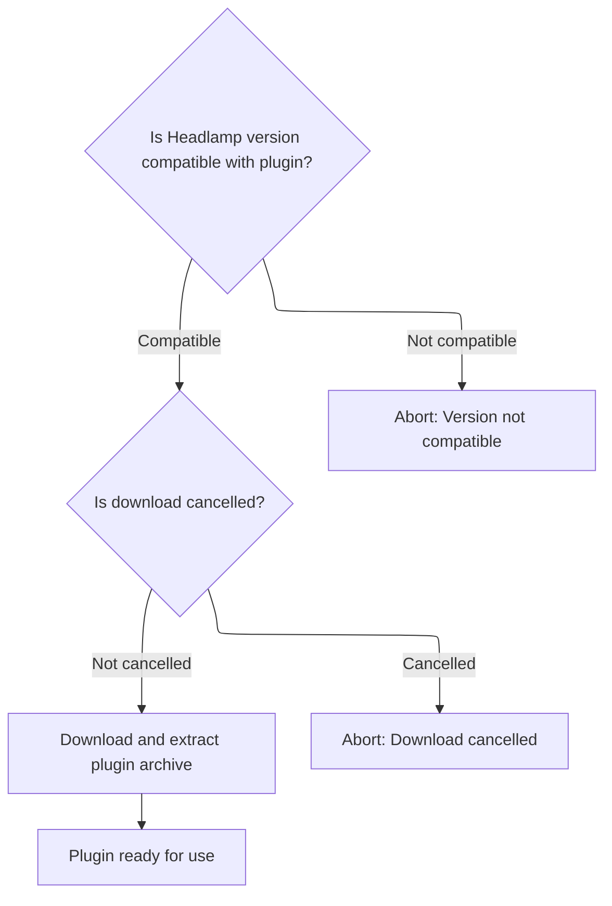

<SwmSnippet path="/app/electron/plugin-management.ts" line="485">

---

We validate compatibility, set up a temp extraction folder, and kick off the main archive download. Progress is reported for feedback.

```typescript
  // Check if the plugin is compatible with the current Headlamp version
  if (headlampVersion) {
    if (progressCallback) {
      progressCallback({ type: 'info', message: 'Checking compatibility with Headlamp version' });
    }
    if (semver.satisfies(headlampVersion, pluginInfo.versionCompat)) {
      if (progressCallback) {
        progressCallback({ type: 'info', message: 'Headlamp version is compatible' });
      }
    } else {
      throw new Error('Headlamp version is not compatible with the plugin');
    }
  }

  if (signal && signal.aborted) {
    throw new Error('Download cancelled');
  }

  // Create temporary folder for extraction
  const tempDir = await fs.mkdtempSync(path.join(os.tmpdir(), 'headlamp-plugin-temp-'));
  // Defaulting to '' should never happen if recursive is true. So this is for the type
  // checker only.
  const tempFolder = fs.mkdirSync(path.join(tempDir, pluginName), { recursive: true }) ?? '';

  // First, download and extract the main archive
  if (progressCallback) {
    progressCallback({ type: 'info', message: 'Downloading main plugin archive' });
  }

```

---

</SwmSnippet>

<SwmSnippet path="/app/electron/plugin-management.ts" line="514">

---

After <SwmPath>[plugins/…/bin/pluginctl.js](plugins/pluginctl/bin/pluginctl.js)</SwmPath>, we're back in <SwmPath>[app/electron/plugin-management.ts](app/electron/plugin-management.ts)</SwmPath> to actually download and extract the plugin archive. We use <SwmToken path="app/electron/plugin-management.ts" pos="514:3:3" line-data="  await downloadAndExtractSingleArchive(">`downloadAndExtractSingleArchive`</SwmToken>, passing <SwmToken path="app/electron/plugin-management.ts" pos="518:1:1" line-data="    progressCallback,">`progressCallback`</SwmToken> for feedback and signal for cancellation. This step gets the plugin files into the temp folder, ready for further setup.

```typescript
  await downloadAndExtractSingleArchive(
    pluginInfo.archiveURL,
    pluginInfo.archiveChecksum,
    tempFolder,
    progressCallback,
    signal
  );

```

---

</SwmSnippet>

### Downloading and extracting plugin archives safely

See <SwmLink doc-title="Downloading and Extracting Plugin Archives">[Downloading and Extracting Plugin Archives](/.swm/downloading-and-extracting-plugin-archives.8f5qw6tv.sw.md)</SwmLink>

### Handling <SwmToken path="app/electron/plugin-management.ts" pos="607:7:9" line-data="        message: `Downloading platform-specific file for ${file.arch}: ${path.basename(file.url)}`,">`platform-specific`</SwmToken> extra files

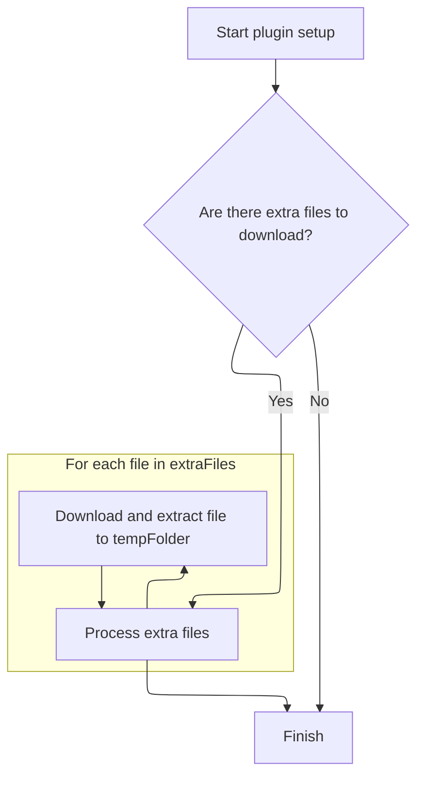

<SwmSnippet path="/app/electron/plugin-management.ts" line="522">

---

After extracting the main archive, we call <SwmToken path="app/electron/plugin-management.ts" pos="522:3:3" line-data="  await downloadExtraFiles(pluginInfo.extraFiles, tempFolder, progressCallback, signal);">`downloadExtraFiles`</SwmToken> to grab any <SwmToken path="app/electron/plugin-management.ts" pos="607:7:9" line-data="        message: `Downloading platform-specific file for ${file.arch}: ${path.basename(file.url)}`,">`platform-specific`</SwmToken> binaries or resources. These get put in the same temp folder, and progress is reported so users know what's happening. This step is needed for plugins that ship extra files for different platforms.

```typescript
  await downloadExtraFiles(pluginInfo.extraFiles, tempFolder, progressCallback, signal);

```

---

</SwmSnippet>

### Filtering and downloading <SwmToken path="app/electron/plugin-management.ts" pos="607:7:9" line-data="        message: `Downloading platform-specific file for ${file.arch}: ${path.basename(file.url)}`,">`platform-specific`</SwmToken> files

```mermaid
%%{init: {"flowchart": {"defaultRenderer": "elk"}} }%%
flowchart TD
  node1["Start: Check for extra files"] --> node2{"Are extra files provided?"}
  click node1 openCode "app/electron/plugin-management.ts:571:577"
  node2 -->|"No"| node3["End"]
  click node2 openCode "app/electron/plugin-management.ts:577:579"
  node2 -->|"Yes"| node4["Find files matching platform/architecture"]
  click node4 openCode "app/electron/plugin-management.ts:580:582"
  node4 --> node5{"Are matching files found?"}
  click node5 openCode "app/electron/plugin-management.ts:582:589"
  node5 -->|"No"| node6["Report: No matching files found"]
  click node6 openCode "app/electron/plugin-management.ts:583:589"
  node6 --> node3
  node5 -->|"Yes"| node7["Prepare for file download"]
  click node7 openCode "app/electron/plugin-management.ts:592:597"
  node7 --> node8["Process each matching file"]
  click node8 openCode "app/electron/plugin-management.ts:599:666"
  subgraph loop1["For each matching file"]
    node8 --> node9{"Is download cancelled?"}
    click node9 openCode "app/electron/plugin-management.ts:600:601"
    node9 -->|"Yes"| node3
    node9 -->|"No"| node10["Report: Downloading file"]
    click node10 openCode "app/electron/plugin-management.ts:604:609"
    node10 --> node11["Download and extract file"]
    click node11 openCode "app/electron/plugin-management.ts:611:619"
    node11 --> node12["Process output mappings"]
    click node12 openCode "app/electron/plugin-management.ts:634:666"
    subgraph loop2["For each output mapping"]
      node12 --> node13{"Does file need to be moved/renamed?"}
      click node13 openCode "app/electron/plugin-management.ts:635:648"
      node13 -->|"No"| node12
      node13 -->|"Yes"| node14["Move/rename file"]
      click node14 openCode "app/electron/plugin-management.ts:651:652"
      node14 --> node15["Report: File moved"]
      click node15 openCode "app/electron/plugin-management.ts:660:665"
      node15 --> node12
    end
    node12 --> node8
  end
  node8 --> node16["Report: All files downloaded"]
  click node16 openCode "app/electron/plugin-management.ts:669:674"
  node16 --> node3
  click node3 openCode "app/electron/plugin-management.ts:675:675"

classDef HeadingStyle fill:#777777,stroke:#333,stroke-width:2px;

%% Swimm:
%% %%{init: {"flowchart": {"defaultRenderer": "elk"}} }%%
%% flowchart TD
%%   node1["Start: Check for extra files"] --> node2{"Are extra files provided?"}
%%   click node1 openCode "<SwmPath>[app/electron/plugin-management.ts](app/electron/plugin-management.ts)</SwmPath>:571:577"
%%   node2 -->|"No"| node3["End"]
%%   click node2 openCode "<SwmPath>[app/electron/plugin-management.ts](app/electron/plugin-management.ts)</SwmPath>:577:579"
%%   node2 -->|"Yes"| node4["Find files matching platform/architecture"]
%%   click node4 openCode "<SwmPath>[app/electron/plugin-management.ts](app/electron/plugin-management.ts)</SwmPath>:580:582"
%%   node4 --> node5{"Are matching files found?"}
%%   click node5 openCode "<SwmPath>[app/electron/plugin-management.ts](app/electron/plugin-management.ts)</SwmPath>:582:589"
%%   node5 -->|"No"| node6["Report: No matching files found"]
%%   click node6 openCode "<SwmPath>[app/electron/plugin-management.ts](app/electron/plugin-management.ts)</SwmPath>:583:589"
%%   node6 --> node3
%%   node5 -->|"Yes"| node7["Prepare for file download"]
%%   click node7 openCode "<SwmPath>[app/electron/plugin-management.ts](app/electron/plugin-management.ts)</SwmPath>:592:597"
%%   node7 --> node8["Process each matching file"]
%%   click node8 openCode "<SwmPath>[app/electron/plugin-management.ts](app/electron/plugin-management.ts)</SwmPath>:599:666"
%%   subgraph loop1["For each matching file"]
%%     node8 --> node9{"Is download cancelled?"}
%%     click node9 openCode "<SwmPath>[app/electron/plugin-management.ts](app/electron/plugin-management.ts)</SwmPath>:600:601"
%%     node9 -->|"Yes"| node3
%%     node9 -->|"No"| node10["Report: Downloading file"]
%%     click node10 openCode "<SwmPath>[app/electron/plugin-management.ts](app/electron/plugin-management.ts)</SwmPath>:604:609"
%%     node10 --> node11["Download and extract file"]
%%     click node11 openCode "<SwmPath>[app/electron/plugin-management.ts](app/electron/plugin-management.ts)</SwmPath>:611:619"
%%     node11 --> node12["Process output mappings"]
%%     click node12 openCode "<SwmPath>[app/electron/plugin-management.ts](app/electron/plugin-management.ts)</SwmPath>:634:666"
%%     subgraph loop2["For each output mapping"]
%%       node12 --> node13{"Does file need to be moved/renamed?"}
%%       click node13 openCode "<SwmPath>[app/electron/plugin-management.ts](app/electron/plugin-management.ts)</SwmPath>:635:648"
%%       node13 -->|"No"| node12
%%       node13 -->|"Yes"| node14["Move/rename file"]
%%       click node14 openCode "<SwmPath>[app/electron/plugin-management.ts](app/electron/plugin-management.ts)</SwmPath>:651:652"
%%       node14 --> node15["Report: File moved"]
%%       click node15 openCode "<SwmPath>[app/electron/plugin-management.ts](app/electron/plugin-management.ts)</SwmPath>:660:665"
%%       node15 --> node12
%%     end
%%     node12 --> node8
%%   end
%%   node8 --> node16["Report: All files downloaded"]
%%   click node16 openCode "<SwmPath>[app/electron/plugin-management.ts](app/electron/plugin-management.ts)</SwmPath>:669:674"
%%   node16 --> node3
%%   click node3 openCode "<SwmPath>[app/electron/plugin-management.ts](app/electron/plugin-management.ts)</SwmPath>:675:675"
%% 
%% classDef HeadingStyle fill:#777777,stroke:#333,stroke-width:2px;
```

<SwmSnippet path="/app/electron/plugin-management.ts" line="571">

---

In <SwmToken path="app/electron/plugin-management.ts" pos="571:4:4" line-data="async function downloadExtraFiles(">`downloadExtraFiles`</SwmToken>, we first check if there are any extra files. If there are, we use <SwmToken path="app/electron/plugin-management.ts" pos="580:14:14" line-data="  const { matchingExtraFiles, currentArchString } = getMatchingExtraFiles(extraFiles);">`getMatchingExtraFiles`</SwmToken> to filter for the current platform/arch. If nothing matches, we report it and stop. Otherwise, we make sure the bin directory exists and start downloading each matching file, reporting progress and handling errors. After downloading, we move files to their output locations, handling renaming and cleanup as needed.

```typescript
async function downloadExtraFiles(
  extraFiles: ArtifactHubHeadlampPkg['extraFiles'],
  extractFolder: string,
  progressCallback: null | ProgressCallback,
  signal: AbortSignal | null
): Promise<void> {
  if (!extraFiles || Object.keys(extraFiles).length === 0) {
    return;
  }
  const { matchingExtraFiles, currentArchString } = getMatchingExtraFiles(extraFiles);

```

---

</SwmSnippet>

<SwmSnippet path="/app/electron/plugin-management.ts" line="547">

---

GetMatchingExtraFiles grabs the current platform and arch, builds a string like <SwmToken path="app/electron/plugin-management.ts" pos="82:28:30" line-data="   * &#39;win32/x64&#39; &#39;darwin/arm64&#39; &#39;darwin/x64&#39; &#39;linux/arm64&#39; &#39;linux/x64">`linux/x64`</SwmToken>, and filters <SwmToken path="app/electron/plugin-management.ts" pos="547:6:6" line-data="export function getMatchingExtraFiles(extraFiles: ArtifactHubHeadlampPkg[&#39;extraFiles&#39;]): {">`extraFiles`</SwmToken> for matches. This way, only files meant for the user's system get downloaded.

```typescript
export function getMatchingExtraFiles(extraFiles: ArtifactHubHeadlampPkg['extraFiles']): {
  currentArchString: string;
  matchingExtraFiles: ExtraFile[];
} {
  const currentPlatform = os.platform();
  const currentArch = os.arch();
  const currentArchString = `${currentPlatform}/${currentArch}`;

  return {
    currentArchString: currentArchString,
    matchingExtraFiles: Object.values(extraFiles || {}).filter(
      file => file.arch.toLowerCase() === currentArchString.toLowerCase()
    ),
  };
}
```

---

</SwmSnippet>

<SwmSnippet path="/app/electron/plugin-management.ts" line="582">

---

After filtering for matching extra files, if none are found, we report it and exit early. If there are matches, we make sure the bin directory exists and start downloading each file, reporting progress as we go. This sets up the binaries for later steps handled by <SwmPath>[plugins/…/bin/pluginctl.js](plugins/pluginctl/bin/pluginctl.js)</SwmPath>.

```typescript
  if (matchingExtraFiles.length === 0) {
    if (progressCallback) {
      progressCallback({
        type: 'info',
        message: `No extra files found for platform ${currentArchString}`,
      });
    }
    return;
  }

  // Make sure bin directory exists
  const binDir = path.join(extractFolder, 'bin');
  if (!fs.existsSync(binDir)) {
    fs.mkdirSync(binDir, { recursive: true });
  }

  // Download and extract each matching file
  for (const file of matchingExtraFiles) {
    if (signal && signal.aborted) {
      throw new Error('Download cancelled');
    }

    if (progressCallback) {
      progressCallback({
        type: 'info',
        message: `Downloading platform-specific file for ${file.arch}: ${path.basename(file.url)}`,
      });
    }

```

---

</SwmSnippet>

<SwmSnippet path="/app/electron/plugin-management.ts" line="611">

---

We download and extract each extra file, reporting errors if they happen.

```typescript
    try {
      await downloadAndExtractSingleArchive(
        file.url,
        file.checksum,
        binDir,
        progressCallback,
        signal,
        0 // tarStrip
      );
```

---

</SwmSnippet>

<SwmSnippet path="/app/electron/plugin-management.ts" line="620">

---

We move files to their output locations, add .exe on Windows, and clean up after.

```typescript
    } catch (e) {
      if (progressCallback) {
        progressCallback({
          type: 'error',
          message: `Failed to download extra file ${file.url}: ${
            e instanceof Error ? e.message : String(e)
          }`,
        });
      } else {
        throw e;
      }
    }

    // move the files to the correct output location
    for (const value of Object.values(file.output)) {
      if (!value.output || !value.input || value.input === value.output) {
        continue;
      }
      let outputFile = path.join(binDir, value.output);
      // If on Windows, ensure that the output file ends with .exe
      // For example, minikube should be minikube.exe
      // If the extra file is a .js file, we do not add .exe
      if (os.platform() === 'win32' && !value.output.endsWith('.js')) {
        outputFile = path.join(binDir, value.output) + '.exe';
      }

      const inputFile = path.join(binDir, value.input);
      if (inputFile === outputFile) {
        continue;
      }

      fs.copyFileSync(inputFile, outputFile);
      fs.rmSync(inputFile);

      // remove the input file folder... if it's empty
      const inputDir = path.dirname(inputFile);
      if (fs.readdirSync(inputDir).length === 0) {
        fs.rmdirSync(inputDir);
      }

      if (progressCallback) {
        progressCallback({
          type: 'info',
          message: `Moved platform-specific file to ${outputFile}`,
        });
      }
    }
```

---

</SwmSnippet>

<SwmSnippet path="/app/electron/plugin-management.ts" line="669">

---

After all extra files are downloaded and moved, we report how many were handled for the current platform. This wraps up the extraction step and lets <SwmPath>[plugins/…/bin/pluginctl.js](plugins/pluginctl/bin/pluginctl.js)</SwmPath> know everything's ready for the next phase.

```typescript
  if (progressCallback) {
    progressCallback({
      type: 'info',
      message: `Downloaded ${matchingExtraFiles.length} extra files for ${currentArchString}`,
    });
  }
}
```

---

</SwmSnippet>

### Finalizing plugin metadata after extraction

<SwmSnippet path="/app/electron/plugin-management.ts" line="524">

---

After extraction, we update <SwmPath>[package.json](package.json)</SwmPath> with artifacthub metadata and set <SwmToken path="app/electron/plugin-management.ts" pos="534:3:3" line-data="  packageJSON.isManagedByHeadlampPlugin = true;">`isManagedByHeadlampPlugin`</SwmToken> to true. This marks the plugin as managed and gives Headlamp the info it needs for tracking and updates.

```typescript
  // Add artifacthub metadata to the plugin
  const packageJSON = JSON.parse(fs.readFileSync(`${tempFolder}/package.json`, 'utf8'));
  packageJSON.artifacthub = {
    name: pluginName,
    title: pluginInfo.display_name,
    url: `https://artifacthub.io/packages/headlamp/${pluginInfo.repository.name}/${pluginName}`,
    version: pluginInfo.version,
    repoName: pluginInfo.repository.name,
    author: pluginInfo.repository.user_alias,
  };
  packageJSON.isManagedByHeadlampPlugin = true;
  fs.writeFileSync(`${tempFolder}/package.json`, JSON.stringify(packageJSON, null, 2));

  return [pluginName, tempFolder];
}
```

---

</SwmSnippet>

## Replacing the old plugin with the new version

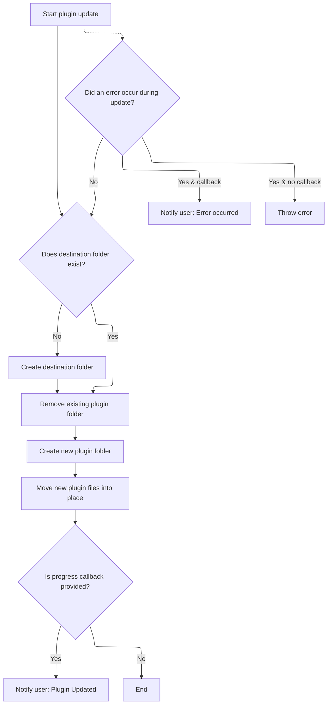

<SwmSnippet path="/app/electron/plugin-management.ts" line="279">

---

After extracting the new plugin, we remove the old plugin folder, create a new one, and move the new files into place. Progress is reported for success or errors. This makes sure the update is clean and atomic, so there are no leftover files.

```typescript
      // sleep(2000);  // comment out for testing

      // create the destination folder if it doesn't exist
      if (!fs.existsSync(destinationFolder)) {
        fs.mkdirSync(destinationFolder, { recursive: true });
      }

      // remove the existing plugin folder
      fs.rmdirSync(pluginDir, { recursive: true });

      // create the plugin folder
      fs.mkdirSync(pluginDir, { recursive: true });

      // move the plugin to the destination folder
      moveDirs(tempFolder, pluginDir);
      if (progressCallback) {
        progressCallback({ type: 'success', message: 'Plugin Updated' });
      }
    } catch (e) {
      if (progressCallback) {
        progressCallback({ type: 'error', message: e instanceof Error ? e.message : String(e) });
      } else {
        throw e;
      }
    }
  }
```

---

</SwmSnippet>

&nbsp;

*This is an auto-generated document by Swimm 🌊 and has not yet been verified by a human*

<SwmMeta version="3.0.0" repo-id="Z2l0aHViJTNBJTNBdHlwZXNjcmlwdC1oZWFkbGFtcCUzQSUzQXJpY2FyZG9sb3Blemc=" repo-name="typescript-headlamp"><sup>Powered by [Swimm](https://app.swimm.io/)</sup></SwmMeta>
