This document describes the flow for updating Kubernetes resources through a PATCH request. The flow ensures updates are sent to the correct cluster, manages authentication, and handles session and cache management if authentication fails.

# Where is this flow used?

This flow is used multiple times in the codebase as represented in the following diagram:

(Note - these are only some of the entry points of this flow)

```mermaid
graph TD;
      3e40fefa1670992d9a95ed99a1f2269c7e2d0f568cc61a9f8e8f6b397670a36c(frontend/…/v1/factories.ts::apiFactoryWithNamespace) --> 204f83a00fb70820fd25a6410ff1299f717260eae3da372ecbbbdc59e775a6b1(frontend/…/v1/factories.ts::simpleApiFactoryWithNamespace)

3e40fefa1670992d9a95ed99a1f2269c7e2d0f568cc61a9f8e8f6b397670a36c(frontend/…/v1/factories.ts::apiFactoryWithNamespace) --> baa2a3fe568435794ce15a7f1d4e6144fd642157b6c778dc554a58c6a2f77e19(frontend/…/v1/factories.ts::multipleApiFactoryWithNamespace)

204f83a00fb70820fd25a6410ff1299f717260eae3da372ecbbbdc59e775a6b1(frontend/…/v1/factories.ts::simpleApiFactoryWithNamespace) --> e6850e4b771f662474c39229d10f9872255a6a55d2e40a51dea746a89aef537c(frontend/…/v1/clusterRequests.ts::patch):::mainFlowStyle

204f83a00fb70820fd25a6410ff1299f717260eae3da372ecbbbdc59e775a6b1(frontend/…/v1/factories.ts::simpleApiFactoryWithNamespace) --> 6a3bf0904f16bb2ac813453d7d9edbc6f35c8604401a2f48bb1c50b0e9c5103e(frontend/…/v1/scaleApi.ts::apiScaleFactory)

6a3bf0904f16bb2ac813453d7d9edbc6f35c8604401a2f48bb1c50b0e9c5103e(frontend/…/v1/scaleApi.ts::apiScaleFactory) --> 4cd2cc1be8ede76f8aacc18230c2b93ed94379d9dec83ea4a8c600e0c58162f8(frontend/…/v1/scaleApi.ts::patch)

4cd2cc1be8ede76f8aacc18230c2b93ed94379d9dec83ea4a8c600e0c58162f8(frontend/…/v1/scaleApi.ts::patch) --> e6850e4b771f662474c39229d10f9872255a6a55d2e40a51dea746a89aef537c(frontend/…/v1/clusterRequests.ts::patch):::mainFlowStyle

baa2a3fe568435794ce15a7f1d4e6144fd642157b6c778dc554a58c6a2f77e19(frontend/…/v1/factories.ts::multipleApiFactoryWithNamespace) --> 204f83a00fb70820fd25a6410ff1299f717260eae3da372ecbbbdc59e775a6b1(frontend/…/v1/factories.ts::simpleApiFactoryWithNamespace)

d86ed78fbf2e13c724a9eaff4beabfe1d709c6e8ecb12dd16859025fe61c1f08(frontend/…/v1/factories.ts::apiFactory) --> 0a64466108d98c1725bf990ed4361ccdb3545bd3ecabf88410964c3c9c0ea257(frontend/…/v1/factories.ts::singleApiFactory)

d86ed78fbf2e13c724a9eaff4beabfe1d709c6e8ecb12dd16859025fe61c1f08(frontend/…/v1/factories.ts::apiFactory) --> a75e891440e1ed36b6e84857f71c17a3ae6d31870f2a33d9da491b0acef21f67(frontend/…/v1/factories.ts::multipleApiFactory)

0a64466108d98c1725bf990ed4361ccdb3545bd3ecabf88410964c3c9c0ea257(frontend/…/v1/factories.ts::singleApiFactory) --> e6850e4b771f662474c39229d10f9872255a6a55d2e40a51dea746a89aef537c(frontend/…/v1/clusterRequests.ts::patch):::mainFlowStyle

a75e891440e1ed36b6e84857f71c17a3ae6d31870f2a33d9da491b0acef21f67(frontend/…/v1/factories.ts::multipleApiFactory) --> 0a64466108d98c1725bf990ed4361ccdb3545bd3ecabf88410964c3c9c0ea257(frontend/…/v1/factories.ts::singleApiFactory)

e2c50bfb86c2151ea4882e17040349ffebb9340e732797959a79591c0320a428(frontend/…/configmap/Details.tsx::CronJobDetails) --> 1c81d81ec042e43a1561da8d90dd8725dafd9e35976b9464bd0a0d0db26a77bd(frontend/…/k8s/KubeObject.ts::KubeObject.patch)

e2c50bfb86c2151ea4882e17040349ffebb9340e732797959a79591c0320a428(frontend/…/configmap/Details.tsx::CronJobDetails) --> 48f4da296c5b22dffb9a4be1278f018869e47e339994a2c144736df85ee34e9c(frontend/…/configmap/Details.tsx::applySuspend)

1c81d81ec042e43a1561da8d90dd8725dafd9e35976b9464bd0a0d0db26a77bd(frontend/…/k8s/KubeObject.ts::KubeObject.patch) --> 4cd2cc1be8ede76f8aacc18230c2b93ed94379d9dec83ea4a8c600e0c58162f8(frontend/…/v1/scaleApi.ts::patch)

48f4da296c5b22dffb9a4be1278f018869e47e339994a2c144736df85ee34e9c(frontend/…/configmap/Details.tsx::applySuspend) --> 1c81d81ec042e43a1561da8d90dd8725dafd9e35976b9464bd0a0d0db26a77bd(frontend/…/k8s/KubeObject.ts::KubeObject.patch)

119586a7b93ae4f8017e02c6a337274a8a6556ec47bdad3bb231c8bae6b08bbe(frontend/…/project/NewProjectPopup.tsx::ProjectFromExistingNamespace) --> 1c81d81ec042e43a1561da8d90dd8725dafd9e35976b9464bd0a0d0db26a77bd(frontend/…/k8s/KubeObject.ts::KubeObject.patch)

414b045fd4d21ca12a8fdaddde3e9190c63869473a828680c1c8d599ddf6efb3(frontend/…/Resource/RestartButton.tsx::RestartButton) --> 1c81d81ec042e43a1561da8d90dd8725dafd9e35976b9464bd0a0d0db26a77bd(frontend/…/k8s/KubeObject.ts::KubeObject.patch)

414b045fd4d21ca12a8fdaddde3e9190c63869473a828680c1c8d599ddf6efb3(frontend/…/Resource/RestartButton.tsx::RestartButton) --> 1c06d937d08e269f7d3a16285622ef925460987c7f87a9b5fbe84c35c1da8c14(frontend/…/Resource/RestartButton.tsx::restartResource)

414b045fd4d21ca12a8fdaddde3e9190c63869473a828680c1c8d599ddf6efb3(frontend/…/Resource/RestartButton.tsx::RestartButton) --> 12236dc9d18bf6b52e973c83513b22f379d6e40eecb5e370a356594506d06309(frontend/…/Resource/RestartButton.tsx::handleSave)

1c06d937d08e269f7d3a16285622ef925460987c7f87a9b5fbe84c35c1da8c14(frontend/…/Resource/RestartButton.tsx::restartResource) --> 1c81d81ec042e43a1561da8d90dd8725dafd9e35976b9464bd0a0d0db26a77bd(frontend/…/k8s/KubeObject.ts::KubeObject.patch)

12236dc9d18bf6b52e973c83513b22f379d6e40eecb5e370a356594506d06309(frontend/…/Resource/RestartButton.tsx::handleSave) --> 1c06d937d08e269f7d3a16285622ef925460987c7f87a9b5fbe84c35c1da8c14(frontend/…/Resource/RestartButton.tsx::restartResource)


classDef mainFlowStyle color:#000000,fill:#7CB9F4
classDef rootsStyle color:#000000,fill:#00FFF4
classDef Style1 color:#000000,fill:#00FFAA
classDef Style2 color:#000000,fill:#FFFF00
classDef Style3 color:#000000,fill:#AA7CB9

%% Swimm:
%% graph TD;
%%       3e40fefa1670992d9a95ed99a1f2269c7e2d0f568cc61a9f8e8f6b397670a36c(<SwmPath>[frontend/…/v1/factories.ts](frontend/src/lib/k8s/api/v1/factories.ts)</SwmPath>::apiFactoryWithNamespace) --> 204f83a00fb70820fd25a6410ff1299f717260eae3da372ecbbbdc59e775a6b1(<SwmPath>[frontend/…/v1/factories.ts](frontend/src/lib/k8s/api/v1/factories.ts)</SwmPath>::simpleApiFactoryWithNamespace)
%% 
%% 3e40fefa1670992d9a95ed99a1f2269c7e2d0f568cc61a9f8e8f6b397670a36c(<SwmPath>[frontend/…/v1/factories.ts](frontend/src/lib/k8s/api/v1/factories.ts)</SwmPath>::apiFactoryWithNamespace) --> baa2a3fe568435794ce15a7f1d4e6144fd642157b6c778dc554a58c6a2f77e19(<SwmPath>[frontend/…/v1/factories.ts](frontend/src/lib/k8s/api/v1/factories.ts)</SwmPath>::multipleApiFactoryWithNamespace)
%% 
%% 204f83a00fb70820fd25a6410ff1299f717260eae3da372ecbbbdc59e775a6b1(<SwmPath>[frontend/…/v1/factories.ts](frontend/src/lib/k8s/api/v1/factories.ts)</SwmPath>::simpleApiFactoryWithNamespace) --> e6850e4b771f662474c39229d10f9872255a6a55d2e40a51dea746a89aef537c(<SwmPath>[frontend/…/v1/clusterRequests.ts](frontend/src/lib/k8s/api/v1/clusterRequests.ts)</SwmPath>::patch):::mainFlowStyle
%% 
%% 204f83a00fb70820fd25a6410ff1299f717260eae3da372ecbbbdc59e775a6b1(<SwmPath>[frontend/…/v1/factories.ts](frontend/src/lib/k8s/api/v1/factories.ts)</SwmPath>::simpleApiFactoryWithNamespace) --> 6a3bf0904f16bb2ac813453d7d9edbc6f35c8604401a2f48bb1c50b0e9c5103e(<SwmPath>[frontend/…/v1/scaleApi.ts](frontend/src/lib/k8s/api/v1/scaleApi.ts)</SwmPath>::apiScaleFactory)
%% 
%% 6a3bf0904f16bb2ac813453d7d9edbc6f35c8604401a2f48bb1c50b0e9c5103e(<SwmPath>[frontend/…/v1/scaleApi.ts](frontend/src/lib/k8s/api/v1/scaleApi.ts)</SwmPath>::apiScaleFactory) --> 4cd2cc1be8ede76f8aacc18230c2b93ed94379d9dec83ea4a8c600e0c58162f8(<SwmPath>[frontend/…/v1/scaleApi.ts](frontend/src/lib/k8s/api/v1/scaleApi.ts)</SwmPath>::patch)
%% 
%% 4cd2cc1be8ede76f8aacc18230c2b93ed94379d9dec83ea4a8c600e0c58162f8(<SwmPath>[frontend/…/v1/scaleApi.ts](frontend/src/lib/k8s/api/v1/scaleApi.ts)</SwmPath>::patch) --> e6850e4b771f662474c39229d10f9872255a6a55d2e40a51dea746a89aef537c(<SwmPath>[frontend/…/v1/clusterRequests.ts](frontend/src/lib/k8s/api/v1/clusterRequests.ts)</SwmPath>::patch):::mainFlowStyle
%% 
%% baa2a3fe568435794ce15a7f1d4e6144fd642157b6c778dc554a58c6a2f77e19(<SwmPath>[frontend/…/v1/factories.ts](frontend/src/lib/k8s/api/v1/factories.ts)</SwmPath>::multipleApiFactoryWithNamespace) --> 204f83a00fb70820fd25a6410ff1299f717260eae3da372ecbbbdc59e775a6b1(<SwmPath>[frontend/…/v1/factories.ts](frontend/src/lib/k8s/api/v1/factories.ts)</SwmPath>::simpleApiFactoryWithNamespace)
%% 
%% d86ed78fbf2e13c724a9eaff4beabfe1d709c6e8ecb12dd16859025fe61c1f08(<SwmPath>[frontend/…/v1/factories.ts](frontend/src/lib/k8s/api/v1/factories.ts)</SwmPath>::apiFactory) --> 0a64466108d98c1725bf990ed4361ccdb3545bd3ecabf88410964c3c9c0ea257(<SwmPath>[frontend/…/v1/factories.ts](frontend/src/lib/k8s/api/v1/factories.ts)</SwmPath>::singleApiFactory)
%% 
%% d86ed78fbf2e13c724a9eaff4beabfe1d709c6e8ecb12dd16859025fe61c1f08(<SwmPath>[frontend/…/v1/factories.ts](frontend/src/lib/k8s/api/v1/factories.ts)</SwmPath>::apiFactory) --> a75e891440e1ed36b6e84857f71c17a3ae6d31870f2a33d9da491b0acef21f67(<SwmPath>[frontend/…/v1/factories.ts](frontend/src/lib/k8s/api/v1/factories.ts)</SwmPath>::multipleApiFactory)
%% 
%% 0a64466108d98c1725bf990ed4361ccdb3545bd3ecabf88410964c3c9c0ea257(<SwmPath>[frontend/…/v1/factories.ts](frontend/src/lib/k8s/api/v1/factories.ts)</SwmPath>::singleApiFactory) --> e6850e4b771f662474c39229d10f9872255a6a55d2e40a51dea746a89aef537c(<SwmPath>[frontend/…/v1/clusterRequests.ts](frontend/src/lib/k8s/api/v1/clusterRequests.ts)</SwmPath>::patch):::mainFlowStyle
%% 
%% a75e891440e1ed36b6e84857f71c17a3ae6d31870f2a33d9da491b0acef21f67(<SwmPath>[frontend/…/v1/factories.ts](frontend/src/lib/k8s/api/v1/factories.ts)</SwmPath>::multipleApiFactory) --> 0a64466108d98c1725bf990ed4361ccdb3545bd3ecabf88410964c3c9c0ea257(<SwmPath>[frontend/…/v1/factories.ts](frontend/src/lib/k8s/api/v1/factories.ts)</SwmPath>::singleApiFactory)
%% 
%% e2c50bfb86c2151ea4882e17040349ffebb9340e732797959a79591c0320a428(<SwmPath>[frontend/…/configmap/Details.tsx](frontend/src/components/configmap/Details.tsx)</SwmPath>::CronJobDetails) --> 1c81d81ec042e43a1561da8d90dd8725dafd9e35976b9464bd0a0d0db26a77bd(<SwmPath>[frontend/…/k8s/KubeObject.ts](frontend/src/lib/k8s/KubeObject.ts)</SwmPath>::KubeObject.patch)
%% 
%% e2c50bfb86c2151ea4882e17040349ffebb9340e732797959a79591c0320a428(<SwmPath>[frontend/…/configmap/Details.tsx](frontend/src/components/configmap/Details.tsx)</SwmPath>::CronJobDetails) --> 48f4da296c5b22dffb9a4be1278f018869e47e339994a2c144736df85ee34e9c(<SwmPath>[frontend/…/configmap/Details.tsx](frontend/src/components/configmap/Details.tsx)</SwmPath>::applySuspend)
%% 
%% 1c81d81ec042e43a1561da8d90dd8725dafd9e35976b9464bd0a0d0db26a77bd(<SwmPath>[frontend/…/k8s/KubeObject.ts](frontend/src/lib/k8s/KubeObject.ts)</SwmPath>::KubeObject.patch) --> 4cd2cc1be8ede76f8aacc18230c2b93ed94379d9dec83ea4a8c600e0c58162f8(<SwmPath>[frontend/…/v1/scaleApi.ts](frontend/src/lib/k8s/api/v1/scaleApi.ts)</SwmPath>::patch)
%% 
%% 48f4da296c5b22dffb9a4be1278f018869e47e339994a2c144736df85ee34e9c(<SwmPath>[frontend/…/configmap/Details.tsx](frontend/src/components/configmap/Details.tsx)</SwmPath>::applySuspend) --> 1c81d81ec042e43a1561da8d90dd8725dafd9e35976b9464bd0a0d0db26a77bd(<SwmPath>[frontend/…/k8s/KubeObject.ts](frontend/src/lib/k8s/KubeObject.ts)</SwmPath>::KubeObject.patch)
%% 
%% 119586a7b93ae4f8017e02c6a337274a8a6556ec47bdad3bb231c8bae6b08bbe(<SwmPath>[frontend/…/project/NewProjectPopup.tsx](frontend/src/components/project/NewProjectPopup.tsx)</SwmPath>::ProjectFromExistingNamespace) --> 1c81d81ec042e43a1561da8d90dd8725dafd9e35976b9464bd0a0d0db26a77bd(<SwmPath>[frontend/…/k8s/KubeObject.ts](frontend/src/lib/k8s/KubeObject.ts)</SwmPath>::KubeObject.patch)
%% 
%% 414b045fd4d21ca12a8fdaddde3e9190c63869473a828680c1c8d599ddf6efb3(<SwmPath>[frontend/…/Resource/RestartButton.tsx](frontend/src/components/common/Resource/RestartButton.tsx)</SwmPath>::RestartButton) --> 1c81d81ec042e43a1561da8d90dd8725dafd9e35976b9464bd0a0d0db26a77bd(<SwmPath>[frontend/…/k8s/KubeObject.ts](frontend/src/lib/k8s/KubeObject.ts)</SwmPath>::KubeObject.patch)
%% 
%% 414b045fd4d21ca12a8fdaddde3e9190c63869473a828680c1c8d599ddf6efb3(<SwmPath>[frontend/…/Resource/RestartButton.tsx](frontend/src/components/common/Resource/RestartButton.tsx)</SwmPath>::RestartButton) --> 1c06d937d08e269f7d3a16285622ef925460987c7f87a9b5fbe84c35c1da8c14(<SwmPath>[frontend/…/Resource/RestartButton.tsx](frontend/src/components/common/Resource/RestartButton.tsx)</SwmPath>::restartResource)
%% 
%% 414b045fd4d21ca12a8fdaddde3e9190c63869473a828680c1c8d599ddf6efb3(<SwmPath>[frontend/…/Resource/RestartButton.tsx](frontend/src/components/common/Resource/RestartButton.tsx)</SwmPath>::RestartButton) --> 12236dc9d18bf6b52e973c83513b22f379d6e40eecb5e370a356594506d06309(<SwmPath>[frontend/…/Resource/RestartButton.tsx](frontend/src/components/common/Resource/RestartButton.tsx)</SwmPath>::handleSave)
%% 
%% 1c06d937d08e269f7d3a16285622ef925460987c7f87a9b5fbe84c35c1da8c14(<SwmPath>[frontend/…/Resource/RestartButton.tsx](frontend/src/components/common/Resource/RestartButton.tsx)</SwmPath>::restartResource) --> 1c81d81ec042e43a1561da8d90dd8725dafd9e35976b9464bd0a0d0db26a77bd(<SwmPath>[frontend/…/k8s/KubeObject.ts](frontend/src/lib/k8s/KubeObject.ts)</SwmPath>::KubeObject.patch)
%% 
%% 12236dc9d18bf6b52e973c83513b22f379d6e40eecb5e370a356594506d06309(<SwmPath>[frontend/…/Resource/RestartButton.tsx](frontend/src/components/common/Resource/RestartButton.tsx)</SwmPath>::handleSave) --> 1c06d937d08e269f7d3a16285622ef925460987c7f87a9b5fbe84c35c1da8c14(<SwmPath>[frontend/…/Resource/RestartButton.tsx](frontend/src/components/common/Resource/RestartButton.tsx)</SwmPath>::restartResource)
%% 
%% 
%% classDef mainFlowStyle color:#000000,fill:#7CB9F4
%% classDef rootsStyle color:#000000,fill:#00FFF4
%% classDef Style1 color:#000000,fill:#00FFAA
%% classDef Style2 color:#000000,fill:#FFFF00
%% classDef Style3 color:#000000,fill:#AA7CB9
```



# Preparing and Dispatching the Patch Request


<SwmSnippet path="/frontend/src/lib/k8s/api/v1/clusterRequests.ts" line="244">

---

Patch sets up the PATCH request by serializing the payload, configuring headers, and determining the cluster context. It then hands off the actual network call to <SwmToken path="frontend/src/lib/k8s/api/v1/clusterRequests.ts" pos="261:3:3" line-data="  return clusterRequest(url, opts);">`clusterRequest`</SwmToken>, which takes care of sending the request and handling cluster-specific logic, errors, and authentication.

```typescript
export function patch(
  url: string,
  json: any,
  autoLogoutOnAuthError = true,
  options: ClusterRequestParams = {}
) {
  const { cluster: clusterName, ...requestOptions } = options;
  const body = JSON.stringify(json);
  const cluster = clusterName || getCluster() || '';
  const opts = {
    method: 'PATCH',
    body,
    headers: { ...JSON_HEADERS, 'Content-Type': 'application/merge-patch+json' },
    autoLogoutOnAuthError,
    cluster,
    ...requestOptions,
  };
  return clusterRequest(url, opts);
}
```

---

</SwmSnippet>

# Handling Cluster-Specific Request Logic


<SwmSnippet path="/frontend/src/lib/k8s/api/v1/clusterRequests.ts" line="122">

---

In <SwmToken path="frontend/src/lib/k8s/api/v1/clusterRequests.ts" pos="122:6:6" line-data="export async function clusterRequest(">`clusterRequest`</SwmToken>, we build the request with cluster-specific headers and kubeconfig if needed, set up a timeout using <SwmToken path="frontend/src/lib/k8s/api/v1/clusterRequests.ts" pos="157:9:9" line-data="  const controller = new AbortController();">`AbortController`</SwmToken>, and handle backend-driven reloads via the <SwmToken path="frontend/src/lib/k8s/api/v1/clusterRequests.ts" pos="185:14:16" line-data="  const headerVal = response.headers.get(&#39;X-Reload&#39;);">`X-Reload`</SwmToken> header. If we get a 401 and <SwmToken path="frontend/src/lib/k8s/api/v1/clusterRequests.ts" pos="130:1:1" line-data="    autoLogoutOnAuthError?: boolean;">`autoLogoutOnAuthError`</SwmToken> is set, we call logout to clear the user's session and cached queries.

```typescript
export async function clusterRequest(
  path: string,
  params: ClusterRequestParams = {},
  queryParams?: QueryParameters
): Promise<any> {
  interface RequestHeaders {
    Authorization?: string;
    cluster?: string;
    autoLogoutOnAuthError?: boolean;
    [otherHeader: string]: any;
  }

  const {
    timeout = DEFAULT_TIMEOUT,
    cluster: paramsCluster,
    autoLogoutOnAuthError = true,
    isJSON = true,
    ...otherParams
  } = params;

  const userID = getUserIdFromLocalStorage();
  const opts: { headers: RequestHeaders } = Object.assign({ headers: {} }, otherParams);
  const cluster = paramsCluster || '';

  let fullPath = path;
  if (cluster) {
    const kubeconfig = await findKubeconfigByClusterName(cluster);
    if (kubeconfig !== null) {
      opts.headers['KUBECONFIG'] = kubeconfig;
      opts.headers['X-HEADLAMP-USER-ID'] = userID;
    }

    fullPath = combinePath(`/${CLUSTERS_PREFIX}/${cluster}`, path);
  }

  const controller = new AbortController();
  const id = setTimeout(() => controller.abort(), timeout);

  let url = combinePath(getAppUrl(), fullPath);
  url += asQuery(queryParams);
  const requestData = {
    signal: controller.signal,
    credentials: 'include' as RequestCredentials,
    ...opts,
  };
  if (isBackstage()) {
    requestData.headers = addBackstageAuthHeaders(requestData.headers);
  }
  let response: Response = new Response(undefined, { status: 502, statusText: 'Unreachable' });
  try {
    response = await fetch(url, requestData);
  } catch (err) {
    if (err instanceof Error) {
      if (err.name === 'AbortError') {
        response = new Response(undefined, { status: 408, statusText: 'Request timed-out' });
      }
    }
  } finally {
    clearTimeout(id);
  }

  // The backend signals through this header that it wants a reload.
  // See plugins.go
  const headerVal = response.headers.get('X-Reload');
  if (headerVal && headerVal.indexOf('reload') !== -1) {
    window.location.reload();
  }

  if (!response.ok) {
    const { status, statusText } = response;
    if (autoLogoutOnAuthError && status === 401 && opts.headers.Authorization) {
      console.error('Logging out due to auth error', { status, statusText, path });
      logout(cluster);
    }

```

---

</SwmSnippet>

## Clearing User Session and Cluster Cache

<SwmSnippet path="/frontend/src/lib/auth.ts" line="131">

---

Logout calls <SwmToken path="frontend/src/lib/auth.ts" pos="132:3:3" line-data="  return setToken(cluster, null).then(() =&gt; {">`setToken`</SwmToken> to clear the token for the cluster, then removes cached queries for authentication and cluster-specific user info to make sure nothing stale is left.

```typescript
export async function logout(cluster: string) {
  return setToken(cluster, null).then(() => {
    queryClient.removeQueries({ queryKey: ['auth'], exact: false });
    queryClient.removeQueries({ queryKey: ['clusterMe', cluster], exact: true });
  });
}
```

---

</SwmSnippet>

## Setting or Clearing the Cluster Token


<SwmSnippet path="/frontend/src/lib/auth.ts" line="108">

---

SetToken checks for an override function to set the token; if none is found, it uses <SwmToken path="frontend/src/lib/auth.ts" pos="114:3:3" line-data="  return setCookieToken(cluster, token).then(result =&gt; {">`setCookieToken`</SwmToken>. After updating the token, it either invalidates or removes <SwmToken path="frontend/src/lib/auth.ts" pos="116:12:12" line-data="      queryClient.invalidateQueries({ queryKey: [&#39;clusterMe&#39;, cluster], exact: true });">`clusterMe`</SwmToken> queries to keep the cache in sync with the authentication state.

```typescript
export function setToken(cluster: string, token: string | null) {
  const setTokenMethodToUse = store.getState().ui.functionsToOverride.setToken;
  if (setTokenMethodToUse) {
    return Promise.resolve(setTokenMethodToUse(cluster, token));
  }

  return setCookieToken(cluster, token).then(result => {
    if (token) {
      queryClient.invalidateQueries({ queryKey: ['clusterMe', cluster], exact: true });
    } else {
      queryClient.removeQueries({ queryKey: ['clusterMe', cluster], exact: true });
    }

    return result;
  });
}
```

---

</SwmSnippet>

## Persisting Token via Backend and Handling Response

<SwmSnippet path="/frontend/src/lib/auth.ts" line="79">

---

SetCookieToken sends the token to the backend using <SwmToken path="frontend/src/lib/auth.ts" pos="81:9:9" line-data="    const response = await backendFetch(`/clusters/${cluster}/set-token`, {">`backendFetch`</SwmToken>, which handles credentials, custom headers, and error handling. If the backend doesn't confirm, it throws an error.

```typescript
async function setCookieToken(cluster: string, token: string | null) {
  try {
    const response = await backendFetch(`/clusters/${cluster}/set-token`, {
      method: 'POST',
      headers: {
        'Content-Type': 'application/json',
        ...getHeadlampAPIHeaders(),
      },
      body: JSON.stringify({ token }),
    });

    if (!response.ok) {
      throw new Error(`Failed to set cookie token`);
    }
    return true;
  } catch (error) {
    console.error('Error setting cookie token:', error);
    throw error;
  }
}
```

---

</SwmSnippet>

<SwmSnippet path="/frontend/src/lib/k8s/api/v2/fetch.ts" line="38">

---

BackendFetch builds the request with credentials and custom auth headers, combines the app URL, and reloads the page if the backend asks. If the response isn't OK, it parses the error and throws an <SwmToken path="frontend/src/lib/k8s/api/v2/fetch.ts" pos="59:5:5" line-data="    throw new ApiError(maybeErrorMessage ?? &#39;Unreachable&#39;, { status: response.status });">`ApiError`</SwmToken>.

```typescript
export async function backendFetch(url: string | URL, init: RequestInit = {}) {
  // Always include credentials
  init.credentials = 'include';
  init.headers = addBackstageAuthHeaders(init.headers);
  const response = await fetch(makeUrl([getAppUrl(), url]), init);

  // The backend signals through this header that it wants a reload.
  // See plugins.go
  const headerVal = response.headers.get('X-Reload');
  if (headerVal && headerVal.indexOf('reload') !== -1) {
    window.location.reload();
  }

  if (!response.ok) {
    // Try to parse error message from response
    let maybeErrorMessage: string | undefined;
    try {
      const body = await response.json();
      maybeErrorMessage = typeof body === 'string' ? body : body.message;
    } catch (e) {}

    throw new ApiError(maybeErrorMessage ?? 'Unreachable', { status: response.status });
  }

  return response;
}
```

---

</SwmSnippet>

## Finalizing the Cluster Request and Error Handling


<SwmSnippet path="/frontend/src/lib/k8s/api/v1/clusterRequests.ts" line="197">

---

After returning from logout in <SwmToken path="frontend/src/lib/k8s/api/v1/clusterRequests.ts" pos="122:6:6" line-data="export async function clusterRequest(">`clusterRequest`</SwmToken>, we parse any error message from the response and reject the promise with a detailed error, making sure the caller knows exactly what failed.

```typescript
    let message = statusText;
    try {
      if (isJSON) {
        const json = await response.json();
        message += ` - ${json.message}`;
      }
    } catch (err) {
      console.error(
        'Unable to parse error json at url:',
        url,
        { err },
        'with request data:',
        requestData
      );
    }

    const error = new Error(message) as ApiError;
    error.status = status;
    return Promise.reject(error);
  }

  if (!isJSON) {
    return Promise.resolve(response);
  }

  return response.json();
}
```

---

</SwmSnippet>

&nbsp;

*This is an auto-generated document by Swimm 🌊 and has not yet been verified by a human*

<SwmMeta version="3.0.0" repo-id="Z2l0aHViJTNBJTNBdHlwZXNjcmlwdC1oZWFkbGFtcCUzQSUzQXJpY2FyZG9sb3Blemc=" repo-name="typescript-headlamp"><sup>Powered by [Swimm](https://app.swimm.io/)</sup></SwmMeta>
