This document describes how updates are applied to Kubernetes resources through patch requests. Users can trigger this flow by performing actions such as restarting resources, applying changes, or creating projects from existing namespaces. The flow receives the changes and resource identifiers, then sends a patch request to update the resource in the appropriate cluster.

# Where is this flow used?

This flow is used multiple times in the codebase as represented in the following diagram:

(Note - these are only some of the entry points of this flow)

```mermaid
graph TD;
      e2c50bfb86c2151ea4882e17040349ffebb9340e732797959a79591c0320a428(frontend/…/configmap/Details.tsx::CronJobDetails) --> 1c81d81ec042e43a1561da8d90dd8725dafd9e35976b9464bd0a0d0db26a77bd(frontend/…/k8s/KubeObject.ts::KubeObject.patch)

e2c50bfb86c2151ea4882e17040349ffebb9340e732797959a79591c0320a428(frontend/…/configmap/Details.tsx::CronJobDetails) --> 48f4da296c5b22dffb9a4be1278f018869e47e339994a2c144736df85ee34e9c(frontend/…/configmap/Details.tsx::applySuspend)

48f4da296c5b22dffb9a4be1278f018869e47e339994a2c144736df85ee34e9c(frontend/…/configmap/Details.tsx::applySuspend) --> 1c81d81ec042e43a1561da8d90dd8725dafd9e35976b9464bd0a0d0db26a77bd(frontend/…/k8s/KubeObject.ts::KubeObject.patch)

119586a7b93ae4f8017e02c6a337274a8a6556ec47bdad3bb231c8bae6b08bbe(frontend/…/project/NewProjectPopup.tsx::ProjectFromExistingNamespace) --> 1c81d81ec042e43a1561da8d90dd8725dafd9e35976b9464bd0a0d0db26a77bd(frontend/…/k8s/KubeObject.ts::KubeObject.patch)

414b045fd4d21ca12a8fdaddde3e9190c63869473a828680c1c8d599ddf6efb3(frontend/…/Resource/RestartButton.tsx::RestartButton) --> 1c81d81ec042e43a1561da8d90dd8725dafd9e35976b9464bd0a0d0db26a77bd(frontend/…/k8s/KubeObject.ts::KubeObject.patch)

414b045fd4d21ca12a8fdaddde3e9190c63869473a828680c1c8d599ddf6efb3(frontend/…/Resource/RestartButton.tsx::RestartButton) --> 1c06d937d08e269f7d3a16285622ef925460987c7f87a9b5fbe84c35c1da8c14(frontend/…/Resource/RestartButton.tsx::restartResource)

414b045fd4d21ca12a8fdaddde3e9190c63869473a828680c1c8d599ddf6efb3(frontend/…/Resource/RestartButton.tsx::RestartButton) --> 12236dc9d18bf6b52e973c83513b22f379d6e40eecb5e370a356594506d06309(frontend/…/Resource/RestartButton.tsx::handleSave)

1c06d937d08e269f7d3a16285622ef925460987c7f87a9b5fbe84c35c1da8c14(frontend/…/Resource/RestartButton.tsx::restartResource) --> 1c81d81ec042e43a1561da8d90dd8725dafd9e35976b9464bd0a0d0db26a77bd(frontend/…/k8s/KubeObject.ts::KubeObject.patch)

12236dc9d18bf6b52e973c83513b22f379d6e40eecb5e370a356594506d06309(frontend/…/Resource/RestartButton.tsx::handleSave) --> 1c06d937d08e269f7d3a16285622ef925460987c7f87a9b5fbe84c35c1da8c14(frontend/…/Resource/RestartButton.tsx::restartResource)

26a51a9212404d508cf516be481966428a0f008ea242a8d2f84a609d83f45f00(frontend/…/Resource/RestartMultipleButton.tsx::RestartMultipleButton) --> 1c81d81ec042e43a1561da8d90dd8725dafd9e35976b9464bd0a0d0db26a77bd(frontend/…/k8s/KubeObject.ts::KubeObject.patch)

26a51a9212404d508cf516be481966428a0f008ea242a8d2f84a609d83f45f00(frontend/…/Resource/RestartMultipleButton.tsx::RestartMultipleButton) --> 6448c8fc7d113499242618d9ab8d7680dac19fe8e87705fd8d8ec8f7c819332b(frontend/…/Resource/RestartMultipleButton.tsx::restartResources)

26a51a9212404d508cf516be481966428a0f008ea242a8d2f84a609d83f45f00(frontend/…/Resource/RestartMultipleButton.tsx::RestartMultipleButton) --> b1e6887b4ba551680f30390cfeb468e33fcb5c6438acd24b7ed3eb4af912f430(frontend/…/Resource/RestartMultipleButton.tsx::handleRestart)

6448c8fc7d113499242618d9ab8d7680dac19fe8e87705fd8d8ec8f7c819332b(frontend/…/Resource/RestartMultipleButton.tsx::restartResources) --> 1c81d81ec042e43a1561da8d90dd8725dafd9e35976b9464bd0a0d0db26a77bd(frontend/…/k8s/KubeObject.ts::KubeObject.patch)

b1e6887b4ba551680f30390cfeb468e33fcb5c6438acd24b7ed3eb4af912f430(frontend/…/Resource/RestartMultipleButton.tsx::handleRestart) --> 6448c8fc7d113499242618d9ab8d7680dac19fe8e87705fd8d8ec8f7c819332b(frontend/…/Resource/RestartMultipleButton.tsx::restartResources)

b49f2f63033e3d9945e700a720b8c3399753968875f2706b487e89bb7b6ce8ce(frontend/…/project/NewProjectPopup.tsx::handleCreate) --> 1c81d81ec042e43a1561da8d90dd8725dafd9e35976b9464bd0a0d0db26a77bd(frontend/…/k8s/KubeObject.ts::KubeObject.patch)


classDef mainFlowStyle color:#000000,fill:#7CB9F4
classDef rootsStyle color:#000000,fill:#00FFF4
classDef Style1 color:#000000,fill:#00FFAA
classDef Style2 color:#000000,fill:#FFFF00
classDef Style3 color:#000000,fill:#AA7CB9

%% Swimm:
%% graph TD;
%%       e2c50bfb86c2151ea4882e17040349ffebb9340e732797959a79591c0320a428(<SwmPath>[frontend/…/configmap/Details.tsx](frontend/src/components/configmap/Details.tsx)</SwmPath>::CronJobDetails) --> 1c81d81ec042e43a1561da8d90dd8725dafd9e35976b9464bd0a0d0db26a77bd(<SwmPath>[frontend/…/k8s/KubeObject.ts](frontend/src/lib/k8s/KubeObject.ts)</SwmPath>::KubeObject.patch)
%% 
%% e2c50bfb86c2151ea4882e17040349ffebb9340e732797959a79591c0320a428(<SwmPath>[frontend/…/configmap/Details.tsx](frontend/src/components/configmap/Details.tsx)</SwmPath>::CronJobDetails) --> 48f4da296c5b22dffb9a4be1278f018869e47e339994a2c144736df85ee34e9c(<SwmPath>[frontend/…/configmap/Details.tsx](frontend/src/components/configmap/Details.tsx)</SwmPath>::applySuspend)
%% 
%% 48f4da296c5b22dffb9a4be1278f018869e47e339994a2c144736df85ee34e9c(<SwmPath>[frontend/…/configmap/Details.tsx](frontend/src/components/configmap/Details.tsx)</SwmPath>::applySuspend) --> 1c81d81ec042e43a1561da8d90dd8725dafd9e35976b9464bd0a0d0db26a77bd(<SwmPath>[frontend/…/k8s/KubeObject.ts](frontend/src/lib/k8s/KubeObject.ts)</SwmPath>::KubeObject.patch)
%% 
%% 119586a7b93ae4f8017e02c6a337274a8a6556ec47bdad3bb231c8bae6b08bbe(<SwmPath>[frontend/…/project/NewProjectPopup.tsx](frontend/src/components/project/NewProjectPopup.tsx)</SwmPath>::ProjectFromExistingNamespace) --> 1c81d81ec042e43a1561da8d90dd8725dafd9e35976b9464bd0a0d0db26a77bd(<SwmPath>[frontend/…/k8s/KubeObject.ts](frontend/src/lib/k8s/KubeObject.ts)</SwmPath>::KubeObject.patch)
%% 
%% 414b045fd4d21ca12a8fdaddde3e9190c63869473a828680c1c8d599ddf6efb3(<SwmPath>[frontend/…/Resource/RestartButton.tsx](frontend/src/components/common/Resource/RestartButton.tsx)</SwmPath>::RestartButton) --> 1c81d81ec042e43a1561da8d90dd8725dafd9e35976b9464bd0a0d0db26a77bd(<SwmPath>[frontend/…/k8s/KubeObject.ts](frontend/src/lib/k8s/KubeObject.ts)</SwmPath>::KubeObject.patch)
%% 
%% 414b045fd4d21ca12a8fdaddde3e9190c63869473a828680c1c8d599ddf6efb3(<SwmPath>[frontend/…/Resource/RestartButton.tsx](frontend/src/components/common/Resource/RestartButton.tsx)</SwmPath>::RestartButton) --> 1c06d937d08e269f7d3a16285622ef925460987c7f87a9b5fbe84c35c1da8c14(<SwmPath>[frontend/…/Resource/RestartButton.tsx](frontend/src/components/common/Resource/RestartButton.tsx)</SwmPath>::restartResource)
%% 
%% 414b045fd4d21ca12a8fdaddde3e9190c63869473a828680c1c8d599ddf6efb3(<SwmPath>[frontend/…/Resource/RestartButton.tsx](frontend/src/components/common/Resource/RestartButton.tsx)</SwmPath>::RestartButton) --> 12236dc9d18bf6b52e973c83513b22f379d6e40eecb5e370a356594506d06309(<SwmPath>[frontend/…/Resource/RestartButton.tsx](frontend/src/components/common/Resource/RestartButton.tsx)</SwmPath>::handleSave)
%% 
%% 1c06d937d08e269f7d3a16285622ef925460987c7f87a9b5fbe84c35c1da8c14(<SwmPath>[frontend/…/Resource/RestartButton.tsx](frontend/src/components/common/Resource/RestartButton.tsx)</SwmPath>::restartResource) --> 1c81d81ec042e43a1561da8d90dd8725dafd9e35976b9464bd0a0d0db26a77bd(<SwmPath>[frontend/…/k8s/KubeObject.ts](frontend/src/lib/k8s/KubeObject.ts)</SwmPath>::KubeObject.patch)
%% 
%% 12236dc9d18bf6b52e973c83513b22f379d6e40eecb5e370a356594506d06309(<SwmPath>[frontend/…/Resource/RestartButton.tsx](frontend/src/components/common/Resource/RestartButton.tsx)</SwmPath>::handleSave) --> 1c06d937d08e269f7d3a16285622ef925460987c7f87a9b5fbe84c35c1da8c14(<SwmPath>[frontend/…/Resource/RestartButton.tsx](frontend/src/components/common/Resource/RestartButton.tsx)</SwmPath>::restartResource)
%% 
%% 26a51a9212404d508cf516be481966428a0f008ea242a8d2f84a609d83f45f00(<SwmPath>[frontend/…/Resource/RestartMultipleButton.tsx](frontend/src/components/common/Resource/RestartMultipleButton.tsx)</SwmPath>::RestartMultipleButton) --> 1c81d81ec042e43a1561da8d90dd8725dafd9e35976b9464bd0a0d0db26a77bd(<SwmPath>[frontend/…/k8s/KubeObject.ts](frontend/src/lib/k8s/KubeObject.ts)</SwmPath>::KubeObject.patch)
%% 
%% 26a51a9212404d508cf516be481966428a0f008ea242a8d2f84a609d83f45f00(<SwmPath>[frontend/…/Resource/RestartMultipleButton.tsx](frontend/src/components/common/Resource/RestartMultipleButton.tsx)</SwmPath>::RestartMultipleButton) --> 6448c8fc7d113499242618d9ab8d7680dac19fe8e87705fd8d8ec8f7c819332b(<SwmPath>[frontend/…/Resource/RestartMultipleButton.tsx](frontend/src/components/common/Resource/RestartMultipleButton.tsx)</SwmPath>::restartResources)
%% 
%% 26a51a9212404d508cf516be481966428a0f008ea242a8d2f84a609d83f45f00(<SwmPath>[frontend/…/Resource/RestartMultipleButton.tsx](frontend/src/components/common/Resource/RestartMultipleButton.tsx)</SwmPath>::RestartMultipleButton) --> b1e6887b4ba551680f30390cfeb468e33fcb5c6438acd24b7ed3eb4af912f430(<SwmPath>[frontend/…/Resource/RestartMultipleButton.tsx](frontend/src/components/common/Resource/RestartMultipleButton.tsx)</SwmPath>::handleRestart)
%% 
%% 6448c8fc7d113499242618d9ab8d7680dac19fe8e87705fd8d8ec8f7c819332b(<SwmPath>[frontend/…/Resource/RestartMultipleButton.tsx](frontend/src/components/common/Resource/RestartMultipleButton.tsx)</SwmPath>::restartResources) --> 1c81d81ec042e43a1561da8d90dd8725dafd9e35976b9464bd0a0d0db26a77bd(<SwmPath>[frontend/…/k8s/KubeObject.ts](frontend/src/lib/k8s/KubeObject.ts)</SwmPath>::KubeObject.patch)
%% 
%% b1e6887b4ba551680f30390cfeb468e33fcb5c6438acd24b7ed3eb4af912f430(<SwmPath>[frontend/…/Resource/RestartMultipleButton.tsx](frontend/src/components/common/Resource/RestartMultipleButton.tsx)</SwmPath>::handleRestart) --> 6448c8fc7d113499242618d9ab8d7680dac19fe8e87705fd8d8ec8f7c819332b(<SwmPath>[frontend/…/Resource/RestartMultipleButton.tsx](frontend/src/components/common/Resource/RestartMultipleButton.tsx)</SwmPath>::restartResources)
%% 
%% b49f2f63033e3d9945e700a720b8c3399753968875f2706b487e89bb7b6ce8ce(<SwmPath>[frontend/…/project/NewProjectPopup.tsx](frontend/src/components/project/NewProjectPopup.tsx)</SwmPath>::handleCreate) --> 1c81d81ec042e43a1561da8d90dd8725dafd9e35976b9464bd0a0d0db26a77bd(<SwmPath>[frontend/…/k8s/KubeObject.ts](frontend/src/lib/k8s/KubeObject.ts)</SwmPath>::KubeObject.patch)
%% 
%% 
%% classDef mainFlowStyle color:#000000,fill:#7CB9F4
%% classDef rootsStyle color:#000000,fill:#00FFF4
%% classDef Style1 color:#000000,fill:#00FFAA
%% classDef Style2 color:#000000,fill:#FFFF00
%% classDef Style3 color:#000000,fill:#AA7CB9
```



# Triggering and Routing Patch Requests

<SwmSnippet path="/frontend/src/lib/k8s/KubeObject.ts" line="504">

---

Patch starts the flow by assembling the arguments needed to update a Kubernetes resource, handling both namespaced and non-namespaced cases. It then delegates the actual patch operation to the API endpoint, which is implemented in <SwmPath>[frontend/…/v1/scaleApi.ts](frontend/src/lib/k8s/api/v1/scaleApi.ts)</SwmPath>. This handoff is needed because <SwmPath>[frontend/…/v1/scaleApi.ts](frontend/src/lib/k8s/api/v1/scaleApi.ts)</SwmPath> knows how to construct the correct URL and handle cluster scoping for the patch request.

```typescript
  patch(body: RecursivePartial<T>) {
    const args: any[] = [body];

    if (this.isNamespaced) {
      args.push(this.getNamespace());
    }

    args.push(this.getName());

    // @ts-ignore
    return this._class().apiEndpoint.patch(...args, {}, this._clusterName);
  }
```

---

</SwmSnippet>

<SwmSnippet path="/frontend/src/lib/k8s/api/v1/scaleApi.ts" line="53">

---

Patch in <SwmPath>[frontend/…/v1/scaleApi.ts](frontend/src/lib/k8s/api/v1/scaleApi.ts)</SwmPath> builds the patch request URL using <SwmToken path="frontend/src/lib/k8s/api/v1/scaleApi.ts" pos="63:7:9" line-data="      return patch(url(metadata.namespace!, metadata.name), body, false, { cluster });">`metadata.namespace`</SwmToken> and [metadata.name](http://metadata.name), assuming they're always present. It picks the cluster name from the argument or falls back to a global getter, then calls the lower-level patch function with a fixed boolean flag. This step actually sends the patch request to the right cluster and resource.

```typescript
    patch: (
      body: {
        spec: {
          replicas: number;
        };
      },
      metadata: KubeMetadata,
      clusterName?: string
    ) => {
      const cluster = clusterName || getCluster() || '';
      return patch(url(metadata.namespace!, metadata.name), body, false, { cluster });
    },
```

---

</SwmSnippet>

&nbsp;

*This is an auto-generated document by Swimm 🌊 and has not yet been verified by a human*

<SwmMeta version="3.0.0" repo-id="Z2l0aHViJTNBJTNBdHlwZXNjcmlwdC1oZWFkbGFtcCUzQSUzQXJpY2FyZG9sb3Blemc=" repo-name="typescript-headlamp"><sup>Powered by [Swimm](https://app.swimm.io/)</sup></SwmMeta>
