This document describes how the interface updates the browser URL to reflect user-selected filters and table name, and how resource actions are processed. When users interact with filters or perform actions, the system updates the URL and triggers backend operations, ensuring the interface remains in sync with the current state.

# Where is this flow used?

This flow is used multiple times in the codebase as represented in the following diagram:

```mermaid
graph TD;
      449e3bfdf4b304666b62bcef0d6f86d84c9ae008db46951690265c42ceaed441(frontend/…/common/NamespacesAutocomplete.tsx::NamespacesAutocomplete) --> 200885cefaba363b0e9e4def02d37c44da766dff3d05865645f7acca34a426c2(frontend/…/common/NamespacesAutocomplete.tsx::addQuery):::mainFlowStyle

ae9eb21f65f4da7006fb96e18d1667a73cd3d357d50130db3ce500fc93ca41c5(frontend/…/common/NamespacesAutocomplete.tsx::onChange) --> 200885cefaba363b0e9e4def02d37c44da766dff3d05865645f7acca34a426c2(frontend/…/common/NamespacesAutocomplete.tsx::addQuery):::mainFlowStyle


classDef mainFlowStyle color:#000000,fill:#7CB9F4
classDef rootsStyle color:#000000,fill:#00FFF4
classDef Style1 color:#000000,fill:#00FFAA
classDef Style2 color:#000000,fill:#FFFF00
classDef Style3 color:#000000,fill:#AA7CB9

%% Swimm:
%% graph TD;
%%       449e3bfdf4b304666b62bcef0d6f86d84c9ae008db46951690265c42ceaed441(<SwmPath>[frontend/…/common/NamespacesAutocomplete.tsx](frontend/src/components/common/NamespacesAutocomplete.tsx)</SwmPath>::<SwmToken path="frontend/src/components/common/NamespacesAutocomplete.tsx" pos="194:4:4" line-data="export function NamespacesAutocomplete() {">`NamespacesAutocomplete`</SwmToken>) --> 200885cefaba363b0e9e4def02d37c44da766dff3d05865645f7acca34a426c2(<SwmPath>[frontend/…/common/NamespacesAutocomplete.tsx](frontend/src/components/common/NamespacesAutocomplete.tsx)</SwmPath>::<SwmToken path="frontend/src/components/common/NamespacesAutocomplete.tsx" pos="47:2:2" line-data="function addQuery(">`addQuery`</SwmToken>):::mainFlowStyle
%% 
%% ae9eb21f65f4da7006fb96e18d1667a73cd3d357d50130db3ce500fc93ca41c5(<SwmPath>[frontend/…/common/NamespacesAutocomplete.tsx](frontend/src/components/common/NamespacesAutocomplete.tsx)</SwmPath>::<SwmToken path="frontend/src/components/common/NamespacesAutocomplete.tsx" pos="78:1:1" line-data="  onChange: (event: React.ChangeEvent&lt;{}&gt;, newValue: string[]) =&gt; void;">`onChange`</SwmToken>) --> 200885cefaba363b0e9e4def02d37c44da766dff3d05865645f7acca34a426c2(<SwmPath>[frontend/…/common/NamespacesAutocomplete.tsx](frontend/src/components/common/NamespacesAutocomplete.tsx)</SwmPath>::<SwmToken path="frontend/src/components/common/NamespacesAutocomplete.tsx" pos="47:2:2" line-data="function addQuery(">`addQuery`</SwmToken>):::mainFlowStyle
%% 
%% 
%% classDef mainFlowStyle color:#000000,fill:#7CB9F4
%% classDef rootsStyle color:#000000,fill:#00FFF4
%% classDef Style1 color:#000000,fill:#00FFAA
%% classDef Style2 color:#000000,fill:#FFFF00
%% classDef Style3 color:#000000,fill:#AA7CB9
```



# Building and Updating Query Parameters


<SwmSnippet path="/frontend/src/components/common/NamespacesAutocomplete.tsx" line="47">

---

In <SwmToken path="frontend/src/components/common/NamespacesAutocomplete.tsx" pos="47:2:2" line-data="function addQuery(">`addQuery`</SwmToken>, we start by preparing the URL's query parameters based on user input, making sure not to include defaults. This sets up the context for the next step, where we need to interact with <SwmToken path="frontend/src/lib/k8s/KubeObject.ts" pos="46:4:4" line-data="export class KubeObject&lt;T extends KubeObjectInterface | KubeEvent = any&gt; {">`KubeObject`</SwmToken> to perform operations that depend on these parameters, like resource deletion or updates.

```tsx
function addQuery(
  queryObj: { [key: string]: string },
  queryParamDefaultObj: { [key: string]: string } = {},
  history: any,
  location: any,
  tableName = ''
) {
  const pathname = location.pathname;
  const searchParams = new URLSearchParams(location.search);

  if (!!tableName) {
    searchParams.set('tableName', tableName);
  }
  // Ensure that default values will not show up in the URL
  for (const key in queryObj) {
    const value = queryObj[key];
    if (value !== queryParamDefaultObj[key]) {
      searchParams.set(key, value);
    } else {
      searchParams.delete(key);
    }
  }

```

---

</SwmSnippet>

## Preparing Resource Deletion Arguments


<SwmSnippet path="/frontend/src/lib/k8s/KubeObject.ts" line="450">

---

<SwmToken path="frontend/src/lib/k8s/KubeObject.ts" pos="450:1:1" line-data="  delete(force?: boolean) {">`delete`</SwmToken> in <SwmToken path="frontend/src/lib/k8s/KubeObject.ts" pos="46:4:4" line-data="export class KubeObject&lt;T extends KubeObjectInterface | KubeEvent = any&gt; {">`KubeObject`</SwmToken> collects the resource name and namespace, sets up deletion parameters (like force deletion), and then hands off the actual API call to the <SwmPath>[frontend/…/v1/factories.ts](frontend/src/lib/k8s/api/v1/factories.ts)</SwmPath> delete function, which takes care of sending the request.

```typescript
  delete(force?: boolean) {
    const args: string[] = [this.getName()];
    if (this.isNamespaced) {
      args.unshift(this.getNamespace()!);
    }
    const params: DeleteParameters = {};

    console.log(force);
    if (force) {
      params.gracePeriodSeconds = 0;
      console.log(params);
    }

    // @ts-ignore
    return this._class().apiEndpoint.delete(...args, params, this._clusterName);
  }
```

---

</SwmSnippet>

## Triggering the API Request for Deletion

<SwmSnippet path="/frontend/src/lib/k8s/api/v1/factories.ts" line="379">

---

<SwmToken path="frontend/src/lib/k8s/api/v1/factories.ts" pos="379:1:1" line-data="    delete: (name, deleteParams, cluster) =&gt;">`delete`</SwmToken> in <SwmPath>[frontend/…/v1/factories.ts](frontend/src/lib/k8s/api/v1/factories.ts)</SwmPath> builds the URL for the resource and passes it, along with cluster info and delete parameters, to the remove function. This hands off the actual HTTP request to the cluster-aware logic.

```typescript
    delete: (name, deleteParams, cluster) =>
      remove(`${url}/${name}` + asQuery(deleteParams), { cluster }),
```

---

</SwmSnippet>

<SwmSnippet path="/frontend/src/lib/k8s/api/v1/clusterRequests.ts" line="283">

---

<SwmToken path="frontend/src/lib/k8s/api/v1/clusterRequests.ts" pos="283:4:4" line-data="export function remove(url: string, requestOptions: ClusterRequestParams = {}) {">`remove`</SwmToken> figures out which cluster to send the DELETE request to, builds the request options with the right headers and method, and then calls <SwmToken path="frontend/src/lib/k8s/api/v1/clusterRequests.ts" pos="288:3:3" line-data="  return clusterRequest(url, opts);">`clusterRequest`</SwmToken> to actually send it off. This keeps cluster logic centralized and makes sure the request is properly routed.

```typescript
export function remove(url: string, requestOptions: ClusterRequestParams = {}) {
  console.log(url, requestOptions);
  const { cluster: clusterName, ...restOptions } = requestOptions;
  const cluster = clusterName || getCluster() || '';
  const opts = { method: 'DELETE', headers: JSON_HEADERS, cluster, ...restOptions };
  return clusterRequest(url, opts);
}
```

---

</SwmSnippet>

## Updating Browser History After Resource Actions

<SwmSnippet path="/frontend/src/components/common/NamespacesAutocomplete.tsx" line="70">

---

After coming back from KubeObject.delete, <SwmToken path="frontend/src/components/common/NamespacesAutocomplete.tsx" pos="47:2:2" line-data="function addQuery(">`addQuery`</SwmToken> pushes the updated pathname and search string to browser history. This syncs the URL with the latest resource changes, so navigation and sharing work as expected.

```tsx
  history.push({
    pathname: pathname,
    search: searchParams.toString(),
  });
}
```

---

</SwmSnippet>

&nbsp;

*This is an auto-generated document by Swimm 🌊 and has not yet been verified by a human*

<SwmMeta version="3.0.0" repo-id="Z2l0aHViJTNBJTNBdHlwZXNjcmlwdC1oZWFkbGFtcCUzQSUzQXJpY2FyZG9sb3Blemc=" repo-name="typescript-headlamp"><sup>Powered by [Swimm](https://app.swimm.io/)</sup></SwmMeta>
