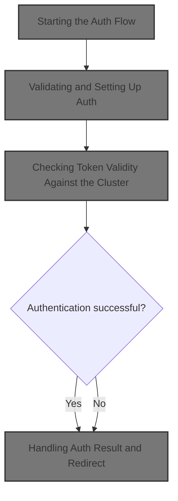

This document describes the process of authenticating a user with a token. The flow starts when a user initiates authentication, validates the token, checks permissions, and either grants access to the dashboard or shows an error message.



# Starting the Auth Flow

```mermaid
%%{init: {"flowchart": {"defaultRenderer": "elk"}} }%%
flowchart TD
    node1["User initiates authentication"] --> node2["Validating and Setting Up Auth"]
    click node1 openCode "frontend/src/components/account/Auth.tsx:46:47"
    
    node2 --> node3{"Authentication result"}
    click node3 openCode "frontend/src/components/account/Auth.tsx:48:49"
    node3 -->|"Success (200)"| node4["Redirect to dashboard"]
    click node4 openCode "frontend/src/components/account/Auth.tsx:50:55"
    node3 -->|"Failure"| node5["Show error message"]
    click node5 openCode "frontend/src/components/account/Auth.tsx:56:58"

classDef HeadingStyle fill:#777777,stroke:#333,stroke-width:2px;
click node2 goToHeading "Validating and Setting Up Auth"
node2:::HeadingStyle

%% Swimm:
%% %%{init: {"flowchart": {"defaultRenderer": "elk"}} }%%
%% flowchart TD
%%     node1["User initiates authentication"] --> node2["Validating and Setting Up Auth"]
%%     click node1 openCode "<SwmPath>[frontend/…/account/Auth.tsx](frontend/src/components/account/Auth.tsx)</SwmPath>:46:47"
%%     
%%     node2 --> node3{"Authentication result"}
%%     click node3 openCode "<SwmPath>[frontend/…/account/Auth.tsx](frontend/src/components/account/Auth.tsx)</SwmPath>:48:49"
%%     node3 -->|"Success (200)"| node4["Redirect to dashboard"]
%%     click node4 openCode "<SwmPath>[frontend/…/account/Auth.tsx](frontend/src/components/account/Auth.tsx)</SwmPath>:50:55"
%%     node3 -->|"Failure"| node5["Show error message"]
%%     click node5 openCode "<SwmPath>[frontend/…/account/Auth.tsx](frontend/src/components/account/Auth.tsx)</SwmPath>:56:58"
%% 
%% classDef HeadingStyle fill:#777777,stroke:#333,stroke-width:2px;
%% click node2 goToHeading "Validating and Setting Up Auth"
%% node2:::HeadingStyle
```



<SwmSnippet path="/frontend/src/components/account/Auth.tsx" line="46">

---

In <SwmToken path="frontend/src/components/account/Auth.tsx" pos="46:3:3" line-data="  function onAuthClicked() {">`onAuthClicked`</SwmToken> we kick off the auth process by calling <SwmToken path="frontend/src/components/account/Auth.tsx" pos="47:1:1" line-data="    loginWithToken(token).then(code =&gt; {">`loginWithToken`</SwmToken> with the provided token. This is the entry point for handling user authentication, and we need to call <SwmToken path="frontend/src/components/account/Auth.tsx" pos="47:1:1" line-data="    loginWithToken(token).then(code =&gt; {">`loginWithToken`</SwmToken> next to check if the token is valid and set up the session before doing anything else.

```tsx
  function onAuthClicked() {
    loginWithToken(token).then(code => {
```

---

</SwmSnippet>

## Validating and Setting Up Auth

```mermaid
%%{init: {"flowchart": {"defaultRenderer": "elk"}} }%%
flowchart TD
  node1["User attempts to log in with token"]
  click node1 openCode "frontend/src/components/account/Auth.tsx:201:217"
  node1 --> node2{"Is system available?"}
  click node2 openCode "frontend/src/components/account/Auth.tsx:203:204"
  node2 -->|"No"| node3["Login failed: System unavailable (417)"]
  click node3 openCode "frontend/src/components/account/Auth.tsx:205:207"
  node2 -->|"Yes"| node4["Set token and verify authentication"]
  click node4 openCode "frontend/src/components/account/Auth.tsx:209:210"
  node4 --> node5{"Did login succeed?"}
  click node5 openCode "frontend/src/components/account/Auth.tsx:213:215"
  node5 -->|"Yes"| node6["Login successful (200)"]
  click node6 openCode "frontend/src/components/account/Auth.tsx:212:213"
  node5 -->|"No"| node7["Login failed: Error (status code)"]
  click node7 openCode "frontend/src/components/account/Auth.tsx:213:215"

classDef HeadingStyle fill:#777777,stroke:#333,stroke-width:2px;

%% Swimm:
%% %%{init: {"flowchart": {"defaultRenderer": "elk"}} }%%
%% flowchart TD
%%   node1["User attempts to log in with token"]
%%   click node1 openCode "<SwmPath>[frontend/…/account/Auth.tsx](frontend/src/components/account/Auth.tsx)</SwmPath>:201:217"
%%   node1 --> node2{"Is system available?"}
%%   click node2 openCode "<SwmPath>[frontend/…/account/Auth.tsx](frontend/src/components/account/Auth.tsx)</SwmPath>:203:204"
%%   node2 -->|"No"| node3["Login failed: System unavailable (417)"]
%%   click node3 openCode "<SwmPath>[frontend/…/account/Auth.tsx](frontend/src/components/account/Auth.tsx)</SwmPath>:205:207"
%%   node2 -->|"Yes"| node4["Set token and verify authentication"]
%%   click node4 openCode "<SwmPath>[frontend/…/account/Auth.tsx](frontend/src/components/account/Auth.tsx)</SwmPath>:209:210"
%%   node4 --> node5{"Did login succeed?"}
%%   click node5 openCode "<SwmPath>[frontend/…/account/Auth.tsx](frontend/src/components/account/Auth.tsx)</SwmPath>:213:215"
%%   node5 -->|"Yes"| node6["Login successful (200)"]
%%   click node6 openCode "<SwmPath>[frontend/…/account/Auth.tsx](frontend/src/components/account/Auth.tsx)</SwmPath>:212:213"
%%   node5 -->|"No"| node7["Login failed: Error (status code)"]
%%   click node7 openCode "<SwmPath>[frontend/…/account/Auth.tsx](frontend/src/components/account/Auth.tsx)</SwmPath>:213:215"
%% 
%% classDef HeadingStyle fill:#777777,stroke:#333,stroke-width:2px;
```



<SwmSnippet path="/frontend/src/components/account/Auth.tsx" line="201">

---

<SwmToken path="frontend/src/components/account/Auth.tsx" pos="201:4:4" line-data="async function loginWithToken(token: string) {">`loginWithToken`</SwmToken> handles the main auth logic: it sets the token for the current cluster, then calls <SwmToken path="frontend/src/components/account/Auth.tsx" pos="210:3:3" line-data="    await testAuth();">`testAuth`</SwmToken> to check if the token is actually valid by making an API call. We need to call into <SwmPath>[frontend/…/v1/clusterApi.ts](frontend/src/lib/k8s/api/v1/clusterApi.ts)</SwmPath> next to perform this real-world check against the backend.

```tsx
async function loginWithToken(token: string) {
  try {
    const cluster = getCluster();
    if (!cluster) {
      // Expectation failed.
      return 417;
    }

    await setToken(cluster, token);
    await testAuth();

    return 200;
  } catch (err) {
    console.error(err);
    return (err as ApiError).status;
  }
}
```

---

</SwmSnippet>

## Checking Token Validity Against the Cluster

<SwmSnippet path="/frontend/src/lib/k8s/api/v1/clusterApi.ts" line="34">

---

<SwmToken path="frontend/src/lib/k8s/api/v1/clusterApi.ts" pos="34:6:6" line-data="export async function testAuth(cluster = &#39;&#39;, namespace = &#39;default&#39;) {">`testAuth`</SwmToken> sends a request to the Kubernetes selfsubjectrulesreviews endpoint to check if the token has valid permissions. We call post next to actually send this request to the backend, which is needed to confirm the token works.

```typescript
export async function testAuth(cluster = '', namespace = 'default') {
  const spec = { namespace };
  const clusterName = cluster || getCluster();

  return post('/apis/authorization.k8s.io/v1/selfsubjectrulesreviews', { spec }, false, {
    timeout: 5 * 1000,
    cluster: clusterName,
  });
}
```

---

</SwmSnippet>

<SwmSnippet path="/frontend/src/lib/k8s/api/v1/clusterRequests.ts" line="225">

---

<SwmToken path="frontend/src/lib/k8s/api/v1/clusterRequests.ts" pos="225:4:4" line-data="export function post(">`post`</SwmToken> wraps the HTTP POST logic, picking the right cluster based on options or global state, and then delegates the actual request to <SwmToken path="frontend/src/lib/k8s/api/v1/clusterRequests.ts" pos="234:3:3" line-data="  return clusterRequest(url, {">`clusterRequest`</SwmToken>. This keeps cluster-specific routing and auth handling consistent across requests.

```typescript
export function post(
  url: string,
  json: JSON | object | KubeObjectInterface,
  autoLogoutOnAuthError: boolean = true,
  options: ClusterRequestParams = {}
) {
  const { cluster: clusterName, ...requestOptions } = options;
  const body = JSON.stringify(json);
  const cluster = clusterName || getCluster() || '';
  return clusterRequest(url, {
    method: 'POST',
    body,
    headers: JSON_HEADERS,
    cluster,
    autoLogoutOnAuthError,
    ...requestOptions,
  });
}
```

---

</SwmSnippet>

## Handling Auth Result and Redirect

<SwmSnippet path="/frontend/src/components/account/Auth.tsx" line="48">

---

Back in <SwmToken path="frontend/src/components/account/Auth.tsx" pos="46:3:3" line-data="  function onAuthClicked() {">`onAuthClicked`</SwmToken>, after <SwmToken path="frontend/src/components/account/Auth.tsx" pos="47:1:1" line-data="    loginWithToken(token).then(code =&gt; {">`loginWithToken`</SwmToken> returns, we check the result code. If it's 200, we redirect the user to the cluster dashboard. If not, we clear the token and show an error message.

```tsx
      // If successful, redirect.
      if (code === 200) {
        history.replace(
          generatePath(getClusterPrefixedPath(), {
            cluster: getCluster() as string,
          })
        );
      } else {
        setToken('');
        setShowError(true);
      }
    });
  }
```

---

</SwmSnippet>

&nbsp;

*This is an auto-generated document by Swimm 🌊 and has not yet been verified by a human*

<SwmMeta version="3.0.0" repo-id="Z2l0aHViJTNBJTNBdHlwZXNjcmlwdC1oZWFkbGFtcCUzQSUzQXJpY2FyZG9sb3Blemc=" repo-name="typescript-headlamp"><sup>Powered by [Swimm](https://app.swimm.io/)</sup></SwmMeta>
