This document describes how users can view and manage a Kubernetes node. The flow receives a node name and cluster, fetches node data, subscribes to live updates, and presents node details and actions in the UI. User actions such as cordon, uncordon, and drain are handled with immediate feedback.

# Initializing Node State and Metrics

<SwmSnippet path="/frontend/src/components/node/Details.tsx" line="58">

---

In <SwmToken path="frontend/src/components/node/Details.tsx" pos="58:6:6" line-data="export default function NodeDetails(props: { name?: string; cluster?: string }) {">`NodeDetails`</SwmToken>, we kick off by grabbing the node name and cluster, setting up translation, dispatch, and snackbar hooks, and initializing state for metrics, scheduling, draining, and node data. We need to call KubeObject.useGet next to actually fetch the node data from the API, so the rest of the logic (like scheduling and draining) has the current node info to work with.

```tsx
export default function NodeDetails(props: { name?: string; cluster?: string }) {
  const params = useParams<{ name: string }>();
  const { name = params.name, cluster } = props;
  const { t } = useTranslation(['glossary']);
  const dispatch: AppDispatch = useDispatch();

  const { enqueueSnackbar } = useSnackbar();
  const [nodeMetrics, metricsError] = Node.useMetrics();
  const [isupdatingNodeScheduleProperty, setisUpdatingNodeScheduleProperty] = React.useState(false);
  const [isNodeDrainInProgress, setisNodeDrainInProgress] = React.useState(false);
  const [nodeFromAPI, nodeError] = Node.useGet(name);
```

---

</SwmSnippet>

## Fetching Node Data via Query Hook

<SwmSnippet path="/frontend/src/lib/k8s/KubeObject.ts" line="379">

---

`KubeObject.useGet` just sets up the arguments and delegates the actual fetching and subscription logic to <SwmToken path="frontend/src/lib/k8s/KubeObject.ts" pos="388:3:3" line-data="    return useKubeObject&lt;K&gt;({">`useKubeObject`</SwmToken>. We need to call <SwmToken path="frontend/src/lib/k8s/KubeObject.ts" pos="388:3:3" line-data="    return useKubeObject&lt;K&gt;({">`useKubeObject`</SwmToken> next because that's where the real data fetching, caching, and live update logic happens.

```typescript
  static useGet<K extends KubeObject>(
    this: new (...args: any) => K,
    name: string,
    namespace?: string,
    opts?: {
      queryParams?: QueryParameters;
      cluster?: string;
    }
  ) {
    return useKubeObject<K>({
      kubeObjectClass: this as (new (...args: any) => K) & typeof KubeObject<any>,
      name: name,
      namespace: namespace,
      cluster: opts?.cluster,
      queryParams: opts?.queryParams,
    });
  }
```

---

</SwmSnippet>

## Live Data Subscription and Query Setup

<SwmSnippet path="/frontend/src/lib/k8s/api/v2/hooks.ts" line="99">

---

In <SwmToken path="frontend/src/lib/k8s/api/v2/hooks.ts" pos="99:4:4" line-data="export function useKubeObject&lt;K extends KubeObject&gt;({">`useKubeObject`</SwmToken>, we set up the query key, fetch the node data with <SwmToken path="frontend/src/lib/k8s/api/v2/hooks.ts" pos="17:17:19" line-data="import { useQuery, useQueryClient } from &#39;@tanstack/react-query&#39;;">`react-query`</SwmToken>, and clean up query parameters. We then call <SwmToken path="frontend/src/lib/k8s/api/v2/hooks.ts" pos="152:1:1" line-data="  useWebSocket&lt;KubeListUpdateEvent&lt;K&gt;&gt;({">`useWebSocket`</SwmToken> to subscribe to live updates, so any backend changes get pushed to the cache and reflected in the UI.

```typescript
export function useKubeObject<K extends KubeObject>({
  kubeObjectClass,
  namespace,
  name,
  cluster = getCluster() ?? '',
  queryParams,
}: {
  /** Class to instantiate the object with */
  kubeObjectClass: (new (...args: any) => K) & typeof KubeObject<any>;
  /** Object namespace */
  namespace?: string;
  /** Object name */
  name: string;
  /** Cluster name */
  cluster?: string;
  queryParams?: QueryParameters;
}): [K | null, ApiError | null] & QueryResponse<K, ApiError> {
  type Instance = K;
  const { endpoint, error: endpointError } = useEndpoints(
    kubeObjectClass.apiEndpoint.apiInfo,
    cluster
  );

  const cleanedUpQueryParams = Object.fromEntries(
    Object.entries(queryParams ?? {}).filter(([, value]) => value !== undefined && value !== '')
  );

  const queryKey = useMemo(
    () =>
      kubeObjectQueryKey({ cluster, name, namespace, endpoint, queryParams: cleanedUpQueryParams }),
    [endpoint, namespace, name]
  );

  const client = useQueryClient();
  const query = useQuery<Instance | null, ApiError>({
    enabled: !!endpoint,
    placeholderData: null,
    staleTime: 5000,
    queryKey,
    queryFn: async () => {
      const url = makeUrl(
        [KubeObjectEndpoint.toUrl(endpoint!, namespace), name],
        cleanedUpQueryParams
      );
      const obj: KubeObjectInterface = await clusterFetch(url, {
        cluster,
      }).then(it => it.json());
      return new kubeObjectClass(obj, cluster) as Instance;
    },
  });

  const data: Instance | null = query.error ? null : query.data ?? null;

  useWebSocket<KubeListUpdateEvent<K>>({
    url: () =>
      makeUrl([KubeObjectEndpoint.toUrl(endpoint!)], {
        ...cleanedUpQueryParams,
        watch: 1,
        fieldSelector: `metadata.name=${name}`,
      }),
    enabled: !!endpoint && !!data,
    cluster,
    onMessage(update: KubeListUpdateEvent<K>) {
      if (update.type !== 'ADDED' && update.object) {
        client.setQueryData(queryKey, new kubeObjectClass(update.object));
      }
    },
  });

```

---

</SwmSnippet>

### Subscribing to Node Updates

See <SwmLink doc-title="Delivering Live Data Updates via WebSocket">[Delivering Live Data Updates via WebSocket](/.swm/delivering-live-data-updates-via-websocket.q4nc8lm4.sw.md)</SwmLink>

### Returning Node Data and Status

```mermaid
%%{init: {"flowchart": {"defaultRenderer": "elk"}} }%%
flowchart TD
  node1["Return Kubernetes object state: data, error (endpoint or query), loading, success, fetching, status"]
  click node1 openCode "frontend/src/lib/k8s/api/v2/hooks.ts:168:182"
  node1 --> node2{"Is there an endpoint error?"}
  click node2 openCode "frontend/src/lib/k8s/api/v2/hooks.ts:171:171"
  node2 -->|"Yes"| node3["Expose endpoint error as error"]
  click node3 openCode "frontend/src/lib/k8s/api/v2/hooks.ts:171:171"
  node2 -->|"No"| node4["Expose query error as error"]
  click node4 openCode "frontend/src/lib/k8s/api/v2/hooks.ts:171:171"
  subgraph loop1["When iterating over the returned object"]
    node5["Yield data"]
    click node5 openCode "frontend/src/lib/k8s/api/v2/hooks.ts:178:178"
    node6["Yield error (endpoint or query)"]
    click node6 openCode "frontend/src/lib/k8s/api/v2/hooks.ts:179:179"
  end
  node1 --> loop1
classDef HeadingStyle fill:#777777,stroke:#333,stroke-width:2px;

%% Swimm:
%% %%{init: {"flowchart": {"defaultRenderer": "elk"}} }%%
%% flowchart TD
%%   node1["Return Kubernetes object state: data, error (endpoint or query), loading, success, fetching, status"]
%%   click node1 openCode "<SwmPath>[frontend/…/v2/hooks.ts](frontend/src/lib/k8s/api/v2/hooks.ts)</SwmPath>:168:182"
%%   node1 --> node2{"Is there an endpoint error?"}
%%   click node2 openCode "<SwmPath>[frontend/…/v2/hooks.ts](frontend/src/lib/k8s/api/v2/hooks.ts)</SwmPath>:171:171"
%%   node2 -->|"Yes"| node3["Expose endpoint error as error"]
%%   click node3 openCode "<SwmPath>[frontend/…/v2/hooks.ts](frontend/src/lib/k8s/api/v2/hooks.ts)</SwmPath>:171:171"
%%   node2 -->|"No"| node4["Expose query error as error"]
%%   click node4 openCode "<SwmPath>[frontend/…/v2/hooks.ts](frontend/src/lib/k8s/api/v2/hooks.ts)</SwmPath>:171:171"
%%   subgraph loop1["When iterating over the returned object"]
%%     node5["Yield data"]
%%     click node5 openCode "<SwmPath>[frontend/…/v2/hooks.ts](frontend/src/lib/k8s/api/v2/hooks.ts)</SwmPath>:178:178"
%%     node6["Yield error (endpoint or query)"]
%%     click node6 openCode "<SwmPath>[frontend/…/v2/hooks.ts](frontend/src/lib/k8s/api/v2/hooks.ts)</SwmPath>:179:179"
%%   end
%%   node1 --> loop1
%% classDef HeadingStyle fill:#777777,stroke:#333,stroke-width:2px;
```



<SwmSnippet path="/frontend/src/lib/k8s/api/v2/hooks.ts" line="168">

---

Back in <SwmToken path="frontend/src/lib/k8s/KubeObject.ts" pos="388:3:3" line-data="    return useKubeObject&lt;K&gt;({">`useKubeObject`</SwmToken> (after <SwmToken path="frontend/src/lib/k8s/api/v2/hooks.ts" pos="152:1:1" line-data="  useWebSocket&lt;KubeListUpdateEvent&lt;K&gt;&gt;({">`useWebSocket`</SwmToken>), we return an object with the node data, error, and all the <SwmToken path="frontend/src/lib/k8s/api/v2/hooks.ts" pos="17:17:19" line-data="import { useQuery, useQueryClient } from &#39;@tanstack/react-query&#39;;">`react-query`</SwmToken> status flags. The iterator lets you destructure it like a tuple, but you still get all the extra info for UI state.

```typescript
  // @ts-ignore
  return {
    data,
    error: endpointError ?? query.error,
    isError: query.isError,
    isLoading: query.isLoading,
    isFetching: query.isFetching,
    isSuccess: query.isSuccess,
    status: query.status,
    *[Symbol.iterator](): ArrayIterator<ApiError | K | null> {
      yield data;
      yield endpointError ?? query.error;
    },
  };
}
```

---

</SwmSnippet>

## Managing Node Actions and Dialogs

```mermaid
%%{init: {"flowchart": {"defaultRenderer": "elk"}} }%%
flowchart TD
  node1["Display node details, metrics, and actions (cordon, drain, info)"]
  click node1 openCode "frontend/src/components/node/Details.tsx:69:296"
  node1 --> node2{"User action?"}
  click node2 openCode "frontend/src/components/node/Details.tsx:204:255"
  node2 -->|"Cordon/Uncordon"| node3["Toggle node schedulable state (cordoned/uncordoned)"]
  click node3 openCode "frontend/src/components/node/Details.tsx:88:124"
  node2 -->|"Drain"| node4["Open drain confirmation dialog"]
  click node4 openCode "frontend/src/components/node/Details.tsx:184:201"
  node2 -->|"No action"| node5["Continue viewing node details"]
  click node5 openCode "frontend/src/components/node/Details.tsx:204:293"
  node4 --> node6{"User confirms drain?"}
  click node6 openCode "frontend/src/components/node/Details.tsx:192:195"
  node6 -->|"Yes"| node7["Start draining node (drain in progress)"]
  click node7 openCode "frontend/src/components/node/Details.tsx:153:182"
  node6 -->|"No"| node1
  node7 --> node8["Update node status after drain"]
  click node8 openCode "frontend/src/components/node/Details.tsx:126:147"
  node3 --> node1
  node5 --> node1
  node8 --> node1
classDef HeadingStyle fill:#777777,stroke:#333,stroke-width:2px;

%% Swimm:
%% %%{init: {"flowchart": {"defaultRenderer": "elk"}} }%%
%% flowchart TD
%%   node1["Display node details, metrics, and actions (cordon, drain, info)"]
%%   click node1 openCode "<SwmPath>[frontend/…/node/Details.tsx](frontend/src/components/node/Details.tsx)</SwmPath>:69:296"
%%   node1 --> node2{"User action?"}
%%   click node2 openCode "<SwmPath>[frontend/…/node/Details.tsx](frontend/src/components/node/Details.tsx)</SwmPath>:204:255"
%%   node2 -->|"Cordon/Uncordon"| node3["Toggle node schedulable state (cordoned/uncordoned)"]
%%   click node3 openCode "<SwmPath>[frontend/…/node/Details.tsx](frontend/src/components/node/Details.tsx)</SwmPath>:88:124"
%%   node2 -->|"Drain"| node4["Open drain confirmation dialog"]
%%   click node4 openCode "<SwmPath>[frontend/…/node/Details.tsx](frontend/src/components/node/Details.tsx)</SwmPath>:184:201"
%%   node2 -->|"No action"| node5["Continue viewing node details"]
%%   click node5 openCode "<SwmPath>[frontend/…/node/Details.tsx](frontend/src/components/node/Details.tsx)</SwmPath>:204:293"
%%   node4 --> node6{"User confirms drain?"}
%%   click node6 openCode "<SwmPath>[frontend/…/node/Details.tsx](frontend/src/components/node/Details.tsx)</SwmPath>:192:195"
%%   node6 -->|"Yes"| node7["Start draining node (drain in progress)"]
%%   click node7 openCode "<SwmPath>[frontend/…/node/Details.tsx](frontend/src/components/node/Details.tsx)</SwmPath>:153:182"
%%   node6 -->|"No"| node1
%%   node7 --> node8["Update node status after drain"]
%%   click node8 openCode "<SwmPath>[frontend/…/node/Details.tsx](frontend/src/components/node/Details.tsx)</SwmPath>:126:147"
%%   node3 --> node1
%%   node5 --> node1
%%   node8 --> node1
%% classDef HeadingStyle fill:#777777,stroke:#333,stroke-width:2px;
```



<SwmSnippet path="/frontend/src/components/node/Details.tsx" line="69">

---

After getting the node data from `KubeObject.useGet`, <SwmToken path="frontend/src/components/node/Details.tsx" pos="58:6:6" line-data="export default function NodeDetails(props: { name?: string; cluster?: string }) {">`NodeDetails`</SwmToken> sets up state and handlers for scheduling and draining. We need to call <SwmToken path="frontend/src/components/node/Details.tsx" pos="153:3:3" line-data="  function handleNodeDrain(node: Node) {">`handleNodeDrain`</SwmToken> next because draining is a multi-step async process, so we kick it off and then poll for status to keep the UI in sync.

```tsx
  const [node, setNode] = useState(nodeFromAPI);
  const noMetrics = metricsError?.status === 404;
  const [drainDialogOpen, setDrainDialogOpen] = useState(false);

  useEffect(() => {
    setNode(nodeFromAPI);
  }, [nodeFromAPI]);

  function getAddresses(item: Node) {
    return (
      item.status.addresses?.map(({ type, address }) => {
        return {
          name: type,
          value: address,
        };
      }) || []
    );
  }

  function handleNodeScheduleState(node: Node, cordon: boolean) {
    setisUpdatingNodeScheduleProperty(true);
    const cloneNode = _.cloneDeep(node);

    cloneNode.spec.unschedulable = !cordon;
    dispatch(
      clusterAction(
        () =>
          apply(cloneNode.jsonData)
            .then(() => {
              setNode(cloneNode);
            })
            .finally(() => {
              setisUpdatingNodeScheduleProperty(false);
            }),
        {
          startMessage: cordon
            ? t('Uncordoning node {{name}}…', {
                name: node.metadata.name,
              })
            : t('Cordoning node {{name}}…', { name: node.metadata.name }),
          successMessage: cordon
            ? t('Uncordoned node {{name}}.', { name: node.metadata.name })
            : t('Cordoned node {{name}}.', { name: node.metadata.name }),
          errorMessage: cordon
            ? t('Failed to uncordon node {{name}}.', { name: node.metadata.name })
            : t('Failed to cordon node {{name}}.', { name: node.metadata.name }),
          cancelledMessage: cordon
            ? t('Uncordon node {{name}} cancelled.', { name: node.metadata.name })
            : t('Cordon node {{name}} cancelled.', { name: node.metadata.name }),
          cancelCallback: () => {
            setisUpdatingNodeScheduleProperty(false);
          },
        }
      )
    );
  }

  function getDrainNodeStatus(cluster: string, nodeName: string) {
    setTimeout(() => {
      drainNodeStatus(cluster, nodeName)
        .then(data => {
          if (data && data.id.startsWith('error')) {
            enqueueSnackbar(data.id, { variant: 'error' });
            return;
          }
          if (data && data.id !== 'success') {
            getDrainNodeStatus(cluster, nodeName);
            return;
          }
          const cloneNode = _.cloneDeep(node);

          cloneNode!.spec.unschedulable = !node!.spec.unschedulable;
          setNode(cloneNode);
        })
        .catch(error => {
          enqueueSnackbar(error.message, { variant: 'error' });
        });
    }, 1000);
  }

  function toggleDrainDialogVisibility() {
    setDrainDialogOpen(drainDialogOpen => !drainDialogOpen);
  }

  function handleNodeDrain(node: Node) {
    const cluster = getCluster();
    if (!cluster) return;

    setisNodeDrainInProgress(true);
    dispatch(
      clusterAction(
        () =>
          drainNode(cluster, node.metadata.name)
            .then(() => {
              getDrainNodeStatus(cluster, node.metadata.name);
            })
            .catch(error => {
              enqueueSnackbar(error.message, { variant: 'error' });
            })
            .finally(() => {
              setisNodeDrainInProgress(false);
            }),
        {
          startMessage: t('Draining node {{name}}…', { name: node.metadata.name }),
          successMessage: t('Drained node {{name}}.', { name: node.metadata.name }),
          errorMessage: t('Failed to drain node {{name}}.', { name: node.metadata.name }),
          cancelledMessage: t('Draining node {{name}} cancelled.', { name: node.metadata.name }),
          cancelCallback: () => {
            setisNodeDrainInProgress(false);
          },
        }
      )
    );
  }

  function DrainDialog() {
    return (
      <>
        <ConfirmDialog
          title={t('Drain Node')}
          description={t('Are you sure you want to drain the node {{name}}?', {
            name: node?.metadata.name,
          })}
          onConfirm={() => {
            setDrainDialogOpen(false);
            handleNodeDrain(node!);
          }}
          handleClose={() => setDrainDialogOpen(false)}
          open={drainDialogOpen}
        />
      </>
    );
  }

```

---

</SwmSnippet>

<SwmSnippet path="/frontend/src/components/node/Details.tsx" line="153">

---

<SwmToken path="frontend/src/components/node/Details.tsx" pos="153:3:3" line-data="  function handleNodeDrain(node: Node) {">`handleNodeDrain`</SwmToken> grabs the current cluster, sets the draining state, and dispatches an async action to drain the node. On success, it polls for drain status; on error, it shows a notification. All user feedback is handled via messages and callbacks.

```tsx
  function handleNodeDrain(node: Node) {
    const cluster = getCluster();
    if (!cluster) return;

    setisNodeDrainInProgress(true);
    dispatch(
      clusterAction(
        () =>
          drainNode(cluster, node.metadata.name)
            .then(() => {
              getDrainNodeStatus(cluster, node.metadata.name);
            })
            .catch(error => {
              enqueueSnackbar(error.message, { variant: 'error' });
            })
            .finally(() => {
              setisNodeDrainInProgress(false);
            }),
        {
          startMessage: t('Draining node {{name}}…', { name: node.metadata.name }),
          successMessage: t('Drained node {{name}}.', { name: node.metadata.name }),
          errorMessage: t('Failed to drain node {{name}}.', { name: node.metadata.name }),
          cancelledMessage: t('Draining node {{name}} cancelled.', { name: node.metadata.name }),
          cancelCallback: () => {
            setisNodeDrainInProgress(false);
          },
        }
      )
    );
  }
```

---

</SwmSnippet>

<SwmSnippet path="/frontend/src/components/node/Details.tsx" line="203">

---

After returning from <SwmToken path="frontend/src/components/node/Details.tsx" pos="153:3:3" line-data="  function handleNodeDrain(node: Node) {">`handleNodeDrain`</SwmToken>, <SwmToken path="frontend/src/components/node/Details.tsx" pos="58:6:6" line-data="export default function NodeDetails(props: { name?: string; cluster?: string }) {">`NodeDetails`</SwmToken> renders the UI with <SwmToken path="frontend/src/components/node/Details.tsx" pos="206:2:2" line-data="      &lt;DetailsGrid">`DetailsGrid`</SwmToken>, wiring up all the actions, extra info, and sections. State flags control which actions are enabled and what feedback the user gets, so everything stays in sync with backend changes and async operations.

```tsx
  return (
    <>
      <DrainDialog />
      <DetailsGrid
        resourceType={Node}
        name={name}
        cluster={cluster}
        error={nodeError}
        headerSection={item => (
          <ChartsSection node={item} metrics={nodeMetrics} noMetrics={noMetrics} />
        )}
        withEvents
        actions={item => {
          const cordon = item?.jsonData?.spec?.unschedulable;
          const cordonOrUncordon = cordon ? t('Uncordon') : t('Cordon');

          return [
            {
              id: DefaultHeaderAction.NODE_TOGGLE_CORDON,
              action: (
                <AuthVisible item={item} authVerb="update">
                  <ActionButton
                    description={cordonOrUncordon}
                    icon={cordon ? 'mdi:check-circle-outline' : 'mdi:cancel'}
                    onClick={() => handleNodeScheduleState(item!, cordon)}
                    iconButtonProps={{
                      disabled: isupdatingNodeScheduleProperty,
                    }}
                  />
                </AuthVisible>
              ),
            },
            {
              id: DefaultHeaderAction.NODE_DRAIN,
              action: (
                <AuthVisible item={item} authVerb="delete">
                  <ActionButton
                    description={t('Drain')}
                    icon="mdi:delete-variant"
                    onClick={() => toggleDrainDialogVisibility()}
                    iconButtonProps={{
                      disabled: isNodeDrainInProgress,
                    }}
                  />
                </AuthVisible>
              ),
            },
            {
              id: DefaultHeaderAction.NODE_SHELL,
              action: <NodeShellAction item={item} />,
            },
          ];
        }}
        extraInfo={item =>
          item && [
            {
              name: t('translation|Taints'),
              value: <NodeTaintsLabel node={item} />,
            },
            {
              name: t('translation|Ready'),
              value: <NodeReadyLabel node={item} />,
            },
            {
              name: t('translation|Conditions'),
              value: <NodeConditionsLabel node={item} />,
            },
            {
              name: t('Pod CIDR'),
              value: item.spec.podCIDR,
            },
            ...getAddresses(item),
          ]
        }
        extraSections={item =>
          item && [
            {
              id: 'headlamp.node-system-info',
              section: <SystemInfoSection node={item} />,
            },
            {
              id: 'headlamp.node-conditions',
              section: <ConditionsSection resource={item} />,
            },
            {
              id: 'headlamp.node-owned-pods',
              section: <OwnedPodsSection resource={item} />,
            },
          ]
        }
      />
    </>
  );
}
```

---

</SwmSnippet>

&nbsp;

*This is an auto-generated document by Swimm 🌊 and has not yet been verified by a human*

<SwmMeta version="3.0.0" repo-id="Z2l0aHViJTNBJTNBdHlwZXNjcmlwdC1oZWFkbGFtcCUzQSUzQXJpY2FyZG9sb3Blemc=" repo-name="typescript-headlamp"><sup>Powered by [Swimm](https://app.swimm.io/)</sup></SwmMeta>
