This document describes how users can view and stream logs from Kubernetes pods and containers associated with a workload. As part of the workload monitoring experience, users select which pod(s) and container(s) to view, configure log display options, and see logs streamed in real time. The log viewer supports aggregation of logs from multiple pods and provides access to previous logs for restarted containers.

# Selecting Pods and Preparing Log Streaming

<SwmSnippet path="/frontend/src/components/common/Resource/LogsButton.tsx" line="54">

---

In <SwmToken path="frontend/src/components/common/Resource/LogsButton.tsx" pos="54:2:2" line-data="function LogsButtonContent({ item }: LogsButtonProps) {">`LogsButtonContent`</SwmToken>, we kick things off by setting up state for pods, containers, and log display options. The function fetches related pods using label selectors from the workload, supports both single and 'all pods' log viewing, and adapts the UI for container selection. Special handling is included for containers that have been restarted, and the code assumes specific Kubernetes object structures. We need to call into <SwmPath>[frontend/…/k8s/pod.ts](frontend/src/lib/k8s/pod.ts)</SwmPath> next to actually fetch and stream the logs for the selected pods and containers, since that's where the log retrieval logic lives.

```tsx
function LogsButtonContent({ item }: LogsButtonProps) {
  const [pods, setPods] = useState<Pod[]>([]);
  const [selectedPodIndex, setSelectedPodIndex] = useState<number | 'all'>('all');
  const [selectedContainer, setSelectedContainer] = useState('');

  const [logs, setLogs] = useState<{ logs: string[]; lastLineShown: number }>({
    logs: [],
    lastLineShown: -1,
  });
  const [allPodLogs, setAllPodLogs] = useState<{ [podName: string]: string[] }>({});

  const [showTimestamps, setShowTimestamps] = useState<boolean>(true);
  const [follow, setFollow] = useState<boolean>(true);
  const [lines, setLines] = useState<number>(100);
  const [showPrevious, setShowPrevious] = React.useState<boolean>(false);
  const [showReconnectButton, setShowReconnectButton] = useState(false);

  const xtermRef = React.useRef<XTerminal | null>(null);
  const { t } = useTranslation(['glossary', 'translation']);
  const { enqueueSnackbar } = useSnackbar();

  const clearLogs = React.useCallback(() => {
    if (xtermRef.current) {
      xtermRef.current.clear();
    }
    setLogs({ logs: [], lastLineShown: -1 });
  }, []);

  // Fetch related pods.
  async function getRelatedPods(): Promise<Pod[]> {
    if (item instanceof Deployment || item instanceof ReplicaSet || item instanceof DaemonSet) {
      try {
        let labelSelector = '';
        const selector = item.spec.selector;

        if (selector.matchLabels) {
          labelSelector = Object.entries(selector.matchLabels)
            .map(([key, value]) => `${key}=${value}`)
            .join(',');
        }

        if (!labelSelector) {
          const resourceType =
            item instanceof Deployment
              ? 'deployment'
              : item instanceof ReplicaSet
              ? 'replicaset'
              : 'daemonset';
          throw new Error(
            t('translation|No label selectors found for this {{type}}', { type: resourceType })
          );
        }

        const response = await clusterFetch(
          `/api/v1/namespaces/${item.metadata.namespace}/pods?labelSelector=${labelSelector}`,
          { cluster: item.cluster }
        ).then(it => it.json());

        if (!response?.items) {
          throw new Error(t('translation|Invalid response from server'));
        }

        return response.items.map((podData: any) => new Pod(podData));
      } catch (error) {
        console.error('Error in getRelatedPods:', error);
        throw new Error(
          error instanceof Error ? error.message : t('translation|Failed to fetch related pods')
        );
      }
    }
    return [];
  }

  // Event handlers for log viewing options
  function handleLinesChange(event: any) {
    setLines(event.target.value);
  }

  function handleTimestampsChange() {
    setShowTimestamps(prev => !prev);
  }

  function handleFollowChange() {
    setFollow(prev => !prev);
  }

  function handlePreviousChange() {
    setShowPrevious(previous => !previous);
  }

  // Handler for initial logs button click
  async function onMount() {
    if (item instanceof Deployment || item instanceof ReplicaSet || item instanceof DaemonSet) {
      try {
        const fetchedPods = await getRelatedPods();
        if (fetchedPods.length > 0) {
          setPods(fetchedPods);
          setSelectedPodIndex('all');
          setSelectedContainer(fetchedPods[0].spec.containers[0].name);
        } else {
          enqueueSnackbar(t('translation|No pods found for this workload'), {
            variant: 'warning',
            autoHideDuration: 3000,
          });
        }
      } catch (error) {
        console.error('Error fetching pods:', error);
        enqueueSnackbar(
          t('translation|Failed to fetch pods: {{error}}', {
            error: error instanceof Error ? error.message : t('translation|Unknown error'),
          }),
          {
            variant: 'error',
            autoHideDuration: 5000,
          }
        );
      }
    }
  }

  useEffect(() => {
    onMount();
  }, []);

  // Get containers for the selected pod
  const containers = React.useMemo(() => {
    if (!pods.length) return [];
    if (selectedPodIndex === 'all')
      return pods[0]?.spec?.containers?.map(container => container.name) || [];
    const selectedPod = pods[selectedPodIndex as number];
    return selectedPod?.spec?.containers?.map(container => container.name) || [];
  }, [pods, selectedPodIndex]);

  // Check if a container has been restarted
  function hasContainerRestarted(podName: string | undefined, containerName: string) {
    if (!podName) return false;
    const pod = pods.find(p => p.getName() === podName);
    const cont = pod?.status?.containerStatuses?.find(
      (c: KubeContainerStatus) => c.name === containerName
    );
    if (!cont) {
      return false;
    }

    return cont.restartCount > 0;
  }

  // Handler for reconnecting to logs stream
  function handleReconnect() {
    if (pods.length && selectedContainer) {
      setShowReconnectButton(false);
      setLogs({ logs: [], lastLineShown: -1 });
    }
  }

  // Function to process and display all logs
  const processAllLogs = React.useCallback(() => {
    const allLogs: string[] = [];
    Object.entries(allPodLogs).forEach(([podName, podLogs]) => {
      podLogs.forEach(log => {
        allLogs.push(`[${podName}] ${log}`);
      });
    });

    // Sort logs by timestamp
    allLogs.sort((a, b) => {
      const timestampA = a.match(/\d{4}-\d{2}-\d{2}T\d{2}:\d{2}:\d{2}/)?.[0] || '';
      const timestampB = b.match(/\d{4}-\d{2}-\d{2}T\d{2}:\d{2}:\d{2}/)?.[0] || '';
      return timestampA.localeCompare(timestampB);
    });

    if (xtermRef.current) {
      xtermRef.current.clear();
      xtermRef.current.write(allLogs.join('').replaceAll('\n', '\r\n'));
    }

    setLogs({
      logs: allLogs,
      lastLineShown: allLogs.length - 1,
    });
  }, [allPodLogs]);

  // Function to fetch and aggregate logs from all pods
  function fetchAllPodsLogs(pods: Pod[], container: string): () => void {
    clearLogs();
    setAllPodLogs({});

    const cleanups: Array<() => void> = [];

    pods.forEach(pod => {
      const cleanup = pod.getLogs(
        container,
        ({ logs: newLogs }: { logs: string[]; hasJsonLogs?: boolean }) => {
          const podName = pod.getName();
          setAllPodLogs(current => {
            const updated = {
              ...current,
              [podName]: newLogs,
            };
            return updated;
          });
        },
        {
          tailLines: lines,
          showPrevious,
          showTimestamps,
          follow,
          onReconnectStop: () => {
            setShowReconnectButton(true);
          },
        }
      );
```

---

</SwmSnippet>

<SwmSnippet path="/frontend/src/lib/k8s/pod.ts" line="145">

---

<SwmToken path="frontend/src/lib/k8s/pod.ts" pos="145:1:1" line-data="  getLogs(...args: Parameters&lt;oldGetLogs | newGetLogs&gt;): () =&gt; void {">`getLogs`</SwmToken> handles both old and new function signatures for backward compatibility, builds the log fetch URL with all the relevant query params, prettifies JSON log lines if needed, and streams logs with reconnection and cancellation support. This is where the actual log retrieval and streaming logic happens, and it calls back into the UI with new log data as it arrives.

```typescript
  getLogs(...args: Parameters<oldGetLogs | newGetLogs>): () => void {
    if (args.length > 3) {
      console.warn(
        "This Pod's getLogs use will soon be deprecated! Please double check how to call the getLogs function."
      );
      const [container, tailLines, showPrevious, onLogs] = args as Parameters<oldGetLogs>;
      return this.getLogs(container, onLogs!, {
        tailLines: tailLines,
        showPrevious: showPrevious,
      });
    }

    let isReconnecting = true; // Flag to track reconnection attempts
    const [container, onLogs, logsOptions] = args as Parameters<newGetLogs>;
    const {
      tailLines = 100,
      showPrevious = false,
      showTimestamps = false,
      follow = true,
      prettifyLogs = false,
      formatJsonValues = false,
      onReconnectStop,
    } = logsOptions;

    let logs: string[] = [];
    let hasJsonLogs = false;
    let url = `/api/v1/namespaces/${this.getNamespace()}/pods/${this.getName()}/log?container=${container}&previous=${showPrevious}&timestamps=${showTimestamps}&follow=${follow}`;

    // Negative tailLines parameter fetches all logs. If it's non negative it fetches
    // the tailLines number of logs.
    if (tailLines !== -1) {
      url += `&tailLines=${tailLines}`;
    }

    function unescapeStringLiterals(str: string): string {
      return str
        .replace(/\\r\\n/g, '\r\n') // Carriage return + newline
        .replace(/\\n/g, '\n') // Newline
        .replace(/\\t/g, '\t') // Tab
        .replace(/\\"/g, '"') // Double quote
        .replace(/\\'/g, "'") // Single quote
        .replace(/\\\\/g, '\\'); // Backslash
    }

    function prettifyLogLine(logLine: string): string {
      try {
        const jsonMatch = logLine.match(/(\{.*\})/);
        if (!jsonMatch) return logLine;

        const jsonStr = jsonMatch[1];
        const jsonObj = JSON.parse(jsonStr);

        const valueReplacer = formatJsonValues
          ? (key: string, value: any) =>
              typeof value === 'string' ? unescapeStringLiterals(value) : value
          : undefined;

        const prettyJson = JSON.stringify(jsonObj, valueReplacer, 2);
        const terminalReadyJson = formatJsonValues
          ? unescapeStringLiterals(prettyJson)
          : prettyJson;

        if (showTimestamps) {
          const timestamp = logLine.slice(0, jsonMatch.index).trim();
          return timestamp ? `${timestamp}\n${terminalReadyJson}\n` : `${terminalReadyJson}\n`;
        } else {
          return `${terminalReadyJson}\n`;
        }
      } catch {
        return logLine; // Return original log line if parsing fails
      }
    }

    function onResults(item: string) {
      if (!item) return;

      const decodedLog = Base64.decode(item);
      if (!decodedLog || decodedLog.trim() === '') return;
      const trimmedLog = decodedLog.trim();
      const jsonMatch = trimmedLog.match(/(\{.*\})/);
      if (jsonMatch) hasJsonLogs = true;
      const processedLog = hasJsonLogs && prettifyLogs ? prettifyLogLine(decodedLog) : decodedLog;
      logs.push(processedLog);
      onLogs({ logs, hasJsonLogs });
    }

    const { cancel } = stream(url, onResults, {
      cluster: this.cluster,
      isJson: false,
      connectCb: () => {
        logs = [];
        hasJsonLogs = false;
      },
      /**
       * This callback is called when the connection is closed. It then check
       * if the connection was closed due to an error or not. If it was closed
       * due to an error, it stops further reconnection attempts.
       */
      failCb: () => {
        // If it's a reconnection attempt, stop further reconnection attempts
        if (follow && isReconnecting) {
          isReconnecting = false;

          // If the onReconnectStop callback is provided, call it
          if (onReconnectStop) {
            onReconnectStop();
          }
        }
      },
    });

    return cancel;
  }
```

---

</SwmSnippet>

<SwmSnippet path="/frontend/src/components/common/Resource/LogsButton.tsx" line="266">

---

Back in <SwmToken path="frontend/src/components/common/Resource/LogsButton.tsx" pos="54:2:2" line-data="function LogsButtonContent({ item }: LogsButtonProps) {">`LogsButtonContent`</SwmToken>, after getting the log streaming logic from the pod API, we decide whether to fetch logs from all pods or just one. If 'all pods' is selected, we call <SwmToken path="frontend/src/components/common/Resource/LogsButton.tsx" pos="292:5:5" line-data="        cleanup = fetchAllPodsLogs(pods, selectedContainer);">`fetchAllPodsLogs`</SwmToken> to start log streams for each pod and aggregate their logs for display.

```tsx
      cleanups.push(cleanup);
    });

    return () => cleanups.forEach(cleanup => cleanup());
  }

  // Effect for fetching and updating logs
  React.useEffect(() => {
    let cleanup: (() => void) | null = null;
    let isSubscribed = true;

    if (selectedContainer) {
      clearLogs();
      setAllPodLogs({}); // Clear aggregated logs when switching pods

      // Handle paused logs state
      if (!follow && logs.logs.length > 0) {
        xtermRef.current?.write(
          '\n\n' +
            t('translation|Logs are paused. Click the follow button to resume following them.') +
            '\r\n'
        );
        return;
      }

      if (selectedPodIndex === 'all') {
        cleanup = fetchAllPodsLogs(pods, selectedContainer);
      } else {
```

---

</SwmSnippet>

## Aggregating Logs from Multiple Pods

```mermaid
%%{init: {"flowchart": {"defaultRenderer": "elk"}} }%%
flowchart TD
    node1["Clear previous logs and reset log display"]
    click node1 openCode "frontend/src/components/common/Resource/LogsButton.tsx:238:239"
    
    subgraph loop1["For each pod in pods"]
        node1 --> node2["Fetch logs for pod's container with options (lines, showPrevious, showTimestamps, follow)"]
        click node2 openCode "frontend/src/components/common/Resource/LogsButton.tsx:243:245"
        node2 --> node3["Update displayed logs for this pod"]
        click node3 openCode "frontend/src/components/common/Resource/LogsButton.tsx:247:254"
        node2 --> node4{"Did log streaming stop?"}
        click node4 openCode "frontend/src/components/common/Resource/LogsButton.tsx:261:263"
        node4 -->|"Yes"| node5["Show reconnect button"]
        click node5 openCode "frontend/src/components/common/Resource/LogsButton.tsx:262:263"
        node4 -->|"No"| node3
        node2 --> node6["Store cleanup function"]
        click node6 openCode "frontend/src/components/common/Resource/LogsButton.tsx:266:266"
    end
    loop1 --> node7["Return cleanup function to stop all log subscriptions"]
    click node7 openCode "frontend/src/components/common/Resource/LogsButton.tsx:269:270"

classDef HeadingStyle fill:#777777,stroke:#333,stroke-width:2px;

%% Swimm:
%% %%{init: {"flowchart": {"defaultRenderer": "elk"}} }%%
%% flowchart TD
%%     node1["Clear previous logs and reset log display"]
%%     click node1 openCode "<SwmPath>[frontend/…/Resource/LogsButton.tsx](frontend/src/components/common/Resource/LogsButton.tsx)</SwmPath>:238:239"
%%     
%%     subgraph loop1["For each pod in pods"]
%%         node1 --> node2["Fetch logs for pod's container with options (lines, <SwmToken path="frontend/src/components/common/Resource/LogsButton.tsx" pos="68:4:4" line-data="  const [showPrevious, setShowPrevious] = React.useState&lt;boolean&gt;(false);">`showPrevious`</SwmToken>, <SwmToken path="frontend/src/components/common/Resource/LogsButton.tsx" pos="65:4:4" line-data="  const [showTimestamps, setShowTimestamps] = useState&lt;boolean&gt;(true);">`showTimestamps`</SwmToken>, follow)"]
%%         click node2 openCode "<SwmPath>[frontend/…/Resource/LogsButton.tsx](frontend/src/components/common/Resource/LogsButton.tsx)</SwmPath>:243:245"
%%         node2 --> node3["Update displayed logs for this pod"]
%%         click node3 openCode "<SwmPath>[frontend/…/Resource/LogsButton.tsx](frontend/src/components/common/Resource/LogsButton.tsx)</SwmPath>:247:254"
%%         node2 --> node4{"Did log streaming stop?"}
%%         click node4 openCode "<SwmPath>[frontend/…/Resource/LogsButton.tsx](frontend/src/components/common/Resource/LogsButton.tsx)</SwmPath>:261:263"
%%         node4 -->|"Yes"| node5["Show reconnect button"]
%%         click node5 openCode "<SwmPath>[frontend/…/Resource/LogsButton.tsx](frontend/src/components/common/Resource/LogsButton.tsx)</SwmPath>:262:263"
%%         node4 -->|"No"| node3
%%         node2 --> node6["Store cleanup function"]
%%         click node6 openCode "<SwmPath>[frontend/…/Resource/LogsButton.tsx](frontend/src/components/common/Resource/LogsButton.tsx)</SwmPath>:266:266"
%%     end
%%     loop1 --> node7["Return cleanup function to stop all log subscriptions"]
%%     click node7 openCode "<SwmPath>[frontend/…/Resource/LogsButton.tsx](frontend/src/components/common/Resource/LogsButton.tsx)</SwmPath>:269:270"
%% 
%% classDef HeadingStyle fill:#777777,stroke:#333,stroke-width:2px;
```



<SwmSnippet path="/frontend/src/components/common/Resource/LogsButton.tsx" line="237">

---

In <SwmToken path="frontend/src/components/common/Resource/LogsButton.tsx" pos="237:3:3" line-data="  function fetchAllPodsLogs(pods: Pod[], container: string): () =&gt; void {">`fetchAllPodsLogs`</SwmToken>, we clear out any previous logs and aggregated state, then start a log stream for each pod by calling into the pod API. Each pod's logs are tracked separately and aggregated as they arrive, so we need to call the pod log fetch logic for each pod here.

```tsx
  function fetchAllPodsLogs(pods: Pod[], container: string): () => void {
    clearLogs();
    setAllPodLogs({});

    const cleanups: Array<() => void> = [];

    pods.forEach(pod => {
      const cleanup = pod.getLogs(
        container,
        ({ logs: newLogs }: { logs: string[]; hasJsonLogs?: boolean }) => {
          const podName = pod.getName();
          setAllPodLogs(current => {
            const updated = {
              ...current,
              [podName]: newLogs,
            };
            return updated;
          });
        },
        {
          tailLines: lines,
          showPrevious,
          showTimestamps,
          follow,
          onReconnectStop: () => {
            setShowReconnectButton(true);
          },
        }
      );
```

---

</SwmSnippet>

<SwmSnippet path="/frontend/src/components/common/Resource/LogsButton.tsx" line="266">

---

After returning from the pod log API, <SwmToken path="frontend/src/components/common/Resource/LogsButton.tsx" pos="237:3:3" line-data="  function fetchAllPodsLogs(pods: Pod[], container: string): () =&gt; void {">`fetchAllPodsLogs`</SwmToken> collects all the cleanup functions from each log stream and returns a single function to clean them all up at once. This keeps things tidy if the user changes their selection.

```tsx
      cleanups.push(cleanup);
    });

    return () => cleanups.forEach(cleanup => cleanup());
  }
```

---

</SwmSnippet>

## Streaming and Displaying Logs in the UI

```mermaid
%%{init: {"flowchart": {"defaultRenderer": "elk"}} }%%
flowchart TD
  node1["User opens logs viewer"]
  click node1 openCode "frontend/src/components/common/Resource/LogsButton.tsx:294:518"
  node1 --> node2{"Which pod is selected?"}
  click node2 openCode "frontend/src/components/common/Resource/LogsButton.tsx:377:393"
  node2 -->|"Specific pod"| node3["Fetch logs for selected container"]
  click node3 openCode "frontend/src/components/common/Resource/LogsButton.tsx:294:351"
  node2 -->|"All pods"| node4["Aggregate logs from all pods"]
  click node4 openCode "frontend/src/components/common/Resource/LogsButton.tsx:365:369"
  subgraph loop1["Populate dropdowns"]
    node7["Iterate pods for pod selection"]
    click node7 openCode "frontend/src/components/common/Resource/LogsButton.tsx:388:393"
    node8["Iterate containers for container selection"]
    click node8 openCode "frontend/src/components/common/Resource/LogsButton.tsx:407:416"
  end
  node3 --> node5{"Has container restarted?"}
  click node5 openCode "frontend/src/components/common/Resource/LogsButton.tsx:410:413"
  node5 -->|"Yes"| node6["Enable 'Show previous logs'"]
  click node6 openCode "frontend/src/components/common/Resource/LogsButton.tsx:447:466"
  node5 -->|"No"| node9["Disable 'Show previous logs'"]
  click node9 openCode "frontend/src/components/common/Resource/LogsButton.tsx:447:466"
  node3 --> node10["Apply log options: showTimestamps, follow, lines"]
  click node10 openCode "frontend/src/components/common/Resource/LogsButton.tsx:469:497"
  node4 --> node10
  node10 --> node12["Update logs in real time as new data arrives"]
  click node12 openCode "frontend/src/components/common/Resource/LogsButton.tsx:297:338"
  node12 --> node11["Display logs in viewer"]
  click node11 openCode "frontend/src/components/common/Resource/LogsButton.tsx:503:517"
classDef HeadingStyle fill:#777777,stroke:#333,stroke-width:2px;

%% Swimm:
%% %%{init: {"flowchart": {"defaultRenderer": "elk"}} }%%
%% flowchart TD
%%   node1["User opens logs viewer"]
%%   click node1 openCode "<SwmPath>[frontend/…/Resource/LogsButton.tsx](frontend/src/components/common/Resource/LogsButton.tsx)</SwmPath>:294:518"
%%   node1 --> node2{"Which pod is selected?"}
%%   click node2 openCode "<SwmPath>[frontend/…/Resource/LogsButton.tsx](frontend/src/components/common/Resource/LogsButton.tsx)</SwmPath>:377:393"
%%   node2 -->|"Specific pod"| node3["Fetch logs for selected <SwmPath>[container/](container/)</SwmPath>"]
%%   click node3 openCode "<SwmPath>[frontend/…/Resource/LogsButton.tsx](frontend/src/components/common/Resource/LogsButton.tsx)</SwmPath>:294:351"
%%   node2 -->|"All pods"| node4["Aggregate logs from all pods"]
%%   click node4 openCode "<SwmPath>[frontend/…/Resource/LogsButton.tsx](frontend/src/components/common/Resource/LogsButton.tsx)</SwmPath>:365:369"
%%   subgraph loop1["Populate dropdowns"]
%%     node7["Iterate pods for pod selection"]
%%     click node7 openCode "<SwmPath>[frontend/…/Resource/LogsButton.tsx](frontend/src/components/common/Resource/LogsButton.tsx)</SwmPath>:388:393"
%%     node8["Iterate containers for container selection"]
%%     click node8 openCode "<SwmPath>[frontend/…/Resource/LogsButton.tsx](frontend/src/components/common/Resource/LogsButton.tsx)</SwmPath>:407:416"
%%   end
%%   node3 --> node5{"Has container restarted?"}
%%   click node5 openCode "<SwmPath>[frontend/…/Resource/LogsButton.tsx](frontend/src/components/common/Resource/LogsButton.tsx)</SwmPath>:410:413"
%%   node5 -->|"Yes"| node6["Enable 'Show previous logs'"]
%%   click node6 openCode "<SwmPath>[frontend/…/Resource/LogsButton.tsx](frontend/src/components/common/Resource/LogsButton.tsx)</SwmPath>:447:466"
%%   node5 -->|"No"| node9["Disable 'Show previous logs'"]
%%   click node9 openCode "<SwmPath>[frontend/…/Resource/LogsButton.tsx](frontend/src/components/common/Resource/LogsButton.tsx)</SwmPath>:447:466"
%%   node3 --> node10["Apply log options: <SwmToken path="frontend/src/components/common/Resource/LogsButton.tsx" pos="65:4:4" line-data="  const [showTimestamps, setShowTimestamps] = useState&lt;boolean&gt;(true);">`showTimestamps`</SwmToken>, follow, lines"]
%%   click node10 openCode "<SwmPath>[frontend/…/Resource/LogsButton.tsx](frontend/src/components/common/Resource/LogsButton.tsx)</SwmPath>:469:497"
%%   node4 --> node10
%%   node10 --> node12["Update logs in real time as new data arrives"]
%%   click node12 openCode "<SwmPath>[frontend/…/Resource/LogsButton.tsx](frontend/src/components/common/Resource/LogsButton.tsx)</SwmPath>:297:338"
%%   node12 --> node11["Display logs in viewer"]
%%   click node11 openCode "<SwmPath>[frontend/…/Resource/LogsButton.tsx](frontend/src/components/common/Resource/LogsButton.tsx)</SwmPath>:503:517"
%% classDef HeadingStyle fill:#777777,stroke:#333,stroke-width:2px;
```



<SwmSnippet path="/frontend/src/components/common/Resource/LogsButton.tsx" line="294">

---

After <SwmToken path="frontend/src/components/common/Resource/LogsButton.tsx" pos="237:3:3" line-data="  function fetchAllPodsLogs(pods: Pod[], container: string): () =&gt; void {">`fetchAllPodsLogs`</SwmToken>, <SwmToken path="frontend/src/components/common/Resource/LogsButton.tsx" pos="54:2:2" line-data="function LogsButtonContent({ item }: LogsButtonProps) {">`LogsButtonContent`</SwmToken> streams logs from a single pod, processing them in 1000-line chunks for performance, and calls the pod log API for the current selection.

```tsx
        const pod = pods[selectedPodIndex as number];
        if (pod) {
          let lastLogLength = 0;
          cleanup = pod.getLogs(
            selectedContainer,
            ({ logs: newLogs }: { logs: string[]; hasJsonLogs?: boolean }) => {
              if (!isSubscribed) return;

              setLogs(current => {
                const terminalRef = xtermRef.current;
                if (!terminalRef) return current;

                // Only process new logs in chunks for better performance
                if (newLogs.length > lastLogLength) {
                  const CHUNK_SIZE = 1000; // Process 1000 lines at a time
                  const startIdx = lastLogLength;
                  const endIdx = Math.min(startIdx + CHUNK_SIZE, newLogs.length);

                  // Process only the new chunk of logs
                  const newLogContent = newLogs
                    .slice(startIdx, endIdx)
                    .join('')
                    .replaceAll('\n', '\r\n');

                  terminalRef.write(newLogContent);
                  lastLogLength = endIdx;

                  // If there are more logs to process, schedule them for the next frame
                  if (endIdx < newLogs.length) {
                    requestAnimationFrame(() => {
                      setLogs(current => ({
                        ...current,
                        logs: newLogs,
                        lastLineShown: endIdx - 1,
                      }));
                    });
                    return current;
                  }
                }

                return {
                  logs: newLogs,
                  lastLineShown: newLogs.length - 1,
                };
              });
            },
            {
              tailLines: lines,
              showPrevious,
              showTimestamps,
              follow,
              onReconnectStop: () => {
                if (isSubscribed) {
                  setShowReconnectButton(true);
                }
              },
            }
          );
        }
      }
    }

```

---

</SwmSnippet>

<SwmSnippet path="/frontend/src/components/common/Resource/LogsButton.tsx" line="356">

---

After the pod log API returns, <SwmToken path="frontend/src/components/common/Resource/LogsButton.tsx" pos="54:2:2" line-data="function LogsButtonContent({ item }: LogsButtonProps) {">`LogsButtonContent`</SwmToken> uses hardcoded constants for chunk size, lines options, and snackbar durations to control log display and UI feedback.

```tsx
    return () => {
      isSubscribed = false;
      if (cleanup) {
        cleanup();
      }
    };
  }, [selectedPodIndex, selectedContainer, lines, showTimestamps, follow, clearLogs, t, pods]);

  // Effect to process logs when allPodLogs changes - only for "All Pods" mode
  React.useEffect(() => {
    if (selectedPodIndex === 'all' && Object.keys(allPodLogs).length > 0) {
      processAllLogs();
    }
  }, [allPodLogs, selectedPodIndex, processAllLogs]);

  const topActions = [
    <Box
      key="container-controls"
      sx={{ display: 'flex', flexWrap: 'wrap', gap: 2, alignItems: 'center', width: '100%' }}
    >
      {/* Pod selection dropdown */}
      <FormControl sx={{ minWidth: 200 }}>
        <InputLabel>{t('translation|Select Pod')}</InputLabel>
        <Select
          value={selectedPodIndex}
          onChange={event => {
            setSelectedPodIndex(event.target.value as number | 'all');
            clearLogs();
          }}
          label={t('translation|Select Pod')}
        >
          <MenuItem value="all">{t('translation|All Pods')}</MenuItem>
          {pods.map((pod, index) => (
            <MenuItem key={pod.getName()} value={index}>
              {pod.getName()}
            </MenuItem>
          ))}
        </Select>
      </FormControl>

      {/* Container selection dropdown */}
      <FormControl sx={{ minWidth: 200 }}>
        <InputLabel>{t('translation|Container')}</InputLabel>
        <Select
          value={selectedContainer}
          onChange={event => {
            setSelectedContainer(event.target.value);
            clearLogs();
          }}
          label={t('translation|Container')}
        >
          {containers.map(container => (
            <MenuItem key={container} value={container}>
              {container}
              {hasContainerRestarted(
                pods[selectedPodIndex === 'all' ? 0 : selectedPodIndex]?.getName(),
                container
              ) && ` (${t('translation|Restarted')})`}
            </MenuItem>
          ))}
        </Select>
      </FormControl>

      {/* Lines selector */}
      <FormControl sx={{ minWidth: 120 }}>
        <InputLabel>Lines</InputLabel>
        <Select value={lines} onChange={handleLinesChange}>
          {[100, 1000, 2500].map(i => (
            <MenuItem key={i} value={i}>
              {i}
            </MenuItem>
          ))}
          <MenuItem value={-1}>All</MenuItem>
        </Select>
      </FormControl>

      {/* Show previous logs switch */}
      <LightTooltip
        title={
          hasContainerRestarted(
            selectedPodIndex === 'all'
              ? pods[0]?.getName()
              : pods[selectedPodIndex as number]?.getName(),
            selectedContainer
          )
            ? t('translation|Show logs for previous instances of this container.')
            : t(
                'translation|You can only select this option for containers that have been restarted.'
              )
        }
      >
        <PaddedFormControlLabel
          label={t('translation|Show previous')}
          disabled={
            !hasContainerRestarted(
              selectedPodIndex === 'all'
                ? pods[0]?.getName()
                : pods[selectedPodIndex as number]?.getName(),
              selectedContainer
            )
          }
          control={
            <Switch
              size="small"
              sx={{ transform: 'scale(0.8)' }}
              checked={showPrevious}
              onChange={handlePreviousChange}
            />
          }
        />
      </LightTooltip>

      {/* Timestamps switch */}
      <LightTooltip title={t('translation|Show timestamps in the logs.')}>
        <PaddedFormControlLabel
          control={
            <Switch
              checked={showTimestamps}
              onChange={handleTimestampsChange}
              size="small"
              sx={{ transform: 'scale(0.8)' }}
            />
          }
          label={t('translation|Timestamps')}
          disabled={false}
        />
      </LightTooltip>

      {/* Follow logs switch */}
      <LightTooltip title={t('translation|Follow logs in real-time.')}>
        <PaddedFormControlLabel
          control={
            <Switch
              checked={follow}
              onChange={handleFollowChange}
              size="small"
              sx={{ transform: 'scale(0.8)' }}
            />
          }
          label={t('translation|Follow')}
          disabled={false}
        />
      </LightTooltip>
    </Box>,
  ];

  return (
    <LogViewer
      noDialog
      title={item?.getName() || ''}
      downloadName={`${item?.getName()}_${
        selectedPodIndex === 'all' ? 'all_pods' : pods[selectedPodIndex as number]?.getName()
      }`}
      open
      onClose={() => {}}
      logs={logs.logs}
      topActions={topActions}
      xtermRef={xtermRef}
      handleReconnect={handleReconnect}
      showReconnectButton={showReconnectButton}
    />
  );
}
```

---

</SwmSnippet>

&nbsp;

*This is an auto-generated document by Swimm 🌊 and has not yet been verified by a human*

<SwmMeta version="3.0.0" repo-id="Z2l0aHViJTNBJTNBdHlwZXNjcmlwdC1oZWFkbGFtcCUzQSUzQXJpY2FyZG9sb3Blemc=" repo-name="typescript-headlamp"><sup>Powered by [Swimm](https://app.swimm.io/)</sup></SwmMeta>
